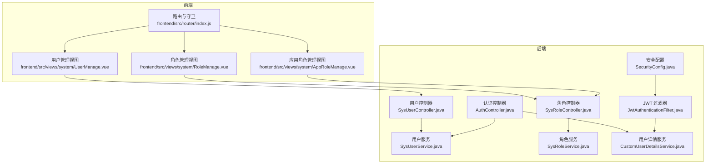
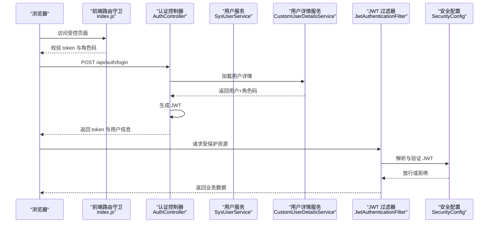
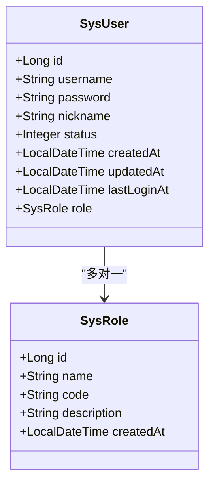
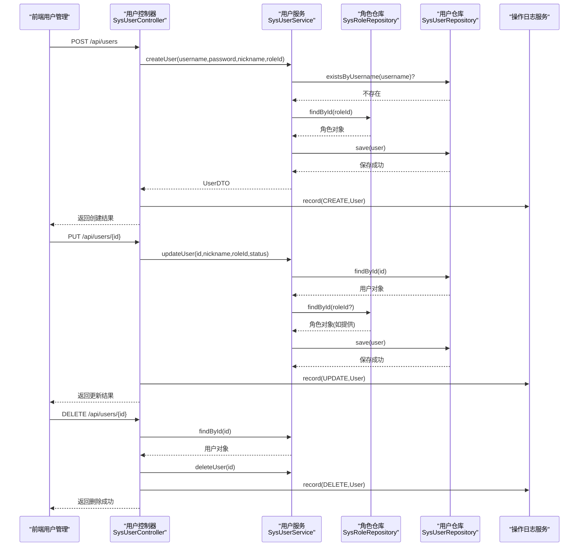
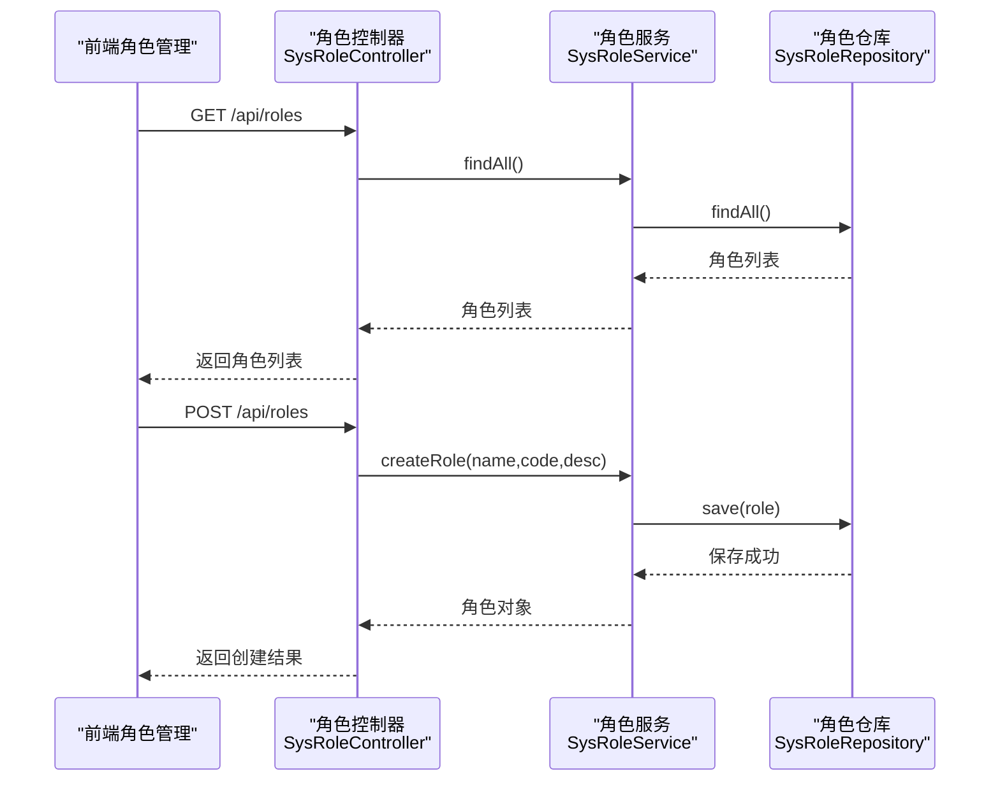
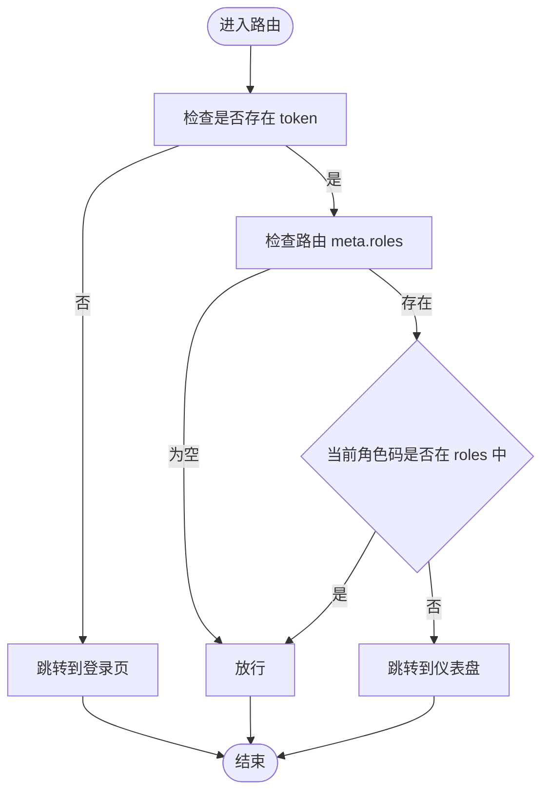
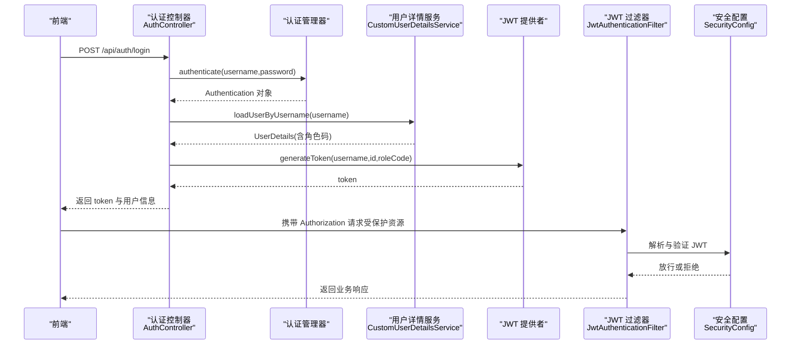
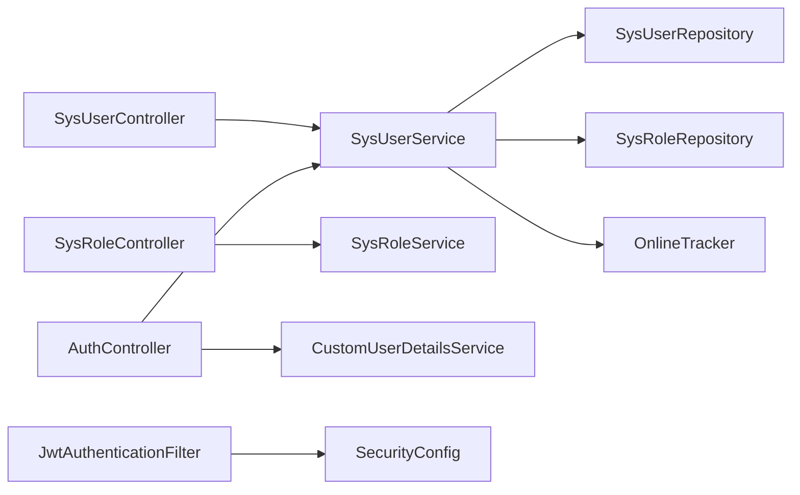

# 用户与角色管理

<cite>
**本文引用的文件**
- [SysUserController.java](file://src/main/java/com/superpower/modules/system/controller/SysUserController.java)
- [SysUserService.java](file://src/main/java/com/superpower/modules/system/service/SysUserService.java)
- [SysRoleController.java](file://src/main/java/com/superpower/modules/system/controller/SysRoleController.java)
- [SysRoleService.java](file://src/main/java/com/superpower/modules/system/service/SysRoleService.java)
- [SysUser.java](file://src/main/java/com/superpower/modules/system/entity/SysUser.java)
- [SysRole.java](file://src/main/java/com/superpower/modules/system/entity/SysRole.java)
- [AuthController.java](file://src/main/java/com/superpower/modules/system/controller/AuthController.java)
- [CustomUserDetailsService.java](file://src/main/java/com/superpower/security/CustomUserDetailsService.java)
- [JwtAuthenticationFilter.java](file://src/main/java/com/superpower/security/JwtAuthenticationFilter.java)
- [SecurityConfig.java](file://src/main/java/com/superpower/config/SecurityConfig.java)
- [index.js](file://frontend/src/router/index.js)
- [UserManage.vue](file://frontend/src/views/system/UserManage.vue)
- [RoleManage.vue](file://frontend/src/views/system/RoleManage.vue)
- [AppRoleManage.vue](file://frontend/src/views/system/AppRoleManage.vue)
- [operation_log 表结构脚本](file://db_changes/V1.0.6_add_last_login_at_and_operation_log.sql)
- [LoginResponse.java](file://src/main/java/com/superpower/modules/system/dto/LoginResponse.java)
</cite>

## 目录
1. [简介](#简介)
2. [项目结构](#项目结构)
3. [核心组件](#核心组件)
4. [架构总览](#架构总览)
5. [详细组件分析](#详细组件分析)
6. [依赖分析](#依赖分析)
7. [性能考虑](#性能考虑)
8. [故障排查指南](#故障排查指南)
9. [结论](#结论)
10. [附录](#附录)

## 简介
本技术文档聚焦于“用户与角色管理”页面及其背后的技术实现，覆盖以下目标：
- 用户管理：用户信息的增删改查与状态管理
- 角色管理：角色的创建与查询
- 应用角色管理：基于角色代码的权限控制与路由守卫
- 权限体系：角色与权限映射、动态权限控制
- 认证与授权：JWT 登录、在线追踪、操作日志
- 安全防护：密码加密、会话与访问控制

## 项目结构
后端采用 Spring Boot 分层架构，系统模块位于 src/main/java/com/superpower/modules/system 下，包含控制器、服务、实体与仓库；前端位于 frontend/src，包含用户管理、角色管理与应用角色管理视图及路由配置。

图表来源
- [index.js:111-128](file://frontend/src/router/index.js#L111-L128)
- [UserManage.vue:90-136](file://frontend/src/views/system/UserManage.vue#L90-L136)
- [RoleManage.vue](file://frontend/src/views/system/RoleManage.vue)
- [AppRoleManage.vue](file://frontend/src/views/system/AppRoleManage.vue)
- [AuthController.java:44-60](file://src/main/java/com/superpower/modules/system/controller/AuthController.java#L44-L60)
- [SysUserController.java:26-57](file://src/main/java/com/superpower/modules/system/controller/SysUserController.java#L26-L57)
- [SysRoleController.java:20-28](file://src/main/java/com/superpower/modules/system/controller/SysRoleController.java#L20-L28)
- [SysUserService.java:50-98](file://src/main/java/com/superpower/modules/system/service/SysUserService.java#L50-L98)
- [SysRoleService.java:18-33](file://src/main/java/com/superpower/modules/system/service/SysRoleService.java#L18-L33)
- [SecurityConfig.java](file://src/main/java/com/superpower/config/SecurityConfig.java)
- [JwtAuthenticationFilter.java](file://src/main/java/com/superpower/security/JwtAuthenticationFilter.java)
- [CustomUserDetailsService.java:23-36](file://src/main/java/com/superpower/security/CustomUserDetailsService.java#L23-L36)

章节来源
- [index.js:111-128](file://frontend/src/router/index.js#L111-L128)
- [UserManage.vue:90-136](file://frontend/src/views/system/UserManage.vue#L90-L136)
- [RoleManage.vue](file://frontend/src/views/system/RoleManage.vue)
- [AppRoleManage.vue](file://frontend/src/views/system/AppRoleManage.vue)
- [AuthController.java:44-60](file://src/main/java/com/superpower/modules/system/controller/AuthController.java#L44-L60)
- [SysUserController.java:26-57](file://src/main/java/com/superpower/modules/system/controller/SysUserController.java#L26-L57)
- [SysRoleController.java:20-28](file://src/main/java/com/superpower/modules/system/controller/SysRoleController.java#L20-L28)
- [SysUserService.java:50-98](file://src/main/java/com/superpower/modules/system/service/SysUserService.java#L50-L98)
- [SysRoleService.java:18-33](file://src/main/java/com/superpower/modules/system/service/SysRoleService.java#L18-L33)
- [SecurityConfig.java](file://src/main/java/com/superpower/config/SecurityConfig.java)
- [JwtAuthenticationFilter.java](file://src/main/java/com/superpower/security/JwtAuthenticationFilter.java)
- [CustomUserDetailsService.java:23-36](file://src/main/java/com/superpower/security/CustomUserDetailsService.java#L23-L36)

## 核心组件
- 用户控制器与服务：提供用户 CRUD、状态更新、密码修改与昵称更新，并将实体转换为 DTO 返回
- 角色控制器与服务：提供角色列表查询与创建
- 认证控制器：基于用户名/密码进行认证，签发 JWT，记录登录日志与在线状态
- 安全组件：自定义用户详情服务、JWT 过滤器与安全配置，完成角色到权限的映射与拦截
- 前端路由与视图：用户管理、角色管理与应用角色管理页面，配合路由守卫实现基于角色码的访问控制

章节来源
- [SysUserController.java:26-57](file://src/main/java/com/superpower/modules/system/controller/SysUserController.java#L26-L57)
- [SysUserService.java:50-98](file://src/main/java/com/superpower/modules/system/service/SysUserService.java#L50-L98)
- [SysRoleController.java:20-28](file://src/main/java/com/superpower/modules/system/controller/SysRoleController.java#L20-L28)
- [SysRoleService.java:18-33](file://src/main/java/com/superpower/modules/system/service/SysRoleService.java#L18-L33)
- [AuthController.java:44-60](file://src/main/java/com/superpower/modules/system/controller/AuthController.java#L44-L60)
- [CustomUserDetailsService.java:23-36](file://src/main/java/com/superpower/security/CustomUserDetailsService.java#L23-L36)
- [JwtAuthenticationFilter.java](file://src/main/java/com/superpower/security/JwtAuthenticationFilter.java)
- [SecurityConfig.java](file://src/main/java/com/superpower/config/SecurityConfig.java)
- [index.js:111-128](file://frontend/src/router/index.js#L111-L128)

## 架构总览
下图展示从浏览器到后端的关键交互路径，包括认证、授权与业务处理：

图表来源
- [index.js:111-128](file://frontend/src/router/index.js#L111-L128)
- [AuthController.java:44-60](file://src/main/java/com/superpower/modules/system/controller/AuthController.java#L44-L60)
- [CustomUserDetailsService.java:23-36](file://src/main/java/com/superpower/security/CustomUserDetailsService.java#L23-L36)
- [JwtAuthenticationFilter.java](file://src/main/java/com/superpower/security/JwtAuthenticationFilter.java)
- [SecurityConfig.java](file://src/main/java/com/superpower/config/SecurityConfig.java)

## 详细组件分析

### 用户管理模块
- 功能点
  - 列表查询：获取所有用户并转换为 DTO
  - 创建用户：校验用户名唯一性，设置角色与默认状态，返回 DTO
  - 编辑用户：支持更新昵称、角色与状态
  - 删除用户：删除指定用户
  - 操作日志：对创建、更新、删除操作进行记录
- 数据模型
  - 用户实体包含用户名、密码、昵称、角色、状态、时间戳与最后登录时间
  - 角色与用户为多对一关系（用户拥有一个角色）
- 安全与日志
  - 更新与删除均记录操作日志，便于审计
  - 在线状态由在线追踪器提供，用于前端显示

图表来源
- [SysUser.java:10-39](file://src/main/java/com/superpower/modules/system/entity/SysUser.java#L10-L39)
- [SysRole.java:10-26](file://src/main/java/com/superpower/modules/system/entity/SysRole.java#L10-L26)

图表来源
- [SysUserController.java:32-56](file://src/main/java/com/superpower/modules/system/controller/SysUserController.java#L32-L56)
- [SysUserService.java:50-98](file://src/main/java/com/superpower/modules/system/service/SysUserService.java#L50-L98)
- [SysRoleService.java:22-33](file://src/main/java/com/superpower/modules/system/service/SysRoleService.java#L22-L33)

章节来源
- [SysUserController.java:26-57](file://src/main/java/com/superpower/modules/system/controller/SysUserController.java#L26-L57)
- [SysUserService.java:50-98](file://src/main/java/com/superpower/modules/system/service/SysUserService.java#L50-L98)
- [SysUser.java:10-39](file://src/main/java/com/superpower/modules/system/entity/SysUser.java#L10-L39)
- [SysRole.java:10-26](file://src/main/java/com/superpower/modules/system/entity/SysRole.java#L10-L26)

### 角色管理模块
- 功能点
  - 获取全部角色列表
  - 创建角色（名称、编码、描述）
- 设计要点
  - 角色编码作为权限标识，用于前端路由守卫与后端鉴权
  - 角色与用户为多对一关系，用户通过角色获得权限集合

图表来源
- [SysRoleController.java:20-28](file://src/main/java/com/superpower/modules/system/controller/SysRoleController.java#L20-L28)
- [SysRoleService.java:18-33](file://src/main/java/com/superpower/modules/system/service/SysRoleService.java#L18-L33)

章节来源
- [SysRoleController.java:20-28](file://src/main/java/com/superpower/modules/system/controller/SysRoleController.java#L20-L28)
- [SysRoleService.java:18-33](file://src/main/java/com/superpower/modules/system/service/SysRoleService.java#L18-L33)

### 应用角色管理（前端路由与权限）
- 路由守卫逻辑
  - 若未携带 token，则重定向至登录页
  - 若路由 meta.roles 包含角色码，且当前用户角色码不在其中，则跳转到仪表盘
- 角色码来源
  - 登录成功后，后端返回角色码，前端存入本地存储并在守卫中读取
- 作用
  - 在前端层面快速过滤不可见/不可访问的菜单与页面，提升用户体验与安全性

图表来源
- [index.js:111-128](file://frontend/src/router/index.js#L111-L128)
- [LoginResponse.java:8-15](file://src/main/java/com/superpower/modules/system/dto/LoginResponse.java#L8-L15)

章节来源
- [index.js:111-128](file://frontend/src/router/index.js#L111-L128)
- [LoginResponse.java:8-15](file://src/main/java/com/superpower/modules/system/dto/LoginResponse.java#L8-L15)

### 认证与授权流程
- 登录流程
  - 前端提交用户名/密码
  - 后端使用认证管理器进行认证
  - 自定义用户详情服务根据用户的角色编码构建权限
  - 生成 JWT 并返回给前端
  - 记录登录日志与在线状态
- 授权流程
  - 前端在请求头携带 JWT
  - JWT 过滤器解析与验证令牌
  - 安全配置决定放行或拒绝
  - 用户详情服务将角色码映射为权限，供后端方法级鉴权使用

图表来源
- [AuthController.java:44-60](file://src/main/java/com/superpower/modules/system/controller/AuthController.java#L44-L60)
- [CustomUserDetailsService.java:23-36](file://src/main/java/com/superpower/security/CustomUserDetailsService.java#L23-L36)
- [JwtAuthenticationFilter.java](file://src/main/java/com/superpower/security/JwtAuthenticationFilter.java)
- [SecurityConfig.java](file://src/main/java/com/superpower/config/SecurityConfig.java)

章节来源
- [AuthController.java:44-60](file://src/main/java/com/superpower/modules/system/controller/AuthController.java#L44-L60)
- [CustomUserDetailsService.java:23-36](file://src/main/java/com/superpower/security/CustomUserDetailsService.java#L23-L36)
- [JwtAuthenticationFilter.java](file://src/main/java/com/superpower/security/JwtAuthenticationFilter.java)
- [SecurityConfig.java](file://src/main/java/com/superpower/config/SecurityConfig.java)

### 操作日志与审计
- 日志表结构
  - 包含用户标识、用户名、操作类型、模块、描述、目标 ID/类型、IP 与创建时间
  - 为用户管理的创建、更新、删除操作提供审计依据
- 使用场景
  - 追踪管理员行为、协助安全审计与问题定位

章节来源
- [operation_log 表结构脚本:3-16](file://db_changes/V1.0.6_add_last_login_at_and_operation_log.sql#L3-L16)
- [SysUserController.java:36-55](file://src/main/java/com/superpower/modules/system/controller/SysUserController.java#L36-L55)

## 依赖分析
- 组件耦合
  - 控制器依赖服务，服务依赖仓库与工具类（如密码编码器、在线追踪器）
  - 安全组件相互协作：用户详情服务负责角色码到权限的映射，JWT 过滤器与安全配置负责令牌解析与放行策略
- 外部依赖
  - Spring Security、JWT、数据库（SQLite/PostgreSQL）

图表来源
- [SysUserController.java:21-24](file://src/main/java/com/superpower/modules/system/controller/SysUserController.java#L21-L24)
- [SysRoleController.java:16-18](file://src/main/java/com/superpower/modules/system/controller/SysRoleController.java#L16-L18)
- [AuthController.java:32-42](file://src/main/java/com/superpower/modules/system/controller/AuthController.java#L32-L42)
- [SysUserService.java:23-31](file://src/main/java/com/superpower/modules/system/service/SysUserService.java#L23-L31)
- [CustomUserDetailsService.java:19-21](file://src/main/java/com/superpower/security/CustomUserDetailsService.java#L19-L21)
- [JwtAuthenticationFilter.java](file://src/main/java/com/superpower/security/JwtAuthenticationFilter.java)
- [SecurityConfig.java](file://src/main/java/com/superpower/config/SecurityConfig.java)

章节来源
- [SysUserController.java:21-24](file://src/main/java/com/superpower/modules/system/controller/SysUserController.java#L21-L24)
- [SysRoleController.java:16-18](file://src/main/java/com/superpower/modules/system/controller/SysRoleController.java#L16-L18)
- [AuthController.java:32-42](file://src/main/java/com/superpower/modules/system/controller/AuthController.java#L32-L42)
- [SysUserService.java:23-31](file://src/main/java/com/superpower/modules/system/service/SysUserService.java#L23-L31)
- [CustomUserDetailsService.java:19-21](file://src/main/java/com/superpower/security/CustomUserDetailsService.java#L19-L21)
- [JwtAuthenticationFilter.java](file://src/main/java/com/superpower/security/JwtAuthenticationFilter.java)
- [SecurityConfig.java](file://src/main/java/com/superpower/config/SecurityConfig.java)

## 性能考虑
- 查询优化
  - 用户列表与角色列表建议分页与缓存热点数据
  - DTO 转换避免 N+1 查询，确保懒加载与 EAGER 关系合理使用
- 密码安全
  - 使用强哈希算法（如 BCrypt）进行密码存储
- 令牌与会话
  - 合理设置 JWT 过期时间，结合刷新令牌策略
  - 在线追踪器应具备过期清理机制，避免内存泄漏
- 日志与审计
  - 操作日志写入异步化，避免阻塞主业务线程

## 故障排查指南
- 用户名重复
  - 现象：创建用户时报错“用户名已存在”
  - 处理：检查用户名唯一性校验与数据库约束
- 角色不存在
  - 现象：更新用户时报错“角色不存在”
  - 处理：确认角色 ID 正确性与角色仓库数据一致性
- 密码错误
  - 现象：修改密码时报错“当前密码不正确”
  - 处理：确认旧密码匹配与密码编码器配置
- 登录失败
  - 现象：登录后无法访问受保护资源
  - 处理：检查 JWT 生成与解析、安全配置与过滤器链
- 前端无权限
  - 现象：访问页面被重定向到仪表盘
  - 处理：确认登录后角色码是否正确写入本地存储，路由守卫逻辑是否生效

章节来源
- [SysUserService.java:50-98](file://src/main/java/com/superpower/modules/system/service/SysUserService.java#L50-L98)
- [SysUserController.java:32-56](file://src/main/java/com/superpower/modules/system/controller/SysUserController.java#L32-L56)
- [AuthController.java:44-60](file://src/main/java/com/superpower/modules/system/controller/AuthController.java#L44-L60)
- [index.js:111-128](file://frontend/src/router/index.js#L111-L128)

## 结论
本方案以角色编码为核心，结合前端路由守卫与后端方法级鉴权，形成统一的权限控制体系。用户管理与角色管理模块职责清晰，配合操作日志与在线追踪，满足日常运维与安全审计需求。后续可在权限细化、令牌刷新与缓存策略方面进一步优化。

## 附录
- 前端页面
  - 用户管理：UserManage.vue
  - 角色管理：RoleManage.vue
  - 应用角色管理：AppRoleManage.vue
- 关键接口
  - 用户：GET/POST/PUT/DELETE /api/users
  - 角色：GET/POST /api/roles
  - 认证：POST /api/auth/login
- 数据库脚本
  - 操作日志表与 last_login_at 字段

章节来源
- [UserManage.vue:90-136](file://frontend/src/views/system/UserManage.vue#L90-L136)
- [RoleManage.vue](file://frontend/src/views/system/RoleManage.vue)
- [AppRoleManage.vue](file://frontend/src/views/system/AppRoleManage.vue)
- [SysUserController.java:26-57](file://src/main/java/com/superpower/modules/system/controller/SysUserController.java#L26-L57)
- [SysRoleController.java:20-28](file://src/main/java/com/superpower/modules/system/controller/SysRoleController.java#L20-L28)
- [AuthController.java:44-60](file://src/main/java/com/superpower/modules/system/controller/AuthController.java#L44-L60)
- [operation_log 表结构脚本:3-16](file://db_changes/V1.0.6_add_last_login_at_and_operation_log.sql#L3-L16)