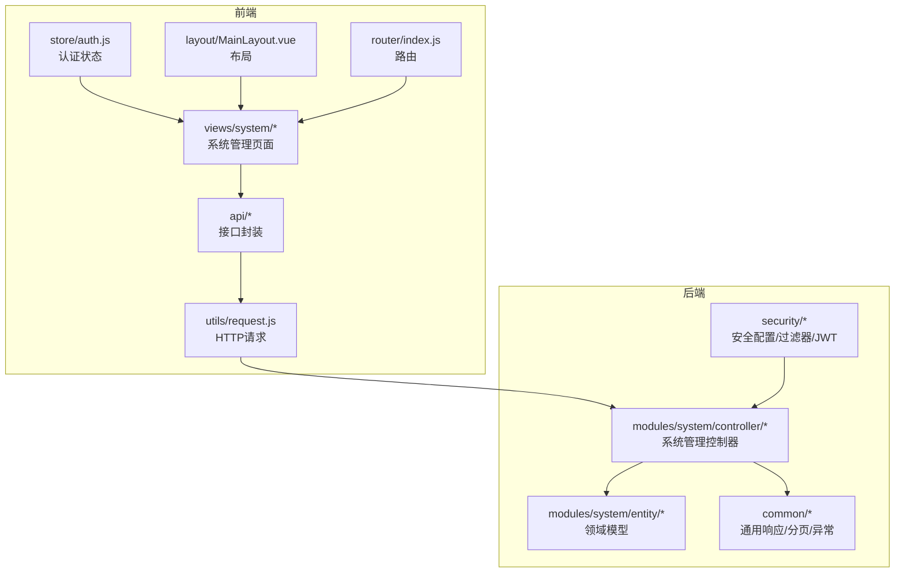
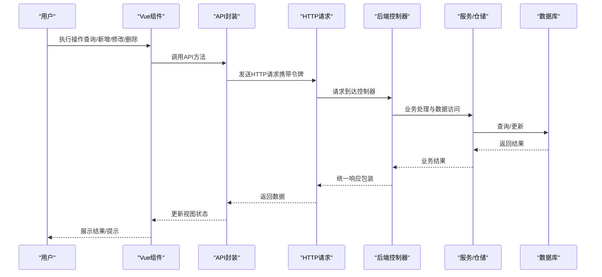
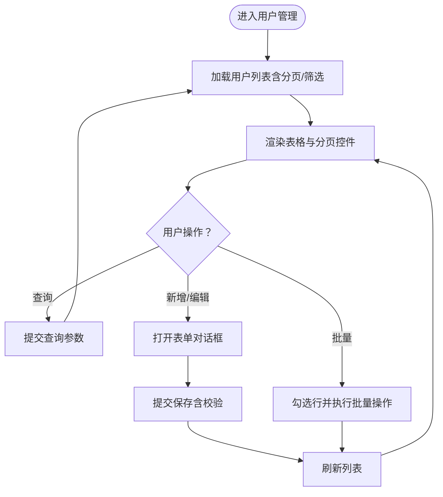
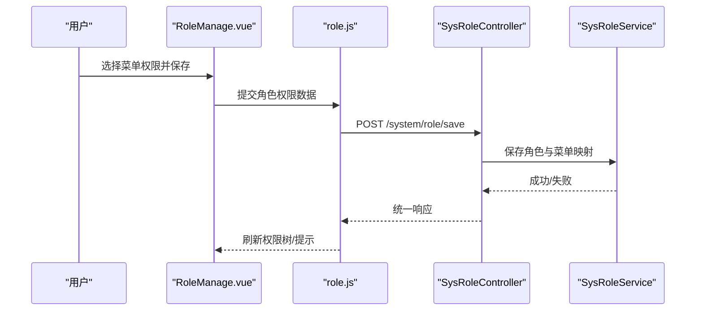
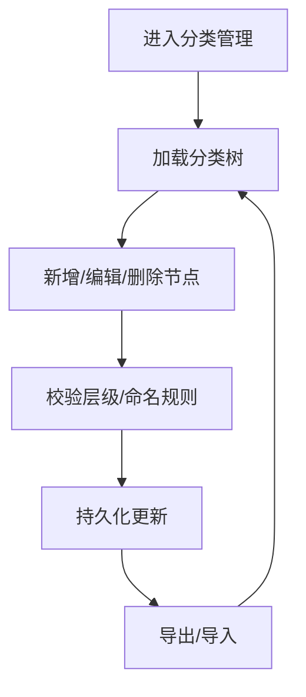
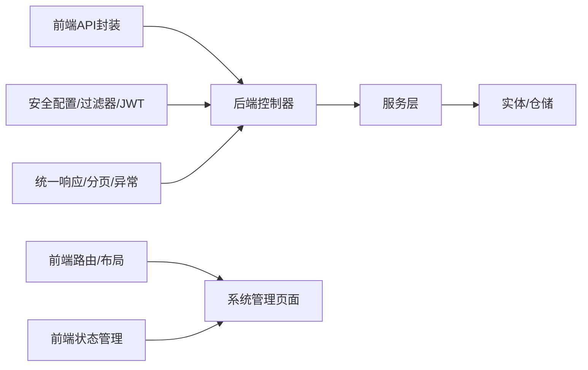

# 系统管理页面

<cite>
**本文引用的文件**
- [AppRoleManage.vue](file://frontend/src/views/system/AppRoleManage.vue)
- [BaseDataManage.vue](file://frontend/src/views/system/BaseDataManage.vue)
- [ImageGallery.vue](file://frontend/src/views/system/ImageGallery.vue)
- [OptionManage.vue](file://frontend/src/views/system/OptionManage.vue)
- [ProductCategoryManage.vue](file://frontend/src/views/system/ProductCategoryManage.vue)
- [RoleManage.vue](file://frontend/src/views/system/RoleManage.vue)
- [SolutionManage.vue](file://frontend/src/views/system/SolutionManage.vue)
- [SpecialOps.vue](file://frontend/src/views/system/SpecialOps.vue)
- [UserManage.vue](file://frontend/src/views/system/UserManage.vue)
- [VersionManage.vue](file://frontend/src/views/system/VersionManage.vue)
- [auth.js](file://frontend/src/api/auth.js)
- [category.js](file://frontend/src/api/category.js)
- [maintenance.js](file://frontend/src/api/maintenance.js)
- [operationLog.js](file://frontend/src/api/operationLog.js)
- [role.js](file://frontend/src/api/role.js)
- [user.js](file://frontend/src/api/user.js)
- [version.js](file://frontend/src/api/version.js)
- [request.js](file://frontend/src/utils/request.js)
- [MainLayout.vue](file://frontend/src/layout/MainLayout.vue)
- [index.js](file://frontend/src/router/index.js)
- [auth.js](file://frontend/src/store/auth.js)
- [SysUserController.java](file://src/main/java/com/superpower/modules/system/controller/SysUserController.java)
- [SysRoleController.java](file://src/main/java/com/superpower/modules/system/controller/SysRoleController.java)
- [MaintenanceController.java](file://src/main/java/com/superpower/modules/system/controller/MaintenanceController.java)
- [OperationLogController.java](file://src/main/java/com/superpower/modules/system/controller/OperationLogController.java)
- [AuthController.java](file://src/main/java/com/superpower/modules/system/controller/AuthController.java)
- [SysUser.java](file://src/main/java/com/superpower/modules/system/entity/SysUser.java)
- [SysRole.java](file://src/main/java/com/superpower/modules/system/entity/SysRole.java)
- [OperationLog.java](file://src/main/java/com/superpower/modules/system/entity/OperationLog.java)
- [SecurityConfig.java](file://src/main/java/com/superpower/config/SecurityConfig.java)
- [JwtAuthenticationFilter.java](file://src/main/java/com/superpower/security/JwtAuthenticationFilter.java)
- [JwtTokenProvider.java](file://src/main/java/com/superpower/security/JwtTokenProvider.java)
- [CustomUserDetailsService.java](file://src/main/java/com/superpower/security/CustomUserDetailsService.java)
- [GlobalExceptionHandler.java](file://src/main/java/com/superpower/common/GlobalExceptionHandler.java)
- [PageResult.java](file://src/main/java/com/superpower/common/PageResult.java)
- [Result.java](file://src/main/java/com/superpower/common/Result.java)
- [ResultCode.java](file://src/main/java/com/superpower/common/ResultCode.java)
</cite>

## 目录
1. [简介](#简介)
2. [项目结构](#项目结构)
3. [核心组件](#核心组件)
4. [架构总览](#架构总览)
5. [详细组件分析](#详细组件分析)
6. [依赖分析](#依赖分析)
7. [性能考虑](#性能考虑)
8. [故障排查指南](#故障排查指南)
9. [结论](#结论)
10. [附录](#附录)

## 简介
本技术文档聚焦于系统管理页面的实现与扩展，覆盖产品分类管理、用户权限管理、基础数据维护等关键功能模块。文档从前端Vue组件、API封装、状态管理到后端控制器与安全配置进行全链路解析，重点阐述表格组件的数据绑定、分页处理、搜索过滤、权限控制、数据验证与批量操作的实现方式，并提供可复用的组件模式与扩展开发建议，帮助开发者快速构建企业级管理系统界面。

## 项目结构
系统管理页面位于前端views/system目录下，采用按功能划分的单页应用组织方式；后端在modules/system中提供对应的控制器、实体与服务层，配合统一的响应包装与全局异常处理。

**图表来源**
- [AppRoleManage.vue](file://frontend/src/views/system/AppRoleManage.vue)
- [auth.js](file://frontend/src/api/auth.js)
- [MainLayout.vue](file://frontend/src/layout/MainLayout.vue)
- [index.js](file://frontend/src/router/index.js)
- [request.js](file://frontend/src/utils/request.js)
- [SysUserController.java](file://src/main/java/com/superpower/modules/system/controller/SysUserController.java)
- [SysRoleController.java](file://src/main/java/com/superpower/modules/system/controller/SysRoleController.java)
- [SecurityConfig.java](file://src/main/java/com/superpower/config/SecurityConfig.java)

**章节来源**
- [AppRoleManage.vue](file://frontend/src/views/system/AppRoleManage.vue)
- [BaseDataManage.vue](file://frontend/src/views/system/BaseDataManage.vue)
- [ImageGallery.vue](file://frontend/src/views/system/ImageGallery.vue)
- [OptionManage.vue](file://frontend/src/views/system/OptionManage.vue)
- [ProductCategoryManage.vue](file://frontend/src/views/system/ProductCategoryManage.vue)
- [RoleManage.vue](file://frontend/src/views/system/RoleManage.vue)
- [SolutionManage.vue](file://frontend/src/views/system/SolutionManage.vue)
- [SpecialOps.vue](file://frontend/src/views/system/SpecialOps.vue)
- [UserManage.vue](file://frontend/src/views/system/UserManage.vue)
- [VersionManage.vue](file://frontend/src/views/system/VersionManage.vue)
- [auth.js](file://frontend/src/api/auth.js)
- [category.js](file://frontend/src/api/category.js)
- [maintenance.js](file://frontend/src/api/maintenance.js)
- [operationLog.js](file://frontend/src/api/operationLog.js)
- [role.js](file://frontend/src/api/role.js)
- [user.js](file://frontend/src/api/user.js)
- [version.js](file://frontend/src/api/version.js)
- [request.js](file://frontend/src/utils/request.js)
- [MainLayout.vue](file://frontend/src/layout/MainLayout.vue)
- [index.js](file://frontend/src/router/index.js)
- [auth.js](file://frontend/src/store/auth.js)
- [SysUserController.java](file://src/main/java/com/superpower/modules/system/controller/SysUserController.java)
- [SysRoleController.java](file://src/main/java/com/superpower/modules/system/controller/SysRoleController.java)
- [MaintenanceController.java](file://src/main/java/com/superpower/modules/system/controller/MaintenanceController.java)
- [OperationLogController.java](file://src/main/java/com/superpower/modules/system/controller/OperationLogController.java)
- [AuthController.java](file://src/main/java/com/superpower/modules/system/controller/AuthController.java)
- [SysUser.java](file://src/main/java/com/superpower/modules/system/entity/SysUser.java)
- [SysRole.java](file://src/main/java/com/superpower/modules/system/entity/SysRole.java)
- [OperationLog.java](file://src/main/java/com/superpower/modules/system/entity/OperationLog.java)
- [SecurityConfig.java](file://src/main/java/com/superpower/config/SecurityConfig.java)
- [JwtAuthenticationFilter.java](file://src/main/java/com/superpower/security/JwtAuthenticationFilter.java)
- [JwtTokenProvider.java](file://src/main/java/com/superpower/security/JwtTokenProvider.java)
- [CustomUserDetailsService.java](file://src/main/java/com/superpower/security/CustomUserDetailsService.java)
- [GlobalExceptionHandler.java](file://src/main/java/com/superpower/common/GlobalExceptionHandler.java)
- [PageResult.java](file://src/main/java/com/superpower/common/PageResult.java)
- [Result.java](file://src/main/java/com/superpower/common/Result.java)
- [ResultCode.java](file://src/main/java/com/superpower/common/ResultCode.java)

## 核心组件
- 用户管理：负责用户增删改查、角色分配、状态切换与批量操作。
- 角色管理：维护角色权限矩阵、角色与菜单关联及权限校验。
- 产品分类管理：树形结构展示与编辑、层级关系维护与批量导入导出。
- 基础数据维护：选项值与字典项的集中管理与版本化控制。
- 版本管理：数据版本与应用版本的发布、回滚与一致性检查。
- 运维与日志：系统维护、操作审计与异常追踪。
- 图库管理：图片资源的浏览、迁移与目录结构管理。
- 解决方案与特殊运维：面向业务场景的专项功能入口。

**章节来源**
- [UserManage.vue](file://frontend/src/views/system/UserManage.vue)
- [RoleManage.vue](file://frontend/src/views/system/RoleManage.vue)
- [ProductCategoryManage.vue](file://frontend/src/views/system/ProductCategoryManage.vue)
- [BaseDataManage.vue](file://frontend/src/views/system/BaseDataManage.vue)
- [VersionManage.vue](file://frontend/src/views/system/VersionManage.vue)
- [maintenance.js](file://frontend/src/api/maintenance.js)
- [operationLog.js](file://frontend/src/api/operationLog.js)
- [ImageGallery.vue](file://frontend/src/views/system/ImageGallery.vue)
- [SolutionManage.vue](file://frontend/src/views/system/SolutionManage.vue)
- [SpecialOps.vue](file://frontend/src/views/system/SpecialOps.vue)

## 架构总览
系统采用前后端分离架构：前端通过封装的API模块调用后端REST接口，统一使用HTTP拦截器进行鉴权与错误处理；后端以Spring MVC控制器为核心，结合安全过滤器链与JWT完成认证授权；通用响应体与分页结果用于标准化输出。

**图表来源**
- [request.js](file://frontend/src/utils/request.js)
- [auth.js](file://frontend/src/api/auth.js)
- [SysUserController.java](file://src/main/java/com/superpower/modules/system/controller/SysUserController.java)
- [SysRoleController.java](file://src/main/java/com/superpower/modules/system/controller/SysRoleController.java)
- [MaintenanceController.java](file://src/main/java/com/superpower/modules/system/controller/MaintenanceController.java)
- [OperationLogController.java](file://src/main/java/com/superpower/modules/system/controller/OperationLogController.java)

## 详细组件分析

### 用户管理组件（UserManage.vue）
- 数据绑定：通过API获取用户列表并绑定至表格组件，支持多字段排序与本地筛选。
- 分页处理：后端返回分页对象，前端渲染页码条与每页数量选择。
- 搜索过滤：支持用户名、状态等条件组合查询，提交时自动拼装查询参数。
- 权限控制：仅管理员可见与操作；操作按钮根据当前用户权限动态显隐。
- 数据验证：表单提交前进行必填与格式校验，失败时弹出提示。
- 批量操作：支持勾选多行执行批量启用/禁用、重置密码等动作。
- 安全交互：所有请求通过HTTP拦截器注入认证头，异常统一由全局处理器捕获。

**图表来源**
- [UserManage.vue](file://frontend/src/views/system/UserManage.vue)
- [user.js](file://frontend/src/api/user.js)
- [SysUserController.java](file://src/main/java/com/superpower/modules/system/controller/SysUserController.java)
- [SysUser.java](file://src/main/java/com/superpower/modules/system/entity/SysUser.java)

**章节来源**
- [UserManage.vue](file://frontend/src/views/system/UserManage.vue)
- [user.js](file://frontend/src/api/user.js)
- [SysUserController.java](file://src/main/java/com/superpower/modules/system/controller/SysUserController.java)
- [SysUser.java](file://src/main/java/com/superpower/modules/system/entity/SysUser.java)

### 角色管理组件（RoleManage.vue）
- 角色树/列表：展示角色与菜单权限映射，支持展开/折叠与逐级授权。
- 权限矩阵：勾选菜单节点影响角色权限集合，保存时同步到后端。
- 数据验证：角色名唯一性校验，权限选择不能为空。
- 批量操作：支持批量删除角色并解除用户关联。
- 审计与日志：变更记录写入操作日志，便于追溯。

**图表来源**
- [RoleManage.vue](file://frontend/src/views/system/RoleManage.vue)
- [role.js](file://frontend/src/api/role.js)
- [SysRoleController.java](file://src/main/java/com/superpower/modules/system/controller/SysRoleController.java)
- [SysRole.java](file://src/main/java/com/superpower/modules/system/entity/SysRole.java)

**章节来源**
- [RoleManage.vue](file://frontend/src/views/system/RoleManage.vue)
- [role.js](file://frontend/src/api/role.js)
- [SysRoleController.java](file://src/main/java/com/superpower/modules/system/controller/SysRoleController.java)
- [SysRole.java](file://src/main/java/com/superpower/modules/system/entity/SysRole.java)

### 产品分类管理组件（ProductCategoryManage.vue）
- 树形结构：基于层级实体构建树形面板，支持拖拽调整父子关系。
- 编辑能力：新增/编辑/删除节点，联动更新缓存与持久化。
- 导入导出：支持批量导入与导出分类数据，校验格式与重复。
- 搜索过滤：按名称/层级/状态筛选，提升大体量数据下的可用性。
- 批量操作：批量删除或移动节点，确保事务一致性。

**图表来源**
- [ProductCategoryManage.vue](file://frontend/src/views/system/ProductCategoryManage.vue)
- [category.js](file://frontend/src/api/category.js)
- [SysUserController.java](file://src/main/java/com/superpower/modules/system/controller/SysUserController.java)

**章节来源**
- [ProductCategoryManage.vue](file://frontend/src/views/system/ProductCategoryManage.vue)
- [category.js](file://frontend/src/api/category.js)

### 基础数据维护组件（BaseDataManage.vue）
- 选项值管理：对字典项进行增删改查，支持分组与排序。
- 版本控制：每次变更生成新版本，支持对比与回滚。
- 批量导入：Excel模板导入，字段映射与重复键校验。
- 审计日志：记录变更人、时间与差异，便于合规审查。

**章节来源**
- [BaseDataManage.vue](file://frontend/src/views/system/BaseDataManage.vue)
- [option.js](file://frontend/src/api/option.js)

### 版本管理组件（VersionManage.vue）
- 应用版本：发布新版本、设置灰度策略、一键回滚。
- 数据版本：对关键数据集打版本标签，保障历史可追溯。
- 迁移与一致性：执行版本升级脚本，监控进度与异常。

**章节来源**
- [VersionManage.vue](file://frontend/src/views/system/VersionManage.vue)
- [version.js](file://frontend/src/api/version.js)
- [VersionController.java](file://src/main/java/com/superpower/modules/version/controller/AppVersionController.java)

### 运维与日志组件（SpecialOps.vue、OperationLogController）
- 特殊运维：清缓存、重建索引、修复任务等高危操作入口。
- 操作日志：记录用户行为轨迹，支持分页检索与导出。

**章节来源**
- [SpecialOps.vue](file://frontend/src/views/system/SpecialOps.vue)
- [operationLog.js](file://frontend/src/api/operationLog.js)
- [OperationLogController.java](file://src/main/java/com/superpower/modules/system/controller/OperationLogController.java)
- [OperationLog.java](file://src/main/java/com/superpower/modules/system/entity/OperationLog.java)

### 图库管理组件（ImageGallery.vue）
- 图片浏览：树状目录结构与缩略图网格展示。
- 迁移与修复：批量迁移图片目录、修复URL与元信息。
- 权限控制：仅授权用户可执行迁移与修复操作。

**章节来源**
- [ImageGallery.vue](file://frontend/src/views/system/ImageGallery.vue)
- [maintenance.js](file://frontend/src/api/maintenance.js)

## 依赖分析
- 前端依赖
  - API封装：统一请求与响应处理，集中注入认证头与错误处理。
  - 路由与布局：路由守卫结合认证状态控制页面访问。
  - 状态管理：认证信息存储与共享，驱动UI状态更新。
- 后端依赖
  - 控制器：接收请求、装配DTO、调用服务层。
  - 实体与仓储：映射数据库表结构，提供CRUD与复杂查询。
  - 安全：过滤器链、JWT令牌、用户详情加载与权限判定。
  - 通用：统一响应包装、分页结果、全局异常处理。

**图表来源**
- [request.js](file://frontend/src/utils/request.js)
- [index.js](file://frontend/src/router/index.js)
- [auth.js](file://frontend/src/store/auth.js)
- [SysUserController.java](file://src/main/java/com/superpower/modules/system/controller/SysUserController.java)
- [SysRoleController.java](file://src/main/java/com/superpower/modules/system/controller/SysRoleController.java)
- [SecurityConfig.java](file://src/main/java/com/superpower/config/SecurityConfig.java)
- [GlobalExceptionHandler.java](file://src/main/java/com/superpower/common/GlobalExceptionHandler.java)
- [PageResult.java](file://src/main/java/com/superpower/common/PageResult.java)
- [Result.java](file://src/main/java/com/superpower/common/Result.java)
- [ResultCode.java](file://src/main/java/com/superpower/common/ResultCode.java)

**章节来源**
- [request.js](file://frontend/src/utils/request.js)
- [index.js](file://frontend/src/router/index.js)
- [auth.js](file://frontend/src/store/auth.js)
- [SysUserController.java](file://src/main/java/com/superpower/modules/system/controller/SysUserController.java)
- [SysRoleController.java](file://src/main/java/com/superpower/modules/system/controller/SysRoleController.java)
- [SecurityConfig.java](file://src/main/java/com/superpower/config/SecurityConfig.java)
- [GlobalExceptionHandler.java](file://src/main/java/com/superpower/common/GlobalExceptionHandler.java)
- [PageResult.java](file://src/main/java/com/superpower/common/PageResult.java)
- [Result.java](file://src/main/java/com/superpower/common/Result.java)
- [ResultCode.java](file://src/main/java/com/superpower/common/ResultCode.java)

## 性能考虑
- 前端
  - 表格虚拟滚动：大数据量时启用虚拟滚动减少DOM开销。
  - 懒加载与分页：避免一次性拉取全部数据，按需加载。
  - 防抖搜索：输入防抖降低频繁请求压力。
  - 缓存策略：对只读数据进行内存缓存，减少重复请求。
- 后端
  - 分页查询：使用游标或LIMIT/OFFSET优化分页性能。
  - 索引与SQL优化：针对高频查询字段建立索引。
  - 幂等与批处理：批量操作使用事务与批处理提升吞吐。
  - 缓存与降级：热点数据引入Redis，异常时快速降级。

## 故障排查指南
- 认证失败
  - 确认令牌是否过期或被吊销；检查拦截器是否正确注入头。
  - 参考：[JwtAuthenticationFilter.java](file://src/main/java/com/superpower/security/JwtAuthenticationFilter.java)，[JwtTokenProvider.java](file://src/main/java/com/superpower/security/JwtTokenProvider.java)
- 接口异常
  - 查看统一异常处理返回码与消息，定位具体控制器与业务异常。
  - 参考：[GlobalExceptionHandler.java](file://src/main/java/com/superpower/common/GlobalExceptionHandler.java)，[ResultCode.java](file://src/main/java/com/superpower/common/ResultCode.java)
- 分页/搜索无效
  - 检查查询参数是否正确传递，确认后端分页对象是否返回。
  - 参考：[PageResult.java](file://src/main/java/com/superpower/common/PageResult.java)
- 权限不足
  - 核对用户角色与菜单权限映射，确认路由守卫与按钮级权限。
  - 参考：[SecurityConfig.java](file://src/main/java/com/superpower/config/SecurityConfig.java)，[CustomUserDetailsService.java](file://src/main/java/com/superpower/security/CustomUserDetailsService.java)

**章节来源**
- [JwtAuthenticationFilter.java](file://src/main/java/com/superpower/security/JwtAuthenticationFilter.java)
- [JwtTokenProvider.java](file://src/main/java/com/superpower/security/JwtTokenProvider.java)
- [GlobalExceptionHandler.java](file://src/main/java/com/superpower/common/GlobalExceptionHandler.java)
- [ResultCode.java](file://src/main/java/com/superpower/common/ResultCode.java)
- [PageResult.java](file://src/main/java/com/superpower/common/PageResult.java)
- [SecurityConfig.java](file://src/main/java/com/superpower/config/SecurityConfig.java)
- [CustomUserDetailsService.java](file://src/main/java/com/superpower/security/CustomUserDetailsService.java)

## 结论
系统管理页面通过清晰的前后端职责划分与统一的响应/安全规范，实现了用户权限、产品分类、基础数据、版本与运维等核心功能的稳定运行。建议在后续迭代中进一步完善表格虚拟化、搜索防抖与缓存策略，强化异常可观测性与自动化测试，持续提升系统的可维护性与用户体验。

## 附录
- 开发指南
  - 组件复用：将表格、分页、搜索、表单等通用逻辑抽象为可复用组件。
  - 扩展方案：新增页面遵循现有API封装与路由守卫模式，保持一致的权限与日志策略。
- 最佳实践
  - 前端：统一使用API封装与HTTP拦截器；后端：统一Result包装与分页返回。
  - 权限：菜单驱动权限，按钮级权限与路由守卫协同。
  - 日志：关键操作必须落库，支持检索与导出。