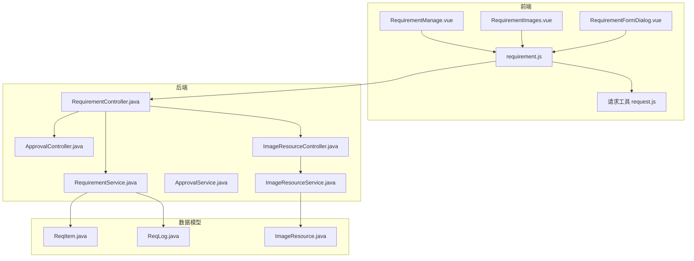
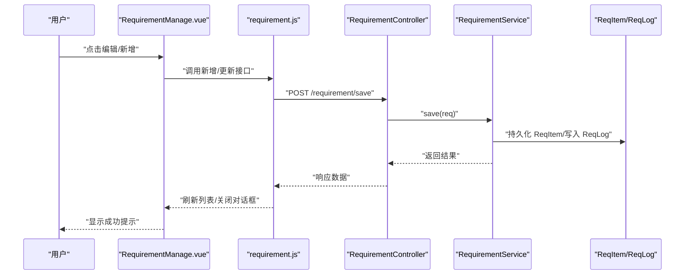
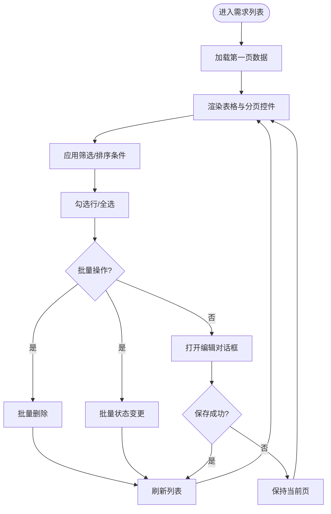
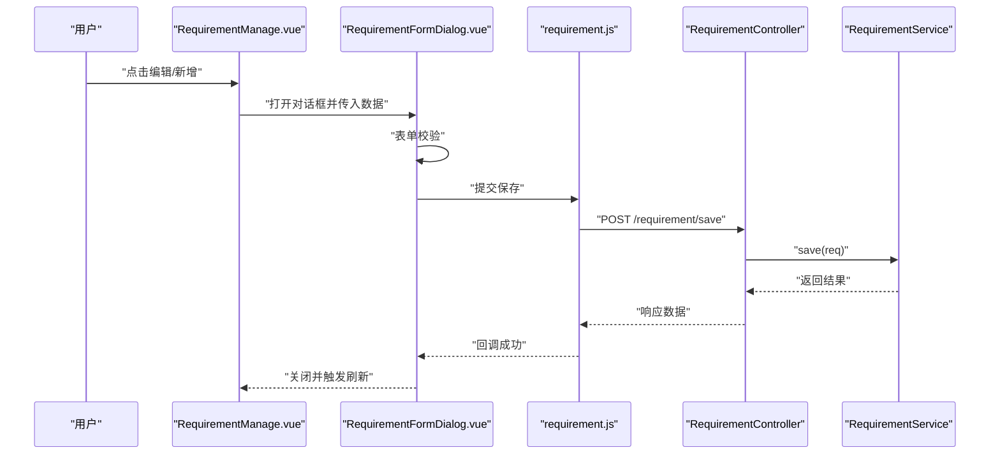
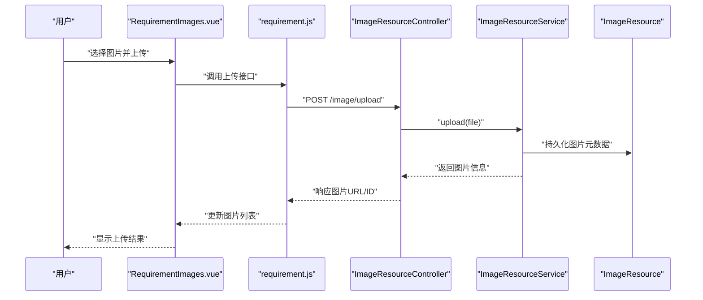
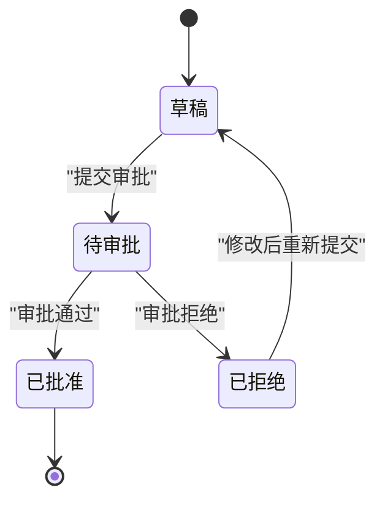
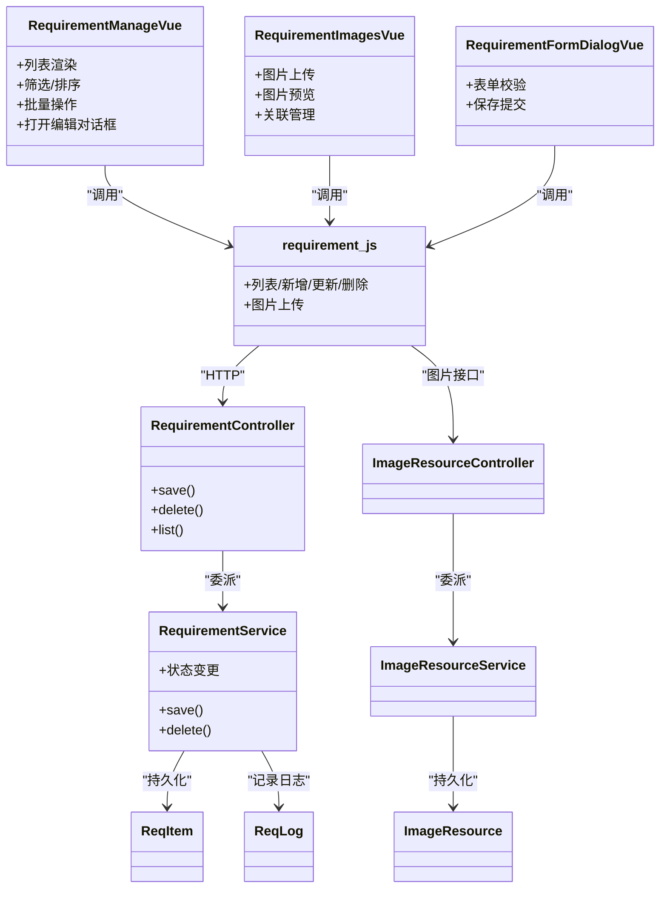

# 需求管理页面

<cite>
**本文引用的文件**
- [RequirementManage.vue](file://frontend/src/views/requirement/RequirementManage.vue)
- [RequirementImages.vue](file://frontend/src/views/requirement/RequirementImages.vue)
- [RequirementFormDialog.vue](file://frontend/src/components/RequirementFormDialog.vue)
- [requirement.js](file://frontend/src/api/requirement.js)
- [RequirementController.java](file://src/main/java/com/superpower/modules/requirement/controller/RequirementController.java)
- [RequirementService.java](file://src/main/java/com/superpower/modules/requirement/service/RequirementService.java)
- [ReqItem.java](file://src/main/java/com/superpower/modules/requirement/entity/ReqItem.java)
- [ReqLog.java](file://src/main/java/com/superpower/modules/requirement/entity/ReqLog.java)
- [ReqItemRepository.java](file://src/main/java/com/superpower/modules/requirement/repository/ReqItemRepository.java)
- [ReqLogRepository.java](file://src/main/java/com/superpower/modules/requirement/repository/ReqLogRepository.java)
- [ReqActionDTO.java](file://src/main/java/com/superpower/modules/requirement/dto/ReqActionDTO.java)
- [ReqItemDTO.java](file://src/main/java/com/superpower/modules/requirement/dto/ReqItemDTO.java)
- [ApprovalController.java](file://src/main/java/com/superpower/modules/approval/controller/ApprovalController.java)
- [ApprovalService.java](file://src/main/java/com/superpower/modules/approval/service/ApprovalService.java)
- [ImageResourceController.java](file://src/main/java/com/superpower/modules/image/controller/ImageResourceController.java)
- [ImageResourceService.java](file://src/main/java/com/superpower/modules/image/service/ImageResourceService.java)
- [ImageResource.java](file://src/main/java/com/superpower/modules/image/entity/ImageResource.java)
- [ImageResourceRepository.java](file://src/main/java/com/superpower/modules/image/repository/ImageResourceRepository.java)
- [request.js](file://frontend/src/utils/request.js)
- [router/index.js](file://frontend/src/router/index.js)
</cite>

## 目录
1. [简介](#简介)
2. [项目结构](#项目结构)
3. [核心组件](#核心组件)
4. [架构总览](#架构总览)
5. [详细组件分析](#详细组件分析)
6. [依赖关系分析](#依赖关系分析)
7. [性能考虑](#性能考虑)
8. [故障排除指南](#故障排除指南)
9. [结论](#结论)
10. [附录](#附录)

## 简介
本技术文档围绕“需求管理页面”展开，系统性解析前端视图组件、后端控制器与服务层、数据库实体及前后端接口之间的协作关系。重点覆盖以下方面：
- 需求列表展示：分页、筛选、排序与多选批量处理
- 需求编辑功能：新增、修改、删除与草稿保存
- 需求图片管理：图片上传、关联、预览与删除
- 需求状态管理：状态流转与审批集成
- 实时同步机制：基于轮询或事件驱动的更新策略
- 批量处理能力：批量删除、批量状态变更等
- 开发指南与扩展方案：组件设计模式、业务逻辑扩展与最佳实践

## 项目结构
前端采用 Vue 3 + Vite 架构，需求管理相关的核心文件位于 views/requirement 与 components 目录；后端模块化设计，需求管理由 requirement 模块提供 REST 接口，配合 approval 模块实现审批流程，image 模块提供图片资源管理。

图表来源
- [RequirementManage.vue](file://frontend/src/views/requirement/RequirementManage.vue)
- [RequirementImages.vue](file://frontend/src/views/requirement/RequirementImages.vue)
- [RequirementFormDialog.vue](file://frontend/src/components/RequirementFormDialog.vue)
- [requirement.js](file://frontend/src/api/requirement.js)
- [RequirementController.java](file://src/main/java/com/superpower/modules/requirement/controller/RequirementController.java)
- [RequirementService.java](file://src/main/java/com/superpower/modules/requirement/service/RequirementService.java)
- [ReqItem.java](file://src/main/java/com/superpower/modules/requirement/entity/ReqItem.java)
- [ReqLog.java](file://src/main/java/com/superpower/modules/requirement/entity/ReqLog.java)
- [ImageResourceController.java](file://src/main/java/com/superpower/modules/image/controller/ImageResourceController.java)
- [ImageResourceService.java](file://src/main/java/com/superpower/modules/image/service/ImageResourceService.java)
- [ImageResource.java](file://src/main/java/com/superpower/modules/image/entity/ImageResource.java)

章节来源
- [RequirementManage.vue](file://frontend/src/views/requirement/RequirementManage.vue)
- [RequirementImages.vue](file://frontend/src/views/requirement/RequirementImages.vue)
- [RequirementFormDialog.vue](file://frontend/src/components/RequirementFormDialog.vue)
- [requirement.js](file://frontend/src/api/requirement.js)
- [RequirementController.java](file://src/main/java/com/superpower/modules/requirement/controller/RequirementController.java)
- [RequirementService.java](file://src/main/java/com/superpower/modules/requirement/service/RequirementService.java)
- [ReqItem.java](file://src/main/java/com/superpower/modules/requirement/entity/ReqItem.java)
- [ReqLog.java](file://src/main/java/com/superpower/modules/requirement/entity/ReqLog.java)
- [ImageResourceController.java](file://src/main/java/com/superpower/modules/image/controller/ImageResourceController.java)
- [ImageResourceService.java](file://src/main/java/com/superpower/modules/image/service/ImageResourceService.java)
- [ImageResource.java](file://src/main/java/com/superpower/modules/image/entity/ImageResource.java)

## 核心组件
- RequirementManage.vue：需求列表主视图，负责分页查询、筛选、排序、多选勾选、批量操作（删除、状态变更）以及打开编辑对话框。
- RequirementImages.vue：需求图片管理视图，负责图片上传、关联、预览与删除。
- RequirementFormDialog.vue：需求表单对话框，支持新建与编辑，包含字段校验与提交。
- requirement.js：封装需求相关的 API 调用，包括列表、新增、修改、删除、图片上传等。
- RequirementController.java：后端需求管理入口，提供 REST 接口，委派给 RequirementService 处理业务。
- RequirementService.java：核心业务逻辑，处理需求项 CRUD、状态变更、日志记录与审批集成。
- ReqItem.java / ReqLog.java：需求项与操作日志实体，映射数据库表结构。
- ImageResourceController.java / ImageResourceService.java：图片资源管理，提供图片上传、目录树、URL 生成与清理。
- ApprovalController.java / ApprovalService.java：审批流程控制，与需求状态联动。

章节来源
- [RequirementManage.vue](file://frontend/src/views/requirement/RequirementManage.vue)
- [RequirementImages.vue](file://frontend/src/views/requirement/RequirementImages.vue)
- [RequirementFormDialog.vue](file://frontend/src/components/RequirementFormDialog.vue)
- [requirement.js](file://frontend/src/api/requirement.js)
- [RequirementController.java](file://src/main/java/com/superpower/modules/requirement/controller/RequirementController.java)
- [RequirementService.java](file://src/main/java/com/superpower/modules/requirement/service/RequirementService.java)
- [ReqItem.java](file://src/main/java/com/superpower/modules/requirement/entity/ReqItem.java)
- [ReqLog.java](file://src/main/java/com/superpower/modules/requirement/entity/ReqLog.java)
- [ImageResourceController.java](file://src/main/java/com/superpower/modules/image/controller/ImageResourceController.java)
- [ImageResourceService.java](file://src/main/java/com/superpower/modules/image/service/ImageResourceService.java)
- [ApprovalController.java](file://src/main/java/com/superpower/modules/approval/controller/ApprovalController.java)
- [ApprovalService.java](file://src/main/java/com/superpower/modules/approval/service/ApprovalService.java)

## 架构总览
前端通过 requirement.js 统一调用后端接口，后端以 MVC 分层实现：Controller 接收请求并参数校验，Service 层执行业务规则，Repository 访问数据库，Entity 映射表结构。图片管理独立于需求模块，但可被需求项引用。审批流程与需求状态联动，确保业务合规。

图表来源
- [RequirementManage.vue](file://frontend/src/views/requirement/RequirementManage.vue)
- [requirement.js](file://frontend/src/api/requirement.js)
- [RequirementController.java](file://src/main/java/com/superpower/modules/requirement/controller/RequirementController.java)
- [RequirementService.java](file://src/main/java/com/superpower/modules/requirement/service/RequirementService.java)
- [ReqItem.java](file://src/main/java/com/superpower/modules/requirement/entity/ReqItem.java)
- [ReqLog.java](file://src/main/java/com/superpower/modules/requirement/entity/ReqLog.java)

## 详细组件分析

### 需求列表展示（RequirementManage.vue）
职责与特性
- 列表渲染：分页加载、字段展示、行选择与全选
- 筛选与排序：按状态、标题、创建时间等条件过滤与排序
- 批量操作：批量删除、批量状态变更
- 编辑入口：打开 RequirementFormDialog 进行新增/编辑
- 图片入口：跳转至 RequirementImages.vue 查看与管理图片

数据流与交互
- 通过 requirement.js 的列表接口获取数据
- 使用本地状态维护选中项集合与当前页码
- 触发批量操作时，向后端发送批量请求并刷新列表

图表来源
- [RequirementManage.vue](file://frontend/src/views/requirement/RequirementManage.vue)
- [requirement.js](file://frontend/src/api/requirement.js)

章节来源
- [RequirementManage.vue](file://frontend/src/views/requirement/RequirementManage.vue)
- [requirement.js](file://frontend/src/api/requirement.js)

### 需求编辑功能（RequirementFormDialog.vue + RequirementManage.vue）
职责与特性
- 表单字段：标题、描述、状态、附件等
- 校验规则：必填、长度限制、格式校验
- 提交流程：新增或更新，提交后关闭对话框并刷新列表
- 与 RequirementManage.vue 协作：接收当前选中项用于编辑态初始化

图表来源
- [RequirementManage.vue](file://frontend/src/views/requirement/RequirementManage.vue)
- [RequirementFormDialog.vue](file://frontend/src/components/RequirementFormDialog.vue)
- [requirement.js](file://frontend/src/api/requirement.js)
- [RequirementController.java](file://src/main/java/com/superpower/modules/requirement/controller/RequirementController.java)
- [RequirementService.java](file://src/main/java/com/superpower/modules/requirement/service/RequirementService.java)

章节来源
- [RequirementFormDialog.vue](file://frontend/src/components/RequirementFormDialog.vue)
- [RequirementManage.vue](file://frontend/src/views/requirement/RequirementManage.vue)
- [requirement.js](file://frontend/src/api/requirement.js)

### 需求图片管理（RequirementImages.vue + requirement.js + ImageResourceController）
职责与特性
- 图片上传：支持多文件上传，自动关联到当前需求项
- 图片预览：缩略图展示，支持放大查看
- 关联管理：建立需求项与图片资源的关联关系
- 删除处理：删除图片资源并解除关联

图表来源
- [RequirementImages.vue](file://frontend/src/views/requirement/RequirementImages.vue)
- [requirement.js](file://frontend/src/api/requirement.js)
- [ImageResourceController.java](file://src/main/java/com/superpower/modules/image/controller/ImageResourceController.java)
- [ImageResourceService.java](file://src/main/java/com/superpower/modules/image/service/ImageResourceService.java)
- [ImageResource.java](file://src/main/java/com/superpower/modules/image/entity/ImageResource.java)

章节来源
- [RequirementImages.vue](file://frontend/src/views/requirement/RequirementImages.vue)
- [requirement.js](file://frontend/src/api/requirement.js)
- [ImageResourceController.java](file://src/main/java/com/superpower/modules/image/controller/ImageResourceController.java)
- [ImageResourceService.java](file://src/main/java/com/superpower/modules/image/service/ImageResourceService.java)
- [ImageResource.java](file://src/main/java/com/superpower/modules/image/entity/ImageResource.java)

### 需求状态管理与审批流程
职责与特性
- 状态定义：如草稿、待审批、已批准、已拒绝等
- 状态流转：根据业务规则允许的状态变更
- 审批集成：提交审批后，状态进入审批流程，审批完成后回写最终状态
- 日志记录：每次状态变更写入 ReqLog，便于审计与追踪

图表来源
- [RequirementService.java](file://src/main/java/com/superpower/modules/requirement/service/RequirementService.java)
- [ReqLog.java](file://src/main/java/com/superpower/modules/requirement/entity/ReqLog.java)
- [ApprovalController.java](file://src/main/java/com/superpower/modules/approval/controller/ApprovalController.java)
- [ApprovalService.java](file://src/main/java/com/superpower/modules/approval/service/ApprovalService.java)

章节来源
- [RequirementService.java](file://src/main/java/com/superpower/modules/requirement/service/RequirementService.java)
- [ReqLog.java](file://src/main/java/com/superpower/modules/requirement/entity/ReqLog.java)
- [ApprovalController.java](file://src/main/java/com/superpower/modules/approval/controller/ApprovalController.java)
- [ApprovalService.java](file://src/main/java/com/superpower/modules/approval/service/ApprovalService.java)

### 增删改查与批量处理
- 新增/更新：RequirementFormDialog 提交，RequirementController.save 调用 RequirementService.save
- 删除：RequirementManage.vue 支持单条与批量删除，RequirementController.delete 调用 RequirementService.delete
- 查询：RequirementManage.vue 通过 requirement.js 的列表接口分页查询，支持筛选与排序
- 批量处理：批量删除与批量状态变更，RequirementController 批量接口委派 RequirementService 处理

章节来源
- [RequirementManage.vue](file://frontend/src/views/requirement/RequirementManage.vue)
- [RequirementFormDialog.vue](file://frontend/src/components/RequirementFormDialog.vue)
- [requirement.js](file://frontend/src/api/requirement.js)
- [RequirementController.java](file://src/main/java/com/superpower/modules/requirement/controller/RequirementController.java)
- [RequirementService.java](file://src/main/java/com/superpower/modules/requirement/service/RequirementService.java)

### 实时同步机制
- 前端策略：在关键操作（新增、删除、状态变更）后主动刷新列表；可结合轮询或 WebSocket 实现实时更新（建议在后续版本引入）
- 后端策略：审批状态变更通过 ApprovalService 更新需求状态并落库，前端通过刷新获取最新状态

章节来源
- [RequirementManage.vue](file://frontend/src/views/requirement/RequirementManage.vue)
- [RequirementService.java](file://src/main/java/com/superpower/modules/requirement/service/RequirementService.java)
- [ApprovalService.java](file://src/main/java/com/superpower/modules/approval/service/ApprovalService.java)

## 依赖关系分析
- 前端依赖关系：RequirementManage.vue 与 RequirementImages.vue 依赖 requirement.js；requirement.js 依赖 request.js 发起 HTTP 请求；RequirementFormDialog.vue 作为子组件被 RequirementManage.vue 调用。
- 后端依赖关系：RequirementController 依赖 RequirementService；RequirementService 依赖 ReqItemRepository 与 ReqLogRepository；图片与审批分别由 ImageResourceController/Service 与 ApprovalController/Service 提供支持。
- 数据模型依赖：ReqItem 与 ReqLog 通过 JPA 映射数据库表；ImageResource 为图片资源元数据。

图表来源
- [RequirementManage.vue](file://frontend/src/views/requirement/RequirementManage.vue)
- [RequirementImages.vue](file://frontend/src/views/requirement/RequirementImages.vue)
- [RequirementFormDialog.vue](file://frontend/src/components/RequirementFormDialog.vue)
- [requirement.js](file://frontend/src/api/requirement.js)
- [RequirementController.java](file://src/main/java/com/superpower/modules/requirement/controller/RequirementController.java)
- [RequirementService.java](file://src/main/java/com/superpower/modules/requirement/service/RequirementService.java)
- [ReqItem.java](file://src/main/java/com/superpower/modules/requirement/entity/ReqItem.java)
- [ReqLog.java](file://src/main/java/com/superpower/modules/requirement/entity/ReqLog.java)
- [ImageResourceController.java](file://src/main/java/com/superpower/modules/image/controller/ImageResourceController.java)
- [ImageResourceService.java](file://src/main/java/com/superpower/modules/image/service/ImageResourceService.java)
- [ImageResource.java](file://src/main/java/com/superpower/modules/image/entity/ImageResource.java)

章节来源
- [RequirementManage.vue](file://frontend/src/views/requirement/RequirementManage.vue)
- [RequirementImages.vue](file://frontend/src/views/requirement/RequirementImages.vue)
- [RequirementFormDialog.vue](file://frontend/src/components/RequirementFormDialog.vue)
- [requirement.js](file://frontend/src/api/requirement.js)
- [RequirementController.java](file://src/main/java/com/superpower/modules/requirement/controller/RequirementController.java)
- [RequirementService.java](file://src/main/java/com/superpower/modules/requirement/service/RequirementService.java)
- [ReqItem.java](file://src/main/java/com/superpower/modules/requirement/entity/ReqItem.java)
- [ReqLog.java](file://src/main/java/com/superpower/modules/requirement/entity/ReqLog.java)
- [ImageResourceController.java](file://src/main/java/com/superpower/modules/image/controller/ImageResourceController.java)
- [ImageResourceService.java](file://src/main/java/com/superpower/modules/image/service/ImageResourceService.java)
- [ImageResource.java](file://src/main/java/com/superpower/modules/image/entity/ImageResource.java)

## 性能考虑
- 列表分页：避免一次性加载大量数据，建议设置合理的每页大小并启用懒加载
- 图片优化：上传前进行压缩与尺寸限制，缩略图与原图分离存储
- 批量操作：后端应使用事务与批量 SQL 提升性能，前端需提供进度反馈
- 缓存策略：对只读数据（如字典类状态）进行前端缓存，减少重复请求
- 并发控制：防止重复提交，按钮在请求期间禁用

## 故障排除指南
常见问题与排查步骤
- 列表不刷新：确认保存/删除成功回调是否触发刷新；检查 requirement.js 返回值与错误处理
- 图片上传失败：检查文件类型与大小限制；确认后端 ImageResourceController 接口可用
- 状态变更无效：检查审批流程是否完成；核对 RequirementService 中状态变更逻辑
- 权限不足：确认登录状态与角色权限；检查后端安全配置

章节来源
- [RequirementManage.vue](file://frontend/src/views/requirement/RequirementManage.vue)
- [RequirementImages.vue](file://frontend/src/views/requirement/RequirementImages.vue)
- [requirement.js](file://frontend/src/api/requirement.js)
- [RequirementService.java](file://src/main/java/com/superpower/modules/requirement/service/RequirementService.java)
- [ImageResourceController.java](file://src/main/java/com/superpower/modules/image/controller/ImageResourceController.java)

## 结论
需求管理页面通过清晰的前后端分层与模块化设计，实现了从列表展示、编辑维护到图片管理与审批流程的完整闭环。建议在现有基础上增强实时同步能力与批量处理的并发控制，并完善错误提示与用户体验细节，以进一步提升系统的稳定性与易用性。

## 附录
- 开发指南
  - 组件设计：采用组合式 API 与可复用的弹窗组件，统一表单校验与提交流程
  - 数据流：前端通过 requirement.js 封装接口，后端以 DTO/VO 解耦业务与表现层
  - 扩展方案：新增状态或字段时，优先扩展 ReqItem 与 ReqLog，保持审计完整性；图片扩展通过 ImageResource 与关联表实现
- 最佳实践
  - 前端：统一错误处理与加载状态，合理使用防抖与节流
  - 后端：严格参数校验与异常捕获，事务边界明确，日志可追溯