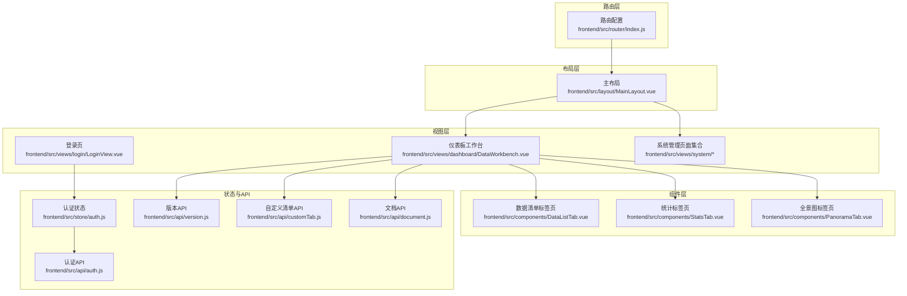
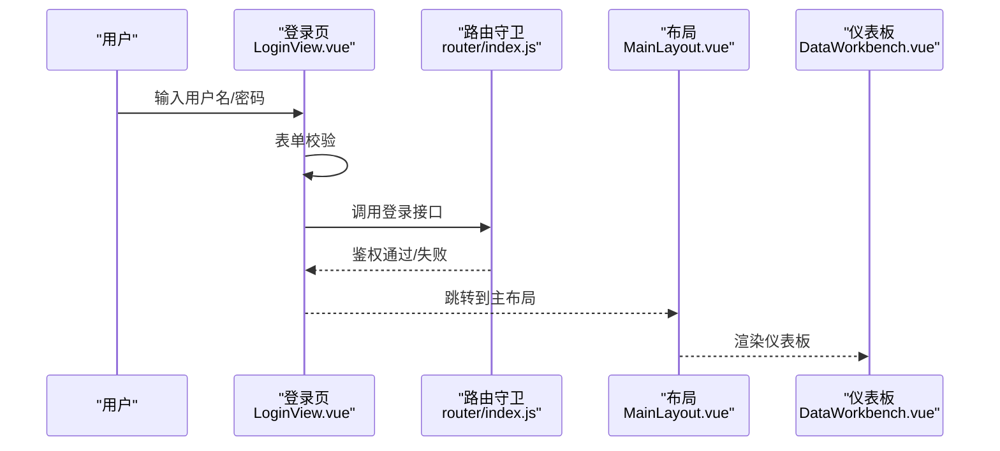
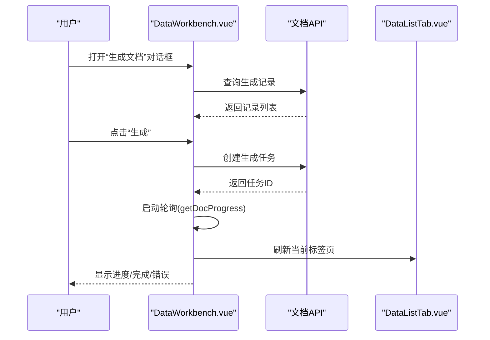
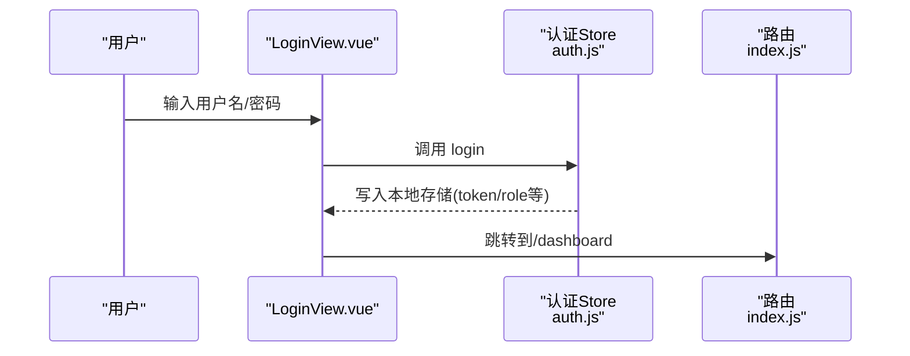
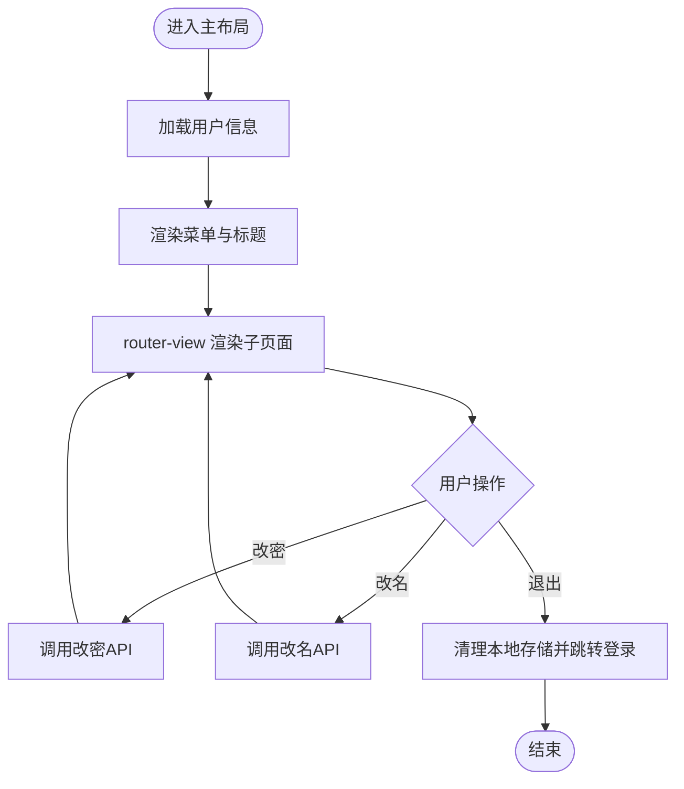
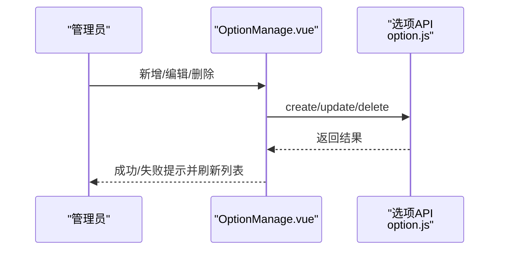
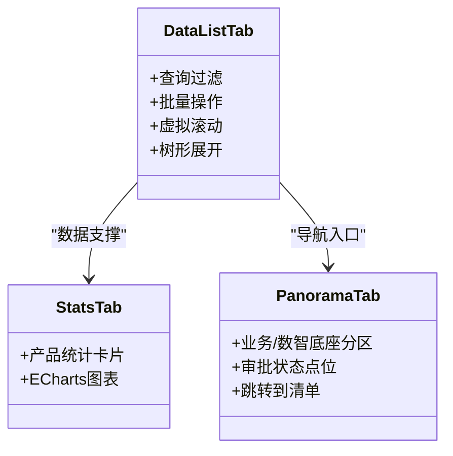
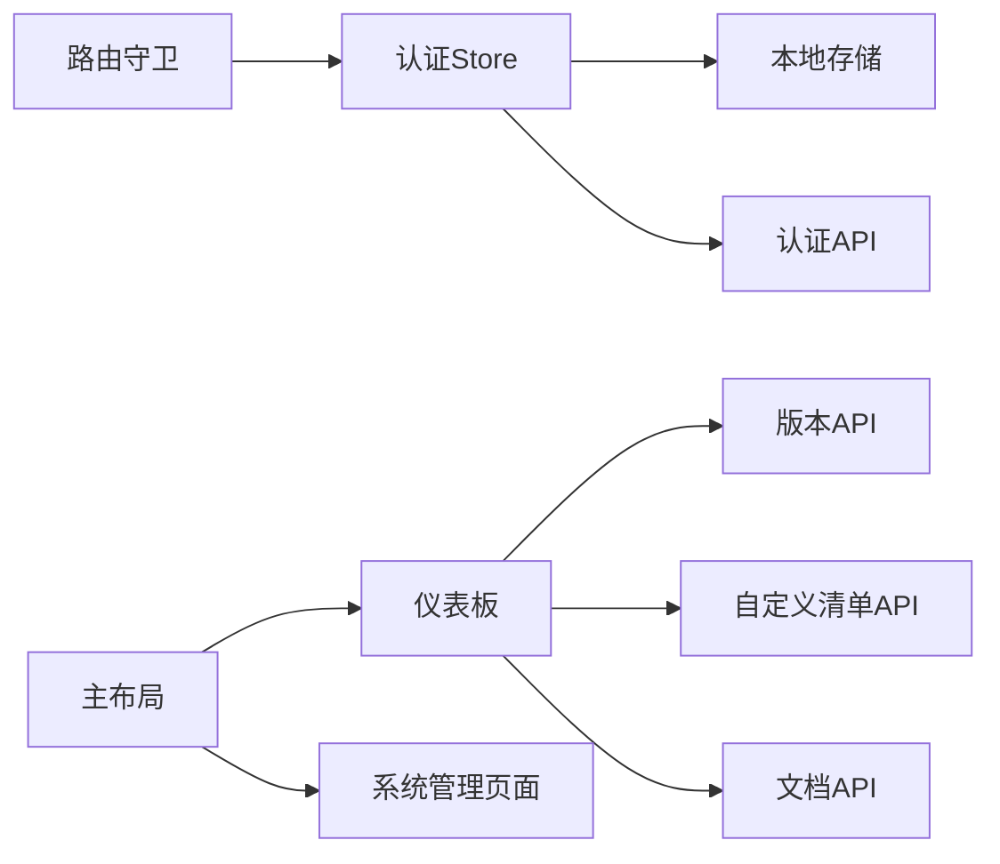

# 页面视图设计

<cite>
**本文引用的文件**
- [DataWorkbench.vue](file://frontend/src/views/dashboard/DataWorkbench.vue)
- [LoginView.vue](file://frontend/src/views/login/LoginView.vue)
- [MainLayout.vue](file://frontend/src/layout/MainLayout.vue)
- [index.js](file://frontend/src/router/index.js)
- [auth.js](file://frontend/src/store/auth.js)
- [DataListTab.vue](file://frontend/src/components/DataListTab.vue)
- [StatsTab.vue](file://frontend/src/components/StatsTab.vue)
- [PanoramaTab.vue](file://frontend/src/components/PanoramaTab.vue)
- [OptionManage.vue](file://frontend/src/views/system/OptionManage.vue)
- [AppRoleManage.vue](file://frontend/src/views/system/AppRoleManage.vue)
- [auth.js](file://frontend/src/api/auth.js)
- [version.js](file://frontend/src/api/version.js)
- [customTab.js](file://frontend/src/api/customTab.js)
- [document.js](file://frontend/src/api/document.js)
</cite>

## 目录
1. [引言](#引言)
2. [项目结构](#项目结构)
3. [核心组件](#核心组件)
4. [架构总览](#架构总览)
5. [详细组件分析](#详细组件分析)
6. [依赖关系分析](#依赖关系分析)
7. [性能考量](#性能考量)
8. [故障排查指南](#故障排查指南)
9. [结论](#结论)
10. [附录](#附录)

## 引言
本技术文档聚焦于前端页面视图设计与实现，围绕 Vue 单文件组件（SFC）的结构设计、模板语法与脚本逻辑进行深入解析。重点覆盖仪表板页面、登录页面与系统管理页面的实现细节，阐述页面组件的生命周期管理、数据获取策略与用户交互处理，并总结页面布局设计、响应式适配与用户体验优化的最佳实践与组件组合模式。

## 项目结构
前端采用基于 Vue 3 + Element Plus 的单页应用（SPA），路由按功能域划分，页面组件位于 views 下，通用布局与菜单由 MainLayout 统一承载；核心业务组件位于 components 下，API 层封装在 api 目录，状态管理使用 Pinia 的 auth store。

**图表来源**
- [index.js:1-129](file://frontend/src/router/index.js#L1-L129)
- [MainLayout.vue:1-423](file://frontend/src/layout/MainLayout.vue#L1-L423)
- [DataWorkbench.vue:1-1144](file://frontend/src/views/dashboard/DataWorkbench.vue#L1-L1144)
- [auth.js:1-46](file://frontend/src/store/auth.js#L1-L46)
- [auth.js:1-22](file://frontend/src/api/auth.js#L1-L22)
- [version.js:1-34](file://frontend/src/api/version.js#L1-L34)
- [customTab.js:1-30](file://frontend/src/api/customTab.js#L1-L30)
- [document.js:1-32](file://frontend/src/api/document.js#L1-L32)

**章节来源**
- [index.js:1-129](file://frontend/src/router/index.js#L1-L129)
- [MainLayout.vue:1-423](file://frontend/src/layout/MainLayout.vue#L1-L423)

## 核心组件
- 仪表板工作台：负责版本选择、自定义清单管理、多标签页切换、文档生成与预览、树形导航联动等。
- 登录页：表单校验、登录与注册流程、版本信息展示。
- 主布局：侧边菜单、顶部用户下拉、内容区渲染、快速需求表单弹窗。
- 系统管理页面：基础数据维护、角色与权限管理等。
- 业务组件：数据清单、统计视图、全景图视图等。

**章节来源**
- [DataWorkbench.vue:1-1144](file://frontend/src/views/dashboard/DataWorkbench.vue#L1-L1144)
- [LoginView.vue:1-209](file://frontend/src/views/login/LoginView.vue#L1-L209)
- [MainLayout.vue:1-423](file://frontend/src/layout/MainLayout.vue#L1-L423)
- [DataListTab.vue:1-200](file://frontend/src/components/DataListTab.vue#L1-L200)
- [StatsTab.vue:1-200](file://frontend/src/components/StatsTab.vue#L1-L200)
- [PanoramaTab.vue:1-200](file://frontend/src/components/PanoramaTab.vue#L1-L200)
- [OptionManage.vue:1-200](file://frontend/src/views/system/OptionManage.vue#L1-L200)
- [AppRoleManage.vue:1-88](file://frontend/src/views/system/AppRoleManage.vue#L1-L88)

## 架构总览
页面视图遵循“布局 + 视图 + 组件 + API + 状态”的分层设计：
- 布局层：MainLayout 提供统一的侧边菜单、头部区域与内容区，支持路由级权限控制。
- 视图层：仪表板、登录、系统管理等页面组件承担业务场景职责。
- 组件层：数据清单、统计、全景图等复用性强的子组件。
- 状态层：Pinia 认证 store 管理 token 与用户信息，路由守卫基于本地存储进行鉴权。
- 数据层：API 封装对后端接口的调用，统一返回结构便于组件消费。

**图表来源**
- [LoginView.vue:88-100](file://frontend/src/views/login/LoginView.vue#L88-L100)
- [index.js:111-126](file://frontend/src/router/index.js#L111-L126)
- [MainLayout.vue:1-423](file://frontend/src/layout/MainLayout.vue#L1-L423)
- [DataWorkbench.vue:1-1144](file://frontend/src/views/dashboard/DataWorkbench.vue#L1-L1144)

## 详细组件分析

### 仪表板工作台（DataWorkbench）
- 结构设计
  - 版本选择与切换：通过版本列表对话框选择当前工作版本，影响后续所有数据与操作。
  - 多标签页：包含“产品全景图”“统计视图”“数据清单”以及多个自定义清单标签页，支持动态增删与重命名。
  - 左侧树形导航：与当前选中节点联动高亮，支持从全景图跳转到清单。
  - 全局预览与审批日志：统一的预览弹窗与审批记录时间线。
  - 文档生成：支持 Word/Excel 输出、筛选范围、生成进度轮询与记录管理。
- 模板语法
  - 条件渲染：v-if/v-else 控制版本选择与内容显示。
  - 列表渲染：v-for 渲染标签页、树节点、表格行。
  - 事件绑定：@click/@row-click/@tab-click/@current-change 等处理交互。
  - 双向绑定：v-model 控制对话框显隐与表单字段。
- 脚本逻辑
  - 生命周期：onMounted 加载版本列表；onBeforeUnmount 清理轮询。
  - 响应式：ref/reactive/computed 管理状态与计算属性。
  - 事件流：emit/onXXX 处理父子组件通信；watch 监听版本与对话框变化。
  - 数据获取：getVersions/getCustomTabs/getDocRecords/getDocProgress 等 API 调用。
  - 用户交互：ElMessageBox/ElMessage 提示与确认；批量操作、插入清单、重命名、删除等。
- 性能与体验
  - 轮询机制：文档生成进度定时轮询，超时与卡死保护。
  - 刷新触发：通过 refreshTrigger 与 key 变化驱动子组件更新。
  - 无障碍：键盘快捷键（Enter）提升输入效率。

**图表来源**
- [DataWorkbench.vue:407-479](file://frontend/src/views/dashboard/DataWorkbench.vue#L407-L479)
- [DataWorkbench.vue:640-705](file://frontend/src/views/dashboard/DataWorkbench.vue#L640-L705)
- [document.js:1-32](file://frontend/src/api/document.js#L1-L32)
- [DataListTab.vue:1-200](file://frontend/src/components/DataListTab.vue#L1-L200)

**章节来源**
- [DataWorkbench.vue:1-1144](file://frontend/src/views/dashboard/DataWorkbench.vue#L1-L1144)
- [DataListTab.vue:1-200](file://frontend/src/components/DataListTab.vue#L1-L200)
- [document.js:1-32](file://frontend/src/api/document.js#L1-L32)

### 登录页面（LoginView）
- 结构设计
  - 登录表单：用户名/密码输入、登录按钮、版本号展示。
  - 注册弹窗：表单校验、确认密码一致性、提交注册。
- 模板语法
  - 表单验证：Element Plus 表单规则与校验。
  - 图标与样式：前缀图标、scoped 样式、深色选择器覆盖。
- 脚本逻辑
  - 生命周期：onMounted 获取应用版本号。
  - 登录流程：调用认证 store 的 login 方法，成功后跳转仪表板。
  - 注册流程：表单校验后调用注册 API，成功提示并回填用户名。
- 安全与可用性
  - 密码可见性：支持明文切换。
  - 键盘交互：Enter 快捷键自动焦点与提交。

**图表来源**
- [LoginView.vue:88-100](file://frontend/src/views/login/LoginView.vue#L88-L100)
- [auth.js:9-19](file://frontend/src/store/auth.js#L9-L19)
- [index.js:111-126](file://frontend/src/router/index.js#L111-L126)

**章节来源**
- [LoginView.vue:1-209](file://frontend/src/views/login/LoginView.vue#L1-L209)
- [auth.js:1-46](file://frontend/src/store/auth.js#L1-L46)

### 主布局（MainLayout）
- 结构设计
  - 侧边栏菜单：折叠/展开、动态路由注入、管理员专属菜单。
  - 顶部区域：标题、快速需求表单、用户下拉菜单（改密/改名/退出）。
  - 内容区：router-view 动态渲染子路由页面。
- 模板语法
  - 条件渲染：v-if 控制管理员菜单显示。
  - 菜单路由：router 属性启用菜单路由跳转。
- 脚本逻辑
  - 菜单映射：根据当前路径计算模块信息，用于顶部标题与快速需求表单预填充。
  - 用户操作：登出清理本地存储并跳转登录；改密/改名调用对应 API。
  - 依赖注入：provide/inject 传递刷新键值给子组件。
- 响应式与主题
  - 侧边栏宽度切换、菜单项折叠、深浅主题变量。

**图表来源**
- [MainLayout.vue:158-272](file://frontend/src/layout/MainLayout.vue#L158-L272)
- [index.js:111-126](file://frontend/src/router/index.js#L111-L126)

**章节来源**
- [MainLayout.vue:1-423](file://frontend/src/layout/MainLayout.vue#L1-L423)
- [index.js:1-129](file://frontend/src/router/index.js#L1-L129)

### 系统管理页面
- 应用角色维护（AppRoleManage）
  - 基于选项 API 进行增删改查，支持即时刷新列表。
- 基础数据维护（OptionManage）
  - 支持拖拽排序、版本隔离、已发布版本禁用排序等。

**图表来源**
- [AppRoleManage.vue:1-88](file://frontend/src/views/system/AppRoleManage.vue#L1-L88)
- [OptionManage.vue:82-97](file://frontend/src/views/system/OptionManage.vue#L82-L97)

**章节来源**
- [AppRoleManage.vue:1-88](file://frontend/src/views/system/AppRoleManage.vue#L1-L88)
- [OptionManage.vue:1-200](file://frontend/src/views/system/OptionManage.vue#L1-L200)

### 业务组件
- 数据清单标签页（DataListTab）
  - 查询过滤、批量操作、虚拟滚动、树形展开/折叠、右键上下文菜单。
- 统计标签页（StatsTab）
  - 使用 ECharts 展示产品分布、审批状态、版本划分与产品经理任务分布。
- 全景图标签页（PanoramaTab）
  - 两级分类卡片布局，点击跳转到清单，支持审批状态可视化。

**图表来源**
- [DataListTab.vue:1-200](file://frontend/src/components/DataListTab.vue#L1-L200)
- [StatsTab.vue:1-200](file://frontend/src/components/StatsTab.vue#L1-L200)
- [PanoramaTab.vue:1-200](file://frontend/src/components/PanoramaTab.vue#L1-L200)

**章节来源**
- [DataListTab.vue:1-200](file://frontend/src/components/DataListTab.vue#L1-L200)
- [StatsTab.vue:1-200](file://frontend/src/components/StatsTab.vue#L1-L200)
- [PanoramaTab.vue:1-200](file://frontend/src/components/PanoramaTab.vue#L1-L200)

## 依赖关系分析
- 路由与鉴权
  - 路由守卫检查 token 与角色，未登录重定向至登录页；角色不匹配则回退仪表板。
- 布局与视图
  - MainLayout 作为根布局，承载仪表板与系统管理页面；仪表板内部再组合多个业务组件。
- 状态与 API
  - 认证 store 写入/读取本地存储，API 层统一请求封装；仪表板通过多个 API 实现版本、清单、文档等功能。

**图表来源**
- [index.js:111-126](file://frontend/src/router/index.js#L111-L126)
- [auth.js:1-46](file://frontend/src/store/auth.js#L1-L46)
- [auth.js:1-22](file://frontend/src/api/auth.js#L1-L22)
- [version.js:1-34](file://frontend/src/api/version.js#L1-L34)
- [customTab.js:1-30](file://frontend/src/api/customTab.js#L1-L30)
- [document.js:1-32](file://frontend/src/api/document.js#L1-L32)

**章节来源**
- [index.js:1-129](file://frontend/src/router/index.js#L1-L129)
- [auth.js:1-46](file://frontend/src/store/auth.js#L1-L46)

## 性能考量
- 虚拟滚动：数据清单使用虚拟滚动减少 DOM 节点数量，提升大数据量下的渲染性能。
- 懒加载与异步组件：路由按需加载页面组件，降低首屏体积。
- 轮询与节流：文档生成进度轮询设置超时与卡死检测，避免长时间占用资源。
- 列表渲染优化：通过 computed 与 key 变化触发局部刷新，避免整页重绘。
- 图表渲染：ECharts 初始化与尺寸检测结合，确保容器可见后再渲染。

[本节为通用指导，无需具体文件引用]

## 故障排查指南
- 登录失败
  - 检查路由守卫是否拦截（token 缺失）、认证 API 是否返回正确 token。
  - 查看认证 store 写入本地存储是否成功。
- 文档生成异常
  - 关注轮询定时器是否启动与停止；检查进度接口返回状态与 total/processed 字段。
  - 若出现长时间 100% 未完成，确认服务端任务是否卡死并查看超时逻辑。
- 权限相关
  - 确认路由 meta.roles 与本地存储 roleCode 是否匹配。
  - 管理员菜单是否正确显示。
- 数据不刷新
  - 检查 refreshTrigger 或 key 变化是否触发子组件更新。
  - 确认 watch 监听与事件回调是否执行。

**章节来源**
- [index.js:111-126](file://frontend/src/router/index.js#L111-L126)
- [auth.js:30-38](file://frontend/src/store/auth.js#L30-L38)
- [DataWorkbench.vue:407-479](file://frontend/src/views/dashboard/DataWorkbench.vue#L407-L479)

## 结论
本项目以清晰的分层与组件化设计实现了复杂业务页面的可维护性与可扩展性。仪表板工作台通过多标签页与组件组合满足多样化数据浏览与操作需求；登录与主布局提供了完善的鉴权与导航体验；系统管理页面通过选项与角色维护保障基础数据一致性。建议在后续迭代中持续关注虚拟滚动与图表渲染的性能优化，完善错误边界与加载态提示，进一步提升用户体验。

## 附录
- 最佳实践
  - 使用 Pinia 管理轻量全局状态，避免跨层级 props。
  - 组件间通信优先使用 emits/events，保持单向数据流。
  - 对外暴露明确的 props 与 emits，增强可测试性与可复用性。
  - 对长耗时任务采用轮询与超时策略，提供明确的用户反馈。
- 组件组合模式
  - 布局 + 视图 + 子组件：主布局承载导航与用户操作，视图负责编排与状态，子组件专注单一职责。
  - 事件驱动：通过 emit 与监听解耦交互，便于扩展与测试。
  - 数据驱动：通过 watch/computed 与 API 调用驱动视图更新，保证数据一致性。

[本节为通用指导，无需具体文件引用]