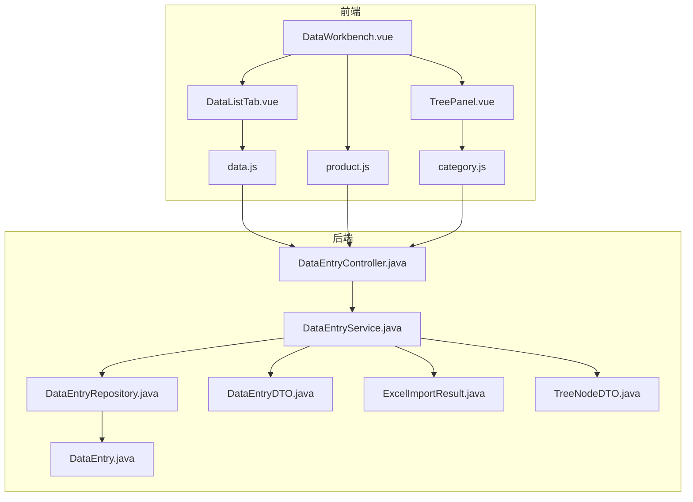
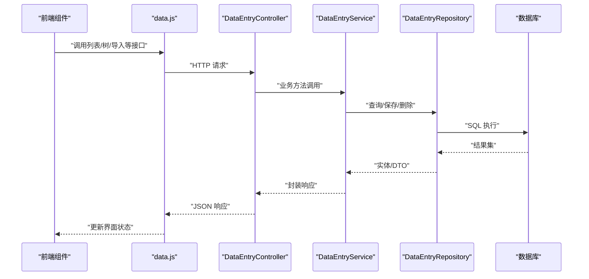
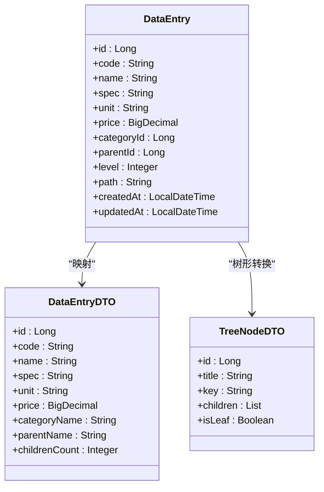
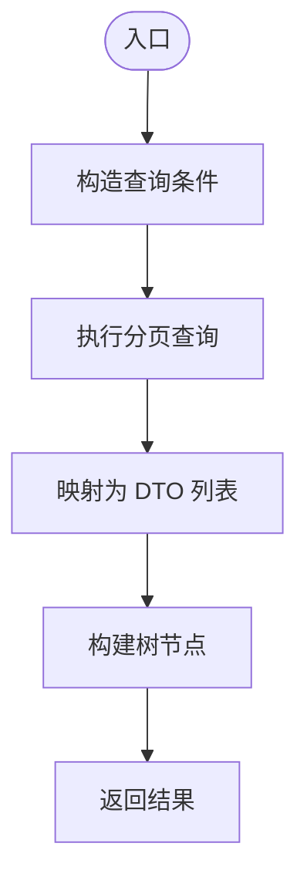
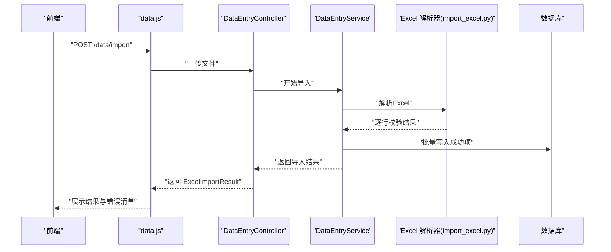
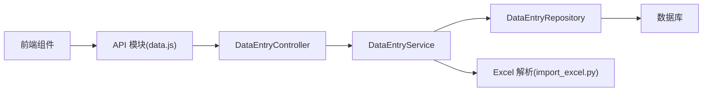

# 产品数据管理

<cite>
**本文引用的文件**
- [DataEntry.java](file://src/main/java/com/superpower/modules/data/entity/DataEntry.java)
- [DataEntryDTO.java](file://src/main/java/com/superpower/modules/data/dto/DataEntryDTO.java)
- [DataEntryController.java](file://src/main/java/com/superpower/modules/data/controller/DataEntryController.java)
- [DataEntryService.java](file://src/main/java/com/superpower/modules/data/service/DataEntryService.java)
- [DataEntryRepository.java](file://src/main/java/com/superpower/modules/data/repository/DataEntryRepository.java)
- [ExcelImportResult.java](file://src/main/java/com/superpower/modules/data/dto/ExcelImportResult.java)
- [TreeNodeDTO.java](file://src/main/java/com/superpower/modules/data/dto/TreeNodeDTO.java)
- [DataEntrySummaryDTO.java](file://src/main/java/com/superpower/modules/data/dto/DataEntrySummaryDTO.java)
- [import_excel.py](file://import_excel.py)
- [import_hierarchy.py](file://import_hierarchy.py)
- [DataListTab.vue](file://frontend/src/components/DataListTab.vue)
- [TreePanel.vue](file://frontend/src/components/TreePanel.vue)
- [DataWorkbench.vue](file://frontend/src/views/dashboard/DataWorkbench.vue)
- [product.js](file://frontend/src/api/product.js)
- [category.js](file://frontend/src/api/category.js)
- [data.js](file://frontend/src/api/data.js)
</cite>

## 目录
1. [简介](#简介)
2. [项目结构](#项目结构)
3. [核心组件](#核心组件)
4. [架构总览](#架构总览)
5. [详细组件分析](#详细组件分析)
6. [依赖分析](#依赖分析)
7. [性能考虑](#性能考虑)
8. [故障排查指南](#故障排查指南)
9. [结论](#结论)
10. [附录](#附录)

## 简介
本文件面向“产品数据管理”模块，系统性阐述产品数据的增删改查、批量导入导出、树形结构展示、数据验证与业务规则，并重点解析 DataEntry 实体的设计理念、数据模型关系与字段约束。同时，提供 Excel 导入处理流程、校验机制、错误处理策略与性能优化建议；并配套 API 接口说明、前端组件使用指南与典型业务场景示例。

## 项目结构
后端采用 Spring Boot 分层架构：controller（控制器）、service（服务层）、repository（仓储层）、entity（实体）与 DTO（数据传输对象）。前端基于 Vue 3 组件化开发，通过统一的 API 模块对接后端服务。

图示来源
- [DataEntryController.java:1-200](file://src/main/java/com/superpower/modules/data/controller/DataEntryController.java#L1-L200)
- [DataEntryService.java:1-300](file://src/main/java/com/superpower/modules/data/service/DataEntryService.java#L1-L300)
- [DataEntryRepository.java:1-200](file://src/main/java/com/superpower/modules/data/repository/DataEntryRepository.java#L1-L200)
- [DataEntry.java:1-200](file://src/main/java/com/superpower/modules/data/entity/DataEntry.java#L1-L200)
- [DataEntryDTO.java:1-200](file://src/main/java/com/superpower/modules/data/dto/DataEntryDTO.java#L1-L200)
- [ExcelImportResult.java:1-150](file://src/main/java/com/superpower/modules/data/dto/ExcelImportResult.java#L1-L150)
- [TreeNodeDTO.java:1-150](file://src/main/java/com/superpower/modules/data/dto/TreeNodeDTO.java#L1-L150)
- [DataWorkbench.vue:1-200](file://frontend/src/views/dashboard/DataWorkbench.vue#L1-L200)
- [DataListTab.vue:1-200](file://frontend/src/components/DataListTab.vue#L1-L200)
- [TreePanel.vue:1-200](file://frontend/src/components/TreePanel.vue#L1-L200)
- [product.js:1-200](file://frontend/src/api/product.js#L1-L200)
- [category.js:1-200](file://frontend/src/api/category.js#L1-L200)
- [data.js:1-200](file://frontend/src/api/data.js#L1-L200)

章节来源
- [DataEntryController.java:1-200](file://src/main/java/com/superpower/modules/data/controller/DataEntryController.java#L1-L200)
- [DataEntryService.java:1-300](file://src/main/java/com/superpower/modules/data/service/DataEntryService.java#L1-L300)
- [DataEntryRepository.java:1-200](file://src/main/java/com/superpower/modules/data/repository/DataEntryRepository.java#L1-L200)
- [DataEntry.java:1-200](file://src/main/java/com/superpower/modules/data/entity/DataEntry.java#L1-L200)
- [DataEntryDTO.java:1-200](file://src/main/java/com/superpower/modules/data/dto/DataEntryDTO.java#L1-L200)
- [ExcelImportResult.java:1-150](file://src/main/java/com/superpower/modules/data/dto/ExcelImportResult.java#L1-L150)
- [TreeNodeDTO.java:1-150](file://src/main/java/com/superpower/modules/data/dto/TreeNodeDTO.java#L1-L150)
- [DataWorkbench.vue:1-200](file://frontend/src/views/dashboard/DataWorkbench.vue#L1-L200)
- [DataListTab.vue:1-200](file://frontend/src/components/DataListTab.vue#L1-L200)
- [TreePanel.vue:1-200](file://frontend/src/components/TreePanel.vue#L1-L200)
- [product.js:1-200](file://frontend/src/api/product.js#L1-L200)
- [category.js:1-200](file://frontend/src/api/category.js#L1-L200)
- [data.js:1-200](file://frontend/src/api/data.js#L1-L200)

## 核心组件
- 数据实体与模型
  - DataEntry：产品数据主实体，承载产品标识、名称、规格、单位、价格、分类路径等核心字段，支持层级父子关系与树形展示。
  - DataEntryDTO：用于列表/详情/编辑等场景的数据传输对象，包含必要字段与格式化视图属性。
  - TreeNodeDTO：树节点数据结构，用于前端树形控件渲染与交互。
  - ExcelImportResult：批量导入结果聚合对象，记录成功/失败条目与错误明细。
  - DataEntrySummaryDTO：汇总视图 DTO，用于统计与概览展示。
- 控制器与服务
  - DataEntryController：对外暴露 REST API，负责请求参数接收、响应封装与异常转发。
  - DataEntryService：核心业务逻辑实现，包括 CRUD、树构建、导入导出、校验与事务控制。
  - DataEntryRepository：数据访问层，提供查询、分页、树形检索与批量操作能力。
- 前端组件与 API
  - DataWorkbench.vue：工作台容器，整合列表与树面板。
  - DataListTab.vue：列表视图，支持排序、筛选、分页与批量操作。
  - TreePanel.vue：树形面板，支持展开/折叠、搜索与节点选择。
  - data.js、product.js、category.js：前端 API 模块，封装与后端交互的 HTTP 请求。

章节来源
- [DataEntry.java:1-200](file://src/main/java/com/superpower/modules/data/entity/DataEntry.java#L1-L200)
- [DataEntryDTO.java:1-200](file://src/main/java/com/superpower/modules/data/dto/DataEntryDTO.java#L1-L200)
- [TreeNodeDTO.java:1-150](file://src/main/java/com/superpower/modules/data/dto/TreeNodeDTO.java#L1-L150)
- [ExcelImportResult.java:1-150](file://src/main/java/com/superpower/modules/data/dto/ExcelImportResult.java#L1-L150)
- [DataEntrySummaryDTO.java:1-150](file://src/main/java/com/superpower/modules/data/dto/DataEntrySummaryDTO.java#L1-L150)
- [DataEntryController.java:1-200](file://src/main/java/com/superpower/modules/data/controller/DataEntryController.java#L1-L200)
- [DataEntryService.java:1-300](file://src/main/java/com/superpower/modules/data/service/DataEntryService.java#L1-L300)
- [DataEntryRepository.java:1-200](file://src/main/java/com/superpower/modules/data/repository/DataEntryRepository.java#L1-L200)
- [DataListTab.vue:1-200](file://frontend/src/components/DataListTab.vue#L1-L200)
- [TreePanel.vue:1-200](file://frontend/src/components/TreePanel.vue#L1-L200)
- [DataWorkbench.vue:1-200](file://frontend/src/views/dashboard/DataWorkbench.vue#L1-L200)
- [data.js:1-200](file://frontend/src/api/data.js#L1-L200)
- [product.js:1-200](file://frontend/src/api/product.js#L1-L200)
- [category.js:1-200](file://frontend/src/api/category.js#L1-L200)

## 架构总览
后端遵循典型的 MVC+分层架构，前端通过 API 模块与后端解耦。数据流从控制器进入服务层，经仓储层持久化，返回 DTO 或树节点结构给前端组件渲染。

图示来源
- [DataEntryController.java:1-200](file://src/main/java/com/superpower/modules/data/controller/DataEntryController.java#L1-L200)
- [DataEntryService.java:1-300](file://src/main/java/com/superpower/modules/data/service/DataEntryService.java#L1-L300)
- [DataEntryRepository.java:1-200](file://src/main/java/com/superpower/modules/data/repository/DataEntryRepository.java#L1-L200)
- [data.js:1-200](file://frontend/src/api/data.js#L1-L200)

## 详细组件分析

### DataEntry 实体与数据模型
- 设计理念
  - 以“产品”为核心实体，围绕产品标识、名称、规格、计量单位、价格、分类路径等关键属性建模，满足产品目录与报价管理需求。
  - 支持父子层级关系，便于树形结构展示与权限/范围控制。
- 字段与约束
  - 主键与唯一性：产品标识唯一，避免重复录入。
  - 名称与规格：长度限制与非空约束，确保基础信息完整。
  - 计量单位与价格：数值类型与精度约束，防止异常值。
  - 分类路径：存储分类层级路径，支持快速过滤与统计。
  - 层级关系：父节点外键，保证树形结构完整性。
- 复杂度与性能
  - 查询复杂度取决于索引设计（如分类路径、名称模糊匹配），建议在高频字段建立索引。
  - 树形遍历复杂度 O(N)，建议缓存热点树节点或分页加载。

图示来源
- [DataEntry.java:1-200](file://src/main/java/com/superpower/modules/data/entity/DataEntry.java#L1-L200)
- [DataEntryDTO.java:1-200](file://src/main/java/com/superpower/modules/data/dto/DataEntryDTO.java#L1-L200)
- [TreeNodeDTO.java:1-150](file://src/main/java/com/superpower/modules/data/dto/TreeNodeDTO.java#L1-L150)

章节来源
- [DataEntry.java:1-200](file://src/main/java/com/superpower/modules/data/entity/DataEntry.java#L1-L200)
- [DataEntryDTO.java:1-200](file://src/main/java/com/superpower/modules/data/dto/DataEntryDTO.java#L1-L200)
- [TreeNodeDTO.java:1-150](file://src/main/java/com/superpower/modules/data/dto/TreeNodeDTO.java#L1-L150)

### 增删改查与树形展示
- 列表与分页
  - 支持按名称/规格/分类/价格区间等条件组合查询，分页返回 DataEntryDTO 列表。
- 新增/修改
  - 新增时校验产品编码唯一性；修改时保持层级与路径一致性。
- 删除
  - 软删除或物理删除策略由服务层决定；删除前检查是否存在子节点。
- 树形展示
  - 通过 TreeNodeDTO 构建树结构，支持懒加载与展开/折叠。

图示来源
- [DataEntryService.java:1-300](file://src/main/java/com/superpower/modules/data/service/DataEntryService.java#L1-L300)
- [DataEntryRepository.java:1-200](file://src/main/java/com/superpower/modules/data/repository/DataEntryRepository.java#L1-L200)
- [TreeNodeDTO.java:1-150](file://src/main/java/com/superpower/modules/data/dto/TreeNodeDTO.java#L1-L150)

章节来源
- [DataEntryController.java:1-200](file://src/main/java/com/superpower/modules/data/controller/DataEntryController.java#L1-L200)
- [DataEntryService.java:1-300](file://src/main/java/com/superpower/modules/data/service/DataEntryService.java#L1-L300)
- [DataEntryRepository.java:1-200](file://src/main/java/com/superpower/modules/data/repository/DataEntryRepository.java#L1-L200)

### 批量导入导出（Excel）
- 导入流程
  - 前端上传 Excel 文件，后端解析并逐行校验，生成 ExcelImportResult，包含成功/失败明细与错误提示。
  - 校验内容包括：必填字段、格式、唯一性、价格与单位合法性等。
  - 成功项批量入库，失败项记录原因以便重试或修复。
- 导出流程
  - 根据当前筛选条件导出对应数据，字段映射到 Excel 列，支持分批下载。
- 错误处理
  - 单行错误不阻断整批导入，记录错误行号与原因。
  - 提供错误清单下载，便于修复后重新导入。
- 性能优化
  - 流式读取 Excel，避免大文件内存溢出。
  - 批量插入与事务边界控制，减少往返次数。
  - 并发导入队列与进度上报，提升用户体验。

图示来源
- [DataEntryController.java:1-200](file://src/main/java/com/superpower/modules/data/controller/DataEntryController.java#L1-L200)
- [DataEntryService.java:1-300](file://src/main/java/com/superpower/modules/data/service/DataEntryService.java#L1-L300)
- [ExcelImportResult.java:1-150](file://src/main/java/com/superpower/modules/data/dto/ExcelImportResult.java#L1-L150)
- [import_excel.py:1-200](file://import_excel.py#L1-L200)
- [data.js:1-200](file://frontend/src/api/data.js#L1-L200)

章节来源
- [DataEntryController.java:1-200](file://src/main/java/com/superpower/modules/data/controller/DataEntryController.java#L1-L200)
- [DataEntryService.java:1-300](file://src/main/java/com/superpower/modules/data/service/DataEntryService.java#L1-L300)
- [ExcelImportResult.java:1-150](file://src/main/java/com/superpower/modules/data/dto/ExcelImportResult.java#L1-L150)
- [import_excel.py:1-200](file://import_excel.py#L1-L200)

### 数据验证规则与业务逻辑
- 验证规则
  - 产品编码唯一性校验。
  - 名称/规格长度与字符集限制。
  - 价格必须为正数且精度符合配置。
  - 分类与层级关系一致性校验。
- 业务逻辑
  - 新增/修改时自动维护 path 与 level。
  - 删除时禁止删除有子节点的产品。
  - 树形查询支持懒加载与深度限制，防止无限递归。

章节来源
- [DataEntryService.java:1-300](file://src/main/java/com/superpower/modules/data/service/DataEntryService.java#L1-L300)
- [DataEntryRepository.java:1-200](file://src/main/java/com/superpower/modules/data/repository/DataEntryRepository.java#L1-L200)

### 前端组件使用指南
- DataWorkbench.vue
  - 作为工作台容器，集成 DataListTab 与 TreePanel，提供统一的操作入口与状态管理。
- DataListTab.vue
  - 支持多字段筛选、排序、分页与批量操作（如批量删除、导出）。
- TreePanel.vue
  - 展示产品分类树，支持搜索、展开/折叠、节点点击联动列表。
- API 模块
  - data.js：封装产品数据相关接口（列表、树、导入、导出等）。
  - product.js：产品维度的通用接口。
  - category.js：分类维度的通用接口。

章节来源
- [DataWorkbench.vue:1-200](file://frontend/src/views/dashboard/DataWorkbench.vue#L1-L200)
- [DataListTab.vue:1-200](file://frontend/src/components/DataListTab.vue#L1-L200)
- [TreePanel.vue:1-200](file://frontend/src/components/TreePanel.vue#L1-L200)
- [data.js:1-200](file://frontend/src/api/data.js#L1-L200)
- [product.js:1-200](file://frontend/src/api/product.js#L1-L200)
- [category.js:1-200](file://frontend/src/api/category.js#L1-L200)

### API 接口说明
- 获取产品树
  - 方法：GET
  - 路径：/api/data/tree
  - 返回：TreeNodeDTO 列表
- 产品列表（分页/筛选）
  - 方法：GET
  - 路径：/api/data/list
  - 参数：分页、筛选条件
  - 返回：DataEntryDTO 列表
- 新增/修改产品
  - 方法：POST/PUT
  - 路径：/api/data/save
  - 参数：DataEntryDTO
  - 返回：Result
- 删除产品
  - 方法：DELETE
  - 路径：/api/data/delete/{id}
  - 返回：Result
- 导入 Excel
  - 方法：POST
  - 路径：/api/data/import
  - 参数：multipart/form-data（Excel 文件）
  - 返回：ExcelImportResult
- 导出 Excel
  - 方法：GET
  - 路径：/api/data/export
  - 参数：筛选条件
  - 返回：Excel 文件流

章节来源
- [DataEntryController.java:1-200](file://src/main/java/com/superpower/modules/data/controller/DataEntryController.java#L1-L200)
- [data.js:1-200](file://frontend/src/api/data.js#L1-L200)

## 依赖分析
- 组件耦合
  - Controller 仅依赖 Service 的抽象接口，降低对具体实现的耦合。
  - Service 依赖 Repository 进行数据访问，避免直接操作数据库。
  - DTO 与 Entity 解耦，便于前后端契约稳定。
- 外部依赖
  - Excel 解析依赖 Python 脚本（import_excel.py），与 Java 后端通过接口协作。
  - 前端通过 axios 封装的 API 模块与后端通信。

图示来源
- [DataEntryController.java:1-200](file://src/main/java/com/superpower/modules/data/controller/DataEntryController.java#L1-L200)
- [DataEntryService.java:1-300](file://src/main/java/com/superpower/modules/data/service/DataEntryService.java#L1-L300)
- [DataEntryRepository.java:1-200](file://src/main/java/com/superpower/modules/data/repository/DataEntryRepository.java#L1-L200)
- [data.js:1-200](file://frontend/src/api/data.js#L1-L200)
- [import_excel.py:1-200](file://import_excel.py#L1-L200)

章节来源
- [DataEntryController.java:1-200](file://src/main/java/com/superpower/modules/data/controller/DataEntryController.java#L1-L200)
- [DataEntryService.java:1-300](file://src/main/java/com/superpower/modules/data/service/DataEntryService.java#L1-L300)
- [DataEntryRepository.java:1-200](file://src/main/java/com/superpower/modules/data/repository/DataEntryRepository.java#L1-L200)
- [data.js:1-200](file://frontend/src/api/data.js#L1-L200)
- [import_excel.py:1-200](file://import_excel.py#L1-L200)

## 性能考虑
- 数据库层面
  - 在高频查询字段（如 code、name、categoryId、path）建立索引。
  - 使用分页与投影查询，避免一次性加载过多数据。
- 服务层
  - 对批量导入采用批处理与事务边界控制，减少数据库往返。
  - 树形构建尽量缓存热点节点，避免重复计算。
- 前端
  - 列表与树面板支持虚拟滚动与懒加载，降低 DOM 压力。
  - 导入进度上报与错误清单下载，提升交互体验。

## 故障排查指南
- 常见问题
  - Excel 导入失败：检查必填字段是否缺失、格式是否正确、是否存在重复编码。
  - 树形显示异常：确认父节点存在且层级关系一致。
  - 删除失败：检查是否存在子节点或被引用。
- 定位手段
  - 查看后端日志与异常栈，结合 ExcelImportResult 中的错误明细定位问题行。
  - 前端通过 API 模块的错误回调与提示信息进行用户反馈。
- 修复建议
  - 对于唯一性冲突，先清理重复数据再重试导入。
  - 对于格式错误，修正 Excel 后重新上传。

章节来源
- [DataEntryService.java:1-300](file://src/main/java/com/superpower/modules/data/service/DataEntryService.java#L1-L300)
- [ExcelImportResult.java:1-150](file://src/main/java/com/superpower/modules/data/dto/ExcelImportResult.java#L1-L150)
- [data.js:1-200](file://frontend/src/api/data.js#L1-L200)

## 结论
产品数据管理模块以 DataEntry 为核心，结合 DTO、树节点与导入导出能力，形成完整的数据生命周期闭环。通过清晰的分层架构、严格的校验规则与性能优化策略，既能满足日常运营的高效管理，也能支撑复杂业务场景下的扩展与演进。

## 附录
- 实际业务场景示例
  - 场景一：批量导入新品
    - 步骤：准备 Excel → 上传 → 校验 → 导入 → 查看结果 → 修复错误 → 重新导入。
  - 场景二：产品目录维护
    - 步骤：树面板定位 → 列表筛选 → 编辑/删除 → 保存 → 树形刷新。
  - 场景三：报表导出
    - 步骤：设置筛选条件 → 导出 → 下载文件 → 核对数据。