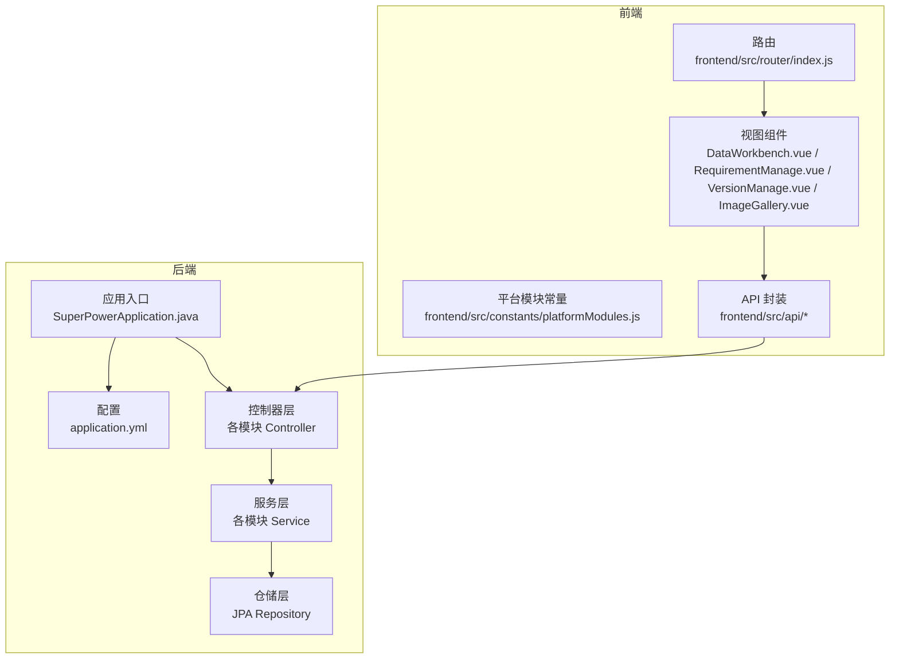
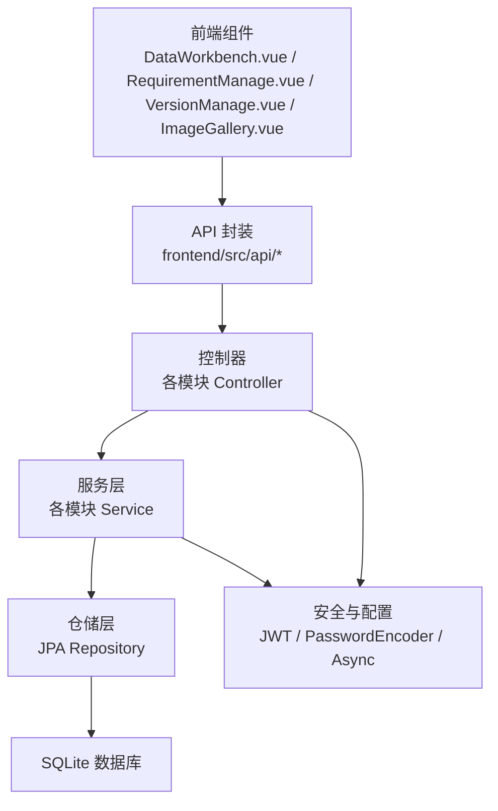
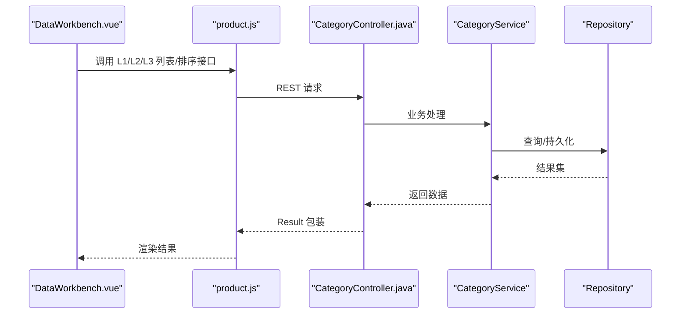
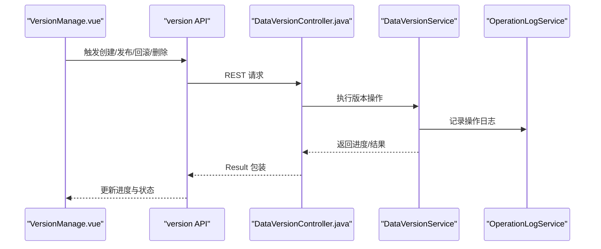
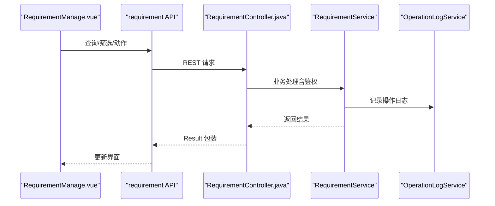
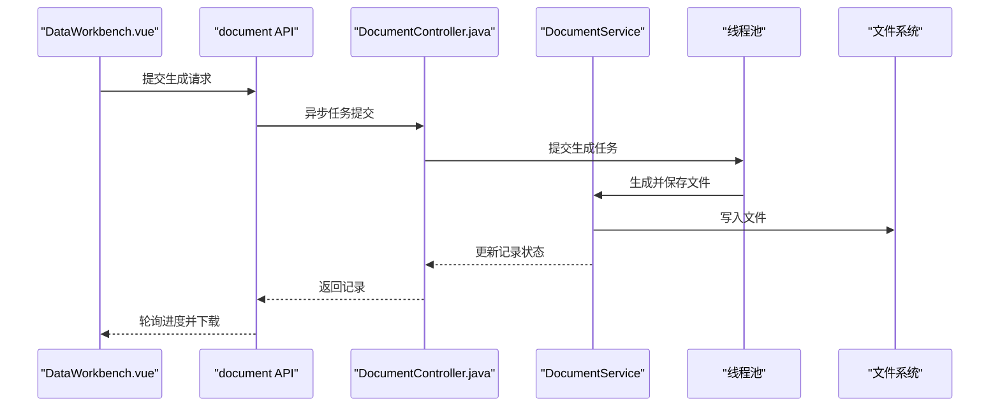
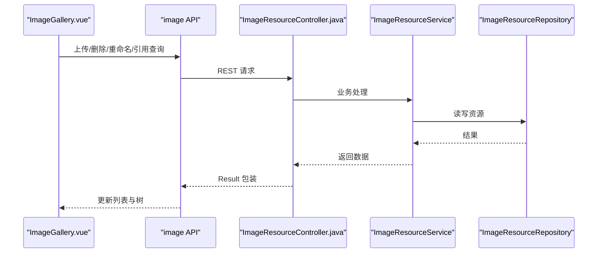
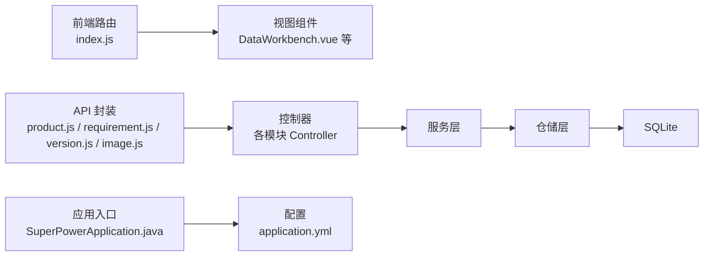

# 功能模块详解

<cite>
**本文档引用的文件**
- [SuperPowerApplication.java](file://src/main/java/com/superpower/SuperPowerApplication.java)
- [application.yml](file://src/main/resources/application.yml)
- [index.js](file://frontend/src/router/index.js)
- [platformModules.js](file://frontend/src/constants/platformModules.js)
- [Result.java](file://src/main/java/com/superpower/common/Result.java)
- [CategoryController.java](file://src/main/java/com/superpower/modules/category/controller/CategoryController.java)
- [DataVersionController.java](file://src/main/java/com/superpower/modules/version/controller/DataVersionController.java)
- [RequirementController.java](file://src/main/java/com/superpower/modules/requirement/controller/RequirementController.java)
- [DocumentController.java](file://src/main/java/com/superpower/modules/document/controller/DocumentController.java)
- [ImageResourceController.java](file://src/main/java/com/superpower/modules/image/controller/ImageResourceController.java)
- [DataWorkbench.vue](file://frontend/src/views/dashboard/DataWorkbench.vue)
- [RequirementManage.vue](file://frontend/src/views/requirement/RequirementManage.vue)
- [VersionManage.vue](file://frontend/src/views/system/VersionManage.vue)
- [ImageGallery.vue](file://frontend/src/views/system/ImageGallery.vue)
- [product.js](file://frontend/src/api/product.js)
</cite>

## 目录
1. [引言](#引言)
2. [项目结构](#项目结构)
3. [核心组件](#核心组件)
4. [架构总览](#架构总览)
5. [详细组件分析](#详细组件分析)
6. [依赖关系分析](#依赖关系分析)
7. [性能考量](#性能考量)
8. [故障排查指南](#故障排查指南)
9. [结论](#结论)
10. [附录](#附录)

## 引言
本文件面向产品清单管理系统各功能模块，围绕产品数据管理、版本控制、需求管理、系统管理、文档生成与图床管理，提供从架构到实现细节的完整说明。内容涵盖业务逻辑、数据流程、用户交互、配置项、扩展点与最佳实践，帮助开发者快速理解与扩展系统能力。

## 项目结构
系统采用前后端分离架构：
- 后端基于 Spring Boot，模块化组织业务域（版本、需求、文档、图床、系统等），统一返回封装 Result。
- 前端基于 Vue 3 + Element Plus，路由按模块划分，页面组件负责数据展示与交互，API 层对接后端服务。

图表来源
- [index.js:1-129](file://frontend/src/router/index.js#L1-L129)
- [platformModules.js:1-29](file://frontend/src/constants/platformModules.js#L1-L29)
- [DataWorkbench.vue:1-1144](file://frontend/src/views/dashboard/DataWorkbench.vue#L1-L1144)
- [RequirementManage.vue:1-595](file://frontend/src/views/requirement/RequirementManage.vue#L1-L595)
- [VersionManage.vue:1-259](file://frontend/src/views/system/VersionManage.vue#L1-L259)
- [ImageGallery.vue:1-474](file://frontend/src/views/system/ImageGallery.vue#L1-L474)
- [SuperPowerApplication.java:1-82](file://src/main/java/com/superpower/SuperPowerApplication.java#L1-L82)
- [application.yml:1-40](file://src/main/resources/application.yml#L1-L40)

章节来源
- [index.js:1-129](file://frontend/src/router/index.js#L1-L129)
- [platformModules.js:1-29](file://frontend/src/constants/platformModules.js#L1-L29)
- [SuperPowerApplication.java:1-82](file://src/main/java/com/superpower/SuperPowerApplication.java#L1-L82)
- [application.yml:1-40](file://src/main/resources/application.yml#L1-L40)

## 核心组件
- 统一响应封装：Result 提供成功/失败/禁止/未授权等标准返回体，简化前后端契约。
- 路由与菜单：前端路由定义模块化页面；平台模块常量用于生成侧边栏与面包屑。
- 配置中心：后端 application.yml 管理数据库连接、JWT 密钥、文件上传限制、日志级别等。

章节来源
- [Result.java:1-41](file://src/main/java/com/superpower/common/Result.java#L1-L41)
- [index.js:1-129](file://frontend/src/router/index.js#L1-L129)
- [platformModules.js:1-29](file://frontend/src/constants/platformModules.js#L1-L29)
- [application.yml:1-40](file://src/main/resources/application.yml#L1-L40)

## 架构总览
系统采用分层架构：
- 表现层：Vue 组件与路由，负责用户交互与数据渲染。
- 控制器层：REST 接口暴露业务能力，参数校验与鉴权。
- 服务层：业务编排与事务边界，调用仓储与外部能力。
- 数据访问层：JPA Repository 访问 SQLite 数据库。
- 安全与配置：JWT 过滤器、密码编码器、异步线程池、日志与数据库方言。

图表来源
- [DataWorkbench.vue:1-1144](file://frontend/src/views/dashboard/DataWorkbench.vue#L1-L1144)
- [RequirementManage.vue:1-595](file://frontend/src/views/requirement/RequirementManage.vue#L1-L595)
- [VersionManage.vue:1-259](file://frontend/src/views/system/VersionManage.vue#L1-L259)
- [ImageGallery.vue:1-474](file://frontend/src/views/system/ImageGallery.vue#L1-L474)
- [CategoryController.java:1-66](file://src/main/java/com/superpower/modules/category/controller/CategoryController.java#L1-L66)
- [DataVersionController.java:1-106](file://src/main/java/com/superpower/modules/version/controller/DataVersionController.java#L1-L106)
- [RequirementController.java:1-239](file://src/main/java/com/superpower/modules/requirement/controller/RequirementController.java#L1-L239)
- [DocumentController.java:1-163](file://src/main/java/com/superpower/modules/document/controller/DocumentController.java#L1-L163)
- [ImageResourceController.java:1-152](file://src/main/java/com/superpower/modules/image/controller/ImageResourceController.java#L1-L152)

## 详细组件分析

### 产品数据管理（产品清单）
- 模块职责
  - 支持 L1/L2/L3 分层产品树的增删改与排序。
  - 与版本绑定，支持在不同版本下维护产品层级。
- 关键接口
  - 获取 L1/L2/L3 列表、创建/更新/删除节点、批量更新排序。
- 前端集成
  - DataWorkbench 中的“产品全景图”“数据清单”“统计视图”等 Tab 协同使用产品树与数据列表。
- 扩展建议
  - 新增产品属性可在实体层扩展，保持与版本隔离。
  - 排序变更建议使用批量请求以减少往返。

图表来源
- [DataWorkbench.vue:1-1144](file://frontend/src/views/dashboard/DataWorkbench.vue#L1-L1144)
- [product.js:1-65](file://frontend/src/api/product.js#L1-L65)
- [CategoryController.java:1-66](file://src/main/java/com/superpower/modules/category/controller/CategoryController.java#L1-L66)

章节来源
- [product.js:1-65](file://frontend/src/api/product.js#L1-L65)
- [CategoryController.java:1-66](file://src/main/java/com/superpower/modules/category/controller/CategoryController.java#L1-L66)
- [DataWorkbench.vue:1-1144](file://frontend/src/views/dashboard/DataWorkbench.vue#L1-L1144)

### 版本控制（版本管理）
- 模块职责
  - 创建新版本（从最新已发布版本克隆）、封板发布、退回、删除版本。
  - 实时轮询版本操作进度，支持步骤化状态展示。
- 关键接口
  - 获取版本列表、创建版本、发布版本、回滚版本、删除版本、进度查询。
- 前端集成
  - VersionManage.vue 展示版本卡片与操作按钮，弹窗显示步骤与结果。
- 扩展建议
  - 发布/回滚流程可引入审批流或钩子扩展点。
  - 删除版本需谨慎，建议增加二次确认与备份策略。

图表来源
- [VersionManage.vue:1-259](file://frontend/src/views/system/VersionManage.vue#L1-L259)
- [DataVersionController.java:1-106](file://src/main/java/com/superpower/modules/version/controller/DataVersionController.java#L1-L106)

章节来源
- [DataVersionController.java:1-106](file://src/main/java/com/superpower/modules/version/controller/DataVersionController.java#L1-L106)
- [VersionManage.vue:1-259](file://frontend/src/views/system/VersionManage.vue#L1-L259)

### 需求管理（需求清单与需求图片）
- 模块职责
  - 需求生命周期管理：提出、确认、开发、待上线、上线、驳回、撤销。
  - 支持按状态、模块、类型、优先级、时间范围、提出人筛选。
  - 需求详情包含操作日志与图片附件管理。
- 关键接口
  - 列表查询、详情查询、状态统计、各类动作（确认/开发/就绪/发布/驳回/取消）、删除（管理员）。
- 前端集成
  - RequirementManage.vue 提供筛选面板、统计图表、表格与详情对话框。
- 扩展建议
  - 图片上传可引入外链迁移与引用追踪。
  - 支持批量操作与导出统计报表。

图表来源
- [RequirementManage.vue:1-595](file://frontend/src/views/requirement/RequirementManage.vue#L1-L595)
- [RequirementController.java:1-239](file://src/main/java/com/superpower/modules/requirement/controller/RequirementController.java#L1-L239)

章节来源
- [RequirementController.java:1-239](file://src/main/java/com/superpower/modules/requirement/controller/RequirementController.java#L1-L239)
- [RequirementManage.vue:1-595](file://frontend/src/views/requirement/RequirementManage.vue#L1-L595)

### 文档生成（Word/Excel）
- 模块职责
  - 异步生成 Word 或 Excel 文档，支持选择版本、文档类型、输出格式、是否包含图片与压缩图片。
  - 生成记录管理：分页查询、下载、删除（管理员）。
- 关键接口
  - 提交生成任务、查询进度、获取记录、下载文件、删除记录。
- 前端集成
  - DataWorkbench.vue 内嵌“生成文档”对话框，支持筛选生成人与时间段，轮询进度并展示百分比。
- 扩展建议
  - 生成超时与异常处理完善，支持取消任务。
  - 可扩展更多模板与字段映射。

图表来源
- [DataWorkbench.vue:166-273](file://frontend/src/views/dashboard/DataWorkbench.vue#L166-L273)
- [DocumentController.java:1-163](file://src/main/java/com/superpower/modules/document/controller/DocumentController.java#L1-L163)

章节来源
- [DocumentController.java:1-163](file://src/main/java/com/superpower/modules/document/controller/DocumentController.java#L1-L163)
- [DataWorkbench.vue:166-273](file://frontend/src/views/dashboard/DataWorkbench.vue#L166-L273)

### 图床管理（图片资源）
- 模块职责
  - 图片上传、重命名、替换、批量删除、树形目录浏览、引用查询（清单与需求）。
  - 支持按分类/域/产品/版本过滤，支持搜索与网格/列表视图。
- 关键接口
  - 上传、树形目录、查询、删除、批量删除、重命名、替换文件、引用查询。
- 前端集成
  - ImageGallery.vue 提供树形导航、图片网格/列表、批量操作与引用弹窗。
- 扩展建议
  - 外部图片迁移可引入任务队列与进度追踪。
  - 引用冲突检测与提示优化。

图表来源
- [ImageGallery.vue:1-474](file://frontend/src/views/system/ImageGallery.vue#L1-L474)
- [ImageResourceController.java:1-152](file://src/main/java/com/superpower/modules/image/controller/ImageResourceController.java#L1-L152)

章节来源
- [ImageResourceController.java:1-152](file://src/main/java/com/superpower/modules/image/controller/ImageResourceController.java#L1-L152)
- [ImageGallery.vue:1-474](file://frontend/src/views/system/ImageGallery.vue#L1-L474)

### 系统管理（用户/角色/基础数据/特殊操作）
- 模块职责
  - 用户管理、角色管理、基础数据维护（业务分类、解决方案、应用角色、功能状态、产品分类、系统类型）、版本管理、图床管理、特殊操作。
- 前端集成
  - 路由与菜单按模块划分，权限通过 meta.roles 控制访问。
- 扩展建议
  - 增加审计日志与操作轨迹，便于合规追溯。

章节来源
- [index.js:1-129](file://frontend/src/router/index.js#L1-L129)
- [platformModules.js:1-29](file://frontend/src/constants/platformModules.js#L1-L29)

## 依赖关系分析
- 前端依赖
  - 路由与模块常量驱动页面布局与权限控制。
  - API 封装统一请求方式，组件内聚业务逻辑。
- 后端依赖
  - 应用入口初始化默认时区与内置角色/用户/版本。
  - 配置文件集中管理数据库、JWT、文件上传与日志级别。
  - 控制器依赖服务层，服务层依赖仓储层，遵循分层解耦。

图表来源
- [index.js:1-129](file://frontend/src/router/index.js#L1-L129)
- [DataWorkbench.vue:1-1144](file://frontend/src/views/dashboard/DataWorkbench.vue#L1-L1144)
- [product.js:1-65](file://frontend/src/api/product.js#L1-L65)
- [SuperPowerApplication.java:1-82](file://src/main/java/com/superpower/SuperPowerApplication.java#L1-L82)
- [application.yml:1-40](file://src/main/resources/application.yml#L1-L40)

章节来源
- [SuperPowerApplication.java:1-82](file://src/main/java/com/superpower/SuperPowerApplication.java#L1-L82)
- [application.yml:1-40](file://src/main/resources/application.yml#L1-L40)

## 性能考量
- 数据库连接池与超时：HikariCP 最大连接数与泄漏检测阈值需结合并发场景调整。
- 文件上传：限制单文件与请求总大小，避免内存溢出。
- 异步生成文档：固定线程池数量与守护线程命名，避免资源泄露。
- 前端渲染：图片懒加载与分页，避免一次性渲染大量 DOM。
- 日志级别：生产环境建议降低调试日志，避免 I/O 压力。

## 故障排查指南
- 登录与权限
  - 路由守卫检查 token 与角色，无权限跳转仪表盘或拒绝访问。
- 版本操作
  - 创建/删除版本进度轮询失败时，检查后端任务状态与异常日志。
- 文档生成
  - 生成超时自动取消，检查线程池与磁盘空间；生成异常记录在日志中。
- 图床管理
  - 批量删除前先查询引用，避免误删；替换图片需保证文件名唯一性。
- 需求管理
  - 驳回需填写原因；删除前确认是否允许删除。

章节来源
- [index.js:111-126](file://frontend/src/router/index.js#L111-L126)
- [DataVersionController.java:115-139](file://src/main/java/com/superpower/modules/version/controller/DataVersionController.java#L115-L139)
- [DocumentController.java:79-115](file://src/main/java/com/superpower/modules/document/controller/DocumentController.java#L79-L115)
- [ImageResourceController.java:95-102](file://src/main/java/com/superpower/modules/image/controller/ImageResourceController.java#L95-L102)
- [RequirementController.java:408-440](file://src/main/java/com/superpower/modules/requirement/controller/RequirementController.java#L408-L440)

## 结论
本系统通过清晰的模块划分与前后端协作，实现了产品数据管理、版本控制、需求管理、文档生成与图床管理的闭环。统一的响应封装与配置中心提升了可维护性；异步任务与分页渲染保障了用户体验。建议在后续迭代中进一步完善审批流、审计日志与模板扩展能力，持续提升系统的可扩展性与稳定性。

## 附录
- 配置项参考
  - JWT 密钥与过期时间、文档存储路径、数据库连接与方言、日志级别、文件上传大小限制。
- 最佳实践
  - 控制器只做参数校验与鉴权，业务逻辑下沉至服务层。
  - 使用 Result 统一封装返回，前后端约定一致的数据结构。
  - 对外链与图片迁移引入任务队列与进度追踪，确保一致性与可观测性。

章节来源
- [application.yml:1-40](file://src/main/resources/application.yml#L1-L40)
- [Result.java:1-41](file://src/main/java/com/superpower/common/Result.java#L1-L41)