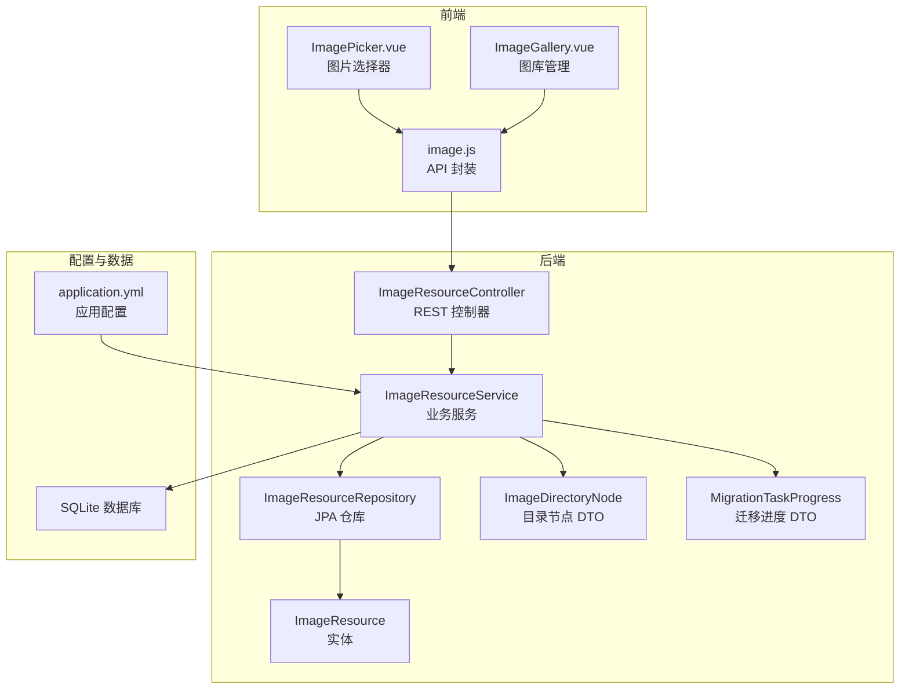
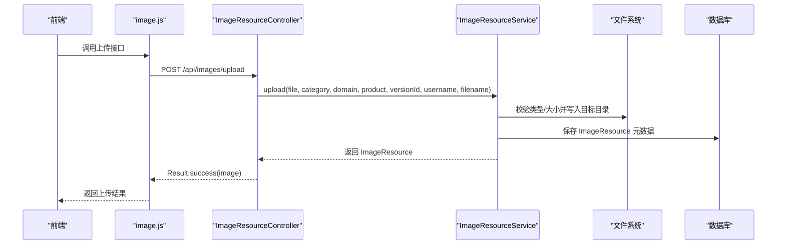
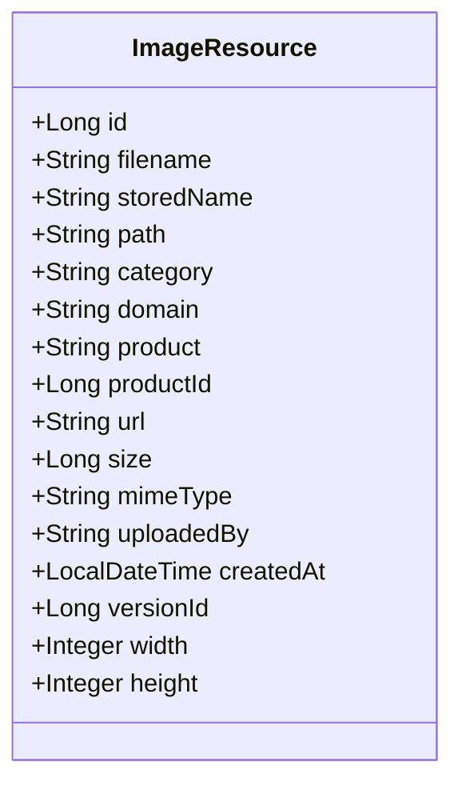
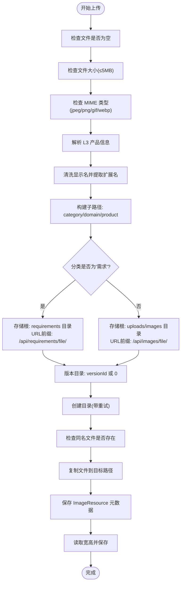
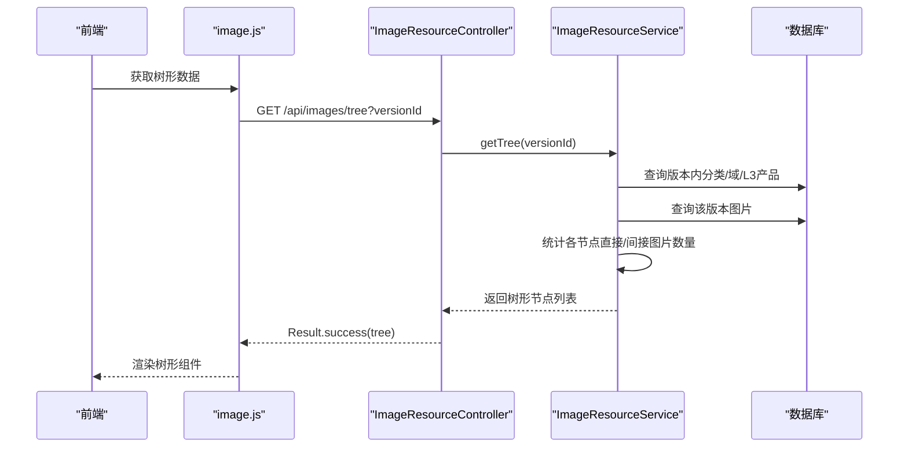
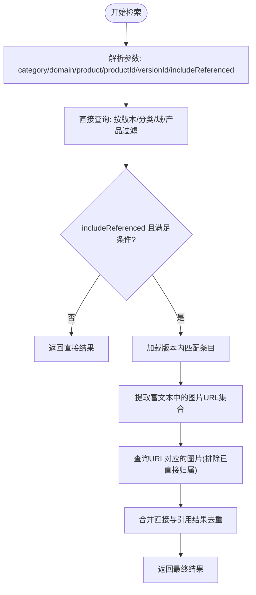
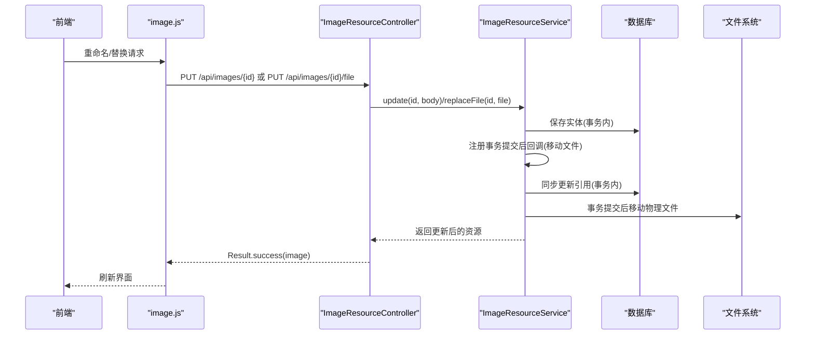
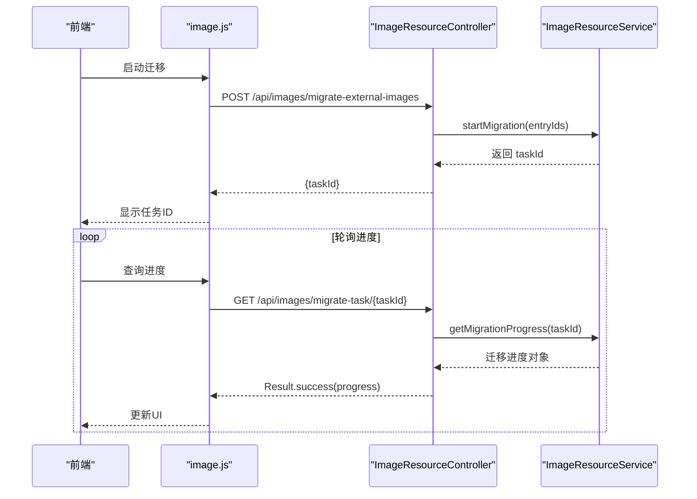
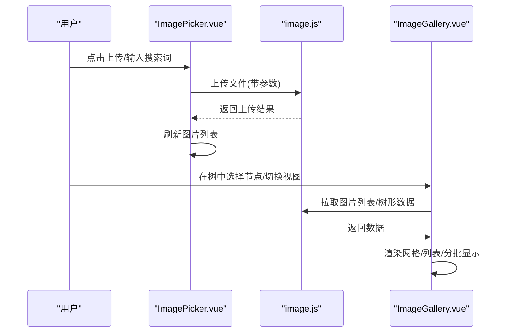
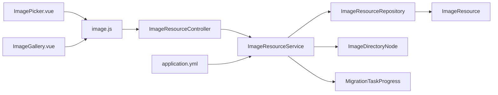

# 图床资源管理

<cite>
**本文档引用的文件**
- [ImageResource.java](file://src/main/java/com/superpower/modules/image/entity/ImageResource.java)
- [ImageResourceController.java](file://src/main/java/com/superpower/modules/image/controller/ImageResourceController.java)
- [ImageResourceService.java](file://src/main/java/com/superpower/modules/image/service/ImageResourceService.java)
- [ImageResourceRepository.java](file://src/main/java/com/superpower/modules/image/repository/ImageResourceRepository.java)
- [ImageDirectoryNode.java](file://src/main/java/com/superpower/modules/image/dto/ImageDirectoryNode.java)
- [MigrationTaskProgress.java](file://src/main/java/com/superpower/modules/image/dto/MigrationTaskProgress.java)
- [image.js](file://frontend/src/api/image.js)
- [ImagePicker.vue](file://frontend/src/components/ImagePicker.vue)
- [ImageGallery.vue](file://frontend/src/views/system/ImageGallery.vue)
- [application.yml](file://src/main/resources/application.yml)
- [20260531_historical_schema_changes.sql](file://db_changes/20260531_historical_schema_changes.sql)
- [V1.0.10_cleanup_5_6_2_images.sql](file://db_changes/V1.0.10_cleanup_5_6_2_images.sql)
- [V1.0.12_fix_l3_images_535.sql](file://db_changes/V1.0.12_fix_l3_images_535.sql)
</cite>

## 目录
1. [简介](#简介)
2. [项目结构](#项目结构)
3. [核心组件](#核心组件)
4. [架构总览](#架构总览)
5. [详细组件分析](#详细组件分析)
6. [依赖关系分析](#依赖关系分析)
7. [性能考量](#性能考量)
8. [故障排查指南](#故障排查指南)
9. [结论](#结论)
10. [附录](#附录)

## 简介
本文件面向图床资源管理功能，系统性阐述图片资源的存储与管理能力，包括图片上传、目录结构管理、资源检索机制、实体设计、存储策略与路径管理、批量迁移、API 接口说明、前端图片选择器组件使用指南以及图片资源展示优化策略。同时覆盖图片处理的性能考虑、缓存机制与存储空间管理建议。

## 项目结构
后端采用 Spring Boot + JPA 的分层架构，前端基于 Vue 3 + Element Plus。图床模块位于后端的 image 包中，包含实体、仓库、服务、控制器与 DTO；前端提供图片选择器与图库管理界面。

**图表来源**
- [ImageResourceController.java:24-152](file://src/main/java/com/superpower/modules/image/controller/ImageResourceController.java#L24-L152)
- [ImageResourceService.java:41-1304](file://src/main/java/com/superpower/modules/image/service/ImageResourceService.java#L41-L1304)
- [ImageResourceRepository.java:12-39](file://src/main/java/com/superpower/modules/image/repository/ImageResourceRepository.java#L12-L39)
- [ImageResource.java:10-59](file://src/main/java/com/superpower/modules/image/entity/ImageResource.java#L10-L59)
- [image.js:1-93](file://frontend/src/api/image.js#L1-L93)
- [ImagePicker.vue:1-178](file://frontend/src/components/ImagePicker.vue#L1-L178)
- [ImageGallery.vue:1-474](file://frontend/src/views/system/ImageGallery.vue#L1-L474)
- [application.yml:1-40](file://src/main/resources/application.yml#L1-L40)

**章节来源**
- [ImageResourceController.java:24-152](file://src/main/java/com/superpower/modules/image/controller/ImageResourceController.java#L24-L152)
- [ImageResourceService.java:41-1304](file://src/main/java/com/superpower/modules/image/service/ImageResourceService.java#L41-L1304)
- [ImageResourceRepository.java:12-39](file://src/main/java/com/superpower/modules/image/repository/ImageResourceRepository.java#L12-L39)
- [ImageResource.java:10-59](file://src/main/java/com/superpower/modules/image/entity/ImageResource.java#L10-L59)
- [image.js:1-93](file://frontend/src/api/image.js#L1-L93)
- [ImagePicker.vue:1-178](file://frontend/src/components/ImagePicker.vue#L1-L178)
- [ImageGallery.vue:1-474](file://frontend/src/views/system/ImageGallery.vue#L1-L474)
- [application.yml:1-40](file://src/main/resources/application.yml#L1-L40)

## 核心组件
- 实体 ImageResource：描述图片资源的元数据与存储位置，支持按版本、分类、域、产品维度组织。
- 控制器 ImageResourceController：提供上传、树形目录查询、资源检索、删除、批量删除、重命名、替换文件、引用查询、外部图片迁移等接口。
- 服务 ImageResourceService：实现上传校验、命名与存储路径生成、目录层级构建、引用同步、批量迁移任务管理、引用查询等核心逻辑。
- 仓库 ImageResourceRepository：提供按多维条件的查询与统计方法。
- 前端 API 封装：封装上传、树查询、资源检索、删除、重命名、替换、引用查询、迁移进度查询等请求。
- 前端组件：ImagePicker.vue 提供弹窗式图片选择与上传；ImageGallery.vue 提供图库管理界面，含树形导航、网格/列表视图、批量操作、引用查看等。

**章节来源**
- [ImageResource.java:10-59](file://src/main/java/com/superpower/modules/image/entity/ImageResource.java#L10-L59)
- [ImageResourceController.java:52-152](file://src/main/java/com/superpower/modules/image/controller/ImageResourceController.java#L52-L152)
- [ImageResourceService.java:78-482](file://src/main/java/com/superpower/modules/image/service/ImageResourceService.java#L78-L482)
- [ImageResourceRepository.java:12-39](file://src/main/java/com/superpower/modules/image/repository/ImageResourceRepository.java#L12-L39)
- [image.js:24-93](file://frontend/src/api/image.js#L24-L93)
- [ImagePicker.vue:37-162](file://frontend/src/components/ImagePicker.vue#L37-L162)
- [ImageGallery.vue:114-447](file://frontend/src/views/system/ImageGallery.vue#L114-L447)

## 架构总览
后端通过 REST 接口对外提供图床能力，前端通过统一 API 封装调用。服务层负责业务规则与文件系统操作，仓库层负责数据持久化，实体映射数据库表 image_resource。配置文件控制数据库连接、JPA 行为与文件上传限制。

**图表来源**
- [ImageResourceController.java:52-65](file://src/main/java/com/superpower/modules/image/controller/ImageResourceController.java#L52-L65)
- [ImageResourceService.java:78-184](file://src/main/java/com/superpower/modules/image/service/ImageResourceService.java#L78-L184)
- [image.js:24-38](file://frontend/src/api/image.js#L24-L38)

**章节来源**
- [ImageResourceController.java:52-65](file://src/main/java/com/superpower/modules/image/controller/ImageResourceController.java#L52-L65)
- [ImageResourceService.java:78-184](file://src/main/java/com/superpower/modules/image/service/ImageResourceService.java#L78-L184)
- [image.js:24-38](file://frontend/src/api/image.js#L24-L38)

## 详细组件分析

### 实体设计：ImageResource
- 字段覆盖：主键、原始文件名、存储文件名、物理路径、分类、域、产品、版本号、URL、大小、MIME 类型、上传人、创建时间、宽高。
- 设计要点：以版本号区分不同版本的图片目录；通过 category/domain/product 组织目录层级；存储文件名与原始文件名分离，便于重命名与引用同步。

**图表来源**
- [ImageResource.java:10-59](file://src/main/java/com/superpower/modules/image/entity/ImageResource.java#L10-L59)

**章节来源**
- [ImageResource.java:10-59](file://src/main/java/com/superpower/modules/image/entity/ImageResource.java#L10-L59)

### 存储策略与目录层级
- 存储根路径：由配置项 app.image-storage-path 决定，默认 ./uploads/images。
- 目录结构：按版本号分目录，再按 category/domain/product 分级，最终落到具体文件。
- 需求类图片：当 category 以“需求”开头时，存储到 requirements 目录并通过特定 URL 前缀访问。
- 文件命名：优先使用用户指定的显示名，否则使用原文件名；自动补全扩展名；若显示名为空则生成随机 UUID 作为基础名。

**图表来源**
- [ImageResourceService.java:78-184](file://src/main/java/com/superpower/modules/image/service/ImageResourceService.java#L78-L184)

**章节来源**
- [ImageResourceService.java:78-184](file://src/main/java/com/superpower/modules/image/service/ImageResourceService.java#L78-L184)

### 目录结构管理与树形展示
- 树形数据来源：结合版本内的分类、域、L3 产品信息与实际图片分布，统计每个节点的直接图片数与被引用次数。
- 展示逻辑：三级树（分类→域→产品），节点标签包含数量统计；支持按版本筛选。

**图表来源**
- [ImageResourceController.java:67-71](file://src/main/java/com/superpower/modules/image/controller/ImageResourceController.java#L67-L71)
- [ImageResourceService.java:484-707](file://src/main/java/com/superpower/modules/image/service/ImageResourceService.java#L484-L707)
- [image.js:40-42](file://frontend/src/api/image.js#L40-L42)

**章节来源**
- [ImageResourceController.java:67-71](file://src/main/java/com/superpower/modules/image/controller/ImageResourceController.java#L67-L71)
- [ImageResourceService.java:484-707](file://src/main/java/com/superpower/modules/image/service/ImageResourceService.java#L484-L707)
- [image.js:40-42](file://frontend/src/api/image.js#L40-L42)

### 资源检索机制
- 直接检索：支持按版本、分类、域、产品、产品 ID 进行精确或模糊匹配（去除计数后缀）。
- 引用检索：在启用 includeReferenced 时，扫描版本内富文本描述中包含的图片 URL，补充未直接归属的图片。
- 批量引用查询：一次性返回多个图片 ID 对应的引用集合，提升前端交互效率。

**图表来源**
- [ImageResourceService.java:186-271](file://src/main/java/com/superpower/modules/image/service/ImageResourceService.java#L186-L271)

**章节来源**
- [ImageResourceService.java:186-271](file://src/main/java/com/superpower/modules/image/service/ImageResourceService.java#L186-L271)

### 图片处理与引用同步
- 重命名流程：先在内存中验证新存储名唯一性，计算新的 URL，更新实体；在事务提交后异步移动物理文件；最后同步更新引用富文本中的图片属性。
- 替换文件：仅替换物理文件内容，更新大小与 MIME 类型，保持其他元数据不变。
- 引用同步：在富文本中查找包含图片 ID 的卡片标签与图片标签，批量替换 data-url、data-filename、title 与 alt 属性，确保名称与链接一致性。

**图表来源**
- [ImageResourceController.java:104-119](file://src/main/java/com/superpower/modules/image/controller/ImageResourceController.java#L104-L119)
- [ImageResourceService.java:294-400](file://src/main/java/com/superpower/modules/image/service/ImageResourceService.java#L294-L400)
- [image.js:52-65](file://frontend/src/api/image.js#L52-L65)

**章节来源**
- [ImageResourceController.java:104-119](file://src/main/java/com/superpower/modules/image/controller/ImageResourceController.java#L104-L119)
- [ImageResourceService.java:294-400](file://src/main/java/com/superpower/modules/image/service/ImageResourceService.java#L294-L400)
- [image.js:52-65](file://frontend/src/api/image.js#L52-L65)

### 外部图片迁移与批量处理
- 迁移入口：提供启动迁移任务接口，返回任务 ID；通过任务 ID 查询进度。
- 进度模型：包含任务状态、总数、已处理、成功/失败计数、当前处理条目与失败详情。
- 适用场景：将历史外部图片迁移到本系统存储，统一管理与加速访问。

**图表来源**
- [ImageResourceController.java:121-131](file://src/main/java/com/superpower/modules/image/controller/ImageResourceController.java#L121-L131)
- [ImageResourceService.java:57-76](file://src/main/java/com/superpower/modules/image/service/ImageResourceService.java#L57-L76)
- [image.js:79-85](file://frontend/src/api/image.js#L79-L85)

**章节来源**
- [ImageResourceController.java:121-131](file://src/main/java/com/superpower/modules/image/controller/ImageResourceController.java#L121-L131)
- [MigrationTaskProgress.java:8-18](file://src/main/java/com/superpower/modules/image/dto/MigrationTaskProgress.java#L8-L18)
- [image.js:79-85](file://frontend/src/api/image.js#L79-L85)

### 前端图片选择器与图库管理
- 图片选择器 ImagePicker.vue：支持本地上传、搜索、网格预览与单选；上传时弹窗输入显示名，支持单文件或多文件批量上传。
- 图库管理 ImageGallery.vue：提供树形侧边栏导航、网格/列表视图、全选/反选、搜索、复制 URL、查看引用、替换文件、批量删除等功能；支持动画分批渲染大量图片。

**图表来源**
- [ImagePicker.vue:79-162](file://frontend/src/components/ImagePicker.vue#L79-L162)
- [ImageGallery.vue:154-263](file://frontend/src/views/system/ImageGallery.vue#L154-L263)
- [image.js:24-46](file://frontend/src/api/image.js#L24-L46)

**章节来源**
- [ImagePicker.vue:37-162](file://frontend/src/components/ImagePicker.vue#L37-L162)
- [ImageGallery.vue:114-447](file://frontend/src/views/system/ImageGallery.vue#L114-L447)
- [image.js:24-46](file://frontend/src/api/image.js#L24-L46)

### API 接口说明
- 上传图片
  - 方法与路径：POST /api/images/upload
  - 参数：file（必填）、category、domain、product、versionId、filename
  - 返回：Result.success(ImageResource)
- 目录树
  - 方法与路径：GET /api/images/tree?versionId
  - 返回：Result.success(List<ImageDirectoryNode>)
- 资源检索
  - 方法与路径：GET /api/images
  - 参数：category、domain、product、productId、versionId、includeReferenced（默认 true）
  - 返回：Result.success(List<ImageResource>)
- 删除与批量删除
  - 方法与路径：DELETE /api/images/{id}（需 ADMIN 角色）、POST /api/images/batch-delete（需 ADMIN 角色）
  - 返回：Result.success()
- 重命名与替换文件
  - 方法与路径：PUT /api/images/{id}、PUT /api/images/{id}/file
  - 返回：Result.success(ImageResource)
- 引用查询
  - 方法与路径：GET /api/images/{id}/references、GET /api/images/{id}/all-references、GET /api/images/{id}/req-references
  - 返回：Result.success(List<DataEntry>/List<Map>/List<ReqItem>)
- 批量引用查询
  - 方法与路径：POST /api/images/batch-references
  - 返回：Result.success(Map<Long, List<DataEntry>>)
- 外部图片迁移
  - 方法与路径：POST /api/images/migrate-external-images、GET /api/images/migrate-task/{taskId}
  - 返回：Result.success(Map)、Result.success(MigrationTaskProgress)

**章节来源**
- [ImageResourceController.java:52-152](file://src/main/java/com/superpower/modules/image/controller/ImageResourceController.java#L52-L152)
- [image.js:24-93](file://frontend/src/api/image.js#L24-L93)

## 依赖关系分析
- 控制器依赖服务与仓库，服务依赖仓库与文件系统，控制器与服务均依赖 DTO。
- 前端 API 封装依赖控制器暴露的 REST 接口。
- 配置文件影响数据库连接池、JPA 行为与文件上传大小上限。

**图表来源**
- [ImageResourceController.java:24-38](file://src/main/java/com/superpower/modules/image/controller/ImageResourceController.java#L24-L38)
- [ImageResourceService.java:41-76](file://src/main/java/com/superpower/modules/image/service/ImageResourceService.java#L41-L76)
- [image.js:1-93](file://frontend/src/api/image.js#L1-L93)
- [application.yml:11-34](file://src/main/resources/application.yml#L11-L34)

**章节来源**
- [ImageResourceController.java:24-38](file://src/main/java/com/superpower/modules/image/controller/ImageResourceController.java#L24-L38)
- [ImageResourceService.java:41-76](file://src/main/java/com/superpower/modules/image/service/ImageResourceService.java#L41-L76)
- [image.js:1-93](file://frontend/src/api/image.js#L1-L93)
- [application.yml:11-34](file://src/main/resources/application.yml#L11-L34)

## 性能考量
- 事务拆分与文件系统操作分离：重命名时将实体更新与物理文件移动分离，实体更新在事务内进行，文件移动在事务提交后执行，避免事务持有文件句柄导致 SQLite BUSY。
- 分批渲染：图库页面对图片列表进行分批渲染，减少首屏压力。
- 引用查询优化：批量引用查询接口减少多次往返，提升响应速度。
- 存储路径与目录：按版本与业务维度分层，有利于后续缓存与 CDN 加速规划。
- 缓存建议：可引入 Redis 缓存热点图片元数据与树形结构，降低数据库压力；对图片 URL 可设置短期缓存头以减轻静态资源服务器压力。
- 存储空间：定期清理不再使用的图片与版本归档，结合迁移工具统一管理历史图片。

[本节为通用性能建议，不直接分析具体文件]

## 故障排查指南
- 上传失败
  - 检查文件大小与类型限制（最大 5MB，支持 jpeg/png/gif/webp）。
  - 确认存储目录权限与磁盘空间充足。
  - 查看服务端日志定位异常。
- 重命名失败
  - 检查同目录下是否已存在同名文件。
  - 确认引用同步是否成功，必要时手动刷新页面。
- 删除受限
  - 若图片被引用，系统会阻止删除；可通过“引用查询”接口查看引用情况。
- 迁移任务卡住
  - 使用迁移进度接口确认任务状态与失败详情，根据失败原因重试或修复数据。
- 前端显示异常
  - 检查网络请求与跨域配置；确认图片 URL 与存储路径一致。

**章节来源**
- [ImageResourceService.java:84-90](file://src/main/java/com/superpower/modules/image/service/ImageResourceService.java#L84-L90)
- [ImageResourceController.java:84-102](file://src/main/java/com/superpower/modules/image/controller/ImageResourceController.java#L84-L102)
- [image.js:6-22](file://frontend/src/api/image.js#L6-L22)

## 结论
本图床资源管理方案通过清晰的实体设计、严格的上传校验、灵活的目录组织与树形展示、完善的引用同步与批量处理能力，实现了图片资源的高效管理。前后端协同提供了良好的用户体验，配合性能优化与运维策略，可在生产环境中稳定运行并支持持续演进。

## 附录

### 数据库模式与迁移要点
- 历史模式：image_resource 表包含图片资源的核心字段，随版本演进逐步完善。
- 迁移案例：
  - V1.0.10：清理 5.1.3 与 5.6.2 章节图片，重建 image_resource 记录并修正引用。
  - V1.0.12：修正 L3 图片的 stored_name/path/url 前缀问题，确保路径一致性。

**章节来源**
- [20260531_historical_schema_changes.sql:79-79](file://db_changes/20260531_historical_schema_changes.sql#L79-L79)
- [V1.0.10_cleanup_5_6_2_images.sql:8-222](file://db_changes/V1.0.10_cleanup_5_6_2_images.sql#L8-L222)
- [V1.0.12_fix_l3_images_535.sql:26-61](file://db_changes/V1.0.12_fix_l3_images_535.sql#L26-L61)