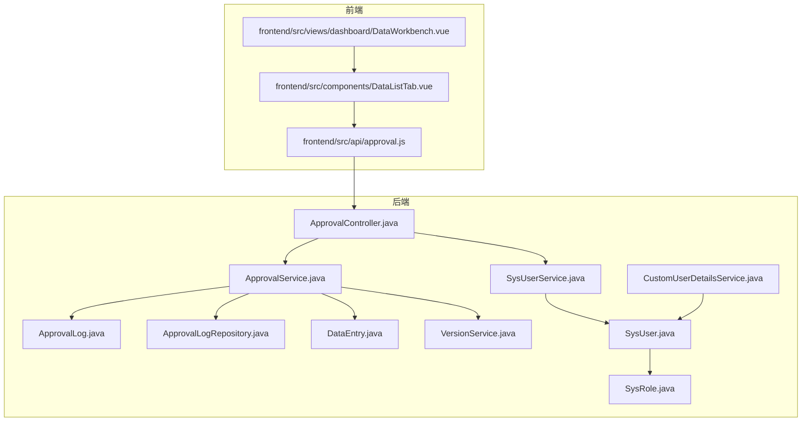
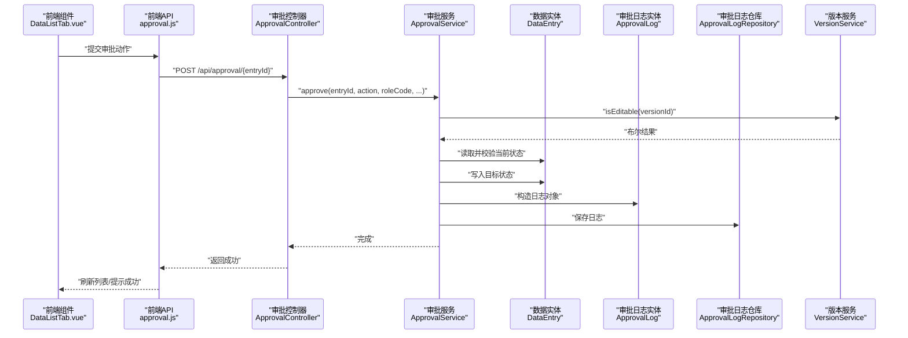
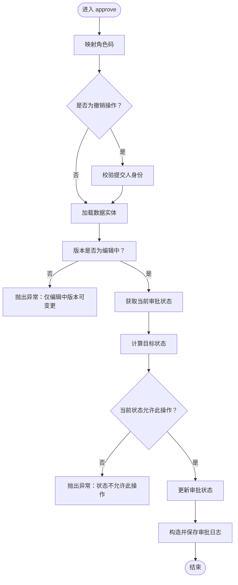
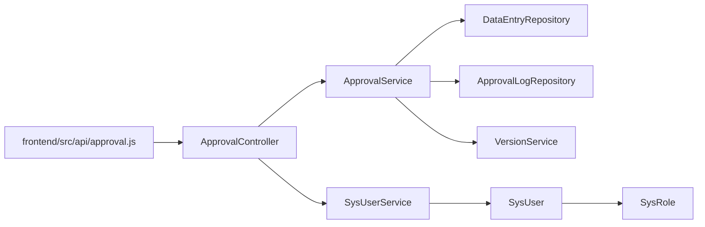

# 审批流程管理

<cite>
**本文引用的文件**
- [ApprovalController.java](file://src/main/java/com/superpower/modules/approval/controller/ApprovalController.java)
- [ApprovalService.java](file://src/main/java/com/superpower/modules/approval/service/ApprovalService.java)
- [ApprovalLog.java](file://src/main/java/com/superpower/modules/approval/entity/ApprovalLog.java)
- [ApprovalLogRepository.java](file://src/main/java/com/superpower/modules/approval/repository/ApprovalLogRepository.java)
- [DataEntry.java](file://src/main/java/com/superpower/modules/data/entity/DataEntry.java)
- [VersionService.java](file://src/main/java/com/superpower/modules/version/service/VersionService.java)
- [SysUser.java](file://src/main/java/com/superpower/modules/system/entity/SysUser.java)
- [SysRole.java](file://src/main/java/com/superpower/modules/system/entity/SysRole.java)
- [SysUserService.java](file://src/main/java/com/superpower/modules/system/service/SysUserService.java)
- [CustomUserDetailsService.java](file://src/main/java/com/superpower/security/CustomUserDetailsService.java)
- [approval.js](file://frontend/src/api/approval.js)
- [DataWorkbench.vue](file://frontend/src/views/dashboard/DataWorkbench.vue)
- [DataListTab.vue](file://frontend/src/components/DataListTab.vue)
- [2026-05-28-approval-workflow-design.md](file://docs/superpowers/specs/2026-05-28-approval-workflow-design.md)
- [2026-05-28-approval-workflow.md](file://docs/superpowers/plans/2026-05-28-approval-workflow.md)
</cite>

## 目录
1. [简介](#简介)
2. [项目结构](#项目结构)
3. [核心组件](#核心组件)
4. [架构总览](#架构总览)
5. [详细组件分析](#详细组件分析)
6. [依赖分析](#依赖分析)
7. [性能考虑](#性能考虑)
8. [故障排查指南](#故障排查指南)
9. [结论](#结论)
10. [附录](#附录)

## 简介
本文件面向“审批流程管理”功能，系统化阐述审批任务的创建、流转与状态管理，详解 ApprovalLog 实体设计、审批流程跟踪与状态变更记录，覆盖审批节点配置、权限控制与通知机制，并提供审批流程的 API 接口说明、前端审批界面使用指南与流程定制方法。同时，结合并发处理与审批历史审计能力，给出优化建议与最佳实践。

## 项目结构
审批流程相关代码采用分层架构组织，后端由控制器、服务、实体与仓库组成，前端通过 API 与视图组件进行交互；系统角色与用户体系支撑权限控制；版本服务保障状态变更前置条件。

图表来源
- [ApprovalController.java:18-55](file://src/main/java/com/superpower/modules/approval/controller/ApprovalController.java#L18-L55)
- [ApprovalService.java:16-119](file://src/main/java/com/superpower/modules/approval/service/ApprovalService.java#L16-L119)
- [ApprovalLog.java:7-38](file://src/main/java/com/superpower/modules/approval/entity/ApprovalLog.java#L7-L38)
- [ApprovalLogRepository.java:8-12](file://src/main/java/com/superpower/modules/approval/repository/ApprovalLogRepository.java#L8-L12)
- [DataEntry.java:12-36](file://src/main/java/com/superpower/modules/data/entity/DataEntry.java#L12-L36)
- [VersionService.java:8-22](file://src/main/java/com/superpower/modules/version/service/VersionService.java#L8-L22)
- [SysUser.java:7-39](file://src/main/java/com/superpower/modules/system/entity/SysUser.java#L7-L39)
- [SysRole.java:7-26](file://src/main/java/com/superpower/modules/system/entity/SysRole.java#L7-L26)
- [SysUserService.java:15-113](file://src/main/java/com/superpower/modules/system/service/SysUserService.java#L15-L113)
- [CustomUserDetailsService.java:14-37](file://src/main/java/com/superpower/security/CustomUserDetailsService.java#L14-L37)
- [approval.js:1-10](file://frontend/src/api/approval.js#L1-L10)
- [DataWorkbench.vue:332-371](file://frontend/src/views/dashboard/DataWorkbench.vue#L332-L371)
- [DataListTab.vue:1391-1402](file://frontend/src/components/DataListTab.vue#L1391-L1402)

章节来源
- [ApprovalController.java:18-55](file://src/main/java/com/superpower/modules/approval/controller/ApprovalController.java#L18-L55)
- [ApprovalService.java:16-119](file://src/main/java/com/superpower/modules/approval/service/ApprovalService.java#L16-L119)
- [DataEntry.java:12-36](file://src/main/java/com/superpower/modules/data/entity/DataEntry.java#L12-L36)
- [VersionService.java:8-22](file://src/main/java/com/superpower/modules/version/service/VersionService.java#L8-L22)
- [SysUser.java:7-39](file://src/main/java/com/superpower/modules/system/entity/SysUser.java#L7-L39)
- [SysRole.java:7-26](file://src/main/java/com/superpower/modules/system/entity/SysRole.java#L7-L26)
- [SysUserService.java:15-113](file://src/main/java/com/superpower/modules/system/service/SysUserService.java#L15-L113)
- [CustomUserDetailsService.java:14-37](file://src/main/java/com/superpower/security/CustomUserDetailsService.java#L14-L37)
- [approval.js:1-10](file://frontend/src/api/approval.js#L1-L10)
- [DataWorkbench.vue:332-371](file://frontend/src/views/dashboard/DataWorkbench.vue#L332-L371)
- [DataListTab.vue:1391-1402](file://frontend/src/components/DataListTab.vue#L1391-L1402)

## 核心组件
- 审批控制器：提供审批操作与审批日志查询接口，负责接收前端请求、解析用户身份与角色、调用服务层并记录操作日志。
- 审批服务：实现状态机与权限校验，确保仅在“编辑中”版本内变更审批状态，并记录审批日志。
- 审批日志实体与仓库：持久化审批状态变更历史，支持按数据项查询日志并按时间倒序展示。
- 数据实体：复用现有字段存储审批状态，保证与版本状态联动。
- 版本服务：判断版本是否处于“编辑中”，作为审批状态变更的前置条件。
- 用户与角色：系统用户实体关联角色，安全细节服务加载用户并映射角色权限，供控制器与服务使用。
- 前端 API 与视图：封装审批接口调用，驱动审批按钮显隐与日志查看。

章节来源
- [ApprovalController.java:22-54](file://src/main/java/com/superpower/modules/approval/controller/ApprovalController.java#L22-L54)
- [ApprovalService.java:16-119](file://src/main/java/com/superpower/modules/approval/service/ApprovalService.java#L16-L119)
- [ApprovalLog.java:7-38](file://src/main/java/com/superpower/modules/approval/entity/ApprovalLog.java#L7-L38)
- [ApprovalLogRepository.java:8-12](file://src/main/java/com/superpower/modules/approval/repository/ApprovalLogRepository.java#L8-L12)
- [DataEntry.java:35-36](file://src/main/java/com/superpower/modules/data/entity/DataEntry.java#L35-L36)
- [VersionService.java:13-21](file://src/main/java/com/superpower/modules/version/service/VersionService.java#L13-L21)
- [SysUser.java:24-26](file://src/main/java/com/superpower/modules/system/entity/SysUser.java#L24-L26)
- [SysRole.java:18-19](file://src/main/java/com/superpower/modules/system/entity/SysRole.java#L18-L19)
- [SysUserService.java:33-112](file://src/main/java/com/superpower/modules/system/service/SysUserService.java#L33-L112)
- [CustomUserDetailsService.java:23-35](file://src/main/java/com/superpower/security/CustomUserDetailsService.java#L23-L35)
- [approval.js:3-9](file://frontend/src/api/approval.js#L3-L9)
- [DataWorkbench.vue:332-334](file://frontend/src/views/dashboard/DataWorkbench.vue#L332-L334)

## 架构总览
审批流程围绕“状态机 + 权限矩阵 + 版本前置条件”的设计展开，前后端通过 REST 接口协作，前端负责交互与按钮显隐，后端负责业务规则与持久化。

图表来源
- [ApprovalController.java:35-49](file://src/main/java/com/superpower/modules/approval/controller/ApprovalController.java#L35-L49)
- [ApprovalService.java:62-107](file://src/main/java/com/superpower/modules/approval/service/ApprovalService.java#L62-L107)
- [ApprovalLog.java:98-106](file://src/main/java/com/superpower/modules/approval/entity/ApprovalLog.java#L98-L106)
- [ApprovalLogRepository.java:11-11](file://src/main/java/com/superpower/modules/approval/repository/ApprovalLogRepository.java#L11-L11)
- [DataEntry.java:35-36](file://src/main/java/com/superpower/modules/data/entity/DataEntry.java#L35-L36)
- [VersionService.java:19-21](file://src/main/java/com/superpower/modules/version/service/VersionService.java#L19-L21)
- [approval.js:3-5](file://frontend/src/api/approval.js#L3-L5)

## 详细组件分析

### 审批控制器（ApprovalController）
- 职责
  - 接收审批动作请求，解析 action 与 comment。
  - 解析当前用户角色码，调用审批服务执行业务。
  - 记录系统操作日志，便于审计与追踪。
- 关键点
  - 使用系统用户服务获取当前用户，角色码来自用户关联的角色实体。
  - 将用户昵称作为操作人名称传入服务层。
  - 日志标题包含审批动作与数据标题（优先取产品系统字段，否则回退为 ID）。

章节来源
- [ApprovalController.java:35-49](file://src/main/java/com/superpower/modules/approval/controller/ApprovalController.java#L35-L49)
- [SysUserService.java:33-35](file://src/main/java/com/superpower/modules/system/service/SysUserService.java#L33-L35)
- [SysUser.java:21-22](file://src/main/java/com/superpower/modules/system/entity/SysUser.java#L21-L22)

### 审批服务（ApprovalService）
- 状态机与权限矩阵
  - 定义四种状态：待提交、待审核、审核通过、驳回。
  - 定义状态流转集合与操作允许的角色集合。
  - 定义操作到目标状态的映射。
- 前置条件与校验
  - 仅当版本处于“编辑中”时允许变更审批状态。
  - 校验当前状态与目标状态之间的合法性。
  - 对“撤销”操作进行额外校验（仅提交人可撤销）。
- 事务性与持久化
  - 在同一事务中更新数据实体状态并写入审批日志。
  - 提供查询审批日志的接口，按时间倒序返回。

图表来源
- [ApprovalService.java:62-107](file://src/main/java/com/superpower/modules/approval/service/ApprovalService.java#L62-L107)
- [VersionService.java:19-21](file://src/main/java/com/superpower/modules/version/service/VersionService.java#L19-L21)

章节来源
- [ApprovalService.java:19-48](file://src/main/java/com/superpower/modules/approval/service/ApprovalService.java#L19-L48)
- [ApprovalService.java:62-107](file://src/main/java/com/superpower/modules/approval/service/ApprovalService.java#L62-L107)
- [ApprovalService.java:109-119](file://src/main/java/com/superpower/modules/approval/service/ApprovalService.java#L109-L119)

### 审批日志实体与仓库（ApprovalLog）
- 实体字段
  - 关联数据项 ID、起止状态、操作类型、操作人信息、评论与创建时间。
- 查询能力
  - 支持按数据项 ID 查询并按创建时间倒序排序。
  - 支持按数据项与操作类型查询最新一次记录（用于撤销校验）。

章节来源
- [ApprovalLog.java:15-37](file://src/main/java/com/superpower/modules/approval/entity/ApprovalLog.java#L15-L37)
- [ApprovalLogRepository.java:9-11](file://src/main/java/com/superpower/modules/approval/repository/ApprovalLogRepository.java#L9-L11)

### 数据实体（DataEntry）
- 审批状态字段
  - 复用现有字段存储审批状态，初始默认值为“待提交”。

章节来源
- [DataEntry.java:35-36](file://src/main/java/com/superpower/modules/data/entity/DataEntry.java#L35-L36)

### 版本服务（VersionService）
- 核心职责
  - 提供访问状态查询与“是否可编辑”判定。
- 与审批集成
  - 审批服务在执行状态变更前调用该服务进行前置校验。

章节来源
- [VersionService.java:13-21](file://src/main/java/com/superpower/modules/version/service/VersionService.java#L13-L21)

### 用户与角色体系
- 用户实体
  - 关联角色实体，提供用户名、昵称、状态等基础信息。
- 角色实体
  - 角色编码用于权限判定。
- 安全细节服务
  - 加载用户并将其角色映射为权限字符串，供认证与授权使用。
- 控制器与服务
  - 控制器通过系统用户服务获取当前用户与角色码。
  - 服务层将角色码映射为内部角色标识，参与权限与状态机判断。

章节来源
- [SysUser.java:24-26](file://src/main/java/com/superpower/modules/system/entity/SysUser.java#L24-L26)
- [SysRole.java:18-19](file://src/main/java/com/superpower/modules/system/entity/SysRole.java#L18-L19)
- [CustomUserDetailsService.java:23-35](file://src/main/java/com/superpower/security/CustomUserDetailsService.java#L23-L35)
- [SysUserService.java:33-112](file://src/main/java/com/superpower/modules/system/service/SysUserService.java#L33-L112)
- [ApprovalController.java:41-42](file://src/main/java/com/superpower/modules/approval/controller/ApprovalController.java#L41-L42)
- [ApprovalService.java:64-64](file://src/main/java/com/superpower/modules/approval/service/ApprovalService.java#L64-L64)

### 前端审批接口与界面
- 审批 API
  - 提交审批动作与获取审批日志两个接口。
- 审批按钮与日志查看
  - 列表页支持在操作列显示“提交/通过/驳回”等按钮，依据状态与角色动态显隐。
  - 支持查看审批日志弹窗，按时间倒序展示。

章节来源
- [approval.js:3-9](file://frontend/src/api/approval.js#L3-L9)
- [DataListTab.vue:1391-1402](file://frontend/src/components/DataListTab.vue#L1391-L1402)
- [DataWorkbench.vue:332-334](file://frontend/src/views/dashboard/DataWorkbench.vue#L332-L334)

## 依赖分析
- 组件耦合
  - 控制器依赖服务、系统用户服务与数据服务；服务依赖实体仓库、日志仓库与版本服务。
  - 前端 API 依赖通用请求工具，视图组件依赖前端 API。
- 外部依赖
  - Spring Security 提供认证与授权；Spring Data JPA 提供数据访问。
- 潜在循环依赖
  - 未见直接循环依赖；若后续扩展审批流程节点配置，需避免控制器与服务互相强耦合。

图表来源
- [ApprovalController.java:22-33](file://src/main/java/com/superpower/modules/approval/controller/ApprovalController.java#L22-L33)
- [ApprovalService.java:50-60](file://src/main/java/com/superpower/modules/approval/service/ApprovalService.java#L50-L60)
- [SysUserService.java:33-35](file://src/main/java/com/superpower/modules/system/service/SysUserService.java#L33-L35)
- [SysUser.java:24-26](file://src/main/java/com/superpower/modules/system/entity/SysUser.java#L24-L26)
- [SysRole.java:18-19](file://src/main/java/com/superpower/modules/system/entity/SysRole.java#L18-L19)

章节来源
- [ApprovalController.java:22-33](file://src/main/java/com/superpower/modules/approval/controller/ApprovalController.java#L22-L33)
- [ApprovalService.java:50-60](file://src/main/java/com/superpower/modules/approval/service/ApprovalService.java#L50-L60)
- [SysUserService.java:33-35](file://src/main/java/com/superpower/modules/system/service/SysUserService.java#L33-L35)
- [SysUser.java:24-26](file://src/main/java/com/superpower/modules/system/entity/SysUser.java#L24-L26)
- [SysRole.java:18-19](file://src/main/java/com/superpower/modules/system/entity/SysRole.java#L18-L19)

## 性能考虑
- 并发与一致性
  - 审批服务方法标注事务，确保状态更新与日志写入在同一事务内完成，避免脏读与不一致。
- 查询优化
  - 审批日志按数据项 ID 查询并按创建时间倒序，建议在数据库层面建立复合索引以提升排序与过滤性能。
- 前端渲染
  - 列表页按钮显隐逻辑应尽量在前端侧完成，减少不必要的网络请求；日志弹窗按需触发。
- 批量处理
  - 设计文档中规划了批量审批接口，后续可扩展以提升批量审批效率。

## 故障排查指南
- 常见错误与定位
  - “无权执行此操作”：检查当前用户角色与操作是否匹配权限矩阵。
  - “当前状态不允许此操作”：检查状态机中是否存在该流转路径。
  - “仅编辑中版本可变更审批状态”：确认数据所属版本状态。
  - “撤销失败（仅提交人可撤销）”：确认撤销操作人与最近一次提交人是否一致。
- 审计与追踪
  - 通过审批日志接口查看完整流转历史，定位问题发生的时间点与责任人。
- 建议排查步骤
  - 确认用户角色与权限映射正确。
  - 核对数据实体的审批状态与版本状态。
  - 检查日志表中是否存在对应记录，确认事务是否正常提交。

章节来源
- [ApprovalService.java:66-93](file://src/main/java/com/superpower/modules/approval/service/ApprovalService.java#L66-L93)
- [ApprovalLogRepository.java:11-11](file://src/main/java/com/superpower/modules/approval/repository/ApprovalLogRepository.java#L11-L11)
- [2026-05-28-approval-workflow-design.md:133-137](file://docs/superpowers/specs/2026-05-28-approval-workflow-design.md#L133-L137)

## 结论
审批流程管理通过清晰的状态机、严格的权限矩阵与版本前置条件，实现了可控的数据审批流转。ApprovalLog 实体与仓库提供了完整的审计能力，前后端协同确保用户体验与合规性。后续可在节点配置、通知机制与批量处理等方面进一步增强。

## 附录

### 审批流程 API 接口说明
- 提交审批动作
  - 方法与路径：POST /api/approval/{entryId}
  - 请求体：包含 action（submit|approve|reject）与 comment（可选）
  - 成功响应：返回成功结果
- 获取审批日志
  - 方法与路径：GET /api/approval/{entryId}/logs
  - 返回：按时间倒序排列的审批日志列表

章节来源
- [ApprovalController.java:35-54](file://src/main/java/com/superpower/modules/approval/controller/ApprovalController.java#L35-L54)
- [approval.js:3-9](file://frontend/src/api/approval.js#L3-L9)

### 前端审批界面使用指南
- 列表页操作列
  - 根据状态与角色动态显示“提交/通过/驳回/编辑/删除”等按钮。
- 审批日志查看
  - 点击“审批记录”打开弹窗，查看按时间倒序排列的日志。
- 用户角色传递
  - 页面通过本地存储或全局状态传递角色码，供组件判断按钮显隐。

章节来源
- [DataListTab.vue:1391-1402](file://frontend/src/components/DataListTab.vue#L1391-L1402)
- [DataWorkbench.vue:332-334](file://frontend/src/views/dashboard/DataWorkbench.vue#L332-L334)

### 审批节点配置、权限控制与通知机制
- 节点配置
  - 状态机与权限矩阵已在服务层集中定义，便于统一维护与扩展。
- 权限控制
  - 控制器与服务均基于角色码进行权限判定，安全细节服务负责角色映射。
- 通知机制
  - 设计文档中未包含通知机制的具体实现，可在服务层保存日志后扩展消息推送或站内信。

章节来源
- [ApprovalService.java:31-36](file://src/main/java/com/superpower/modules/approval/service/ApprovalService.java#L31-L36)
- [CustomUserDetailsService.java:23-35](file://src/main/java/com/superpower/security/CustomUserDetailsService.java#L23-L35)
- [2026-05-28-approval-workflow-design.md:37-54](file://docs/superpowers/specs/2026-05-28-approval-workflow-design.md#L37-L54)

### 审批效率优化与并发处理
- 事务边界
  - 审批服务方法标注事务，保证状态更新与日志写入原子性。
- 批量处理
  - 设计文档规划了批量审批接口，可用于提升批量审批效率。
- 前端优化
  - 按需加载日志、减少无效请求，提升交互流畅度。

章节来源
- [ApprovalService.java:62-107](file://src/main/java/com/superpower/modules/approval/service/ApprovalService.java#L62-L107)
- [2026-05-28-approval-workflow-design.md:101-111](file://docs/superpowers/specs/2026-05-28-approval-workflow-design.md#L101-L111)

### 审批历史审计功能
- 审计内容
  - 记录审批状态变更、操作人、操作类型与时间。
- 查询方式
  - 通过日志接口按数据项 ID 查询并按时间倒序排列。
- 系统日志联动
  - 控制器在审批完成后记录系统操作日志，便于统一审计。

章节来源
- [ApprovalLog.java:15-37](file://src/main/java/com/superpower/modules/approval/entity/ApprovalLog.java#L15-L37)
- [ApprovalLogRepository.java:9-11](file://src/main/java/com/superpower/modules/approval/repository/ApprovalLogRepository.java#L9-L11)
- [ApprovalController.java:45-47](file://src/main/java/com/superpower/modules/approval/controller/ApprovalController.java#L45-L47)