# 文档生成功能

<cite>
**本文档引用的文件**
- [DocGenRecord.java](file://src/main/java/com/superpower/modules/document/entity/DocGenRecord.java)
- [DocumentService.java](file://src/main/java/com/superpower/modules/document/service/DocumentService.java)
- [DocumentController.java](file://src/main/java/com/superpower/modules/document/controller/DocumentController.java)
- [DocGenerateRequest.java](file://src/main/java/com/superpower/modules/document/dto/DocGenerateRequest.java)
- [DocGenRecordRepository.java](file://src/main/java/com/superpower/modules/document/repository/DocGenRecordRepository.java)
- [generate_word.py](file://generate_word.py)
- [styles.xml](file://src/main/resources/templates/word/styles.xml)
- [numbering.xml](file://src/main/resources/templates/word/numbering.xml)
- [document.js](file://frontend/src/api/document.js)
- [init.sql](file://src/main/resources/db/init.sql)
</cite>

## 目录
1. [简介](#简介)
2. [项目结构](#项目结构)
3. [核心组件](#核心组件)
4. [架构概览](#架构概览)
5. [详细组件分析](#详细组件分析)
6. [依赖关系分析](#依赖关系分析)
7. [性能考虑](#性能考虑)
8. [故障排除指南](#故障排除指南)
9. [结论](#结论)
10. [附录](#附录)

## 简介

文档生成功能是产品管理系统中的核心模块，负责自动生成Word和Excel格式的文档报告。该功能支持批量文档生成、实时进度追踪、模板化处理和多种输出格式定制。

系统采用前后端分离架构，后端基于Spring Boot提供RESTful API，前端Vue.js提供用户界面，支持用户选择数据源、配置生成参数并监控生成进度。

## 项目结构

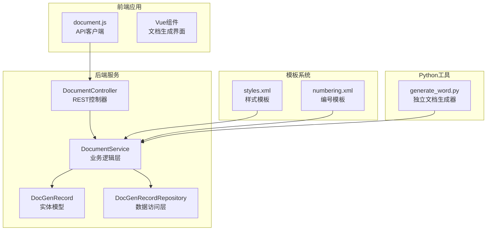

**图表来源**
- [DocumentController.java:31-51](file://src/main/java/com/superpower/modules/document/controller/DocumentController.java#L31-L51)
- [DocumentService.java:45-89](file://src/main/java/com/superpower/modules/document/service/DocumentService.java#L45-L89)
- [DocGenRecord.java:10-62](file://src/main/java/com/superpower/modules/document/entity/DocGenRecord.java#L10-L62)

**章节来源**
- [DocumentController.java:31-51](file://src/main/java/com/superpower/modules/document/controller/DocumentController.java#L31-L51)
- [DocumentService.java:45-89](file://src/main/java/com/superpower/modules/document/service/DocumentService.java#L45-L89)
- [DocGenRecord.java:10-62](file://src/main/java/com/superpower/modules/document/entity/DocGenRecord.java#L10-L62)

## 核心组件

### DocGenRecord 实体设计

DocGenRecord 是文档生成记录的核心实体，负责跟踪所有生成任务的状态和元数据：

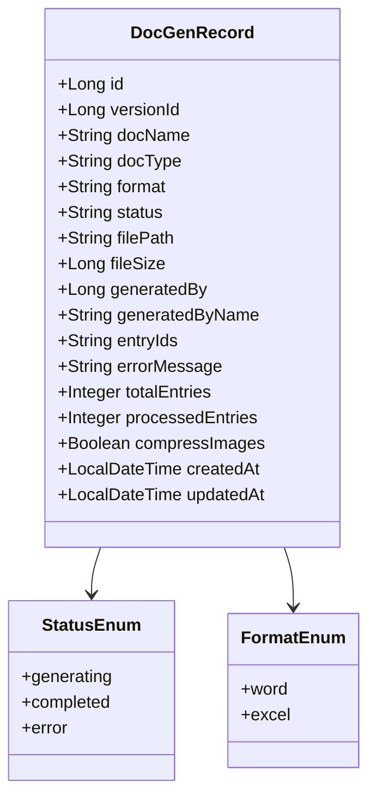

**图表来源**
- [DocGenRecord.java:10-62](file://src/main/java/com/superpower/modules/document/entity/DocGenRecord.java#L10-L62)

### 生成流程控制

系统采用异步生成模式，通过线程池管理并发任务：

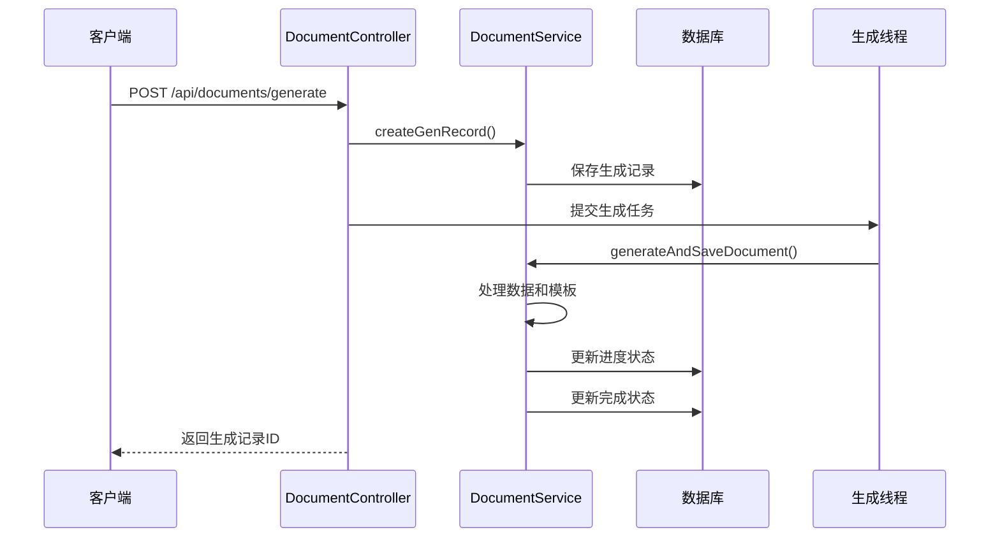

**图表来源**
- [DocumentController.java:79-107](file://src/main/java/com/superpower/modules/document/controller/DocumentController.java#L79-L107)
- [DocumentService.java:246-305](file://src/main/java/com/superpower/modules/document/service/DocumentService.java#L246-L305)

**章节来源**
- [DocGenRecord.java:10-62](file://src/main/java/com/superpower/modules/document/entity/DocGenRecord.java#L10-L62)
- [DocumentController.java:79-107](file://src/main/java/com/superpower/modules/document/controller/DocumentController.java#L79-L107)
- [DocumentService.java:246-305](file://src/main/java/com/superpower/modules/document/service/DocumentService.java#L246-L305)

## 架构概览

系统采用分层架构设计，确保职责分离和可维护性：

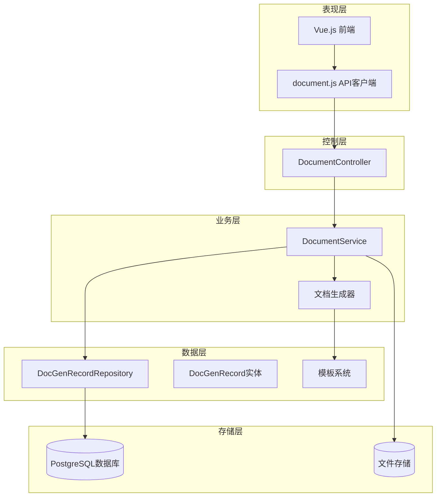

**图表来源**
- [DocumentController.java:31-51](file://src/main/java/com/superpower/modules/document/controller/DocumentController.java#L31-L51)
- [DocumentService.java:45-89](file://src/main/java/com/superpower/modules/document/service/DocumentService.java#L45-L89)
- [DocGenRecordRepository.java:11-18](file://src/main/java/com/superpower/modules/document/repository/DocGenRecordRepository.java#L11-L18)

## 详细组件分析

### Word文档生成引擎

Word文档生成引擎是系统的核心组件，负责将数据转换为格式化的Word文档：

#### 模板处理机制

系统使用Apache POI框架处理Word文档模板：

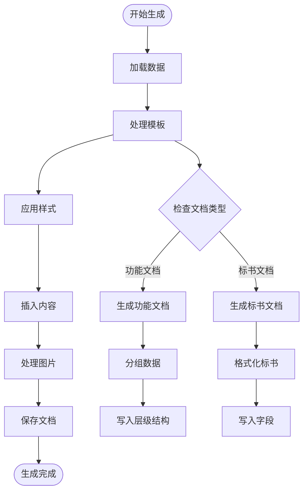

**图表来源**
- [DocumentService.java:332-456](file://src/main/java/com/superpower/modules/document/service/DocumentService.java#L332-L456)
- [DocumentService.java:395-518](file://src/main/java/com/superpower/modules/document/service/DocumentService.java#L395-L518)

#### 样式处理系统

系统内置完整的Word样式处理机制：

| 样式类型 | 描述 | 应用场景 |
|---------|------|----------|
| 标题1 | 一级标题样式 | 业务分类 |
| 标题2 | 二级标题样式 | 业务域 |
| 标题3 | 三级标题样式 | 功能节点 |
| 正文样式 | 默认正文样式 | 功能描述 |
| 列表样式 | 编号列表样式 | 子功能项 |

#### 编号系统配置

编号系统支持多级嵌套编号：

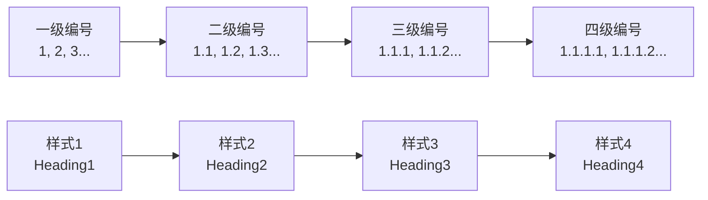

**图表来源**
- [numbering.xml:1-2](file://src/main/resources/templates/word/numbering.xml#L1-L2)
- [styles.xml:1-2](file://src/main/resources/templates/word/styles.xml#L1-L2)

**章节来源**
- [DocumentService.java:332-456](file://src/main/java/com/superpower/modules/document/service/DocumentService.java#L332-L456)
- [styles.xml:1-2](file://src/main/resources/templates/word/styles.xml#L1-L2)
- [numbering.xml:1-2](file://src/main/resources/templates/word/numbering.xml#L1-L2)

### Excel文档生成引擎

Excel生成引擎提供数据导出功能：

#### 数据筛选机制

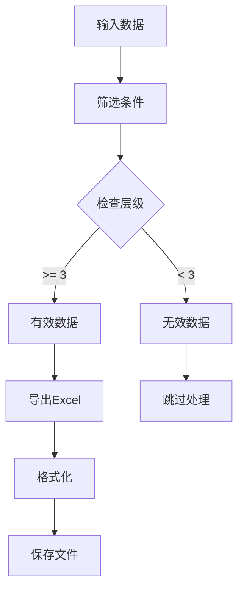

**图表来源**
- [DocumentService.java:284-290](file://src/main/java/com/superpower/modules/document/service/DocumentService.java#L284-L290)

**章节来源**
- [DocumentService.java:284-290](file://src/main/java/com/superpower/modules/document/service/DocumentService.java#L284-L290)

### 前端集成组件

前端提供完整的文档生成功能界面：

#### API接口设计

| 接口 | 方法 | 描述 | 参数 |
|------|------|------|------|
| `/api/documents/generate` | POST | 生成文档 | DocGenerateRequest |
| `/api/documents/records/{id}/progress` | GET | 获取生成进度 | recordId |
| `/api/documents/records` | GET | 获取生成记录 | versionId |
| `/api/documents/records/{id}/download` | GET | 下载生成文档 | recordId |
| `/api/documents/records/{id}` | DELETE | 删除生成记录 | id |

#### 前端交互流程

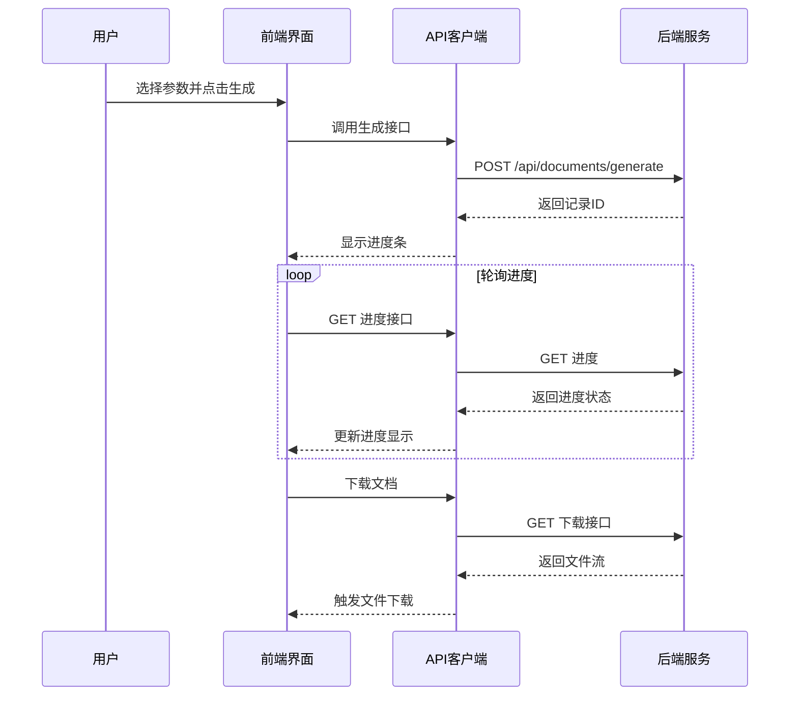

**图表来源**
- [document.js:3-31](file://frontend/src/api/document.js#L3-L31)

**章节来源**
- [document.js:3-31](file://frontend/src/api/document.js#L3-L31)

### Python独立生成器

系统还提供了独立的Python文档生成器：

#### 主要功能特性

- 支持从Excel文件直接生成Word文档
- 自动处理图片下载和格式转换
- 支持批量处理多个Excel文件
- 提供详细的日志输出和错误处理

#### 使用示例

```bash
# 基本用法
python generate_word.py input.xlsx

# 指定输出文件
python generate_word.py input.xlsx output.docx
```

**章节来源**
- [generate_word.py:28-48](file://generate_word.py#L28-L48)

## 依赖关系分析

系统采用模块化设计，各组件间依赖关系清晰：

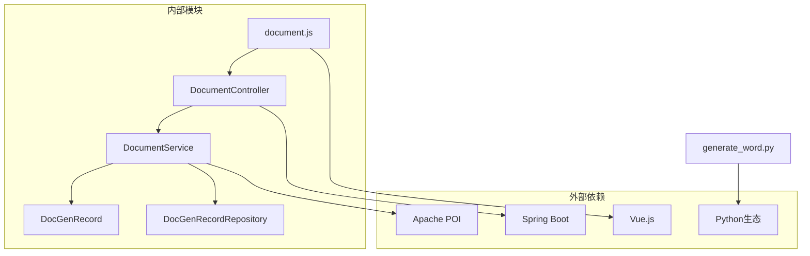

**图表来源**
- [DocumentController.java:31-51](file://src/main/java/com/superpower/modules/document/controller/DocumentController.java#L31-L51)
- [DocumentService.java:45-89](file://src/main/java/com/superpower/modules/document/service/DocumentService.java#L45-L89)

**章节来源**
- [DocumentController.java:31-51](file://src/main/java/com/superpower/modules/document/controller/DocumentController.java#L31-L51)
- [DocumentService.java:45-89](file://src/main/java/com/superpower/modules/document/service/DocumentService.java#L45-L89)

## 性能考虑

### 并发处理优化

系统采用固定大小的线程池管理文档生成任务：

- **线程池大小**: 3个并发线程
- **任务队列**: 无界队列（根据需要可调整）
- **超时控制**: 10分钟超时自动取消

### 内存管理策略

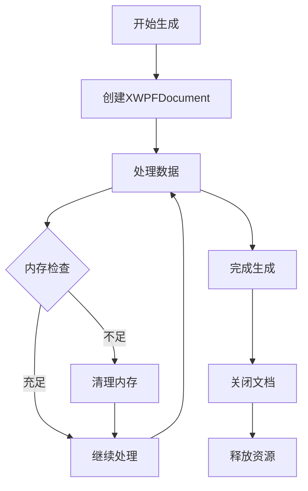

**图表来源**
- [DocumentService.java:333-341](file://src/main/java/com/superpower/modules/document/service/DocumentService.java#L333-L341)

### 图片处理优化

系统实现了智能的图片处理策略：

- **图片压缩**: 支持可选的图片压缩功能
- **缓存机制**: 避免重复下载相同图片
- **格式转换**: 自动处理不同图片格式
- **尺寸适配**: 根据图片方向自动调整显示尺寸

**章节来源**
- [DocumentService.java:333-341](file://src/main/java/com/superpower/modules/document/service/DocumentService.java#L333-L341)

## 故障排除指南

### 常见问题及解决方案

#### 生成任务超时

**问题症状**: 生成任务在10分钟后自动取消

**解决方法**:
1. 检查网络连接是否稳定
2. 确认目标服务器可达
3. 增加超时时间配置
4. 减少同时生成的任务数量

#### 图片下载失败

**问题症状**: 文档中缺少图片或显示错误提示

**解决方法**:
1. 检查图片URL的有效性
2. 确认图片服务器可访问
3. 验证图片格式支持情况
4. 检查防火墙设置

#### 内存不足错误

**问题症状**: 生成过程中出现内存溢出

**解决方法**:
1. 减少单次生成的数据量
2. 启用图片压缩功能
3. 增加服务器内存
4. 优化模板复杂度

### 日志分析

系统提供详细的日志记录，便于问题诊断：

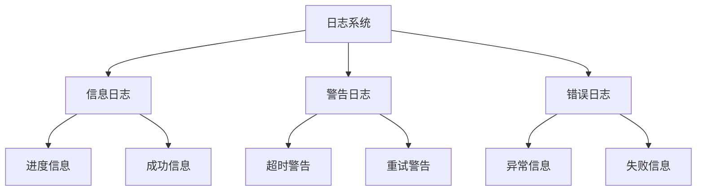

**图表来源**
- [DocumentService.java:100-112](file://src/main/java/com/superpower/modules/document/service/DocumentService.java#L100-L112)

**章节来源**
- [DocumentService.java:100-112](file://src/main/java/com/superpower/modules/document/service/DocumentService.java#L100-L112)

## 结论

文档生成功能通过模块化设计和完善的错误处理机制，为用户提供了一个稳定可靠的文档自动化解决方案。系统支持多种输出格式、灵活的模板配置和实时的进度追踪，能够满足不同场景下的文档生成需求。

未来可以考虑的改进方向包括：
- 增加更多的输出格式支持
- 优化大数据量处理性能
- 扩展模板编辑功能
- 增强安全性和权限控制

## 附录

### 数据库表结构

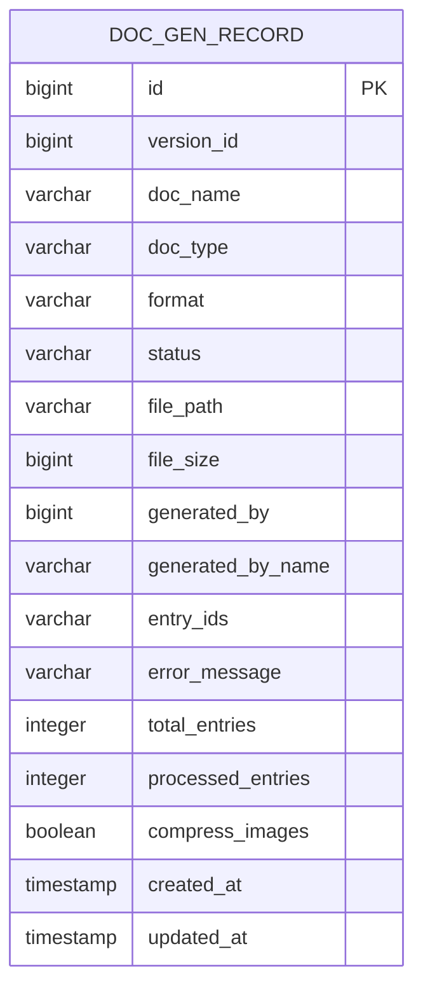

**图表来源**
- [DocGenRecord.java:10-62](file://src/main/java/com/superpower/modules/document/entity/DocGenRecord.java#L10-L62)

### 配置选项说明

| 配置项 | 默认值 | 描述 |
|--------|--------|------|
| app.doc-storage-path | ./generated-docs | 生成文档存储路径 |
| app.image-storage-path | ./uploads/images | 图片存储路径 |
| doc-gen-thread-count | 3 | 并发生成线程数 |
| generation-timeout | 600000ms | 生成任务超时时间 |

**章节来源**
- [DocGenRecord.java:10-62](file://src/main/java/com/superpower/modules/document/entity/DocGenRecord.java#L10-L62)
- [init.sql:68-125](file://src/main/resources/db/init.sql#L68-L125)