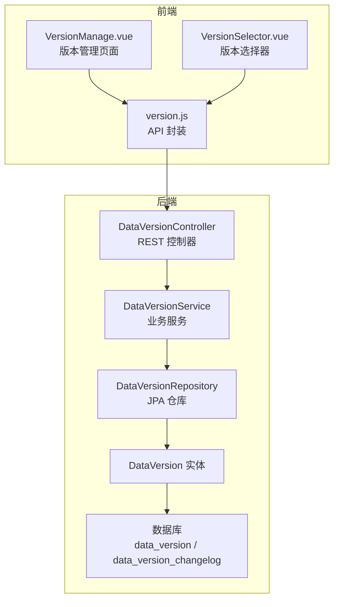
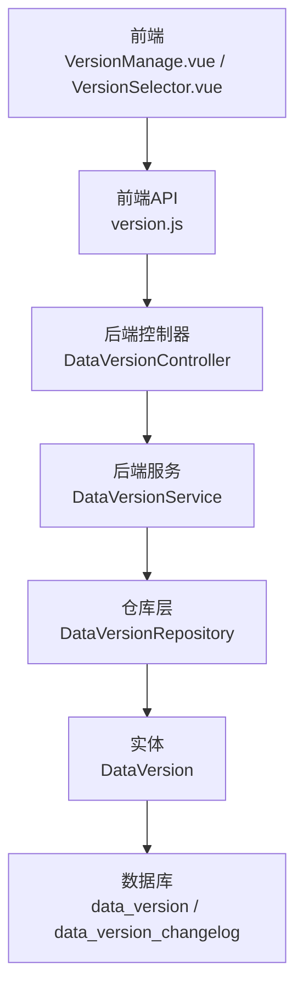
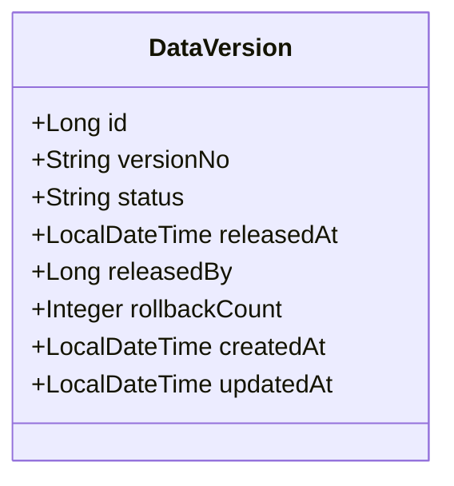
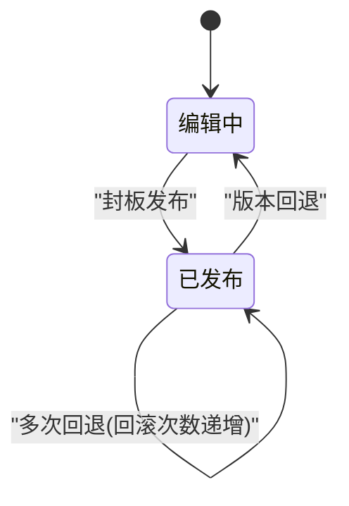
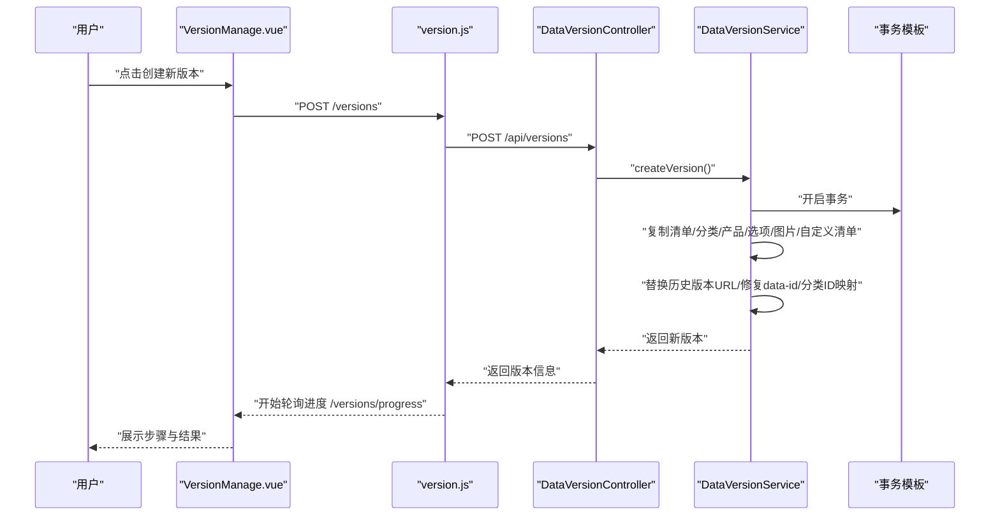
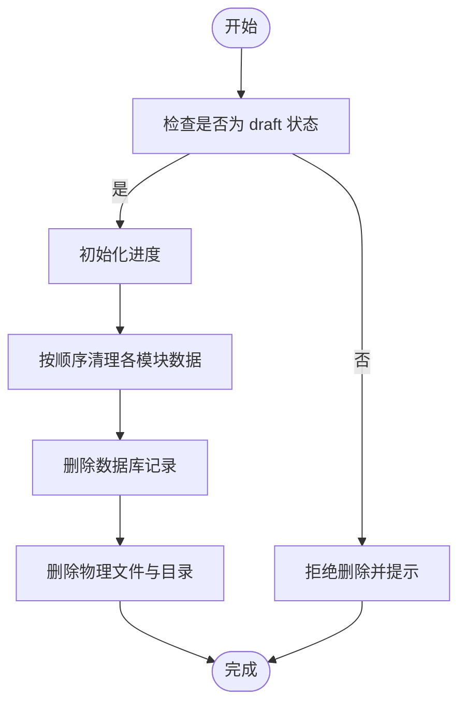
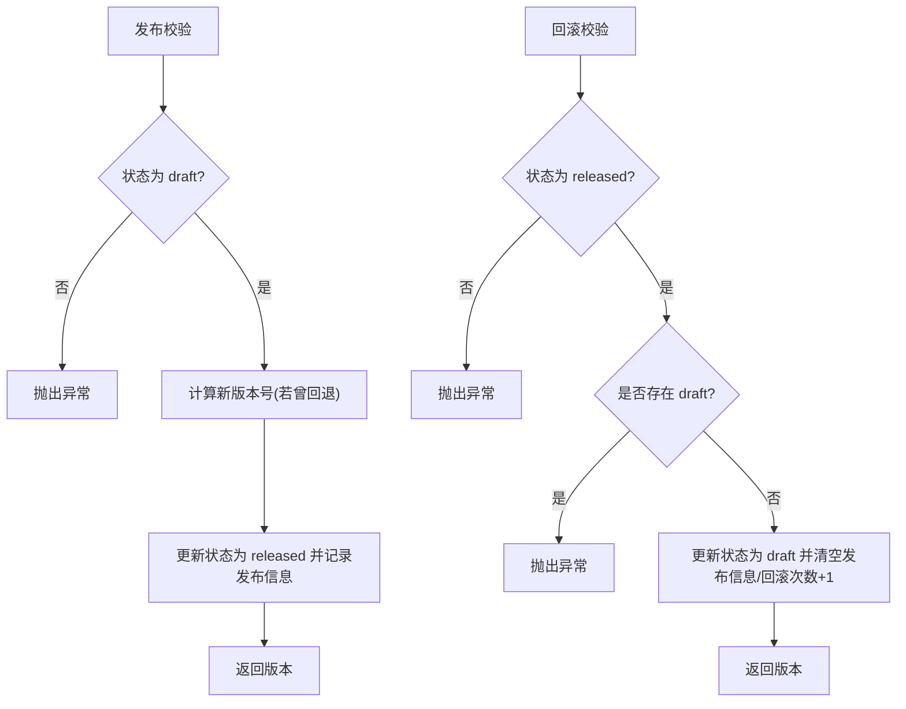
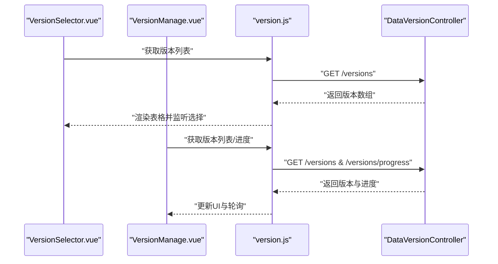
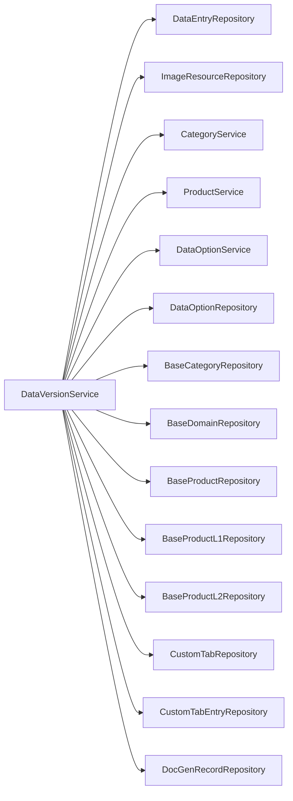

# 版本控制系统

<cite>
**本文档引用的文件**
- [DataVersion.java](file://src/main/java/com/superpower/modules/version/entity/DataVersion.java)
- [DataVersionController.java](file://src/main/java/com/superpower/modules/version/controller/DataVersionController.java)
- [DataVersionService.java](file://src/main/java/com/superpower/modules/version/service/DataVersionService.java)
- [DataVersionRepository.java](file://src/main/java/com/superpower/modules/version/repository/DataVersionRepository.java)
- [version.js](file://frontend/src/api/version.js)
- [VersionSelector.vue](file://frontend/src/components/VersionSelector.vue)
- [VersionManage.vue](file://frontend/src/views/system/VersionManage.vue)
- [init.sql](file://src/main/resources/db/init.sql)
- [V1.0.2_fix_hierarchy_level_and_parent.sql](file://db_changes/V1.0.2_fix_hierarchy_level_and_parent.sql)
- [V1.0.9_fix_l3_images.sql](file://db_changes/V1.0.9_fix_l3_images.sql)
- [VERSION.md](file://VERSION.md)
- [DataEntryController.java](file://src/main/java/com/superpower/modules/data/controller/DataEntryController.java)
- [DataEntryService.java](file://src/main/java/com/superpower/modules/data/service/DataEntryService.java)
- [DataEntryRepository.java](file://src/main/java/com/superpower/modules/data/repository/DataEntryRepository.java)
- [DataVersion.java（测试）](file://src/test/java/com/superpower/modules/data/service/DataEntryServiceTest.java)
</cite>

## 目录
1. [简介](#简介)
2. [项目结构](#项目结构)
3. [核心组件](#核心组件)
4. [架构总览](#架构总览)
5. [详细组件分析](#详细组件分析)
6. [依赖关系分析](#依赖关系分析)
7. [性能考虑](#性能考虑)
8. [故障排查指南](#故障排查指南)
9. [结论](#结论)
10. [附录](#附录)

## 简介
本版本控制系统围绕“数据版本”进行全生命周期管理，覆盖版本创建、版本切换、版本比较与版本回滚等核心能力。系统通过版本实体统一管理版本状态与元数据，并在后端实现跨模块的数据复制与一致性维护，在前端提供版本选择器与版本管理界面，支持异步进度跟踪与可视化反馈。

## 项目结构
版本控制相关代码主要分布在后端 Spring Boot 模块的 version 包与前端 Vue 组件中，配合数据库初始化脚本与历史迁移脚本，形成完整的版本数据模型与演进路径。

图表来源
- [DataVersionController.java:1-106](file://src/main/java/com/superpower/modules/version/controller/DataVersionController.java#L1-L106)
- [DataVersionService.java:1-721](file://src/main/java/com/superpower/modules/version/service/DataVersionService.java#L1-L721)
- [DataVersionRepository.java:1-20](file://src/main/java/com/superpower/modules/version/repository/DataVersionRepository.java#L1-L20)
- [DataVersion.java:1-36](file://src/main/java/com/superpower/modules/version/entity/DataVersion.java#L1-L36)
- [version.js:1-34](file://frontend/src/api/version.js#L1-L34)
- [VersionSelector.vue:1-56](file://frontend/src/components/VersionSelector.vue#L1-L56)
- [VersionManage.vue:1-259](file://frontend/src/views/system/VersionManage.vue#L1-L259)
- [init.sql:44-66](file://src/main/resources/db/init.sql#L44-L66)

章节来源
- [DataVersionController.java:1-106](file://src/main/java/com/superpower/modules/version/controller/DataVersionController.java#L1-L106)
- [DataVersionService.java:1-721](file://src/main/java/com/superpower/modules/version/service/DataVersionService.java#L1-L721)
- [DataVersionRepository.java:1-20](file://src/main/java/com/superpower/modules/version/repository/DataVersionRepository.java#L1-L20)
- [DataVersion.java:1-36](file://src/main/java/com/superpower/modules/version/entity/DataVersion.java#L1-L36)
- [version.js:1-34](file://frontend/src/api/version.js#L1-L34)
- [VersionSelector.vue:1-56](file://frontend/src/components/VersionSelector.vue#L1-L56)
- [VersionManage.vue:1-259](file://frontend/src/views/system/VersionManage.vue#L1-L259)
- [init.sql:44-66](file://src/main/resources/db/init.sql#L44-L66)

## 核心组件
- 数据版本实体：承载版本号、状态、发布时间、发布人、回滚次数与时间戳等元数据。
- 版本控制器：提供版本列表、创建、发布、回滚、删除与进度查询等接口。
- 版本服务：实现版本创建的多步骤异步复制、删除的级联清理、发布与回滚的状态转换。
- 版本仓库：基于 JPA 提供版本查询与状态检查。
- 前端 API：封装版本相关的 HTTP 请求。
- 前端组件：版本选择器与版本管理页面，支持进度轮询与操作确认。

章节来源
- [DataVersion.java:10-35](file://src/main/java/com/superpower/modules/version/entity/DataVersion.java#L10-L35)
- [DataVersionController.java:36-104](file://src/main/java/com/superpower/modules/version/controller/DataVersionController.java#L36-L104)
- [DataVersionService.java:152-203](file://src/main/java/com/superpower/modules/version/service/DataVersionService.java#L152-L203)
- [DataVersionRepository.java:10-19](file://src/main/java/com/superpower/modules/version/repository/DataVersionRepository.java#L10-L19)
- [version.js:7-33](file://frontend/src/api/version.js#L7-L33)
- [VersionSelector.vue:1-56](file://frontend/src/components/VersionSelector.vue#L1-L56)
- [VersionManage.vue:82-239](file://frontend/src/views/system/VersionManage.vue#L82-L239)

## 架构总览
版本控制采用“前后端分离 + 后端服务编排”的架构。前端负责交互与进度展示，后端通过服务层协调多个子系统（清单、分类、产品、选项、图片、自定义清单、文档记录）完成版本复制与清理。

图表来源
- [DataVersionController.java:19-34](file://src/main/java/com/superpower/modules/version/controller/DataVersionController.java#L19-L34)
- [DataVersionService.java:70-102](file://src/main/java/com/superpower/modules/version/service/DataVersionService.java#L70-L102)
- [DataVersionRepository.java:10-19](file://src/main/java/com/superpower/modules/version/repository/DataVersionRepository.java#L10-L19)
- [DataVersion.java:10-35](file://src/main/java/com/superpower/modules/version/entity/DataVersion.java#L10-L35)
- [version.js:1-34](file://frontend/src/api/version.js#L1-L34)
- [VersionManage.vue:82-146](file://frontend/src/views/system/VersionManage.vue#L82-L146)

## 详细组件分析

### 数据版本实体设计
- 关键字段：版本号、状态（draft/released）、发布时间、发布人、回滚次数、创建与更新时间。
- 设计要点：状态驱动业务流程；回滚次数用于版本号升级策略；时间戳便于审计与追踪。

图表来源
- [DataVersion.java:10-35](file://src/main/java/com/superpower/modules/version/entity/DataVersion.java#L10-L35)

章节来源
- [DataVersion.java:10-35](file://src/main/java/com/superpower/modules/version/entity/DataVersion.java#L10-L35)

### 版本状态管理与版本历史追踪
- 状态机：draft（编辑中）↔ released（已发布）。发布后版本不可再编辑；退回后回到 draft 并增加回滚次数。
- 历史追踪：数据库包含版本变更日志表，可记录字段变更与操作者信息，支撑审计与溯源。

图表来源
- [DataVersion.java:18-31](file://src/main/java/com/superpower/modules/version/entity/DataVersion.java#L18-L31)
- [DataVersionService.java:647-689](file://src/main/java/com/superpower/modules/version/service/DataVersionService.java#L647-L689)
- [init.sql:55-66](file://src/main/resources/db/init.sql#L55-L66)

章节来源
- [DataVersionService.java:647-689](file://src/main/java/com/superpower/modules/version/service/DataVersionService.java#L647-L689)
- [init.sql:55-66](file://src/main/resources/db/init.sql#L55-L66)

### 版本创建流程（异步多步骤）
- 触发条件：若存在 draft 版本则拒绝新建；否则生成新版本号（主版本号不变时次版本+1）。
- 复制范围：清单数据、业务分类、产品分类、基础选项、图片资源、自定义清单。
- 一致性保障：步骤7统一替换所有历史版本号的图片URL，修复data-id映射与分类ID映射，确保新版本引用正确。
- 进度反馈：通过 VersionProgress/StepStatus 对象异步轮询展示。

图表来源
- [DataVersionController.java:66-77](file://src/main/java/com/superpower/modules/version/controller/DataVersionController.java#L66-L77)
- [DataVersionService.java:152-203](file://src/main/java/com/superpower/modules/version/service/DataVersionService.java#L152-L203)
- [DataVersionService.java:205-474](file://src/main/java/com/superpower/modules/version/service/DataVersionService.java#L205-L474)
- [VersionManage.vue:115-139](file://frontend/src/views/system/VersionManage.vue#L115-L139)

章节来源
- [DataVersionService.java:152-203](file://src/main/java/com/superpower/modules/version/service/DataVersionService.java#L152-L203)
- [DataVersionService.java:205-474](file://src/main/java/com/superpower/modules/version/service/DataVersionService.java#L205-L474)
- [VersionManage.vue:115-139](file://frontend/src/views/system/VersionManage.vue#L115-L139)

### 版本删除流程（级联清理）
- 仅允许删除 draft 状态版本；删除前进行风险提示。
- 清理顺序：自定义清单项 → 自定义清单 → 清单数据 → 业务分类/产品分类 → 基础选项 → 图片资源 → 文档生成记录 → 版本记录。
- 物理文件清理：事务完成后异步删除图片物理文件与目录。

图表来源
- [DataVersionService.java:506-542](file://src/main/java/com/superpower/modules/version/service/DataVersionService.java#L506-L542)
- [DataVersionService.java:544-645](file://src/main/java/com/superpower/modules/version/service/DataVersionService.java#L544-L645)

章节来源
- [DataVersionService.java:506-542](file://src/main/java/com/superpower/modules/version/service/DataVersionService.java#L506-L542)
- [DataVersionService.java:544-645](file://src/main/java/com/superpower/modules/version/service/DataVersionService.java#L544-L645)

### 版本发布与回滚
- 发布：将 draft 状态置为 released，并记录发布时间与发布人；若版本曾被退回，则升级版本号（补丁位+1）。
- 回滚：将 released 状态置为 draft，重置发布时间与发布人，回滚次数+1；同时拒绝存在 draft 的情况下再次回滚。

图表来源
- [DataVersionService.java:647-673](file://src/main/java/com/superpower/modules/version/service/DataVersionService.java#L647-L673)
- [DataVersionService.java:675-689](file://src/main/java/com/superpower/modules/version/service/DataVersionService.java#L675-L689)

章节来源
- [DataVersionService.java:647-673](file://src/main/java/com/superpower/modules/version/service/DataVersionService.java#L647-L673)
- [DataVersionService.java:675-689](file://src/main/java/com/superpower/modules/version/service/DataVersionService.java#L675-L689)

### 前端版本选择器与管理界面
- 版本选择器：支持拉取版本列表、高亮当前选中、确认选择。
- 版本管理页面：展示版本列表、状态标签、发布人与日期、封板发布/退回/删除按钮；支持进度轮询与结果提示。

图表来源
- [VersionSelector.vue:30-55](file://frontend/src/components/VersionSelector.vue#L30-L55)
- [VersionManage.vue:82-146](file://frontend/src/views/system/VersionManage.vue#L82-L146)
- [version.js:7-21](file://frontend/src/api/version.js#L7-L21)

章节来源
- [VersionSelector.vue:1-56](file://frontend/src/components/VersionSelector.vue#L1-L56)
- [VersionManage.vue:1-259](file://frontend/src/views/system/VersionManage.vue#L1-L259)
- [version.js:1-34](file://frontend/src/api/version.js#L1-L34)

### 并发控制与数据一致性
- 事务边界：版本创建/删除/发布/回滚均在独立事务中执行，避免部分成功导致的数据不一致。
- 并发约束：创建新版本前检查是否存在 draft；回滚前检查是否存在 draft，防止并发状态下状态冲突。
- 读写隔离：通过 JPA 查询与状态检查，确保在业务逻辑中读取到一致的版本状态。

章节来源
- [DataVersionService.java:152-155](file://src/main/java/com/superpower/modules/version/service/DataVersionService.java#L152-L155)
- [DataVersionService.java:675-683](file://src/main/java/com/superpower/modules/version/service/DataVersionService.java#L675-L683)
- [DataEntryController.java:47-51](file://src/main/java/com/superpower/modules/data/controller/DataEntryController.java#L47-L51)

### 版本比较与版本切换
- 版本比较：通过版本号与状态对比，结合发布人与日期进行横向比较；前端可按需扩展差异展示。
- 版本切换：当前版本由 draft 或最新 released 决定；切换后前端应刷新数据视图并重新加载版本列表。

章节来源
- [VersionManage.vue:101-106](file://frontend/src/views/system/VersionManage.vue#L101-L106)

### 版本冲突处理
- 已发布版本禁止修改：后端在清单操作前校验版本状态，非 draft 直接拒绝。
- 回滚冲突：若存在 draft 版本则拒绝回滚，避免并发修改导致的引用错乱。

章节来源
- [DataEntryService.java:650-656](file://src/main/java/com/superpower/modules/data/service/DataEntryService.java#L650-L656)
- [DataEntryController.java:47-51](file://src/main/java/com/superpower/modules/data/controller/DataEntryController.java#L47-L51)
- [DataVersionService.java:675-683](file://src/main/java/com/superpower/modules/version/service/DataVersionService.java#L675-L683)

### API 接口说明
- 获取全部版本：GET /api/versions
- 获取已发布版本：GET /api/versions/released
- 创建版本：POST /api/versions
- 获取进度：GET /api/versions/progress
- 删除版本：DELETE /api/versions/{id}
- 封板发布：POST /api/versions/{id}/release
- 版本回滚：POST /api/versions/{id}/rollback

章节来源
- [DataVersionController.java:36-104](file://src/main/java/com/superpower/modules/version/controller/DataVersionController.java#L36-L104)

### 前端版本选择器组件使用
- 属性：visible（是否显示）
- 事件：update:visible、select
- 行为：拉取版本列表、高亮当前行、触发 select 回调

章节来源
- [VersionSelector.vue:30-55](file://frontend/src/components/VersionSelector.vue#L30-L55)

### 最佳实践
- 版本创建：优先从最新 released 版本克隆，确保基线一致；创建后及时发布，避免长期 draft。
- 版本删除：仅删除 draft；删除前评估影响范围；删除后核对物理文件清理情况。
- 发布策略：回退过的版本发布时自动升级版本号，便于追踪历史。
- 前端交互：使用进度轮询与确认对话框，降低误操作风险。

章节来源
- [VERSION.md:106-120](file://VERSION.md#L106-L120)
- [VersionManage.vue:153-235](file://frontend/src/views/system/VersionManage.vue#L153-L235)

## 依赖关系分析
版本控制模块与数据清单、分类、产品、选项、图片、自定义清单、文档记录等多个模块存在强耦合，服务层通过注入各模块仓库与服务完成跨模块复制与清理。

图表来源
- [DataVersionService.java:70-102](file://src/main/java/com/superpower/modules/version/service/DataVersionService.java#L70-L102)

章节来源
- [DataVersionService.java:70-102](file://src/main/java/com/superpower/modules/version/service/DataVersionService.java#L70-L102)

## 性能考虑
- 异步执行：版本创建/删除采用单线程异步执行器，避免阻塞主线程；通过进度对象轮询反馈。
- 分批处理：清单、图片等大体量数据复制采用分批保存与进度统计，减少内存压力。
- 事务粒度：每个步骤在独立事务中执行，失败可定位具体步骤并重试。
- 索引优化：历史脚本新增多处索引（如按版本+层级、版本+父节点+排序等），提升查询效率。

章节来源
- [DataVersionService.java:62-66](file://src/main/java/com/superpower/modules/version/service/DataVersionService.java#L62-L66)
- [DataVersionService.java:210-240](file://src/main/java/com/superpower/modules/version/service/DataVersionService.java#L210-L240)
- [V1.0.2_fix_hierarchy_level_and_parent.sql:18-28](file://db_changes/V1.0.2_fix_hierarchy_level_and_parent.sql#L18-L28)

## 故障排查指南
- 创建失败：检查是否存在 draft 版本；查看进度对象中的错误信息；核对图片目录权限与存储路径。
- 删除失败：确认版本状态为 draft；检查物理文件删除日志；必要时手动清理残留目录。
- 发布失败：确认版本状态为 draft；若版本曾回退，检查版本号升级逻辑。
- 回滚失败：确认不存在 draft 版本；检查版本状态是否为 released。
- 清单不可编辑：确认当前版本为 draft；后端会拦截已发布版本的修改请求。

章节来源
- [DataVersionService.java:152-155](file://src/main/java/com/superpower/modules/version/service/DataVersionService.java#L152-L155)
- [DataVersionService.java:675-683](file://src/main/java/com/superpower/modules/version/service/DataVersionService.java#L675-L683)
- [DataEntryService.java:650-656](file://src/main/java/com/superpower/modules/data/service/DataEntryService.java#L650-L656)
- [DataEntryServiceTest.java:62-71](file://src/test/java/com/superpower/modules/data/service/DataEntryServiceTest.java#L62-L71)

## 结论
本版本控制系统通过清晰的状态机、完善的跨模块复制与清理流程、以及前后端协同的进度反馈，实现了稳定可靠的版本管理能力。建议在生产环境中结合索引优化与定期备份策略，持续保障数据一致性与可恢复性。

## 附录
- 数据库初始化：包含 data_version 与 data_version_changelog 表结构。
- 历史迁移：包含层级修复与图片目录层级修复等脚本，体现版本演进过程。
- 版本变更记录：记录版本创建、删除、图片URL修复与SQL执行等功能迭代。

章节来源
- [init.sql:44-66](file://src/main/resources/db/init.sql#L44-L66)
- [V1.0.2_fix_hierarchy_level_and_parent.sql:1-28](file://db_changes/V1.0.2_fix_hierarchy_level_and_parent.sql#L1-L28)
- [V1.0.9_fix_l3_images.sql:1-12](file://db_changes/V1.0.9_fix_l3_images.sql#L1-L12)
- [VERSION.md:106-120](file://VERSION.md#L106-L120)