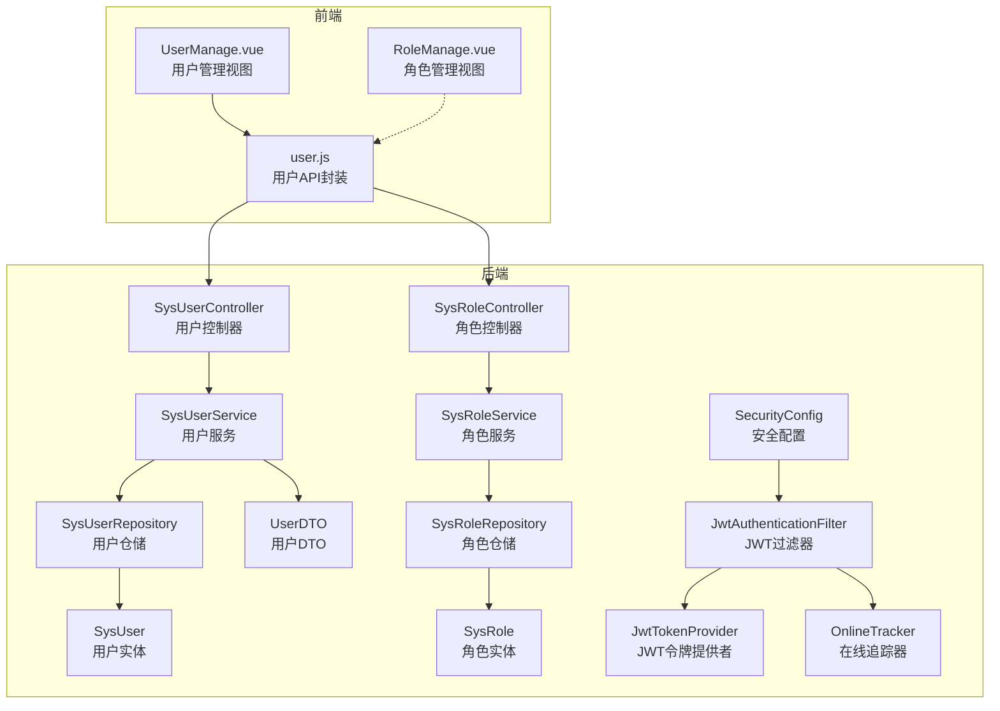
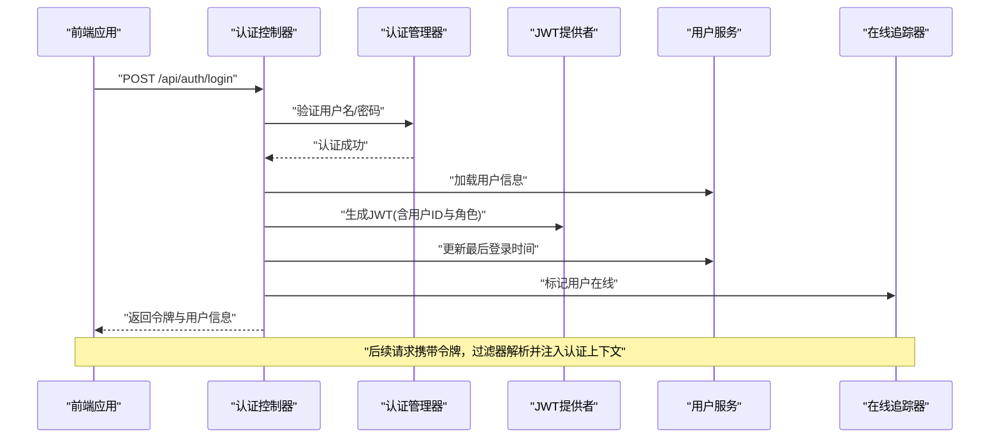
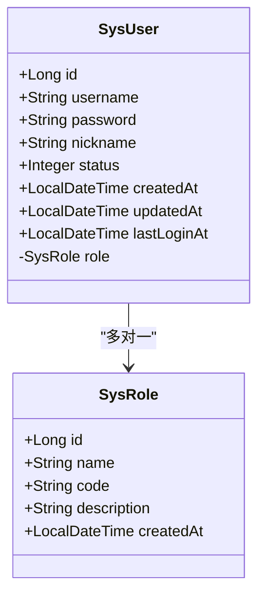
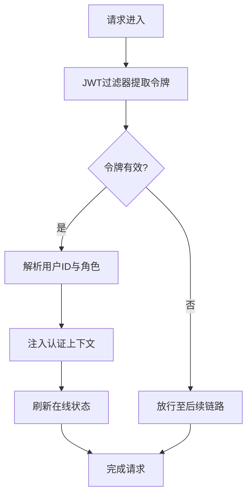
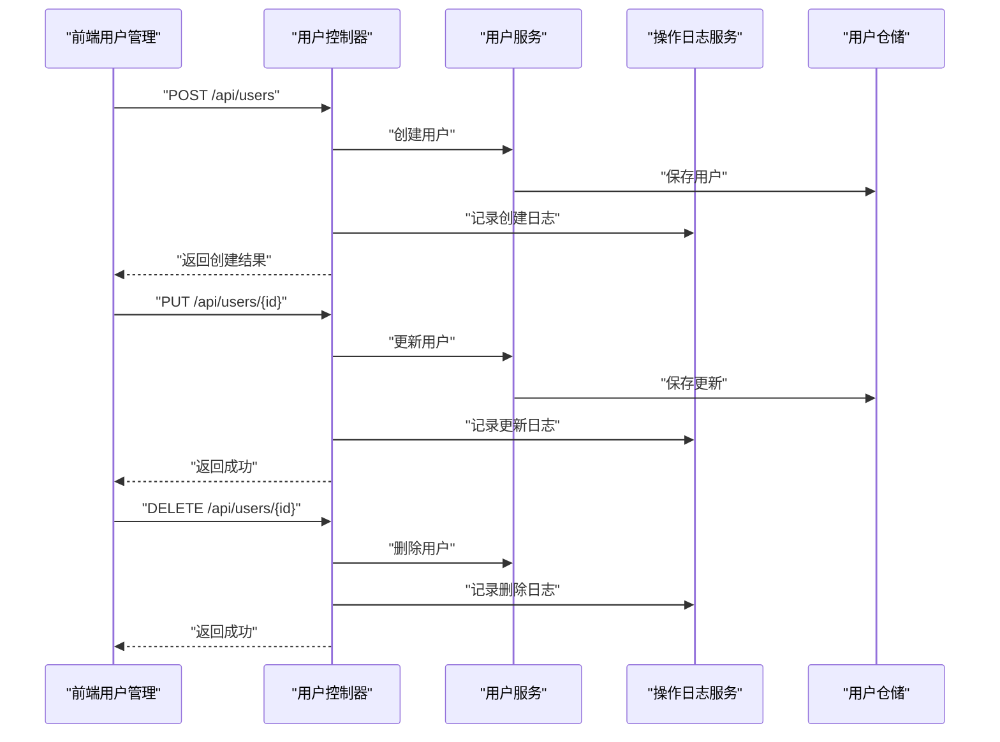
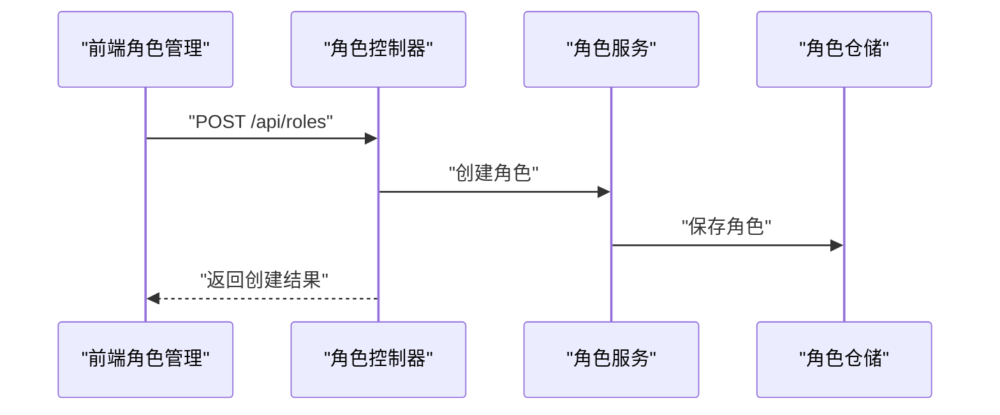
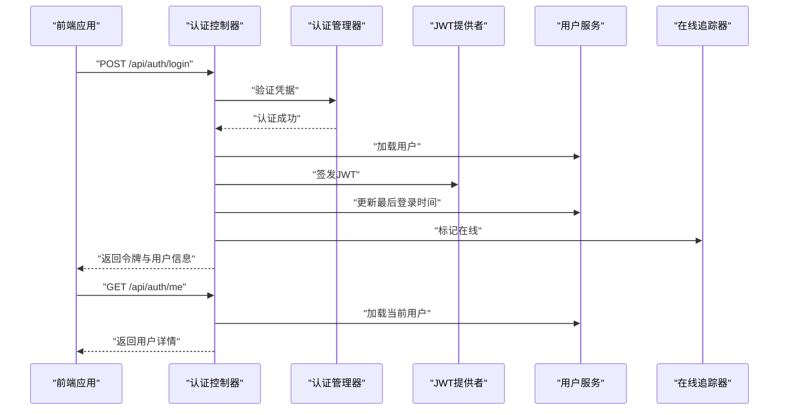
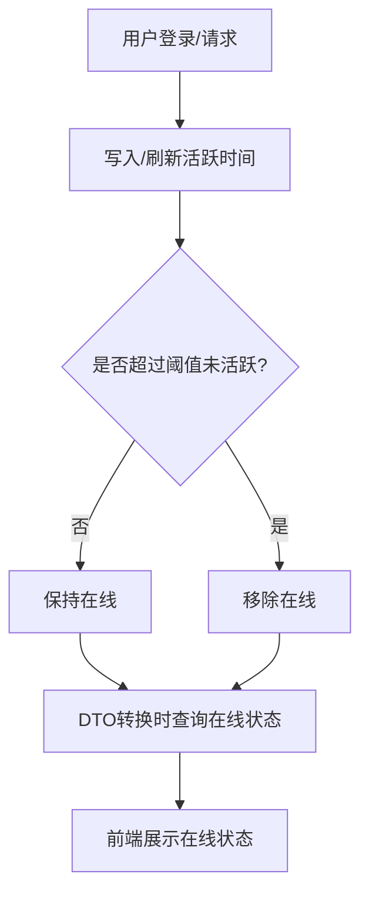
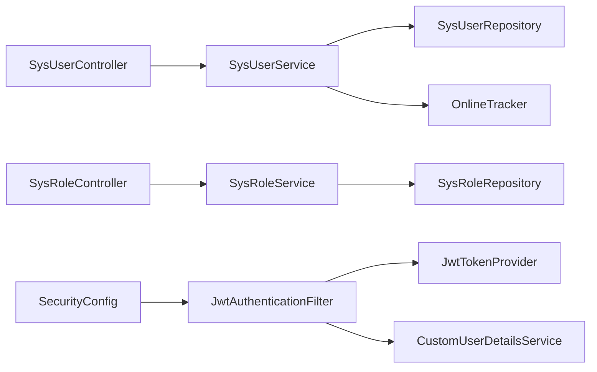

# 系统管理模块

<cite>
**本文档引用的文件**
- [SysUser.java](file://src/main/java/com/superpower/modules/system/entity/SysUser.java)
- [SysRole.java](file://src/main/java/com/superpower/modules/system/entity/SysRole.java)
- [SysUserController.java](file://src/main/java/com/superpower/modules/system/controller/SysUserController.java)
- [SysRoleController.java](file://src/main/java/com/superpower/modules/system/controller/SysRoleController.java)
- [SysUserService.java](file://src/main/java/com/superpower/modules/system/service/SysUserService.java)
- [SysRoleService.java](file://src/main/java/com/superpower/modules/system/service/SysRoleService.java)
- [UserDTO.java](file://src/main/java/com/superpower/modules/system/dto/UserDTO.java)
- [AuthController.java](file://src/main/java/com/superpower/modules/system/controller/AuthController.java)
- [JwtTokenProvider.java](file://src/main/java/com/superpower/security/JwtTokenProvider.java)
- [JwtAuthenticationFilter.java](file://src/main/java/com/superpower/security/JwtAuthenticationFilter.java)
- [SecurityConfig.java](file://src/main/java/com/superpower/config/SecurityConfig.java)
- [OnlineTracker.java](file://src/main/java/com/superpower/security/OnlineTracker.java)
- [SysUserRepository.java](file://src/main/java/com/superpower/modules/system/repository/SysUserRepository.java)
- [SysRoleRepository.java](file://src/main/java/com/superpower/modules/system/repository/SysRoleRepository.java)
- [OperationLog.java](file://src/main/java/com/superpower/modules/system/entity/OperationLog.java)
- [UserManage.vue](file://frontend/src/views/system/UserManage.vue)
- [RoleManage.vue](file://frontend/src/views/system/RoleManage.vue)
- [user.js](file://frontend/src/api/user.js)
</cite>

## 目录
1. [简介](#简介)
2. [项目结构](#项目结构)
3. [核心组件](#核心组件)
4. [架构总览](#架构总览)
5. [详细组件分析](#详细组件分析)
6. [依赖分析](#依赖分析)
7. [性能考虑](#性能考虑)
8. [故障排除指南](#故障排除指南)
9. [结论](#结论)
10. [附录](#附录)

## 简介
本文件为系统管理模块的功能文档，聚焦用户管理与角色权限管理两大核心能力，覆盖用户信息维护、角色权限分配、系统配置管理、登录认证、权限验证、在线用户跟踪、操作审计与系统监控等主题。文档从实体设计、权限模型、安全控制到前后端集成与最佳实践进行系统化阐述，帮助开发者与运维人员快速理解并高效使用该模块。

## 项目结构
系统管理模块位于后端 Spring Boot 工程的 system 包中，采用分层架构：controller（控制器）、service（服务）、repository（仓储）、entity（实体）与 DTO（数据传输对象）。前端 Vue 单页应用通过 API 接口调用后端服务，实现用户与角色的增删改查、登录注册、密码修改与昵称更新等功能。

图表来源
- [SysUserController.java:1-67](file://src/main/java/com/superpower/modules/system/controller/SysUserController.java#L1-L67)
- [SysRoleController.java:1-30](file://src/main/java/com/superpower/modules/system/controller/SysRoleController.java#L1-L30)
- [SysUserService.java:1-114](file://src/main/java/com/superpower/modules/system/service/SysUserService.java#L1-L114)
- [SysRoleService.java:1-35](file://src/main/java/com/superpower/modules/system/service/SysRoleService.java#L1-L35)
- [SysUserRepository.java:1-13](file://src/main/java/com/superpower/modules/system/repository/SysUserRepository.java#L1-L13)
- [SysRoleRepository.java:1-12](file://src/main/java/com/superpower/modules/system/repository/SysRoleRepository.java#L1-L12)
- [SysUser.java:1-40](file://src/main/java/com/superpower/modules/system/entity/SysUser.java#L1-L40)
- [SysRole.java:1-27](file://src/main/java/com/superpower/modules/system/entity/SysRole.java#L1-L27)
- [UserDTO.java:1-18](file://src/main/java/com/superpower/modules/system/dto/UserDTO.java#L1-L18)
- [JwtAuthenticationFilter.java:1-62](file://src/main/java/com/superpower/security/JwtAuthenticationFilter.java#L1-L62)
- [JwtTokenProvider.java:1-66](file://src/main/java/com/superpower/security/JwtTokenProvider.java#L1-L66)
- [SecurityConfig.java:1-57](file://src/main/java/com/superpower/config/SecurityConfig.java#L1-L57)
- [OnlineTracker.java:1-43](file://src/main/java/com/superpower/security/OnlineTracker.java#L1-L43)
- [UserManage.vue:1-181](file://frontend/src/views/system/UserManage.vue#L1-L181)
- [RoleManage.vue:1-70](file://frontend/src/views/system/RoleManage.vue#L1-L70)
- [user.js:1-18](file://frontend/src/api/user.js#L1-L18)

章节来源
- [SysUserController.java:1-67](file://src/main/java/com/superpower/modules/system/controller/SysUserController.java#L1-L67)
- [SysRoleController.java:1-30](file://src/main/java/com/superpower/modules/system/controller/SysRoleController.java#L1-L30)
- [SysUserService.java:1-114](file://src/main/java/com/superpower/modules/system/service/SysUserService.java#L1-L114)
- [SysRoleService.java:1-35](file://src/main/java/com/superpower/modules/system/service/SysRoleService.java#L1-L35)
- [SysUserRepository.java:1-13](file://src/main/java/com/superpower/modules/system/repository/SysUserRepository.java#L1-L13)
- [SysRoleRepository.java:1-12](file://src/main/java/com/superpower/modules/system/repository/SysRoleRepository.java#L1-L12)
- [SysUser.java:1-40](file://src/main/java/com/superpower/modules/system/entity/SysUser.java#L1-L40)
- [SysRole.java:1-27](file://src/main/java/com/superpower/modules/system/entity/SysRole.java#L1-L27)
- [UserDTO.java:1-18](file://src/main/java/com/superpower/modules/system/dto/UserDTO.java#L1-L18)
- [JwtAuthenticationFilter.java:1-62](file://src/main/java/com/superpower/security/JwtAuthenticationFilter.java#L1-L62)
- [JwtTokenProvider.java:1-66](file://src/main/java/com/superpower/security/JwtTokenProvider.java#L1-L66)
- [SecurityConfig.java:1-57](file://src/main/java/com/superpower/config/SecurityConfig.java#L1-L57)
- [OnlineTracker.java:1-43](file://src/main/java/com/superpower/security/OnlineTracker.java#L1-L43)
- [UserManage.vue:1-181](file://frontend/src/views/system/UserManage.vue#L1-L181)
- [RoleManage.vue:1-70](file://frontend/src/views/system/RoleManage.vue#L1-L70)
- [user.js:1-18](file://frontend/src/api/user.js#L1-L18)

## 核心组件
- 实体层
  - 用户实体：包含主键、用户名、密码、昵称、角色关联、状态、创建/更新时间、最后登录时间等字段，支持按用户名唯一约束与角色外键关联。
  - 角色实体：包含主键、角色名、角色编码（唯一）、描述、创建时间等字段，用于权限分组与鉴权。
- 服务层
  - 用户服务：负责用户创建、更新、删除、密码修改、昵称更新、DTO 转换及在线状态查询；集成在线追踪器判断用户是否在线。
  - 角色服务：负责角色列表查询、按编码查询与创建角色。
- 控制器层
  - 用户控制器：提供用户列表、创建、更新、删除接口，并记录操作日志；使用注解进行权限控制。
  - 角色控制器：提供角色列表与创建接口。
  - 认证控制器：提供登录、登出（在线追踪器处理）、获取当前用户、注册、修改密码与昵称等接口。
- 安全与在线追踪
  - JWT 过滤器：从请求头或查询参数提取令牌，校验并解析，注入认证上下文，同时刷新在线状态。
  - JWT 提供者：生成与校验 JWT，解析用户标识与角色信息。
  - 在线追踪器：基于内存映射维护用户最近活跃时间，提供在线判定与在线用户集合清理。
- 前端管理界面
  - 用户管理视图：展示用户列表、在线状态、最后登录时间，支持新增、编辑、删除与查看操作日志。
  - 角色管理视图：展示角色列表与创建角色。
  - API 封装：统一用户相关接口调用。

章节来源
- [SysUser.java:1-40](file://src/main/java/com/superpower/modules/system/entity/SysUser.java#L1-L40)
- [SysRole.java:1-27](file://src/main/java/com/superpower/modules/system/entity/SysRole.java#L1-L27)
- [SysUserService.java:1-114](file://src/main/java/com/superpower/modules/system/service/SysUserService.java#L1-L114)
- [SysRoleService.java:1-35](file://src/main/java/com/superpower/modules/system/service/SysRoleService.java#L1-L35)
- [SysUserController.java:1-67](file://src/main/java/com/superpower/modules/system/controller/SysUserController.java#L1-L67)
- [SysRoleController.java:1-30](file://src/main/java/com/superpower/modules/system/controller/SysRoleController.java#L1-L30)
- [AuthController.java:1-98](file://src/main/java/com/superpower/modules/system/controller/AuthController.java#L1-L98)
- [JwtAuthenticationFilter.java:1-62](file://src/main/java/com/superpower/security/JwtAuthenticationFilter.java#L1-L62)
- [JwtTokenProvider.java:1-66](file://src/main/java/com/superpower/security/JwtTokenProvider.java#L1-L66)
- [OnlineTracker.java:1-43](file://src/main/java/com/superpower/security/OnlineTracker.java#L1-L43)
- [UserManage.vue:1-181](file://frontend/src/views/system/UserManage.vue#L1-L181)
- [RoleManage.vue:1-70](file://frontend/src/views/system/RoleManage.vue#L1-L70)
- [user.js:1-18](file://frontend/src/api/user.js#L1-L18)

## 架构总览
系统采用前后端分离架构，后端以 Spring Security + JWT 实现无状态认证与授权，结合在线追踪器实现在线用户状态管理。前端通过 Element Plus 组件与 Axios 封装的 API 完成用户与角色的可视化管理。

图表来源
- [AuthController.java:44-60](file://src/main/java/com/superpower/modules/system/controller/AuthController.java#L44-L60)
- [JwtAuthenticationFilter.java:32-48](file://src/main/java/com/superpower/security/JwtAuthenticationFilter.java#L32-L48)
- [JwtTokenProvider.java:25-35](file://src/main/java/com/superpower/security/JwtTokenProvider.java#L25-L35)
- [SysUserService.java:33-36](file://src/main/java/com/superpower/modules/system/service/SysUserService.java#L33-L36)
- [OnlineTracker.java:17-19](file://src/main/java/com/superpower/security/OnlineTracker.java#L17-L19)

## 详细组件分析

### 实体模型与数据结构
- 用户实体（SysUser）
  - 关键字段：主键、用户名（唯一）、密码（加密存储）、昵称、角色外键、状态、创建/更新时间、最后登录时间。
  - 设计要点：单表存储，角色采用多对一关联，便于权限判定与显示。
- 角色实体（SysRole）
  - 关键字段：主键、角色名、角色编码（唯一）、描述、创建时间。
  - 设计要点：编码作为角色标识，便于在 JWT 中传递与后端匹配。

图表来源
- [SysUser.java:10-39](file://src/main/java/com/superpower/modules/system/entity/SysUser.java#L10-L39)
- [SysRole.java:10-26](file://src/main/java/com/superpower/modules/system/entity/SysRole.java#L10-L26)

章节来源
- [SysUser.java:1-40](file://src/main/java/com/superpower/modules/system/entity/SysUser.java#L1-L40)
- [SysRole.java:1-27](file://src/main/java/com/superpower/modules/system/entity/SysRole.java#L1-L27)

### 权限模型与安全控制
- 角色与权限
  - 角色编码作为权限标识，后端通过安全配置对特定路径设置角色要求（如 ADMIN）。
- 认证与授权
  - 登录成功后生成 JWT，其中包含用户 ID 与角色编码；JWT 过滤器解析令牌并注入认证上下文。
  - 安全配置定义放行路径与受保护路径，GET 请求默认需认证，部分公开接口可匿名访问。
- 在线用户跟踪
  - 登录时标记在线；请求过滤器根据令牌刷新用户活跃时间；超过阈值未活跃则移出在线集合。

图表来源
- [JwtAuthenticationFilter.java:32-48](file://src/main/java/com/superpower/security/JwtAuthenticationFilter.java#L32-L48)
- [JwtTokenProvider.java:37-55](file://src/main/java/com/superpower/security/JwtTokenProvider.java#L37-L55)
- [OnlineTracker.java:25-29](file://src/main/java/com/superpower/security/OnlineTracker.java#L25-L29)

章节来源
- [SecurityConfig.java:27-45](file://src/main/java/com/superpower/config/SecurityConfig.java#L27-L45)
- [JwtAuthenticationFilter.java:1-62](file://src/main/java/com/superpower/security/JwtAuthenticationFilter.java#L1-L62)
- [JwtTokenProvider.java:1-66](file://src/main/java/com/superpower/security/JwtTokenProvider.java#L1-L66)
- [OnlineTracker.java:1-43](file://src/main/java/com/superpower/security/OnlineTracker.java#L1-L43)

### 用户管理功能
- 功能清单
  - 用户列表：支持分页与排序（由前端表格与后端分页配合实现）。
  - 新增用户：校验用户名唯一性，选择角色并初始化状态。
  - 编辑用户：更新昵称、角色与状态。
  - 删除用户：级联删除（由仓储层处理）。
  - 操作日志：记录创建、更新、删除等操作，便于审计。
- 前端交互
  - 用户管理视图提供表格展示、对话框新增/编辑、删除确认与操作日志弹窗。
  - API 封装统一调用后端接口。

图表来源
- [SysUserController.java:32-57](file://src/main/java/com/superpower/modules/system/controller/SysUserController.java#L32-L57)
- [SysUserService.java:50-83](file://src/main/java/com/superpower/modules/system/service/SysUserService.java#L50-L83)
- [SysUserRepository.java:1-13](file://src/main/java/com/superpower/modules/system/repository/SysUserRepository.java#L1-L13)
- [OperationLog.java:1-42](file://src/main/java/com/superpower/modules/system/entity/OperationLog.java#L1-L42)

章节来源
- [SysUserController.java:1-67](file://src/main/java/com/superpower/modules/system/controller/SysUserController.java#L1-L67)
- [SysUserService.java:1-114](file://src/main/java/com/superpower/modules/system/service/SysUserService.java#L1-L114)
- [SysUserRepository.java:1-13](file://src/main/java/com/superpower/modules/system/repository/SysUserRepository.java#L1-L13)
- [UserManage.vue:1-181](file://frontend/src/views/system/UserManage.vue#L1-L181)
- [user.js:1-18](file://frontend/src/api/user.js#L1-L18)

### 角色权限管理
- 功能清单
  - 角色列表：展示角色编码与描述。
  - 创建角色：输入角色名、编码与描述，保存至数据库。
- 前端交互
  - 角色管理视图提供表格展示与新增对话框。

图表来源
- [SysRoleController.java:25-28](file://src/main/java/com/superpower/modules/system/controller/SysRoleController.java#L25-L28)
- [SysRoleService.java:27-33](file://src/main/java/com/superpower/modules/system/service/SysRoleService.java#L27-L33)
- [SysRoleRepository.java:1-12](file://src/main/java/com/superpower/modules/system/repository/SysRoleRepository.java#L1-L12)

章节来源
- [SysRoleController.java:1-30](file://src/main/java/com/superpower/modules/system/controller/SysRoleController.java#L1-L30)
- [SysRoleService.java:1-35](file://src/main/java/com/superpower/modules/system/service/SysRoleService.java#L1-L35)
- [SysRoleRepository.java:1-12](file://src/main/java/com/superpower/modules/system/repository/SysRoleRepository.java#L1-L12)
- [RoleManage.vue:1-70](file://frontend/src/views/system/RoleManage.vue#L1-L70)

### 登录认证与会话管理
- 登录流程
  - 前端提交用户名与密码，后端使用认证管理器验证。
  - 验证通过后生成 JWT，包含用户 ID 与角色编码；同时更新用户最后登录时间并标记在线。
- 令牌解析与在线刷新
  - 过滤器从请求头或查询参数提取令牌，校验通过后注入认证上下文，并刷新在线状态。
- 注销与登出
  - 后端不维护会话；前端清除本地令牌即可视为登出；在线追踪器会在阈值后自动移除离线用户。

图表来源
- [AuthController.java:44-66](file://src/main/java/com/superpower/modules/system/controller/AuthController.java#L44-L66)
- [JwtAuthenticationFilter.java:32-48](file://src/main/java/com/superpower/security/JwtAuthenticationFilter.java#L32-L48)
- [JwtTokenProvider.java:25-35](file://src/main/java/com/superpower/security/JwtTokenProvider.java#L25-L35)
- [OnlineTracker.java:17-19](file://src/main/java/com/superpower/security/OnlineTracker.java#L17-L19)

章节来源
- [AuthController.java:1-98](file://src/main/java/com/superpower/modules/system/controller/AuthController.java#L1-L98)
- [JwtAuthenticationFilter.java:1-62](file://src/main/java/com/superpower/security/JwtAuthenticationFilter.java#L1-L62)
- [JwtTokenProvider.java:1-66](file://src/main/java/com/superpower/security/JwtTokenProvider.java#L1-L66)
- [OnlineTracker.java:1-43](file://src/main/java/com/superpower/security/OnlineTracker.java#L1-L43)

### 在线用户跟踪
- 实现机制
  - 登录时写入活跃时间；每次请求通过过滤器刷新；超过阈值（分钟级）未活跃则移除。
  - 用户服务在 DTO 转换时查询在线状态，用于前端展示。
- 使用场景
  - 用户管理界面显示在线/离线状态，辅助管理员判断用户活跃度。

图表来源
- [OnlineTracker.java:17-41](file://src/main/java/com/superpower/security/OnlineTracker.java#L17-L41)
- [SysUserService.java:110-111](file://src/main/java/com/superpower/modules/system/service/SysUserService.java#L110-L111)
- [UserManage.vue:18-23](file://frontend/src/views/system/UserManage.vue#L18-L23)

章节来源
- [OnlineTracker.java:1-43](file://src/main/java/com/superpower/security/OnlineTracker.java#L1-L43)
- [SysUserService.java:1-114](file://src/main/java/com/superpower/modules/system/service/SysUserService.java#L1-L114)
- [UserManage.vue:1-181](file://frontend/src/views/system/UserManage.vue#L1-L181)

### 操作审计与系统监控
- 操作日志
  - 用户管理 CRUD 操作均记录日志，包含用户 ID/名称、模块、动作、目标类型与 ID、IP、时间等。
- 监控建议
  - 结合在线追踪器统计在线用户数与活跃度。
  - 对高频操作与异常登录进行告警（可扩展）。

章节来源
- [SysUserController.java:36-55](file://src/main/java/com/superpower/modules/system/controller/SysUserController.java#L36-L55)
- [OperationLog.java:1-42](file://src/main/java/com/superpower/modules/system/entity/OperationLog.java#L1-L42)

## 依赖分析
- 组件耦合
  - 控制器依赖服务；服务依赖仓储与工具类（密码编码器、在线追踪器）。
  - JWT 过滤器依赖 JWT 提供者与用户详情服务，注入认证上下文。
- 外部依赖
  - Spring Security、Spring Data JPA、BCrypt 密码编码器、JWT 库。
- 安全边界
  - 放行公开接口，其余路径需认证；特定管理接口限定 ADMIN 角色。

图表来源
- [SysUserController.java:1-67](file://src/main/java/com/superpower/modules/system/controller/SysUserController.java#L1-L67)
- [SysRoleController.java:1-30](file://src/main/java/com/superpower/modules/system/controller/SysRoleController.java#L1-L30)
- [SysUserService.java:1-114](file://src/main/java/com/superpower/modules/system/service/SysUserService.java#L1-L114)
- [SysRoleService.java:1-35](file://src/main/java/com/superpower/modules/system/service/SysRoleService.java#L1-L35)
- [JwtAuthenticationFilter.java:1-62](file://src/main/java/com/superpower/security/JwtAuthenticationFilter.java#L1-L62)
- [JwtTokenProvider.java:1-66](file://src/main/java/com/superpower/security/JwtTokenProvider.java#L1-L66)
- [SecurityConfig.java:1-57](file://src/main/java/com/superpower/config/SecurityConfig.java#L1-L57)
- [OnlineTracker.java:1-43](file://src/main/java/com/superpower/security/OnlineTracker.java#L1-L43)

章节来源
- [SysUserController.java:1-67](file://src/main/java/com/superpower/modules/system/controller/SysUserController.java#L1-L67)
- [SysRoleController.java:1-30](file://src/main/java/com/superpower/modules/system/controller/SysRoleController.java#L1-L30)
- [SysUserService.java:1-114](file://src/main/java/com/superpower/modules/system/service/SysUserService.java#L1-L114)
- [SysRoleService.java:1-35](file://src/main/java/com/superpower/modules/system/service/SysRoleService.java#L1-L35)
- [JwtAuthenticationFilter.java:1-62](file://src/main/java/com/superpower/security/JwtAuthenticationFilter.java#L1-L62)
- [JwtTokenProvider.java:1-66](file://src/main/java/com/superpower/security/JwtTokenProvider.java#L1-L66)
- [SecurityConfig.java:1-57](file://src/main/java/com/superpower/config/SecurityConfig.java#L1-L57)
- [OnlineTracker.java:1-43](file://src/main/java/com/superpower/security/OnlineTracker.java#L1-L43)

## 性能考虑
- 在线追踪器使用并发映射，支持高并发下的在线状态查询与清理。
- JWT 解析与校验为轻量操作，建议合理设置过期时间以平衡安全性与性能。
- 用户列表查询建议结合分页与索引优化（用户名、角色外键）。

## 故障排除指南
- 登录失败
  - 检查用户名/密码是否正确；确认用户状态正常；查看认证管理器错误信息。
- 令牌无效
  - 校验密钥配置与过期时间；确保请求头格式为“Bearer {token}”或查询参数“access_token”。
- 无法访问受保护接口
  - 确认令牌有效且未过期；检查安全配置中的放行规则与角色要求。
- 在线状态异常
  - 检查在线阈值设置；确认请求过滤器是否正确刷新活跃时间。

章节来源
- [AuthController.java:44-60](file://src/main/java/com/superpower/modules/system/controller/AuthController.java#L44-L60)
- [JwtAuthenticationFilter.java:32-48](file://src/main/java/com/superpower/security/JwtAuthenticationFilter.java#L32-L48)
- [JwtTokenProvider.java:57-64](file://src/main/java/com/superpower/security/JwtTokenProvider.java#L57-L64)
- [SecurityConfig.java:27-45](file://src/main/java/com/superpower/config/SecurityConfig.java#L27-L45)
- [OnlineTracker.java:14-41](file://src/main/java/com/superpower/security/OnlineTracker.java#L14-L41)

## 结论
系统管理模块通过清晰的分层设计与完善的权限控制，实现了用户与角色的全生命周期管理，并结合 JWT 与在线追踪器提供了可靠的认证与状态感知能力。前端管理界面直观易用，配合操作审计与监控策略，能够满足企业级系统的管理需求。

## 附录
- API 接口清单（后端）
  - 用户管理
    - GET /api/users：获取所有用户
    - POST /api/users：创建用户
    - PUT /api/users/{id}：更新用户
    - DELETE /api/users/{id}：删除用户
  - 角色管理
    - GET /api/roles：获取所有角色
    - POST /api/roles：创建角色
  - 认证
    - POST /api/auth/login：用户登录
    - GET /api/auth/me：获取当前用户
    - POST /api/auth/register：注册用户
    - PUT /api/auth/password：修改密码
    - PUT /api/auth/nickname：修改昵称
- 前端使用指南
  - 用户管理页面：支持新增、编辑、删除与查看操作日志；在线状态实时更新。
  - 角色管理页面：支持新增角色套餐。
  - API 封装：统一调用后端接口，前端无需关心具体路径与参数细节。

章节来源
- [SysUserController.java:26-57](file://src/main/java/com/superpower/modules/system/controller/SysUserController.java#L26-L57)
- [SysRoleController.java:20-28](file://src/main/java/com/superpower/modules/system/controller/SysRoleController.java#L20-L28)
- [AuthController.java:44-96](file://src/main/java/com/superpower/modules/system/controller/AuthController.java#L44-L96)
- [UserManage.vue:1-181](file://frontend/src/views/system/UserManage.vue#L1-L181)
- [RoleManage.vue:1-70](file://frontend/src/views/system/RoleManage.vue#L1-L70)
- [user.js:1-18](file://frontend/src/api/user.js#L1-L18)