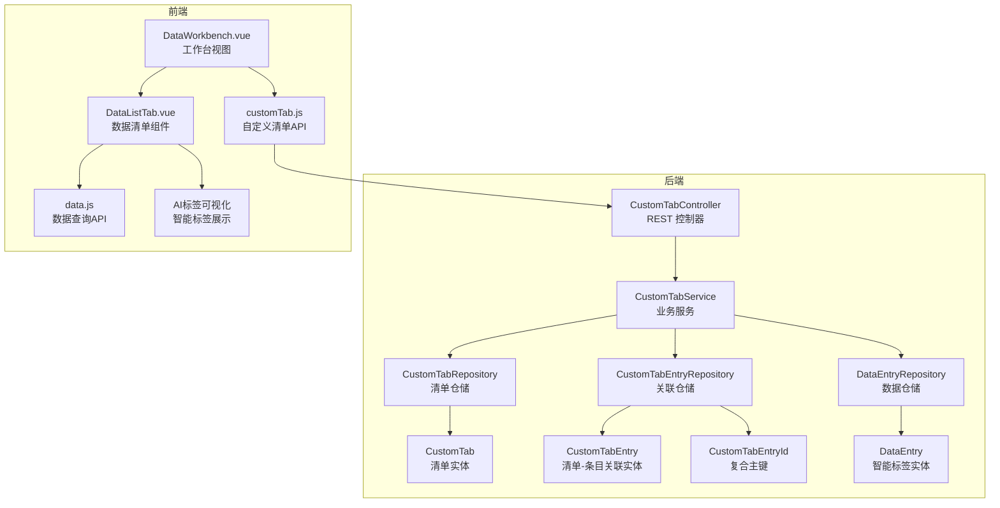
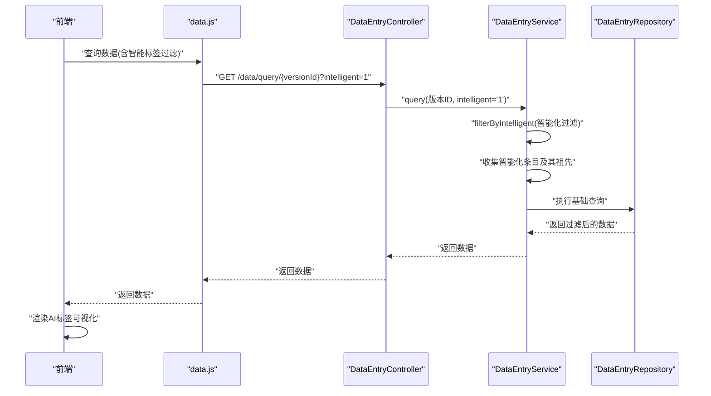
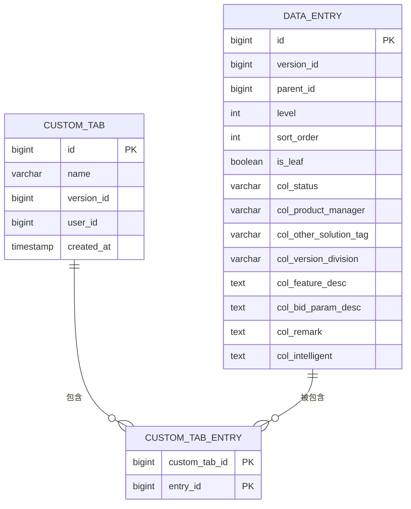
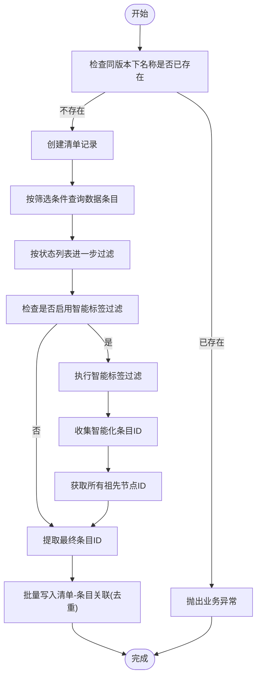
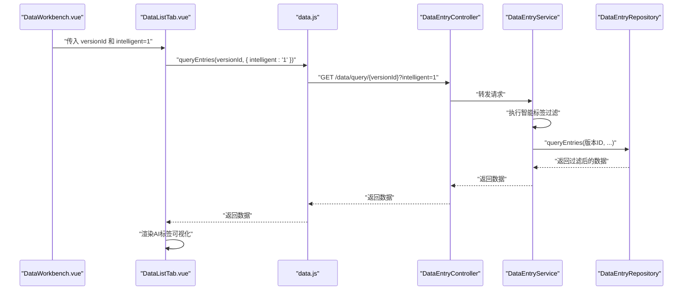
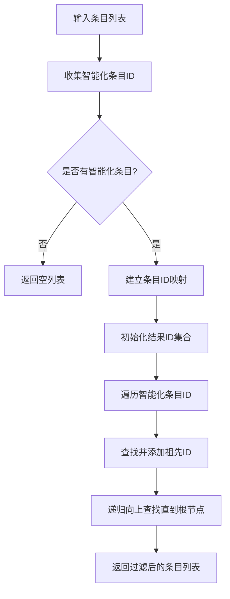
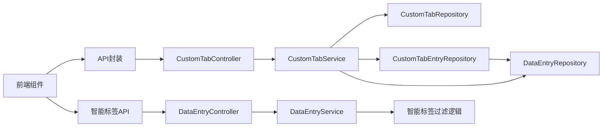

# 自定义标签系统

<cite>
**本文档引用的文件**
- [CustomTab.java](file://src/main/java/com/superpower/modules/customtab/entity/CustomTab.java)
- [CustomTabEntry.java](file://src/main/java/com/superpower/modules/customtab/entity/CustomTabEntry.java)
- [CustomTabEntryId.java](file://src/main/java/com/superpower/modules/customtab/entity/CustomTabEntryId.java)
- [CustomTabController.java](file://src/main/java/com/superpower/modules/customtab/controller/CustomTabController.java)
- [CustomTabService.java](file://src/main/java/com/superpower/modules/customtab/service/CustomTabService.java)
- [CustomTabRepository.java](file://src/main/java/com/superpower/modules/customtab/repository/CustomTabRepository.java)
- [CustomTabEntryRepository.java](file://src/main/java/com/superpower/modules/customtab/repository/CustomTabEntryRepository.java)
- [DataEntryRepository.java](file://src/main/java/com/superpower/modules/data/repository/DataEntryRepository.java)
- [DataEntry.java](file://src/main/java/com/superpower/modules/data/entity/DataEntry.java)
- [DataEntryController.java](file://src/main/java/com/superpower/modules/data/controller/DataEntryController.java)
- [DataEntryService.java](file://src/main/java/com/superpower/modules/data/service/DataEntryService.java)
- [DataEntryDTO.java](file://src/main/java/com/superpower/modules/data/dto/DataEntryDTO.java)
- [DataEntrySummaryDTO.java](file://src/main/java/com/superpower/modules/data/dto/DataEntrySummaryDTO.java)
- [V1.0.12_add_col_intelligent.sql](file://db_changes/V1.0.12_add_col_intelligent.sql)
- [DataListTab.vue](file://frontend/src/components/DataListTab.vue)
- [DataWorkbench.vue](file://frontend/src/views/dashboard/DataWorkbench.vue)
- [customTab.js](file://frontend/src/api/customTab.js)
- [data.js](file://frontend/src/api/data.js)
- [2026-05-26-custom-list-tab-design.md](file://docs/superpowers/specs/2026-05-26-custom-list-tab-design.md)
- [2026-06-22-intelligent-tag-design.md](file://docs/superpowers/specs/2026-06-22-intelligent-tag-design.md)
- [2026-06-22-intelligent-tag-implementation.md](file://docs/superpowers/plans/2026-06-22-intelligent-tag-implementation.md)
- [CustomTabServiceTest.java](file://src/test/java/com/superpower/modules/customtab/service/CustomTabServiceTest.java)
</cite>

## 更新摘要
**所做更改**
- 新增智能标签系统功能章节，详细介绍AI智能标签的实现
- 更新数据筛选与排序规则，增加智能标签过滤功能
- 新增智能标签在前端的可视化展示和编辑表单集成
- 更新API接口说明，增加智能标签相关参数
- 新增智能标签与版本分系统的一致性处理说明

## 目录
1. [简介](#简介)
2. [项目结构](#项目结构)
3. [核心组件](#核心组件)
4. [架构总览](#架构总览)
5. [详细组件分析](#详细组件分析)
6. [智能标签系统](#智能标签系统)
7. [依赖分析](#依赖分析)
8. [性能考虑](#性能考虑)
9. [故障排查指南](#故障排查指南)
10. [结论](#结论)
11. [附录](#附录)

## 简介
本系统为"自定义标签系统"，提供可扩展的清单视图能力，允许用户在特定版本内创建自定义清单（标签），并将数据条目加入这些清单进行独立筛选、编辑与导出。系统采用前后端分离架构：后端以Spring Boot + JPA实现，数据库通过JPA映射实体；前端基于Vue 3 + Element Plus构建交互界面。核心特性包括：
- 自定义清单的创建、重命名、删除与版本隔离
- 基于模板的快速创建（结合数据筛选条件）
- 清单与数据条目的多对多关联（通过中间表）
- 前端清单Tab的动态渲染与交互
- 完整的权限控制与错误处理
- **智能标签系统**：支持AI智能标签的创建、过滤和可视化展示

## 项目结构
后端模块位于 src/main/java/com/superpower/modules/customtab，包含实体、仓储、服务与控制器；数据查询通过 DataEntryRepository 提供的查询方法与自定义清单ID进行关联过滤；前端模块位于 frontend/src，包含API封装、视图组件与仪表盘页面。

**图表来源**
- [CustomTabController.java:1-104](file://src/main/java/com/superpower/modules/customtab/controller/CustomTabController.java#L1-L104)
- [CustomTabService.java:1-111](file://src/main/java/com/superpower/modules/customtab/service/CustomTabService.java#L1-L111)
- [CustomTabRepository.java:1-22](file://src/main/java/com/superpower/modules/customtab/repository/CustomTabRepository.java#L1-L22)
- [CustomTabEntryRepository.java:1-27](file://src/main/java/com/superpower/modules/customtab/repository/CustomTabEntryRepository.java#L1-L27)
- [DataEntryRepository.java:1-152](file://src/main/java/com/superpower/modules/data/repository/DataEntryRepository.java#L1-L152)
- [CustomTab.java:1-28](file://src/main/java/com/superpower/modules/customtab/entity/CustomTab.java#L1-L28)
- [CustomTabEntry.java:1-21](file://src/main/java/com/superpower/modules/customtab/entity/CustomTabEntry.java#L1-L21)
- [CustomTabEntryId.java:1-16](file://src/main/java/com/superpower/modules/customtab/entity/CustomTabEntryId.java#L1-L16)
- [DataEntry.java:1-200](file://src/main/java/com/superpower/modules/data/entity/DataEntry.java#L1-L200)
- [DataListTab.vue:171-194](file://frontend/src/components/DataListTab.vue#L171-L194)
- [customTab.js:1-30](file://frontend/src/api/customTab.js#L1-L30)
- [data.js:1-128](file://frontend/src/api/data.js#L1-L128)
- [DataWorkbench.vue:1-200](file://frontend/src/views/dashboard/DataWorkbench.vue#L1-L200)

**章节来源**
- [2026-05-26-custom-list-tab-design.md:1-125](file://docs/superpowers/specs/2026-05-26-custom-list-tab-design.md#L1-L125)

## 核心组件
- 实体层
  - CustomTab：自定义清单，包含名称、版本ID、创建人ID与创建时间
  - CustomTabEntry：清单与数据条目的关联表，复合主键由清单ID与条目ID组成
  - CustomTabEntryId：关联表的复合主键类
  - **DataEntry：数据条目实体，新增colIntelligent字段支持智能标签**
- 仓储层
  - CustomTabRepository：按版本查询清单、去重检查、按版本批量清理
  - CustomTabEntryRepository：按清单查询、按清单批量清理、按清单+条目删除
  - DataEntryRepository：提供按版本与多种维度（名称、产品经理、解决方案、版本划分等）的查询，并支持通过自定义清单ID进行JOIN过滤
- 服务层
  - CustomTabService：创建/删除/重命名清单、批量添加/移除条目、名称重复检测、按筛选条件创建清单
  - **DataEntryService：新增智能标签过滤逻辑，支持智能化条目的父子关系查询**
- 控制器层
  - CustomTabController：REST API入口，鉴权与权限校验，暴露清单与条目管理接口
  - **DataEntryController：新增智能标签查询参数，支持intelligent过滤**
- 前端
  - customTab.js：封装自定义清单的API调用
  - data.js：封装数据查询API，支持传入自定义清单ID和智能标签参数
  - DataListTab.vue：数据清单表格组件，支持查询、批量操作、插入清单等，**新增智能标签可视化展示**
  - DataWorkbench.vue：工作台容器，动态渲染Tab，支持添加/删除/重命名自定义清单，以及插入条目到清单

**章节来源**
- [CustomTab.java:1-28](file://src/main/java/com/superpower/modules/customtab/entity/CustomTab.java#L1-L28)
- [CustomTabEntry.java:1-21](file://src/main/java/com/superpower/modules/customtab/entity/CustomTabEntry.java#L1-L21)
- [CustomTabEntryId.java:1-16](file://src/main/java/com/superpower/modules/customtab/entity/CustomTabEntryId.java#L1-L16)
- [CustomTabRepository.java:1-22](file://src/main/java/com/superpower/modules/customtab/repository/CustomTabRepository.java#L1-L22)
- [CustomTabEntryRepository.java:1-27](file://src/main/java/com/superpower/modules/customtab/repository/CustomTabEntryRepository.java#L1-L27)
- [DataEntryRepository.java:1-152](file://src/main/java/com/superpower/modules/data/repository/DataEntryRepository.java#L1-L152)
- [CustomTabService.java:1-111](file://src/main/java/com/superpower/modules/customtab/service/CustomTabService.java#L1-L111)
- [CustomTabController.java:1-104](file://src/main/java/com/superpower/modules/customtab/controller/CustomTabController.java#L1-L104)
- [DataEntryService.java:242-269](file://src/main/java/com/superpower/modules/data/service/DataEntryService.java#L242-L269)
- [DataEntryController.java:115-131](file://src/main/java/com/superpower/modules/data/controller/DataEntryController.java#L115-L131)
- [customTab.js:1-30](file://frontend/src/api/customTab.js#L1-L30)
- [data.js:1-128](file://frontend/src/api/data.js#L1-L128)
- [DataListTab.vue:171-194](file://frontend/src/components/DataListTab.vue#L171-L194)
- [DataWorkbench.vue:1-200](file://frontend/src/views/dashboard/DataWorkbench.vue#L1-L200)

## 架构总览
系统遵循分层架构：前端负责UI与交互，通过API封装调用后端；后端通过控制器接收请求，调用服务层执行业务逻辑，仓储层访问数据库。自定义清单与数据条目通过中间表建立多对多关系，查询时通过JOIN实现按清单过滤。**智能标签系统通过新增的colIntelligent字段实现AI智能标签的标记、过滤和可视化展示。**

**图表来源**
- [DataEntryController.java:115-131](file://src/main/java/com/superpower/modules/data/controller/DataEntryController.java#L115-L131)
- [DataEntryService.java:235-269](file://src/main/java/com/superpower/modules/data/service/DataEntryService.java#L235-L269)
- [DataEntryService.java:242-269](file://src/main/java/com/superpower/modules/data/service/DataEntryService.java#L242-L269)

**章节来源**
- [2026-05-26-custom-list-tab-design.md:85-100](file://docs/superpowers/specs/2026-05-26-custom-list-tab-design.md#L85-L100)

## 详细组件分析

### 实体与数据模型
- CustomTab：用于存储自定义清单的基本信息，支持按版本隔离与按名称去重
- CustomTabEntry：作为中间表，建立清单与数据条目的多对多关系，避免在数据表中冗余存储
- CustomTabEntryId：复合主键类，确保同一清单下条目不重复
- **DataEntry：数据条目实体，新增colIntelligent字段用于智能标签标记，支持"1"表示智能化，空字符串表示非智能化**

**图表来源**
- [CustomTab.java:1-28](file://src/main/java/com/superpower/modules/customtab/entity/CustomTab.java#L1-L28)
- [CustomTabEntry.java:1-21](file://src/main/java/com/superpower/modules/customtab/entity/CustomTabEntry.java#L1-L21)
- [DataEntry.java:1-200](file://src/main/java/com/superpower/modules/data/entity/DataEntry.java#L1-L200)

**章节来源**
- [2026-05-26-custom-list-tab-design.md:13-40](file://docs/superpowers/specs/2026-05-26-custom-list-tab-design.md#L13-L40)

### 服务与业务流程
- 创建自定义清单（含筛选）：服务层根据传入的筛选条件查询匹配的数据条目，再将条目ID批量写入关联表
- 名称重复检测：在同版本下禁止重复名称
- 权限控制：删除与重命名需满足创建人或管理员身份
- 批量操作：支持批量添加/移除条目，自动去重
- **智能标签过滤：新增filterByIntelligent方法，支持智能化条目的父子关系查询，保留自身智能化条目及其所有祖先节点**

**图表来源**
- [CustomTabService.java:31-53](file://src/main/java/com/superpower/modules/customtab/service/CustomTabService.java#L31-L53)
- [CustomTabService.java:59-85](file://src/main/java/com/superpower/modules/customtab/service/CustomTabService.java#L59-L85)
- [CustomTabService.java:92-109](file://src/main/java/com/superpower/modules/customtab/service/CustomTabService.java#L92-L109)
- [DataEntryService.java:242-269](file://src/main/java/com/superpower/modules/data/service/DataEntryService.java#L242-L269)

**章节来源**
- [CustomTabService.java:1-111](file://src/main/java/com/superpower/modules/customtab/service/CustomTabService.java#L1-L111)
- [CustomTabController.java:36-43](file://src/main/java/com/superpower/modules/customtab/controller/CustomTabController.java#L36-L43)
- [DataEntryService.java:235-269](file://src/main/java/com/superpower/modules/data/service/DataEntryService.java#L235-L269)

### 前端组件与交互
- DataWorkbench.vue：工作台容器，动态渲染Tab，支持添加/删除/重命名自定义清单，以及插入条目到清单
- DataListTab.vue：数据清单表格组件，支持查询、批量操作、插入清单等；当处于自定义清单Tab时，会向后端传递自定义清单ID以进行过滤；**新增智能标签可视化展示，通过AI徽章标识智能化条目**
- API封装：customTab.js与data.js分别封装自定义清单与数据查询的HTTP请求，**data.js新增intelligent参数支持智能标签过滤**

**图表来源**
- [DataWorkbench.vue:100-145](file://frontend/src/views/dashboard/DataWorkbench.vue#L100-L145)
- [DataListTab.vue:171-194](file://frontend/src/components/DataListTab.vue#L171-L194)
- [data.js:19-21](file://frontend/src/api/data.js#L19-L21)
- [DataEntryController.java:115-131](file://src/main/java/com/superpower/modules/data/controller/DataEntryController.java#L115-L131)
- [DataEntryService.java:235-269](file://src/main/java/com/superpower/modules/data/service/DataEntryService.java#L235-L269)

**章节来源**
- [DataWorkbench.vue:1-200](file://frontend/src/views/dashboard/DataWorkbench.vue#L1-L200)
- [DataListTab.vue:1-200](file://frontend/src/components/DataListTab.vue#L1-L200)
- [data.js:1-128](file://frontend/src/api/data.js#L1-L128)
- [2026-05-26-custom-list-tab-design.md:71-84](file://docs/superpowers/specs/2026-05-26-custom-list-tab-design.md#L71-L84)

### API接口说明
- 获取清单列表：GET /api/custom-tab/{versionId}
- 创建清单：POST /api/custom-tab
- 按筛选创建清单：POST /api/custom-tab/create-with-filter
- 删除清单：DELETE /api/custom-tab/{id}
- 重命名清单：PUT /api/custom-tab/{id}
- 批量添加条目：POST /api/custom-tab/{id}/entries
- 移除条目：DELETE /api/custom-tab/{id}/entries/{entryId}
- **查询数据（含智能标签过滤）：GET /data/query/{versionId}?intelligent=1**

请求与响应字段说明（节选）：
- 创建清单请求体：name（字符串）、versionId（数字）、userId（可选数字）
- 按筛选创建请求体：name（字符串）、versionId（数字）、userId（可选数字）、entryName（字符串）、statusList（字符串数组）、productManager（字符串）、solution（字符串）、versionTag（字符串）
- 批量添加条目请求体：entryIds（数字数组）
- **智能标签查询参数：intelligent（字符串，'1'表示只显示智能化条目及其祖先）**

**章节来源**
- [CustomTabController.java:45-102](file://src/main/java/com/superpower/modules/customtab/controller/CustomTabController.java#L45-L102)
- [DataEntryController.java:115-131](file://src/main/java/com/superpower/modules/data/controller/DataEntryController.java#L115-L131)
- [2026-05-26-custom-list-tab-design.md:61-70](file://docs/superpowers/specs/2026-05-26-custom-list-tab-design.md#L61-L70)

## 智能标签系统

### 功能概述
智能标签系统通过新增的col_intelligent字段实现AI智能标签功能，支持以下核心能力：
- **智能标签标记**：在编辑表单中通过复选框标记条目为智能化
- **智能标签过滤**：通过intelligent=1参数过滤显示智能化条目及其祖先节点
- **可视化展示**：在数据列表中通过AI徽章直观展示智能化条目
- **版本一致性**：智能标签与版本分系统保持一致的数据处理逻辑

### 数据模型增强
- **数据库变更**：通过V1.0.12_add_col_intelligent.sql脚本为data_entry表添加col_intelligent列
- **字段定义**：TEXT类型，默认空字符串，"1"表示勾选智能化，空字符串表示未勾选
- **字段集成**：DataEntry、DataEntryDTO、DataEntrySummaryDTO均包含colIntelligent字段

### 智能标签过滤逻辑
智能标签过滤采用递归祖先查找算法：
1. 收集所有colIntelligent="1"的条目ID
2. 遍历每个智能化条目，向上查找其所有祖先节点
3. 将智能化条目及其祖先节点ID集合合并
4. 返回包含这些ID的所有条目

**图表来源**
- [DataEntryService.java:242-269](file://src/main/java/com/superpower/modules/data/service/DataEntryService.java#L242-L269)

### 前端可视化实现
智能标签在前端通过DataListTab.vue组件实现：
- **AI徽章显示**：当条目colIntelligent="1"或其子树包含智能化条目时显示"AI"徽章
- **工具提示功能**：鼠标悬停显示智能化条目详情和子项列表
- **冒泡效果**：通过CSS样式实现醒目的AI标签展示

### 编辑表单集成
智能标签在编辑表单中的实现：
- **表单字段**：editForm和initialFormState中新增colIntelligent字段
- **复选框控件**：在版本划分区域下方添加"智能化"复选框
- **数据同步**：通过copyFields方法实现智能标签数据的双向绑定

**章节来源**
- [V1.0.12_add_col_intelligent.sql:1-3](file://db_changes/V1.0.12_add_col_intelligent.sql#L1-L3)
- [DataEntryService.java:235-269](file://src/main/java/com/superpower/modules/data/service/DataEntryService.java#L235-L269)
- [DataListTab.vue:171-194](file://frontend/src/components/DataListTab.vue#L171-L194)
- [DataEntryDTO.java:46](file://src/main/java/com/superpower/modules/data/dto/DataEntryDTO.java#L46)
- [DataEntrySummaryDTO.java:42](file://src/main/java/com/superpower/modules/data/dto/DataEntrySummaryDTO.java#L42)
- [2026-06-22-intelligent-tag-implementation.md:1-37](file://docs/superpowers/plans/2026-06-22-intelligent-tag-implementation.md#L1-L37)

## 依赖分析
- 控制器依赖服务层，服务层依赖仓储层与数据仓储
- 清单实体与关联实体之间通过JPA注解建立关系
- 前端通过API封装调用后端，DataListTab在查询时传入自定义清单ID，触发DataEntryRepository的JOIN过滤
- **智能标签系统依赖数据库col_intelligent字段，通过DataEntryService的filterByIntelligent方法实现智能过滤逻辑**

**图表来源**
- [CustomTabController.java:1-104](file://src/main/java/com/superpower/modules/customtab/controller/CustomTabController.java#L1-L104)
- [CustomTabService.java:1-111](file://src/main/java/com/superpower/modules/customtab/service/CustomTabService.java#L1-L111)
- [CustomTabRepository.java:1-22](file://src/main/java/com/superpower/modules/customtab/repository/CustomTabRepository.java#L1-L22)
- [CustomTabEntryRepository.java:1-27](file://src/main/java/com/superpower/modules/customtab/repository/CustomTabEntryRepository.java#L1-L27)
- [DataEntryRepository.java:1-152](file://src/main/java/com/superpower/modules/data/repository/DataEntryRepository.java#L1-L152)
- [DataEntryController.java:115-131](file://src/main/java/com/superpower/modules/data/controller/DataEntryController.java#L115-L131)
- [DataEntryService.java:242-269](file://src/main/java/com/superpower/modules/data/service/DataEntryService.java#L242-L269)

**章节来源**
- [2026-05-26-custom-list-tab-design.md:40-84](file://docs/superpowers/specs/2026-05-26-custom-list-tab-design.md#L40-L84)

## 性能考虑
- 查询优化
  - 使用JOIN过滤：DataEntryRepository在queryEntries中通过LEFT JOIN CustomTabEntry实现按清单过滤，避免在Java侧做二次过滤
  - 多字段模糊/精确匹配：通过LIKE与等值比较组合，减少不必要的全表扫描
  - **智能标签过滤优化**：filterByIntelligent方法使用哈希集合提高查找效率，递归祖先查找避免重复计算
- 写入优化
  - 批量添加条目时进行去重判断，避免重复写入
  - 删除清单时先清理关联表，再删除清单记录，保证外键一致性
- 前端虚拟滚动
  - DataListTab使用虚拟滚动组件提升大数据量渲染性能
  - **智能标签可视化优化**：通过条件渲染避免不必要的DOM操作
- 缓存策略建议
  - 清单列表按版本缓存，版本切换时失效
  - 清单内容按清单ID缓存，更新时失效
  - 过滤条件变化时更新对应缓存键
  - **智能标签过滤结果缓存**：对于相同intelligent参数的查询结果可考虑缓存
- 排序与分页
  - 当前查询按类别/业务域/层级/父节点/排序字段排序，建议后续引入分页参数以降低一次性传输数据量

**章节来源**
- [DataEntryRepository.java:56-78](file://src/main/java/com/superpower/modules/data/repository/DataEntryRepository.java#L56-L78)
- [DataListTab.vue:132-139](file://frontend/src/components/DataListTab.vue#L132-L139)
- [DataEntryService.java:242-269](file://src/main/java/com/superpower/modules/data/service/DataEntryService.java#L242-L269)

## 故障排查指南
- 创建清单时报"清单名称已存在"
  - 检查同版本下是否存在同名清单，或等待名称变更后重试
- 删除/重命名权限不足
  - 确认当前用户为清单创建人或管理员
- 批量添加条目无效
  - 检查条目ID是否已在当前清单中存在，系统会自动去重
- 查询不到自定义清单数据
  - 确认DataListTab传入了正确的customTabId，且该清单包含对应条目
- **智能标签相关问题**
  - **智能标签不显示**：检查col_intelligent字段是否正确设置为"1"
  - **智能标签过滤无效**：确认URL参数intelligent=1正确传递
  - **祖先节点未显示**：检查条目层级关系和parent_id字段
- 单元测试参考
  - 后端测试覆盖了名称重复、批量添加、删除清理等场景，可据此定位问题

**章节来源**
- [CustomTabServiceTest.java:1-79](file://src/test/java/com/superpower/modules/customtab/service/CustomTabServiceTest.java#L1-L79)
- [CustomTabService.java:59-85](file://src/main/java/com/superpower/modules/customtab/service/CustomTabService.java#L59-L85)
- [CustomTabService.java:92-109](file://src/main/java/com/superpower/modules/customtab/service/CustomTabService.java#L92-L109)

## 结论
自定义标签系统通过简洁的实体设计与清晰的分层架构，实现了清单的创建、筛选、关联与管理。**新增的智能标签系统进一步增强了系统的智能化水平，通过AI徽章可视化展示、智能标签过滤和编辑表单集成，为用户提供了更加直观和高效的标签管理体验。**后端以JPA实现高效的数据访问与过滤，前端通过组件化与虚拟滚动保障良好体验。系统具备良好的扩展性，可在现有基础上继续增强缓存、分页与排序能力，进一步提升大规模数据场景下的性能与可用性。

## 附录

### 数据筛选与排序规则
- 支持的筛选字段：名称（模糊匹配）、产品经理（模糊匹配）、解决方案（精确匹配）、版本划分（模糊匹配）、**智能标签（精确匹配，'1'表示智能化）**
- 排序依据：类别排序、业务域排序、层级、父节点、排序字段
- 状态过滤：可按状态列表进行二次过滤
- **智能标签过滤**：当intelligent参数为'1'时，返回智能化条目及其所有祖先节点

**章节来源**
- [DataEntryRepository.java:56-78](file://src/main/java/com/superpower/modules/data/repository/DataEntryRepository.java#L56-L78)
- [CustomTabService.java:32-47](file://src/main/java/com/superpower/modules/customtab/service/CustomTabService.java#L32-L47)
- [DataEntryService.java:235-269](file://src/main/java/com/superpower/modules/data/service/DataEntryService.java#L235-L269)

### 前端使用指南
- 在 DataWorkbench 中添加自定义清单：点击"添加清单"按钮，输入名称后创建
- 在数据清单中插入条目：勾选条目后点击"插入待生成清单"，选择目标清单
- 在自定义清单中编辑：与数据清单一致，但仅影响该清单内的条目集合
- **智能标签使用**：在编辑表单中勾选"智能化"复选框标记条目，通过intelligent=1参数查看智能标签过滤结果
- **智能标签可视化**：在数据列表中查看AI徽章，鼠标悬停查看详细信息

**章节来源**
- [DataWorkbench.vue:100-145](file://frontend/src/views/dashboard/DataWorkbench.vue#L100-L145)
- [DataListTab.vue:75-106](file://frontend/src/components/DataListTab.vue#L75-L106)
- [DataListTab.vue:171-194](file://frontend/src/components/DataListTab.vue#L171-L194)
- [2026-05-26-custom-list-tab-design.md:85-100](file://docs/superpowers/specs/2026-05-26-custom-list-tab-design.md#L85-L100)

### 智能标签技术实现
- **数据库层面**：通过ALTER TABLE语句添加col_intelligent列，支持SQLite的TEXT类型存储
- **服务层实现**：DataEntryService的filterByIntelligent方法实现智能标签过滤逻辑
- **前端展示**：DataListTab.vue通过条件渲染和工具提示实现智能标签可视化
- **API集成**：DataEntryController新增intelligent参数支持智能标签查询

**章节来源**
- [V1.0.12_add_col_intelligent.sql:1-3](file://db_changes/V1.0.12_add_col_intelligent.sql#L1-L3)
- [DataEntryService.java:242-269](file://src/main/java/com/superpower/modules/data/service/DataEntryService.java#L242-L269)
- [DataListTab.vue:171-194](file://frontend/src/components/DataListTab.vue#L171-L194)
- [DataEntryController.java:115-131](file://src/main/java/com/superpower/modules/data/controller/DataEntryController.java#L115-L131)