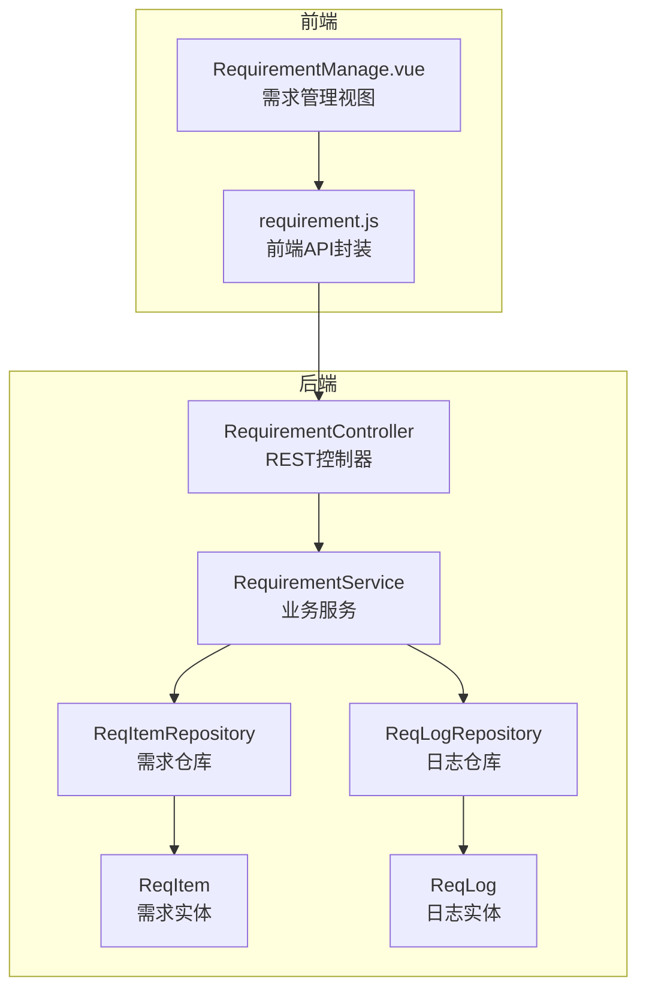
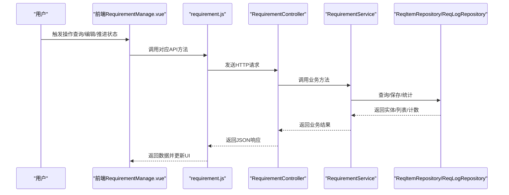
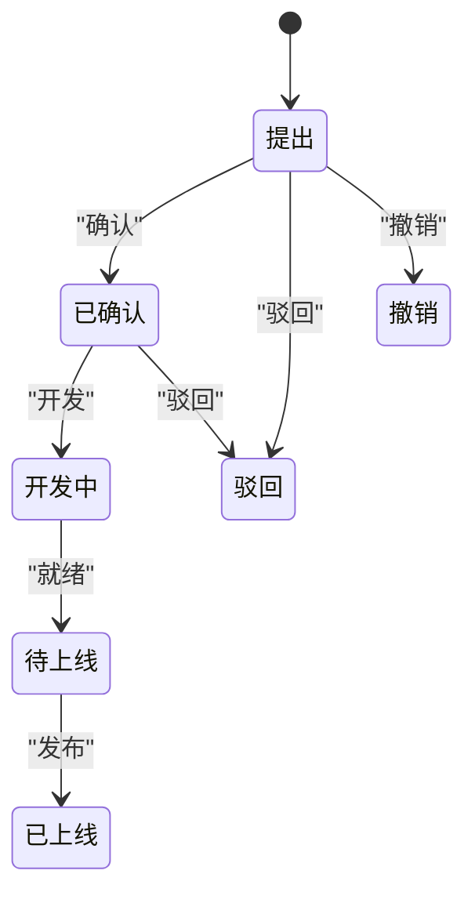
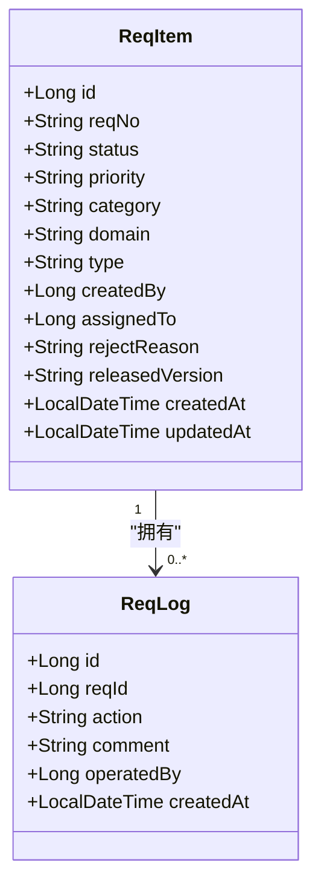
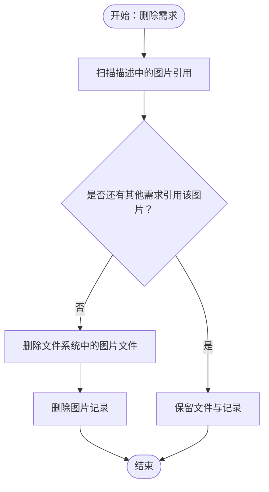
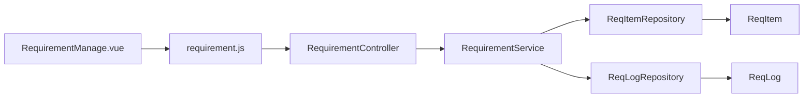

# 需求管理模块

<cite>
**本文引用的文件**
- [RequirementController.java](file://src/main/java/com/superpower/modules/requirement/controller/RequirementController.java)
- [RequirementService.java](file://src/main/java/com/superpower/modules/requirement/service/RequirementService.java)
- [ReqItem.java](file://src/main/java/com/superpower/modules/requirement/entity/ReqItem.java)
- [ReqLog.java](file://src/main/java/com/superpower/modules/requirement/entity/ReqLog.java)
- [ReqItemRepository.java](file://src/main/java/com/superpower/modules/requirement/repository/ReqItemRepository.java)
- [ReqLogRepository.java](file://src/main/java/com/superpower/modules/requirement/repository/ReqLogRepository.java)
- [ReqItemDTO.java](file://src/main/java/com/superpower/modules/requirement/dto/ReqItemDTO.java)
- [ReqActionDTO.java](file://src/main/java/com/superpower/modules/requirement/dto/ReqActionDTO.java)
- [requirement.js](file://frontend/src/api/requirement.js)
- [RequirementManage.vue](file://frontend/src/views/requirement/RequirementManage.vue)
- [20260531_add_requirement_tables.sql](file://db_changes/20260531_add_requirement_tables.sql)
- [20260531_clear_requirement_data.sql](file://db_changes/20260531_clear_requirement_data.sql)
- [20260531_fix_req_image_domain.sql](file://db_changes/20260531_fix_req_image_domain.sql)
- [ImageResourceService.java](file://src/main/java/com/superpower/modules/image/service/ImageResourceService.java)
- [2026-05-28-approval-workflow.md](file://docs/superpowers/plans/2026-05-28-approval-workflow.md)
</cite>

## 目录
1. [简介](#简介)
2. [项目结构](#项目结构)
3. [核心组件](#核心组件)
4. [架构总览](#架构总览)
5. [详细组件分析](#详细组件分析)
6. [依赖关系分析](#依赖关系分析)
7. [性能考虑](#性能考虑)
8. [故障排查指南](#故障排查指南)
9. [结论](#结论)
10. [附录](#附录)

## 简介
本文件面向“需求管理模块”的功能与实现，覆盖需求清单的全生命周期管理：创建、编辑、删除、查询、状态推进、日志追踪、图片管理、审批流程集成以及业务规则约束。同时提供API接口说明、前端组件使用指南、工作流应用案例、数据导入导出与批量操作建议，以及性能优化策略。

## 项目结构
需求管理模块由后端Spring Boot服务与前端Vue界面组成，采用分层架构：
- 控制器层：REST接口定义与鉴权处理
- 服务层：业务逻辑编排与状态机推进
- 数据访问层：JPA仓库封装查询与统计
- 实体层：持久化模型与字段映射
- 前端：API封装与视图组件

图表来源
- [RequirementController.java:21-238](file://src/main/java/com/superpower/modules/requirement/controller/RequirementController.java#L21-L238)
- [RequirementService.java:24-273](file://src/main/java/com/superpower/modules/requirement/service/RequirementService.java#L24-L273)
- [ReqItemRepository.java:12-46](file://src/main/java/com/superpower/modules/requirement/repository/ReqItemRepository.java#L12-L46)
- [ReqLogRepository.java:9-14](file://src/main/java/com/superpower/modules/requirement/repository/ReqLogRepository.java#L9-L14)
- [ReqItem.java:7-59](file://src/main/java/com/superpower/modules/requirement/entity/ReqItem.java#L7-L59)
- [ReqLog.java:7-33](file://src/main/java/com/superpower/modules/requirement/entity/ReqLog.java#L7-L33)
- [requirement.js:1-62](file://frontend/src/api/requirement.js#L1-L62)
- [RequirementManage.vue:1-595](file://frontend/src/views/requirement/RequirementManage.vue#L1-L595)

章节来源
- [RequirementController.java:21-238](file://src/main/java/com/superpower/modules/requirement/controller/RequirementController.java#L21-L238)
- [RequirementService.java:24-273](file://src/main/java/com/superpower/modules/requirement/service/RequirementService.java#L24-L273)
- [ReqItemRepository.java:12-46](file://src/main/java/com/superpower/modules/requirement/repository/ReqItemRepository.java#L12-L46)
- [ReqLogRepository.java:9-14](file://src/main/java/com/superpower/modules/requirement/repository/ReqLogRepository.java#L9-L14)
- [ReqItem.java:7-59](file://src/main/java/com/superpower/modules/requirement/entity/ReqItem.java#L7-L59)
- [ReqLog.java:7-33](file://src/main/java/com/superpower/modules/requirement/entity/ReqLog.java#L7-L33)
- [requirement.js:1-62](file://frontend/src/api/requirement.js#L1-L62)
- [RequirementManage.vue:1-595](file://frontend/src/views/requirement/RequirementManage.vue#L1-L595)

## 核心组件
- 需求实体 ReqItem：承载需求编号、标题、描述、状态、优先级、模块、领域、类型、创建者、分配者、驳回原因、发布版本、时间戳等字段。
- 日志实体 ReqLog：记录每次状态推进或关键操作的动作、评论、操作人与时间。
- 控制器 RequirementController：提供查询、详情、统计、CRUD与状态推进接口，并记录操作日志。
- 服务 RequirementService：实现业务规则、状态机推进、日志生成、编号生成、图片引用清理等。
- 仓库 ReqItemRepository/ReqLogRepository：提供过滤查询、统计计数、按时间范围检索等能力。
- 前端 requirement.js：封装REST调用；RequirementManage.vue：提供列表、筛选、统计、操作、详情与图片预览。

章节来源
- [ReqItem.java:7-59](file://src/main/java/com/superpower/modules/requirement/entity/ReqItem.java#L7-L59)
- [ReqLog.java:7-33](file://src/main/java/com/superpower/modules/requirement/entity/ReqLog.java#L7-L33)
- [RequirementController.java:21-238](file://src/main/java/com/superpower/modules/requirement/controller/RequirementController.java#L21-L238)
- [RequirementService.java:24-273](file://src/main/java/com/superpower/modules/requirement/service/RequirementService.java#L24-L273)
- [ReqItemRepository.java:12-46](file://src/main/java/com/superpower/modules/requirement/repository/ReqItemRepository.java#L12-L46)
- [ReqLogRepository.java:9-14](file://src/main/java/com/superpower/modules/requirement/repository/ReqLogRepository.java#L9-L14)
- [requirement.js:1-62](file://frontend/src/api/requirement.js#L1-L62)
- [RequirementManage.vue:1-595](file://frontend/src/views/requirement/RequirementManage.vue#L1-L595)

## 架构总览
需求管理采用经典的MVC+服务层模式，前后端分离，通过REST API交互。前端负责展示与交互，后端负责业务编排与数据持久化。

图表来源
- [RequirementManage.vue:263-287](file://frontend/src/views/requirement/RequirementManage.vue#L263-L287)
- [requirement.js:1-62](file://frontend/src/api/requirement.js#L1-L62)
- [RequirementController.java:55-238](file://src/main/java/com/superpower/modules/requirement/controller/RequirementController.java#L55-L238)
- [RequirementService.java:42-273](file://src/main/java/com/superpower/modules/requirement/service/RequirementService.java#L42-L273)
- [ReqItemRepository.java:12-46](file://src/main/java/com/superpower/modules/requirement/repository/ReqItemRepository.java#L12-L46)
- [ReqLogRepository.java:9-14](file://src/main/java/com/superpower/modules/requirement/repository/ReqLogRepository.java#L9-L14)

## 详细组件分析

### 需求实体设计与字段语义
- 关键字段
  - reqNo：全局唯一的需求编号，自动生成，格式包含年份与序号。
  - status：需求状态，初始为“提出”，后续推进至“已确认”、“开发中”、“待上线”、“已上线”、“驳回”、“撤销”。
  - priority：优先级，支持“高/中/低”。
  - category/domain/type：用于分类统计与筛选。
  - createdBy/assignedTo：创建者与负责人。
  - rejectReason：驳回原因。
  - releasedVersion：发布版本号（上线时填写）。
  - 时间戳：createdAt/updatedAt。
- 设计要点
  - 使用字符串枚举表示状态，便于国际化与扩展。
  - 描述字段支持富文本中的图片卡片标记，便于图片管理联动。

章节来源
- [ReqItem.java:7-59](file://src/main/java/com/superpower/modules/requirement/entity/ReqItem.java#L7-L59)
- [20260531_add_requirement_tables.sql:1-27](file://db_changes/20260531_add_requirement_tables.sql#L1-L27)

### 需求状态管理与工作流
- 状态机
  - 提出 → 已确认 → 开发中 → 待上线 → 已上线
  - 提出/已确认 → 驳回
  - 提出 → 撤销
- 推进接口
  - confirm/develop/ready/release/reject/cancel 对应不同状态推进或终止动作。
- 业务规则
  - 仅“提出”状态可编辑与撤销；编辑需校验创建者身份。
  - 上线必须提供版本号；驳回必须提供原因。
  - 删除时会扫描描述中的图片引用，若无其他需求引用则清理文件与记录。

图表来源
- [RequirementService.java:120-192](file://src/main/java/com/superpower/modules/requirement/service/RequirementService.java#L120-L192)
- [RequirementController.java:180-226](file://src/main/java/com/superpower/modules/requirement/controller/RequirementController.java#L180-L226)

章节来源
- [RequirementService.java:120-192](file://src/main/java/com/superpower/modules/requirement/service/RequirementService.java#L120-L192)
- [RequirementController.java:180-226](file://src/main/java/com/superpower/modules/requirement/controller/RequirementController.java#L180-L226)

### 需求日志追踪机制
- 日志实体包含：需求ID、动作、评论、操作人、时间。
- 服务层在每次状态推进或关键操作时写入日志，并在查询详情时返回。
- 前端在详情弹窗中以时间轴形式展示，支持查看操作人与备注。

图表来源
- [ReqItem.java:7-59](file://src/main/java/com/superpower/modules/requirement/entity/ReqItem.java#L7-L59)
- [ReqLog.java:7-33](file://src/main/java/com/superpower/modules/requirement/entity/ReqLog.java#L7-L33)
- [ReqItemRepository.java:12-46](file://src/main/java/com/superpower/modules/requirement/repository/ReqItemRepository.java#L12-L46)
- [ReqLogRepository.java:9-14](file://src/main/java/com/superpower/modules/requirement/repository/ReqLogRepository.java#L9-L14)

章节来源
- [ReqLog.java:7-33](file://src/main/java/com/superpower/modules/requirement/entity/ReqLog.java#L7-L33)
- [RequirementService.java:218-222](file://src/main/java/com/superpower/modules/requirement/service/RequirementService.java#L218-L222)
- [RequirementManage.vue:137-144](file://frontend/src/views/requirement/RequirementManage.vue#L137-L144)

### 需求图片管理功能
- 图片卡片标记
  - 描述字段中通过特定标记引用图片资源（包含data-id）。
- 图片同步与清理
  - 当图片重命名时，服务会同步更新所有引用该图片的描述内容。
  - 删除需求时，若某图片在其他需求中不再被引用，则删除文件与记录。
- 前端图片操作
  - 在详情描述中点击图片卡片可预览或删除（仅“提出”状态下允许删除）。

图表来源
- [RequirementService.java:194-216](file://src/main/java/com/superpower/modules/requirement/service/RequirementService.java#L194-L216)
- [ImageResourceService.java:402-430](file://src/main/java/com/superpower/modules/image/service/ImageResourceService.java#L402-L430)
- [RequirementManage.vue:471-497](file://frontend/src/views/requirement/RequirementManage.vue#L471-L497)

章节来源
- [RequirementService.java:194-216](file://src/main/java/com/superpower/modules/requirement/service/RequirementService.java#L194-L216)
- [ImageResourceService.java:402-430](file://src/main/java/com/superpower/modules/image/service/ImageResourceService.java#L402-L430)
- [RequirementManage.vue:471-497](file://frontend/src/views/requirement/RequirementManage.vue#L471-L497)

### 需求审批流程集成
- 审批状态与角色
  - 审批状态：待提交、待审核、审核通过、驳回。
  - 角色权限：editor（可提交）、reviewer（可审核）、admin（可强制推进）。
- 流程控制
  - 严格的状态转换矩阵与动作-角色映射，确保合规推进。
  - 审批日志记录操作人、动作与意见。
- 前端集成
  - 列表操作列显示审批按钮，详情弹窗展示审批流时间轴。

章节来源
- [2026-05-28-approval-workflow.md:129-212](file://docs/superpowers/plans/2026-05-28-approval-workflow.md#L129-L212)
- [RequirementManage.vue:154-162](file://frontend/src/views/requirement/RequirementManage.vue#L154-L162)

### 需求数据的业务规则
- 创建：自动生成reqNo，初始状态“提出”，默认优先级“中”。
- 编辑：仅“提出”状态且创建者本人可编辑。
- 推进：严格遵循状态机，错误状态推进抛出异常。
- 删除：清理图片引用与日志，避免悬挂文件。
- 统计：支持按状态、模块、类型分组统计，支持日期范围与筛选条件。

章节来源
- [RequirementService.java:83-117](file://src/main/java/com/superpower/modules/requirement/service/RequirementService.java#L83-L117)
- [RequirementController.java:55-162](file://src/main/java/com/superpower/modules/requirement/controller/RequirementController.java#L55-L162)

### API接口说明
- 查询与统计
  - GET /api/requirements：分页/筛选查询
  - GET /api/requirements/my：查询我的需求
  - GET /api/requirements/stats：按状态统计
  - GET /api/requirements/stats-by-module：按模块统计
  - GET /api/requirements/stats-by-type：按类型统计
- CRUD与状态推进
  - POST /api/requirements：创建
  - PUT /api/requirements/{id}：编辑
  - PUT /api/requirements/{id}/confirm：确认
  - PUT /api/requirements/{id}/develop：开发
  - PUT /api/requirements/{id}/ready：就绪
  - PUT /api/requirements/{id}/release：发布
  - PUT /api/requirements/{id}/reject：驳回
  - PUT /api/requirements/{id}/cancel：撤销
  - DELETE /api/requirements/{id}：删除（管理员）
- 前端封装
  - 前端requirement.js对上述接口进行统一封装，便于组件复用。

章节来源
- [RequirementController.java:55-238](file://src/main/java/com/superpower/modules/requirement/controller/RequirementController.java#L55-L238)
- [requirement.js:1-62](file://frontend/src/api/requirement.js#L1-L62)

### 前端需求列表组件使用指南
- 功能概览
  - 支持筛选（状态、模块、类型、优先级、提出人、日期范围）、切换“我的/全部”、搜索。
  - 展示状态分布、模块分布、类型分布的柱状图。
  - 支持编辑、撤销、推进状态、删除、查看详情、审批流查看。
- 操作入口
  - “提交需求”打开新建/编辑对话框；表格右侧根据状态与权限显示对应操作按钮。
  - 点击状态标签可查看审批流时间轴。
  - 详情描述中的图片卡片支持预览与删除（仅“提出”状态）。
- 交互细节
  - 发布时必填版本号；驳回时必填原因；删除前二次确认。
  - 图表点击可钻取到对应筛选条件。

章节来源
- [RequirementManage.vue:1-595](file://frontend/src/views/requirement/RequirementManage.vue#L1-L595)

### 需求工作流的实际应用案例
- 场景一：产品经理提出需求 → 确认 → 开发 → 就绪 → 发布
  - 步骤：创建需求 → 管理员确认 → 开发人员设为开发中 → 就绪 → 发布并填写版本号。
- 场景二：需求被驳回 → 修改后重新提交
  - 步骤：驳回后需求回到“提出/已确认”状态，可继续推进。
- 场景三：需求撤销
  - 仅“提出”状态可撤销，撤销后不可再推进。

章节来源
- [RequirementService.java:120-192](file://src/main/java/com/superpower/modules/requirement/service/RequirementService.java#L120-L192)
- [RequirementController.java:180-226](file://src/main/java/com/superpower/modules/requirement/controller/RequirementController.java#L180-L226)

### 数据导入导出与批量操作
- 导入
  - 可通过Excel导入工具链（仓库中存在导入脚本与迁移任务）批量生成数据。
  - 需求图片目录迁移与修正见数据库变更脚本。
- 导出
  - 建议通过后端接口分页拉取并前端导出为Excel；或结合现有统计数据接口生成报表。
- 批量操作
  - 前端支持按状态/模块/类型筛选后进行批量推进或删除（管理员）。
  - 后端支持按条件统计与导出。

章节来源
- [20260531_add_requirement_tables.sql:1-27](file://db_changes/20260531_add_requirement_tables.sql#L1-L27)
- [20260531_clear_requirement_data.sql:1-11](file://db_changes/20260531_clear_requirement_data.sql#L1-L11)
- [20260531_fix_req_image_domain.sql:28-39](file://db_changes/20260531_fix_req_image_domain.sql#L28-L39)

## 依赖关系分析
- 控制器依赖服务；服务依赖仓库与用户/图片资源仓库；仓库依赖实体。
- 前端通过requirement.js依赖控制器；RequirementManage.vue依赖API与ECharts。

图表来源
- [RequirementController.java:21-238](file://src/main/java/com/superpower/modules/requirement/controller/RequirementController.java#L21-L238)
- [RequirementService.java:24-273](file://src/main/java/com/superpower/modules/requirement/service/RequirementService.java#L24-L273)
- [ReqItemRepository.java:12-46](file://src/main/java/com/superpower/modules/requirement/repository/ReqItemRepository.java#L12-L46)
- [ReqLogRepository.java:9-14](file://src/main/java/com/superpower/modules/requirement/repository/ReqLogRepository.java#L9-L14)
- [ReqItem.java:7-59](file://src/main/java/com/superpower/modules/requirement/entity/ReqItem.java#L7-L59)
- [ReqLog.java:7-33](file://src/main/java/com/superpower/modules/requirement/entity/ReqLog.java#L7-L33)
- [requirement.js:1-62](file://frontend/src/api/requirement.js#L1-L62)
- [RequirementManage.vue:1-595](file://frontend/src/views/requirement/RequirementManage.vue#L1-L595)

章节来源
- [RequirementController.java:21-238](file://src/main/java/com/superpower/modules/requirement/controller/RequirementController.java#L21-L238)
- [RequirementService.java:24-273](file://src/main/java/com/superpower/modules/requirement/service/RequirementService.java#L24-L273)
- [ReqItemRepository.java:12-46](file://src/main/java/com/superpower/modules/requirement/repository/ReqItemRepository.java#L12-L46)
- [ReqLogRepository.java:9-14](file://src/main/java/com/superpower/modules/requirement/repository/ReqLogRepository.java#L9-L14)
- [ReqItem.java:7-59](file://src/main/java/com/superpower/modules/requirement/entity/ReqItem.java#L7-L59)
- [ReqLog.java:7-33](file://src/main/java/com/superpower/modules/requirement/entity/ReqLog.java#L7-L33)
- [requirement.js:1-62](file://frontend/src/api/requirement.js#L1-L62)
- [RequirementManage.vue:1-595](file://frontend/src/views/requirement/RequirementManage.vue#L1-L595)

## 性能考虑
- 查询优化
  - 使用分页与索引字段（状态、创建者、时间范围、类别/类型/优先级）减少全表扫描。
  - 统计接口按需传参，避免不必要的聚合计算。
- 写入优化
  - 批量保存时尽量合并事务，减少IO次数。
  - 图片清理采用“引用计数”判断，避免误删。
- 前端优化
  - ECharts实例复用与销毁时机把控，窗口resize事件节流。
  - 图片预览采用懒加载与缩略图，降低首屏压力。

## 故障排查指南
- 常见问题
  - 状态推进失败：检查当前状态与期望状态是否一致，确认动作是否允许。
  - 上线失败：检查是否提供了版本号。
  - 驳回失败：检查是否提供了驳回原因。
  - 删除失败：确认是否有其他需求引用了图片，必要时先清理引用。
- 日志定位
  - 查看操作日志与审批日志，确认操作人与时间线。
- 数据恢复
  - 清库脚本仅清需求相关数据，如需恢复请备份数据库。

章节来源
- [RequirementService.java:150-177](file://src/main/java/com/superpower/modules/requirement/service/RequirementService.java#L150-L177)
- [RequirementManage.vue:442-456](file://frontend/src/views/requirement/RequirementManage.vue#L442-L456)
- [20260531_clear_requirement_data.sql:1-11](file://db_changes/20260531_clear_requirement_data.sql#L1-L11)

## 结论
需求管理模块通过清晰的状态机、完善的日志追踪、严谨的业务规则与前后端协同，实现了从提出到发布的完整闭环。图片管理与审批流程的集成进一步提升了协作效率与可追溯性。建议在生产环境中配合监控与审计策略，持续优化查询与写入性能。

## 附录
- 表结构参考
  - req_item：需求主表
  - req_log：需求操作日志表
- 数据迁移与修复
  - 需求图片目录迁移与修正脚本可用于修复历史数据问题。

章节来源
- [20260531_add_requirement_tables.sql:1-27](file://db_changes/20260531_add_requirement_tables.sql#L1-L27)
- [20260531_fix_req_image_domain.sql:28-39](file://db_changes/20260531_fix_req_image_domain.sql#L28-L39)