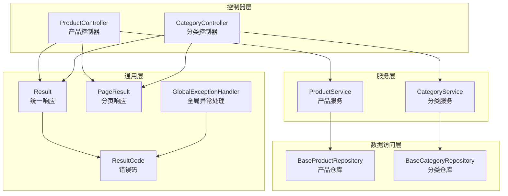
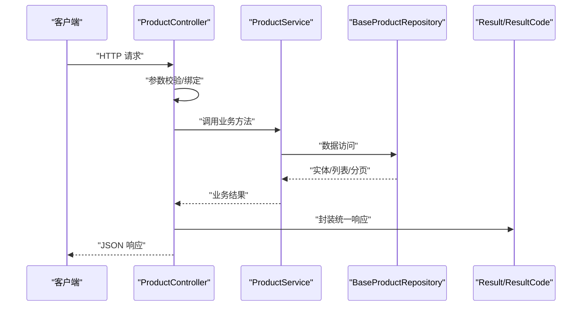
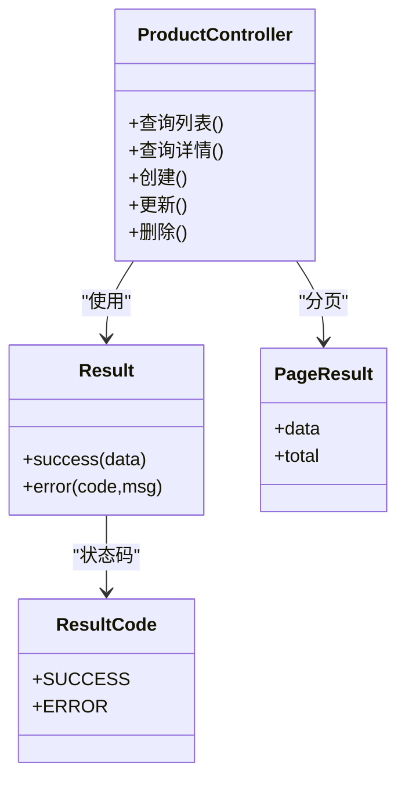
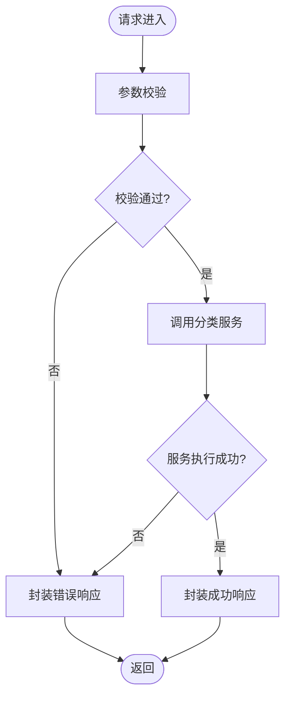
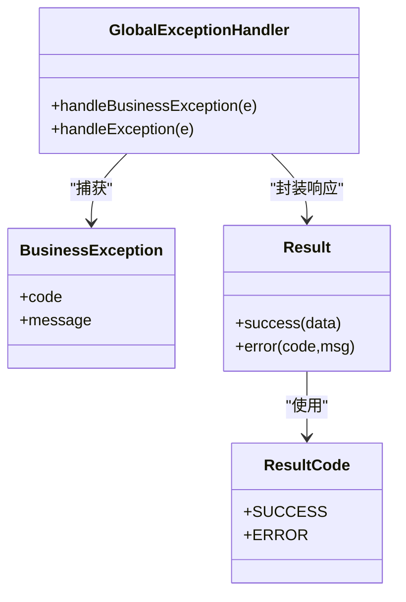
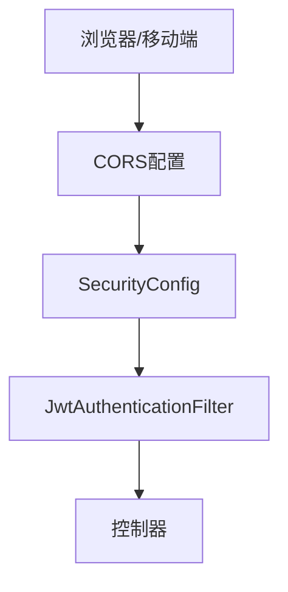
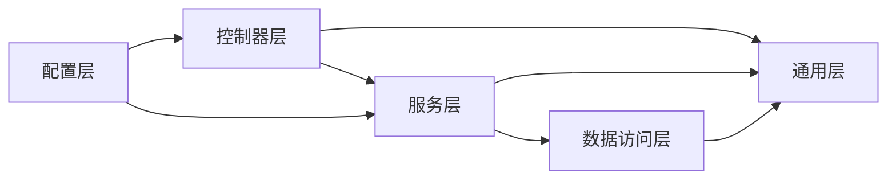

# API控制器设计

<cite>
**本文档引用的文件**
- [ProductController.java](file://src/main/java/com/superpower/modules/category/controller/ProductController.java)
- [CategoryController.java](file://src/main/java/com/superpower/modules/category/controller/CategoryController.java)
- [Result.java](file://src/main/java/com/superpower/common/Result.java)
- [PageResult.java](file://src/main/java/com/superpower/common/PageResult.java)
- [ResultCode.java](file://src/main/java/com/superpower/common/ResultCode.java)
- [GlobalExceptionHandler.java](file://src/main/java/com/superpower/common/GlobalExceptionHandler.java)
- [BusinessException.java](file://src/main/java/com/superpower/common/BusinessException.java)
- [WebMvcConfig.java](file://src/main/java/com/superpower/config/WebMvcConfig.java)
- [SecurityConfig.java](file://src/main/java/com/superpower/config/SecurityConfig.java)
- [JwtAuthenticationFilter.java](file://src/main/java/com/superpower/security/JwtAuthenticationFilter.java)
- [application.yml](file://src/main/resources/application.yml)
</cite>

## 目录
1. [引言](#引言)
2. [项目结构](#项目结构)
3. [核心组件](#核心组件)
4. [架构总览](#架构总览)
5. [详细组件分析](#详细组件分析)
6. [依赖关系分析](#依赖关系分析)
7. [性能考虑](#性能考虑)
8. [故障排除指南](#故障排除指南)
9. [结论](#结论)
10. [附录](#附录)

## 引言
本文件面向产品清单管理系统中的RESTful API控制器设计，系统性阐述控制器层的设计原则与实现细节，包括HTTP方法映射、URL路径设计、请求参数处理、请求验证、参数绑定、业务调用与响应格式化。同时，文档覆盖全局响应包装机制、错误码定义与异常映射策略，以及API版本控制、请求限流、CORS配置与API文档生成等工程实践，旨在帮助开发者构建高质量的RESTful接口。

## 项目结构
后端采用Spring Boot标准分层架构：controller（控制器）、service（服务）、repository（数据访问）、entity（实体）与dto（数据传输对象）。通用层包含统一响应封装、分页结果、错误码与全局异常处理。配置层提供Web MVC、安全与数据库相关配置。

图表来源
- [ProductController.java](file://src/main/java/com/superpower/modules/category/controller/ProductController.java)
- [CategoryController.java](file://src/main/java/com/superpower/modules/category/controller/CategoryController.java)
- [Result.java](file://src/main/java/com/superpower/common/Result.java)
- [PageResult.java](file://src/main/java/com/superpower/common/PageResult.java)
- [ResultCode.java](file://src/main/java/com/superpower/common/ResultCode.java)
- [GlobalExceptionHandler.java](file://src/main/java/com/superpower/common/GlobalExceptionHandler.java)

章节来源
- [ProductController.java](file://src/main/java/com/superpower/modules/category/controller/ProductController.java)
- [CategoryController.java](file://src/main/java/com/superpower/modules/category/controller/CategoryController.java)
- [Result.java](file://src/main/java/com/superpower/common/Result.java)
- [PageResult.java](file://src/main/java/com/superpower/common/PageResult.java)
- [ResultCode.java](file://src/main/java/com/superpower/common/ResultCode.java)
- [GlobalExceptionHandler.java](file://src/main/java/com/superpower/common/GlobalExceptionHandler.java)

## 核心组件
- 统一响应封装：Result<T>用于承载成功响应；PageResult<T>用于分页查询；二者均通过ResultCode提供状态码与消息。
- 全局异常处理：GlobalExceptionHandler将业务异常与运行时异常转换为统一响应格式，保证对外一致的错误语义。
- 错误码体系：ResultCode定义标准错误码枚举，便于前后端约定与国际化扩展。
- 控制器层：ProductController与CategoryController分别负责产品与分类的CRUD与查询逻辑，遵循REST风格路径与HTTP方法映射。

章节来源
- [Result.java](file://src/main/java/com/superpower/common/Result.java)
- [PageResult.java](file://src/main/java/com/superpower/common/PageResult.java)
- [ResultCode.java](file://src/main/java/com/superpower/common/ResultCode.java)
- [GlobalExceptionHandler.java](file://src/main/java/com/superpower/common/GlobalExceptionHandler.java)
- [ProductController.java](file://src/main/java/com/superpower/modules/category/controller/ProductController.java)
- [CategoryController.java](file://src/main/java/com/superpower/modules/category/controller/CategoryController.java)

## 架构总览
控制器层作为对外接口入口，接收HTTP请求，进行参数校验与绑定，调用服务层执行业务逻辑，最终以统一响应封装返回。异常在全局层面被捕获并标准化输出。

图表来源
- [ProductController.java](file://src/main/java/com/superpower/modules/category/controller/ProductController.java)
- [Result.java](file://src/main/java/com/superpower/common/Result.java)
- [ResultCode.java](file://src/main/java/com/superpower/common/ResultCode.java)

## 详细组件分析

### 产品控制器（ProductController）
职责与设计要点
- 路径设计：遵循REST资源命名与层级，如“/api/products”表示产品资源集合，结合HTTP方法实现增删改查。
- 方法映射：GET/POST/PUT/DELETE分别对应查询列表/详情、创建、更新、删除。
- 参数处理：支持路径变量、查询参数与请求体参数，使用注解完成参数绑定与校验。
- 响应封装：成功返回Result.success(data)，分页场景使用PageResult封装；失败通过全局异常处理器统一拦截。

图表来源
- [ProductController.java](file://src/main/java/com/superpower/modules/category/controller/ProductController.java)
- [Result.java](file://src/main/java/com/superpower/common/Result.java)
- [PageResult.java](file://src/main/java/com/superpower/common/PageResult.java)
- [ResultCode.java](file://src/main/java/com/superpower/common/ResultCode.java)

章节来源
- [ProductController.java](file://src/main/java/com/superpower/modules/category/controller/ProductController.java)

### 分类控制器（CategoryController）
职责与设计要点
- 路径设计：采用“/api/categories”资源路径，支持树形结构查询、层级过滤与批量操作。
- 方法映射：GET/POST/PUT/DELETE覆盖分类全生命周期；新增树形查询与层级统计等扩展接口。
- 参数处理：对层级、父节点、名称等字段进行非空与范围校验，避免脏数据进入服务层。
- 响应封装：与产品控制器一致，统一使用Result/ResultCode与PageResult。

图表来源
- [CategoryController.java](file://src/main/java/com/superpower/modules/category/controller/CategoryController.java)
- [Result.java](file://src/main/java/com/superpower/common/Result.java)
- [ResultCode.java](file://src/main/java/com/superpower/common/ResultCode.java)

章节来源
- [CategoryController.java](file://src/main/java/com/superpower/modules/category/controller/CategoryController.java)

### 统一响应与错误处理
- Result<T>：提供success(data)与error(code,msg)两类静态工厂方法，简化控制器返回值构造。
- PageResult<T>：在分页查询中携带data与total，便于前端分页渲染。
- ResultCode：集中定义业务状态码，确保前后端一致性。
- GlobalExceptionHandler：捕获BusinessException与其它异常，统一转换为Result.error(code,msg)，屏蔽底层异常细节。

图表来源
- [GlobalExceptionHandler.java](file://src/main/java/com/superpower/common/GlobalExceptionHandler.java)
- [BusinessException.java](file://src/main/java/com/superpower/common/BusinessException.java)
- [Result.java](file://src/main/java/com/superpower/common/Result.java)
- [ResultCode.java](file://src/main/java/com/superpower/common/ResultCode.java)

章节来源
- [GlobalExceptionHandler.java](file://src/main/java/com/superpower/common/GlobalExceptionHandler.java)
- [BusinessException.java](file://src/main/java/com/superpower/common/BusinessException.java)
- [Result.java](file://src/main/java/com/superpower/common/Result.java)
- [ResultCode.java](file://src/main/java/com/superpower/common/ResultCode.java)

### 安全与跨域配置
- WebMvcConfig：注册CORS配置，允许指定源、方法与头信息，保障前端跨域访问。
- SecurityConfig：启用Spring Security，定义认证与授权规则，保护受控接口。
- JwtAuthenticationFilter：基于JWT的无状态认证过滤器，解析令牌并注入认证信息到SecurityContext。

图表来源
- [WebMvcConfig.java](file://src/main/java/com/superpower/config/WebMvcConfig.java)
- [SecurityConfig.java](file://src/main/java/com/superpower/config/SecurityConfig.java)
- [JwtAuthenticationFilter.java](file://src/main/java/com/superpower/security/JwtAuthenticationFilter.java)

章节来源
- [WebMvcConfig.java](file://src/main/java/com/superpower/config/WebMvcConfig.java)
- [SecurityConfig.java](file://src/main/java/com/superpower/config/SecurityConfig.java)
- [JwtAuthenticationFilter.java](file://src/main/java/com/superpower/security/JwtAuthenticationFilter.java)

## 依赖关系分析
- 控制器依赖服务层：控制器不直接操作数据库，通过服务层协调业务流程。
- 服务层依赖数据访问层：服务层组合多个仓库或实体操作，保证事务与业务一致性。
- 通用层被所有层复用：统一响应、错误码与异常处理贯穿各层，降低重复代码与提升一致性。
- 配置层为横切关注点：安全、跨域与Web配置独立于业务逻辑，便于维护与演进。

图表来源
- [ProductController.java](file://src/main/java/com/superpower/modules/category/controller/ProductController.java)
- [CategoryController.java](file://src/main/java/com/superpower/modules/category/controller/CategoryController.java)
- [Result.java](file://src/main/java/com/superpower/common/Result.java)
- [PageResult.java](file://src/main/java/com/superpower/common/PageResult.java)
- [ResultCode.java](file://src/main/java/com/superpower/common/ResultCode.java)
- [GlobalExceptionHandler.java](file://src/main/java/com/superpower/common/GlobalExceptionHandler.java)
- [WebMvcConfig.java](file://src/main/java/com/superpower/config/WebMvcConfig.java)
- [SecurityConfig.java](file://src/main/java/com/superpower/config/SecurityConfig.java)

章节来源
- [ProductController.java](file://src/main/java/com/superpower/modules/category/controller/ProductController.java)
- [CategoryController.java](file://src/main/java/com/superpower/modules/category/controller/CategoryController.java)
- [Result.java](file://src/main/java/com/superpower/common/Result.java)
- [PageResult.java](file://src/main/java/com/superpower/common/PageResult.java)
- [ResultCode.java](file://src/main/java/com/superpower/common/ResultCode.java)
- [GlobalExceptionHandler.java](file://src/main/java/com/superpower/common/GlobalExceptionHandler.java)
- [WebMvcConfig.java](file://src/main/java/com/superpower/config/WebMvcConfig.java)
- [SecurityConfig.java](file://src/main/java/com/superpower/config/SecurityConfig.java)

## 性能考虑
- 响应封装：统一使用Result/ResultCode减少序列化开销与分支判断。
- 分页查询：优先使用PageResult，避免一次性加载大量数据。
- 缓存策略：对只读列表与字典类数据可引入缓存，降低数据库压力。
- 并发控制：在高并发场景下，结合限流与降级策略，保障系统稳定性。
- 日志与监控：记录关键接口耗时与异常，辅助定位性能瓶颈。

## 故障排除指南
- 常见问题
  - 参数校验失败：检查控制器参数注解与校验规则，确保请求体与查询参数符合预期。
  - 业务异常：确认服务层抛出的BusinessException是否包含正确错误码与提示信息。
  - 未捕获异常：排查是否存在未声明的运行时异常，必要时在服务层包装为业务异常。
- 排查步骤
  - 查看全局异常处理器日志，定位异常类型与堆栈。
  - 对照ResultCode枚举，确认错误码含义与前端提示文案。
  - 使用最小化请求复现问题，逐步缩小范围。

章节来源
- [GlobalExceptionHandler.java](file://src/main/java/com/superpower/common/GlobalExceptionHandler.java)
- [BusinessException.java](file://src/main/java/com/superpower/common/BusinessException.java)
- [ResultCode.java](file://src/main/java/com/superpower/common/ResultCode.java)

## 结论
本设计通过清晰的分层与统一的响应/异常处理机制，实现了RESTful API的高内聚低耦合。控制器层专注于HTTP交互与参数处理，服务层专注业务编排，通用层提供一致的契约与错误语义。配合安全与跨域配置，系统具备良好的可维护性与扩展性。建议在后续迭代中完善API版本控制策略、接入限流与熔断机制，并持续优化分页与缓存策略以提升性能。

## 附录
- API版本控制建议
  - 路径前缀版本：如“/api/v1/products”，便于URL直观表达版本。
  - 头部版本：如“Accept: application/vnd.superpower.v1+json”，利于向后兼容。
  - 版本迁移：提供过渡期与弃用提示，逐步引导客户端升级。
- 请求限流
  - 基于IP或用户维度设置QPS阈值，超过阈值返回统一错误码与重试时间。
  - 对写操作与敏感接口实施更严格限流策略。
- CORS配置
  - 明确允许的源、方法与头，避免使用通配符导致安全风险。
  - 预检请求（OPTIONS）需正确处理，确保复杂请求正常通过。
- API文档生成
  - 使用OpenAPI/Swagger自动生成接口文档，保持接口契约与文档同步。
  - 在控制器中补充接口说明、参数约束与示例，提升可读性与可维护性。