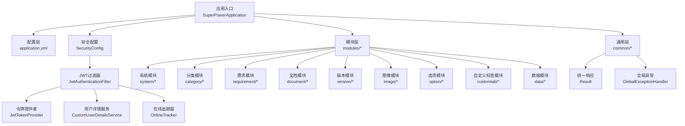
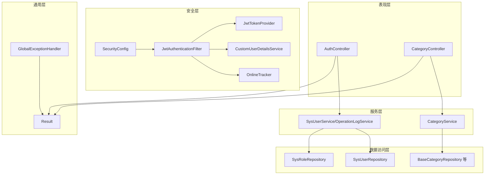
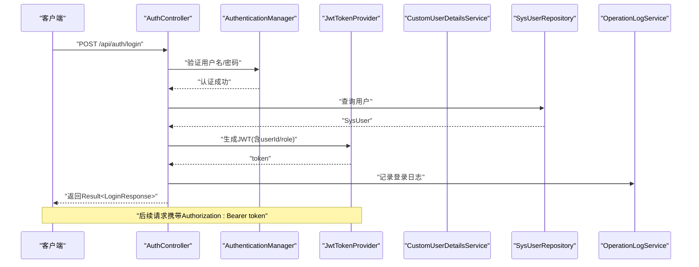
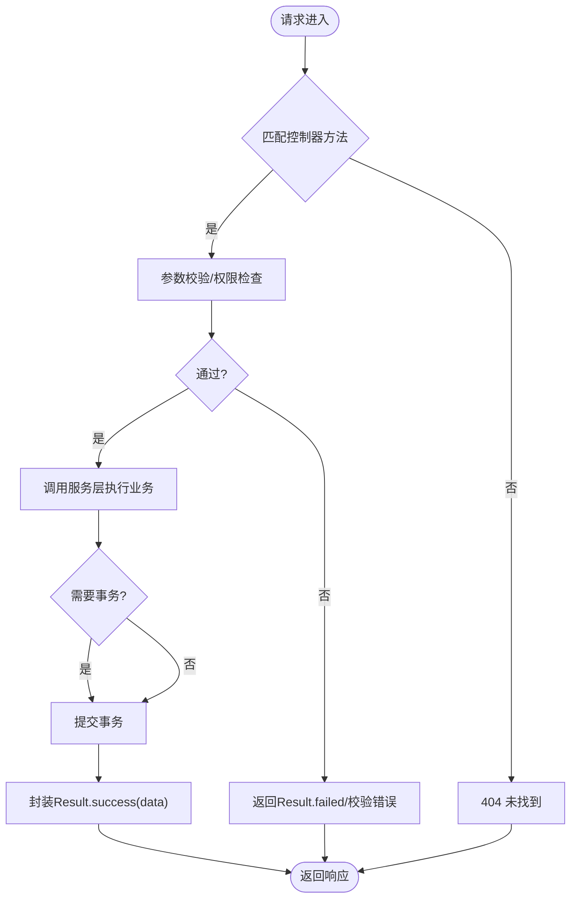
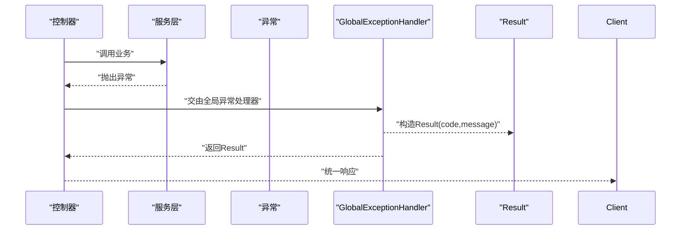
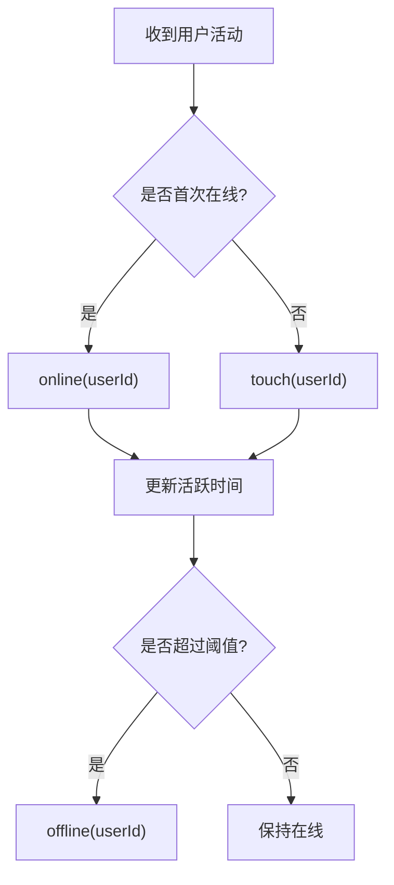
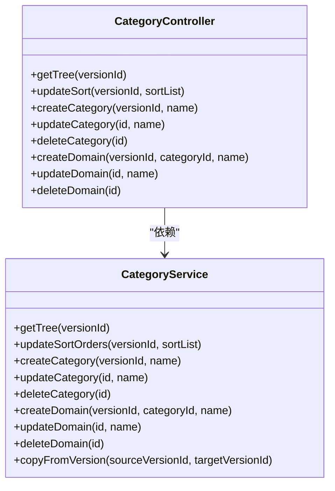
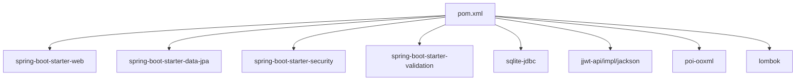

# 后端架构设计

<cite>
**本文引用的文件**
- [SuperPowerApplication.java](file://src/main/java/com/superpower/SuperPowerApplication.java)
- [application.yml](file://src/main/resources/application.yml)
- [pom.xml](file://pom.xml)
- [Result.java](file://src/main/java/com/superpower/common/Result.java)
- [GlobalExceptionHandler.java](file://src/main/java/com/superpower/common/GlobalExceptionHandler.java)
- [SecurityConfig.java](file://src/main/java/com/superpower/config/SecurityConfig.java)
- [JwtAuthenticationFilter.java](file://src/main/java/com/superpower/security/JwtAuthenticationFilter.java)
- [JwtTokenProvider.java](file://src/main/java/com/superpower/security/JwtTokenProvider.java)
- [CustomUserDetailsService.java](file://src/main/java/com/superpower/security/CustomUserDetailsService.java)
- [AuthController.java](file://src/main/java/com/superpower/modules/system/controller/AuthController.java)
- [OnlineTracker.java](file://src/main/java/com/superpower/security/OnlineTracker.java)
- [SysUser.java](file://src/main/java/com/superpower/modules/system/entity/SysUser.java)
- [SysRole.java](file://src/main/java/com/superpower/modules/system/entity/SysRole.java)
- [CategoryController.java](file://src/main/java/com/superpower/modules/category/controller/CategoryController.java)
- [CategoryService.java](file://src/main/java/com/superpower/modules/category/service/CategoryService.java)
</cite>

## 目录
1. [引言](#引言)
2. [项目结构](#项目结构)
3. [核心组件](#核心组件)
4. [架构总览](#架构总览)
5. [详细组件分析](#详细组件分析)
6. [依赖分析](#依赖分析)
7. [性能考虑](#性能考虑)
8. [故障排查指南](#故障排查指南)
9. [结论](#结论)

## 引言
本文件面向产品清单管理系统的后端架构，围绕Spring Boot应用的分层架构、依赖注入与模块化组织进行系统性梳理；重点阐述安全认证体系（JWT认证、用户权限管理、在线用户跟踪）、RESTful API设计原则、异常处理机制与统一响应格式，并结合代码级图示帮助开发者快速理解与扩展系统。

## 项目结构
系统采用标准的Spring Boot目录组织方式，按功能域划分模块，配合通用工具与安全配置形成清晰的层次化结构：
- 应用入口与初始化：SuperPowerApplication负责启动、时区设置与基础数据初始化
- 配置层：application.yml集中管理服务器、数据库、JPA、日志与JWT等配置；SecurityConfig定义安全策略
- 通用层：Result与GlobalExceptionHandler提供统一响应与异常处理
- 安全层：JwtTokenProvider生成与校验令牌；JwtAuthenticationFilter在请求链路中解析与注入认证上下文；CustomUserDetailsService加载用户与角色；OnlineTracker维护在线状态
- 模块层：以modules为根，按领域拆分controller/service/repository/entity，如system、category、requirement、document等
- 资源层：resources下包含数据库初始化脚本、模板与应用配置

图表来源
- [SuperPowerApplication.java:17-42](file://src/main/java/com/superpower/SuperPowerApplication.java#L17-L42)
- [application.yml:11-39](file://src/main/resources/application.yml#L11-L39)
- [SecurityConfig.java:27-45](file://src/main/java/com/superpower/config/SecurityConfig.java#L27-L45)
- [JwtAuthenticationFilter.java:17-30](file://src/main/java/com/superpower/security/JwtAuthenticationFilter.java#L17-L30)
- [JwtTokenProvider.java:12-23](file://src/main/java/com/superpower/security/JwtTokenProvider.java#L12-L23)
- [CustomUserDetailsService.java:14-21](file://src/main/java/com/superpower/security/CustomUserDetailsService.java#L14-L21)
- [OnlineTracker.java:11-19](file://src/main/java/com/superpower/security/OnlineTracker.java#L11-L19)
- [Result.java:5-15](file://src/main/java/com/superpower/common/Result.java#L5-L15)
- [GlobalExceptionHandler.java:14-15](file://src/main/java/com/superpower/common/GlobalExceptionHandler.java#L14-L15)

章节来源
- [SuperPowerApplication.java:17-42](file://src/main/java/com/superpower/SuperPowerApplication.java#L17-L42)
- [application.yml:11-39](file://src/main/resources/application.yml#L11-L39)
- [pom.xml:21-84](file://pom.xml#L21-L84)

## 核心组件
- 统一响应Result：封装code/message/data三段式返回，提供success/failed/forbidden/unauthorized等静态工厂方法，确保前后端一致的契约
- 全局异常处理GlobalExceptionHandler：对业务异常、鉴权异常、参数校验异常与通用异常进行分类处理，统一返回Result格式
- 安全配置SecurityConfig：禁用CSRF、配置会话无状态、基于路径的访问控制与JWT过滤器链
- JWT组件：JwtTokenProvider负责签发与校验；JwtAuthenticationFilter在每次请求中提取令牌、解析用户信息并写入SecurityContext
- 用户详情服务CustomUserDetailsService：从SysUser加载用户，映射角色编码到ROLE_*授权
- 在线追踪OnlineTracker：维护用户活跃时间，提供在线判定与清理过期用户
- 数据模型SysUser/SysRole：承载用户、角色与状态字段，支持登录时间与关联查询

章节来源
- [Result.java:17-40](file://src/main/java/com/superpower/common/Result.java#L17-L40)
- [GlobalExceptionHandler.java:17-47](file://src/main/java/com/superpower/common/GlobalExceptionHandler.java#L17-L47)
- [SecurityConfig.java:27-55](file://src/main/java/com/superpower/config/SecurityConfig.java#L27-L55)
- [JwtTokenProvider.java:25-64](file://src/main/java/com/superpower/security/JwtTokenProvider.java#L25-L64)
- [JwtAuthenticationFilter.java:32-48](file://src/main/java/com/superpower/security/JwtAuthenticationFilter.java#L32-L48)
- [CustomUserDetailsService.java:23-36](file://src/main/java/com/superpower/security/CustomUserDetailsService.java#L23-L36)
- [OnlineTracker.java:17-41](file://src/main/java/com/superpower/security/OnlineTracker.java#L17-L41)
- [SysUser.java:10-39](file://src/main/java/com/superpower/modules/system/entity/SysUser.java#L10-L39)
- [SysRole.java:7-26](file://src/main/java/com/superpower/modules/system/entity/SysRole.java#L7-L26)

## 架构总览
系统采用经典的分层架构：
- 表现层：REST控制器接收HTTP请求，调用服务层完成业务逻辑
- 服务层：封装事务与业务规则，协调仓储与跨表操作
- 数据访问层：JPA仓库负责实体持久化与查询
- 安全层：Spring Security + JWT，无状态认证与细粒度授权
- 通用层：统一响应与异常处理，保证接口一致性与可维护性

图表来源
- [AuthController.java:22-42](file://src/main/java/com/superpower/modules/system/controller/AuthController.java#L22-L42)
- [CategoryController.java:13-19](file://src/main/java/com/superpower/modules/category/controller/CategoryController.java#L13-L19)
- [SecurityConfig.java:27-45](file://src/main/java/com/superpower/config/SecurityConfig.java#L27-L45)
- [JwtAuthenticationFilter.java:17-30](file://src/main/java/com/superpower/security/JwtAuthenticationFilter.java#L17-L30)
- [JwtTokenProvider.java:12-23](file://src/main/java/com/superpower/security/JwtTokenProvider.java#L12-L23)
- [CustomUserDetailsService.java:14-21](file://src/main/java/com/superpower/security/CustomUserDetailsService.java#L14-L21)
- [OnlineTracker.java:11-19](file://src/main/java/com/superpower/security/OnlineTracker.java#L11-L19)
- [Result.java:5-15](file://src/main/java/com/superpower/common/Result.java#L5-L15)
- [GlobalExceptionHandler.java:14-15](file://src/main/java/com/superpower/common/GlobalExceptionHandler.java#L14-L15)

## 详细组件分析

### 安全认证体系
- 认证流程
  - 登录：AuthController使用AuthenticationManager验证凭据，成功后由JwtTokenProvider签发含userId/role的令牌，记录登录时间与操作日志
  - 请求拦截：JwtAuthenticationFilter从Header或查询参数提取令牌，校验通过后加载用户详情，构建认证对象写入SecurityContext，并更新在线状态
  - 授权：SecurityConfig基于路径匹配授予访问权限，部分端点仅管理员可用
- 权限模型
  - 角色编码映射为ROLE_*，通过SimpleGrantedAuthority注入
  - 用户状态影响是否可用，禁用用户无法通过认证
- 在线用户
  - OnlineTracker以userId为键维护最近活跃时间，超过阈值自动清理，提供在线判定与批量在线用户集合

图表来源
- [AuthController.java:44-60](file://src/main/java/com/superpower/modules/system/controller/AuthController.java#L44-L60)
- [JwtTokenProvider.java:25-35](file://src/main/java/com/superpower/security/JwtTokenProvider.java#L25-L35)
- [CustomUserDetailsService.java:23-36](file://src/main/java/com/superpower/security/CustomUserDetailsService.java#L23-L36)
- [SysUser.java:10-39](file://src/main/java/com/superpower/modules/system/entity/SysUser.java#L10-L39)

章节来源
- [AuthController.java:44-60](file://src/main/java/com/superpower/modules/system/controller/AuthController.java#L44-L60)
- [JwtAuthenticationFilter.java:32-48](file://src/main/java/com/superpower/security/JwtAuthenticationFilter.java#L32-L48)
- [SecurityConfig.java:27-45](file://src/main/java/com/superpower/config/SecurityConfig.java#L27-L45)
- [CustomUserDetailsService.java:23-36](file://src/main/java/com/superpower/security/CustomUserDetailsService.java#L23-L36)
- [OnlineTracker.java:17-41](file://src/main/java/com/superpower/security/OnlineTracker.java#L17-L41)

### RESTful API 设计与统一响应
- 设计原则
  - 路径参数与请求体分离：列表查询使用GET参数，变更使用PUT/POST/DELETE
  - 命名规范：资源化路径如/api/tree、/api/category、/api/domain
  - 统一响应：所有控制器返回Result<T>，失败场景使用Result.failed或Result.forbidden/unauthorized
- 示例
  - 获取树形结构：GET /api/tree?versionId={id}
  - 更新排序：PUT /api/category/sort
  - 创建分类：POST /api/category?versionId={id}
  - 获取当前用户：GET /api/auth/me

图表来源
- [CategoryController.java:23-64](file://src/main/java/com/superpower/modules/category/controller/CategoryController.java#L23-L64)
- [Result.java:17-23](file://src/main/java/com/superpower/common/Result.java#L17-L23)

章节来源
- [CategoryController.java:23-64](file://src/main/java/com/superpower/modules/category/controller/CategoryController.java#L23-L64)
- [Result.java:17-23](file://src/main/java/com/superpower/common/Result.java#L17-L23)

### 异常处理机制
- 分类处理
  - 业务异常BusinessException：直接返回对应code/message
  - 访问拒绝AccessDeniedException：返回403统一格式
  - 认证异常AuthenticationException：返回401提示
  - 参数校验失败：收集字段错误消息统一返回
  - 通用异常：返回内部错误码与消息
- 统一输出
  - 所有异常最终包装为Result<Void>，由@RestControllerAdvice集中拦截

图表来源
- [GlobalExceptionHandler.java:17-47](file://src/main/java/com/superpower/common/GlobalExceptionHandler.java#L17-L47)
- [Result.java:17-40](file://src/main/java/com/superpower/common/Result.java#L17-L40)

章节来源
- [GlobalExceptionHandler.java:17-47](file://src/main/java/com/superpower/common/GlobalExceptionHandler.java#L17-L47)

### 在线用户跟踪
- 核心能力
  - online/offline/touch：注册用户活跃、移除离线、刷新活跃时间
  - isOnline：判断是否在阈值内活跃
  - getOnlineUserIds：清理过期后返回当前在线用户集合
- 使用场景
  - 登录成功与JWT过滤器touch均会更新活跃时间，保障在线状态准确

图表来源
- [OnlineTracker.java:17-41](file://src/main/java/com/superpower/security/OnlineTracker.java#L17-L41)
- [JwtAuthenticationFilter.java:45](file://src/main/java/com/superpower/security/JwtAuthenticationFilter.java#L45)

章节来源
- [OnlineTracker.java:17-41](file://src/main/java/com/superpower/security/OnlineTracker.java#L17-L41)
- [JwtAuthenticationFilter.java:45](file://src/main/java/com/superpower/security/JwtAuthenticationFilter.java#L45)

### 模块化组织与分类服务
- 模块边界
  - system：用户、角色、操作日志、认证
  - category：树形结构、分类/域/产品层级管理
  - requirement/document/image/version/option/customtab/data：各自独立的功能域
- 分类服务CategoryService
  - 树形查询：按版本与层级聚合三级结构
  - 排序更新：支持多类型节点批量排序
  - CRUD：分类与域的增删改查，同步数据条目
  - 版本复制：跨版本复制分类与域结构，返回映射关系

图表来源
- [CategoryController.java:13-65](file://src/main/java/com/superpower/modules/category/controller/CategoryController.java#L13-L65)
- [CategoryService.java:18-272](file://src/main/java/com/superpower/modules/category/service/CategoryService.java#L18-L272)

章节来源
- [CategoryController.java:13-65](file://src/main/java/com/superpower/modules/category/controller/CategoryController.java#L13-L65)
- [CategoryService.java:36-78](file://src/main/java/com/superpower/modules/category/service/CategoryService.java#L36-L78)
- [CategoryService.java:80-103](file://src/main/java/com/superpower/modules/category/service/CategoryService.java#L80-L103)
- [CategoryService.java:105-164](file://src/main/java/com/superpower/modules/category/service/CategoryService.java#L105-L164)
- [CategoryService.java:166-231](file://src/main/java/com/superpower/modules/category/service/CategoryService.java#L166-L231)
- [CategoryService.java:243-271](file://src/main/java/com/superpower/modules/category/service/CategoryService.java#L243-L271)

## 依赖分析
- 运行时依赖
  - Spring Boot Starter Web/Data/JPA/Security/Validation
  - SQLite JDBC与Hikari连接池
  - jjwt API/Impl/Jackson用于JWT
  - Apache POI用于Excel导入导出
  - Lombok简化实体与DTO
- 构建与编译
  - Java 17，Spring Boot 3.2.0
  - Maven插件启用Lombok注解处理器

图表来源
- [pom.xml:21-84](file://pom.xml#L21-L84)

章节来源
- [pom.xml:21-84](file://pom.xml#L21-L84)

## 性能考虑
- 数据库连接池
  - Hikari最大连接数与超时配置需结合并发与硬件资源评估
  - SQLite适合开发测试，生产建议迁移到关系型数据库
- 查询优化
  - 分页与索引：对高频查询字段建立索引，避免N+1查询
  - 批量操作：排序更新与复制逻辑已采用批量处理，减少往返
- 缓存策略
  - 可引入Redis缓存热点用户信息与在线状态，降低DB压力
- 日志与监控
  - 开启SQL格式化与必要时开启show-sql便于诊断
  - 结合外部APM采集请求耗时与错误率

## 故障排查指南
- 认证失败
  - 检查Authorization头是否为Bearer token，或查询参数access_token是否存在
  - 确认用户名/密码正确，用户状态正常
- 权限不足
  - 检查SecurityConfig中的路径匹配与角色要求
  - 确认用户角色编码映射为ROLE_*后生效
- 参数校验失败
  - 查看GlobalExceptionHandler对MethodArgumentNotValidException的统一返回
- 业务异常
  - 捕获BusinessException，确认message是否包含明确提示
- 数据库问题
  - 关注DDL自动更新策略与SQLite限制，必要时手动迁移

章节来源
- [JwtAuthenticationFilter.java:50-60](file://src/main/java/com/superpower/security/JwtAuthenticationFilter.java#L50-L60)
- [SecurityConfig.java:32-41](file://src/main/java/com/superpower/config/SecurityConfig.java#L32-L41)
- [GlobalExceptionHandler.java:34-40](file://src/main/java/com/superpower/common/GlobalExceptionHandler.java#L34-L40)
- [application.yml:25-34](file://src/main/resources/application.yml#L25-L34)

## 结论
本系统以Spring Boot为基础，采用清晰的分层与模块化设计，结合JWT无状态认证与细粒度授权，辅以统一响应与异常处理，形成高内聚、低耦合的后端架构。通过在线用户跟踪与事务化的业务服务，满足产品清单管理的核心需求。建议在生产环境完善数据库选型、引入缓存与监控，并持续优化查询与事务边界，以提升整体性能与稳定性。