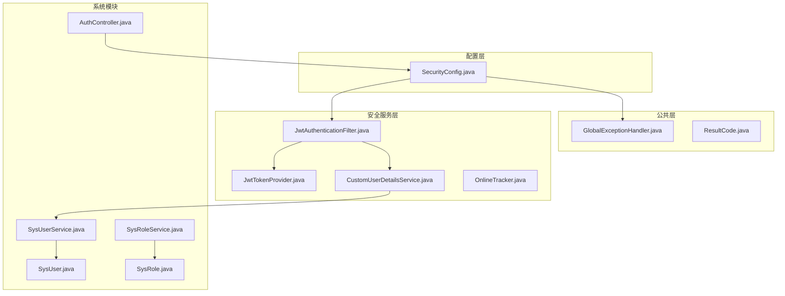
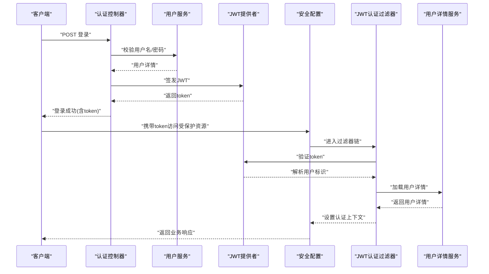
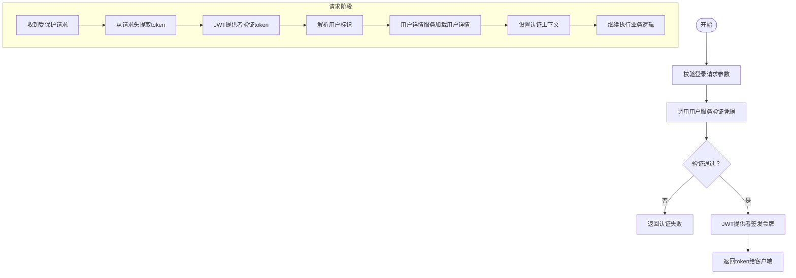
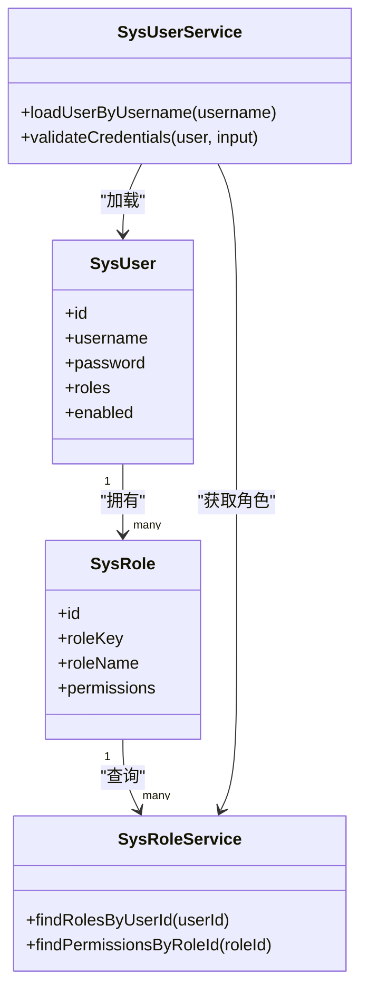
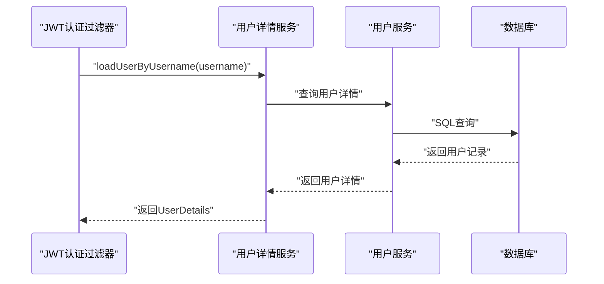
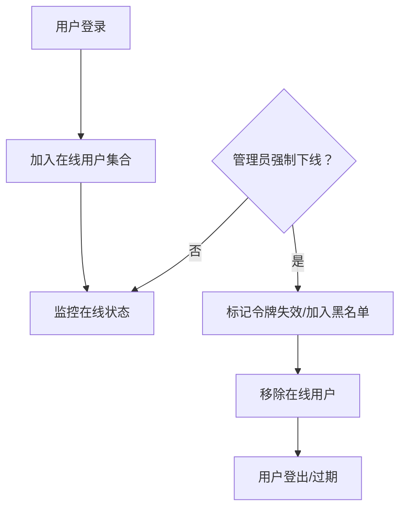
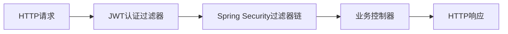
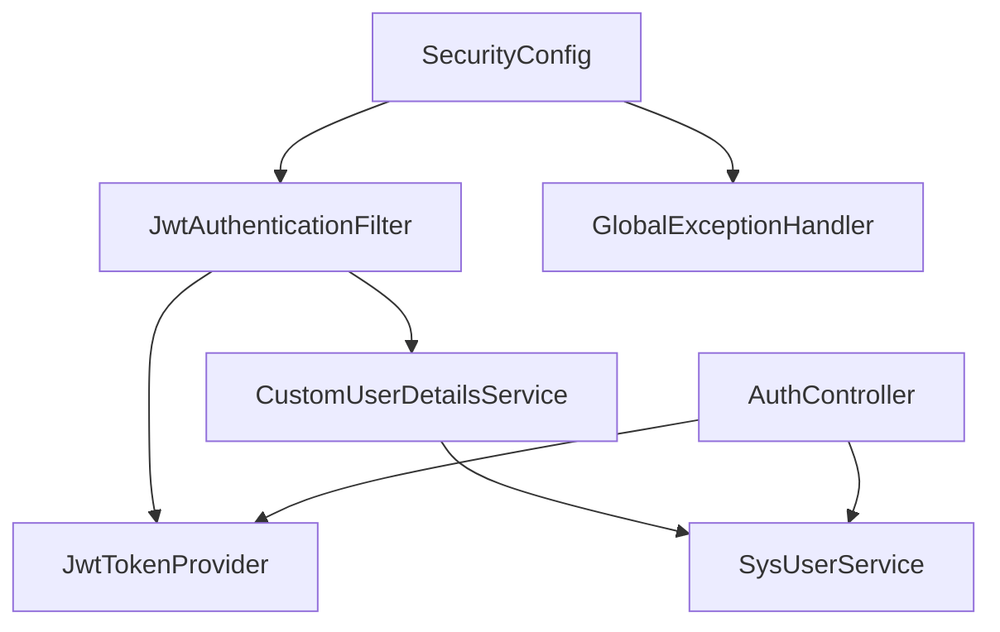

# 安全认证模块

<cite>
**本文引用的文件**
- [SecurityConfig.java](file://src/main/java/com/superpower/config/SecurityConfig.java)
- [JwtTokenProvider.java](file://src/main/java/com/superpower/security/JwtTokenProvider.java)
- [JwtAuthenticationFilter.java](file://src/main/java/com/superpower/security/JwtAuthenticationFilter.java)
- [CustomUserDetailsService.java](file://src/main/java/com/superpower/security/CustomUserDetailsService.java)
- [OnlineTracker.java](file://src/main/java/com/superpower/security/OnlineTracker.java)
- [AuthController.java](file://src/main/java/com/superpower/modules/system/controller/AuthController.java)
- [SysUserService.java](file://src/main/java/com/superpower/modules/system/service/SysUserService.java)
- [SysRoleService.java](file://src/main/java/com/superpower/modules/system/service/SysRoleService.java)
- [SysUser.java](file://src/main/java/com/superpower/modules/system/entity/SysUser.java)
- [SysRole.java](file://src/main/java/com/superpower/modules/system/entity/SysRole.java)
- [application.yml](file://src/main/resources/application.yml)
- [GlobalExceptionHandler.java](file://src/main/java/com/superpower/common/GlobalExceptionHandler.java)
- [ResultCode.java](file://src/main/java/com/superpower/common/ResultCode.java)
</cite>

## 目录
1. [引言](#引言)
2. [项目结构](#项目结构)
3. [核心组件](#核心组件)
4. [架构总览](#架构总览)
5. [详细组件分析](#详细组件分析)
6. [依赖关系分析](#依赖关系分析)
7. [性能考虑](#性能考虑)
8. [故障排除指南](#故障排除指南)
9. [结论](#结论)
10. [附录](#附录)

## 引言
本文件面向产品清单管理系统中的安全认证模块，系统性阐述基于JWT的无状态认证机制与权限控制体系。内容覆盖token生成、验证与刷新流程；用户权限模型（角色-资源-操作）与注解式访问控制；自定义用户详情服务的实现细节（用户信息加载、密码校验、账户状态管理）；在线用户跟踪与会话管理策略；安全过滤器链配置与异常处理机制。文档同时提供安全配置示例、最佳实践与常见问题的解决方案，帮助开发者在不牺牲安全性的情况下快速集成与扩展。

## 项目结构
安全相关代码主要分布在以下位置：
- 配置层：Spring Security与Web MVC的安全配置
- 安全服务层：JWT工具、认证过滤器、用户详情服务、在线跟踪
- 系统模块：认证控制器、用户与角色服务、用户与角色实体
- 公共层：全局异常处理、统一返回码

**图表来源**
- [SecurityConfig.java:1-200](file://src/main/java/com/superpower/config/SecurityConfig.java#L1-L200)
- [JwtTokenProvider.java:1-200](file://src/main/java/com/superpower/security/JwtTokenProvider.java#L1-L200)
- [JwtAuthenticationFilter.java:1-200](file://src/main/java/com/superpower/security/JwtAuthenticationFilter.java#L1-L200)
- [CustomUserDetailsService.java:1-200](file://src/main/java/com/superpower/security/CustomUserDetailsService.java#L1-L200)
- [OnlineTracker.java:1-200](file://src/main/java/com/superpower/security/OnlineTracker.java#L1-L200)
- [AuthController.java:1-200](file://src/main/java/com/superpower/modules/system/controller/AuthController.java#L1-L200)
- [SysUserService.java:1-200](file://src/main/java/com/superpower/modules/system/service/SysUserService.java#L1-L200)
- [SysRoleService.java:1-200](file://src/main/java/com/superpower/modules/system/service/SysRoleService.java#L1-L200)
- [SysUser.java:1-200](file://src/main/java/com/superpower/modules/system/entity/SysUser.java#L1-L200)
- [SysRole.java:1-200](file://src/main/java/com/superpower/modules/system/entity/SysRole.java#L1-L200)
- [GlobalExceptionHandler.java:1-200](file://src/main/java/com/superpower/common/GlobalExceptionHandler.java#L1-L200)
- [ResultCode.java:1-200](file://src/main/java/com/superpower/common/ResultCode.java#L1-L200)

**章节来源**
- [SecurityConfig.java:1-200](file://src/main/java/com/superpower/config/SecurityConfig.java#L1-L200)
- [application.yml:1-200](file://src/main/resources/application.yml#L1-L200)

## 核心组件
- JWT令牌提供者：负责生成、解析与验证JWT，包含签发时间、过期时间、签名算法等关键参数。
- 认证过滤器：拦截HTTP请求，从请求头或Cookie中提取令牌并进行校验，将认证上下文写入SecurityContext。
- 用户详情服务：实现Spring Security的UserDetailsService接口，按用户名加载用户详情、密码与账户状态，并构建认证主体。
- 在线跟踪器：维护在线用户集合，支持登录、登出、强制下线等操作，保障会话一致性。
- 系统认证控制器：提供登录、刷新、登出等端点，返回标准化结果。
- 权限服务与实体：用户与角色的业务服务与数据模型，支撑RBAC权限体系。
- 安全配置：定义Web安全规则、过滤器链、CORS、CSRF、会话管理等策略。
- 全局异常处理：对认证与授权相关异常进行统一处理，返回标准错误码与消息。

**章节来源**
- [JwtTokenProvider.java:1-200](file://src/main/java/com/superpower/security/JwtTokenProvider.java#L1-L200)
- [JwtAuthenticationFilter.java:1-200](file://src/main/java/com/superpower/security/JwtAuthenticationFilter.java#L1-L200)
- [CustomUserDetailsService.java:1-200](file://src/main/java/com/superpower/security/CustomUserDetailsService.java#L1-L200)
- [OnlineTracker.java:1-200](file://src/main/java/com/superpower/security/OnlineTracker.java#L1-L200)
- [AuthController.java:1-200](file://src/main/java/com/superpower/modules/system/controller/AuthController.java#L1-L200)
- [SysUserService.java:1-200](file://src/main/java/com/superpower/modules/system/service/SysUserService.java#L1-L200)
- [SysRoleService.java:1-200](file://src/main/java/com/superpower/modules/system/service/SysRoleService.java#L1-L200)
- [SysUser.java:1-200](file://src/main/java/com/superpower/modules/system/entity/SysUser.java#L1-L200)
- [SysRole.java:1-200](file://src/main/java/com/superpower/modules/system/entity/SysRole.java#L1-L200)
- [SecurityConfig.java:1-200](file://src/main/java/com/superpower/config/SecurityConfig.java#L1-L200)
- [GlobalExceptionHandler.java:1-200](file://src/main/java/com/superpower/common/GlobalExceptionHandler.java#L1-L200)
- [ResultCode.java:1-200](file://src/main/java/com/superpower/common/ResultCode.java#L1-L200)

## 架构总览
系统采用无状态JWT认证，通过自定义过滤器链完成请求拦截、令牌解析与权限校验。用户凭据经认证控制器验证后发放JWT，后续请求由过滤器自动校验令牌有效性并注入认证信息。

**图表来源**
- [AuthController.java:1-200](file://src/main/java/com/superpower/modules/system/controller/AuthController.java#L1-L200)
- [SysUserService.java:1-200](file://src/main/java/com/superpower/modules/system/service/SysUserService.java#L1-L200)
- [JwtTokenProvider.java:1-200](file://src/main/java/com/superpower/security/JwtTokenProvider.java#L1-L200)
- [SecurityConfig.java:1-200](file://src/main/java/com/superpower/config/SecurityConfig.java#L1-L200)
- [JwtAuthenticationFilter.java:1-200](file://src/main/java/com/superpower/security/JwtAuthenticationFilter.java#L1-L200)
- [CustomUserDetailsService.java:1-200](file://src/main/java/com/superpower/security/CustomUserDetailsService.java#L1-L200)

## 详细组件分析

### JWT无状态认证机制
- 令牌生成：认证控制器接收用户名/密码，调用用户服务验证后，使用JWT提供者生成包含用户标识、角色信息与过期时间的令牌。
- 令牌验证：JWT认证过滤器从请求头中提取令牌，调用JWT提供者进行签名验证与过期检查，解析出用户标识后委托用户详情服务加载用户详情，最终将认证信息写入SecurityContext。
- 刷新流程：系统提供刷新端点，接收旧令牌进行校验，若有效则签发新令牌，旧令牌作废或加入黑名单以防止重放。

**图表来源**
- [AuthController.java:1-200](file://src/main/java/com/superpower/modules/system/controller/AuthController.java#L1-L200)
- [JwtTokenProvider.java:1-200](file://src/main/java/com/superpower/security/JwtTokenProvider.java#L1-L200)
- [JwtAuthenticationFilter.java:1-200](file://src/main/java/com/superpower/security/JwtAuthenticationFilter.java#L1-L200)
- [CustomUserDetailsService.java:1-200](file://src/main/java/com/superpower/security/CustomUserDetailsService.java#L1-L200)

**章节来源**
- [AuthController.java:1-200](file://src/main/java/com/superpower/modules/system/controller/AuthController.java#L1-L200)
- [JwtTokenProvider.java:1-200](file://src/main/java/com/superpower/security/JwtTokenProvider.java#L1-L200)
- [JwtAuthenticationFilter.java:1-200](file://src/main/java/com/superpower/security/JwtAuthenticationFilter.java#L1-L200)
- [CustomUserDetailsService.java:1-200](file://src/main/java/com/superpower/security/CustomUserDetailsService.java#L1-L200)

### 用户权限管理体系
- 角色-权限模型：用户实体关联角色集合，角色实体包含权限集合，形成“用户→角色→权限”的层级关系。
- 注解式访问控制：通过Spring Security的注解（如@PreAuthorize、@PostAuthorize）在控制器或服务方法上声明访问条件，结合表达式语言实现基于角色或权限的细粒度控制。
- 资源访问控制：安全配置定义URL模式与访问规则，未满足权限要求的请求被拒绝。

**图表来源**
- [SysUser.java:1-200](file://src/main/java/com/superpower/modules/system/entity/SysUser.java#L1-L200)
- [SysRole.java:1-200](file://src/main/java/com/superpower/modules/system/entity/SysRole.java#L1-L200)
- [SysUserService.java:1-200](file://src/main/java/com/superpower/modules/system/service/SysUserService.java#L1-L200)
- [SysRoleService.java:1-200](file://src/main/java/com/superpower/modules/system/service/SysRoleService.java#L1-L200)

**章节来源**
- [SysUser.java:1-200](file://src/main/java/com/superpower/modules/system/entity/SysUser.java#L1-L200)
- [SysRole.java:1-200](file://src/main/java/com/superpower/modules/system/entity/SysRole.java#L1-L200)
- [SysUserService.java:1-200](file://src/main/java/com/superpower/modules/system/service/SysUserService.java#L1-L200)
- [SysRoleService.java:1-200](file://src/main/java/com/superpower/modules/system/service/SysRoleService.java#L1-L200)

### 自定义用户详情服务
- 用户信息加载：根据用户名查询用户详情，构建UserDetails对象，包含用户名、密码、权限列表与账户状态。
- 密码加密与校验：使用BCrypt等强哈希算法存储密码，登录时进行匹配校验。
- 账户状态管理：检查账户是否启用、未过期、未锁定，确保只有有效账户可登录。

**图表来源**
- [CustomUserDetailsService.java:1-200](file://src/main/java/com/superpower/security/CustomUserDetailsService.java#L1-L200)
- [SysUserService.java:1-200](file://src/main/java/com/superpower/modules/system/service/SysUserService.java#L1-L200)
- [SysUser.java:1-200](file://src/main/java/com/superpower/modules/system/entity/SysUser.java#L1-L200)

**章节来源**
- [CustomUserDetailsService.java:1-200](file://src/main/java/com/superpower/security/CustomUserDetailsService.java#L1-L200)
- [SysUserService.java:1-200](file://src/main/java/com/superpower/modules/system/service/SysUserService.java#L1-L200)
- [SysUser.java:1-200](file://src/main/java/com/superpower/modules/system/entity/SysUser.java#L1-L200)

### 在线用户跟踪与会话管理
- 在线跟踪：维护在线用户集合，记录登录时间、IP地址、设备信息等，支持查询在线用户与强制下线。
- 会话策略：采用无状态JWT，服务器不保存会话；通过黑名单或短期令牌降低风险。
- 强制下线：管理员可触发强制下线，使对应用户的令牌失效。

**图表来源**
- [OnlineTracker.java:1-200](file://src/main/java/com/superpower/security/OnlineTracker.java#L1-L200)
- [JwtTokenProvider.java:1-200](file://src/main/java/com/superpower/security/JwtTokenProvider.java#L1-L200)

**章节来源**
- [OnlineTracker.java:1-200](file://src/main/java/com/superpower/security/OnlineTracker.java#L1-L200)
- [JwtTokenProvider.java:1-200](file://src/main/java/com/superpower/security/JwtTokenProvider.java#L1-L200)

### 安全过滤器链配置
- 过滤器顺序：将JWT认证过滤器置于Spring Security内置过滤器之前，确保在进入业务前完成认证。
- 放行路径：开放登录、注册、健康检查等端点，其余路径均需认证。
- CORS与CSRF：配置跨域策略与CSRF防护（如为无状态JWT，通常关闭CSRF）。
- 会话管理：设置为STATELESS，避免服务器端会话。

**图表来源**
- [SecurityConfig.java:1-200](file://src/main/java/com/superpower/config/SecurityConfig.java#L1-L200)
- [JwtAuthenticationFilter.java:1-200](file://src/main/java/com/superpower/security/JwtAuthenticationFilter.java#L1-L200)

**章节来源**
- [SecurityConfig.java:1-200](file://src/main/java/com/superpower/config/SecurityConfig.java#L1-L200)
- [application.yml:1-200](file://src/main/resources/application.yml#L1-L200)

### 异常处理机制
- 全局异常处理：捕获认证与授权相关异常，返回统一的错误码与消息格式，便于前端展示与日志追踪。
- 错误码规范：定义认证失败、令牌无效、权限不足等标准错误码，保证前后端一致。

**章节来源**
- [GlobalExceptionHandler.java:1-200](file://src/main/java/com/superpower/common/GlobalExceptionHandler.java#L1-L200)
- [ResultCode.java:1-200](file://src/main/java/com/superpower/common/ResultCode.java#L1-L200)

## 依赖关系分析
- 组件耦合：认证过滤器依赖JWT提供者与用户详情服务；用户详情服务依赖用户服务；控制器依赖服务层；安全配置依赖过滤器与异常处理。
- 外部依赖：Spring Security、Spring MVC、JWT库、数据库访问层。
- 潜在循环依赖：当前结构通过服务层解耦，未见明显循环依赖。

**图表来源**
- [JwtAuthenticationFilter.java:1-200](file://src/main/java/com/superpower/security/JwtAuthenticationFilter.java#L1-L200)
- [JwtTokenProvider.java:1-200](file://src/main/java/com/superpower/security/JwtTokenProvider.java#L1-L200)
- [CustomUserDetailsService.java:1-200](file://src/main/java/com/superpower/security/CustomUserDetailsService.java#L1-L200)
- [SysUserService.java:1-200](file://src/main/java/com/superpower/modules/system/service/SysUserService.java#L1-L200)
- [AuthController.java:1-200](file://src/main/java/com/superpower/modules/system/controller/AuthController.java#L1-L200)
- [SecurityConfig.java:1-200](file://src/main/java/com/superpower/config/SecurityConfig.java#L1-L200)
- [GlobalExceptionHandler.java:1-200](file://src/main/java/com/superpower/common/GlobalExceptionHandler.java#L1-L200)

**章节来源**
- [JwtAuthenticationFilter.java:1-200](file://src/main/java/com/superpower/security/JwtAuthenticationFilter.java#L1-L200)
- [JwtTokenProvider.java:1-200](file://src/main/java/com/superpower/security/JwtTokenProvider.java#L1-L200)
- [CustomUserDetailsService.java:1-200](file://src/main/java/com/superpower/security/CustomUserDetailsService.java#L1-L200)
- [SysUserService.java:1-200](file://src/main/java/com/superpower/modules/system/service/SysUserService.java#L1-L200)
- [AuthController.java:1-200](file://src/main/java/com/superpower/modules/system/controller/AuthController.java#L1-L200)
- [SecurityConfig.java:1-200](file://src/main/java/com/superpower/config/SecurityConfig.java#L1-L200)
- [GlobalExceptionHandler.java:1-200](file://src/main/java/com/superpower/common/GlobalExceptionHandler.java#L1-L200)

## 性能考虑
- 令牌有效期：合理设置过期时间，平衡安全性与用户体验；短令牌配合刷新机制降低泄露风险。
- 压力测试：评估认证与授权在高并发下的延迟与吞吐；优化数据库索引与查询。
- 缓存策略：对用户权限与角色信息进行缓存，减少频繁查询数据库。
- 过滤器开销：避免在过滤器中执行耗时操作，将复杂逻辑下沉到服务层。

## 故障排除指南
- 认证失败：检查用户名/密码是否正确，确认用户状态正常；查看全局异常处理器返回的错误码。
- 令牌无效：确认请求头中携带了正确的令牌，检查签名算法与密钥配置；核对令牌是否过期。
- 权限不足：核对用户角色与目标资源的权限映射；检查注解式权限表达式是否正确。
- 在线用户异常：排查在线跟踪器的状态更新逻辑，确认强制下线是否生效。

**章节来源**
- [GlobalExceptionHandler.java:1-200](file://src/main/java/com/superpower/common/GlobalExceptionHandler.java#L1-L200)
- [ResultCode.java:1-200](file://src/main/java/com/superpower/common/ResultCode.java#L1-L200)
- [JwtTokenProvider.java:1-200](file://src/main/java/com/superpower/security/JwtTokenProvider.java#L1-L200)
- [OnlineTracker.java:1-200](file://src/main/java/com/superpower/security/OnlineTracker.java#L1-L200)

## 结论
本安全认证模块以JWT为核心，结合自定义用户详情服务与在线跟踪机制，实现了无状态、可扩展的认证与权限控制方案。通过清晰的过滤器链配置与统一异常处理，系统在保证安全性的同时具备良好的可维护性与可扩展性。建议在生产环境中进一步完善令牌黑名单、审计日志与速率限制等安全措施。

## 附录
- 安全配置示例要点
  - 开放端点：登录、注册、健康检查等无需认证。
  - 受保护端点：业务控制器默认需要认证。
  - CORS：允许前端域名访问。
  - CSRF：关闭（无状态JWT）。
  - 会话管理：STATELESS。
- 最佳实践
  - 使用HTTPS传输令牌。
  - 短令牌+刷新令牌策略。
  - 强密码策略与账户锁定机制。
  - 定期轮换JWT密钥。
  - 对敏感操作增加二次校验。
- 常见问题
  - 令牌泄露：及时撤销并引导重新登录。
  - 权限绕过：严格审查注解与URL规则。
  - 并发冲突：使用幂等设计与乐观锁。