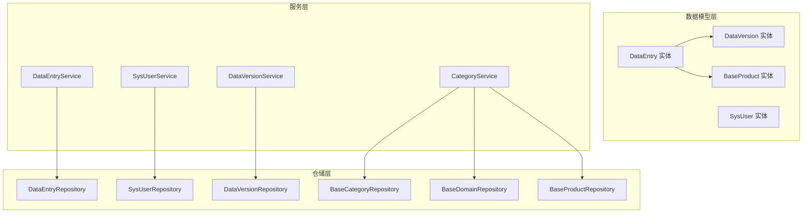
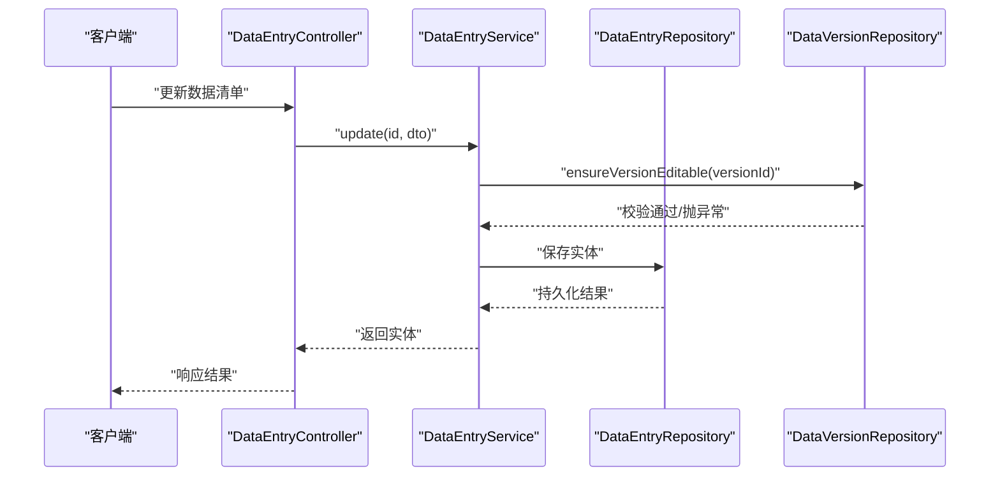
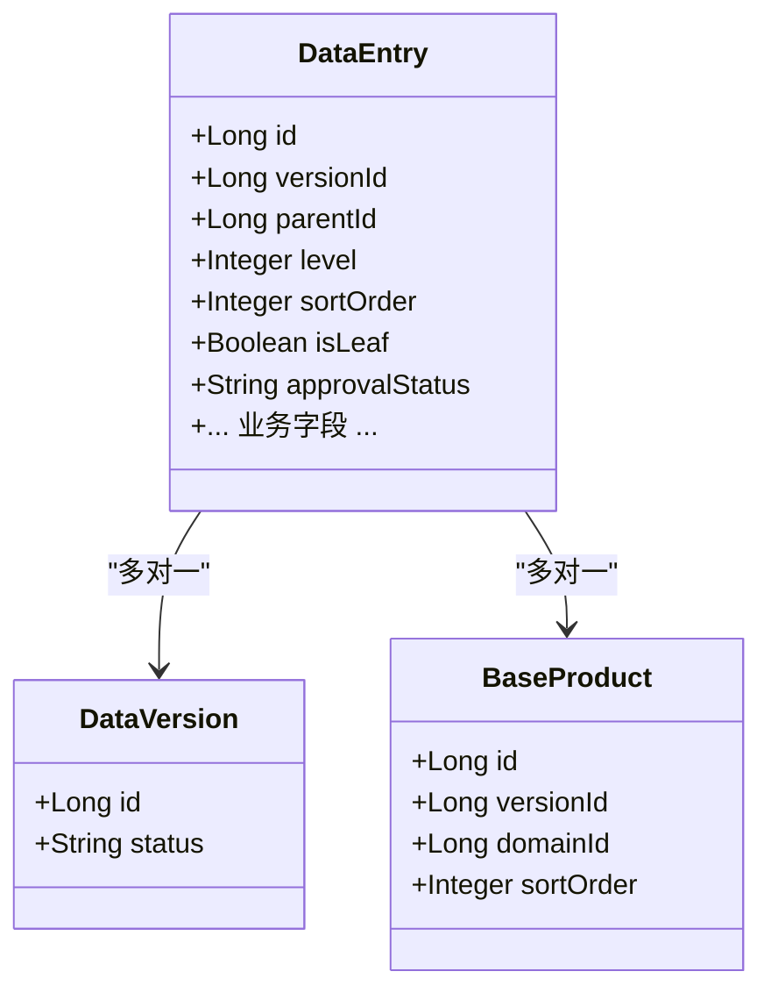
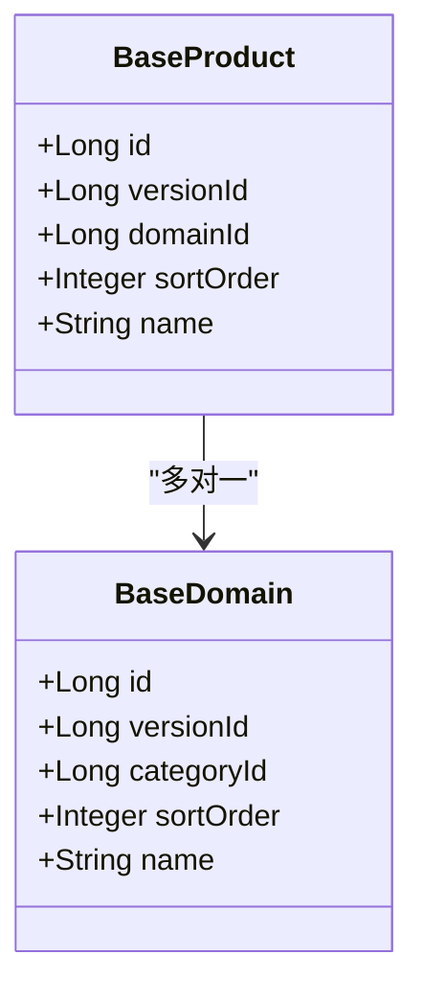
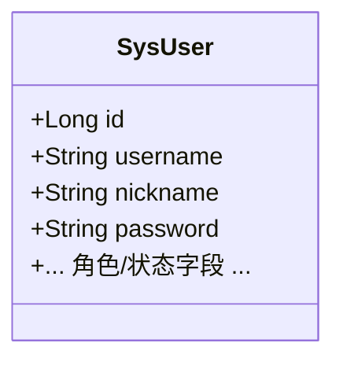
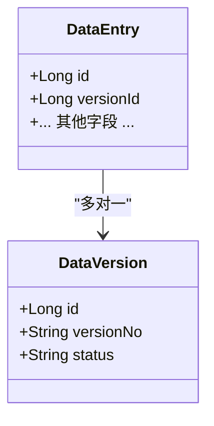
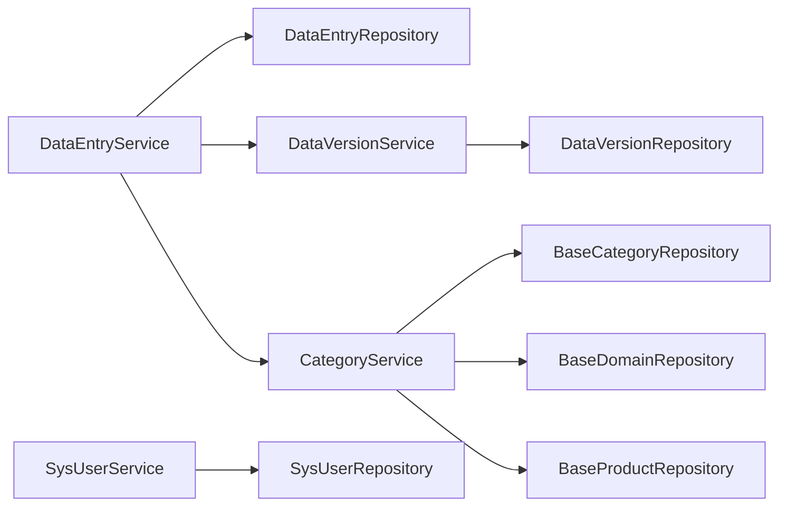

# 数据模型设计

<cite>
**本文引用的文件**
- [DataEntry.java](file://src/main/java/com/superpower/modules/data/entity/DataEntry.java)
- [BaseProduct.java](file://src/main/java/com/superpower/modules/category/entity/BaseProduct.java)
- [SysUser.java](file://src/main/java/com/superpower/modules/system/entity/SysUser.java)
- [DataVersion.java](file://src/main/java/com/superpower/modules/version/entity/DataVersion.java)
- [DataEntryService.java](file://src/main/java/com/superpower/modules/data/service/DataEntryService.java)
- [DataEntryController.java](file://src/main/java/com/superpower/modules/data/controller/DataEntryController.java)
- [CategoryService.java](file://src/main/java/com/superpower/modules/category/service/CategoryService.java)
- [MaintenanceService.java](file://src/main/java/com/superpower/modules/system/service/MaintenanceService.java)
- [DataEntryRepository.java](file://src/main/java/com/superpower/modules/data/repository/DataEntryRepository.java)
- [SysUserRepository.java](file://src/main/java/com/superpower/modules/system/repository/SysUserRepository.java)
- [DataVersionRepository.java](file://src/main/java/com/superpower/modules/version/repository/DataVersionRepository.java)
- [BaseCategoryRepository.java](file://src/main/java/com/superpower/modules/category/repository/BaseCategoryRepository.java)
- [BaseDomainRepository.java](file://src/main/java/com/superpower/modules/category/repository/BaseDomainRepository.java)
- [BaseProductRepository.java](file://src/main/java/com/superpower/modules/category/repository/BaseProductRepository.java)
- [DataEntrySummaryDTO.java](file://src/main/java/com/superpower/modules/data/dto/DataEntrySummaryDTO.java)
- [DataInitializer.java](file://src/main/java/com/superpower/modules/category/service/DataInitializer.java)
- [DataVersionService.java](file://src/main/java/com/superpower/modules/version/service/DataVersionService.java)
- [SysUserService.java](file://src/main/java/com/superpower/modules/system/service/SysUserService.java)
- [DocumentService.java](file://src/main/java/com/superpower/modules/document/service/DocumentService.java)
</cite>

## 目录
1. [简介](#简介)
2. [项目结构](#项目结构)
3. [核心组件](#核心组件)
4. [架构总览](#架构总览)
5. [详细组件分析](#详细组件分析)
6. [依赖分析](#依赖分析)
7. [性能考量](#性能考量)
8. [故障排查指南](#故障排查指南)
9. [结论](#结论)
10. [附录](#附录)

## 简介
本文件面向产品清单管理系统的核心数据模型，围绕 JPA 实体关系映射进行系统性技术说明。重点覆盖以下方面：
- 实体类定义与字段类型选择
- 关系配置（一对一、一对多、多对多）
- 外键约束与级联策略
- 数据验证规则、索引设计策略
- 查询优化与一致性保障机制
- 实体使用示例与最佳实践

本设计以 DataEntry 产品数据实体为核心，贯穿版本控制 DataVersion、产品层级结构 BaseProduct 及用户 SysUser，形成“版本-树形清单-基础分类/域/产品”的完整数据骨架。

## 项目结构
系统采用按功能域分层的模块化组织，数据模型相关代码主要集中在 data、category、system、version 等模块中，配合 DTO、Repository、Service、Controller 形成清晰的分层职责。

图表来源
- [DataEntry.java:12-266](file://src/main/java/com/superpower/modules/data/entity/DataEntry.java#L12-L266)
- [BaseProduct.java:7-38](file://src/main/java/com/superpower/modules/category/entity/BaseProduct.java#L7-L38)
- [SysUser.java:7-39](file://src/main/java/com/superpower/modules/system/entity/SysUser.java#L7-L39)
- [DataVersion.java:7-35](file://src/main/java/com/superpower/modules/version/entity/DataVersion.java#L7-L35)
- [DataEntryService.java:287-334](file://src/main/java/com/superpower/modules/data/service/DataEntryService.java#L287-L334)
- [CategoryService.java:115-135](file://src/main/java/com/superpower/modules/category/service/CategoryService.java#L115-L135)
- [SysUserService.java:33-40](file://src/main/java/com/superpower/modules/system/service/SysUserService.java#L33-L40)
- [DataVersionService.java:152-203](file://src/main/java/com/superpower/modules/version/service/DataVersionService.java#L152-L203)

章节来源
- [DataEntry.java:12-266](file://src/main/java/com/superpower/modules/data/entity/DataEntry.java#L12-L266)
- [BaseProduct.java:7-38](file://src/main/java/com/superpower/modules/category/entity/BaseProduct.java#L7-L38)
- [SysUser.java:7-39](file://src/main/java/com/superpower/modules/system/entity/SysUser.java#L7-L39)
- [DataVersion.java:7-35](file://src/main/java/com/superpower/modules/version/entity/DataVersion.java#L7-L35)

## 核心组件
本节聚焦四大核心实体及其关键属性与关系，解释字段类型选择、校验规则与业务含义。

- DataEntry（产品数据实体）
  - 版本标识：versionId（版本控制）
  - 层级结构：parentId、level、sortOrder（树形结构）
  - 业务标签：categoryId、domainId、productId（基础分类/域/产品）
  - 状态与审批：approvalStatus（审批状态）
  - 字段类型选择：整型用于排序与层级，字符串用于业务标签，时间戳用于审计
  - 关系：与 DataVersion（多对一）、与 BaseProduct（多对一）、与自身（父子关系）

- BaseProduct（产品层级结构）
  - L1/L2/L3 产品层级：通过 domainId、versionId 组织
  - 排序：sortOrder
  - 关系：与 BaseDomain（多对一）、与 DataVersion（多对一）

- SysUser（用户信息）
  - 用户名、昵称、角色等
  - 关系：与系统日志、操作记录等间接关联

- DataVersion（版本控制）
  - 版本号、状态（草稿/已发布/回滚）
  - 关系：与 DataEntry（一对多）

章节来源
- [DataEntry.java:12-266](file://src/main/java/com/superpower/modules/data/entity/DataEntry.java#L12-L266)
- [BaseProduct.java:7-38](file://src/main/java/com/superpower/modules/category/entity/BaseProduct.java#L7-L38)
- [SysUser.java:7-39](file://src/main/java/com/superpower/modules/system/entity/SysUser.java#L7-L39)
- [DataVersion.java:7-35](file://src/main/java/com/superpower/modules/version/entity/DataVersion.java#L7-L35)

## 架构总览
系统通过 Service 层协调 Repository 访问数据库，Controller 负责请求编排与权限校验。版本控制贯穿整个流程，确保在“草稿”状态下允许变更，在“已发布”状态下限制写操作。

图表来源
- [DataEntryController.java:153-166](file://src/main/java/com/superpower/modules/data/controller/DataEntryController.java#L153-L166)
- [DataEntryService.java:318-334](file://src/main/java/com/superpower/modules/data/service/DataEntryService.java#L318-L334)
- [DataEntryService.java:650-656](file://src/main/java/com/superpower/modules/data/service/DataEntryService.java#L650-L656)
- [DataVersionRepository.java](file://src/main/java/com/superpower/modules/version/repository/DataVersionRepository.java)

章节来源
- [DataEntryController.java:153-166](file://src/main/java/com/superpower/modules/data/controller/DataEntryController.java#L153-L166)
- [DataEntryService.java:318-334](file://src/main/java/com/superpower/modules/data/service/DataEntryService.java#L318-L334)
- [DataEntryService.java:650-656](file://src/main/java/com/superpower/modules/data/service/DataEntryService.java#L650-L656)

## 详细组件分析

### DataEntry 实体与树形结构
DataEntry 是系统的核心实体，承载产品清单的树形结构与业务字段。其关键点如下：
- 版本控制：versionId 决定数据归属版本，配合 DataVersion 状态控制写入权限
- 树形结构：parentId 指向父节点，level 表示层级，sortOrder 控制同级顺序
- 基础数据：categoryId/domainId/productId 对应基础分类/域/产品，支持跨表关联
- 审批状态：approvalStatus 用于流程控制
- 字段类型：整数型排序与层级、字符串型业务标签、时间戳型审计字段

图表来源
- [DataEntry.java:12-266](file://src/main/java/com/superpower/modules/data/entity/DataEntry.java#L12-L266)
- [DataVersion.java:7-35](file://src/main/java/com/superpower/modules/version/entity/DataVersion.java#L7-L35)
- [BaseProduct.java:7-38](file://src/main/java/com/superpower/modules/category/entity/BaseProduct.java#L7-L38)

章节来源
- [DataEntry.java:12-266](file://src/main/java/com/superpower/modules/data/entity/DataEntry.java#L12-L266)

### BaseProduct 产品层级结构
BaseProduct 代表 L3 产品，与 BaseDomain（L2）和 DataVersion（版本）建立多对一关系。排序字段 sortOrder 支持层级内排序。

图表来源
- [BaseProduct.java:7-38](file://src/main/java/com/superpower/modules/category/entity/BaseProduct.java#L7-L38)
- [CategoryService.java:166-201](file://src/main/java/com/superpower/modules/category/service/CategoryService.java#L166-L201)

章节来源
- [BaseProduct.java:7-38](file://src/main/java/com/superpower/modules/category/entity/BaseProduct.java#L7-L38)
- [CategoryService.java:166-201](file://src/main/java/com/superpower/modules/category/service/CategoryService.java#L166-L201)

### SysUser 用户信息
SysUser 存储用户基本信息，供权限与审计使用。典型字段包含用户名、昵称、角色等。

图表来源
- [SysUser.java:7-39](file://src/main/java/com/superpower/modules/system/entity/SysUser.java#L7-L39)

章节来源
- [SysUser.java:7-39](file://src/main/java/com/superpower/modules/system/entity/SysUser.java#L7-L39)

### DataVersion 版本控制
DataVersion 管理版本生命周期，状态包括草稿、已发布、回滚等。DataEntry 与之建立多对一关系，确保同一版本内的数据一致性。

图表来源
- [DataVersion.java:7-35](file://src/main/java/com/superpower/modules/version/entity/DataVersion.java#L7-L35)
- [DataEntry.java:12-266](file://src/main/java/com/superpower/modules/data/entity/DataEntry.java#L12-L266)

章节来源
- [DataVersion.java:7-35](file://src/main/java/com/superpower/modules/version/entity/DataVersion.java#L7-L35)
- [DataEntry.java:12-266](file://src/main/java/com/superpower/modules/data/entity/DataEntry.java#L12-L266)

### 关系与外键约束
- DataEntry.versionId → DataVersion.id（多对一）
- DataEntry.productId → BaseProduct.id（多对一）
- DataEntry.parentId → DataEntry.id（自关联，父子关系）
- BaseProduct.domainId → BaseDomain.id（多对一）
- BaseDomain.categoryId → BaseCategory.id（多对一）

级联策略建议：
- DataEntry 删除时，若存在子节点需先删除或迁移子节点，避免破坏树形完整性
- DataVersion 发布后禁止直接删除，应通过回滚或新建版本实现

章节来源
- [DataEntry.java:12-266](file://src/main/java/com/superpower/modules/data/entity/DataEntry.java#L12-L266)
- [BaseProduct.java:7-38](file://src/main/java/com/superpower/modules/category/entity/BaseProduct.java#L7-L38)

### 数据验证规则与一致性
- 版本状态校验：仅在“草稿”状态允许创建/更新/删除；“已发布”状态禁止排序与结构变更
- 层级与父子关系：level 与 parentId 必须匹配；排序字段 sortOrder 需保持唯一且连续
- 基础数据同步：当业务分类/域变更时，需同步更新对应基础表与清单项

章节来源
- [DataEntryService.java:650-656](file://src/main/java/com/superpower/modules/data/service/DataEntryService.java#L650-L656)
- [DataEntryService.java:422-475](file://src/main/java/com/superpower/modules/data/service/DataEntryService.java#L422-L475)

### 查询优化与索引设计策略
- 常用查询路径：
  - 按版本与层级查询：findByVersionIdAndLevel(...)
  - 按版本与父节点查询：findByVersionIdAndParentId(...)
  - 按版本与父节点排序查询：findByVersionIdAndParentIdOrderBySortOrder(...)
- 建议索引：
  - (versionId, level)
  - (versionId, parentId)
  - (versionId, parentId, sortOrder)
  - (versionId, level, parentId)
- DTO 映射：DataEntrySummaryDTO 提供轻量视图，减少传输与序列化开销

章节来源
- [DataEntryRepository.java](file://src/main/java/com/superpower/modules/data/repository/DataEntryRepository.java)
- [DataEntrySummaryDTO.java:65-121](file://src/main/java/com/superpower/modules/data/dto/DataEntrySummaryDTO.java#L65-L121)

### 实体使用示例与最佳实践
- 创建节点：确保版本处于“草稿”，计算排序值，设置 isLeaf 标记
- 移动节点：支持同级移动与上下移动，需更新兄弟节点排序
- 批量操作：批量删除前收集所有后代节点，统一处理
- 同步基础数据：当业务分类/域变更时，联动更新基础表与清单项

章节来源
- [DataEntryService.java:287-334](file://src/main/java/com/superpower/modules/data/service/DataEntryService.java#L287-L334)
- [DataEntryService.java:940-1016](file://src/main/java/com/superpower/modules/data/service/DataEntryService.java#L940-L1016)
- [DataEntryService.java:511-537](file://src/main/java/com/superpower/modules/data/service/DataEntryService.java#L511-L537)

## 依赖分析
Service 层依赖 Repository 进行数据访问，同时依赖其他模块的服务（如 SysUserService、DataVersionService）进行权限与版本控制。

图表来源
- [DataEntryService.java:287-334](file://src/main/java/com/superpower/modules/data/service/DataEntryService.java#L287-L334)
- [CategoryService.java:115-135](file://src/main/java/com/superpower/modules/category/service/CategoryService.java#L115-L135)
- [SysUserService.java:33-40](file://src/main/java/com/superpower/modules/system/service/SysUserService.java#L33-L40)
- [DataVersionService.java:152-203](file://src/main/java/com/superpower/modules/version/service/DataVersionService.java#L152-L203)

章节来源
- [DataEntryService.java:287-334](file://src/main/java/com/superpower/modules/data/service/DataEntryService.java#L287-L334)
- [CategoryService.java:115-135](file://src/main/java/com/superpower/modules/category/service/CategoryService.java#L115-L135)
- [SysUserService.java:33-40](file://src/main/java/com/superpower/modules/system/service/SysUserService.java#L33-L40)
- [DataVersionService.java:152-203](file://src/main/java/com/superpower/modules/version/service/DataVersionService.java#L152-L203)

## 性能考量
- 查询路径优化：优先使用复合索引（versionId, level/parentId/sortOrder），减少全表扫描
- 批量操作：批量删除/更新时采用分页与事务分段提交，避免长事务锁表
- DTO 轻量化：通过 DataEntrySummaryDTO 减少字段传输与 JSON 序列化成本
- 缓存策略：对只读的基础分类/域/产品数据可引入缓存，降低重复查询

## 故障排查指南
- 版本状态错误：当版本为“已发布”时仍尝试更新/删除，会触发业务异常
- 树形结构异常：移动节点导致排序错乱或父子关系断裂，需执行重排或修复流程
- 基础数据不同步：业务分类/域变更后未同步更新基础表或清单项，需运行同步逻辑

章节来源
- [DataEntryService.java:650-656](file://src/main/java/com/superpower/modules/data/service/DataEntryService.java#L650-L656)
- [DataEntryService.java:422-475](file://src/main/java/com/superpower/modules/data/service/DataEntryService.java#L422-L475)
- [MaintenanceService.java:589-620](file://src/main/java/com/superpower/modules/system/service/MaintenanceService.java#L589-L620)

## 结论
本数据模型以 DataEntry 为核心，结合 DataVersion 的版本控制与 BaseProduct 的产品层级，构建了稳定、可扩展的产品清单数据骨架。通过严格的版本状态校验、树形结构维护与基础数据同步机制，确保了数据一致性与可维护性。建议在生产环境中完善索引、缓存与批量处理策略，并持续监控版本发布流程与树形修复工具的使用频率。

## 附录
- 初始化流程：DataInitializer 在首次启动时创建基础分类/域/产品结构，确保系统具备初始数据
- 文档生成：DocumentService 基于 DataEntry 的树形结构生成 Word/Excel 报告，体现数据模型在报表场景的应用

章节来源
- [DataInitializer.java:44-89](file://src/main/java/com/superpower/modules/category/service/DataInitializer.java#L44-L89)
- [DocumentService.java:1425-1539](file://src/main/java/com/superpower/modules/document/service/DocumentService.java#L1425-L1539)