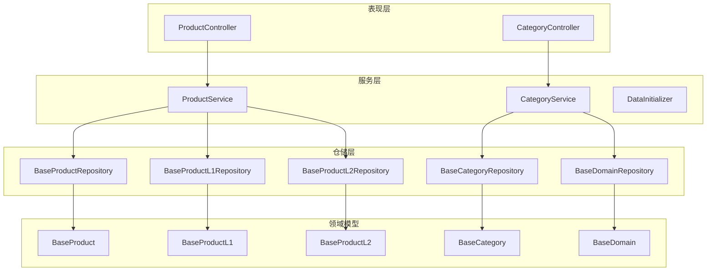
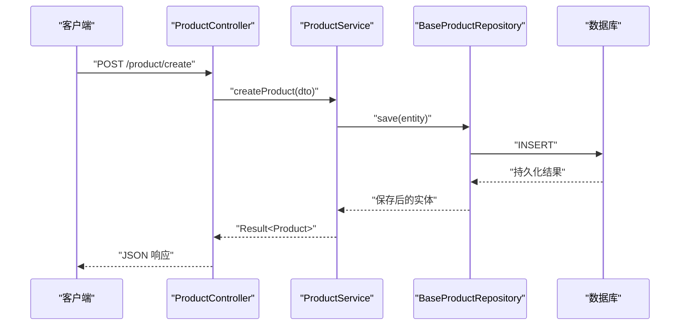
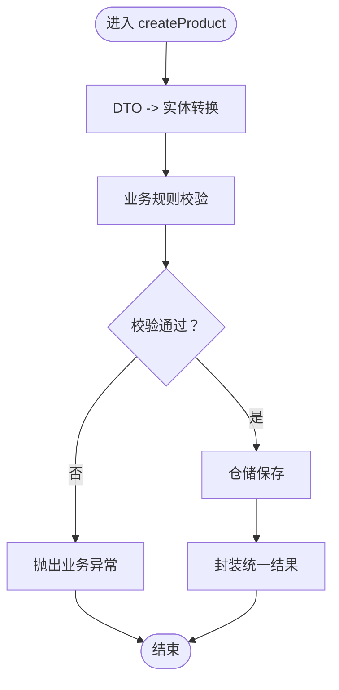
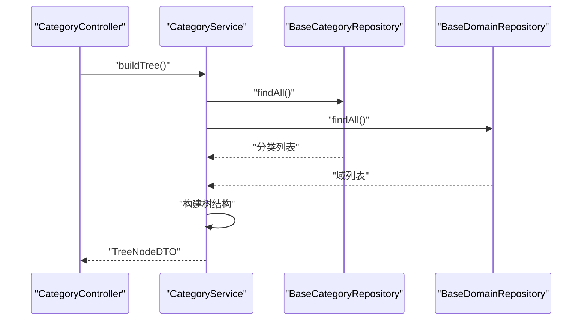

# 服务层设计

<cite>
**本文引用的文件**
- [CategoryService.java](file://src/main/java/com/superpower/modules/category/service/CategoryService.java)
- [ProductService.java](file://src/main/java/com/superpower/modules/category/service/ProductService.java)
- [DataInitializer.java](file://src/main/java/com/superpower/modules/category/service/DataInitializer.java)
- [BaseProductRepository.java](file://src/main/java/com/superpower/modules/category/repository/BaseProductRepository.java)
- [BaseProductL1Repository.java](file://src/main/java/com/superpower/modules/category/repository/BaseProductL1Repository.java)
- [BaseProductL2Repository.java](file://src/main/java/com/superpower/modules/category/repository/BaseProductL2Repository.java)
- [BaseCategoryRepository.java](file://src/main/java/com/superpower/modules/category/repository/BaseCategoryRepository.java)
- [BaseDomainRepository.java](file://src/main/java/com/superpower/modules/category/repository/BaseDomainRepository.java)
- [BaseProduct.java](file://src/main/java/com/superpower/modules/category/entity/BaseProduct.java)
- [BaseProductL1.java](file://src/main/java/com/superpower/modules/category/entity/BaseProductL1.java)
- [BaseProductL2.java](file://src/main/java/com/superpower/modules/category/entity/BaseProductL2.java)
- [BaseCategory.java](file://src/main/java/com/superpower/modules/category/entity/BaseCategory.java)
- [BaseDomain.java](file://src/main/java/com/superpower/modules/category/entity/BaseDomain.java)
- [BusinessException.java](file://src/main/java/com/superpower/common/BusinessException.java)
- [Result.java](file://src/main/java/com/superpower/common/Result.java)
- [PageResult.java](file://src/main/java/com/superpower/common/PageResult.java)
- [GlobalExceptionHandler.java](file://src/main/java/com/superpower/common/GlobalExceptionHandler.java)
- [ResultCode.java](file://src/main/java/com/superpower/common/ResultCode.java)
- [AsyncConfig.java](file://src/main/java/com/superpower/config/AsyncConfig.java)
- [WebMvcConfig.java](file://src/main/java/com/superpower/config/WebMvcConfig.java)
- [SqliteConfig.java](file://src/main/java/com/superpower/config/SqliteConfig.java)
- [SqliteDialect.java](file://src/main/java/com/superpower/config/SqliteDialect.java)
- [CategoryController.java](file://src/main/java/com/superpower/modules/category/controller/CategoryController.java)
- [ProductController.java](file://src/main/java/com/superpower/modules/category/controller/ProductController.java)
</cite>

## 目录
1. [引言](#引言)
2. [项目结构](#项目结构)
3. [核心组件](#核心组件)
4. [架构总览](#架构总览)
5. [详细组件分析](#详细组件分析)
6. [依赖关系分析](#依赖关系分析)
7. [性能考虑](#性能考虑)
8. [故障排查指南](#故障排查指南)
9. [结论](#结论)
10. [附录](#附录)

## 引言
本文件聚焦于产品清单管理系统的“服务层”设计，系统性阐述服务层在业务逻辑封装、事务管理、业务规则验证、数据转换与DTO使用、异常处理等方面的职责与实现要点。通过对产品分类与产品相关服务类的深入分析，结合仓储层交互模式、控制器接口契约以及通用异常与响应模型，形成一套可复用、可扩展且具备高内聚低耦合特征的服务层设计规范。

## 项目结构
服务层位于模块化分层中的第二层，位于controller与repository之间，承担业务编排、规则校验、数据转换与事务边界控制等职责。以产品分类与产品模块为例，服务层通过调用仓储层完成持久化操作，并向上游控制器返回标准化的响应对象。

图表来源
- [CategoryController.java](file://src/main/java/com/superpower/modules/category/controller/CategoryController.java)
- [ProductController.java](file://src/main/java/com/superpower/modules/category/controller/ProductController.java)
- [CategoryService.java](file://src/main/java/com/superpower/modules/category/service/CategoryService.java)
- [ProductService.java](file://src/main/java/com/superpower/modules/category/service/ProductService.java)
- [DataInitializer.java](file://src/main/java/com/superpower/modules/category/service/DataInitializer.java)
- [BaseProductRepository.java](file://src/main/java/com/superpower/modules/category/repository/BaseProductRepository.java)
- [BaseProductL1Repository.java](file://src/main/java/com/superpower/modules/category/repository/BaseProductL1Repository.java)
- [BaseProductL2Repository.java](file://src/main/java/com/superpower/modules/category/repository/BaseProductL2Repository.java)
- [BaseCategoryRepository.java](file://src/main/java/com/superpower/modules/category/repository/BaseCategoryRepository.java)
- [BaseDomainRepository.java](file://src/main/java/com/superpower/modules/category/repository/BaseDomainRepository.java)
- [BaseProduct.java](file://src/main/java/com/superpower/modules/category/entity/BaseProduct.java)
- [BaseProductL1.java](file://src/main/java/com/superpower/modules/category/entity/BaseProductL1.java)
- [BaseProductL2.java](file://src/main/java/com/superpower/modules/category/entity/BaseProductL2.java)
- [BaseCategory.java](file://src/main/java/com/superpower/modules/category/entity/BaseCategory.java)
- [BaseDomain.java](file://src/main/java/com/superpower/modules/category/entity/BaseDomain.java)

章节来源
- [CategoryController.java](file://src/main/java/com/superpower/modules/category/controller/CategoryController.java)
- [ProductController.java](file://src/main/java/com/superpower/modules/category/controller/ProductController.java)
- [CategoryService.java](file://src/main/java/com/superpower/modules/category/service/CategoryService.java)
- [ProductService.java](file://src/main/java/com/superpower/modules/category/service/ProductService.java)
- [DataInitializer.java](file://src/main/java/com/superpower/modules/category/service/DataInitializer.java)

## 核心组件
- 服务层统一采用“面向接口的业务编排”，通过注入仓储接口实现数据访问，避免直接依赖具体实现。
- 使用标准响应模型进行输出：成功时返回统一结果包装对象；失败时抛出业务异常或由全局异常处理器转换为统一错误响应。
- 事务边界通常以服务方法为单位，保证业务操作的原子性与一致性。
- DTO用于隔离领域模型与表现层，避免模型膨胀与跨层泄露。

章节来源
- [Result.java](file://src/main/java/com/superpower/common/Result.java)
- [PageResult.java](file://src/main/java/com/superpower/common/PageResult.java)
- [BusinessException.java](file://src/main/java/com/superpower/common/BusinessException.java)
- [GlobalExceptionHandler.java](file://src/main/java/com/superpower/common/GlobalExceptionHandler.java)

## 架构总览
服务层与仓储层的交互遵循“单仓储多实体”的设计，每个服务类根据业务场景组合多个仓储实例，完成复杂查询与写入。控制器仅负责参数接收与结果返回，不包含业务逻辑。

图表来源
- [ProductController.java](file://src/main/java/com/superpower/modules/category/controller/ProductController.java)
- [ProductService.java](file://src/main/java/com/superpower/modules/category/service/ProductService.java)
- [BaseProductRepository.java](file://src/main/java/com/superpower/modules/category/repository/BaseProductRepository.java)

## 详细组件分析

### 产品服务（ProductService）
- 职责边界
  - 提供产品实体的创建、更新、删除、查询与分页检索能力。
  - 在写入前执行业务规则校验（如唯一性、范围约束），在读取后进行必要的数据转换（如层级映射、统计聚合）。
- 关键方法与流程
  - 创建：接收DTO → 领域模型转换 → 规则校验 → 仓储保存 → 结果封装。
  - 更新：加载实体 → 合法性校验 → 字段变更 → 仓储更新 → 结果封装。
  - 删除：存在性校验 → 事务内删除 → 结果封装。
  - 查询：分页查询 → 映射DTO → 分页结果封装。
- 事务与并发
  - 写操作以服务方法为事务边界，确保一致性。
  - 对并发冲突采用乐观锁版本号或唯一索引约束，避免脏写。
- 数据转换与DTO
  - 将仓储返回的实体映射为DTO，隐藏内部字段与关联细节。
- 错误处理
  - 业务异常通过统一异常处理器转换为标准错误响应，避免泄漏内部异常信息。

图表来源
- [ProductService.java](file://src/main/java/com/superpower/modules/category/service/ProductService.java)
- [BaseProductRepository.java](file://src/main/java/com/superpower/modules/category/repository/BaseProductRepository.java)
- [BusinessException.java](file://src/main/java/com/superpower/common/BusinessException.java)
- [Result.java](file://src/main/java/com/superpower/common/Result.java)

章节来源
- [ProductService.java](file://src/main/java/com/superpower/modules/category/service/ProductService.java)
- [BaseProductRepository.java](file://src/main/java/com/superpower/modules/category/repository/BaseProductRepository.java)
- [BaseProduct.java](file://src/main/java/com/superpower/modules/category/entity/BaseProduct.java)

### 分类产品服务（CategoryService）
- 职责边界
  - 管理产品分类与域的层次结构，提供树形查询、层级构建与同步能力。
  - 维护分类与域的关联关系，支持批量初始化与迁移。
- 关键方法与流程
  - 树形查询：从仓储加载分类与域 → 构建树结构 → 返回DTO树。
  - 初始化：读取基础数据 → 批量写入仓储 → 事务提交。
  - 同步：对齐分类与域状态 → 保持一致性。
- 事务与并发
  - 初始化与同步作为批量事务，采用批量写入减少往返开销。
- 数据转换与DTO
  - 树节点DTO承载层级关系与展示字段，避免暴露底层实体细节。
- 错误处理
  - 通过业务异常与全局异常处理器保障错误一致化。

图表来源
- [CategoryController.java](file://src/main/java/com/superpower/modules/category/controller/CategoryController.java)
- [CategoryService.java](file://src/main/java/com/superpower/modules/category/service/CategoryService.java)
- [BaseCategoryRepository.java](file://src/main/java/com/superpower/modules/category/repository/BaseCategoryRepository.java)
- [BaseDomainRepository.java](file://src/main/java/com/superpower/modules/category/repository/BaseDomainRepository.java)

章节来源
- [CategoryService.java](file://src/main/java/com/superpower/modules/category/service/CategoryService.java)
- [BaseCategoryRepository.java](file://src/main/java/com/superpower/modules/category/repository/BaseCategoryRepository.java)
- [BaseDomainRepository.java](file://src/main/java/com/superpower/modules/category/repository/BaseDomainRepository.java)
- [BaseCategory.java](file://src/main/java/com/superpower/modules/category/entity/BaseCategory.java)
- [BaseDomain.java](file://src/main/java/com/superpower/modules/category/entity/BaseDomain.java)

### 数据初始化服务（DataInitializer）
- 职责边界
  - 在应用启动阶段或特定场景下，批量初始化基础数据（如分类、域、产品层级）。
  - 通过事务保证初始化过程的原子性与一致性。
- 关键方法与流程
  - 读取配置/脚本 → 解析基础数据 → 逐条校验与入库 → 批量提交。
- 并发与性能
  - 初始化通常在单实例启动时执行，避免并发竞争。
  - 使用批处理减少SQL往返，提升初始化效率。

章节来源
- [DataInitializer.java](file://src/main/java/com/superpower/modules/category/service/DataInitializer.java)

### 仓储层交互模式
- 单仓储多实体：服务层通过多个仓储接口访问不同实体表，实现按需组合。
- 事务边界：以服务方法为单位开启事务，确保业务操作的ACID特性。
- 查询与写入分离：读取使用只读查询，写入使用带事务的更新/插入。
- 批量处理：对批量导入/初始化场景，采用批量写入与分批提交策略。

章节来源
- [BaseProductRepository.java](file://src/main/java/com/superpower/modules/category/repository/BaseProductRepository.java)
- [BaseProductL1Repository.java](file://src/main/java/com/superpower/modules/category/repository/BaseProductL1Repository.java)
- [BaseProductL2Repository.java](file://src/main/java/com/superpower/modules/category/repository/BaseProductL2Repository.java)
- [BaseCategoryRepository.java](file://src/main/java/com/superpower/modules/category/repository/BaseCategoryRepository.java)
- [BaseDomainRepository.java](file://src/main/java/com/superpower/modules/category/repository/BaseDomainRepository.java)

### DTO使用与数据转换
- DTO隔离：控制器与仓储层之间通过DTO传递数据，避免领域模型泄露到表现层。
- 转换策略：服务层负责将实体映射为DTO，必要时进行字段裁剪、计算字段生成与层级组装。
- 树形结构：分类与域的树形展示通过DTO节点构建，便于前端渲染。

章节来源
- [CategoryService.java](file://src/main/java/com/superpower/modules/category/service/CategoryService.java)
- [ProductService.java](file://src/main/java/com/superpower/modules/category/service/ProductService.java)

### 业务异常处理策略
- 业务异常：服务层在规则校验失败时抛出业务异常，由全局异常处理器统一转换为标准错误响应。
- 错误码：使用统一错误码枚举，便于前后端约定与国际化。
- 响应模型：成功与失败均返回统一响应包装，简化前端处理。

章节来源
- [BusinessException.java](file://src/main/java/com/superpower/common/BusinessException.java)
- [GlobalExceptionHandler.java](file://src/main/java/com/superpower/common/GlobalExceptionHandler.java)
- [ResultCode.java](file://src/main/java/com/superpower/common/ResultCode.java)
- [Result.java](file://src/main/java/com/superpower/common/Result.java)
- [PageResult.java](file://src/main/java/com/superpower/common/PageResult.java)

## 依赖关系分析
服务层与仓储层之间为松耦合的依赖关系，通过接口编程降低耦合度。控制器仅依赖服务接口，服务层再依赖仓储接口，形成清晰的分层依赖链。

图表来源
- [CategoryController.java](file://src/main/java/com/superpower/modules/category/controller/CategoryController.java)
- [ProductController.java](file://src/main/java/com/superpower/modules/category/controller/ProductController.java)
- [CategoryService.java](file://src/main/java/com/superpower/modules/category/service/CategoryService.java)
- [ProductService.java](file://src/main/java/com/superpower/modules/category/service/ProductService.java)
- [BaseProductRepository.java](file://src/main/java/com/superpower/modules/category/repository/BaseProductRepository.java)
- [BaseCategoryRepository.java](file://src/main/java/com/superpower/modules/category/repository/BaseCategoryRepository.java)

章节来源
- [CategoryService.java](file://src/main/java/com/superpower/modules/category/service/CategoryService.java)
- [ProductService.java](file://src/main/java/com/superpower/modules/category/service/ProductService.java)
- [BaseProductRepository.java](file://src/main/java/com/superpower/modules/category/repository/BaseProductRepository.java)
- [BaseCategoryRepository.java](file://src/main/java/com/superpower/modules/category/repository/BaseCategoryRepository.java)

## 性能考虑
- 事务粒度：以服务方法为事务边界，避免过长事务占用资源；对批量写入采用分批提交。
- 查询优化：使用分页查询与投影查询，减少不必要的字段加载；对高频查询建立合适索引。
- DTO裁剪：仅映射必要字段，避免大对象传输与序列化开销。
- 缓存策略：对只读数据与热点数据引入缓存（如Redis），减少数据库压力；注意缓存失效策略与一致性。
- 异步处理：对耗时任务（如报表生成、批量导入）采用异步执行，配合进度反馈。
- 连接池与方言：合理配置数据库连接池与方言，确保SQLite在嵌入式场景下的稳定性。

章节来源
- [AsyncConfig.java](file://src/main/java/com/superpower/config/AsyncConfig.java)
- [WebMvcConfig.java](file://src/main/java/com/superpower/config/WebMvcConfig.java)
- [SqliteConfig.java](file://src/main/java/com/superpower/config/SqliteConfig.java)
- [SqliteDialect.java](file://src/main/java/com/superpower/config/SqliteDialect.java)

## 故障排查指南
- 事务回滚：确认服务方法是否正确声明事务；检查异常类型是否触发回滚。
- DTO映射：核对DTO字段与实体字段映射关系，避免空值或类型不匹配。
- 唯一性冲突：检查唯一索引与业务校验逻辑，避免重复提交导致异常。
- 全局异常：通过统一异常处理器定位异常原因，确保错误码与消息一致化。
- 日志与追踪：为关键业务路径添加日志，便于问题定位与审计。

章节来源
- [BusinessException.java](file://src/main/java/com/superpower/common/BusinessException.java)
- [GlobalExceptionHandler.java](file://src/main/java/com/superpower/common/GlobalExceptionHandler.java)
- [ResultCode.java](file://src/main/java/com/superpower/common/ResultCode.java)

## 结论
服务层通过明确的职责划分、严格的事务边界、规范的DTO转换与统一的异常处理，有效屏蔽了仓储层细节，提升了系统的可维护性与可扩展性。结合合理的性能优化与并发控制策略，能够满足产品清单管理系统的业务需求与性能要求。

## 附录
- 最佳实践
  - 以服务方法为事务边界，避免在服务层中混杂过多事务语义。
  - 使用DTO隔离领域模型，保持控制器与仓储层的解耦。
  - 对批量操作采用分批处理与进度反馈，提升用户体验。
  - 对高频只读数据引入缓存，结合失效策略保证一致性。
  - 通过全局异常处理器统一错误响应，提升系统一致性与可观测性。