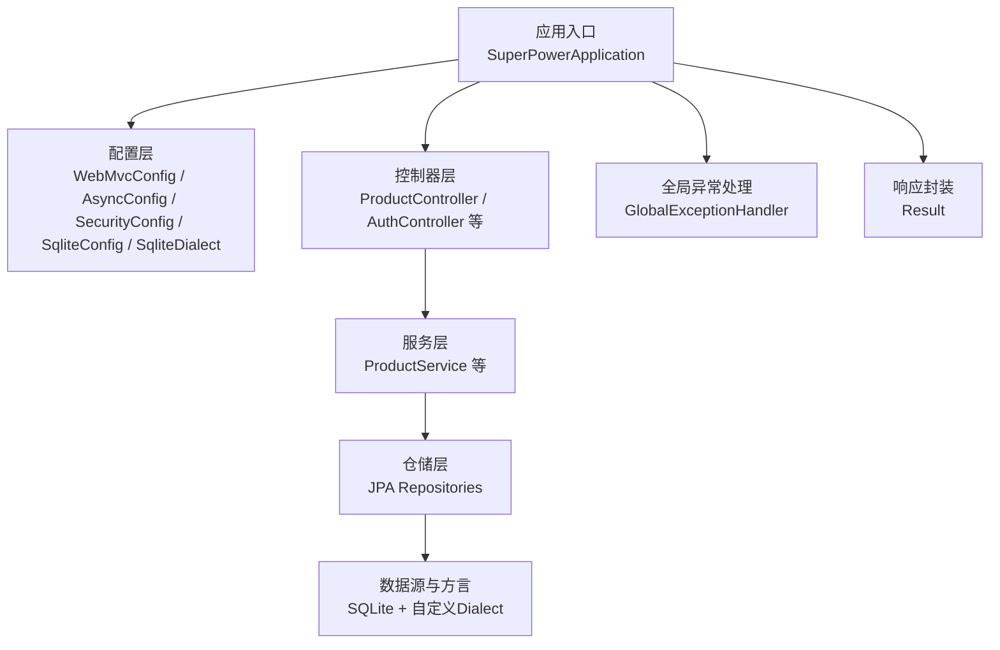
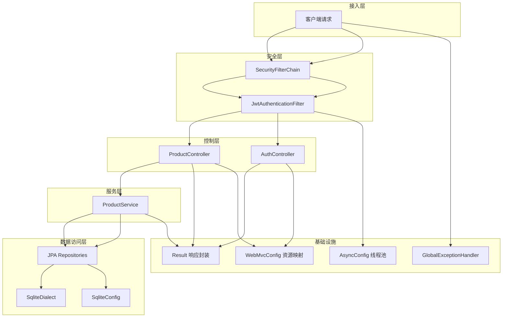
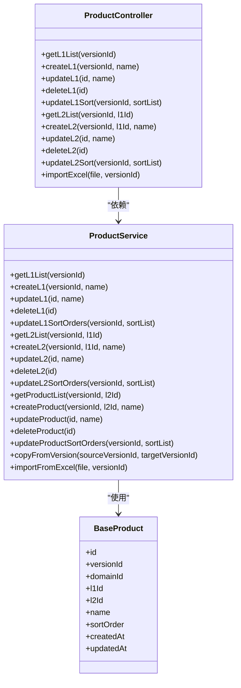
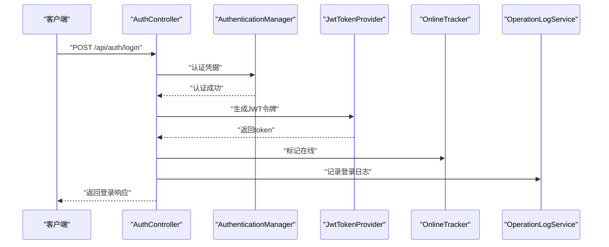
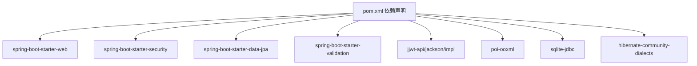

# 核心架构设计

<cite>
**本文引用的文件**
- [SuperPowerApplication.java](file://src/main/java/com/superpower/SuperPowerApplication.java)
- [application.yml](file://src/main/resources/application.yml)
- [pom.xml](file://pom.xml)
- [WebMvcConfig.java](file://src/main/java/com/superpower/config/WebMvcConfig.java)
- [AsyncConfig.java](file://src/main/java/com/superpower/config/AsyncConfig.java)
- [SecurityConfig.java](file://src/main/java/com/superpower/config/SecurityConfig.java)
- [SqliteConfig.java](file://src/main/java/com/superpower/config/SqliteConfig.java)
- [SqliteDialect.java](file://src/main/java/com/superpower/config/SqliteDialect.java)
- [GlobalExceptionHandler.java](file://src/main/java/com/superpower/common/GlobalExceptionHandler.java)
- [Result.java](file://src/main/java/com/superpower/common/Result.java)
- [BaseProduct.java](file://src/main/java/com/superpower/modules/category/entity/BaseProduct.java)
- [ProductService.java](file://src/main/java/com/superpower/modules/category/service/ProductService.java)
- [ProductController.java](file://src/main/java/com/superpower/modules/category/controller/ProductController.java)
- [JwtAuthenticationFilter.java](file://src/main/java/com/superpower/security/JwtAuthenticationFilter.java)
- [JwtTokenProvider.java](file://src/main/java/com/superpower/security/JwtTokenProvider.java)
- [AuthController.java](file://src/main/java/com/superpower/modules/system/controller/AuthController.java)
</cite>

## 目录
1. [引言](#引言)
2. [项目结构](#项目结构)
3. [核心组件](#核心组件)
4. [架构总览](#架构总览)
5. [详细组件分析](#详细组件分析)
6. [依赖分析](#依赖分析)
7. [性能考虑](#性能考虑)
8. [故障排查指南](#故障排查指南)
9. [结论](#结论)
10. [附录](#附录)

## 引言
本文件面向后端开发者，系统性阐述产品清单管理系统后端的核心架构与实现细节。内容覆盖应用启动配置、MVC与静态资源映射、异步任务配置、数据库与JPA/Hibernate配置、分层架构（Controller-Service-Repository）、依赖注入容器管理、RESTful路由与鉴权策略、跨域与静态资源处理、全局异常处理机制等。文档同时给出架构设计理念、技术选型理由、关键配置参数说明与最佳实践建议，帮助读者快速建立对系统的整体认知与落地实施能力。

## 项目结构
后端采用标准Spring Boot目录组织方式，核心代码位于 src/main/java 下，按模块化分包，包含通用工具、配置、安全、各业务模块（如category、system、data等）以及测试用例。资源配置集中在 src/main/resources/application.yml，并通过Maven进行依赖与构建管理。

图表来源
- [SuperPowerApplication.java:17-42](file://src/main/java/com/superpower/SuperPowerApplication.java#L17-L42)
- [WebMvcConfig.java:8-22](file://src/main/java/com/superpower/config/WebMvcConfig.java#L8-L22)
- [AsyncConfig.java:9-22](file://src/main/java/com/superpower/config/AsyncConfig.java#L9-L22)
- [SecurityConfig.java:17-56](file://src/main/java/com/superpower/config/SecurityConfig.java#L17-L56)
- [SqliteConfig.java:11-39](file://src/main/java/com/superpower/config/SqliteConfig.java#L11-L39)
- [SqliteDialect.java:5-9](file://src/main/java/com/superpower/config/SqliteDialect.java#L5-L9)
- [GlobalExceptionHandler.java:14-48](file://src/main/java/com/superpower/common/GlobalExceptionHandler.java#L14-L48)
- [Result.java:5-40](file://src/main/java/com/superpower/common/Result.java#L5-L40)

章节来源
- [SuperPowerApplication.java:17-42](file://src/main/java/com/superpower/SuperPowerApplication.java#L17-L42)
- [application.yml:1-40](file://src/main/resources/application.yml#L1-L40)
- [pom.xml:16-84](file://pom.xml#L16-L84)

## 核心组件
- 应用启动器：负责应用初始化、时区设置、基础数据初始化与启动执行。
- 配置层：统一管理MVC资源映射、异步线程池、安全过滤链、SQLite连接参数与方言。
- 控制器层：提供REST接口，遵循统一响应封装与权限控制。
- 服务层：封装业务逻辑，事务边界明确，支持Excel导入、复制版本、排序更新等。
- 仓储层：基于Spring Data JPA，自动派生查询方法，简化持久化操作。
- 安全层：基于JWT的无状态认证，集成自定义用户详情与在线追踪。
- 全局异常处理：集中捕获业务异常、验证异常、鉴权异常与通用异常，统一返回标准响应。

章节来源
- [SuperPowerApplication.java:35-80](file://src/main/java/com/superpower/SuperPowerApplication.java#L35-L80)
- [WebMvcConfig.java:11-21](file://src/main/java/com/superpower/config/WebMvcConfig.java#L11-L21)
- [AsyncConfig.java:12-21](file://src/main/java/com/superpower/config/AsyncConfig.java#L12-L21)
- [SecurityConfig.java:27-55](file://src/main/java/com/superpower/config/SecurityConfig.java#L27-L55)
- [SqliteConfig.java:21-38](file://src/main/java/com/superpower/config/SqliteConfig.java#L21-L38)
- [GlobalExceptionHandler.java:17-47](file://src/main/java/com/superpower/common/GlobalExceptionHandler.java#L17-L47)
- [Result.java:17-39](file://src/main/java/com/superpower/common/Result.java#L17-L39)

## 架构总览
系统采用分层架构与依赖注入容器管理，结合Spring Security实现无状态鉴权，使用Spring Data JPA访问SQLite数据库。请求从控制器进入，经由服务层处理业务，仓储层完成数据持久化；异常在全局处理器统一拦截并格式化输出；静态资源通过MVC配置映射至文件系统。

图表来源
- [SecurityConfig.java:27-44](file://src/main/java/com/superpower/config/SecurityConfig.java#L27-L44)
- [JwtAuthenticationFilter.java:32-48](file://src/main/java/com/superpower/security/JwtAuthenticationFilter.java#L32-L48)
- [ProductController.java:14-87](file://src/main/java/com/superpower/modules/category/controller/ProductController.java#L14-L87)
- [AuthController.java:22-97](file://src/main/java/com/superpower/modules/system/controller/AuthController.java#L22-97)
- [ProductService.java:22-356](file://src/main/java/com/superpower/modules/category/service/ProductService.java#L22-356)
- [SqliteDialect.java:5-9](file://src/main/java/com/superpower/config/SqliteDialect.java#L5-L9)
- [SqliteConfig.java:21-38](file://src/main/java/com/superpower/config/SqliteConfig.java#L21-L38)
- [AsyncConfig.java:12-21](file://src/main/java/com/superpower/config/AsyncConfig.java#L12-L21)
- [WebMvcConfig.java:14-21](file://src/main/java/com/superpower/config/WebMvcConfig.java#L14-L21)
- [GlobalExceptionHandler.java:14-48](file://src/main/java/com/superpower/common/GlobalExceptionHandler.java#L14-L48)
- [Result.java:5-40](file://src/main/java/com/superpower/common/Result.java#L5-L40)

## 详细组件分析

### 应用启动与初始化
- 启动类实现CommandLineRunner，在应用启动后检查角色、用户与版本数据是否已存在，若不存在则初始化默认数据，确保系统可直接运行。
- 设置默认时区为“亚洲/上海”，保证时间显示一致性。

章节来源
- [SuperPowerApplication.java:18-42](file://src/main/java/com/superpower/SuperPowerApplication.java#L18-L42)
- [SuperPowerApplication.java:35-38](file://src/main/java/com/superpower/SuperPowerApplication.java#L35-L38)
- [SuperPowerApplication.java:44-80](file://src/main/java/com/superpower/SuperPowerApplication.java#L44-L80)

### MVC与静态资源配置
- 通过WebMvcConfigurer注册静态资源映射，将特定URL前缀映射到文件系统路径，支持图片与需求文件的直读。
- 支持通过配置项动态指定存储根路径，默认指向本地目录。

章节来源
- [WebMvcConfig.java:14-21](file://src/main/java/com/superpower/config/WebMvcConfig.java#L14-L21)
- [application.yml:39](file://src/main/resources/application.yml#L39)

### 异步处理配置
- 使用@EnableAsync启用异步调用，配置单线程池（核心/最大均为1，队列容量10），线程名带前缀，便于调试与监控。
- 适用于低并发场景下的后台任务，避免阻塞主线程。

章节来源
- [AsyncConfig.java:10-22](file://src/main/java/com/superpower/config/AsyncConfig.java#L10-L22)

### 数据库与JPA/Hibernate配置
- 数据源：SQLite，JDBC驱动为sqlite-jdbc，Hikari连接池参数合理设置最大连接数、连接超时与泄漏检测阈值。
- JPA：自定义SQLite方言，Hibernate DDL策略为“update”，关闭OpenInView以降低会话泄露风险，SQL格式化开启便于调试。
- 初始化：启动时设置SQLite的journal_mode=WAL与busy_timeout，提升并发写入稳定性。

章节来源
- [application.yml:18-34](file://src/main/resources/application.yml#L18-L34)
- [SqliteDialect.java:5-9](file://src/main/java/com/superpower/config/SqliteDialect.java#L5-L9)
- [SqliteConfig.java:21-38](file://src/main/java/com/superpower/config/SqliteConfig.java#L21-L38)

### 安全与鉴权
- 无状态会话：禁用CSRF，Session策略为STATELESS。
- 路由授权：开放认证、版本查询、静态资源等接口；部分管理接口要求ADMIN角色；其余API需认证。
- JWT：自定义过滤器从Header或查询参数提取令牌，校验通过后将认证信息写入SecurityContext；集成在线追踪与操作日志记录。

章节来源
- [SecurityConfig.java:27-55](file://src/main/java/com/superpower/config/SecurityConfig.java#L27-L55)
- [JwtAuthenticationFilter.java:32-48](file://src/main/java/com/superpower/security/JwtAuthenticationFilter.java#L32-L48)
- [JwtTokenProvider.java:18-64](file://src/main/java/com/superpower/security/JwtTokenProvider.java#L18-L64)
- [AuthController.java:44-66](file://src/main/java/com/superpower/modules/system/controller/AuthController.java#L44-L66)

### 分层架构与依赖注入
- 控制器层：接收HTTP请求，调用服务层，返回Result封装的响应。
- 服务层：承载业务规则，声明式事务，协调多个仓储与外部组件。
- 仓储层：继承Spring Data JPA接口，自动实现常用CRUD与派生查询。
- 实体模型：使用注解定义表结构与字段约束，统一时间戳字段。

图表来源
- [ProductController.java:14-87](file://src/main/java/com/superpower/modules/category/controller/ProductController.java#L14-L87)
- [ProductService.java:22-356](file://src/main/java/com/superpower/modules/category/service/ProductService.java#L22-L356)
- [BaseProduct.java:10-38](file://src/main/java/com/superpower/modules/category/entity/BaseProduct.java#L10-L38)

章节来源
- [ProductController.java:14-87](file://src/main/java/com/superpower/modules/category/controller/ProductController.java#L14-L87)
- [ProductService.java:22-356](file://src/main/java/com/superpower/modules/category/service/ProductService.java#L22-L356)
- [BaseProduct.java:10-38](file://src/main/java/com/superpower/modules/category/entity/BaseProduct.java#L10-L38)

### RESTful API路由与统一响应
- 控制器通过@RequestMapping定义命名空间，各业务接口遵循REST风格，返回Result封装的统一响应对象。
- 对于批量排序、版本复制、Excel导入等复杂业务，服务层提供原子化事务保障与结果聚合。

章节来源
- [ProductController.java:14-87](file://src/main/java/com/superpower/modules/category/controller/ProductController.java#L14-L87)
- [Result.java:17-39](file://src/main/java/com/superpower/common/Result.java#L17-L39)

### 全局异常处理机制
- 集中处理业务异常、访问拒绝、认证异常、参数校验异常与通用异常，统一返回标准响应码与消息。
- 便于前端统一处理错误提示与状态码映射。

章节来源
- [GlobalExceptionHandler.java:17-47](file://src/main/java/com/superpower/common/GlobalExceptionHandler.java#L17-L47)

### 认证流程时序

图表来源
- [AuthController.java:44-66](file://src/main/java/com/superpower/modules/system/controller/AuthController.java#L44-L66)
- [JwtTokenProvider.java:25-35](file://src/main/java/com/superpower/security/JwtTokenProvider.java#L25-L35)

## 依赖分析
- 技术栈：Spring Boot 3.2 + Spring Security + Spring Data JPA + SQLite + jjwt + Apache POI。
- Maven依赖管理清晰，关键组件通过starter引入，数据库访问通过sqlite-jdbc与自定义方言适配。
- 运行时参数：服务器端口、Tomcat连接超时、日志级别、上传文件大小限制、JWT密钥与过期时间、文档存储路径等。

图表来源
- [pom.xml:21-83](file://pom.xml#L21-L83)

章节来源
- [pom.xml:16-84](file://pom.xml#L16-L84)
- [application.yml:1-40](file://src/main/resources/application.yml#L1-L40)

## 性能考虑
- 数据库层面：SQLite采用WAL模式与合理的busy_timeout，适合中小规模并发写入；连接池最大连接数较小，适合单机部署与低并发场景。
- 事务边界：服务层对变更操作使用@Transactional，避免脏读与不一致；批量排序与版本复制在单事务内完成，减少中间态。
- 异步任务：当前线程池为单线程，适合轻量异步任务；若后续需要提升吞吐，可评估调整核心/最大线程数与队列容量。
- 静态资源：通过文件系统直读，避免额外序列化开销；建议生产环境配合CDN与缓存头优化。

## 故障排查指南
- 认证失败：检查请求头Authorization或查询参数access_token是否正确传递；确认JWT密钥与过期时间配置一致。
- 权限不足：确认用户角色与受保护接口的权限匹配；检查SecurityFilterChain中的放行规则。
- 参数校验失败：关注全局异常中对MethodArgumentNotValidException的处理，查看字段错误集合。
- 文件上传失败：检查multipart大小限制与磁盘空间；确认静态资源映射路径与文件实际位置一致。
- 数据库连接问题：核对SQLite数据库文件路径、WAL与busy_timeout设置；观察连接池超时与泄漏阈值。

章节来源
- [SecurityConfig.java:32-41](file://src/main/java/com/superpower/config/SecurityConfig.java#L32-L41)
- [GlobalExceptionHandler.java:34-40](file://src/main/java/com/superpower/common/GlobalExceptionHandler.java#L34-L40)
- [application.yml:13-15](file://src/main/resources/application.yml#L13-L15)
- [WebMvcConfig.java:14-21](file://src/main/java/com/superpower/config/WebMvcConfig.java#L14-L21)
- [SqliteConfig.java:25-34](file://src/main/java/com/superpower/config/SqliteConfig.java#L25-L34)

## 结论
本系统以Spring Boot为核心，采用清晰的分层架构与依赖注入容器管理，结合无状态JWT鉴权与统一响应封装，实现了产品清单管理的后端核心能力。通过SQLite+WAL与JPA/Hibernate的组合满足中小规模数据持久化需求；通过全局异常处理与静态资源映射提升开发与运维效率。建议在后续演进中根据业务并发与数据体量，逐步引入缓存、分库分表与异步任务池扩容等方案。

## 附录
- 关键配置参数说明
  - 服务器端口与连接超时：用于控制接入层性能与稳定性。
  - 日志级别：便于开发与生产环境的差异化诊断。
  - 上传文件大小：限制请求体大小，防止内存溢出。
  - 数据源与连接池：控制数据库连接数量与超时行为。
  - JPA与Hibernate：控制DDL策略、SQL输出与OpenInView行为。
  - JWT：密钥与过期时间，决定令牌安全性与时效性。
  - 文档存储路径：用于生成文档的落盘路径。

章节来源
- [application.yml:1-40](file://src/main/resources/application.yml#L1-L40)