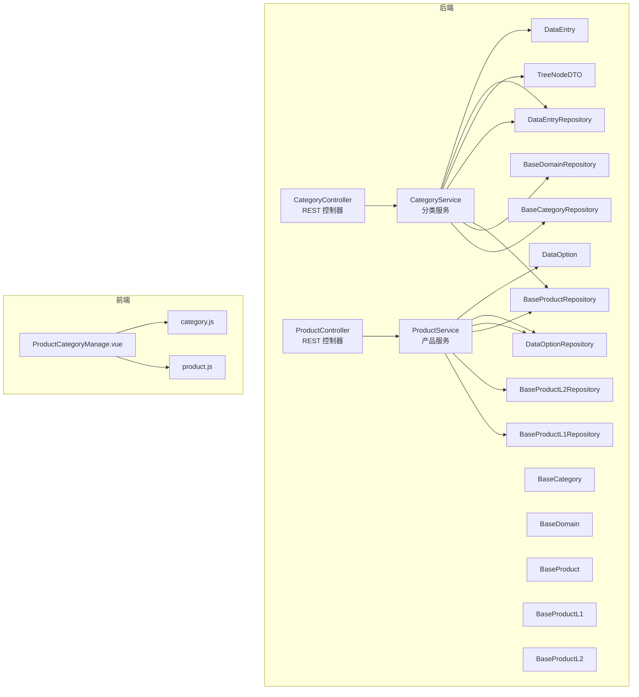
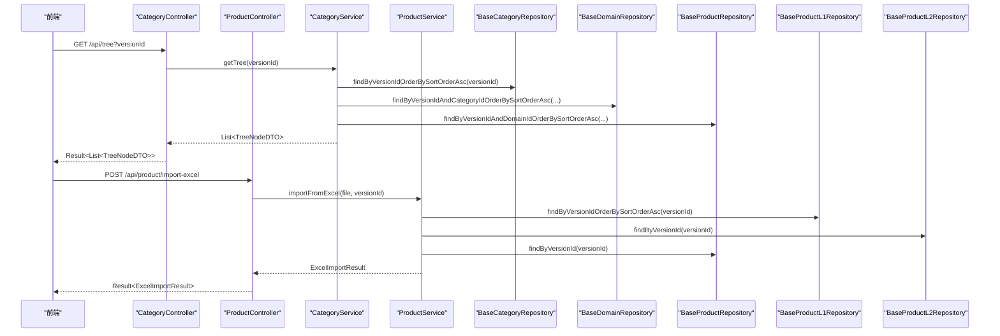
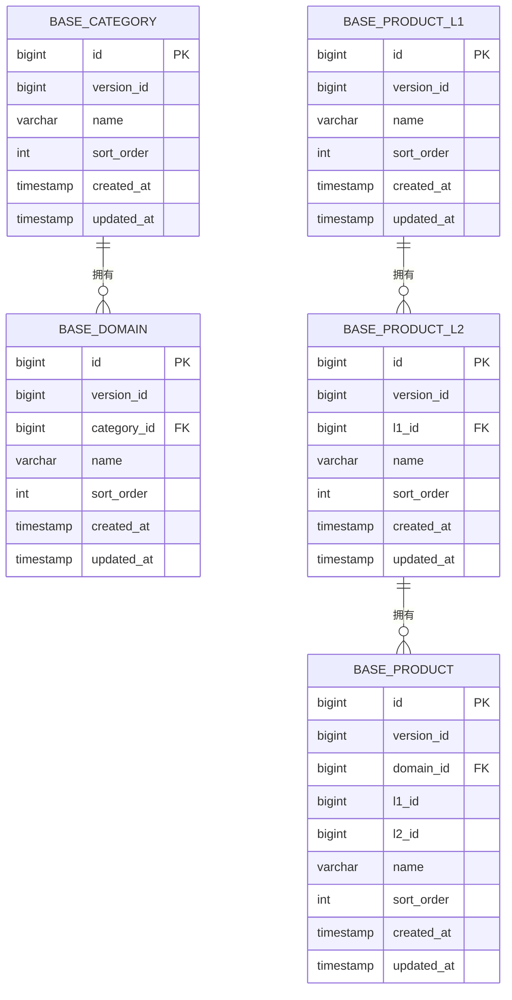
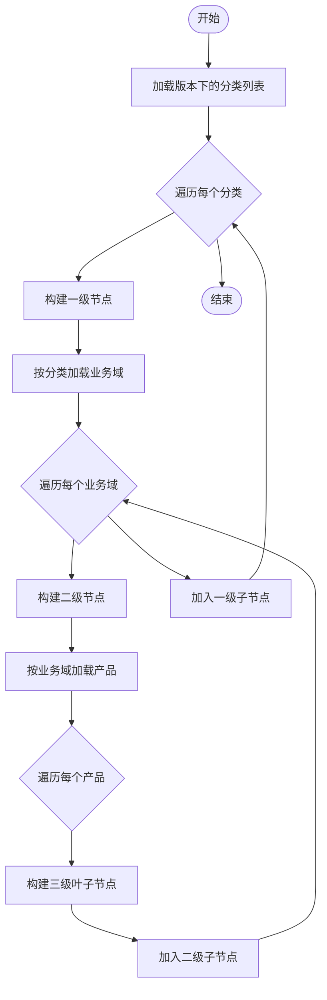
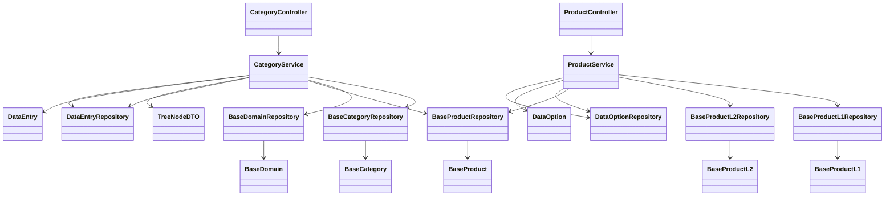

# 产品分类模块

<cite>
**本文引用的文件**
- [CategoryController.java](file://src/main/java/com/superpower/modules/category/controller/CategoryController.java)
- [ProductController.java](file://src/main/java/com/superpower/modules/category/controller/ProductController.java)
- [CategoryService.java](file://src/main/java/com/superpower/modules/category/service/CategoryService.java)
- [ProductService.java](file://src/main/java/com/superpower/modules/category/service/ProductService.java)
- [BaseCategory.java](file://src/main/java/com/superpower/modules/category/entity/BaseCategory.java)
- [BaseDomain.java](file://src/main/java/com/superpower/modules/category/entity/BaseDomain.java)
- [BaseProduct.java](file://src/main/java/com/superpower/modules/category/entity/BaseProduct.java)
- [BaseProductL1.java](file://src/main/java/com/superpower/modules/category/entity/BaseProductL1.java)
- [BaseProductL2.java](file://src/main/java/com/superpower/modules/category/entity/BaseProductL2.java)
- [BaseCategoryRepository.java](file://src/main/java/com/superpower/modules/category/repository/BaseCategoryRepository.java)
- [BaseDomainRepository.java](file://src/main/java/com/superpower/modules/category/repository/BaseDomainRepository.java)
- [BaseProductRepository.java](file://src/main/java/com/superpower/modules/category/repository/BaseProductRepository.java)
- [BaseProductL1Repository.java](file://src/main/java/com/superpower/modules/category/repository/BaseProductL1Repository.java)
- [BaseProductL2Repository.java](file://src/main/java/com/superpower/modules/category/repository/BaseProductL2Repository.java)
- [TreeNodeDTO.java](file://src/main/java/com/superpower/modules/data/dto/TreeNodeDTO.java)
- [DataEntryRepository.java](file://src/main/java/com/superpower/modules/data/repository/DataEntryRepository.java)
- [DataEntry.java](file://src/main/java/com/superpower/modules/data/entity/DataEntry.java)
- [DataOptionRepository.java](file://src/main/java/com/superpower/modules/option/repository/DataOptionRepository.java)
- [DataOption.java](file://src/main/java/com/superpower/modules/option/entity/DataOption.java)
- [ExcelImportResult.java](file://src/main/java/com/superpower/modules/data/dto/ExcelImportResult.java)
- [ProductCategoryManage.vue](file://frontend/src/views/system/ProductCategoryManage.vue)
- [category.js](file://frontend/src/api/category.js)
- [product.js](file://frontend/src/api/product.js)
</cite>

## 目录
1. [简介](#简介)
2. [项目结构](#项目结构)
3. [核心组件](#核心组件)
4. [架构总览](#架构总览)
5. [详细组件分析](#详细组件分析)
6. [依赖分析](#依赖分析)
7. [性能考虑](#性能考虑)
8. [故障排查指南](#故障排查指南)
9. [结论](#结论)
10. [附录](#附录)

## 简介
本技术文档围绕产品分类模块展开，系统性解析 L1/L2/L3 层级的产品分类体系与继承关系，深入说明分类服务与产品服务的实现机制，覆盖树形结构构建、层级查询、排序与复制迁移、Excel 批量导入等能力，并给出 RESTful 控制器接口设计、数据模型与父子关系维护策略、树形查询算法及性能优化建议。文档同时提供最佳实践与扩展指南，帮助开发者在保证一致性与可维护性的前提下进行二次开发。

## 项目结构
产品分类模块位于后端 Spring Boot 工程的 category 包内，采用分层架构：控制器层负责对外暴露 RESTful 接口；服务层封装业务逻辑；仓储层通过 JPA 访问数据库；实体层定义数据模型。前端使用 Vue 组件与 API 模块对接，提供可视化的产品分类管理界面。



图表来源
- [CategoryController.java:1-66](file://src/main/java/com/superpower/modules/category/controller/CategoryController.java#L1-L66)
- [ProductController.java:1-88](file://src/main/java/com/superpower/modules/category/controller/ProductController.java#L1-L88)
- [CategoryService.java:1-273](file://src/main/java/com/superpower/modules/category/service/CategoryService.java#L1-L273)
- [ProductService.java:1-356](file://src/main/java/com/superpower/modules/category/service/ProductService.java#L1-L356)
- [BaseCategoryRepository.java:1-21](file://src/main/java/com/superpower/modules/category/repository/BaseCategoryRepository.java#L1-L21)
- [BaseDomainRepository.java:1-22](file://src/main/java/com/superpower/modules/category/repository/BaseDomainRepository.java#L1-L22)
- [BaseProductRepository.java:1-22](file://src/main/java/com/superpower/modules/category/repository/BaseProductRepository.java#L1-L22)
- [BaseProductL1Repository.java:1-21](file://src/main/java/com/superpower/modules/category/repository/BaseProductL1Repository.java#L1-L21)
- [BaseProductL2Repository.java:1-22](file://src/main/java/com/superpower/modules/category/repository/BaseProductL2Repository.java#L1-L22)
- [TreeNodeDTO.java](file://src/main/java/com/superpower/modules/data/dto/TreeNodeDTO.java)
- [DataEntryRepository.java](file://src/main/java/com/superpower/modules/data/repository/DataEntryRepository.java)
- [DataEntry.java](file://src/main/java/com/superpower/modules/data/entity/DataEntry.java)
- [DataOptionRepository.java](file://src/main/java/com/superpower/modules/option/repository/DataOptionRepository.java)
- [DataOption.java](file://src/main/java/com/superpower/modules/option/entity/DataOption.java)

章节来源
- [CategoryController.java:1-66](file://src/main/java/com/superpower/modules/category/controller/CategoryController.java#L1-L66)
- [ProductController.java:1-88](file://src/main/java/com/superpower/modules/category/controller/ProductController.java#L1-L88)

## 核心组件
- 控制器层：提供 RESTful 接口，分别处理分类与产品层级的增删改查、排序与 Excel 导入。
- 服务层：实现树形结构构建、层级校验、排序更新、复制迁移、Excel 解析与写入。
- 实体与仓储：定义 L1/L2/L3 与业务域、产品分类的实体模型与查询方法。
- 前端视图与 API：提供可视化管理界面与前后端交互。

章节来源
- [CategoryService.java:1-273](file://src/main/java/com/superpower/modules/category/service/CategoryService.java#L1-L273)
- [ProductService.java:1-356](file://src/main/java/com/superpower/modules/category/service/ProductService.java#L1-L356)

## 架构总览
产品分类模块遵循经典的三层架构，控制器负责请求路由与参数校验，服务层封装业务规则与事务控制，仓储层抽象数据访问。树形结构由分类服务统一构建，产品服务独立维护统计分类（L1/L2）与核心业务产品（L3）。服务层与前端通过 DTO 进行数据传输，确保接口稳定与安全。



图表来源
- [CategoryController.java:23-26](file://src/main/java/com/superpower/modules/category/controller/CategoryController.java#L23-L26)
- [ProductController.java:81-86](file://src/main/java/com/superpower/modules/category/controller/ProductController.java#L81-L86)
- [CategoryService.java:36-78](file://src/main/java/com/superpower/modules/category/service/CategoryService.java#L36-L78)
- [ProductService.java:235-348](file://src/main/java/com/superpower/modules/category/service/ProductService.java#L235-L348)

## 详细组件分析

### 数据模型与层级关系
- L1 统计分类：用于宏观统计维度（如“统计分类”）。
- L2 核心业务方向：承接 L1 的细分方向（如“核心业务产品”）。
- L3 核心业务产品：具体的产品项，挂靠在 L2 下。
- 业务域（Domain）：独立于 L1/L2/L3 的另一个维度，与版本绑定，支持多层级产品树构建。
- 产品分类实体包含版本标识、名称、排序字段与时间戳，便于按版本隔离与排序展示。



图表来源
- [BaseCategory.java:1-30](file://src/main/java/com/superpower/modules/category/entity/BaseCategory.java#L1-L30)
- [BaseDomain.java:1-33](file://src/main/java/com/superpower/modules/category/entity/BaseDomain.java#L1-L33)
- [BaseProductL1.java:1-30](file://src/main/java/com/superpower/modules/category/entity/BaseProductL1.java#L1-L30)
- [BaseProductL2.java:1-33](file://src/main/java/com/superpower/modules/category/entity/BaseProductL2.java#L1-L33)
- [BaseProduct.java:1-39](file://src/main/java/com/superpower/modules/category/entity/BaseProduct.java#L1-L39)

章节来源
- [BaseCategory.java:1-30](file://src/main/java/com/superpower/modules/category/entity/BaseCategory.java#L1-L30)
- [BaseDomain.java:1-33](file://src/main/java/com/superpower/modules/category/entity/BaseDomain.java#L1-L33)
- [BaseProductL1.java:1-30](file://src/main/java/com/superpower/modules/category/entity/BaseProductL1.java#L1-L30)
- [BaseProductL2.java:1-33](file://src/main/java/com/superpower/modules/category/entity/BaseProductL2.java#L1-L33)
- [BaseProduct.java:1-39](file://src/main/java/com/superpower/modules/category/entity/BaseProduct.java#L1-L39)

### 分类服务（CategoryService）
- 树形构建：按版本加载分类、业务域与产品，组装为三级树结构，节点包含层级、标签、排序与是否叶子节点标记。
- 排序更新：支持对分类、业务域与产品的排序进行批量更新。
- CRUD 操作：提供分类与业务域的创建、更新、删除，删除前进行依赖检查。
- 复制迁移：按版本复制分类与业务域，返回 ID 映射以供后续使用。
- 名称同步：当分类或业务域名称变更时，同步更新数据条目中的对应字段。



图表来源
- [CategoryService.java:36-78](file://src/main/java/com/superpower/modules/category/service/CategoryService.java#L36-L78)

章节来源
- [CategoryService.java:36-103](file://src/main/java/com/superpower/modules/category/service/CategoryService.java#L36-L103)
- [CategoryService.java:115-164](file://src/main/java/com/superpower/modules/category/service/CategoryService.java#L115-L164)
- [CategoryService.java:166-231](file://src/main/java/com/superpower/modules/category/service/CategoryService.java#L166-L231)
- [CategoryService.java:244-271](file://src/main/java/com/superpower/modules/category/service/CategoryService.java#L244-L271)

### 产品服务（ProductService）
- L1/L2/L3 操作：提供统计分类（L1）、核心业务方向（L2）与核心业务产品（L3）的增删改查与排序更新。
- 复制迁移：按版本复制 L1/L2/L3，返回 ID 映射，便于跨版本复用。
- Excel 导入：从 Excel 中解析 L1、L2 与系统归类（systemType），自动去重并智能合并到选项表。
- 依赖校验：删除前检查是否存在子项，避免破坏层级完整性。

```mermaid
sequenceDiagram
participant FE as "前端"
participant PC as "ProductController"
participant PS as "ProductService"
participant RL1 as "BaseProductL1Repository"
participant RL2 as "BaseProductL2Repository"
participant RP as "BaseProductRepository"
participant OPT as "DataOptionRepository"
FE->>PC : POST /api/product/import-excel
PC->>PS : importFromExcel(file, versionId)
PS->>RL1 : findByVersionIdOrderBySortOrderAsc(versionId)
PS->>RL2 : findByVersionId(versionId)
PS->>RP : findByVersionId(versionId)
PS->>OPT : findByTypeAndVersionIdOrderBySortOrder("systemType", versionId)
PS-->>PC : ExcelImportResult
PC-->>FE : Result<ExcelImportResult>
```

图表来源
- [ProductController.java:81-86](file://src/main/java/com/superpower/modules/category/controller/ProductController.java#L81-L86)
- [ProductService.java:235-348](file://src/main/java/com/superpower/modules/category/service/ProductService.java#L235-L348)

章节来源
- [ProductService.java:40-75](file://src/main/java/com/superpower/modules/category/service/ProductService.java#L40-L75)
- [ProductService.java:77-114](file://src/main/java/com/superpower/modules/category/service/ProductService.java#L77-L114)
- [ProductService.java:116-151](file://src/main/java/com/superpower/modules/category/service/ProductService.java#L116-L151)
- [ProductService.java:153-185](file://src/main/java/com/superpower/modules/category/service/ProductService.java#L153-L185)
- [ProductService.java:187-232](file://src/main/java/com/superpower/modules/category/service/ProductService.java#L187-L232)
- [ProductService.java:235-348](file://src/main/java/com/superpower/modules/category/service/ProductService.java#L235-L348)

### 控制器层（RESTful API 设计）
- 分类接口
  - 获取树：GET /api/tree?versionId
  - 更新排序：PUT /api/category/sort
  - 新增分类：POST /api/category
  - 更新分类：PUT /api/category/{id}
  - 删除分类：DELETE /api/category/{id}
  - 新增业务域：POST /api/domain
  - 更新业务域：PUT /api/domain/{id}
  - 删除业务域：DELETE /api/domain/{id}
- 产品接口
  - L1 列表：GET /api/product/l1/list
  - L1 新增/更新/删除：POST/PUT/DELETE /api/product/l1/{id}
  - L1 排序：PUT /api/product/l1/sort
  - L2 列表：GET /api/product/l2/list?versionId&l1Id
  - L2 新增/更新/删除：POST/PUT/DELETE /api/product/l2/{id}
  - L2 排序：PUT /api/product/l2/sort
  - Excel 导入：POST /api/product/import-excel

章节来源
- [CategoryController.java:23-64](file://src/main/java/com/superpower/modules/category/controller/CategoryController.java#L23-L64)
- [ProductController.java:24-86](file://src/main/java/com/superpower/modules/category/controller/ProductController.java#L24-L86)

### 前端集成
- 视图组件：ProductCategoryManage.vue 提供分类树与表格的可视化管理。
- API 模块：category.js 与 product.js 封装控制器接口调用，统一错误处理与响应格式。

章节来源
- [ProductCategoryManage.vue](file://frontend/src/views/system/ProductCategoryManage.vue)
- [category.js](file://frontend/src/api/category.js)
- [product.js](file://frontend/src/api/product.js)

## 依赖分析
- 控制器依赖服务：CategoryController 与 ProductController 注入 CategoryService 与 ProductService。
- 服务依赖仓储：CategoryService 使用 BaseCategoryRepository、BaseDomainRepository、BaseProductRepository、DataEntryRepository；ProductService 使用 BaseProductL1Repository、BaseProductL2Repository、BaseProductRepository、DataOptionRepository。
- 实体间外键关系：L1-L2-L3 与业务域-产品形成清晰的层级约束。
- DTO 与数据条目：TreeNodeDTO 用于树形渲染，DataEntry 与 DataOption 支持版本化数据与系统选项的同步。



图表来源
- [CategoryController.java:1-66](file://src/main/java/com/superpower/modules/category/controller/CategoryController.java#L1-L66)
- [ProductController.java:1-88](file://src/main/java/com/superpower/modules/category/controller/ProductController.java#L1-L88)
- [CategoryService.java:1-34](file://src/main/java/com/superpower/modules/category/service/CategoryService.java#L1-L34)
- [ProductService.java:1-38](file://src/main/java/com/superpower/modules/category/service/ProductService.java#L1-L38)

章节来源
- [CategoryService.java:21-34](file://src/main/java/com/superpower/modules/category/service/CategoryService.java#L21-L34)
- [ProductService.java:25-38](file://src/main/java/com/superpower/modules/category/service/ProductService.java#L25-L38)

## 性能考虑
- 查询优化
  - 使用按版本与排序字段的索引查询，避免全表扫描。
  - 树形构建采用分层查询，减少一次性加载的数据量。
- 批量操作
  - 排序更新与复制迁移采用单次循环写入，降低事务开销。
- 缓存与去重
  - Excel 导入阶段先加载现有 L1/L2/L3 与系统类型，避免重复创建。
- 事务边界
  - 在服务层统一开启事务，确保一致性；删除前进行依赖检查，避免脏数据。
- 建议
  - 对高频查询的版本与排序字段建立复合索引。
  - 对树形构建结果进行轻量缓存（按版本维度），减少重复计算。
  - 对大文件导入增加进度反馈与分片处理策略。

## 故障排查指南
- 删除失败
  - 分类/业务域存在子项：服务层会抛出业务异常提示不可删除。请先清理子项后再执行删除。
- 名称更新不生效
  - 确认数据条目同步逻辑已触发，检查 DataEntry 中对应字段是否更新。
- 排序异常
  - 检查传入的排序列表格式与类型是否正确，确认版本号一致。
- Excel 导入失败
  - 检查文件格式与数据行数，确认系统类型选项表是否成功合并。

章节来源
- [CategoryService.java:157-160](file://src/main/java/com/superpower/modules/category/service/CategoryService.java#L157-L160)
- [CategoryService.java:223-228](file://src/main/java/com/superpower/modules/category/service/CategoryService.java#L223-L228)
- [ProductService.java:242-245](file://src/main/java/com/superpower/modules/category/service/ProductService.java#L242-L245)
- [ProductService.java:343-345](file://src/main/java/com/superpower/modules/category/service/ProductService.java#L343-L345)

## 结论
产品分类模块通过清晰的 L1/L2/L3 与业务域分层设计，结合服务层的树形构建、排序与复制迁移能力，提供了稳定可靠的产品分类管理方案。RESTful 接口与前端组件配合，实现了可视化的层级管理与批量导入。建议在生产环境中进一步完善索引、缓存与导入进度策略，以提升整体性能与用户体验。

## 附录
- 最佳实践
  - 版本隔离：始终以版本维度进行查询与写入，避免跨版本污染。
  - 依赖校验：删除前务必检查子项数量，保持层级完整性。
  - 排序策略：统一使用排序字段进行展示与导出，确保一致性。
  - 扩展建议：新增层级时，同步完善仓储查询与树形构建逻辑；对导入流程增加校验与回滚机制。
- 扩展指南
  - 新增层级：在实体层添加新表与实体，仓储层补充查询方法，服务层更新树形构建与复制逻辑。
  - 自定义字段：在实体中增加字段并在控制器与服务层相应位置进行读写。
  - 导入增强：支持更多数据源与格式，增加预校验与错误定位能力。