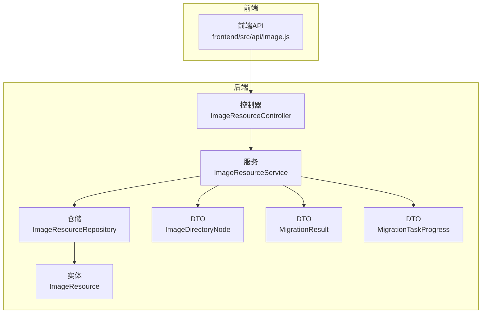
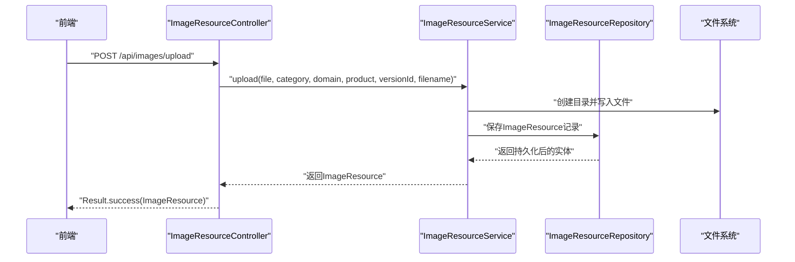
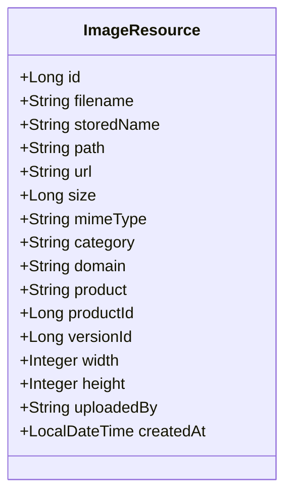
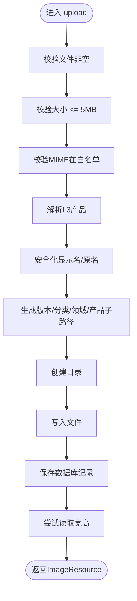
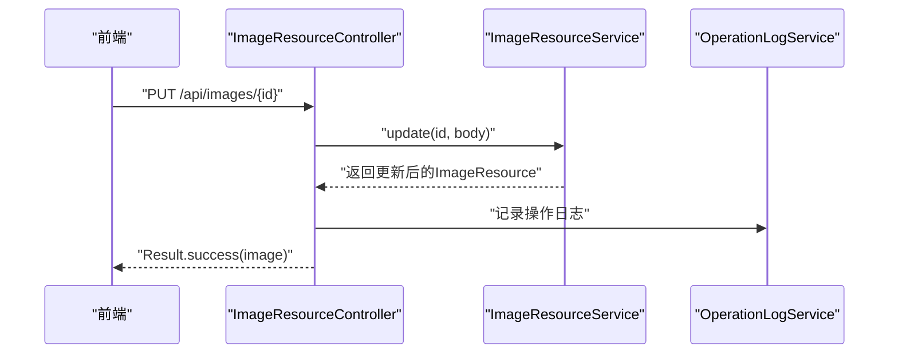
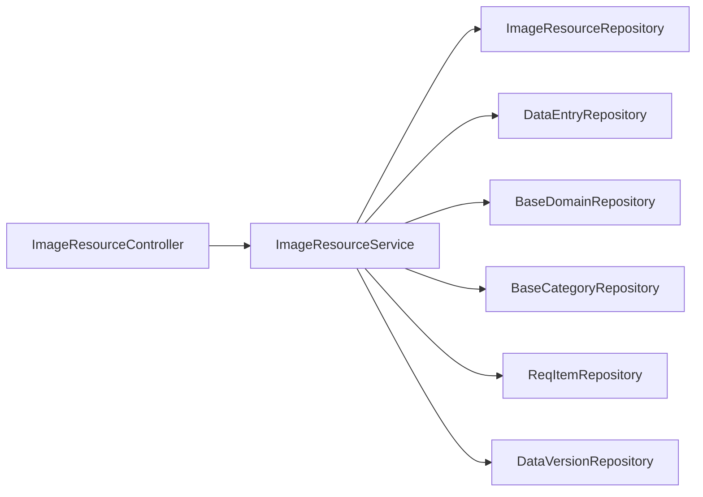

# 图片资源模块

<cite>
**本文引用的文件**
- [ImageResource.java](file://src/main/java/com/superpower/modules/image/entity/ImageResource.java)
- [ImageResourceService.java](file://src/main/java/com/superpower/modules/image/service/ImageResourceService.java)
- [ImageResourceController.java](file://src/main/java/com/superpower/modules/image/controller/ImageResourceController.java)
- [ImageResourceRepository.java](file://src/main/java/com/superpower/modules/image/repository/ImageResourceRepository.java)
- [ImageDirectoryNode.java](file://src/main/java/com/superpower/modules/image/dto/ImageDirectoryNode.java)
- [MigrationResult.java](file://src/main/java/com/superpower/modules/image/dto/MigrationResult.java)
- [MigrationTaskProgress.java](file://src/main/java/com/superpower/modules/image/dto/MigrationTaskProgress.java)
- [image.js](file://frontend/src/api/image.js)
</cite>

## 目录
1. [简介](#简介)
2. [项目结构](#项目结构)
3. [核心组件](#核心组件)
4. [架构总览](#架构总览)
5. [详细组件分析](#详细组件分析)
6. [依赖分析](#依赖分析)
7. [性能考虑](#性能考虑)
8. [故障排查指南](#故障排查指南)
9. [结论](#结论)
10. [附录](#附录)

## 简介
本技术文档围绕图片资源模块进行系统化梳理，覆盖实体设计、服务实现、控制器API、文件存储策略、目录层级管理、图片迁移与存储优化等方面。重点解释以下内容：
- 图片资源实体(ImageResource)的字段语义与约束，包括文件元数据、存储路径与访问URL、所属域与产品维度、尺寸与上传者信息等。
- 图片资源服务(ImageResourceService)的实现要点：文件上传校验与命名、目录结构生成、图片重命名与引用同步、替换文件、目录树构建、引用查询、外部图片迁移与进度跟踪、宽高回填等。
- 控制器层API设计：上传、下载占位、删除、批量删除、重命名、替换文件、目录树、引用查询、迁移任务进度查询等。
- 存储策略与目录层级：按版本号分桶、按分类/领域/产品三级结构组织，需求类图片与通用图片的存储路径差异。
- 迁移任务处理：从描述文本中识别外部图片链接，下载并本地化，更新富文本卡片与引用，异步任务进度上报。

## 项目结构
图片资源模块位于后端Java工程的image包下，采用经典的分层架构：
- 实体层：ImageResource
- 数据访问层：ImageResourceRepository
- 服务层：ImageResourceService
- 控制器层：ImageResourceController
- DTO层：ImageDirectoryNode、MigrationResult、MigrationTaskProgress
- 前端API封装：frontend/src/api/image.js

**图表来源**
- [ImageResourceController.java:24-152](file://src/main/java/com/superpower/modules/image/controller/ImageResourceController.java#L24-L152)
- [ImageResourceService.java:42-1304](file://src/main/java/com/superpower/modules/image/service/ImageResourceService.java#L42-L1304)
- [ImageResourceRepository.java:12-39](file://src/main/java/com/superpower/modules/image/repository/ImageResourceRepository.java#L12-L39)
- [ImageResource.java:10-59](file://src/main/java/com/superpower/modules/image/entity/ImageResource.java#L10-L59)
- [ImageDirectoryNode.java:7-11](file://src/main/java/com/superpower/modules/image/dto/ImageDirectoryNode.java#L7-L11)
- [MigrationResult.java:8-21](file://src/main/java/com/superpower/modules/image/dto/MigrationResult.java#L8-L21)
- [MigrationTaskProgress.java:8-18](file://src/main/java/com/superpower/modules/image/dto/MigrationTaskProgress.java#L8-L18)

**章节来源**
- [ImageResourceController.java:24-152](file://src/main/java/com/superpower/modules/image/controller/ImageResourceController.java#L24-L152)
- [ImageResourceService.java:42-1304](file://src/main/java/com/superpower/modules/image/service/ImageResourceService.java#L42-L1304)
- [ImageResourceRepository.java:12-39](file://src/main/java/com/superpower/modules/image/repository/ImageResourceRepository.java#L12-L39)
- [ImageResource.java:10-59](file://src/main/java/com/superpower/modules/image/entity/ImageResource.java#L10-L59)
- [ImageDirectoryNode.java:7-11](file://src/main/java/com/superpower/modules/image/dto/ImageDirectoryNode.java#L7-L11)
- [MigrationResult.java:8-21](file://src/main/java/com/superpower/modules/image/dto/MigrationResult.java#L8-L21)
- [MigrationTaskProgress.java:8-18](file://src/main/java/com/superpower/modules/image/dto/MigrationTaskProgress.java#L8-L18)

## 核心组件
- 实体(ImageResource)：承载图片的元数据与存储信息，包含文件名、存储名、路径、URL、尺寸、MIME类型、宽高、所属分类/领域/产品、版本号、上传者、创建时间等。
- 仓储(ImageResourceRepository)：基于Spring Data JPA提供按版本/分类/领域/产品维度的查询与统计能力，并支持按版本批量删除。
- 服务(ImageResourceService)：实现上传、重命名与引用同步、替换文件、删除、目录树构建、引用查询、外部图片迁移、宽高回填等核心业务逻辑。
- 控制器(ImageResourceController)：暴露REST接口，负责参数接收、鉴权、日志记录与结果封装。
- DTO：用于目录树节点、迁移结果与进度的数据传输对象。

**章节来源**
- [ImageResource.java:10-59](file://src/main/java/com/superpower/modules/image/entity/ImageResource.java#L10-L59)
- [ImageResourceRepository.java:12-39](file://src/main/java/com/superpower/modules/image/repository/ImageResourceRepository.java#L12-L39)
- [ImageResourceService.java:42-1304](file://src/main/java/com/superpower/modules/image/service/ImageResourceService.java#L42-L1304)
- [ImageResourceController.java:24-152](file://src/main/java/com/superpower/modules/image/controller/ImageResourceController.java#L24-L152)
- [ImageDirectoryNode.java:7-11](file://src/main/java/com/superpower/modules/image/dto/ImageDirectoryNode.java#L7-L11)
- [MigrationResult.java:8-21](file://src/main/java/com/superpower/modules/image/dto/MigrationResult.java#L8-L21)
- [MigrationTaskProgress.java:8-18](file://src/main/java/com/superpower/modules/image/dto/MigrationTaskProgress.java#L8-L18)

## 架构总览
图片资源模块遵循典型的三层架构，前后端通过HTTP交互，服务层协调仓储与文件系统，控制器负责请求路由与响应封装。

**图表来源**
- [ImageResourceController.java:52-65](file://src/main/java/com/superpower/modules/image/controller/ImageResourceController.java#L52-L65)
- [ImageResourceService.java:78-184](file://src/main/java/com/superpower/modules/image/service/ImageResourceService.java#L78-L184)
- [ImageResourceRepository.java:12-39](file://src/main/java/com/superpower/modules/image/repository/ImageResourceRepository.java#L12-L39)

## 详细组件分析

### 实体设计：ImageResource
- 字段职责
  - 标识与元数据：id、filename、storedName、size、mimeType、createdAt
  - 存储与访问：path、url
  - 分类与归属：category、domain、product、productId、versionId
  - 尺寸：width、height
  - 来源与上传者：uploadedBy
- 设计要点
  - 通过versionId实现按版本隔离，避免跨版本冲突
  - 通过category/domain/product/productId形成三级目录定位
  - url统一前缀区分“通用图片”与“需求图片”，便于后续访问与迁移
  - 宽高延迟回填，减少初始写入开销

**图表来源**
- [ImageResource.java:10-59](file://src/main/java/com/superpower/modules/image/entity/ImageResource.java#L10-L59)

**章节来源**
- [ImageResource.java:10-59](file://src/main/java/com/superpower/modules/image/entity/ImageResource.java#L10-L59)

### 服务实现：ImageResourceService
- 上传流程(upload)
  - 校验：非空、大小限制、MIME白名单
  - 产品解析：L3产品解析与校验
  - 命名：显示名优先，安全化处理，扩展名推断
  - 路径：按版本/分类/领域/产品生成子路径，创建目录
  - 写入：复制到目标路径，计算宽高
  - 记录：保存数据库，返回实体
- 重命名与引用同步(update)
  - 阶段化事务：先校验与计算，再保存，最后引用同步与文件移动
  - 引用同步：在富文本卡片与描述中替换URL、名称与data-id
  - 文件移动：事务提交后执行，确保DB与文件系统一致
- 替换文件(replaceFile)
  - 校验与替换，更新尺寸与MIME
- 删除(delete/batchDelete)
  - 先删记录，再删文件
- 目录树构建(getTree)
  - 基于版本/分类/领域/产品维度聚合统计，结合直接与间接引用计数
- 引用查询(findReferences/findReferencesBatch/findAllVersionReferences/findReqReferences)
  - 在富文本描述中匹配URL，定位引用条目与版本
- 外部图片迁移(startMigration/migrateExternalImagesAsync)
  - 异步任务，扫描描述中的外部图片链接，下载并本地化，更新富文本卡片
- 宽高回填(backfillImageDimensions)
  - 启动事件中扫描缺失宽高的图片，逐个读取文件计算并回填

**图表来源**
- [ImageResourceService.java:78-184](file://src/main/java/com/superpower/modules/image/service/ImageResourceService.java#L78-L184)

**章节来源**
- [ImageResourceService.java:42-1304](file://src/main/java/com/superpower/modules/image/service/ImageResourceService.java#L42-L1304)

### 控制器API：ImageResourceController
- 上传：/api/images/upload（支持category/domain/product/versionId/filename）
- 目录树：/api/images/tree?versionId
- 查询：/api/images（支持多维过滤与是否包含间接引用）
- 删除：/api/images/{id}（管理员）
- 批量删除：/api/images/batch-delete（管理员）
- 更新：/api/images/{id}（重命名/改位置）
- 替换文件：/api/images/{id}/file
- 引用查询：/api/images/{id}/references、/api/images/{id}/all-references、/api/images/{id}/req-references、/api/images/batch-references
- 迁移任务：/api/images/migrate-external-images、/api/images/migrate-task/{taskId}

**图表来源**
- [ImageResourceController.java:104-119](file://src/main/java/com/superpower/modules/image/controller/ImageResourceController.java#L104-L119)

**章节来源**
- [ImageResourceController.java:24-152](file://src/main/java/com/superpower/modules/image/controller/ImageResourceController.java#L24-L152)

### 前端API封装：image.js
- 提供上传、下载占位、删除、重命名、替换文件、目录树、引用查询、迁移任务进度等方法
- 对PNG文件进行完整性校验（头部与尾部校验），提升上传质量

**章节来源**
- [image.js:1-93](file://frontend/src/api/image.js#L1-L93)

## 依赖分析
- 组件耦合
  - 控制器依赖服务；服务依赖仓储与多个领域仓储（版本、需求、数据条目）
  - 服务内部通过事务与同步机制保证DB与文件系统一致性
- 外部依赖
  - 文件系统：NIO写入/移动/删除
  - 图像库：读取图片宽高
  - 异步：迁移任务使用@Async
- 可能的循环依赖
  - 通过@Lazy注入自依赖，避免循环依赖问题

**图表来源**
- [ImageResourceService.java:62-76](file://src/main/java/com/superpower/modules/image/service/ImageResourceService.java#L62-L76)

**章节来源**
- [ImageResourceService.java:62-76](file://src/main/java/com/superpower/modules/image/service/ImageResourceService.java#L62-L76)

## 性能考虑
- 上传阶段
  - 严格大小与类型限制，降低异常分支开销
  - 目录创建与写入采用NIO，必要时等待目录落盘
- 事务与文件系统
  - 重命名与移动采用“事务内计算+afterCommit移动”的模式，避免脏写与不一致
- 引用同步
  - 使用正则与集合去重，批量保存减少IO
- 异步迁移
  - 使用@Async与进度存储，避免阻塞主线程
- 宽高回填
  - 启动事件中增量回填，避免影响在线请求

[本节为通用性能建议，不直接分析具体文件]

## 故障排查指南
- 上传失败
  - 检查文件是否为空、大小是否超限、MIME是否在白名单
  - 检查存储目录创建与写入权限
- 重命名后引用未更新
  - 确认事务已提交，检查引用同步逻辑与正则替换
- 删除后文件残留
  - 确认删除流程顺序：先删记录，再删文件
- 迁移任务卡住
  - 查看任务进度与失败明细，确认外部链接可访问性与编码
- 宽高缺失
  - 触发回填任务或检查文件是否损坏

**章节来源**
- [ImageResourceService.java:273-400](file://src/main/java/com/superpower/modules/image/service/ImageResourceService.java#L273-L400)
- [ImageResourceService.java:923-1094](file://src/main/java/com/superpower/modules/image/service/ImageResourceService.java#L923-L1094)
- [ImageResourceService.java:1260-1293](file://src/main/java/com/superpower/modules/image/service/ImageResourceService.java#L1260-L1293)

## 结论
图片资源模块通过清晰的分层设计与严谨的事务/文件系统一致性保障，实现了稳定高效的图片上传、管理与迁移能力。通过版本隔离与三级目录结构，满足多版本、多产品维度的图片管理需求；通过异步迁移与宽高回填等后台任务，进一步优化用户体验与系统性能。

[本节为总结性内容，不直接分析具体文件]

## 附录

### API定义概览
- 上传图片
  - 方法：POST
  - 路径：/api/images/upload
  - 参数：file、category、domain、product、versionId、filename
- 获取目录树
  - 方法：GET
  - 路径：/api/images/tree
  - 参数：versionId
- 查询图片
  - 方法：GET
  - 路径：/api/images
  - 参数：category、domain、product、productId、versionId、includeReferenced
- 删除图片
  - 方法：DELETE
  - 路径：/api/images/{id}
- 批量删除
  - 方法：POST
  - 路径：/api/images/batch-delete
  - 请求体：[id,...]
- 更新图片
  - 方法：PUT
  - 路径：/api/images/{id}
  - 请求体：{filename, category, domain, product}
- 替换文件
  - 方法：PUT
  - 路径：/api/images/{id}/file
  - 参数：file
- 引用查询
  - 方法：GET
  - 路径：/api/images/{id}/references
  - 路径：/api/images/{id}/all-references
  - 路径：/api/images/{id}/req-references
  - 路径：/api/images/batch-references
- 外部图片迁移
  - 方法：POST
  - 路径：/api/images/migrate-external-images
  - 请求体：[entryId,...]
- 迁移进度
  - 方法：GET
  - 路径：/api/images/migrate-task/{taskId}

**章节来源**
- [ImageResourceController.java:52-151](file://src/main/java/com/superpower/modules/image/controller/ImageResourceController.java#L52-L151)

### 存储策略与目录层级
- 版本隔离：每个版本一个目录，避免同名冲突
- 目录结构：{versionId}/{category}/{domain}/{product}/
- 需求类图片：存储路径与访问URL前缀特殊处理，便于迁移与访问控制
- 文件命名：显示名安全化，扩展名自动推断，避免非法字符

**章节来源**
- [ImageResourceService.java:101-151](file://src/main/java/com/superpower/modules/image/service/ImageResourceService.java#L101-L151)
- [ImageResourceService.java:854-868](file://src/main/java/com/superpower/modules/image/service/ImageResourceService.java#L854-L868)

### 图片格式支持
- 支持格式：JPEG、PNG、GIF、WEBP
- 默认扩展名：当无法从文件名推断时，依据MIME类型选择扩展名

**章节来源**
- [ImageResourceService.java:44-45](file://src/main/java/com/superpower/modules/image/service/ImageResourceService.java#L44-L45)
- [ImageResourceService.java:841-852](file://src/main/java/com/superpower/modules/image/service/ImageResourceService.java#L841-L852)

### 最佳实践与优化建议
- 上传前前端校验：PNG完整性校验，减少无效上传
- 重命名与移动：遵循“先计算后移动”的事务策略，确保一致性
- 引用同步：保持正则健壮性，避免误替换
- 迁移任务：合理设置超时与重试，记录失败明细
- 存储优化：定期清理无效文件与冗余记录，监控磁盘空间

**章节来源**
- [image.js:6-22](file://frontend/src/api/image.js#L6-L22)
- [ImageResourceService.java:364-397](file://src/main/java/com/superpower/modules/image/service/ImageResourceService.java#L364-L397)
- [ImageResourceService.java:942-1094](file://src/main/java/com/superpower/modules/image/service/ImageResourceService.java#L942-L1094)