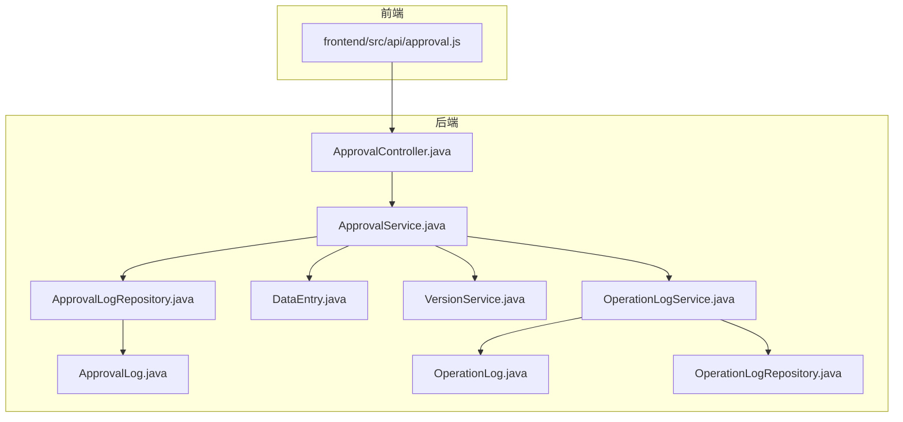
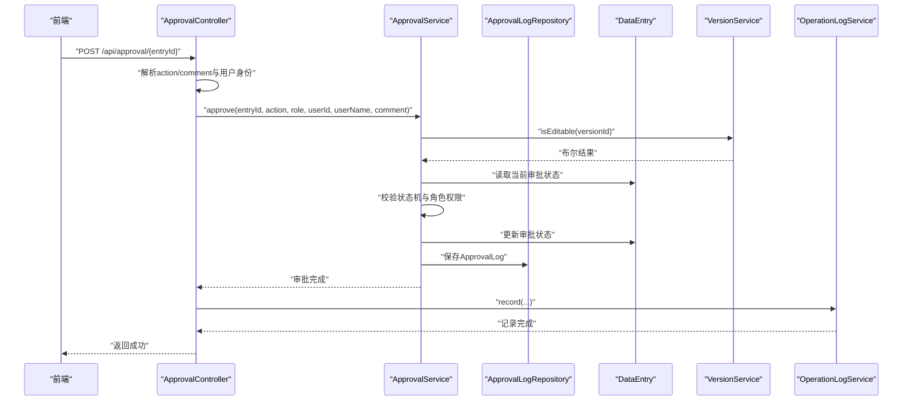
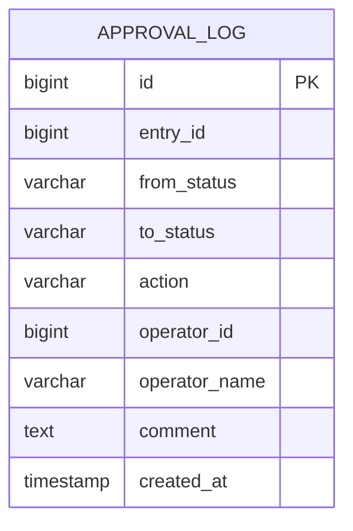
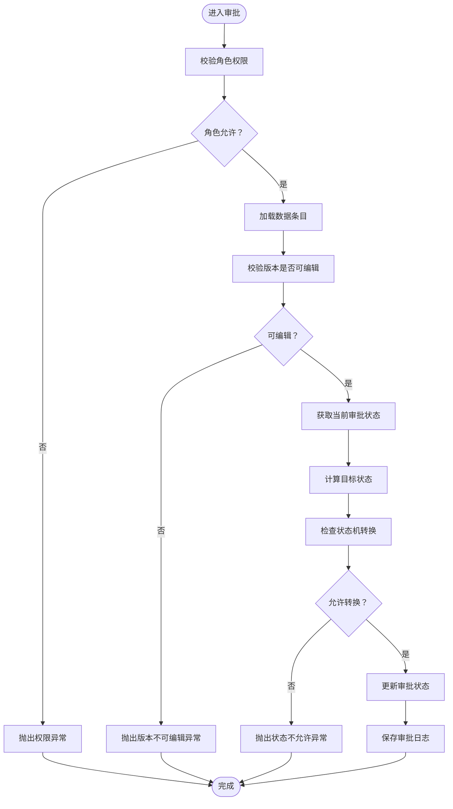
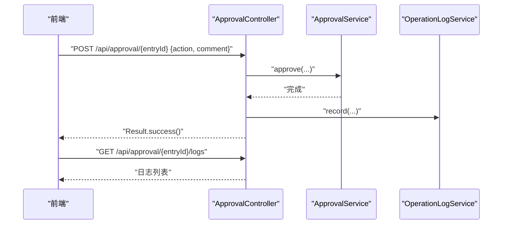
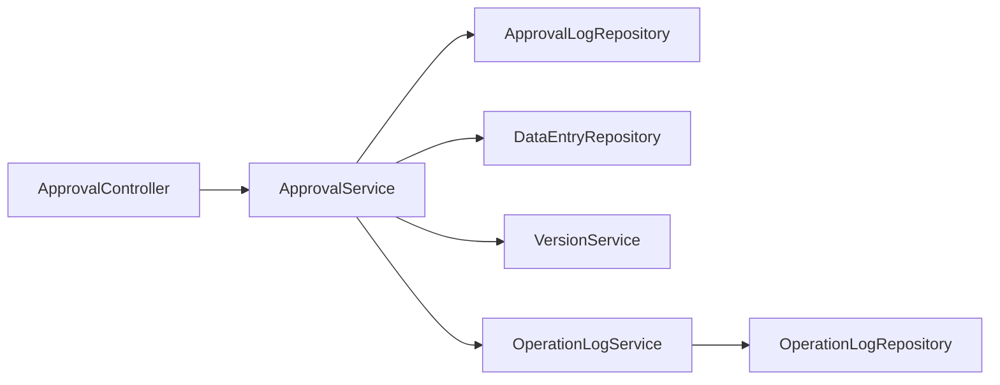

# 审批流程模块

<cite>
**本文档引用的文件**
- [ApprovalLog.java](file://src/main/java/com/superpower/modules/approval/entity/ApprovalLog.java)
- [ApprovalService.java](file://src/main/java/com/superpower/modules/approval/service/ApprovalService.java)
- [ApprovalController.java](file://src/main/java/com/superpower/modules/approval/controller/ApprovalController.java)
- [ApprovalLogRepository.java](file://src/main/java/com/superpower/modules/approval/repository/ApprovalLogRepository.java)
- [DataEntry.java](file://src/main/java/com/superpower/modules/data/entity/DataEntry.java)
- [VersionService.java](file://src/main/java/com/superpower/modules/version/service/VersionService.java)
- [application.yml](file://src/main/resources/application.yml)
- [approval.js](file://frontend/src/api/approval.js)
- [OperationLogService.java](file://src/main/java/com/superpower/modules/system/service/OperationLogService.java)
- [OperationLog.java](file://src/main/java/com/superpower/modules/system/entity/OperationLog.java)
- [OperationLogRepository.java](file://src/main/java/com/superpower/modules/system/repository/OperationLogRepository.java)
- [OperationLogController.java](file://src/main/java/com/superpower/modules/system/controller/OperationLogController.java)
</cite>

## 目录
1. [简介](#简介)
2. [项目结构](#项目结构)
3. [核心组件](#核心组件)
4. [架构总览](#架构总览)
5. [详细组件分析](#详细组件分析)
6. [依赖关系分析](#依赖关系分析)
7. [性能考虑](#性能考虑)
8. [故障排查指南](#故障排查指南)
9. [结论](#结论)
10. [附录](#附录)

## 简介
本模块围绕“审批流程”构建，提供审批状态跟踪、操作记录与责任链管理能力。系统采用状态机模型定义审批流转，结合角色权限与版本访问控制，确保在正确的状态下执行相应动作，并完整记录审批日志。同时，控制器层提供审批申请、审批处理与状态查询的REST API，前端通过统一的HTTP接口调用实现交互。

## 项目结构
审批流程模块位于后端Java代码的approval子包中，包含实体、仓库、服务与控制器四层；前端通过独立API模块调用后端接口；系统还集成了操作审计日志模块用于记录审批行为。

**图表来源**
- [ApprovalController.java:1-56](file://src/main/java/com/superpower/modules/approval/controller/ApprovalController.java#L1-L56)
- [ApprovalService.java:1-120](file://src/main/java/com/superpower/modules/approval/service/ApprovalService.java#L1-L120)
- [ApprovalLogRepository.java:1-13](file://src/main/java/com/superpower/modules/approval/repository/ApprovalLogRepository.java#L1-L13)
- [ApprovalLog.java:1-39](file://src/main/java/com/superpower/modules/approval/entity/ApprovalLog.java#L1-L39)
- [DataEntry.java:35-51](file://src/main/java/com/superpower/modules/data/entity/DataEntry.java#L35-L51)
- [VersionService.java:1-22](file://src/main/java/com/superpower/modules/version/service/VersionService.java#L1-L22)
- [OperationLogService.java:1-29](file://src/main/java/com/superpower/modules/system/service/OperationLogService.java#L1-L29)
- [OperationLog.java:1-41](file://src/main/java/com/superpower/modules/system/entity/OperationLog.java#L1-L41)
- [OperationLogRepository.java:1-19](file://src/main/java/com/superpower/modules/system/repository/OperationLogRepository.java#L1-L19)

**章节来源**
- [ApprovalController.java:1-56](file://src/main/java/com/superpower/modules/approval/controller/ApprovalController.java#L1-L56)
- [ApprovalService.java:1-120](file://src/main/java/com/superpower/modules/approval/service/ApprovalService.java#L1-L120)
- [ApprovalLog.java:1-39](file://src/main/java/com/superpower/modules/approval/entity/ApprovalLog.java#L1-L39)
- [ApprovalLogRepository.java:1-13](file://src/main/java/com/superpower/modules/approval/repository/ApprovalLogRepository.java#L1-L13)
- [DataEntry.java:35-51](file://src/main/java/com/superpower/modules/data/entity/DataEntry.java#L35-L51)
- [VersionService.java:1-22](file://src/main/java/com/superpower/modules/version/service/VersionService.java#L1-L22)
- [OperationLogService.java:1-29](file://src/main/java/com/superpower/modules/system/service/OperationLogService.java#L1-L29)
- [OperationLog.java:1-41](file://src/main/java/com/superpower/modules/system/entity/OperationLog.java#L1-L41)
- [OperationLogRepository.java:1-19](file://src/main/java/com/superpower/modules/system/repository/OperationLogRepository.java#L1-L19)

## 核心组件
- 审批日志实体：记录每次审批动作的来源状态、目标状态、操作类型、操作人与时间等关键信息，支持按时间倒序查询。
- 审批服务：封装状态机、角色权限与版本访问控制，负责审批动作的合法性校验与持久化。
- 控制器层：提供审批处理与日志查询的REST接口，集成用户认证与操作审计。
- 数据实体：复用数据条目的状态字段承载审批状态，配合版本服务限制编辑窗口。
- 系统审计：审批完成后记录操作日志，便于追踪与审计。

**章节来源**
- [ApprovalLog.java:1-39](file://src/main/java/com/superpower/modules/approval/entity/ApprovalLog.java#L1-L39)
- [ApprovalService.java:1-120](file://src/main/java/com/superpower/modules/approval/service/ApprovalService.java#L1-L120)
- [ApprovalController.java:1-56](file://src/main/java/com/superpower/modules/approval/controller/ApprovalController.java#L1-L56)
- [DataEntry.java:35-51](file://src/main/java/com/superpower/modules/data/entity/DataEntry.java#L35-L51)
- [VersionService.java:1-22](file://src/main/java/com/superpower/modules/version/service/VersionService.java#L1-L22)
- [OperationLogService.java:1-29](file://src/main/java/com/superpower/modules/system/service/OperationLogService.java#L1-L29)

## 架构总览
审批流程采用分层架构：前端通过HTTP接口发起审批请求；控制器接收请求并解析用户身份；服务层进行状态机与权限校验；仓储层持久化审批日志；版本服务保障仅在草稿版本可变更状态；最后由操作日志服务记录审计事件。

**图表来源**
- [ApprovalController.java:35-49](file://src/main/java/com/superpower/modules/approval/controller/ApprovalController.java#L35-L49)
- [ApprovalService.java:62-107](file://src/main/java/com/superpower/modules/approval/service/ApprovalService.java#L62-L107)
- [ApprovalLogRepository.java:8-12](file://src/main/java/com/superpower/modules/approval/repository/ApprovalLogRepository.java#L8-L12)
- [DataEntry.java:35-51](file://src/main/java/com/superpower/modules/data/entity/DataEntry.java#L35-L51)
- [VersionService.java:19-21](file://src/main/java/com/superpower/modules/version/service/VersionService.java#L19-L21)
- [OperationLogService.java:27-29](file://src/main/java/com/superpower/modules/system/service/OperationLogService.java#L27-L29)

## 详细组件分析

### 审批日志实体（ApprovalLog）
- 设计要点
  - 主键自增，关联数据条目ID，记录来源状态与目标状态。
  - 操作类型包含提交、通过、驳回、撤回等，便于审计与统计。
  - 记录操作人ID与名称、评论与创建时间，支持按时间倒序查询。
- 数据模型图

**图表来源**
- [ApprovalLog.java:10-38](file://src/main/java/com/superpower/modules/approval/entity/ApprovalLog.java#L10-L38)

**章节来源**
- [ApprovalLog.java:1-39](file://src/main/java/com/superpower/modules/approval/entity/ApprovalLog.java#L1-L39)
- [ApprovalLogRepository.java:8-12](file://src/main/java/com/superpower/modules/approval/repository/ApprovalLogRepository.java#L8-L12)

### 审批服务（ApprovalService）
- 状态机与状态转换
  - 定义四种状态：待提交、待审核、审核通过、驳回。
  - 使用映射定义允许的转换路径，确保状态变更符合业务规则。
- 角色与权限
  - 定义不同动作允许的角色集合，如提交允许编辑者与管理员，通过/驳回仅管理员。
  - 支持“撤回”仅限提交人执行的特殊规则。
- 版本访问控制
  - 仅当数据所属版本处于草稿状态时才允许变更审批状态。
- 审批日志生成
  - 成功变更后生成审批日志，记录来源状态、目标状态、操作类型与操作人信息。
- 可编辑性判断
  - 提供静态方法根据状态与角色判断是否可编辑，供前端与业务层使用。

**图表来源**
- [ApprovalService.java:62-107](file://src/main/java/com/superpower/modules/approval/service/ApprovalService.java#L62-L107)
- [VersionService.java:19-21](file://src/main/java/com/superpower/modules/version/service/VersionService.java#L19-L21)

**章节来源**
- [ApprovalService.java:1-120](file://src/main/java/com/superpower/modules/approval/service/ApprovalService.java#L1-L120)
- [VersionService.java:1-22](file://src/main/java/com/superpower/modules/version/service/VersionService.java#L1-L22)

### 控制器层（ApprovalController）
- 审批处理接口
  - 路径：POST /api/approval/{entryId}
  - 请求体：action（提交/通过/驳回/撤回）、comment（可选）
  - 行为：解析用户身份与角色，调用审批服务执行审批，随后记录操作审计。
- 日志查询接口
  - 路径：GET /api/approval/{entryId}/logs
  - 行为：按时间倒序返回该条目的所有审批日志。
- 前端对接
  - 前端通过独立API模块调用上述接口，实现审批按钮与日志展示。

**图表来源**
- [ApprovalController.java:35-54](file://src/main/java/com/superpower/modules/approval/controller/ApprovalController.java#L35-L54)
- [approval.js:3-9](file://frontend/src/api/approval.js#L3-L9)
- [OperationLogService.java:27-29](file://src/main/java/com/superpower/modules/system/service/OperationLogService.java#L27-L29)

**章节来源**
- [ApprovalController.java:1-56](file://src/main/java/com/superpower/modules/approval/controller/ApprovalController.java#L1-L56)
- [approval.js:1-10](file://frontend/src/api/approval.js#L1-L10)

### 数据实体与版本服务
- 数据条目（DataEntry）
  - 复用状态字段承载审批状态，默认值为“待提交”，确保新数据从正确起点开始。
- 版本服务（VersionService）
  - 提供访问状态查询与可编辑性判断，仅草稿版本允许变更审批状态，避免对已发布版本造成影响。

**章节来源**
- [DataEntry.java:35-51](file://src/main/java/com/superpower/modules/data/entity/DataEntry.java#L35-L51)
- [VersionService.java:1-22](file://src/main/java/com/superpower/modules/version/service/VersionService.java#L1-L22)

### 审计日志集成
- 操作日志实体与仓库
  - 记录用户ID、用户名、操作类型、模块、描述、目标对象与IP、时间等。
- 审计服务
  - 提供重载的记录方法，审批完成后调用以记录“审批管理”模块的操作。
- 控制器集成
  - 审批成功后记录操作日志，便于后续审计与问题追溯。

**章节来源**
- [OperationLog.java:1-41](file://src/main/java/com/superpower/modules/system/entity/OperationLog.java#L1-L41)
- [OperationLogRepository.java:1-19](file://src/main/java/com/superpower/modules/system/repository/OperationLogRepository.java#L1-L19)
- [OperationLogService.java:1-29](file://src/main/java/com/superpower/modules/system/service/OperationLogService.java#L1-L29)
- [OperationLogController.java:1-32](file://src/main/java/com/superpower/modules/system/controller/OperationLogController.java#L1-L32)

## 依赖关系分析
- 组件耦合
  - ApprovalController依赖ApprovalService；ApprovalService依赖DataEntryRepository、ApprovalLogRepository与VersionService。
  - 审批成功后，ApprovalService调用OperationLogService记录审计事件。
- 外部依赖
  - JPA/Hibernate用于实体持久化；SQLite作为数据库；Spring Security用于鉴权。
- 数据库配置
  - 应用配置文件中定义了SQLite连接、连接池大小、DDL策略与SQL格式化等。

**图表来源**
- [ApprovalController.java:22-33](file://src/main/java/com/superpower/modules/approval/controller/ApprovalController.java#L22-L33)
- [ApprovalService.java:50-60](file://src/main/java/com/superpower/modules/approval/service/ApprovalService.java#L50-L60)
- [OperationLogService.java:23-25](file://src/main/java/com/superpower/modules/system/service/OperationLogService.java#L23-L25)

**章节来源**
- [application.yml:18-34](file://src/main/resources/application.yml#L18-L34)

## 性能考虑
- 连接池与超时
  - SQLite连接池最大连接数与连接超时已配置，建议根据并发与数据量评估调整。
- SQL执行与日志
  - JPA关闭显示SQL，建议在调试阶段按需开启以观察状态机与权限校验的SQL执行情况。
- 审计日志写入
  - 审计写入为同步操作，建议在高并发场景下评估异步化方案（如消息队列）以降低审批主流程阻塞风险。
- 查询优化
  - 审批日志按创建时间倒序查询，建议在entry_id上建立索引以提升查询性能。

**章节来源**
- [application.yml:21-34](file://src/main/resources/application.yml#L21-L34)

## 故障排查指南
- 权限异常
  - 症状：提示“无权执行此操作”。
  - 排查：确认用户角色与动作对应的角色集合是否匹配；检查撤回操作是否仅限提交人。
- 版本不可编辑
  - 症状：提示“仅编辑中版本可变更审批状态”。
  - 排查：确认数据所属版本状态是否为草稿；若为已发布版本则无法变更审批状态。
- 状态不允许
  - 症状：提示“当前状态不允许此操作”。
  - 排查：核对状态机映射与当前状态，确认目标状态是否在允许集合内。
- 数据不存在
  - 症状：提示“数据不存在”。
  - 排查：确认entryId是否正确；检查数据条目是否存在。
- 审计未记录
  - 症状：审批成功但操作日志缺失。
  - 排查：确认OperationLogService的记录逻辑是否被调用；检查数据库连接与事务配置。

**章节来源**
- [ApprovalService.java:66-93](file://src/main/java/com/superpower/modules/approval/service/ApprovalService.java#L66-L93)
- [VersionService.java:19-21](file://src/main/java/com/superpower/modules/version/service/VersionService.java#L19-L21)
- [ApprovalController.java:46-47](file://src/main/java/com/superpower/modules/approval/controller/ApprovalController.java#L46-L47)

## 结论
本模块通过清晰的状态机、严格的权限控制与完善的审计日志，实现了可控、可观测的审批流程。前后端分离的接口设计便于扩展与维护，版本访问控制有效避免了误操作。建议在高并发场景下对审计写入进行异步化改造，并持续优化查询与索引以提升整体性能。

## 附录

### API定义
- 审批处理
  - 方法：POST
  - 路径：/api/approval/{entryId}
  - 请求体：action（submit|approve|reject|withdraw）、comment（可选）
  - 返回：Result.success()
- 审批日志查询
  - 方法：GET
  - 路径：/api/approval/{entryId}/logs
  - 返回：日志列表（按时间倒序）

**章节来源**
- [ApprovalController.java:35-54](file://src/main/java/com/superpower/modules/approval/controller/ApprovalController.java#L35-L54)
- [approval.js:3-9](file://frontend/src/api/approval.js#L3-L9)

### 审批状态机与角色映射
- 状态集合：待提交、待审核、审核通过、驳回
- 允许转换：依据状态机映射确定
- 动作与角色：
  - submit：editor/admin
  - approve：admin
  - reject：admin
  - withdraw：editor/admin（仅提交人）

**章节来源**
- [ApprovalService.java:19-48](file://src/main/java/com/superpower/modules/approval/service/ApprovalService.java#L19-L48)