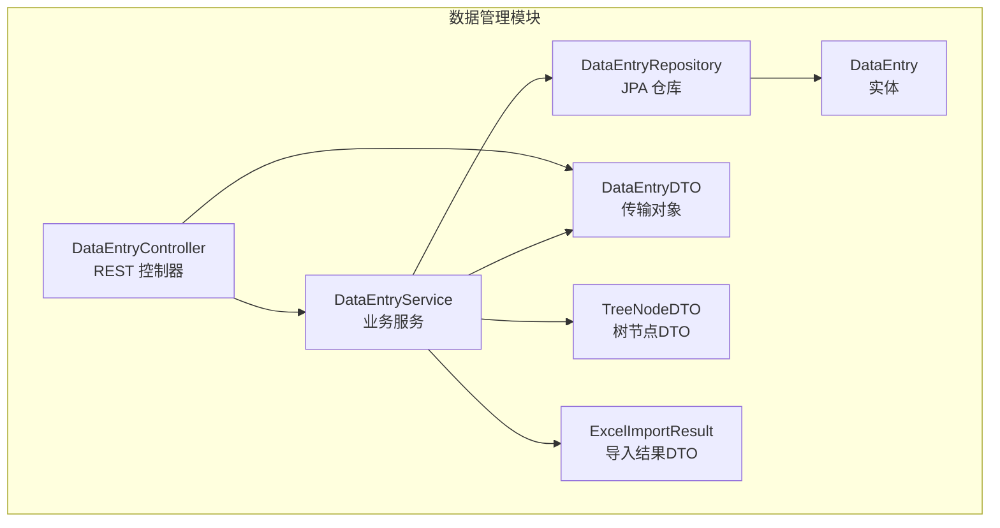
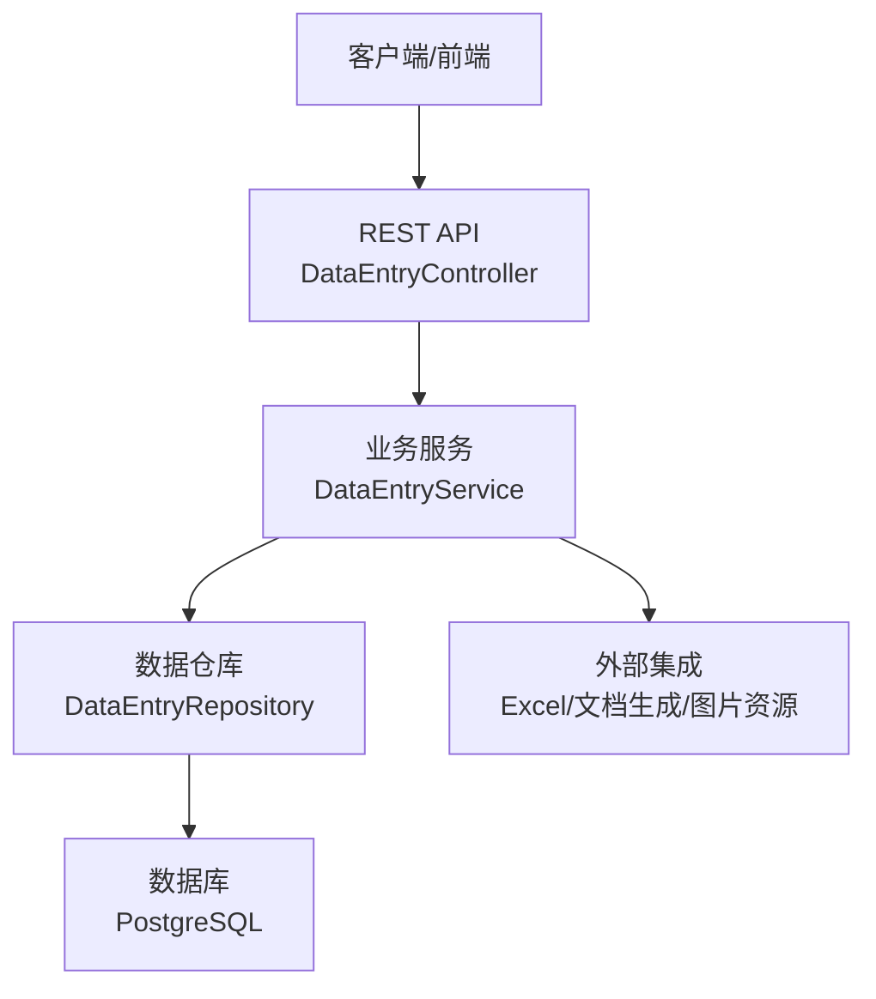
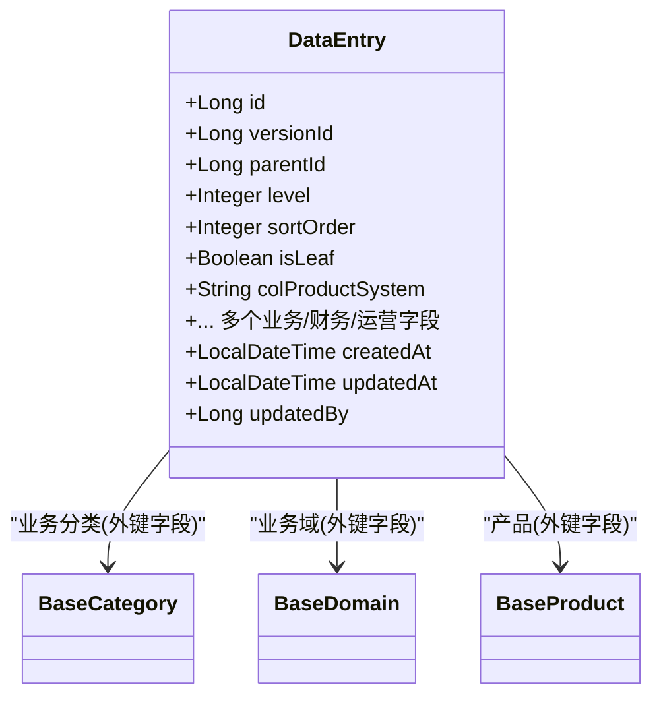
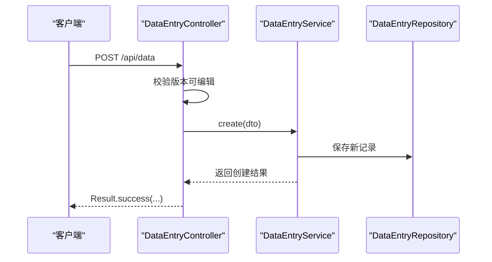
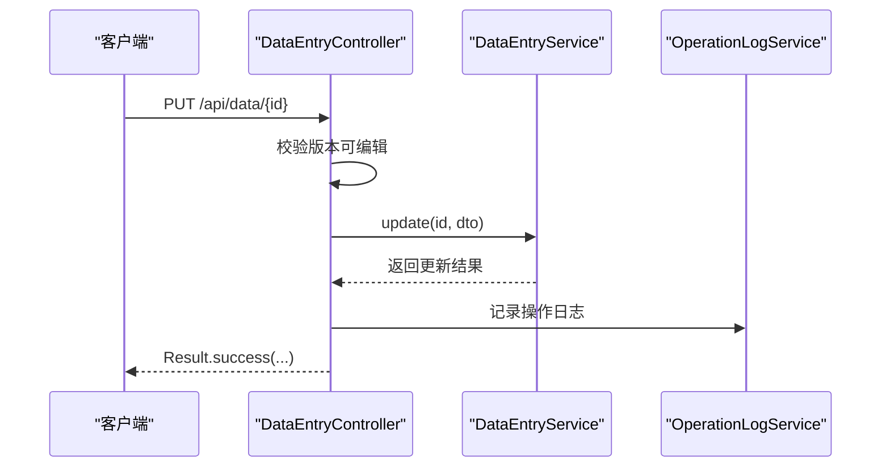
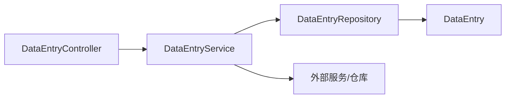

# 数据管理模块

<cite>
**本文引用的文件**   
- [DataEntry.java](file://src/main/java/com/superpower/modules/data/entity/DataEntry.java)
- [DataEntryService.java](file://src/main/java/com/superpower/modules/data/service/DataEntryService.java)
- [DataEntryController.java](file://src/main/java/com/superpower/modules/data/controller/DataEntryController.java)
- [DataEntryRepository.java](file://src/main/java/com/superpower/modules/data/repository/DataEntryRepository.java)
- [DataEntryDTO.java](file://src/main/java/com/superpower/modules/data/dto/DataEntryDTO.java)
- [TreeNodeDTO.java](file://src/main/java/com/superpower/modules/data/dto/TreeNodeDTO.java)
- [ExcelImportResult.java](file://src/main/java/com/superpower/modules/data/dto/ExcelImportResult.java)
- [RenumberRequest.java](file://src/main/java/com/superpower/modules/data/dto/RenumberRequest.java)
- [init.sql](file://src/main/resources/db/init.sql)
- [20260602_add_product_category_tables.sql](file://db_changes/20260602_add_product_category_tables.sql)
- [V1.0.12_add_col_intelligent.sql](file://db_changes/V1.0.12_add_col_intelligent.sql)
- [DataEntryServiceTest.java](file://src/test/java/com/superpower/modules/data/service/DataEntryServiceTest.java)
</cite>

## 目录
1. [简介](#简介)
2. [项目结构](#项目结构)
3. [核心组件](#核心组件)
4. [架构总览](#架构总览)
5. [组件详解](#组件详解)
6. [依赖关系分析](#依赖关系分析)
7. [性能与查询优化](#性能与查询优化)
8. [故障排查指南](#故障排查指南)
9. [结论](#结论)
10. [附录](#附录)

## 简介
本技术文档聚焦于数据管理模块，围绕数据实体(DataEntry)、数据管理服务(DataEntryService)与控制器(DataEntryController)展开，系统阐述字段定义、数据验证与业务约束、增删改查与批量操作、导入导出与Excel处理、RESTful API 设计、数据模型完整性与索引、查询优化策略，并提供最佳实践与常见问题解决方案。

## 项目结构
数据管理模块位于后端 Java 工程的 modules/data 子目录中，采用分层架构：controller 负责 HTTP 接口与鉴权校验；service 实现业务逻辑与事务控制；repository 基于 Spring Data JPA 提供数据访问；entity 定义持久化模型；dto 封装传输对象。



图表来源
- [DataEntryController.java:27-45](file://src/main/java/com/superpower/modules/data/controller/DataEntryController.java#L27-L45)
- [DataEntryService.java:44-74](file://src/main/java/com/superpower/modules/data/service/DataEntryService.java#L44-L74)
- [DataEntryRepository.java:11-151](file://src/main/java/com/superpower/modules/data/repository/DataEntryRepository.java#L11-L151)
- [DataEntry.java:12-266](file://src/main/java/com/superpower/modules/data/entity/DataEntry.java#L12-L266)
- [DataEntryDTO.java:6-64](file://src/main/java/com/superpower/modules/data/dto/DataEntryDTO.java#L6-L64)
- [TreeNodeDTO.java:6-15](file://src/main/java/com/superpower/modules/data/dto/TreeNodeDTO.java#L6-L15)
- [ExcelImportResult.java:7-14](file://src/main/java/com/superpower/modules/data/dto/ExcelImportResult.java#L7-L14)

章节来源
- [DataEntryController.java:27-45](file://src/main/java/com/superpower/modules/data/controller/DataEntryController.java#L27-L45)
- [DataEntryService.java:44-74](file://src/main/java/com/superpower/modules/data/service/DataEntryService.java#L44-L74)
- [DataEntryRepository.java:11-151](file://src/main/java/com/superpower/modules/data/repository/DataEntryRepository.java#L11-L151)
- [DataEntry.java:12-266](file://src/main/java/com/superpower/modules/data/entity/DataEntry.java#L12-L266)
- [DataEntryDTO.java:6-64](file://src/main/java/com/superpower/modules/data/dto/DataEntryDTO.java#L6-L64)
- [TreeNodeDTO.java:6-15](file://src/main/java/com/superpower/modules/data/dto/TreeNodeDTO.java#L6-L15)
- [ExcelImportResult.java:7-14](file://src/main/java/com/superpower/modules/data/dto/ExcelImportResult.java#L7-L14)

## 核心组件
- 数据实体 DataEntry：定义数据清单的完整字段集合，包含业务分类、业务域、版本划分、多年财务数据、销售与成本、图片与控标点等，支持树形层级(level)与父子关系(parent_id)，并提供克隆方法用于复制非主键字段。
- 数据管理服务 DataEntryService：实现树构建、查询过滤、增删改、批量操作、排序与重编号、层级修复、去重、复制/移动、图片卡片链接同步等功能，并严格校验版本状态（草稿才允许修改）。
- 控制器 DataEntryController：提供 RESTful 接口，统一返回 Result 包装，负责权限校验（版本是否可编辑）、日志记录与错误处理。
- 数据仓库 DataEntryRepository：基于 JPA 提供按版本、层级、父子关系、自定义筛选等查询方法，以及聚合统计与批量删除等能力。
- DTO：DataEntryDTO 作为创建/更新输入对象；TreeNodeDTO 用于树形展示；ExcelImportResult 用于导入结果反馈。

章节来源
- [DataEntry.java:12-266](file://src/main/java/com/superpower/modules/data/entity/DataEntry.java#L12-L266)
- [DataEntryService.java:44-74](file://src/main/java/com/superpower/modules/data/service/DataEntryService.java#L44-L74)
- [DataEntryController.java:27-45](file://src/main/java/com/superpower/modules/data/controller/DataEntryController.java#L27-L45)
- [DataEntryRepository.java:11-151](file://src/main/java/com/superpower/modules/data/repository/DataEntryRepository.java#L11-L151)
- [DataEntryDTO.java:6-64](file://src/main/java/com/superpower/modules/data/dto/DataEntryDTO.java#L6-L64)
- [TreeNodeDTO.java:6-15](file://src/main/java/com/superpower/modules/data/dto/TreeNodeDTO.java#L6-L15)
- [ExcelImportResult.java:7-14](file://src/main/java/com/superpower/modules/data/dto/ExcelImportResult.java#L7-L14)

## 架构总览
数据管理模块遵循典型的三层架构：表现层（Controller）、领域层（Service）、基础设施层（Repository/Entity）。通过 DTO 解耦接口与持久化模型，利用 JPA 查询与原生 SQL 片段实现复杂筛选与排序，结合事务边界保证一致性。



图表来源
- [DataEntryController.java:27-45](file://src/main/java/com/superpower/modules/data/controller/DataEntryController.java#L27-L45)
- [DataEntryService.java:44-74](file://src/main/java/com/superpower/modules/data/service/DataEntryService.java#L44-L74)
- [DataEntryRepository.java:11-151](file://src/main/java/com/superpower/modules/data/repository/DataEntryRepository.java#L11-L151)
- [init.sql:68-125](file://src/main/resources/db/init.sql#L68-L125)

## 组件详解

### 数据实体 DataEntry 设计与字段语义
- 主键与层级：id 自增主键；versionId 标识所属版本；level 表示树层级；parentId 指向父节点；sortOrder 决定同级顺序；isLeaf 标记是否叶子节点。
- 业务字段：colProductSystem、colBizCategory、colBizDomain、colVersionDivision 等构成业务维度；colFeatureDesc、colBidParamDesc 等富文本描述字段。
- 财务与运营：colFY23~colFY29、colRDCostTotal、colSalesYao/Yuan/Chi、colFactoryPrice 等支撑财务分析。
- 图片与控标：colControlPoint 及多张截图字段、文档说明；与图片资源系统联动进行卡片链接同步。
- 元数据：createdAt/updatedAt、updatedBy 记录变更时间与操作人。
- 关系映射：与 BaseCategory/BaseDomain/BaseProduct 的多对一关联，但以业务字段存储，避免过度反规范化。



图表来源
- [DataEntry.java:12-266](file://src/main/java/com/superpower/modules/data/entity/DataEntry.java#L12-L266)

章节来源
- [DataEntry.java:12-266](file://src/main/java/com/superpower/modules/data/entity/DataEntry.java#L12-L266)

### 数据管理服务 DataEntryService 功能
- 树构建与查询
  - getTree/getChildren：按版本与层级筛选，结合业务分类/域排序，支持状态过滤与名称/产品经理/方案/版本标签过滤。
  - getDomainTree/getSubTree：按业务域构建 L2/L3 树，支持备用回退逻辑。
- 增删改与事务
  - create/update/delete：创建时自动分配排序号、更新父节点 isLeaf 标志；更新时支持级联标签同步（跨层级影响）；删除支持整棵子树递归删除与批量删除。
- 批量操作
  - batchDelete：按父-子关系收集全部后代，一次性删除。
  - batchUpdateCategory：批量修改分类/域/产品/父节点，自动计算排序并级联更新后代层级。
  - updateSort/reorderAll：单条/全量排序，支持数字前缀智能排序。
  - renumberEntries：根据请求重新编号排序。
- 导入导出与 Excel
  - importFromExcel：接收 Excel 文件与版本号，返回导入结果（总数/成功数/更新数/失败数/错误列表）。
  - 预览与下载：支持 HTML 预览与 Word 文档批量导出。
- 数据一致性与业务约束
  - ensureVersionEditable：仅草稿版本允许修改；否则抛出业务异常。
  - 同步图片卡片：从富文本中提取 image-card/img-card 引用，匹配图片资源并替换 data-url/data-filename/title。
  - 智能化过滤：支持仅显示“智能化”条目及其祖先节点。
- 辅助工具
  - cloneWithoutId：复制实体除主键外的所有业务字段，便于克隆场景。
  - fixDataHierarchy：修复层级结构不一致问题（如 level 与父子关系矛盾）。
  - dedupByVersion/dedupDeep：按版本去重与深度去重。



图表来源
- [DataEntryController.java:133-140](file://src/main/java/com/superpower/modules/data/controller/DataEntryController.java#L133-L140)
- [DataEntryService.java:287-316](file://src/main/java/com/superpower/modules/data/service/DataEntryService.java#L287-L316)
- [DataEntryRepository.java:11-151](file://src/main/java/com/superpower/modules/data/repository/DataEntryRepository.java#L11-L151)

章节来源
- [DataEntryService.java:85-240](file://src/main/java/com/superpower/modules/data/service/DataEntryService.java#L85-L240)
- [DataEntryService.java:287-334](file://src/main/java/com/superpower/modules/data/service/DataEntryService.java#L287-L334)
- [DataEntryService.java:501-537](file://src/main/java/com/superpower/modules/data/service/DataEntryService.java#L501-L537)
- [DataEntryService.java:539-640](file://src/main/java/com/superpower/modules/data/service/DataEntryService.java#L539-L640)
- [DataEntryService.java:730-768](file://src/main/java/com/superpower/modules/data/service/DataEntryService.java#L730-L768)
- [DataEntryService.java:793-808](file://src/main/java/com/superpower/modules/data/service/DataEntryService.java#L793-L808)

### 控制器 DataEntryController RESTful API 设计
- 版本与权限
  - 所有写操作均调用 checkVersionEditPermission，确保仅草稿版本可编辑。
  - 日志记录：统一通过 OperationLogService 记录操作类型、对象、详情与用户信息。
- 接口概览
  - GET /api/data/tree/{versionId}：树根构建，支持名称/状态/产品经理/方案/版本标签过滤。
  - GET /api/data/children/{versionId}/{parentId}：获取某父节点下的子项。
  - GET /api/data/domain-tree/{versionId}：按业务域构建树。
  - GET /api/data/sub-tree/{versionId}/{parentId}：获取子树。
  - GET /api/data/query/{versionId}：综合查询，支持自定义标签、级别、智能化过滤等。
  - GET /api/data/{id}：按 ID 获取详情并同步图片卡片。
  - GET /api/data/{id}/preview：HTML 预览。
  - GET /api/data/{id}/preview-download：Word 预览下载。
  - POST /api/data/import-excel：Excel 导入。
  - POST /api/data：创建。
  - PUT /api/data/{id}：更新。
  - PUT /api/data/sort：批量拖拽排序。
  - PUT /api/data/reorder/{versionId}：全量重排序。
  - DELETE /api/data/dedup/{versionId}：按版本去重。
  - DELETE /api/data/dedup-deep/{versionId}：深度去重。
  - PUT /api/data/{id}/level-up /level-down：层级升降。
  - PUT /api/data/{id}/move-up /move-down：上下移动。
  - PUT /api/data/{id}/move-to-parent：移动到指定父节点。
  - PUT /api/data/{id}/move-to-sibling：移动到指定兄弟节点。
  - DELETE /api/data/{id}：删除。
  - POST /api/data/batch-delete：批量删除。
  - PUT /api/data/batch-category：批量修改分类/域/产品/父节点。
  - PUT /api/data/fix-hierarchy/{versionId}：修复层级结构。
  - PUT /api/data/renumber：重编号。
  - POST /api/data/entries/copy：复制到目标节点。
  - PUT /api/data/entries/move：移动到目标节点。
- 请求参数与响应格式
  - 统一使用 Result<T> 包装响应，错误时返回失败信息。
  - Excel 导入返回 ExcelImportResult，包含总行数、成功/更新/失败行数与错误列表。
  - 查询返回 DataEntrySummaryDTO 列表（由实体转换而来）。



图表来源
- [DataEntryController.java:153-166](file://src/main/java/com/superpower/modules/data/controller/DataEntryController.java#L153-L166)
- [DataEntryService.java:318-334](file://src/main/java/com/superpower/modules/data/service/DataEntryService.java#L318-L334)

章节来源
- [DataEntryController.java:58-330](file://src/main/java/com/superpower/modules/data/controller/DataEntryController.java#L58-L330)
- [DataEntryController.java:332-411](file://src/main/java/com/superpower/modules/data/controller/DataEntryController.java#L332-L411)
- [ExcelImportResult.java:7-14](file://src/main/java/com/superpower/modules/data/dto/ExcelImportResult.java#L7-L14)

### 数据模型完整性约束与索引设计
- 表结构与字段
  - data_entry：主键 id，version_id、parent_id、level、sort_order、is_leaf、各业务/财务/运营字段、时间戳与操作人字段。
- 索引与优化
  - 建议在 version_id、parent_id、level、sort_order 上建立复合索引以提升树查询与排序性能。
  - 业务字段（如 colProductSystem、colBizCategory、colBizDomain）若频繁检索，可考虑建立相应索引。
  - 产品分类/域相关表（base_product_l1/l2）已具备 version_id、sort_order 等索引，有利于排序与过滤。
- 字段长度与类型
  - TEXT 字段用于长文本描述；NUMERIC 用于财务金额；INTEGER 用于数量；VARCHAR(n) 限制长度以控制存储与检索效率。

```mermaid
erDiagram
DATA_ENTRY {
bigint id PK
bigint version_id
bigint parent_id
int level
int sort_order
boolean is_leaf
varchar col_产品系统
text col_功能说明
numeric col_FY23..col_FY29
integer col_销量曜..col_销量驰
numeric col_研发成本合计
... 多个业务/财务字段
timestamp created_at
timestamp updated_at
bigint updated_by
}
```

图表来源
- [init.sql:68-125](file://src/main/resources/db/init.sql#L68-L125)
- [20260602_add_product_category_tables.sql:1-38](file://db_changes/20260602_add_product_category_tables.sql#L1-L38)
- [V1.0.12_add_col_intelligent.sql:1-4](file://db_changes/V1.0.12_add_col_intelligent.sql#L1-L4)

章节来源
- [init.sql:68-125](file://src/main/resources/db/init.sql#L68-L125)
- [20260602_add_product_category_tables.sql:1-38](file://db_changes/20260602_add_product_category_tables.sql#L1-L38)
- [V1.0.12_add_col_intelligent.sql:1-4](file://db_changes/V1.0.12_add_col_intelligent.sql#L1-L4)

### 查询与过滤策略
- 多维过滤：支持名称模糊匹配（产品系统/业务分类/业务域）、产品经理、方案标签、版本划分、业务分类/域等。
- 状态过滤：matchesStatus 支持状态包含式匹配，便于多状态筛选。
- 分类/域排序：sortByCategoryOrder 依据 BaseCategory/BaseDomain 的排序字段进行稳定排序。
- 智能化过滤：filterByIntelligent 仅保留“智能化”条目及其祖先节点，形成闭包结果集。
- 层级与父子：findByVersionIdAndLevel/ParentIdWithFilter、findRootEntries 等查询满足树形结构与根节点检索需求。

章节来源
- [DataEntryService.java:76-83](file://src/main/java/com/superpower/modules/data/service/DataEntryService.java#L76-L83)
- [DataEntryService.java:271-285](file://src/main/java/com/superpower/modules/data/service/DataEntryService.java#L271-L285)
- [DataEntryService.java:242-269](file://src/main/java/com/superpower/modules/data/service/DataEntryService.java#L242-L269)
- [DataEntryRepository.java:22-78](file://src/main/java/com/superpower/modules/data/repository/DataEntryRepository.java#L22-L78)

## 依赖关系分析
- 控制器依赖服务：注入 DataEntryService、VersionService、DocumentService、OperationLogService、SysUserService。
- 服务依赖仓库与外部实体：DataEntryRepository、DataVersionRepository、CustomTabEntryRepository、ApprovalLogRepository、SysUserRepository、BaseCategoryRepository、BaseDomainRepository、BaseProductRepository、ImageResourceRepository。
- 实体依赖基础分类/域/产品实体，但通过业务字段存储关联，避免复杂级联更新带来的性能与一致性风险。



图表来源
- [DataEntryController.java:31-44](file://src/main/java/com/superpower/modules/data/controller/DataEntryController.java#L31-L44)
- [DataEntryService.java:47-74](file://src/main/java/com/superpower/modules/data/service/DataEntryService.java#L47-L74)
- [DataEntryRepository.java:11-151](file://src/main/java/com/superpower/modules/data/repository/DataEntryRepository.java#L11-L151)
- [DataEntry.java:68-81](file://src/main/java/com/superpower/modules/data/entity/DataEntry.java#L68-L81)

章节来源
- [DataEntryController.java:31-44](file://src/main/java/com/superpower/modules/data/controller/DataEntryController.java#L31-L44)
- [DataEntryService.java:47-74](file://src/main/java/com/superpower/modules/data/service/DataEntryService.java#L47-L74)

## 性能与查询优化
- 索引建议
  - 在 data_entry(version_id, level, parent_id, sort_order) 建立复合索引，覆盖树查询与排序。
  - 对常用过滤字段（如 colProductSystem、colBizCategory、colBizDomain）建立索引，减少全表扫描。
  - 产品分类/域表已具备 version_id、sort_order 等索引，可直接复用。
- 查询优化
  - 使用 Repository 原生查询与 LEFT JOIN，避免 N+1 查询；对大结果集进行分页或流式处理。
  - 智能化过滤与去重操作涉及全量扫描，建议在草稿版本执行，避免对生产版本造成压力。
- 缓存与异步
  - 对只读树构建与静态配置（如分类/域排序）可引入缓存，降低重复计算。
  - 大规模导入/导出建议异步执行并提供进度反馈。
- 事务与锁
  - 批量操作与层级修复在事务内执行，确保一致性；注意避免长时间持有行级锁。

[本节为通用性能建议，无需特定文件引用]

## 故障排查指南
- 版本状态错误
  - 现象：修改/删除/排序等写操作报错“已发版版本不允许修改清单”。
  - 处理：确认 DataVersion 状态为 draft，或切换到草稿版本后再操作。
- 记录不存在
  - 现象：更新/删除/预览等接口返回“记录不存在”。
  - 处理：检查 ID 是否正确，确认数据是否被删除或版本迁移。
- Excel 导入失败
  - 现象：导入结果包含失败行与错误列表。
  - 处理：根据错误提示修正模板字段、格式或值范围，重新上传。
- 图片卡片链接不同步
  - 现象：富文本中的图片卡片未更新为最新 URL/文件名。
  - 处理：触发同步流程或手动刷新富文本内容；检查图片资源是否存在。
- 测试验证
  - 单元测试覆盖了版本状态校验与查询参数透传，可参考断言与行为预期。

章节来源
- [DataEntryServiceTest.java:61-95](file://src/test/java/com/superpower/modules/data/service/DataEntryServiceTest.java#L61-L95)
- [DataEntryServiceTest.java:117-126](file://src/test/java/com/superpower/modules/data/service/DataEntryServiceTest.java#L117-L126)

## 结论
数据管理模块通过清晰的分层设计与完善的业务服务，实现了树形数据的高效查询、灵活排序与批量操作，并提供了导入导出与预览能力。通过严格的版本状态校验与事务控制，保障了数据一致性与安全性。建议在生产环境中配合合理的索引与缓存策略，持续优化查询与导入导出性能。

[本节为总结性内容，无需特定文件引用]

## 附录

### API 定义与参数说明
- 树构建与查询
  - GET /api/data/tree/{versionId}?name=&status=*&productManager=&solution=&versionTag=
  - GET /api/data/children/{versionId}/{parentId}?name=&status=*&productManager=&solution=&versionTag=
  - GET /api/data/domain-tree/{versionId}?domainId=&categoryId=
  - GET /api/data/sub-tree/{versionId}/{parentId}
  - GET /api/data/query/{versionId}?customTabId=&name=&status=*&productManager=&solution=&versionTag=&bizCategory=&bizDomain=&level=&intelligent=
- 内容与预览
  - GET /api/data/{id}
  - GET /api/data/{id}/preview?mode=
  - GET /api/data/{id}/preview-download?mode=&includeImages=
  - GET /api/data/preview-batch?entryIds=&mode=
- 写操作
  - POST /api/data/import-excel?versionId=&file=
  - POST /api/data
  - PUT /api/data/sort
  - PUT /api/data/reorder/{versionId}
  - PUT /api/data/renumber
  - PUT /api/data/batch-category
  - PUT /api/data/fix-hierarchy/{versionId}
  - PUT /api/data/{id}/level-up
  - PUT /api/data/{id}/level-down
  - PUT /api/data/{id}/move-up
  - PUT /api/data/{id}/move-down
  - PUT /api/data/{id}/move-to-parent
  - PUT /api/data/{id}/move-to-sibling
  - POST /api/data/batch-delete
  - DELETE /api/data/dedup/{versionId}
  - DELETE /api/data/dedup-deep/{versionId}
  - DELETE /api/data/{id}

章节来源
- [DataEntryController.java:58-330](file://src/main/java/com/superpower/modules/data/controller/DataEntryController.java#L58-L330)
- [DataEntryController.java:332-411](file://src/main/java/com/superpower/modules/data/controller/DataEntryController.java#L332-L411)