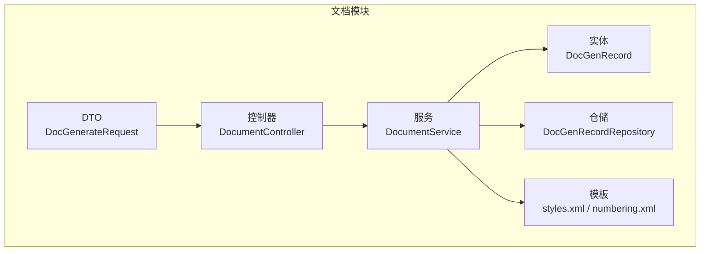
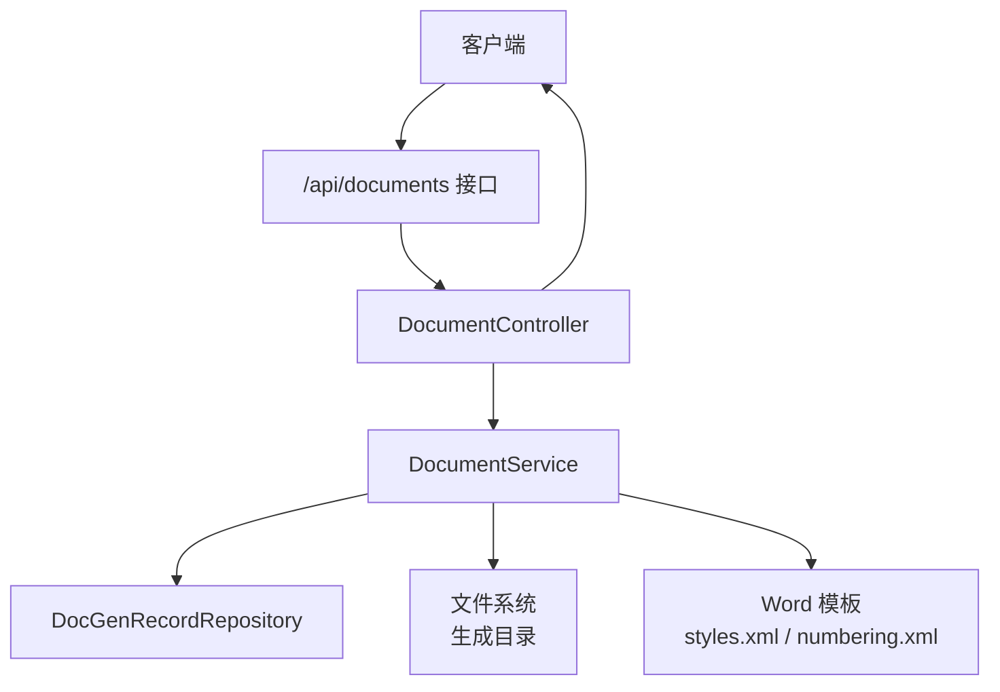
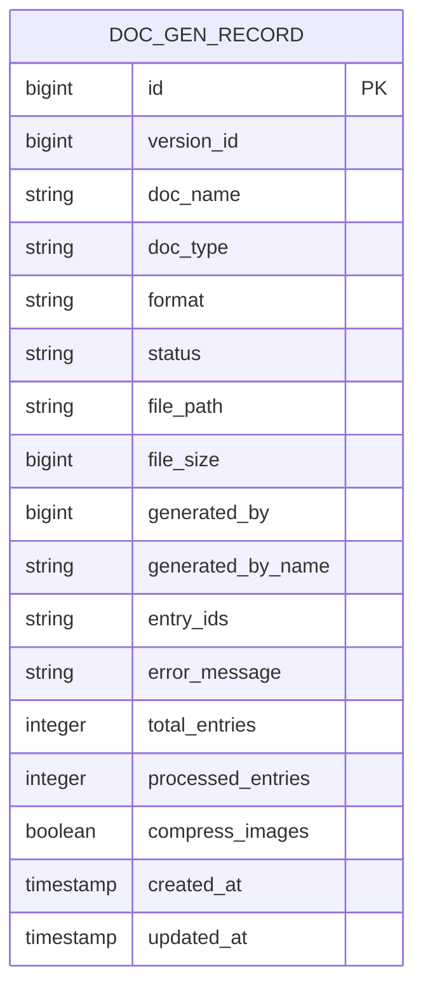
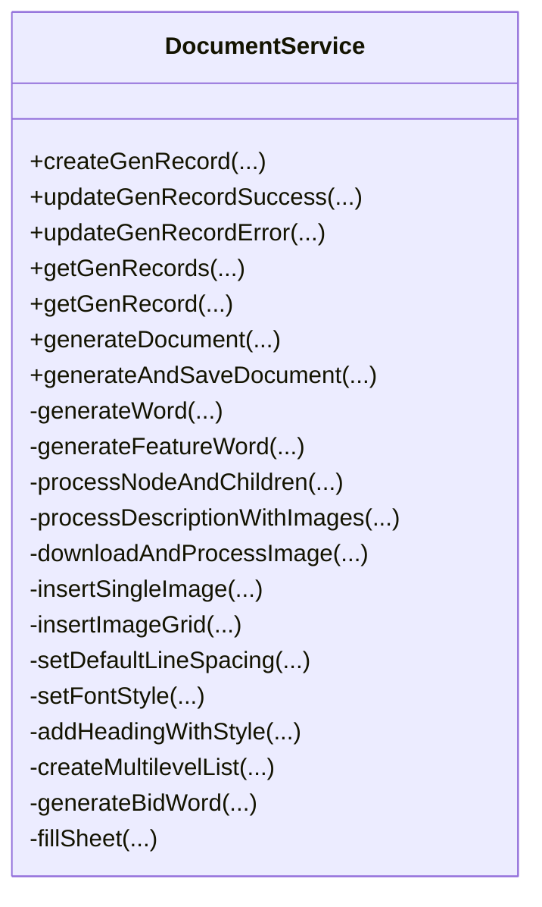
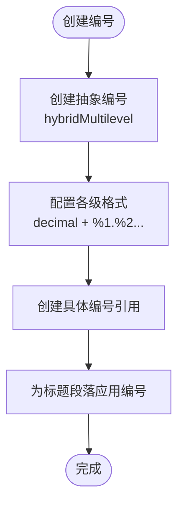
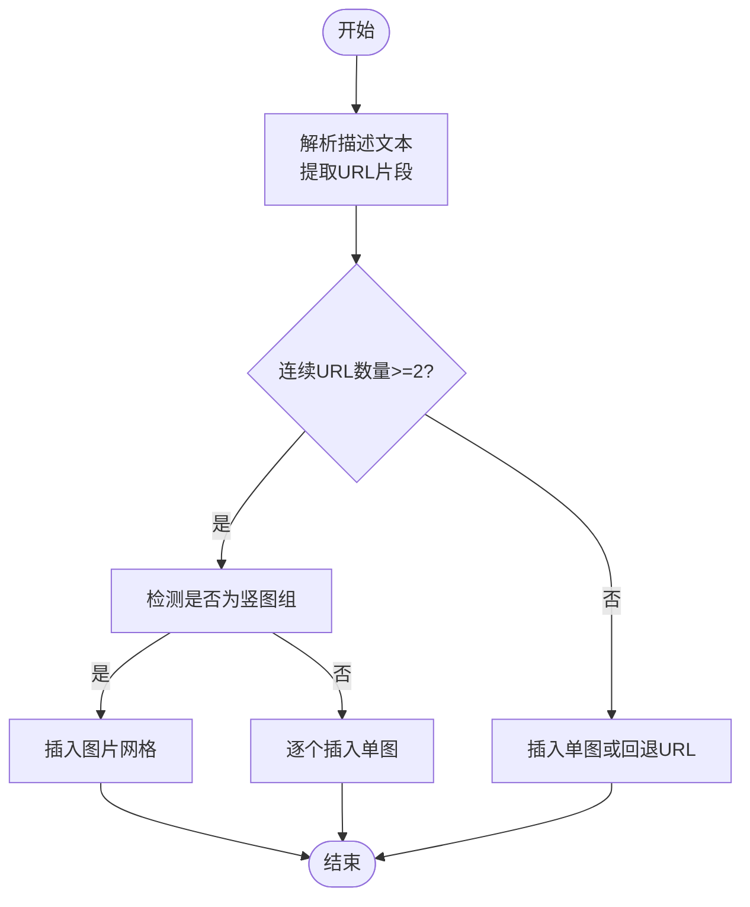
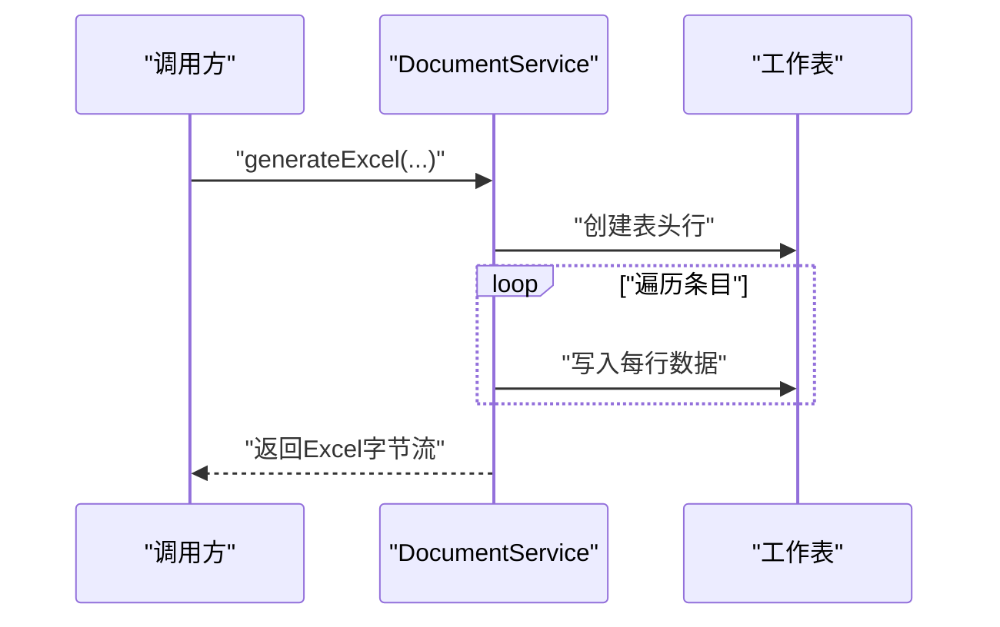
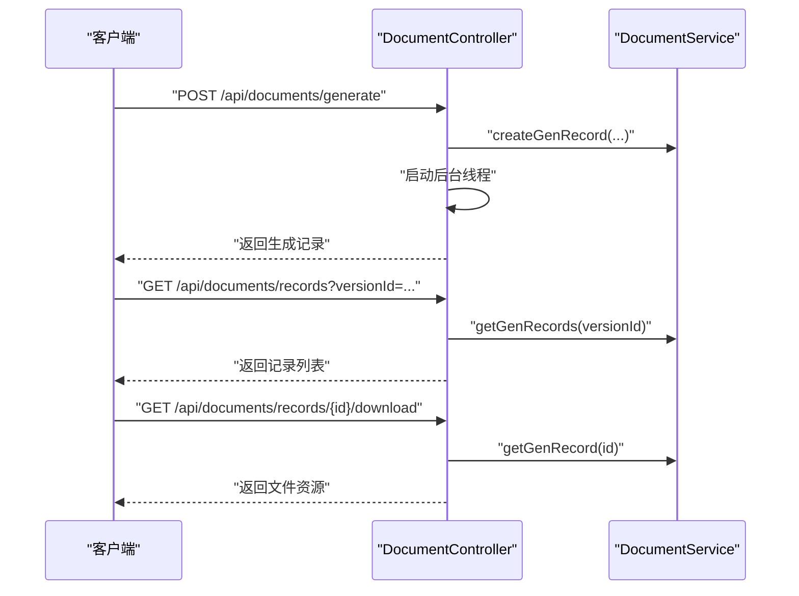
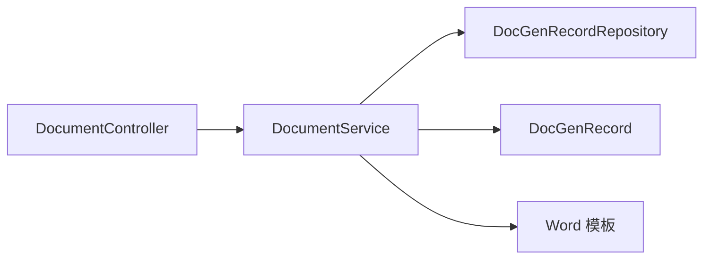

# 文档生成模块

<cite>
**本文引用的文件**
- [DocGenRecord.java](file://src/main/java/com/superpower/modules/document/entity/DocGenRecord.java)
- [DocGenRecordRepository.java](file://src/main/java/com/superpower/modules/document/repository/DocGenRecordRepository.java)
- [DocumentService.java](file://src/main/java/com/superpower/modules/document/service/DocumentService.java)
- [DocumentController.java](file://src/main/java/com/superpower/modules/document/controller/DocumentController.java)
- [DocGenerateRequest.java](file://src/main/java/com/superpower/modules/document/dto/DocGenerateRequest.java)
- [numbering.xml](file://src/main/resources/templates/word/numbering.xml)
- [styles.xml](file://src/main/resources/templates/word/styles.xml)
- [20260531_add_doc_gen_record_doc_name.sql](file://db_changes/20260531_add_doc_gen_record_doc_name.sql)
</cite>

## 目录
1. [简介](#简介)
2. [项目结构](#项目结构)
3. [核心组件](#核心组件)
4. [架构总览](#架构总览)
5. [详细组件分析](#详细组件分析)
6. [依赖关系分析](#依赖关系分析)
7. [性能考虑](#性能考虑)
8. [故障排除指南](#故障排除指南)
9. [结论](#结论)
10. [附录](#附录)

## 简介
本技术文档围绕文档生成模块展开，重点解析以下方面：
- 文档生成服务（DocumentService）的实现原理，包括 Word 模板处理、样式应用与批量文档生成机制
- 文档实体（DocGenRecord）的设计，包括生成记录管理、状态跟踪与结果存储
- 控制器层的 API 设计，包括文档生成请求处理、进度监控与下载管理
- Word 模板系统、XML 结构处理、样式表应用与编号系统实现
- 性能优化策略、模板定制指南与故障排除方法

该模块支持生成 Word 和 Excel 两种格式的文档，按业务分类 → 业务域 → 产品树层级结构进行内容组织，并提供图片下载嵌入、多级编号、样式设置等能力。

## 项目结构
文档生成模块位于后端 Java 工程的 `src/main/java/com/superpower/modules/document` 目录下，采用分层架构：
- 实体层：DocGenRecord（生成记录）
- 仓储层：DocGenRecordRepository（记录持久化）
- 服务层：DocumentService（核心生成逻辑）
- 控制器层：DocumentController（HTTP 接口）
- DTO 层：DocGenerateRequest（请求参数封装）
- 资源层：Word 模板（styles.xml、numbering.xml）

图表来源
- [DocumentController.java:1-120](file://src/main/java/com/superpower/modules/document/controller/DocumentController.java#L1-L120)
- [DocumentService.java:1-120](file://src/main/java/com/superpower/modules/document/service/DocumentService.java#L1-L120)
- [DocGenRecord.java:1-62](file://src/main/java/com/superpower/modules/document/entity/DocGenRecord.java#L1-L62)
- [DocGenRecordRepository.java:1-88](file://src/main/java/com/superpower/modules/document/repository/DocGenRecordRepository.java#L1-L88)
- [DocGenerateRequest.java:1-200](file://src/main/java/com/superpower/modules/document/dto/DocGenerateRequest.java#L1-L200)
- [styles.xml:1-200](file://src/main/resources/templates/word/styles.xml#L1-L200)
- [numbering.xml:1-200](file://src/main/resources/templates/word/numbering.xml#L1-L200)

章节来源
- [DocumentController.java:1-120](file://src/main/java/com/superpower/modules/document/controller/DocumentController.java#L1-L120)
- [DocumentService.java:1-120](file://src/main/java/com/superpower/modules/document/service/DocumentService.java#L1-L120)
- [DocGenRecord.java:1-62](file://src/main/java/com/superpower/modules/document/entity/DocGenRecord.java#L1-L62)
- [DocGenRecordRepository.java:1-88](file://src/main/java/com/superpower/modules/document/repository/DocGenRecordRepository.java#L1-L88)
- [DocGenerateRequest.java:1-200](file://src/main/java/com/superpower/modules/document/dto/DocGenerateRequest.java#L1-L200)
- [styles.xml:1-200](file://src/main/resources/templates/word/styles.xml#L1-L200)
- [numbering.xml:1-200](file://src/main/resources/templates/word/numbering.xml#L1-L200)

## 核心组件
- 文档实体（DocGenRecord）：用于记录每次文档生成任务的状态、输入数据、输出文件信息与时间戳等元数据
- 生成记录仓储（DocGenRecordRepository）：提供按版本查询生成记录列表的能力
- 文档生成服务（DocumentService）：负责创建生成记录、执行 Word/Excel 生成、保存文件、更新记录状态
- 文档控制器（DocumentController）：提供生成请求接口、记录查询接口与文件下载接口
- 请求 DTO（DocGenerateRequest）：封装前端传入的生成参数（版本、类型、范围、条目 ID 等）
- Word 模板（styles.xml、numbering.xml）：定义默认样式与多级编号规则

章节来源
- [DocGenRecord.java:1-62](file://src/main/java/com/superpower/modules/document/entity/DocGenRecord.java#L1-L62)
- [DocGenRecordRepository.java:1-88](file://src/main/java/com/superpower/modules/document/repository/DocGenRecordRepository.java#L1-L88)
- [DocumentService.java:1-120](file://src/main/java/com/superpower/modules/document/service/DocumentService.java#L1-L120)
- [DocumentController.java:1-120](file://src/main/java/com/superpower/modules/document/controller/DocumentController.java#L1-L120)
- [DocGenerateRequest.java:1-200](file://src/main/java/com/superpower/modules/document/dto/DocGenerateRequest.java#L1-L200)
- [styles.xml:1-200](file://src/main/resources/templates/word/styles.xml#L1-L200)
- [numbering.xml:1-200](file://src/main/resources/templates/word/numbering.xml#L1-L200)

## 架构总览
文档生成模块遵循典型的三层架构：
- 表现层：RESTful API，负责接收请求、返回结果与文件下载
- 业务层：生成服务封装了 Word/Excel 生成、图片处理、编号与样式应用
- 数据访问层：通过 JPA 仓储管理生成记录的持久化

图表来源
- [DocumentController.java:835-899](file://src/main/java/com/superpower/modules/document/controller/DocumentController.java#L835-L899)
- [DocumentService.java:207-242](file://src/main/java/com/superpower/modules/document/service/DocumentService.java#L207-L242)
- [DocGenRecordRepository.java:84-87](file://src/main/java/com/superpower/modules/document/repository/DocGenRecordRepository.java#L84-L87)
- [styles.xml:1-200](file://src/main/resources/templates/word/styles.xml#L1-L200)
- [numbering.xml:1-200](file://src/main/resources/templates/word/numbering.xml#L1-L200)

## 详细组件分析

### 文档实体（DocGenRecord）设计
DocGenRecord 是文档生成记录的核心实体，包含以下关键字段：
- 版本标识、文档类型、格式、状态、文件路径与大小
- 生成人信息（ID 与显示名）、关联条目 ID 列表
- 错误信息、创建与更新时间
- 新增字段：文档名称、总数与已处理条目数、图片压缩开关

图表来源
- [DocGenRecord.java:10-62](file://src/main/java/com/superpower/modules/document/entity/DocGenRecord.java#L10-L62)

章节来源
- [DocGenRecord.java:1-62](file://src/main/java/com/superpower/modules/document/entity/DocGenRecord.java#L1-L62)
- [20260531_add_doc_gen_record_doc_name.sql:1-200](file://db_changes/20260531_add_doc_gen_record_doc_name.sql#L1-L200)

### 生成记录仓储（DocGenRecordRepository）
- 提供按版本 ID 查询生成记录列表的方法，按创建时间倒序排列
- 为控制器层提供记录查询能力，支撑进度与历史记录展示

章节来源
- [DocGenRecordRepository.java:84-87](file://src/main/java/com/superpower/modules/document/repository/DocGenRecordRepository.java#L84-L87)

### 文档生成服务（DocumentService）
DocumentService 是模块的核心，负责：
- 生成记录管理：创建、成功更新、错误更新、查询
- 批量文档生成：根据请求选择全部或指定条目，异步生成 Word 或 Excel
- Word 生成：设置默认行距、创建多级编号、按层级插入标题与正文、处理图片与表格
- 图片处理：下载远程图片、判断竖图并排、网格布局、失败回退
- 样式应用：设置字体、颜色、首行缩进、段落对齐
- Excel 生成：按文档类型填充工作表列头与数据

图表来源
- [DocumentService.java:147-777](file://src/main/java/com/superpower/modules/document/service/DocumentService.java#L147-L777)

#### Word 模板与编号系统
- 默认样式：通过设置 Normal 样式的行间距与字体，统一全文格式
- 多级编号：创建 hybridMultilevel 抽象编号，支持 1-9 级编号格式，自动映射到各级标题样式
- 编号应用：为每个标题段落添加编号属性，确保层级正确

图表来源
- [DocumentService.java:630-664](file://src/main/java/com/superpower/modules/document/service/DocumentService.java#L630-L664)
- [numbering.xml:1-200](file://src/main/resources/templates/word/numbering.xml#L1-L200)

#### 图片处理与表格布局
- 连续 URL 分组：识别描述中的连续图片链接，按竖图特征进行分组
- 竖图并排：最多三列网格，隐藏表格与单元格边框，居中插入图片与小字号图注
- 单图单行：按比例缩放，居中插入图片与图注
- 失败回退：下载失败时插入原始 URL 文本

图表来源
- [DocumentService.java:360-443](file://src/main/java/com/superpower/modules/document/service/DocumentService.java#L360-L443)
- [DocumentService.java:520-575](file://src/main/java/com/superpower/modules/document/service/DocumentService.java#L520-L575)
- [DocumentService.java:491-518](file://src/main/java/com/superpower/modules/document/service/DocumentService.java#L491-L518)

#### Excel 生成流程
- 根据文档类型选择工作表名称与列头
- 遍历条目，按字段映射写入单元格
- 自动调整列宽以适配内容

图表来源
- [DocumentService.java:720-777](file://src/main/java/com/superpower/modules/document/service/DocumentService.java#L720-L777)

章节来源
- [DocumentService.java:147-777](file://src/main/java/com/superpower/modules/document/service/DocumentService.java#L147-L777)
- [styles.xml:1-200](file://src/main/resources/templates/word/styles.xml#L1-L200)
- [numbering.xml:1-200](file://src/main/resources/templates/word/numbering.xml#L1-L200)

### 控制器层（DocumentController）
- 生成接口：接收 DocGenerateRequest，创建生成记录并启动异步生成线程
- 记录查询：按版本 ID 获取生成记录列表
- 文件下载：根据记录状态与文件存在性返回文件资源

图表来源
- [DocumentController.java:845-899](file://src/main/java/com/superpower/modules/document/controller/DocumentController.java#L845-L899)

章节来源
- [DocumentController.java:835-899](file://src/main/java/com/superpower/modules/document/controller/DocumentController.java#L835-L899)
- [DocGenerateRequest.java:1-200](file://src/main/java/com/superpower/modules/document/dto/DocGenerateRequest.java#L1-L200)

## 依赖关系分析
- 控制器依赖服务层；服务层依赖仓储与实体；服务层还依赖 Word 模板资源
- 生成流程中，服务层负责协调数据访问、模板应用与文件写入
- 仓储层仅提供查询能力，不参与生成逻辑

图表来源
- [DocumentController.java:835-899](file://src/main/java/com/superpower/modules/document/controller/DocumentController.java#L835-L899)
- [DocumentService.java:147-777](file://src/main/java/com/superpower/modules/document/service/DocumentService.java#L147-L777)
- [DocGenRecordRepository.java:84-87](file://src/main/java/com/superpower/modules/document/repository/DocGenRecordRepository.java#L84-L87)
- [DocGenRecord.java:1-62](file://src/main/java/com/superpower/modules/document/entity/DocGenRecord.java#L1-L62)

章节来源
- [DocumentController.java:835-899](file://src/main/java/com/superpower/modules/document/controller/DocumentController.java#L835-L899)
- [DocumentService.java:147-777](file://src/main/java/com/superpower/modules/document/service/DocumentService.java#L147-L777)
- [DocGenRecordRepository.java:84-87](file://src/main/java/com/superpower/modules/document/repository/DocGenRecordRepository.java#L84-L87)
- [DocGenRecord.java:1-62](file://src/main/java/com/superpower/modules/document/entity/DocGenRecord.java#L1-L62)

## 性能考虑
- 异步生成：控制器启动独立线程执行生成，避免阻塞请求线程
- 图片处理：下载远程图片时设置连接与读取超时，失败快速回退，减少阻塞
- 文件写入：生成完成后一次性写入磁盘，避免频繁 IO
- 编号与样式：通过模板与抽象编号减少重复样式设置开销
- 建议优化方向：
  - 使用线程池替代直接 new Thread，便于限流与资源控制
  - 对大文档生成增加进度上报与取消机制
  - 对图片进行压缩与缓存，降低网络与存储压力
  - 对 Excel 生成增加分页写入，避免内存峰值过高

## 故障排除指南
- 生成记录状态异常
  - 现象：记录状态长期为 generating 或出现 error
  - 排查：检查服务层异常捕获与错误消息更新逻辑
  - 参考：[DocumentController.java:860-867](file://src/main/java/com/superpower/modules/document/controller/DocumentController.java#L860-L867)、[DocumentService.java:187-195](file://src/main/java/com/superpower/modules/document/service/DocumentService.java#L187-L195)
- 下载文件不存在
  - 现象：下载接口返回 404
  - 排查：确认记录状态为 completed 且文件路径存在
  - 参考：[DocumentController.java:877-898](file://src/main/java/com/superpower/modules/document/controller/DocumentController.java#L877-L898)
- 图片无法显示
  - 现象：描述中的图片链接未被识别或显示为 URL 文本
  - 排查：检查 URL 格式、响应类型与尺寸读取是否成功
  - 参考：[DocumentService.java:458-489](file://src/main/java/com/superpower/modules/document/service/DocumentService.java#L458-L489)
- 编号层级不正确
  - 现象：标题编号超出预期层级或格式不一致
  - 排查：确认标题级别与编号应用逻辑，检查编号抽象定义
  - 参考：[DocumentService.java:612-628](file://src/main/java/com/superpower/modules/document/service/DocumentService.java#L612-L628)、[numbering.xml:1-200](file://src/main/resources/templates/word/numbering.xml#L1-L200)

章节来源
- [DocumentController.java:860-898](file://src/main/java/com/superpower/modules/document/controller/DocumentController.java#L860-L898)
- [DocumentService.java:187-195](file://src/main/java/com/superpower/modules/document/service/DocumentService.java#L187-L195)
- [DocumentService.java:458-489](file://src/main/java/com/superpower/modules/document/service/DocumentService.java#L458-L489)
- [DocumentService.java:612-628](file://src/main/java/com/superpower/modules/document/service/DocumentService.java#L612-L628)
- [numbering.xml:1-200](file://src/main/resources/templates/word/numbering.xml#L1-L200)

## 结论
文档生成模块通过清晰的分层设计与完善的模板体系，实现了 Word 与 Excel 的批量生成、多级编号与图片嵌入等功能。结合生成记录的生命周期管理与控制器的异步处理，能够满足中大型项目的文档自动化需求。建议后续引入进度上报、取消机制与性能优化，进一步提升用户体验与系统稳定性。

## 附录
- 模板定制指南
  - 样式定制：修改 styles.xml 中的默认样式与段落属性
  - 编号定制：调整 numbering.xml 中的抽象编号与各级格式
  - 注意：编号系统采用 hybridMultilevel，需保持各级格式与标题样式一致
- 数据库变更
  - 新增文档名称字段与进度统计字段，便于记录与展示
  - 参考迁移脚本：[20260531_add_doc_gen_record_doc_name.sql:1-200](file://db_changes/20260531_add_doc_gen_record_doc_name.sql#L1-L200)

章节来源
- [DocGenRecord.java:1-62](file://src/main/java/com/superpower/modules/document/entity/DocGenRecord.java#L1-L62)
- [20260531_add_doc_gen_record_doc_name.sql:1-200](file://db_changes/20260531_add_doc_gen_record_doc_name.sql#L1-L200)
- [styles.xml:1-200](file://src/main/resources/templates/word/styles.xml#L1-L200)
- [numbering.xml:1-200](file://src/main/resources/templates/word/numbering.xml#L1-L200)