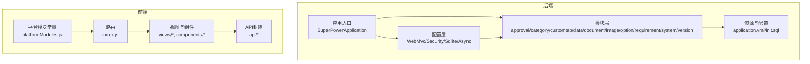
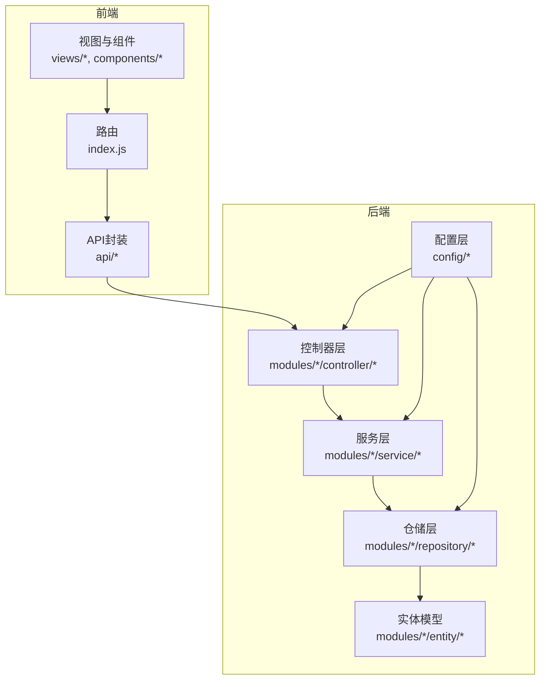
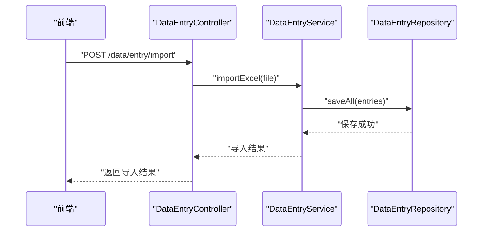
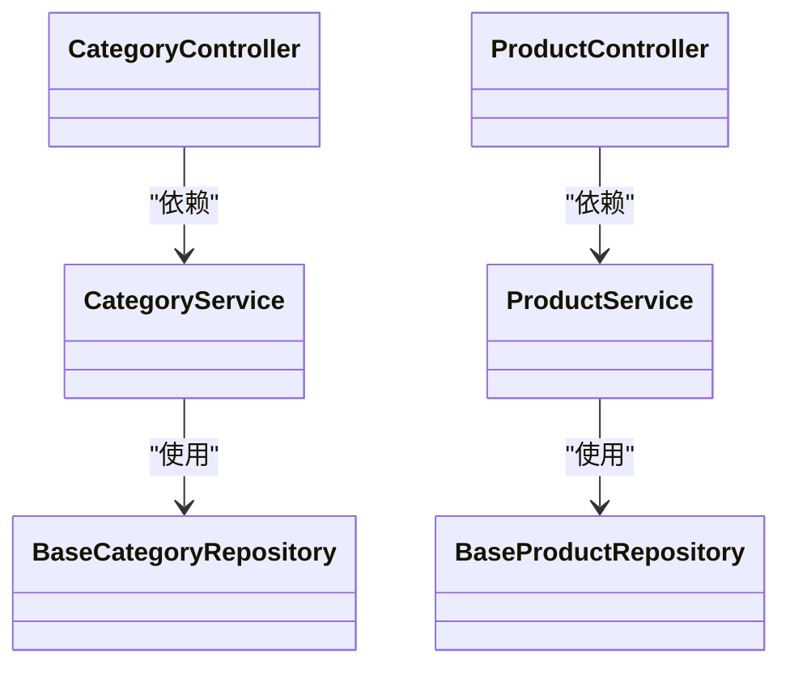
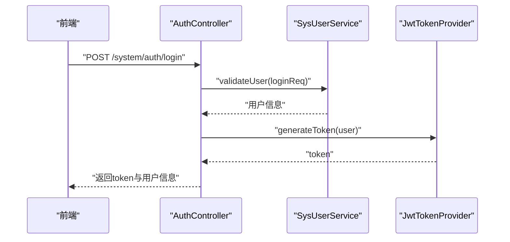
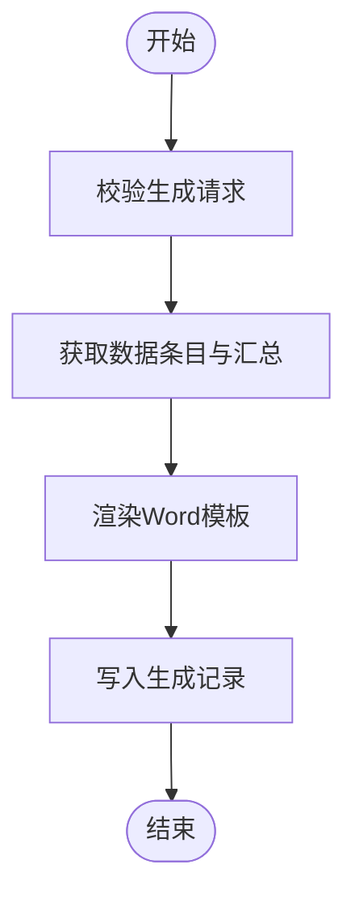
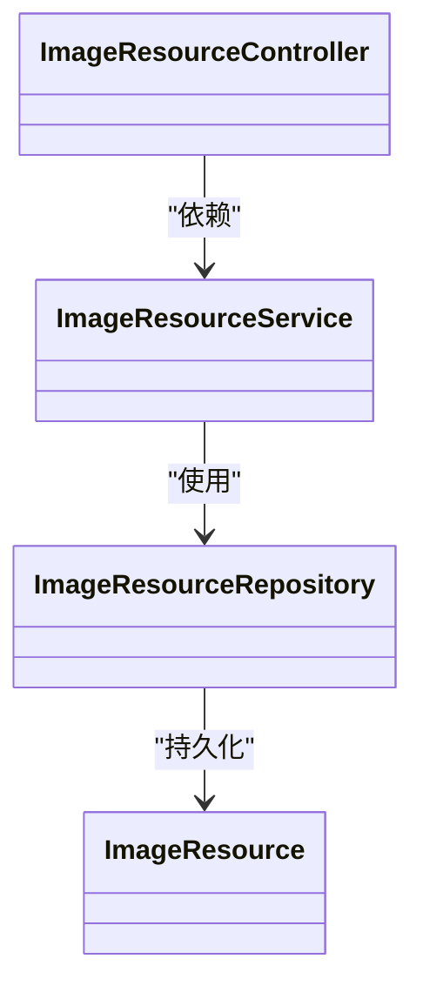
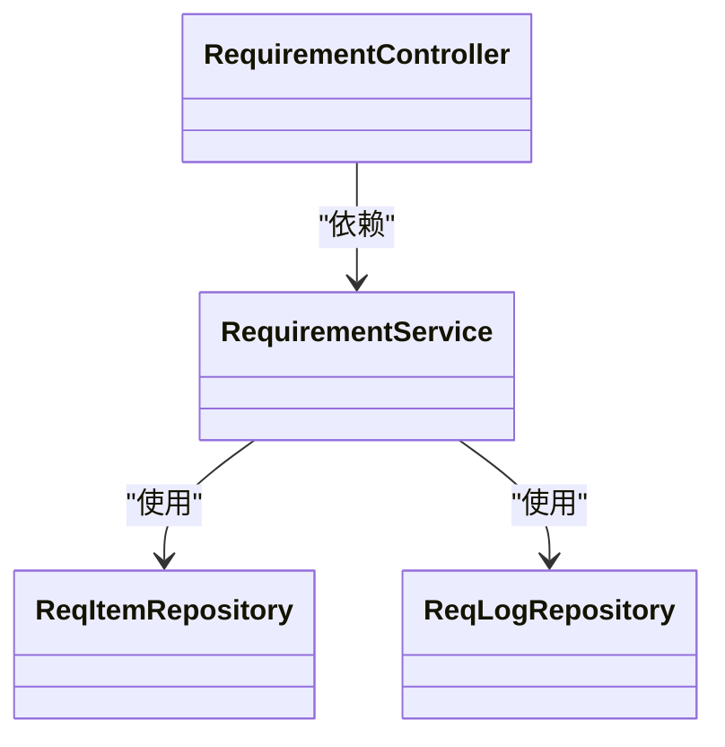
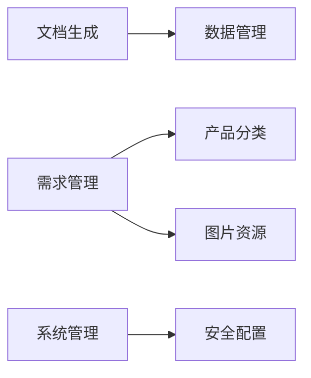

# 模块化架构

<cite>
**本文引用的文件**
- [SuperPowerApplication.java](file://src/main/java/com/superpower/SuperPowerApplication.java)
- [WebMvcConfig.java](file://src/main/java/com/superpower/config/WebMvcConfig.java)
- [SecurityConfig.java](file://src/main/java/com/superpower/config/SecurityConfig.java)
- [SqliteConfig.java](file://src/main/java/com/superpower/config/SqliteConfig.java)
- [AsyncConfig.java](file://src/main/java/com/superpower/config/AsyncConfig.java)
- [application.yml](file://src/main/resources/application.yml)
- [init.sql](file://src/main/resources/db/init.sql)
- [ApprovalController.java](file://src/main/java/com/superpower/modules/approval/controller/ApprovalController.java)
- [ApprovalService.java](file://src/main/java/com/superpower/modules/approval/service/ApprovalService.java)
- [ApprovalLogRepository.java](file://src/main/java/com/superpower/modules/approval/repository/ApprovalLogRepository.java)
- [CategoryController.java](file://src/main/java/com/superpower/modules/category/controller/CategoryController.java)
- [ProductController.java](file://src/main/java/com/superpower/modules/category/controller/ProductController.java)
- [CategoryService.java](file://src/main/java/com/superpower/modules/category/service/CategoryService.java)
- [ProductService.java](file://src/main/java/com/superpower/modules/category/service/ProductService.java)
- [BaseCategoryRepository.java](file://src/main/java/com/superpower/modules/category/repository/BaseCategoryRepository.java)
- [BaseProductRepository.java](file://src/main/java/com/superpower/modules/category/repository/BaseProductRepository.java)
- [CustomTabController.java](file://src/main/java/com/superpower/modules/customtab/controller/CustomTabController.java)
- [CustomTabService.java](file://src/main/java/com/superpower/modules/customtab/service/CustomTabService.java)
- [DataEntryController.java](file://src/main/java/com/superpower/modules/data/controller/DataEntryController.java)
- [DataEntryService.java](file://src/main/java/com/superpower/modules/data/service/DataEntryService.java)
- [DocumentController.java](file://src/main/java/com/superpower/modules/document/controller/DocumentController.java)
- [DocumentService.java](file://src/main/java/com/superpower/modules/document/service/DocumentService.java)
- [ImageResourceController.java](file://src/main/java/com/superpower/modules/image/controller/ImageResourceController.java)
- [ImageResourceService.java](file://src/main/java/com/superpower/modules/image/service/ImageResourceService.java)
- [DataOptionController.java](file://src/main/java/com/superpower/modules/option/controller/DataOptionController.java)
- [DataOptionService.java](file://src/main/java/com/superpower/modules/option/service/DataOptionService.java)
- [RequirementController.java](file://src/main/java/com/superpower/modules/requirement/controller/RequirementController.java)
- [RequirementService.java](file://src/main/java/com/superpower/modules/requirement/service/RequirementService.java)
- [AuthController.java](file://src/main/java/com/superpower/modules/system/controller/AuthController.java)
- [SysRoleController.java](file://src/main/java/com/superpower/modules/system/controller/SysRoleController.java)
- [SysUserService.java](file://src/main/java/com/superpower/modules/system/controller/SysUserController.java)
- [MaintenanceController.java](file://src/main/java/com/superpower/modules/system/controller/MaintenanceController.java)
- [OperationLogController.java](file://src/main/java/com/superpower/modules/system/controller/OperationLogController.java)
- [AppVersionController.java](file://src/main/java/com/superpower/modules/version/controller/AppVersionController.java)
- [DataVersionController.java](file://src/main/java/com/superpower/modules/version/controller/DataVersionController.java)
- [platformModules.js](file://frontend/src/constants/platformModules.js)
- [index.js](file://frontend/src/router/index.js)
- [main.js](file://frontend/src/main.js)
- [DataWorkbench.vue](file://frontend/src/views/dashboard/DataWorkbench.vue)
- [ProductCategoryManage.vue](file://frontend/src/views/system/ProductCategoryManage.vue)
- [RequirementManage.vue](file://frontend/src/views/requirement/RequirementManage.vue)
- [ImageGallery.vue](file://frontend/src/views/system/ImageGallery.vue)
- [AppRoleManage.vue](file://frontend/src/views/system/AppRoleManage.vue)
- [UserManage.vue](file://frontend/src/views/system/UserManage.vue)
- [VersionManage.vue](file://frontend/src/views/system/VersionManage.vue)
- [RequirementFormDialog.vue](file://frontend/src/components/RequirementFormDialog.vue)
- [RequirementImages.vue](file://frontend/src/views/requirement/RequirementImages.vue)
- [request.js](file://frontend/src/utils/request.js)
- [category.js](file://frontend/src/api/category.js)
- [product.js](file://frontend/src/api/product.js)
- [requirement.js](file://frontend/src/api/requirement.js)
- [image.js](file://frontend/src/api/image.js)
- [document.js](file://frontend/src/api/document.js)
- [CustomTabServiceTest.java](file://src/test/java/com/superpower/modules/customtab/service/CustomTabServiceTest.java)
- [DataEntryServiceTest.java](file://src/test/java/com/superpower/modules/data/service/DataEntryServiceTest.java)
- [DocumentServiceTest.java](file://src/test/java/com/superpower/modules/document/service/DocumentServiceTest.java)
</cite>

## 目录
1. [引言](#引言)
2. [项目结构](#项目结构)
3. [核心组件](#核心组件)
4. [架构总览](#架构总览)
5. [详细组件分析](#详细组件分析)
6. [依赖分析](#依赖分析)
7. [性能考虑](#性能考虑)
8. [故障排查指南](#故障排查指南)
9. [结论](#结论)
10. [附录](#附录)

## 引言
本文件面向产品清单管理系统的模块化架构，系统采用后端分层与前端模块化相结合的设计：后端以功能域划分模块（审批、分类、自定义标签、数据条目、文档生成、图片资源、选项、需求、系统管理、版本），每个模块遵循控制器-服务-仓储三层结构；前端通过平台模块常量、路由与视图组件实现模块化展示与交互。文档旨在帮助开发者理解各模块职责边界、接口设计、模块间通信机制，并提供可扩展、解耦、可配置与可测试的实践指南。

## 项目结构
后端采用按功能域划分的模块化目录结构，每个模块包含controller、service、repository、entity、dto等子包，确保高内聚低耦合。前端通过constants、router、views、components、api等组织模块化代码，形成前后端一致的模块化风格。

**图表来源**
- [SuperPowerApplication.java](file://src/main/java/com/superpower/SuperPowerApplication.java)
- [WebMvcConfig.java](file://src/main/java/com/superpower/config/WebMvcConfig.java)
- [SqliteConfig.java](file://src/main/java/com/superpower/config/SqliteConfig.java)
- [platformModules.js](file://frontend/src/constants/platformModules.js)
- [index.js](file://frontend/src/router/index.js)

**章节来源**
- [SuperPowerApplication.java](file://src/main/java/com/superpower/SuperPowerApplication.java)
- [application.yml](file://src/main/resources/application.yml)
- [init.sql](file://src/main/resources/db/init.sql)
- [platformModules.js](file://frontend/src/constants/platformModules.js)
- [index.js](file://frontend/src/router/index.js)

## 核心组件
- 应用入口与配置
  - 应用入口负责启动Spring Boot应用，加载全局配置与模块。
  - 配置类涵盖Web MVC、安全、SQLite数据源、异步任务等，统一管理跨模块行为。
- 模块化控制器
  - 各模块控制器负责HTTP请求处理与响应封装，调用对应服务层完成业务逻辑。
- 服务层
  - 负责编排领域操作、事务控制与跨仓储协作，保证业务规则与幂等性。
- 仓储层
  - 封装数据访问细节，提供类型安全的查询与更新能力，隔离数据库差异。
- 前端模块
  - 平台模块常量定义模块清单；路由定义页面映射；视图与组件承载UI与交互；API封装对接后端REST接口。

**章节来源**
- [SuperPowerApplication.java](file://src/main/java/com/superpower/SuperPowerApplication.java)
- [WebMvcConfig.java](file://src/main/java/com/superpower/config/WebMvcConfig.java)
- [SecurityConfig.java](file://src/main/java/com/superpower/config/SecurityConfig.java)
- [SqliteConfig.java](file://src/main/java/com/superpower/config/SqliteConfig.java)
- [AsyncConfig.java](file://src/main/java/com/superpower/config/AsyncConfig.java)
- [platformModules.js](file://frontend/src/constants/platformModules.js)
- [index.js](file://frontend/src/router/index.js)

## 架构总览
系统采用“控制器-服务-仓储”三层架构，结合模块化设计实现高内聚低耦合。后端模块之间通过服务接口进行松耦合交互；前端通过API模块与后端REST接口解耦。配置层集中管理跨模块行为，如安全过滤、异步任务与数据源。

**图表来源**
- [index.js](file://frontend/src/router/index.js)
- [request.js](file://frontend/src/utils/request.js)
- [category.js](file://frontend/src/api/category.js)
- [product.js](file://frontend/src/api/product.js)
- [requirement.js](file://frontend/src/api/requirement.js)
- [image.js](file://frontend/src/api/image.js)
- [document.js](file://frontend/src/api/document.js)
- [ApprovalController.java](file://src/main/java/com/superpower/modules/approval/controller/ApprovalController.java)
- [ApprovalService.java](file://src/main/java/com/superpower/modules/approval/service/ApprovalService.java)
- [ApprovalLogRepository.java](file://src/main/java/com/superpower/modules/approval/repository/ApprovalLogRepository.java)
- [WebMvcConfig.java](file://src/main/java/com/superpower/config/WebMvcConfig.java)
- [SecurityConfig.java](file://src/main/java/com/superpower/config/SecurityConfig.java)
- [SqliteConfig.java](file://src/main/java/com/superpower/config/SqliteConfig.java)

## 详细组件分析

### 数据管理模块（data）
- 职责边界
  - 管理数据条目的增删改查、导入导出、编号重排与树形节点转换。
- 接口设计
  - 控制器提供REST接口，接收DTO参数，返回标准结果对象。
  - 服务层编排导入流程、校验与编号重排策略。
  - 仓储层提供数据条目持久化与查询能力。
- 模块间通信
  - 可被文档生成模块在生成报告时引用编号与汇总信息。
- 处理流程（序列图）

**图表来源**
- [DataEntryController.java](file://src/main/java/com/superpower/modules/data/controller/DataEntryController.java)
- [DataEntryService.java](file://src/main/java/com/superpower/modules/data/service/DataEntryService.java)
- [DataEntryRepository.java](file://src/main/java/com/superpower/modules/data/repository/DataEntryRepository.java)

**章节来源**
- [DataEntryController.java](file://src/main/java/com/superpower/modules/data/controller/DataEntryController.java)
- [DataEntryService.java](file://src/main/java/com/superpower/modules/data/service/DataEntryService.java)
- [DataEntryRepository.java](file://src/main/java/com/superpower/modules/data/repository/DataEntryRepository.java)

### 产品分类模块（category）
- 职责边界
  - 维护产品分类层级与基础产品数据，支持L1/L2层级与域名维度。
- 接口设计
  - 分类控制器与产品控制器分别处理分类与产品的CRUD。
  - 服务层负责分类树构建、产品查询与初始化数据。
- 模块间通信
  - 与需求模块共享分类与产品元数据，支撑需求项关联。
- 类关系图

**图表来源**
- [CategoryController.java](file://src/main/java/com/superpower/modules/category/controller/CategoryController.java)
- [ProductController.java](file://src/main/java/com/superpower/modules/category/controller/ProductController.java)
- [CategoryService.java](file://src/main/java/com/superpower/modules/category/service/CategoryService.java)
- [ProductService.java](file://src/main/java/com/superpower/modules/category/service/ProductService.java)
- [BaseCategoryRepository.java](file://src/main/java/com/superpower/modules/category/repository/BaseCategoryRepository.java)
- [BaseProductRepository.java](file://src/main/java/com/superpower/modules/category/repository/BaseProductRepository.java)

**章节来源**
- [CategoryController.java](file://src/main/java/com/superpower/modules/category/controller/CategoryController.java)
- [ProductController.java](file://src/main/java/com/superpower/modules/category/controller/ProductController.java)
- [CategoryService.java](file://src/main/java/com/superpower/modules/category/service/CategoryService.java)
- [ProductService.java](file://src/main/java/com/superpower/modules/category/service/ProductService.java)
- [BaseCategoryRepository.java](file://src/main/java/com/superpower/modules/category/repository/BaseCategoryRepository.java)
- [BaseProductRepository.java](file://src/main/java/com/superpower/modules/category/repository/BaseProductRepository.java)

### 系统管理模块（system）
- 职责边界
  - 用户、角色、菜单、操作日志与维护工具的管理。
- 接口设计
  - 提供认证、用户管理、角色管理、日志查询与系统维护接口。
- 安全与配置
  - 结合安全配置与在线追踪，保障接口访问控制与审计。
- 流程图（登录序列）

**图表来源**
- [AuthController.java](file://src/main/java/com/superpower/modules/system/controller/AuthController.java)
- [SysUserService.java](file://src/main/java/com/superpower/modules/system/controller/SysUserController.java)
- [SecurityConfig.java](file://src/main/java/com/superpower/config/SecurityConfig.java)

**章节来源**
- [AuthController.java](file://src/main/java/com/superpower/modules/system/controller/AuthController.java)
- [SysRoleController.java](file://src/main/java/com/superpower/modules/system/controller/SysRoleController.java)
- [SysUserService.java](file://src/main/java/com/superpower/modules/system/controller/SysUserController.java)
- [OperationLogController.java](file://src/main/java/com/superpower/modules/system/controller/OperationLogController.java)
- [MaintenanceController.java](file://src/main/java/com/superpower/modules/system/controller/MaintenanceController.java)
- [SecurityConfig.java](file://src/main/java/com/superpower/config/SecurityConfig.java)

### 文档生成模块（document）
- 职责边界
  - 生成Word文档，记录生成历史，支持编号与样式模板。
- 接口设计
  - 控制器接收生成请求，服务层编排模板与数据，仓储记录生成记录。
- 模块间通信
  - 与数据管理模块协作，读取条目与汇总信息用于填充文档。
- 流程图（生成流程）

**图表来源**
- [DocumentController.java](file://src/main/java/com/superpower/modules/document/controller/DocumentController.java)
- [DocumentService.java](file://src/main/java/com/superpower/modules/document/service/DocumentService.java)
- [DocGenRecordRepository.java](file://src/main/java/com/superpower/modules/document/repository/DocGenRecordRepository.java)

**章节来源**
- [DocumentController.java](file://src/main/java/com/superpower/modules/document/controller/DocumentController.java)
- [DocumentService.java](file://src/main/java/com/superpower/modules/document/service/DocumentService.java)
- [DocGenRecordRepository.java](file://src/main/java/com/superpower/modules/document/repository/DocGenRecordRepository.java)

### 图片资源模块（image）
- 职责边界
  - 管理图片资源、目录结构与迁移进度，支持深度与URL修复。
- 接口设计
  - 提供图片资源查询、目录树构建与迁移状态查询。
- 模块间通信
  - 与需求模块共享图片资源，支撑需求项图片管理。
- 类关系图

**图表来源**
- [ImageResourceController.java](file://src/main/java/com/superpower/modules/image/controller/ImageResourceController.java)
- [ImageResourceService.java](file://src/main/java/com/superpower/modules/image/service/ImageResourceService.java)
- [ImageResourceRepository.java](file://src/main/java/com/superpower/modules/image/repository/ImageResourceRepository.java)
- [ImageResource.java](file://src/main/java/com/superpower/modules/image/entity/ImageResource.java)

**章节来源**
- [ImageResourceController.java](file://src/main/java/com/superpower/modules/image/controller/ImageResourceController.java)
- [ImageResourceService.java](file://src/main/java/com/superpower/modules/image/service/ImageResourceService.java)
- [ImageResourceRepository.java](file://src/main/java/com/superpower/modules/image/repository/ImageResourceRepository.java)
- [ImageResource.java](file://src/main/java/com/superpower/modules/image/entity/ImageResource.java)

### 需求管理模块（requirement）
- 职责边界
  - 管理需求项与操作日志，支持类型、动作与关联资源。
- 接口设计
  - 控制器提供需求项CRUD与批量操作，服务层编排业务规则。
- 模块间通信
  - 与分类、产品、图片模块协同，建立需求项与实体的关联。
- 类关系图

**图表来源**
- [RequirementController.java](file://src/main/java/com/superpower/modules/requirement/controller/RequirementController.java)
- [RequirementService.java](file://src/main/java/com/superpower/modules/requirement/service/RequirementService.java)
- [ReqItemRepository.java](file://src/main/java/com/superpower/modules/requirement/repository/ReqItemRepository.java)
- [ReqLogRepository.java](file://src/main/java/com/superpower/modules/requirement/repository/ReqLogRepository.java)

**章节来源**
- [RequirementController.java](file://src/main/java/com/superpower/modules/requirement/controller/RequirementController.java)
- [RequirementService.java](file://src/main/java/com/superpower/modules/requirement/service/RequirementService.java)
- [ReqItemRepository.java](file://src/main/java/com/superpower/modules/requirement/repository/ReqItemRepository.java)
- [ReqLogRepository.java](file://src/main/java/com/superpower/modules/requirement/repository/ReqLogRepository.java)

### 其他模块（approval、customtab、option、version）
- 审批模块（approval）
  - 职责：审批流程日志管理。
  - 关键类：ApprovalController、ApprovalService、ApprovalLogRepository。
- 自定义标签模块（customtab）
  - 职责：自定义标签与条目管理。
  - 关键类：CustomTabController、CustomTabService、CustomTabRepository。
- 选项模块（option）
  - 职责：数据选项管理。
  - 关键类：DataOptionController、DataOptionService、DataOptionRepository。
- 版本模块（version）
  - 职责：应用与数据版本管理。
  - 关键类：AppVersionController、DataVersionController、DataVersionRepository。

**章节来源**
- [ApprovalController.java](file://src/main/java/com/superpower/modules/approval/controller/ApprovalController.java)
- [ApprovalService.java](file://src/main/java/com/superpower/modules/approval/service/ApprovalService.java)
- [ApprovalLogRepository.java](file://src/main/java/com/superpower/modules/approval/repository/ApprovalLogRepository.java)
- [CustomTabController.java](file://src/main/java/com/superpower/modules/customtab/controller/CustomTabController.java)
- [CustomTabService.java](file://src/main/java/com/superpower/modules/customtab/service/CustomTabService.java)
- [DataOptionController.java](file://src/main/java/com/superpower/modules/option/controller/DataOptionController.java)
- [DataOptionService.java](file://src/main/java/com/superpower/modules/option/service/DataOptionService.java)
- [AppVersionController.java](file://src/main/java/com/superpower/modules/version/controller/AppVersionController.java)
- [DataVersionController.java](file://src/main/java/com/superpower/modules/version/controller/DataVersionController.java)

## 依赖分析
- 模块内依赖
  - 控制器仅依赖服务接口，服务依赖仓储接口，仓储依赖实体与数据库抽象。
- 模块间依赖
  - 文档生成依赖数据管理；需求管理依赖分类/产品/图片；系统管理依赖安全配置。
- 外部依赖
  - Spring Boot、Spring Security、SQLite、异步任务配置。

**图表来源**
- [DocumentService.java](file://src/main/java/com/superpower/modules/document/service/DocumentService.java)
- [RequirementService.java](file://src/main/java/com/superpower/modules/requirement/service/RequirementService.java)
- [CategoryService.java](file://src/main/java/com/superpower/modules/category/service/CategoryService.java)
- [ImageResourceService.java](file://src/main/java/com/superpower/modules/image/service/ImageResourceService.java)
- [SecurityConfig.java](file://src/main/java/com/superpower/config/SecurityConfig.java)

**章节来源**
- [DocumentService.java](file://src/main/java/com/superpower/modules/document/service/DocumentService.java)
- [RequirementService.java](file://src/main/java/com/superpower/modules/requirement/service/RequirementService.java)
- [CategoryService.java](file://src/main/java/com/superpower/modules/category/service/CategoryService.java)
- [ImageResourceService.java](file://src/main/java/com/superpower/modules/image/service/ImageResourceService.java)
- [SecurityConfig.java](file://src/main/java/com/superpower/config/SecurityConfig.java)

## 性能考虑
- 异步处理
  - 使用异步配置处理耗时任务（如文档生成、图片迁移）。
- 缓存与索引
  - 对高频查询字段建立索引，减少数据库压力。
- 批量操作
  - 导入与编号重排采用批量提交，提升吞吐量。
- 连接池与超时
  - 合理设置数据源连接池与SQL超时，避免阻塞。

**章节来源**
- [AsyncConfig.java](file://src/main/java/com/superpower/config/AsyncConfig.java)
- [SqliteConfig.java](file://src/main/java/com/superpower/config/SqliteConfig.java)

## 故障排查指南
- 常见问题
  - 认证失败：检查安全配置与JWT生成逻辑。
  - 数据导入异常：核对Excel格式与DTO映射，查看导入结果。
  - 文档生成卡顿：检查模板与数据量，启用异步任务。
  - 图片迁移失败：确认目录深度与URL修复脚本执行情况。
- 日志与监控
  - 操作日志控制器提供审计轨迹，便于定位问题。
- 单元测试
  - 各模块Service提供单元测试样例，覆盖关键流程。

**章节来源**
- [SecurityConfig.java](file://src/main/java/com/superpower/config/SecurityConfig.java)
- [DataEntryServiceTest.java](file://src/test/java/com/superpower/modules/data/service/DataEntryServiceTest.java)
- [DocumentServiceTest.java](file://src/test/java/com/superpower/modules/document/service/DocumentServiceTest.java)
- [CustomTabServiceTest.java](file://src/test/java/com/superpower/modules/customtab/service/CustomTabServiceTest.java)
- [OperationLogController.java](file://src/main/java/com/superpower/modules/system/controller/OperationLogController.java)

## 结论
该系统通过模块化架构实现了清晰的职责边界与良好的可扩展性。后端以功能域划分模块，前端以平台模块常量与路由组织界面，配合统一的配置层与REST API，形成高内聚低耦合的整体设计。建议在新增模块时遵循现有分层与命名规范，确保接口契约稳定与测试覆盖完善。

## 附录
- 模块开发指南
  - 新增模块步骤：创建controller/service/repository/entity/dto包；编写接口与实现；注册路由与权限；补充单元测试。
  - 依赖注入：通过Spring自动装配或构造函数注入，避免硬编码。
  - 配置管理：在application.yml中新增模块相关配置，必要时新增配置类。
- 模块集成示例
  - 前端：在platformModules.js声明模块，在router中注册视图，通过api/*封装接口。
  - 后端：在SuperPowerApplication扫描路径下新增模块包，控制器暴露REST接口，服务层编排业务。

**章节来源**
- [platformModules.js](file://frontend/src/constants/platformModules.js)
- [index.js](file://frontend/src/router/index.js)
- [main.js](file://frontend/src/main.js)
- [SuperPowerApplication.java](file://src/main/java/com/superpower/SuperPowerApplication.java)
- [application.yml](file://src/main/resources/application.yml)