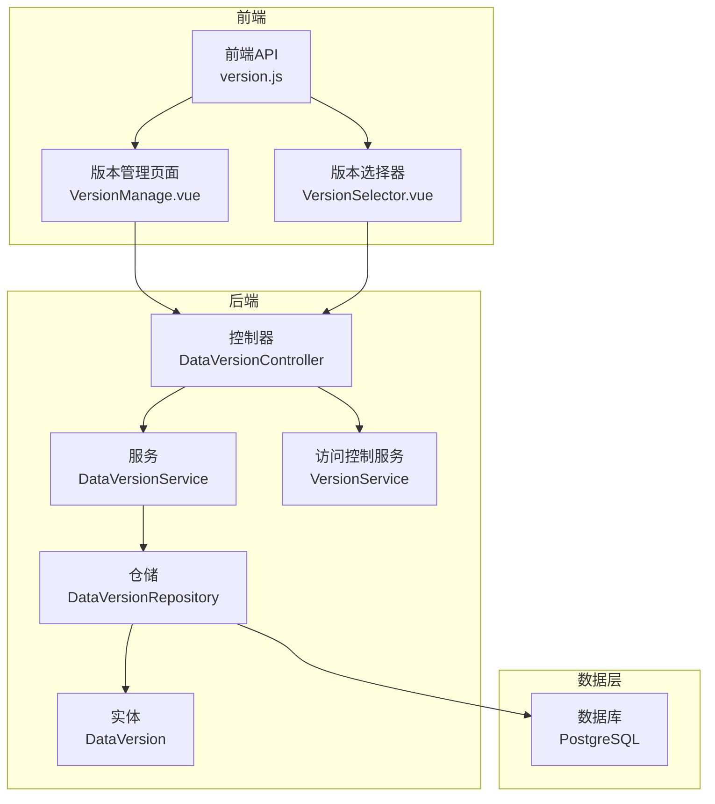
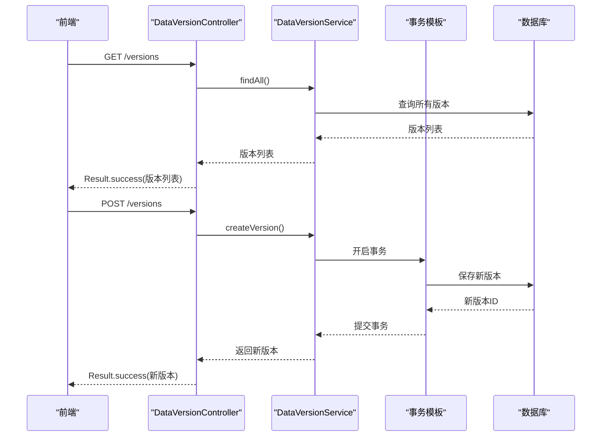
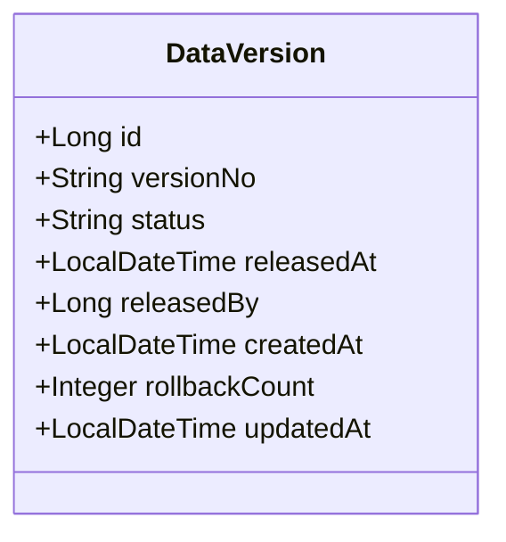
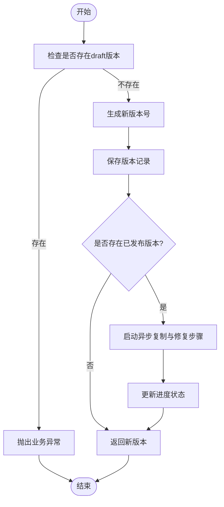
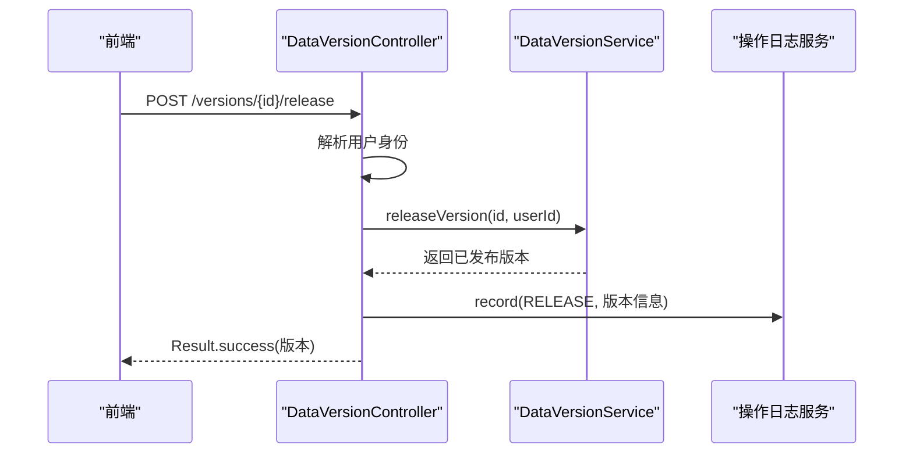
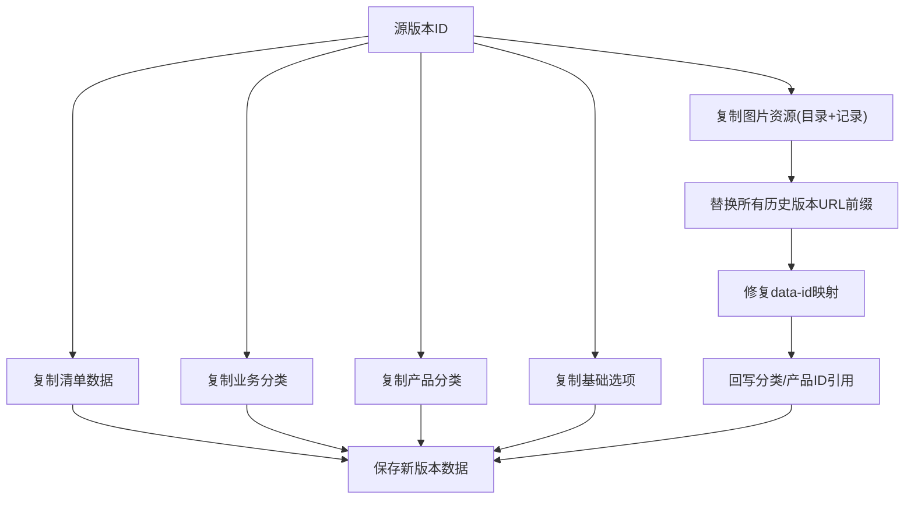
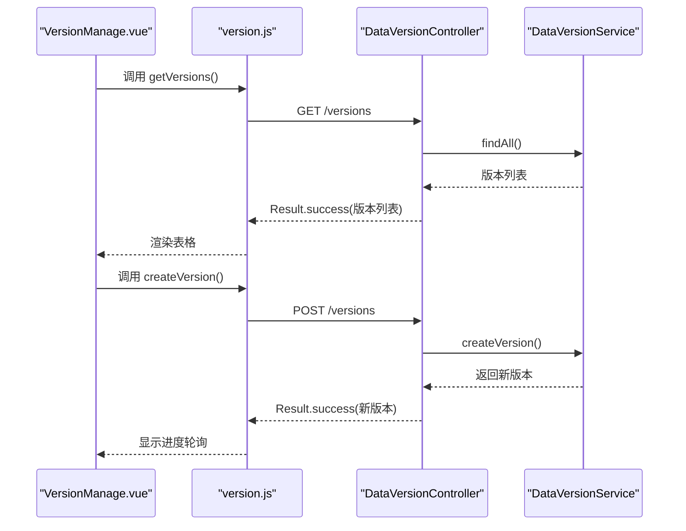
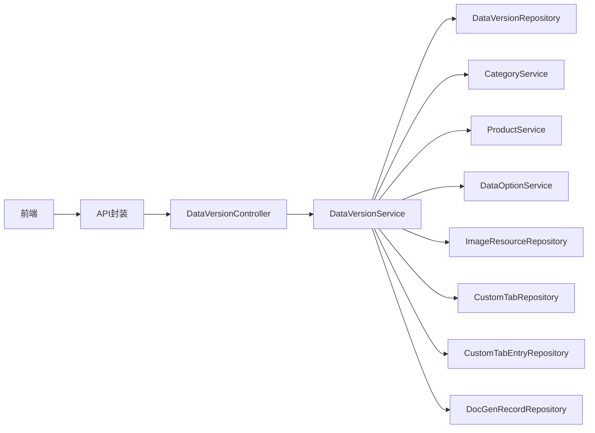

# 版本控制模块

<cite>
**本文档引用的文件**
- [DataVersion.java](file://src/main/java/com/superpower/modules/version/entity/DataVersion.java)
- [DataVersionService.java](file://src/main/java/com/superpower/modules/version/service/DataVersionService.java)
- [VersionService.java](file://src/main/java/com/superpower/modules/version/service/VersionService.java)
- [DataVersionController.java](file://src/main/java/com/superpower/modules/version/controller/DataVersionController.java)
- [DataVersionRepository.java](file://src/main/java/com/superpower/modules/version/repository/DataVersionRepository.java)
- [version.js](file://frontend/src/api/version.js)
- [VersionManage.vue](file://frontend/src/views/system/VersionManage.vue)
- [VersionSelector.vue](file://frontend/src/components/VersionSelector.vue)
- [init.sql](file://src/main/resources/db/init.sql)
- [VERSION.md](file://VERSION.md)
</cite>

## 目录
1. [简介](#简介)
2. [项目结构](#项目结构)
3. [核心组件](#核心组件)
4. [架构总览](#架构总览)
5. [详细组件分析](#详细组件分析)
6. [依赖关系分析](#依赖关系分析)
7. [性能考虑](#性能考虑)
8. [故障排查指南](#故障排查指南)
9. [结论](#结论)
10. [附录](#附录)

## 简介
本文件面向版本控制模块，系统性阐述数据版本实体(DataVersion)的设计、版本服务(DataVersionService)的实现、控制器层API设计以及版本管理策略。内容覆盖版本创建、切换、比较与回滚机制，数据快照与引用修复策略，版本合并与冲突解决方案，并提供最佳实践、备份策略与性能优化建议。

## 项目结构
版本控制模块采用经典的三层架构：控制器(Controller)、服务(Service)、仓储(Repository)，配合前端Vue组件与API封装，形成完整的版本生命周期管理闭环。

**图表来源**
- [DataVersionController.java:1-106](file://src/main/java/com/superpower/modules/version/controller/DataVersionController.java#L1-L106)
- [DataVersionService.java:38-102](file://src/main/java/com/superpower/modules/version/service/DataVersionService.java#L38-L102)
- [VersionService.java:10-22](file://src/main/java/com/superpower/modules/version/service/VersionService.java#L10-L22)
- [DataVersionRepository.java:10-19](file://src/main/java/com/superpower/modules/version/repository/DataVersionRepository.java#L10-L19)
- [DataVersion.java:10-35](file://src/main/java/com/superpower/modules/version/entity/DataVersion.java#L10-L35)

**章节来源**
- [DataVersionController.java:19-34](file://src/main/java/com/superpower/modules/version/controller/DataVersionController.java#L19-L34)
- [DataVersionService.java:38-102](file://src/main/java/com/superpower/modules/version/service/DataVersionService.java#L38-L102)
- [DataVersionRepository.java:10-19](file://src/main/java/com/superpower/modules/version/repository/DataVersionRepository.java#L10-L19)
- [DataVersion.java:10-35](file://src/main/java/com/superpower/modules/version/entity/DataVersion.java#L10-L35)

## 核心组件
- 数据版本实体(DataVersion)：承载版本标识、状态、发布时间与发布人、创建/更新时间、回滚次数等元数据。
- 版本服务(DataVersionService)：负责版本全生命周期操作（创建、发布、回滚、删除、进度跟踪），并维护跨模块数据快照与引用修复。
- 访问控制服务(VersionService)：提供版本可编辑性判断与状态查询。
- 控制器(DataVersionController)：暴露REST API，封装版本列表、创建、进度查询、删除、发布、回滚等接口。
- 仓储(DataVersionRepository)：基于Spring Data JPA提供版本查询能力。
- 前端API与组件：封装HTTP请求、版本管理界面、版本选择对话框与进度轮询。

**章节来源**
- [DataVersion.java:10-35](file://src/main/java/com/superpower/modules/version/entity/DataVersion.java#L10-L35)
- [DataVersionService.java:152-203](file://src/main/java/com/superpower/modules/version/service/DataVersionService.java#L152-L203)
- [VersionService.java:13-21](file://src/main/java/com/superpower/modules/version/service/VersionService.java#L13-L21)
- [DataVersionController.java:36-104](file://src/main/java/com/superpower/modules/version/controller/DataVersionController.java#L36-L104)
- [DataVersionRepository.java:10-19](file://src/main/java/com/superpower/modules/version/repository/DataVersionRepository.java#L10-L19)
- [version.js:7-33](file://frontend/src/api/version.js#L7-L33)
- [VersionManage.vue:82-239](file://frontend/src/views/system/VersionManage.vue#L82-L239)
- [VersionSelector.vue:29-55](file://frontend/src/components/VersionSelector.vue#L29-L55)

## 架构总览
版本控制模块遵循清晰的分层职责：
- 控制器层：接收HTTP请求，调用服务层，返回Result包装的响应。
- 服务层：编排业务流程，协调多个子系统（清单、分类、产品、选项、图片、自定义清单、文档生成记录）的数据复制与引用修复。
- 仓储层：提供版本查询与状态校验。
- 前端：通过API封装与UI组件完成用户交互与进度可视化。

**图表来源**
- [DataVersionController.java:36-77](file://src/main/java/com/superpower/modules/version/controller/DataVersionController.java#L36-L77)
- [DataVersionService.java:152-203](file://src/main/java/com/superpower/modules/version/service/DataVersionService.java#L152-L203)

**章节来源**
- [DataVersionController.java:36-104](file://src/main/java/com/superpower/modules/version/controller/DataVersionController.java#L36-L104)
- [DataVersionService.java:104-110](file://src/main/java/com/superpower/modules/version/service/DataVersionService.java#L104-L110)

## 详细组件分析

### 数据版本实体(DataVersion)设计
- 版本标识：versionNo，采用主版本.次版本格式，自动递增。
- 版本状态：status，支持draft(编辑中)/released(已发布)。
- 时间戳：createdAt、updatedAt、releasedAt，用于审计与排序。
- 发布元信息：releasedBy，记录发布人。
- 回滚计数：rollbackCount，用于版本号升级策略与退回统计。
- 关系映射：与数据入口、分类、产品、选项、图片、自定义清单、文档生成记录等实体通过version_id关联。

**图表来源**
- [DataVersion.java:10-35](file://src/main/java/com/superpower/modules/version/entity/DataVersion.java#L10-L35)

**章节来源**
- [DataVersion.java:10-35](file://src/main/java/com/superpower/modules/version/entity/DataVersion.java#L10-L35)
- [init.sql:44-53](file://src/main/resources/db/init.sql#L44-L53)

### 版本服务(DataVersionService)实现
- 版本创建(createVersion)：若存在draft版本则拒绝新建；否则生成新版本号并持久化；若存在已发布版本，则异步执行多步骤复制与修复流程。
- 版本发布(releaseVersion)：校验状态为draft，必要时对版本号进行升级（含回退场景的补丁号递增），更新状态与发布元信息。
- 版本回滚(rollbackVersion)：仅允许已发布版本退回，置为draft并增加回滚计数，清除发布元信息。
- 版本删除(deleteVersion)：仅允许删除draft版本，按步骤清理自定义清单、清单数据、分类、产品、选项、图片资源、文档生成记录，最后删除版本记录；事务完成后异步删除物理图片文件。
- 进度跟踪：通过VersionProgress/StepStatus对象记录操作类型、步骤明细、状态与结果，前端轮询展示。

**图表来源**
- [DataVersionService.java:152-203](file://src/main/java/com/superpower/modules/version/service/DataVersionService.java#L152-L203)
- [DataVersionService.java:691-719](file://src/main/java/com/superpower/modules/version/service/DataVersionService.java#L691-L719)

**章节来源**
- [DataVersionService.java:152-203](file://src/main/java/com/superpower/modules/version/service/DataVersionService.java#L152-L203)
- [DataVersionService.java:476-504](file://src/main/java/com/superpower/modules/version/service/DataVersionService.java#L476-L504)
- [DataVersionService.java:647-689](file://src/main/java/com/superpower/modules/version/service/DataVersionService.java#L647-L689)
- [DataVersionService.java:506-645](file://src/main/java/com/superpower/modules/version/service/DataVersionService.java#L506-L645)
- [DataVersionService.java:691-719](file://src/main/java/com/superpower/modules/version/service/DataVersionService.java#L691-L719)

### 控制器层API设计
- 列表查询：GET /api/versions 返回版本列表，包含状态、发布人、回滚次数、时间戳等；GET /api/versions/released 返回已发布版本。
- 创建版本：POST /api/versions 创建新版本，记录操作日志。
- 进度查询：GET /api/versions/progress 轮询版本操作进度。
- 删除版本：DELETE /api/versions/{id} 删除指定版本，记录操作日志。
- 发布版本：POST /api/versions/{id}/release 将草稿发布为已发布。
- 回滚版本：POST /api/versions/{id}/rollback 将已发布版本退回草稿。

**图表来源**
- [DataVersionController.java:87-96](file://src/main/java/com/superpower/modules/version/controller/DataVersionController.java#L87-L96)
- [DataVersionService.java:647-673](file://src/main/java/com/superpower/modules/version/service/DataVersionService.java#L647-L673)

**章节来源**
- [DataVersionController.java:36-104](file://src/main/java/com/superpower/modules/version/controller/DataVersionController.java#L36-L104)

### 版本快照与引用修复策略
- 快照复制：从最新已发布版本克隆清单数据、业务分类、产品分类、基础选项、图片资源、自定义清单。
- 物理文件复制：图片存储目录按版本隔离，复制整个目录树。
- 引用修复：
  - 图片URL替换：遍历所有历史版本的URL前缀，统一替换为新版本前缀。
  - data-id映射：在富文本描述中查找并替换图片引用ID。
  - 分类ID映射：根据复制产生的ID映射表，回写业务分类、业务域、产品ID引用。
- 事务保证：每个步骤在独立事务块内执行，确保一致性与可观测性。

**图表来源**
- [DataVersionService.java:205-474](file://src/main/java/com/superpower/modules/version/service/DataVersionService.java#L205-L474)

**章节来源**
- [DataVersionService.java:205-474](file://src/main/java/com/superpower/modules/version/service/DataVersionService.java#L205-L474)

### 版本合并与冲突解决方案
- 合并策略：版本创建采用“从最新已发布版本克隆”的策略，避免手工合并带来的冲突。
- 冲突检测与处理：
  - ID映射：通过复制过程建立旧ID到新ID的映射表，确保引用一致性。
  - URL修复：统一替换所有历史版本URL前缀，消除跨版本引用失效问题。
  - 回滚场景：已发布版本退回时，版本号自动升级（补丁号递增），避免版本号冲突。
- 建议：在业务层面尽量避免对已发布版本的直接修改，通过创建新版本的方式进行演进。

**章节来源**
- [DataVersionService.java:647-689](file://src/main/java/com/superpower/modules/version/service/DataVersionService.java#L647-L689)
- [DataVersionService.java:365-470](file://src/main/java/com/superpower/modules/version/service/DataVersionService.java#L365-L470)

### 前端集成与用户体验
- 版本管理页面：展示版本列表、状态、发布人、发布日期、创建日期与操作按钮；支持创建、发布、回滚、删除与进度轮询。
- 版本选择器：弹窗式选择当前版本，便于在其他模块中切换数据上下文。
- 进度可视化：通过步骤图标与消息展示当前状态与处理数量，提升可观测性。

**图表来源**
- [VersionManage.vue:82-239](file://frontend/src/views/system/VersionManage.vue#L82-L239)
- [version.js:7-17](file://frontend/src/api/version.js#L7-L17)
- [DataVersionController.java:66-72](file://src/main/java/com/superpower/modules/version/controller/DataVersionController.java#L66-L72)

**章节来源**
- [VersionManage.vue:82-239](file://frontend/src/views/system/VersionManage.vue#L82-L239)
- [VersionSelector.vue:29-55](file://frontend/src/components/VersionSelector.vue#L29-L55)
- [version.js:7-33](file://frontend/src/api/version.js#L7-L33)

## 依赖关系分析
- 组件耦合：控制器依赖服务，服务依赖仓储与多个领域服务/仓库；前端通过API封装间接依赖控制器。
- 外部依赖：JPA/Hibernate作为ORM，Spring事务管理器提供ACID保障；文件系统用于图片物理存储。
- 循环依赖：模块内部无循环依赖，职责边界清晰。

**图表来源**
- [DataVersionController.java:23-34](file://src/main/java/com/superpower/modules/version/controller/DataVersionController.java#L23-L34)
- [DataVersionService.java:70-102](file://src/main/java/com/superpower/modules/version/service/DataVersionService.java#L70-L102)

**章节来源**
- [DataVersionService.java:70-102](file://src/main/java/com/superpower/modules/version/service/DataVersionService.java#L70-L102)

## 性能考虑
- 异步执行：版本创建与删除采用单线程异步执行器，避免阻塞主线程，提升用户体验。
- 分批处理：清单、图片等大批量数据复制按批次更新进度，减少内存压力。
- 事务粒度：每个步骤独立事务块，失败可定位具体步骤，同时降低长事务锁持有时间。
- 索引优化：数据库初始化脚本包含针对版本与层级的索引，加速查询与修复操作。
- 文件系统：图片目录按版本隔离，便于清理与备份；删除时顺序删除文件与目录，避免IO阻塞。

**章节来源**
- [DataVersionService.java:62-66](file://src/main/java/com/superpower/modules/version/service/DataVersionService.java#L62-L66)
- [DataVersionService.java:210-240](file://src/main/java/com/superpower/modules/version/service/DataVersionService.java#L210-L240)
- [DataVersionService.java:596-644](file://src/main/java/com/superpower/modules/version/service/DataVersionService.java#L596-L644)
- [init.sql:18-28](file://src/main/resources/db/init.sql#L18-L28)

## 故障排查指南
- 版本创建失败：检查是否存在draft版本；查看异步任务进度与错误日志；确认图片存储路径权限。
- 发布失败：确认版本状态为draft；检查回滚计数导致的版本号升级逻辑。
- 回滚失败：确认不存在草稿版本；检查回滚计数是否正确累加。
- 删除失败：确认版本为draft；检查物理文件删除权限与路径。
- 进度不更新：检查轮询间隔与网络连接；查看服务端日志与异常栈。

**章节来源**
- [DataVersionService.java:152-155](file://src/main/java/com/superpower/modules/version/service/DataVersionService.java#L152-L155)
- [DataVersionService.java:647-689](file://src/main/java/com/superpower/modules/version/service/DataVersionService.java#L647-L689)
- [DataVersionController.java:74-77](file://src/main/java/com/superpower/modules/version/controller/DataVersionController.java#L74-L77)

## 结论
版本控制模块通过清晰的实体设计、稳健的服务编排与完善的前端交互，实现了从版本创建、发布、回滚到删除的全生命周期管理。其异步复制与引用修复策略有效降低了跨版本数据不一致的风险，结合事务与索引优化，兼顾了可用性与性能。建议在生产环境中配合定期备份与监控告警，确保版本数据的可靠性与可追溯性。

## 附录
- 最佳实践
  - 优先使用“创建新版本”而非直接修改已发布版本。
  - 在大规模复制场景下，合理规划批次与监控进度。
  - 定期清理历史版本，避免存储膨胀。
- 备份策略
  - 数据库备份：定期导出PostgreSQL数据，保留多份历史备份。
  - 图片备份：按版本目录备份图片资源，确保可恢复性。
- 性能优化
  - 使用索引加速查询与修复操作。
  - 控制异步任务并发度，避免IO瓶颈。
  - 对大文件操作进行限速与断点续传（如后续扩展）。

**章节来源**
- [init.sql:44-66](file://src/main/resources/db/init.sql#L44-L66)
- [VERSION.md:106-112](file://VERSION.md#L106-L112)