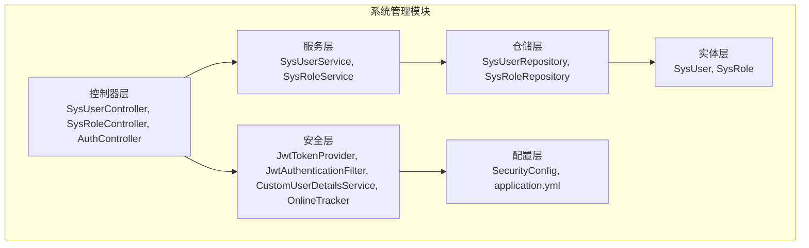
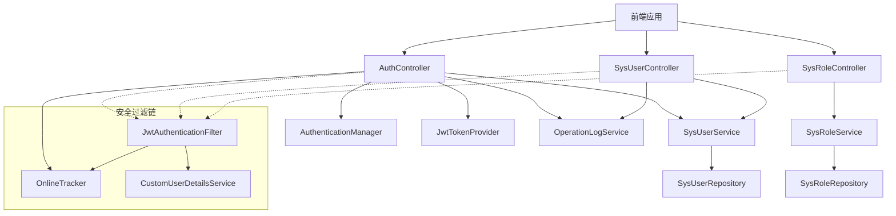
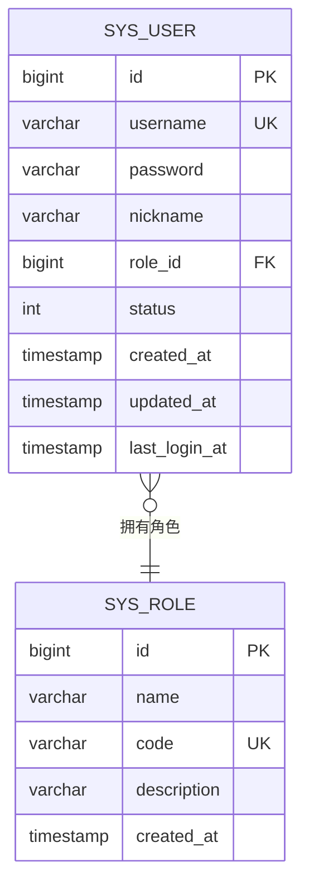
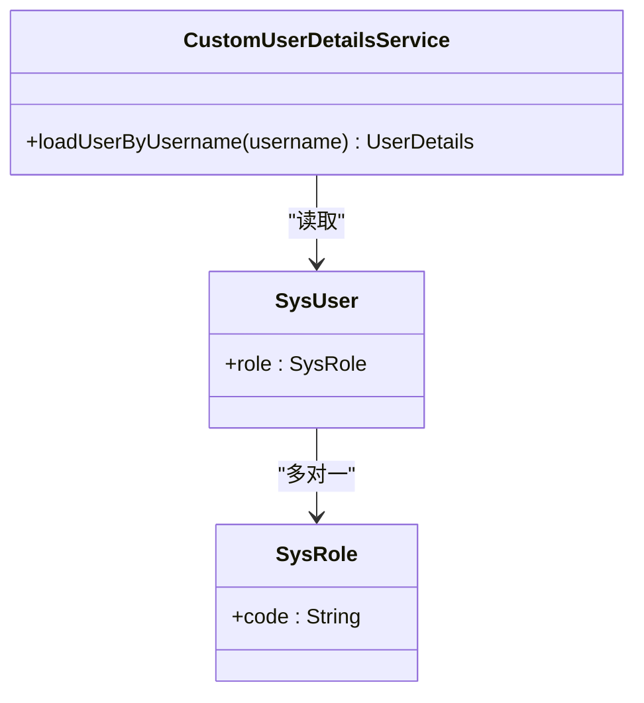
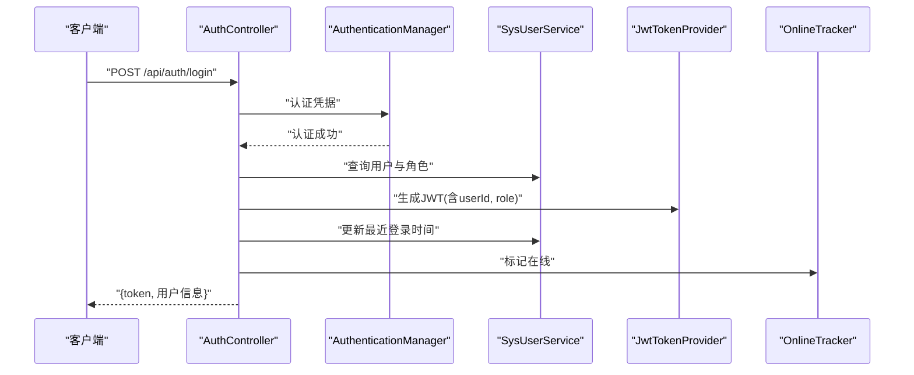
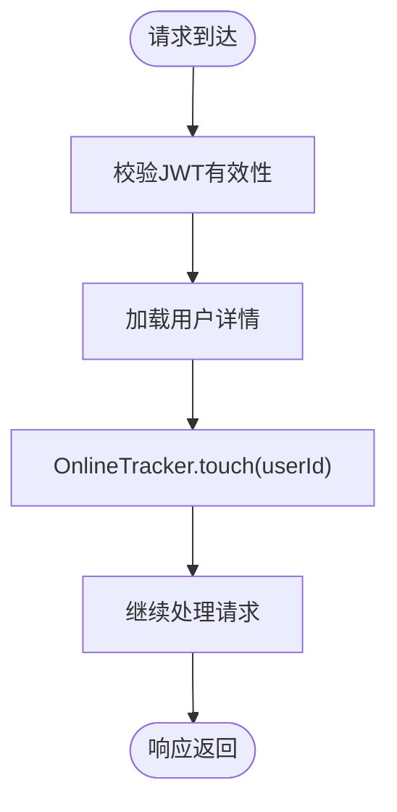
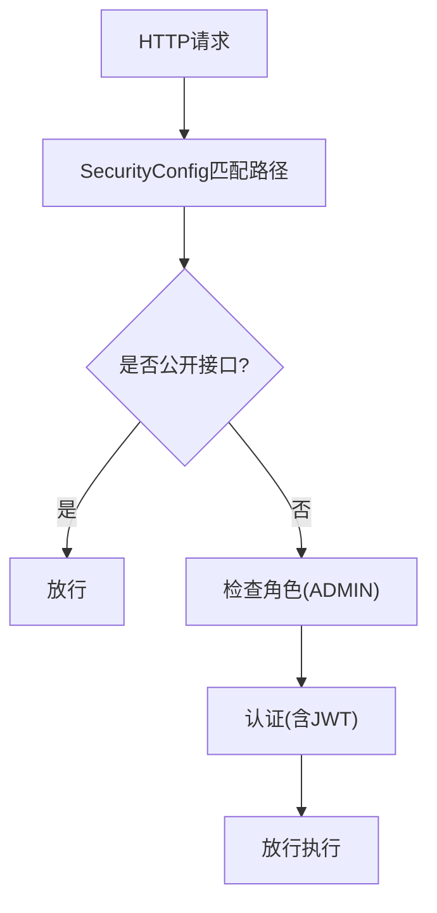
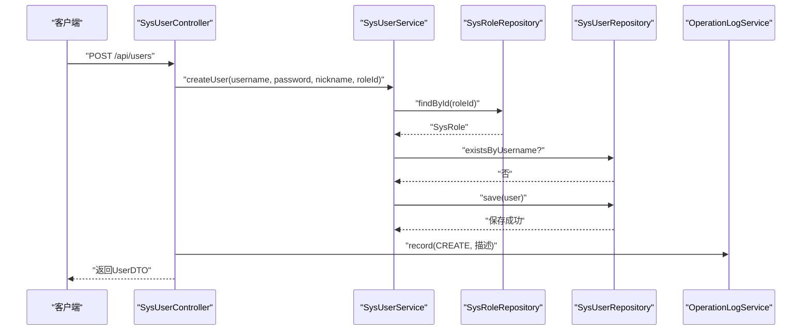
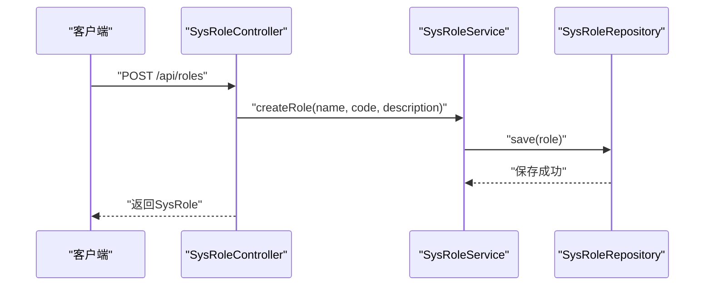
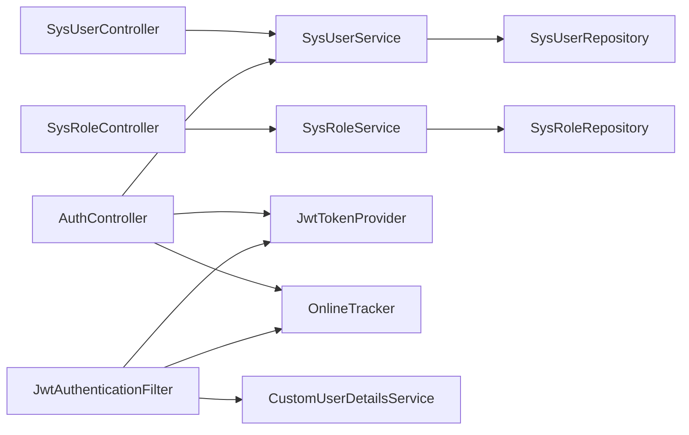

# 系统管理模块

<cite>
**本文引用的文件**
- [SysUser.java](file://src/main/java/com/superpower/modules/system/entity/SysUser.java)
- [SysRole.java](file://src/main/java/com/superpower/modules/system/entity/SysRole.java)
- [SysUserService.java](file://src/main/java/com/superpower/modules/system/service/SysUserService.java)
- [SysRoleService.java](file://src/main/java/com/superpower/modules/system/service/SysRoleService.java)
- [SysUserController.java](file://src/main/java/com/superpower/modules/system/controller/SysUserController.java)
- [SysRoleController.java](file://src/main/java/com/superpower/modules/system/controller/SysRoleController.java)
- [AuthController.java](file://src/main/java/com/superpower/modules/system/controller/AuthController.java)
- [JwtTokenProvider.java](file://src/main/java/com/superpower/security/JwtTokenProvider.java)
- [JwtAuthenticationFilter.java](file://src/main/java/com/superpower/security/JwtAuthenticationFilter.java)
- [CustomUserDetailsService.java](file://src/main/java/com/superpower/security/CustomUserDetailsService.java)
- [OnlineTracker.java](file://src/main/java/com/superpower/security/OnlineTracker.java)
- [SecurityConfig.java](file://src/main/java/com/superpower/config/SecurityConfig.java)
- [application.yml](file://src/main/resources/application.yml)
- [SysUserRepository.java](file://src/main/java/com/superpower/modules/system/repository/SysUserRepository.java)
- [SysRoleRepository.java](file://src/main/java/com/superpower/modules/system/repository/SysRoleRepository.java)
- [UserDTO.java](file://src/main/java/com/superpower/modules/system/dto/UserDTO.java)
- [LoginRequest.java](file://src/main/java/com/superpower/modules/system/dto/LoginRequest.java)
- [LoginResponse.java](file://src/main/java/com/superpower/modules/system/dto/LoginResponse.java)
</cite>

## 目录
1. [简介](#简介)
2. [项目结构](#项目结构)
3. [核心组件](#核心组件)
4. [架构总览](#架构总览)
5. [详细组件分析](#详细组件分析)
6. [依赖分析](#依赖分析)
7. [性能考虑](#性能考虑)
8. [故障排查指南](#故障排查指南)
9. [结论](#结论)
10. [附录](#附录)

## 简介
本技术文档聚焦系统管理模块，围绕用户管理与角色管理两大核心子域，系统性阐述实体设计、权限模型、服务层实现、控制器层API设计、JWT认证机制、权限拦截器、在线用户跟踪与会话管理策略，并给出安全管理最佳实践、权限设计原则与扩展开发指南。读者可据此快速理解并安全地扩展系统管理能力。

## 项目结构
系统管理模块位于后端Java工程的system包下，采用分层架构：实体层(entity)、仓储层(repository)、服务层(service)、控制器层(controller)，配合安全层(security)与配置(config)。前端通过统一的REST接口与后端交互。

图表来源
- [SysUser.java:1-40](file://src/main/java/com/superpower/modules/system/entity/SysUser.java#L1-L40)
- [SysRole.java:1-27](file://src/main/java/com/superpower/modules/system/entity/SysRole.java#L1-L27)
- [SysUserRepository.java:1-13](file://src/main/java/com/superpower/modules/system/repository/SysUserRepository.java#L1-L13)
- [SysRoleRepository.java:1-12](file://src/main/java/com/superpower/modules/system/repository/SysRoleRepository.java#L1-L12)
- [SysUserService.java:1-114](file://src/main/java/com/superpower/modules/system/service/SysUserService.java#L1-L114)
- [SysRoleService.java:1-35](file://src/main/java/com/superpower/modules/system/service/SysRoleService.java#L1-L35)
- [SysUserController.java:1-67](file://src/main/java/com/superpower/modules/system/controller/SysUserController.java#L1-L67)
- [SysRoleController.java:1-30](file://src/main/java/com/superpower/modules/system/controller/SysRoleController.java#L1-L30)
- [AuthController.java:1-98](file://src/main/java/com/superpower/modules/system/controller/AuthController.java#L1-L98)
- [JwtTokenProvider.java:1-66](file://src/main/java/com/superpower/security/JwtTokenProvider.java#L1-L66)
- [JwtAuthenticationFilter.java:1-62](file://src/main/java/com/superpower/security/JwtAuthenticationFilter.java#L1-L62)
- [CustomUserDetailsService.java:1-38](file://src/main/java/com/superpower/security/CustomUserDetailsService.java#L1-L38)
- [OnlineTracker.java:1-43](file://src/main/java/com/superpower/security/OnlineTracker.java#L1-L43)
- [SecurityConfig.java:1-57](file://src/main/java/com/superpower/config/SecurityConfig.java#L1-L57)
- [application.yml:1-40](file://src/main/resources/application.yml#L1-L40)

章节来源
- [SysUser.java:1-40](file://src/main/java/com/superpower/modules/system/entity/SysUser.java#L1-L40)
- [SysRole.java:1-27](file://src/main/java/com/superpower/modules/system/entity/SysRole.java#L1-L27)
- [SysUserController.java:1-67](file://src/main/java/com/superpower/modules/system/controller/SysUserController.java#L1-L67)
- [SysRoleController.java:1-30](file://src/main/java/com/superpower/modules/system/controller/SysRoleController.java#L1-L30)
- [AuthController.java:1-98](file://src/main/java/com/superpower/modules/system/controller/AuthController.java#L1-L98)
- [JwtTokenProvider.java:1-66](file://src/main/java/com/superpower/security/JwtTokenProvider.java#L1-L66)
- [JwtAuthenticationFilter.java:1-62](file://src/main/java/com/superpower/security/JwtAuthenticationFilter.java#L1-L62)
- [CustomUserDetailsService.java:1-38](file://src/main/java/com/superpower/security/CustomUserDetailsService.java#L1-L38)
- [OnlineTracker.java:1-43](file://src/main/java/com/superpower/security/OnlineTracker.java#L1-L43)
- [SecurityConfig.java:1-57](file://src/main/java/com/superpower/config/SecurityConfig.java#L1-L57)
- [application.yml:1-40](file://src/main/resources/application.yml#L1-L40)

## 核心组件
- 实体层：SysUser与SysRole定义了用户与角色的数据结构及字段约束；用户与角色为多对一关联（一个用户仅属于一个角色）。
- 仓储层：基于Spring Data JPA，提供按用户名查询、唯一性校验等基础能力。
- 服务层：SysUserService负责用户全生命周期管理（创建、更新、删除、改密、昵称变更、状态变更、在线状态映射），SysRoleService负责角色查询与创建。
- 控制器层：AuthController提供登录、注册、修改密码与昵称、查看当前用户；SysUserController提供用户列表、创建、更新、删除；SysRoleController提供角色列表与创建。
- 安全层：JwtTokenProvider生成与解析JWT；JwtAuthenticationFilter在请求进入时提取并验证令牌，加载用户详情并写入安全上下文；CustomUserDetailsService根据用户角色动态授予权限；OnlineTracker维护在线用户集合与活跃时间。
- 配置层：SecurityConfig启用无状态会话、放行部分公开接口、要求管理员角色访问用户与角色管理接口，并注入JWT过滤器；application.yml定义JWT密钥、过期时间与数据库连接参数。

章节来源
- [SysUser.java:1-40](file://src/main/java/com/superpower/modules/system/entity/SysUser.java#L1-L40)
- [SysRole.java:1-27](file://src/main/java/com/superpower/modules/system/entity/SysRole.java#L1-L27)
- [SysUserService.java:1-114](file://src/main/java/com/superpower/modules/system/service/SysUserService.java#L1-L114)
- [SysRoleService.java:1-35](file://src/main/java/com/superpower/modules/system/service/SysRoleService.java#L1-L35)
- [SysUserController.java:1-67](file://src/main/java/com/superpower/modules/system/controller/SysUserController.java#L1-L67)
- [SysRoleController.java:1-30](file://src/main/java/com/superpower/modules/system/controller/SysRoleController.java#L1-L30)
- [AuthController.java:1-98](file://src/main/java/com/superpower/modules/system/controller/AuthController.java#L1-L98)
- [JwtTokenProvider.java:1-66](file://src/main/java/com/superpower/security/JwtTokenProvider.java#L1-L66)
- [JwtAuthenticationFilter.java:1-62](file://src/main/java/com/superpower/security/JwtAuthenticationFilter.java#L1-L62)
- [CustomUserDetailsService.java:1-38](file://src/main/java/com/superpower/security/CustomUserDetailsService.java#L1-L38)
- [OnlineTracker.java:1-43](file://src/main/java/com/superpower/security/OnlineTracker.java#L1-L43)
- [SecurityConfig.java:1-57](file://src/main/java/com/superpower/config/SecurityConfig.java#L1-L57)
- [application.yml:1-40](file://src/main/resources/application.yml#L1-L40)

## 架构总览
系统管理模块遵循前后端分离的REST风格，后端以无状态JWT认证为核心，结合Spring Security进行权限拦截，使用JPA进行数据持久化。

图表来源
- [AuthController.java:1-98](file://src/main/java/com/superpower/modules/system/controller/AuthController.java#L1-L98)
- [SysUserController.java:1-67](file://src/main/java/com/superpower/modules/system/controller/SysUserController.java#L1-L67)
- [SysRoleController.java:1-30](file://src/main/java/com/superpower/modules/system/controller/SysRoleController.java#L1-L30)
- [SysUserService.java:1-114](file://src/main/java/com/superpower/modules/system/service/SysUserService.java#L1-L114)
- [SysRoleService.java:1-35](file://src/main/java/com/superpower/modules/system/service/SysRoleService.java#L1-L35)
- [JwtAuthenticationFilter.java:1-62](file://src/main/java/com/superpower/security/JwtAuthenticationFilter.java#L1-L62)
- [CustomUserDetailsService.java:1-38](file://src/main/java/com/superpower/security/CustomUserDetailsService.java#L1-L38)
- [JwtTokenProvider.java:1-66](file://src/main/java/com/superpower/security/JwtTokenProvider.java#L1-L66)
- [OnlineTracker.java:1-43](file://src/main/java/com/superpower/security/OnlineTracker.java#L1-L43)
- [SysUserRepository.java:1-13](file://src/main/java/com/superpower/modules/system/repository/SysUserRepository.java#L1-L13)
- [SysRoleRepository.java:1-12](file://src/main/java/com/superpower/modules/system/repository/SysRoleRepository.java#L1-L12)

## 详细组件分析

### 用户与角色实体设计
- 用户实体（SysUser）
  - 关键字段：用户名唯一、密码、昵称、角色外键、状态、创建/更新时间、最近登录时间。
  - 关联：与角色为多对一，加载策略为EAGER，便于权限判断时直接获取角色编码。
- 角色实体（SysRole）
  - 关键字段：名称、编码唯一、描述、创建时间。
  - 设计要点：角色编码作为权限标识，用于动态授权与JWT载荷。

图表来源
- [SysUser.java:1-40](file://src/main/java/com/superpower/modules/system/entity/SysUser.java#L1-L40)
- [SysRole.java:1-27](file://src/main/java/com/superpower/modules/system/entity/SysRole.java#L1-L27)

章节来源
- [SysUser.java:1-40](file://src/main/java/com/superpower/modules/system/entity/SysUser.java#L1-L40)
- [SysRole.java:1-27](file://src/main/java/com/superpower/modules/system/entity/SysRole.java#L1-L27)

### 权限模型与角色继承
- 当前设计采用“单角色”模型：每个用户仅绑定一个角色，角色编码即其权限标识。
- 动态授权：CustomUserDetailsService依据用户的角色编码生成“ROLE_前缀”的权限项，交由Spring Security进行匹配。
- 角色继承：未实现显式角色继承关系；如需多角色或多层级继承，可在服务层聚合多个角色编码或引入角色树结构。

图表来源
- [CustomUserDetailsService.java:1-38](file://src/main/java/com/superpower/security/CustomUserDetailsService.java#L1-L38)
- [SysUser.java:1-40](file://src/main/java/com/superpower/modules/system/entity/SysUser.java#L1-L40)
- [SysRole.java:1-27](file://src/main/java/com/superpower/modules/system/entity/SysRole.java#L1-L27)

章节来源
- [CustomUserDetailsService.java:1-38](file://src/main/java/com/superpower/security/CustomUserDetailsService.java#L1-L38)
- [SysUser.java:1-40](file://src/main/java/com/superpower/modules/system/entity/SysUser.java#L1-L40)
- [SysRole.java:1-27](file://src/main/java/com/superpower/modules/system/entity/SysRole.java#L1-L27)

### JWT认证机制与会话管理
- JWT签发：AuthController在登录成功后，使用JwtTokenProvider生成包含用户名、用户ID与角色编码的令牌。
- 过滤链：JwtAuthenticationFilter从请求头或查询参数中提取令牌，校验后加载用户详情并写入SecurityContext；同时调用OnlineTracker记录在线状态。
- 会话策略：SecurityConfig设置STATELESS，无传统Session；OnlineTracker以内存Map维护用户活跃时间，作为“在线”状态的业务判定依据。

图表来源
- [AuthController.java:1-98](file://src/main/java/com/superpower/modules/system/controller/AuthController.java#L1-L98)
- [JwtTokenProvider.java:1-66](file://src/main/java/com/superpower/security/JwtTokenProvider.java#L1-L66)
- [JwtAuthenticationFilter.java:1-62](file://src/main/java/com/superpower/security/JwtAuthenticationFilter.java#L1-L62)
- [CustomUserDetailsService.java:1-38](file://src/main/java/com/superpower/security/CustomUserDetailsService.java#L1-L38)
- [OnlineTracker.java:1-43](file://src/main/java/com/superpower/security/OnlineTracker.java#L1-L43)

章节来源
- [AuthController.java:1-98](file://src/main/java/com/superpower/modules/system/controller/AuthController.java#L1-L98)
- [JwtTokenProvider.java:1-66](file://src/main/java/com/superpower/security/JwtTokenProvider.java#L1-L66)
- [JwtAuthenticationFilter.java:1-62](file://src/main/java/com/superpower/security/JwtAuthenticationFilter.java#L1-L62)
- [CustomUserDetailsService.java:1-38](file://src/main/java/com/superpower/security/CustomUserDetailsService.java#L1-L38)
- [OnlineTracker.java:1-43](file://src/main/java/com/superpower/security/OnlineTracker.java#L1-L43)

### 在线用户跟踪与会话管理策略
- 在线判定：OnlineTracker以用户ID为键，记录最近活跃时间；超过阈值（默认30分钟）视为离线。
- 活跃刷新：每次请求通过JwtAuthenticationFilter调用touch刷新时间。
- 离线清理：访问时清理过期条目，保证内存占用可控。

图表来源
- [JwtAuthenticationFilter.java:1-62](file://src/main/java/com/superpower/security/JwtAuthenticationFilter.java#L1-L62)
- [OnlineTracker.java:1-43](file://src/main/java/com/superpower/security/OnlineTracker.java#L1-L43)

章节来源
- [JwtAuthenticationFilter.java:1-62](file://src/main/java/com/superpower/security/JwtAuthenticationFilter.java#L1-L62)
- [OnlineTracker.java:1-43](file://src/main/java/com/superpower/security/OnlineTracker.java#L1-L43)

### 权限拦截器与API设计
- 放行规则：公开接口（登录、版本、静态资源）无需认证；GET请求默认需要认证。
- 管理员权限：用户与角色管理接口要求ADMIN角色。
- 认证方式：基于JWT的无状态认证，过滤器在SecurityFilterChain中前置执行。

图表来源
- [SecurityConfig.java:1-57](file://src/main/java/com/superpower/config/SecurityConfig.java#L1-L57)

章节来源
- [SecurityConfig.java:1-57](file://src/main/java/com/superpower/config/SecurityConfig.java#L1-L57)

### 用户管理服务与控制器
- 服务层（SysUserService）
  - 用户创建：校验用户名唯一性，按角色ID加载角色，加密密码，保存用户。
  - 更新：支持昵称、角色、状态变更。
  - 密码与昵称变更：旧密码校验与新密码长度校验。
  - DTO映射：将在线状态委托给OnlineTracker。
- 控制器（SysUserController）
  - 列表、创建、更新、删除接口；操作日志记录。

图表来源
- [SysUserController.java:1-67](file://src/main/java/com/superpower/modules/system/controller/SysUserController.java#L1-L67)
- [SysUserService.java:1-114](file://src/main/java/com/superpower/modules/system/service/SysUserService.java#L1-L114)
- [SysRoleRepository.java:1-12](file://src/main/java/com/superpower/modules/system/repository/SysRoleRepository.java#L1-L12)
- [SysUserRepository.java:1-13](file://src/main/java/com/superpower/modules/system/repository/SysUserRepository.java#L1-L13)

章节来源
- [SysUserController.java:1-67](file://src/main/java/com/superpower/modules/system/controller/SysUserController.java#L1-L67)
- [SysUserService.java:1-114](file://src/main/java/com/superpower/modules/system/service/SysUserService.java#L1-L114)
- [SysRoleRepository.java:1-12](file://src/main/java/com/superpower/modules/system/repository/SysRoleRepository.java#L1-L12)
- [SysUserRepository.java:1-13](file://src/main/java/com/superpower/modules/system/repository/SysUserRepository.java#L1-L13)

### 角色管理服务与控制器
- 服务层（SysRoleService）
  - 查询全部角色、按编码查找、创建角色。
- 控制器（SysRoleController）
  - 提供角色列表与创建接口。

图表来源
- [SysRoleController.java:1-30](file://src/main/java/com/superpower/modules/system/controller/SysRoleController.java#L1-L30)
- [SysRoleService.java:1-35](file://src/main/java/com/superpower/modules/system/service/SysRoleService.java#L1-L35)
- [SysRoleRepository.java:1-12](file://src/main/java/com/superpower/modules/system/repository/SysRoleRepository.java#L1-L12)

章节来源
- [SysRoleController.java:1-30](file://src/main/java/com/superpower/modules/system/controller/SysRoleController.java#L1-L30)
- [SysRoleService.java:1-35](file://src/main/java/com/superpower/modules/system/service/SysRoleService.java#L1-L35)
- [SysRoleRepository.java:1-12](file://src/main/java/com/superpower/modules/system/repository/SysRoleRepository.java#L1-L12)

### 登录、注册与个人信息管理
- 登录：校验凭据，签发JWT，更新最近登录时间，标记在线，记录登录日志。
- 注册：校验参数，创建普通用户（默认角色ID）。
- 修改密码/昵称：旧密码校验与新密码长度校验。
- 查看当前用户：从认证上下文解析当前用户。

章节来源
- [AuthController.java:1-98](file://src/main/java/com/superpower/modules/system/controller/AuthController.java#L1-L98)
- [LoginRequest.java:1-14](file://src/main/java/com/superpower/modules/system/dto/LoginRequest.java#L1-L14)
- [LoginResponse.java:1-16](file://src/main/java/com/superpower/modules/system/dto/LoginResponse.java#L1-L16)

## 依赖分析
- 组件耦合
  - 控制器依赖服务；服务依赖仓储；服务依赖OnlineTracker与PasswordEncoder；控制器依赖OperationLogService。
  - 安全过滤器依赖JwtTokenProvider、CustomUserDetailsService与OnlineTracker。
- 外部依赖
  - Spring Security、Spring Data JPA、BCrypt密码编码器、JWT库、SQLite数据库。
- 可能的循环依赖
  - 未发现直接循环依赖；若后续引入角色继承或菜单权限，需避免服务间相互调用导致的环。

图表来源
- [SysUserController.java:1-67](file://src/main/java/com/superpower/modules/system/controller/SysUserController.java#L1-L67)
- [SysRoleController.java:1-30](file://src/main/java/com/superpower/modules/system/controller/SysRoleController.java#L1-L30)
- [AuthController.java:1-98](file://src/main/java/com/superpower/modules/system/controller/AuthController.java#L1-L98)
- [JwtAuthenticationFilter.java:1-62](file://src/main/java/com/superpower/security/JwtAuthenticationFilter.java#L1-L62)
- [JwtTokenProvider.java:1-66](file://src/main/java/com/superpower/security/JwtTokenProvider.java#L1-L66)
- [CustomUserDetailsService.java:1-38](file://src/main/java/com/superpower/security/CustomUserDetailsService.java#L1-L38)
- [OnlineTracker.java:1-43](file://src/main/java/com/superpower/security/OnlineTracker.java#L1-L43)
- [SysUserService.java:1-114](file://src/main/java/com/superpower/modules/system/service/SysUserService.java#L1-L114)
- [SysRoleService.java:1-35](file://src/main/java/com/superpower/modules/system/service/SysRoleService.java#L1-L35)
- [SysUserRepository.java:1-13](file://src/main/java/com/superpower/modules/system/repository/SysUserRepository.java#L1-L13)
- [SysRoleRepository.java:1-12](file://src/main/java/com/superpower/modules/system/repository/SysRoleRepository.java#L1-L12)

章节来源
- [SysUserController.java:1-67](file://src/main/java/com/superpower/modules/system/controller/SysUserController.java#L1-L67)
- [SysRoleController.java:1-30](file://src/main/java/com/superpower/modules/system/controller/SysRoleController.java#L1-L30)
- [AuthController.java:1-98](file://src/main/java/com/superpower/modules/system/controller/AuthController.java#L1-L98)
- [JwtAuthenticationFilter.java:1-62](file://src/main/java/com/superpower/security/JwtAuthenticationFilter.java#L1-L62)
- [JwtTokenProvider.java:1-66](file://src/main/java/com/superpower/security/JwtTokenProvider.java#L1-L66)
- [CustomUserDetailsService.java:1-38](file://src/main/java/com/superpower/security/CustomUserDetailsService.java#L1-L38)
- [OnlineTracker.java:1-43](file://src/main/java/com/superpower/security/OnlineTracker.java#L1-L43)
- [SysUserService.java:1-114](file://src/main/java/com/superpower/modules/system/service/SysUserService.java#L1-L114)
- [SysRoleService.java:1-35](file://src/main/java/com/superpower/modules/system/service/SysRoleService.java#L1-L35)
- [SysUserRepository.java:1-13](file://src/main/java/com/superpower/modules/system/repository/SysUserRepository.java#L1-L13)
- [SysRoleRepository.java:1-12](file://src/main/java/com/superpower/modules/system/repository/SysRoleRepository.java#L1-L12)

## 性能考虑
- 数据库连接池：SQLite连接池最大3，连接超时60秒，适合开发/小规模场景；生产建议使用高性能数据库并调优连接池参数。
- 密码编码：使用BCrypt，安全性高但计算成本较高；建议在高并发场景下评估CPU开销。
- 在线追踪：内存Map存储在线用户，线程安全；建议在分布式场景替换为Redis等共享存储。
- 查询优化：UserDTO映射时调用OnlineTracker.isOnline，注意批量查询时的性能影响，可考虑缓存在线状态或延迟加载。

## 故障排查指南
- 登录失败
  - 检查用户名/密码是否正确；确认用户状态正常；查看SecurityConfig是否正确放行登录接口。
- 权限不足
  - 确认角色编码与“ROLE_前缀”是否一致；检查SecurityConfig中的hasRole配置。
- JWT无效
  - 校验密钥与过期时间配置；确认请求头格式为“Bearer {token}”或携带查询参数access_token。
- 在线状态异常
  - 检查OnlineTracker阈值与touch调用频率；确认请求经过JwtAuthenticationFilter。
- 数据一致性
  - 用户创建时先校验用户名唯一性；更新角色时确保角色存在；密码变更前校验旧密码。

章节来源
- [SecurityConfig.java:1-57](file://src/main/java/com/superpower/config/SecurityConfig.java#L1-L57)
- [JwtTokenProvider.java:1-66](file://src/main/java/com/superpower/security/JwtTokenProvider.java#L1-L66)
- [JwtAuthenticationFilter.java:1-62](file://src/main/java/com/superpower/security/JwtAuthenticationFilter.java#L1-L62)
- [OnlineTracker.java:1-43](file://src/main/java/com/superpower/security/OnlineTracker.java#L1-L43)
- [application.yml:1-40](file://src/main/resources/application.yml#L1-L40)

## 结论
系统管理模块以JWT无状态认证为核心，结合Spring Security实现细粒度权限控制，通过OnlineTracker提供在线用户管理能力。实体设计简洁清晰，服务层职责明确，控制器层API覆盖用户与角色管理的典型场景。建议在生产环境中进一步完善角色继承、菜单权限、审计日志与分布式在线状态存储，以满足更复杂的安全与运维需求。

## 附录
- 配置要点
  - JWT密钥与过期时间：application.yml中app.jwt.*配置。
  - 数据源与JPA：SQLite、方言、DDL自动更新。
- 扩展开发建议
  - 引入角色继承或多角色聚合，丰富权限模型。
  - 增加菜单与操作级权限，结合注解实现方法级鉴权。
  - 使用Redis替换在线追踪，支持多实例部署。
  - 引入操作审计与登录审计，完善合规要求。

章节来源
- [application.yml:1-40](file://src/main/resources/application.yml#L1-L40)
- [SecurityConfig.java:1-57](file://src/main/java/com/superpower/config/SecurityConfig.java#L1-L57)
- [JwtTokenProvider.java:1-66](file://src/main/java/com/superpower/security/JwtTokenProvider.java#L1-L66)
- [OnlineTracker.java:1-43](file://src/main/java/com/superpower/security/OnlineTracker.java#L1-L43)