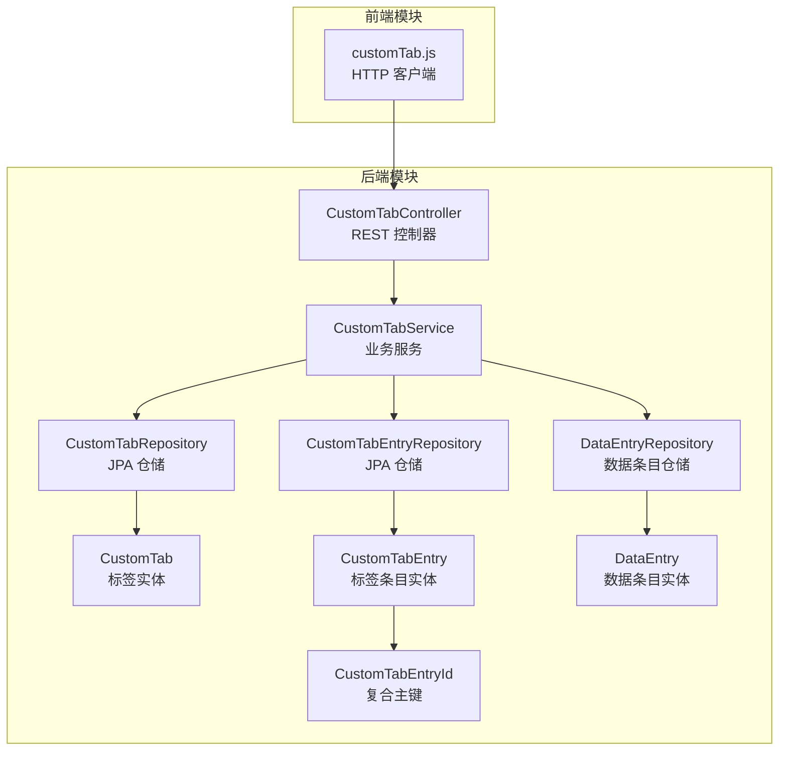
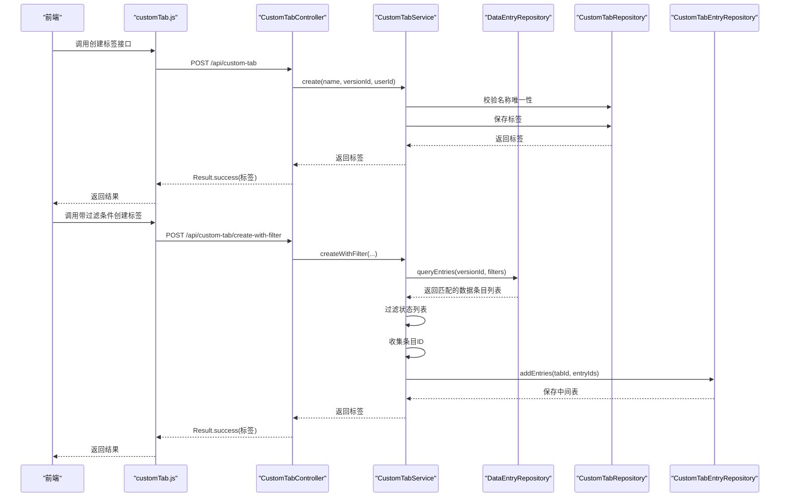
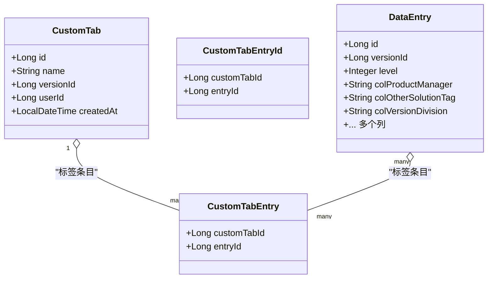
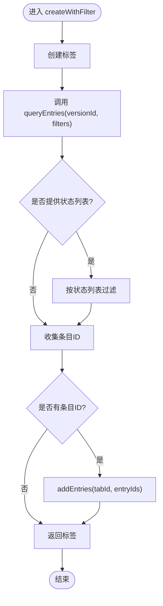
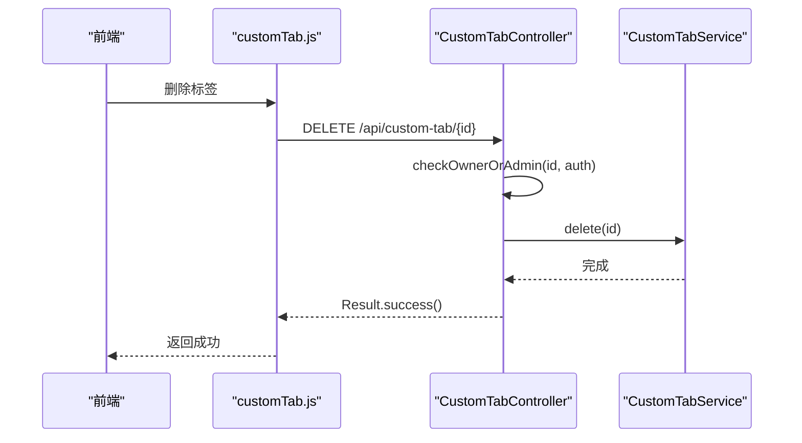
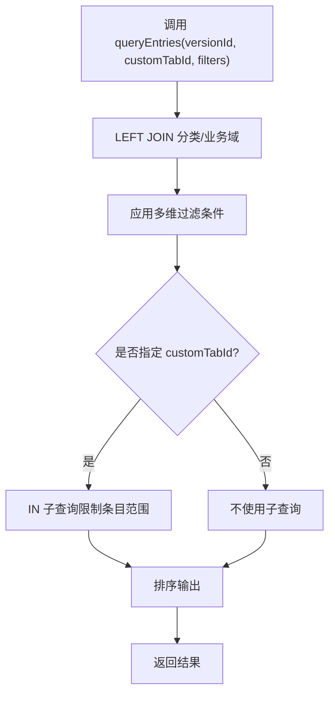
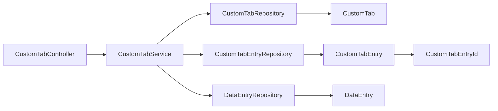

# 自定义标签模块

<cite>
**本文引用的文件**
- [CustomTab.java](file://src/main/java/com/superpower/modules/customtab/entity/CustomTab.java)
- [CustomTabEntry.java](file://src/main/java/com/superpower/modules/customtab/entity/CustomTabEntry.java)
- [CustomTabEntryId.java](file://src/main/java/com/superpower/modules/customtab/entity/CustomTabEntryId.java)
- [CustomTabService.java](file://src/main/java/com/superpower/modules/customtab/service/CustomTabService.java)
- [CustomTabController.java](file://src/main/java/com/superpower/modules/customtab/controller/CustomTabController.java)
- [CustomTabRepository.java](file://src/main/java/com/superpower/modules/customtab/repository/CustomTabRepository.java)
- [CustomTabEntryRepository.java](file://src/main/java/com/superpower/modules/customtab/repository/CustomTabEntryRepository.java)
- [DataEntry.java](file://src/main/java/com/superpower/modules/data/entity/DataEntry.java)
- [DataEntryRepository.java](file://src/main/java/com/superpower/modules/data/repository/DataEntryRepository.java)
- [customTab.js](file://frontend/src/api/customTab.js)
- [CustomTabServiceTest.java](file://src/test/java/com/superpower/modules/customtab/service/CustomTabServiceTest.java)
</cite>

## 目录
1. [简介](#简介)
2. [项目结构](#项目结构)
3. [核心组件](#核心组件)
4. [架构总览](#架构总览)
5. [详细组件分析](#详细组件分析)
6. [依赖分析](#依赖分析)
7. [性能考虑](#性能考虑)
8. [故障排查指南](#故障排查指南)
9. [结论](#结论)
10. [附录](#附录)

## 简介
本技术文档围绕“自定义标签模块”展开，系统性解析自定义标签实体与标签条目之间的数据模型设计、标签配置管理与动态查询支持，以及服务层与控制器层的实现细节。重点覆盖以下方面：
- 实体设计：CustomTab（标签）与CustomTabEntry（标签条目）的职责边界与关联关系
- 配置管理：标签创建、重命名、删除、条目增删等生命周期管理
- 动态查询：基于版本、过滤条件与标签集合的动态数据查询
- 可扩展性：通过Repository扩展点支持更多筛选维度
- 数据同步：标签与数据条目的解耦存储与事务一致性保障
- 前端集成：REST API与前端请求封装

## 项目结构
自定义标签模块位于后端Java工程的customtab包下，采用经典的分层架构：controller（控制器）、service（服务）、repository（仓储）、entity（实体）。前端通过独立的API模块与后端交互。

图表来源
- [CustomTabController.java:1-104](file://src/main/java/com/superpower/modules/customtab/controller/CustomTabController.java#L1-L104)
- [CustomTabService.java:1-111](file://src/main/java/com/superpower/modules/customtab/service/CustomTabService.java#L1-L111)
- [CustomTabRepository.java:1-22](file://src/main/java/com/superpower/modules/customtab/repository/CustomTabRepository.java#L1-L22)
- [CustomTabEntryRepository.java:1-27](file://src/main/java/com/superpower/modules/customtab/repository/CustomTabEntryRepository.java#L1-L27)
- [CustomTab.java:1-28](file://src/main/java/com/superpower/modules/customtab/entity/CustomTab.java#L1-L28)
- [CustomTabEntry.java:1-21](file://src/main/java/com/superpower/modules/customtab/entity/CustomTabEntry.java#L1-L21)
- [CustomTabEntryId.java:1-16](file://src/main/java/com/superpower/modules/customtab/entity/CustomTabEntryId.java#L1-L16)
- [DataEntryRepository.java:1-152](file://src/main/java/com/superpower/modules/data/repository/DataEntryRepository.java#L1-L152)
- [DataEntry.java:1-267](file://src/main/java/com/superpower/modules/data/entity/DataEntry.java#L1-L267)
- [customTab.js:1-30](file://frontend/src/api/customTab.js#L1-L30)

章节来源
- [CustomTabController.java:1-104](file://src/main/java/com/superpower/modules/customtab/controller/CustomTabController.java#L1-L104)
- [CustomTabService.java:1-111](file://src/main/java/com/superpower/modules/customtab/service/CustomTabService.java#L1-L111)
- [CustomTabRepository.java:1-22](file://src/main/java/com/superpower/modules/customtab/repository/CustomTabRepository.java#L1-L22)
- [CustomTabEntryRepository.java:1-27](file://src/main/java/com/superpower/modules/customtab/repository/CustomTabEntryRepository.java#L1-L27)
- [CustomTab.java:1-28](file://src/main/java/com/superpower/modules/customtab/entity/CustomTab.java#L1-L28)
- [CustomTabEntry.java:1-21](file://src/main/java/com/superpower/modules/customtab/entity/CustomTabEntry.java#L1-L21)
- [CustomTabEntryId.java:1-16](file://src/main/java/com/superpower/modules/customtab/entity/CustomTabEntryId.java#L1-L16)
- [DataEntryRepository.java:1-152](file://src/main/java/com/superpower/modules/data/repository/DataEntryRepository.java#L1-L152)
- [DataEntry.java:1-267](file://src/main/java/com/superpower/modules/data/entity/DataEntry.java#L1-L267)
- [customTab.js:1-30](file://frontend/src/api/customTab.js#L1-L30)

## 核心组件
- 实体层
  - CustomTab：代表一个“自定义标签”，包含标签名、所属版本、创建者、创建时间等字段
  - CustomTabEntry：标签与数据条目的多对多中间表，采用复合主键（customTabId, entryId）
  - CustomTabEntryId：复合主键类，用于JPA识别联合主键
- 仓储层
  - CustomTabRepository：提供按版本查询、去重校验、批量删除等能力
  - CustomTabEntryRepository：提供按标签查询、按标签删除、按标签集合删除等能力
  - DataEntryRepository：提供复杂动态查询（含多字段模糊匹配、业务域过滤、排序等）
- 服务层
  - CustomTabService：封装标签生命周期、条目管理、带过滤条件的标签创建逻辑
- 控制器层
  - CustomTabController：暴露REST API，进行权限校验、入参解析与结果包装

章节来源
- [CustomTab.java:1-28](file://src/main/java/com/superpower/modules/customtab/entity/CustomTab.java#L1-L28)
- [CustomTabEntry.java:1-21](file://src/main/java/com/superpower/modules/customtab/entity/CustomTabEntry.java#L1-L21)
- [CustomTabEntryId.java:1-16](file://src/main/java/com/superpower/modules/customtab/entity/CustomTabEntryId.java#L1-L16)
- [CustomTabRepository.java:1-22](file://src/main/java/com/superpower/modules/customtab/repository/CustomTabRepository.java#L1-L22)
- [CustomTabEntryRepository.java:1-27](file://src/main/java/com/superpower/modules/customtab/repository/CustomTabEntryRepository.java#L1-L27)
- [DataEntryRepository.java:1-152](file://src/main/java/com/superpower/modules/data/repository/DataEntryRepository.java#L1-L152)
- [CustomTabService.java:1-111](file://src/main/java/com/superpower/modules/customtab/service/CustomTabService.java#L1-L111)
- [CustomTabController.java:1-104](file://src/main/java/com/superpower/modules/customtab/controller/CustomTabController.java#L1-L104)

## 架构总览
自定义标签模块遵循“控制器-服务-仓储-实体”的分层架构，前端通过HTTP客户端调用后端API，服务层负责业务编排与事务控制，仓储层负责数据持久化与查询。

图表来源
- [CustomTabController.java:50-74](file://src/main/java/com/superpower/modules/customtab/controller/CustomTabController.java#L50-L74)
- [CustomTabService.java:31-53](file://src/main/java/com/superpower/modules/customtab/service/CustomTabService.java#L31-L53)
- [DataEntryRepository.java:56-78](file://src/main/java/com/superpower/modules/data/repository/DataEntryRepository.java#L56-L78)
- [CustomTabEntryRepository.java:14-25](file://src/main/java/com/superpower/modules/customtab/repository/CustomTabEntryRepository.java#L14-L25)
- [customTab.js:7-13](file://frontend/src/api/customTab.js#L7-L13)

## 详细组件分析

### 实体与数据模型
- CustomTab
  - 字段：id、name、versionId、userId、createdAt
  - 约束：非空name与versionId；默认createdAt
- CustomTabEntry
  - 复合主键：customTabId、entryId
  - 作用：建立标签与数据条目的多对多关系
- CustomTabEntryId
  - 复合主键类，确保JPA正确识别联合主键

图表来源
- [CustomTab.java:1-28](file://src/main/java/com/superpower/modules/customtab/entity/CustomTab.java#L1-L28)
- [CustomTabEntry.java:1-21](file://src/main/java/com/superpower/modules/customtab/entity/CustomTabEntry.java#L1-L21)
- [CustomTabEntryId.java:1-16](file://src/main/java/com/superpower/modules/customtab/entity/CustomTabEntryId.java#L1-L16)
- [DataEntry.java:1-267](file://src/main/java/com/superpower/modules/data/entity/DataEntry.java#L1-L267)

章节来源
- [CustomTab.java:1-28](file://src/main/java/com/superpower/modules/customtab/entity/CustomTab.java#L1-L28)
- [CustomTabEntry.java:1-21](file://src/main/java/com/superpower/modules/customtab/entity/CustomTabEntry.java#L1-L21)
- [CustomTabEntryId.java:1-16](file://src/main/java/com/superpower/modules/customtab/entity/CustomTabEntryId.java#L1-L16)
- [DataEntry.java:1-267](file://src/main/java/com/superpower/modules/data/entity/DataEntry.java#L1-L267)

### 服务层实现（CustomTabService）
- 关键方法与职责
  - createWithFilter：根据过滤条件查询数据条目，再批量添加到新建标签中
  - create/rename/delete：标签基本生命周期管理，含重复性校验与权限约束
  - addEntries/removeEntry：标签条目增删，避免重复插入
  - findByVersionId：按版本查询标签列表
- 事务与一致性
  - 使用@Transactional保证标签创建、条目添加、删除等操作在单事务内完成
- 动态查询支持
  - 借助DataEntryRepository.queryEntries实现多字段模糊匹配与业务域过滤
  - 支持状态列表的内存过滤（提升灵活性）

图表来源
- [CustomTabService.java:31-53](file://src/main/java/com/superpower/modules/customtab/service/CustomTabService.java#L31-L53)
- [DataEntryRepository.java:56-78](file://src/main/java/com/superpower/modules/data/repository/DataEntryRepository.java#L56-L78)
- [CustomTabService.java:92-104](file://src/main/java/com/superpower/modules/customtab/service/CustomTabService.java#L92-L104)

章节来源
- [CustomTabService.java:1-111](file://src/main/java/com/superpower/modules/customtab/service/CustomTabService.java#L1-L111)
- [DataEntryRepository.java:1-152](file://src/main/java/com/superpower/modules/data/repository/DataEntryRepository.java#L1-L152)

### 控制器层（CustomTabController）
- 接口设计
  - GET /api/custom-tab/{versionId}：按版本列出标签
  - POST /api/custom-tab/create-with-filter：带过滤条件创建标签
  - POST /api/custom-tab：创建空标签
  - DELETE /api/custom-tab/{id}：删除标签（含权限校验）
  - PUT /api/custom-tab/{id}：重命名标签（含权限校验）
  - POST /api/custom-tab/{id}/entries：批量添加条目
  - DELETE /api/custom-tab/{id}/entries/{entryId}：移除单个条目
- 权限控制
  - 仅标签创建者或管理员可执行删除与重命名
- 结果包装
  - 统一使用Result响应结构

图表来源
- [CustomTabController.java:76-81](file://src/main/java/com/superpower/modules/customtab/controller/CustomTabController.java#L76-L81)
- [CustomTabService.java:71-75](file://src/main/java/com/superpower/modules/customtab/service/CustomTabService.java#L71-L75)

章节来源
- [CustomTabController.java:1-104](file://src/main/java/com/superpower/modules/customtab/controller/CustomTabController.java#L1-L104)
- [customTab.js:1-30](file://frontend/src/api/customTab.js#L1-L30)

### 动态查询与数据关联
- DataEntryRepository.queryEntries
  - 支持版本过滤、标签集合过滤（通过子查询）、名称多字段模糊匹配、产品经理、解决方案、版本划分等过滤
  - 通过LEFT JOIN业务域与分类，结合排序规则保证展示顺序稳定
- CustomTabService.addEntries
  - 先加载标签，再读取现有条目ID集合，避免重复插入
- 可扩展性
  - 通过新增Repository方法与Service组合，可轻松扩展更多过滤维度

图表来源
- [DataEntryRepository.java:56-78](file://src/main/java/com/superpower/modules/data/repository/DataEntryRepository.java#L56-L78)
- [CustomTabService.java:92-104](file://src/main/java/com/superpower/modules/customtab/service/CustomTabService.java#L92-L104)

章节来源
- [DataEntryRepository.java:1-152](file://src/main/java/com/superpower/modules/data/repository/DataEntryRepository.java#L1-L152)
- [CustomTabService.java:92-104](file://src/main/java/com/superpower/modules/customtab/service/CustomTabService.java#L92-L104)

### 前端集成
- 前端通过customTab.js封装所有标签相关HTTP请求
- 与控制器层路径一一对应，便于前后端协作与联调

章节来源
- [customTab.js:1-30](file://frontend/src/api/customTab.js#L1-L30)

## 依赖分析
- 组件耦合
  - Service依赖Repository与Entity，保持清晰的领域边界
  - Controller依赖Service与用户服务，负责鉴权与结果包装
- 外部依赖
  - Spring Data JPA提供Repository自动实现
  - Spring Security用于权限校验
- 潜在循环依赖
  - 当前模块未见循环依赖迹象

图表来源
- [CustomTabController.java:1-104](file://src/main/java/com/superpower/modules/customtab/controller/CustomTabController.java#L1-L104)
- [CustomTabService.java:1-111](file://src/main/java/com/superpower/modules/customtab/service/CustomTabService.java#L1-L111)
- [CustomTabRepository.java:1-22](file://src/main/java/com/superpower/modules/customtab/repository/CustomTabRepository.java#L1-L22)
- [CustomTabEntryRepository.java:1-27](file://src/main/java/com/superpower/modules/customtab/repository/CustomTabEntryRepository.java#L1-L27)
- [CustomTab.java:1-28](file://src/main/java/com/superpower/modules/customtab/entity/CustomTab.java#L1-L28)
- [CustomTabEntry.java:1-21](file://src/main/java/com/superpower/modules/customtab/entity/CustomTabEntry.java#L1-L21)
- [CustomTabEntryId.java:1-16](file://src/main/java/com/superpower/modules/customtab/entity/CustomTabEntryId.java#L1-L16)
- [DataEntryRepository.java:1-152](file://src/main/java/com/superpower/modules/data/repository/DataEntryRepository.java#L1-L152)
- [DataEntry.java:1-267](file://src/main/java/com/superpower/modules/data/entity/DataEntry.java#L1-L267)

章节来源
- [CustomTabController.java:1-104](file://src/main/java/com/superpower/modules/customtab/controller/CustomTabController.java#L1-L104)
- [CustomTabService.java:1-111](file://src/main/java/com/superpower/modules/customtab/service/CustomTabService.java#L1-L111)
- [CustomTabRepository.java:1-22](file://src/main/java/com/superpower/modules/customtab/repository/CustomTabRepository.java#L1-L22)
- [CustomTabEntryRepository.java:1-27](file://src/main/java/com/superpower/modules/customtab/repository/CustomTabEntryRepository.java#L1-L27)
- [DataEntryRepository.java:1-152](file://src/main/java/com/superpower/modules/data/repository/DataEntryRepository.java#L1-L152)

## 性能考虑
- 查询性能
  - queryEntries使用LEFT JOIN与多条件过滤，建议在versionId、level、sortOrder等字段上建立索引以提升排序与过滤效率
  - 子查询IN限制条目范围时，确保customTabId与entryId有索引
- 写入性能
  - addEntries采用逐条保存，若条目数量较大，可考虑批量插入或使用JDBC模板优化
- 缓存策略
  - 对常用标签列表与过滤结果可引入Redis缓存，降低数据库压力
- 事务范围
  - 将标签创建与条目写入置于同一事务，避免部分写入导致的数据不一致

## 故障排查指南
- 常见异常与定位
  - “清单名称已存在”：由create与rename方法触发，检查同版本下是否存在重复名称
  - “清单不存在”：getById未找到标签，检查传入ID是否正确
  - “仅创建人或管理员可操作”：权限校验失败，确认当前用户是否为标签创建者或具备管理员角色
- 单元测试参考
  - 测试用例覆盖了名称重复抛错、创建成功、批量添加条目、删除清理等关键场景，可作为回归验证依据

章节来源
- [CustomTabService.java:60-85](file://src/main/java/com/superpower/modules/customtab/service/CustomTabService.java#L60-L85)
- [CustomTabController.java:36-43](file://src/main/java/com/superpower/modules/customtab/controller/CustomTabController.java#L36-L43)
- [CustomTabServiceTest.java:1-79](file://src/test/java/com/superpower/modules/customtab/service/CustomTabServiceTest.java#L1-L79)

## 结论
自定义标签模块通过清晰的分层设计与灵活的动态查询能力，实现了标签配置管理与数据条目绑定的解耦。服务层在事务与权限控制的加持下，提供了可靠的标签生命周期管理；仓储层的扩展点为后续增加更多过滤维度提供了便利。配合前端API封装，整体具备良好的可维护性与可扩展性。

## 附录
- 配置指南
  - 在application.yml中确保数据库连接与JPA配置正确
  - 如需启用异步处理或定时任务，可在相应配置类中开启
- 使用示例（路径指引）
  - 创建标签：POST /api/custom-tab
  - 带过滤条件创建标签：POST /api/custom-tab/create-with-filter
  - 列出某版本标签：GET /api/custom-tab/{versionId}
  - 删除标签：DELETE /api/custom-tab/{id}
  - 重命名标签：PUT /api/custom-tab/{id}
  - 批量添加条目：POST /api/custom-tab/{id}/entries
  - 移除条目：DELETE /api/custom-tab/{id}/entries/{entryId}
- 最佳实践
  - 在高并发场景下，对标签创建与条目添加接口进行限流与幂等设计
  - 对频繁访问的查询结果进行缓存，减少数据库压力
  - 为versionId、level、sortOrder等字段建立索引，优化排序与过滤性能
  - 对外暴露的API统一进行输入校验与异常捕获，保证接口稳定性