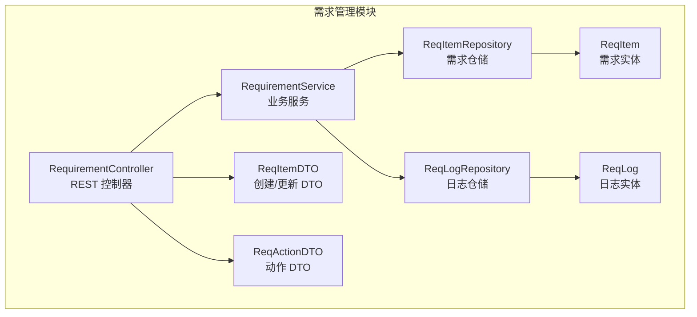
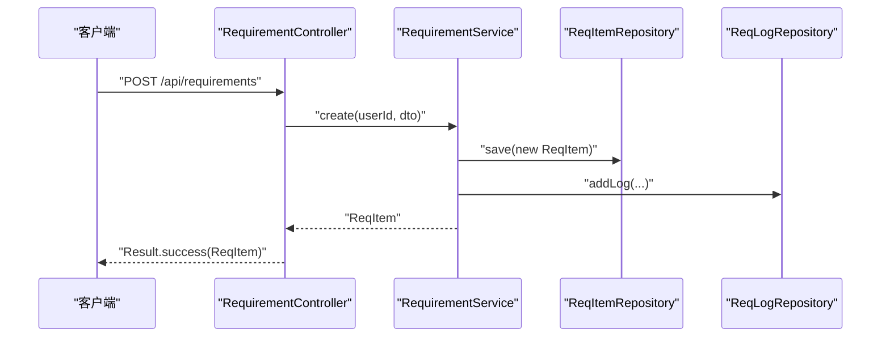
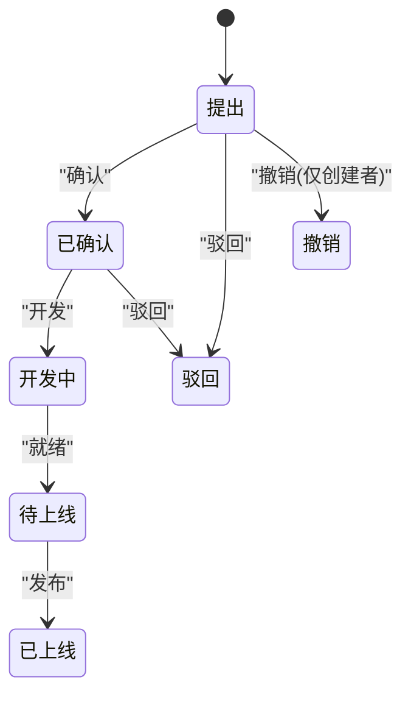
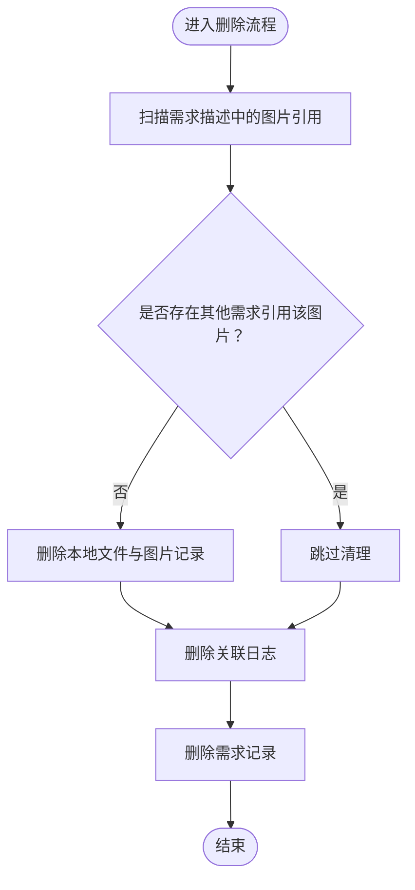
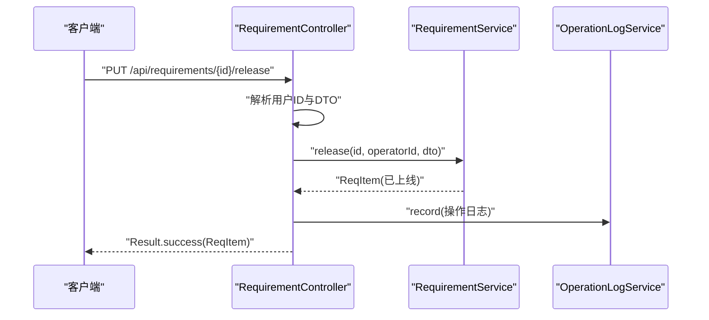
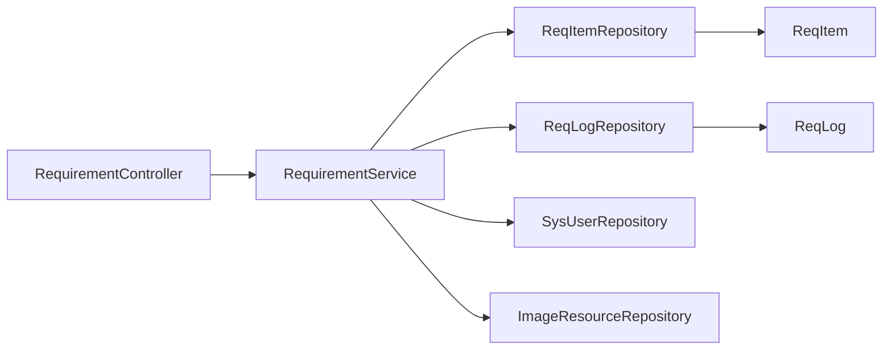

# 需求管理模块

<cite>
**本文引用的文件**
- [RequirementController.java](file://src/main/java/com/superpower/modules/requirement/controller/RequirementController.java)
- [RequirementService.java](file://src/main/java/com/superpower/modules/requirement/service/RequirementService.java)
- [ReqItem.java](file://src/main/java/com/superpower/modules/requirement/entity/ReqItem.java)
- [ReqLog.java](file://src/main/java/com/superpower/modules/requirement/entity/ReqLog.java)
- [ReqItemRepository.java](file://src/main/java/com/superpower/modules/requirement/repository/ReqItemRepository.java)
- [ReqLogRepository.java](file://src/main/java/com/superpower/modules/requirement/repository/ReqLogRepository.java)
- [ReqItemDTO.java](file://src/main/java/com/superpower/modules/requirement/dto/ReqItemDTO.java)
- [ReqActionDTO.java](file://src/main/java/com/superpower/modules/requirement/dto/ReqActionDTO.java)
</cite>

## 目录
1. [简介](#简介)
2. [项目结构](#项目结构)
3. [核心组件](#核心组件)
4. [架构总览](#架构总览)
5. [详细组件分析](#详细组件分析)
6. [依赖分析](#依赖分析)
7. [性能考虑](#性能考虑)
8. [故障排查指南](#故障排查指南)
9. [结论](#结论)
10. [附录](#附录)

## 简介
本技术文档围绕需求管理模块展开，系统性解析需求实体与需求日志的数据模型、状态机设计与变更追踪机制；深入说明需求服务的业务实现（创建、更新、删除、状态流转控制）；阐述控制器层的 API 设计（列表查询、详情查看、统计分析、审批动作集成）；并给出工作流程设计、数据一致性保障与扩展开发指南。目标是帮助开发者快速理解与高效维护该模块。

## 项目结构
需求管理模块位于后端 Java 工程的 requirement 子包下，采用分层架构：controller（控制器）、service（服务）、repository（仓储）、entity（实体）、dto（数据传输对象）。前端通过统一的 REST 接口与后端交互，支持需求全生命周期管理与审批流程集成。

**图表来源**
- [RequirementController.java:1-239](file://src/main/java/com/superpower/modules/requirement/controller/RequirementController.java#L1-L239)
- [RequirementService.java:1-274](file://src/main/java/com/superpower/modules/requirement/service/RequirementService.java#L1-L274)
- [ReqItemRepository.java:1-46](file://src/main/java/com/superpower/modules/requirement/repository/ReqItemRepository.java#L1-L46)
- [ReqLogRepository.java:1-14](file://src/main/java/com/superpower/modules/requirement/repository/ReqLogRepository.java#L1-L14)
- [ReqItem.java:1-60](file://src/main/java/com/superpower/modules/requirement/entity/ReqItem.java#L1-L60)
- [ReqLog.java:1-33](file://src/main/java/com/superpower/modules/requirement/entity/ReqLog.java#L1-L33)
- [ReqItemDTO.java:1-14](file://src/main/java/com/superpower/modules/requirement/dto/ReqItemDTO.java#L1-L14)
- [ReqActionDTO.java:1-11](file://src/main/java/com/superpower/modules/requirement/dto/ReqActionDTO.java#L1-L11)

**章节来源**
- [RequirementController.java:1-239](file://src/main/java/com/superpower/modules/requirement/controller/RequirementController.java#L1-L239)
- [RequirementService.java:1-274](file://src/main/java/com/superpower/modules/requirement/service/RequirementService.java#L1-L274)
- [ReqItemRepository.java:1-46](file://src/main/java/com/superpower/modules/requirement/repository/ReqItemRepository.java#L1-L46)
- [ReqLogRepository.java:1-14](file://src/main/java/com/superpower/modules/requirement/repository/ReqLogRepository.java#L1-L14)
- [ReqItem.java:1-60](file://src/main/java/com/superpower/modules/requirement/entity/ReqItem.java#L1-L60)
- [ReqLog.java:1-33](file://src/main/java/com/superpower/modules/requirement/entity/ReqLog.java#L1-L33)
- [ReqItemDTO.java:1-14](file://src/main/java/com/superpower/modules/requirement/dto/ReqItemDTO.java#L1-L14)
- [ReqActionDTO.java:1-11](file://src/main/java/com/superpower/modules/requirement/dto/ReqActionDTO.java#L1-L11)

## 核心组件
- 需求实体 ReqItem：承载需求基本信息、状态、优先级、分类、领域、类型、创建者、分配人、驳回原因、发布版本等字段，并记录创建与更新时间。
- 需求日志 ReqLog：记录每次状态变更或关键动作（如“创建”、“确认”、“开发中”、“待上线”、“已上线”、“驳回”、“撤销”）及操作人、备注、时间等信息。
- 需求服务 RequirementService：封装业务规则与状态机控制，负责需求创建、更新、删除、状态流转、日志记录、统计分析与编号生成。
- 控制器 RequirementController：暴露 REST API，处理鉴权、参数解析、调用服务层并返回统一封装结果。

**章节来源**
- [ReqItem.java:1-60](file://src/main/java/com/superpower/modules/requirement/entity/ReqItem.java#L1-L60)
- [ReqLog.java:1-33](file://src/main/java/com/superpower/modules/requirement/entity/ReqLog.java#L1-L33)
- [RequirementService.java:1-274](file://src/main/java/com/superpower/modules/requirement/service/RequirementService.java#L1-L274)
- [RequirementController.java:1-239](file://src/main/java/com/superpower/modules/requirement/controller/RequirementController.java#L1-L239)

## 架构总览
需求管理模块遵循典型的三层架构：表现层（控制器）、业务层（服务）、数据访问层（仓库）。控制器负责请求接入与响应封装；服务层实现业务逻辑与状态机校验；仓库层基于 JPA 提供数据持久化能力；实体与 DTO 负责数据建模与传输。

**图表来源**
- [RequirementController.java:164-170](file://src/main/java/com/superpower/modules/requirement/controller/RequirementController.java#L164-L170)
- [RequirementService.java:83-98](file://src/main/java/com/superpower/modules/requirement/service/RequirementService.java#L83-L98)
- [ReqItemRepository.java:1-46](file://src/main/java/com/superpower/modules/requirement/repository/ReqItemRepository.java#L1-L46)
- [ReqLogRepository.java:1-14](file://src/main/java/com/superpower/modules/requirement/repository/ReqLogRepository.java#L1-L14)

## 详细组件分析

### 数据模型与状态机设计
- 需求实体 ReqItem 字段覆盖标题、描述、状态、优先级、分类、领域、类型、创建者、分配人、驳回原因、发布版本、创建/更新时间等，满足基本需求管理与追踪需要。
- 需求日志 ReqLog 记录每次动作、评论、操作人与时间，形成完整审计轨迹。
- 状态机（中文状态）：提出 → 已确认 → 开发中 → 待上线 → 已上线；支持“驳回”与“撤销”两种异常路径。状态转换严格受前置条件约束，确保业务合规。

**图表来源**
- [RequirementService.java:119-192](file://src/main/java/com/superpower/modules/requirement/service/RequirementService.java#L119-L192)

**章节来源**
- [ReqItem.java:1-60](file://src/main/java/com/superpower/modules/requirement/entity/ReqItem.java#L1-L60)
- [ReqLog.java:1-33](file://src/main/java/com/superpower/modules/requirement/entity/ReqLog.java#L1-L33)
- [RequirementService.java:119-192](file://src/main/java/com/superpower/modules/requirement/service/RequirementService.java#L119-L192)

### 需求服务实现（RequirementService）
- 列表与筛选：支持按状态、创建者、时间范围、分类、领域、类型、优先级等多维过滤；空过滤条件时默认按创建时间倒序列出。
- 用户维度：支持按当前登录用户查询个人需求。
- 创建：填充默认优先级、生成唯一需求编号、设置初始状态为“提出”，并写入一条“创建”日志。
- 更新：仅允许创建者在“提出”状态下修改；更新时间戳。
- 删除：删除需求前扫描描述中的图片引用，若无其他需求引用则清理本地文件与图片资源记录，随后级联删除日志与需求。
- 状态流转：ensureStatus 校验前置状态，执行对应动作（确认、开发、就绪、发布），发布需提供版本号；驳回需提供原因；撤销仅创建者可操作且要求状态为“提出”。
- 日志：addLog 统一写入动作、评论与操作人。
- 统计：按状态、模块（分类）、类型进行分组计数。
- 编号生成：基于年份前缀与自增序号，避免冲突。

**图表来源**
- [RequirementService.java:194-216](file://src/main/java/com/superpower/modules/requirement/service/RequirementService.java#L194-L216)

**章节来源**
- [RequirementService.java:42-61](file://src/main/java/com/superpower/modules/requirement/service/RequirementService.java#L42-L61)
- [RequirementService.java:63-67](file://src/main/java/com/superpower/modules/requirement/service/RequirementService.java#L63-L67)
- [RequirementService.java:83-98](file://src/main/java/com/superpower/modules/requirement/service/RequirementService.java#L83-L98)
- [RequirementService.java:100-117](file://src/main/java/com/superpower/modules/requirement/service/RequirementService.java#L100-L117)
- [RequirementService.java:119-192](file://src/main/java/com/superpower/modules/requirement/service/RequirementService.java#L119-L192)
- [RequirementService.java:194-216](file://src/main/java/com/superpower/modules/requirement/service/RequirementService.java#L194-L216)
- [RequirementService.java:218-244](file://src/main/java/com/superpower/modules/requirement/service/RequirementService.java#L218-L244)
- [RequirementService.java:252-263](file://src/main/java/com/superpower/modules/requirement/service/RequirementService.java#L252-L263)
- [RequirementService.java:265-272](file://src/main/java/com/superpower/modules/requirement/service/RequirementService.java#L265-L272)

### 控制器层 API 设计（RequirementController）
- 列表查询：支持多维过滤与“我的”作用域；支持按昵称/用户名解析创建者。
- 详情查看：返回需求项与日志列表，并补充创建者昵称。
- 统计接口：按状态、模块（分类）、类型进行分组统计。
- 动作接口：提供确认、开发、就绪、发布、驳回、撤销等状态变更；均记录操作日志。
- 删除接口：仅管理员可调用，记录删除操作。

**图表来源**
- [RequirementController.java:204-210](file://src/main/java/com/superpower/modules/requirement/controller/RequirementController.java#L204-L210)
- [RequirementController.java:164-170](file://src/main/java/com/superpower/modules/requirement/controller/RequirementController.java#L164-L170)
- [RequirementController.java:228-237](file://src/main/java/com/superpower/modules/requirement/controller/RequirementController.java#L228-L237)

**章节来源**
- [RequirementController.java:55-82](file://src/main/java/com/superpower/modules/requirement/controller/RequirementController.java#L55-L82)
- [RequirementController.java:84-87](file://src/main/java/com/superpower/modules/requirement/controller/RequirementController.java#L84-L87)
- [RequirementController.java:89-98](file://src/main/java/com/superpower/modules/requirement/controller/RequirementController.java#L89-L98)
- [RequirementController.java:100-146](file://src/main/java/com/superpower/modules/requirement/controller/RequirementController.java#L100-L146)
- [RequirementController.java:164-237](file://src/main/java/com/superpower/modules/requirement/controller/RequirementController.java#L164-L237)

### DTO 定义
- ReqItemDTO：用于创建/更新需求时的输入载体，包含标题、描述、优先级、分类、领域、类型。
- ReqActionDTO：用于动作类操作的输入载体，包含评论、驳回原因、发布版本号。

**章节来源**
- [ReqItemDTO.java:1-14](file://src/main/java/com/superpower/modules/requirement/dto/ReqItemDTO.java#L1-L14)
- [ReqActionDTO.java:1-11](file://src/main/java/com/superpower/modules/requirement/dto/ReqActionDTO.java#L1-L11)

### 仓储层设计
- ReqItemRepository：提供按创建者、创建时间排序、多维过滤、编号前缀计数、按状态查询、描述关键词查询等方法。
- ReqLogRepository：提供按需求 ID 查询日志列表并按时间倒序排列。

**章节来源**
- [ReqItemRepository.java:1-46](file://src/main/java/com/superpower/modules/requirement/repository/ReqItemRepository.java#L1-L46)
- [ReqLogRepository.java:1-14](file://src/main/java/com/superpower/modules/requirement/repository/ReqLogRepository.java#L1-L14)

## 依赖分析
- 控制器依赖服务与系统用户仓储、操作日志服务与用户服务。
- 服务依赖需求与日志仓储、系统用户仓储、图片资源仓储。
- 实体之间无循环依赖，职责清晰。
- 仓储层基于 Spring Data JPA，简化了数据访问层代码。

**图表来源**
- [RequirementController.java:25-36](file://src/main/java/com/superpower/modules/requirement/controller/RequirementController.java#L25-L36)
- [RequirementService.java:27-40](file://src/main/java/com/superpower/modules/requirement/service/RequirementService.java#L27-L40)
- [ReqItemRepository.java:1-46](file://src/main/java/com/superpower/modules/requirement/repository/ReqItemRepository.java#L1-L46)
- [ReqLogRepository.java:1-14](file://src/main/java/com/superpower/modules/requirement/repository/ReqLogRepository.java#L1-L14)

**章节来源**
- [RequirementController.java:25-36](file://src/main/java/com/superpower/modules/requirement/controller/RequirementController.java#L25-L36)
- [RequirementService.java:27-40](file://src/main/java/com/superpower/modules/requirement/service/RequirementService.java#L27-L40)

## 性能考虑
- 列表查询：当无任何过滤条件时，默认按创建时间倒序查询，避免全表扫描；建议在高频查询字段上建立数据库索引（如 created_by、status、category、domain、type、priority、created_at）。
- 名称解析：在控制器中对创建者名称进行用户集合过滤，建议缓存常用用户映射以降低遍历成本。
- 图片清理：删除需求时扫描描述中的图片引用，若存在其他引用则跳过清理，避免重复 IO；建议对图片 URL 建立二级索引以加速查找。
- 事务边界：状态流转与日志写入在同一事务内，确保一致性；注意长事务可能带来的锁竞争，建议优化日志写入路径或拆分事务。
- 统计查询：统计接口基于内存分组，数据量大时建议引入数据库层面的聚合查询或缓存热点统计结果。

## 故障排查指南
- “需求不存在”：常见于 ID 错误或已被删除；检查控制器的 getById 调用与前端传参。
- “只能编辑自己提出的需求”或“只能撤销自己提出的需求”：确保当前用户为需求创建者；检查鉴权与用户解析逻辑。
- “状态不正确，无法执行此操作”：确认前置状态是否匹配；检查状态机流转顺序与 ensureStatus 校验。
- “上线操作必须填写版本号”或“驳回必须填写原因”：前端需校验必填字段；后端 DTO 校验失败会抛出业务异常。
- “删除失败或图片未清理”：检查描述中图片引用格式与正则匹配；确认文件系统路径与数据库记录一致。

**章节来源**
- [RequirementService.java:80-81](file://src/main/java/com/superpower/modules/requirement/service/RequirementService.java#L80-L81)
- [RequirementService.java:103-108](file://src/main/java/com/superpower/modules/requirement/service/RequirementService.java#L103-L108)
- [RequirementService.java:166-171](file://src/main/java/com/superpower/modules/requirement/service/RequirementService.java#L166-L171)
- [RequirementService.java:153-155](file://src/main/java/com/superpower/modules/requirement/service/RequirementService.java#L153-L155)
- [RequirementService.java:197-212](file://src/main/java/com/superpower/modules/requirement/service/RequirementService.java#L197-L212)

## 结论
需求管理模块以清晰的状态机与完善的日志体系为核心，结合严格的权限控制与统一的 API 设计，实现了从创建到发布的全生命周期管理。通过合理的仓储与服务分层，具备良好的可维护性与扩展性。建议后续在性能与可用性方面持续优化，如引入缓存、索引与异步日志等手段。

## 附录

### API 规范概览
- 获取需求列表：GET /api/requirements（支持多维过滤与“我的”作用域）
- 我的需求：GET /api/requirements/my
- 需求详情：GET /api/requirements/{id}（返回 item、logs、creatorName）
- 统计接口：GET /api/requirements/stats、/stats-by-module、/stats-by-type
- 创建需求：POST /api/requirements
- 更新需求：PUT /api/requirements/{id}
- 状态动作：PUT /api/requirements/{id}/confirm、/develop、/ready、/release、/reject、/cancel
- 删除需求：DELETE /api/requirements/{id}（管理员）

**章节来源**
- [RequirementController.java:55-237](file://src/main/java/com/superpower/modules/requirement/controller/RequirementController.java#L55-L237)