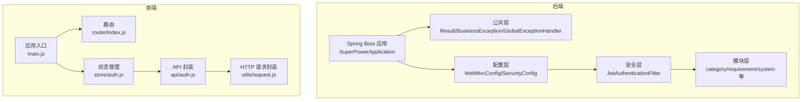
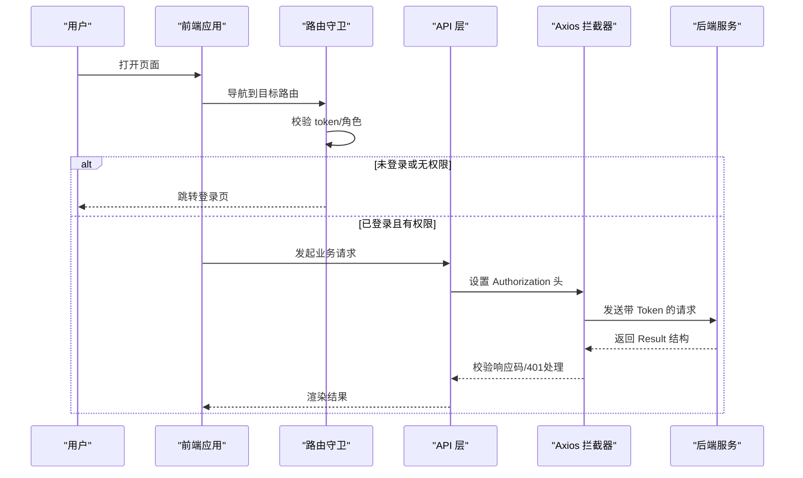
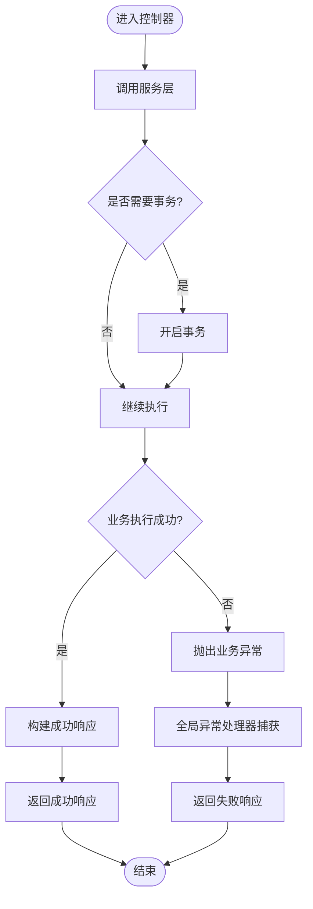
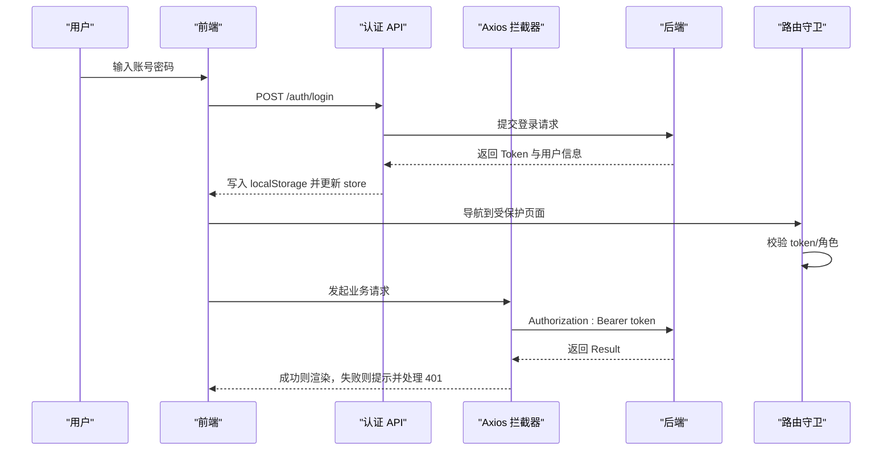
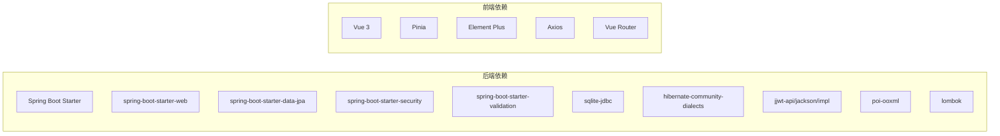

# 代码规范与最佳实践

<cite>
**本文档引用的文件**
- [SuperPowerApplication.java](file://src/main/java/com/superpower/SuperPowerApplication.java)
- [Result.java](file://src/main/java/com/superpower/common/Result.java)
- [BusinessException.java](file://src/main/java/com/superpower/common/BusinessException.java)
- [GlobalExceptionHandler.java](file://src/main/java/com/superpower/common/GlobalExceptionHandler.java)
- [WebMvcConfig.java](file://src/main/java/com/superpower/config/WebMvcConfig.java)
- [JwtAuthenticationFilter.java](file://src/main/java/com/superpower/security/JwtAuthenticationFilter.java)
- [CategoryController.java](file://src/main/java/com/superpower/modules/category/controller/CategoryController.java)
- [CategoryService.java](file://src/main/java/com/superpower/modules/category/service/CategoryService.java)
- [application.yml](file://src/main/resources/application.yml)
- [pom.xml](file://pom.xml)
- [main.js](file://frontend/src/main.js)
- [router/index.js](file://frontend/src/router/index.js)
- [store/auth.js](file://frontend/src/store/auth.js)
- [api/auth.js](file://frontend/src/api/auth.js)
- [utils/request.js](file://frontend/src/utils/request.js)
</cite>

## 目录
1. [引言](#引言)
2. [项目结构](#项目结构)
3. [核心组件](#核心组件)
4. [架构总览](#架构总览)
5. [详细组件分析](#详细组件分析)
6. [依赖分析](#依赖分析)
7. [性能考虑](#性能考虑)
8. [故障排查指南](#故障排查指南)
9. [结论](#结论)
10. [附录：代码审查检查清单](#附录代码审查检查清单)

## 引言
本指南面向产品清单管理系统（后端基于 Spring Boot，前端基于 Vue.js）的开发与维护团队，旨在统一代码风格、规范架构设计、明确异常与响应模型、完善前后端交互流程，并提供可执行的质量保障措施与审查清单。文档以仓库现有实现为依据，结合最佳实践给出改进建议与反面案例警示。

## 项目结构
项目采用分层清晰的模块化组织方式：
- 后端按功能域划分模块（如 category、requirement、system 等），每个模块包含 controller、service、repository、entity、dto 等层次
- 公共层集中于 common、config、security 等包，提供统一响应体、异常处理、安全过滤等基础设施
- 前端采用 Vue 3 + Pinia + Element Plus 架构，路由按页面功能组织，API 层封装请求拦截器与错误处理

图表来源
- [SuperPowerApplication.java:1-82](file://src/main/java/com/superpower/SuperPowerApplication.java#L1-L82)
- [WebMvcConfig.java:1-23](file://src/main/java/com/superpower/config/WebMvcConfig.java#L1-L23)
- [JwtAuthenticationFilter.java:1-62](file://src/main/java/com/superpower/security/JwtAuthenticationFilter.java#L1-L62)
- [main.js:1-20](file://frontend/src/main.js#L1-L20)
- [router/index.js:1-129](file://frontend/src/router/index.js#L1-L129)
- [store/auth.js:1-46](file://frontend/src/store/auth.js#L1-L46)
- [api/auth.js:1-22](file://frontend/src/api/auth.js#L1-L22)
- [utils/request.js:1-65](file://frontend/src/utils/request.js#L1-L65)

章节来源
- [SuperPowerApplication.java:1-82](file://src/main/java/com/superpower/SuperPowerApplication.java#L1-L82)
- [pom.xml:1-116](file://pom.xml#L1-L116)
- [application.yml:1-40](file://src/main/resources/application.yml#L1-L40)
- [main.js:1-20](file://frontend/src/main.js#L1-L20)

## 核心组件
- 统一响应体与异常模型：通过 Result 统一返回结构，BusinessException 定义业务异常码，GlobalExceptionHandler 提供全局异常映射
- 安全与认证：基于 JWT 的过滤器链，支持从 Header 或查询参数提取令牌
- 资源访问：WebMvcConfig 暴露本地文件资源路径，支持图片与需求文件访问
- 前端请求封装：基于 Axios 的请求实例，内置拦截器处理鉴权头与错误提示

章节来源
- [Result.java:1-41](file://src/main/java/com/superpower/common/Result.java#L1-L41)
- [BusinessException.java:1-24](file://src/main/java/com/superpower/common/BusinessException.java#L1-L24)
- [GlobalExceptionHandler.java:1-49](file://src/main/java/com/superpower/common/GlobalExceptionHandler.java#L1-L49)
- [JwtAuthenticationFilter.java:1-62](file://src/main/java/com/superpower/security/JwtAuthenticationFilter.java#L1-L62)
- [WebMvcConfig.java:1-23](file://src/main/java/com/superpower/config/WebMvcConfig.java#L1-L23)
- [utils/request.js:1-65](file://frontend/src/utils/request.js#L1-L65)

## 架构总览
后端采用分层架构：Controller 接收请求，Service 执行业务逻辑，Repository 访问数据库；异常在全局处理器中统一转换为 Result 结构。前端通过 Pinia 管理登录态，Axios 封装统一请求与错误处理，路由守卫控制访问权限。

图表来源
- [router/index.js:111-126](file://frontend/src/router/index.js#L111-L126)
- [utils/request.js:24-62](file://frontend/src/utils/request.js#L24-L62)
- [api/auth.js:1-22](file://frontend/src/api/auth.js#L1-L22)
- [CategoryController.java:1-66](file://src/main/java/com/superpower/modules/category/controller/CategoryController.java#L1-L66)
- [GlobalExceptionHandler.java:1-49](file://src/main/java/com/superpower/common/GlobalExceptionHandler.java#L1-L49)

## 详细组件分析

### Java 后端代码规范与最佳实践

- 命名约定
  - 包名全部小写，层级清晰（如 com.superpower.modules.category）
  - 类名使用帕斯卡命名，接口与抽象类同理
  - 方法名使用驼峰，常量使用全大写+下划线
  - DTO/Entity 字段与数据库列保持一致，避免无意义缩写

- 类设计原则
  - 控制器仅负责参数接收与返回封装，不直接操作数据
  - Service 使用事务注解标注跨表修改或一致性要求高的方法
  - Repository 优先使用方法名查询，复杂查询使用 @Query 或原生 SQL
  - 避免在 Service 中直接抛出运行时异常，统一包装为 BusinessException

- 异常处理模式
  - 业务异常使用 BusinessException，携带业务码与消息
  - 全局异常处理器将异常映射为 Result 结构，确保前端统一处理
  - 对于校验异常，收集字段错误信息并返回给前端

- 注释标准
  - 公共 API 添加简要说明，参数与返回值标注清楚
  - 复杂业务逻辑添加步骤注释，便于后续维护
  - 重要配置项与默认值在注释中说明用途与取值范围

- 依赖注入与配置
  - 构造函数注入优于字段注入，提升可测试性
  - 配置类通过 @Value 读取 application.yml 中的属性
  - 安全过滤器在 doFilterInternal 中完成令牌解析与用户上下文设置

- 反面案例警示
  - 在 Controller 中直接进行多表更新而不加事务，可能导致数据不一致
  - 在 Service 中对异常不做包装，导致全局异常处理器无法识别业务错误
  - 忽略空指针与越界检查，引发运行时异常

章节来源
- [CategoryController.java:1-66](file://src/main/java/com/superpower/modules/category/controller/CategoryController.java#L1-L66)
- [CategoryService.java:1-273](file://src/main/java/com/superpower/modules/category/service/CategoryService.java#L1-L273)
- [BusinessException.java:1-24](file://src/main/java/com/superpower/common/BusinessException.java#L1-L24)
- [GlobalExceptionHandler.java:1-49](file://src/main/java/com/superpower/common/GlobalExceptionHandler.java#L1-L49)
- [WebMvcConfig.java:1-23](file://src/main/java/com/superpower/config/WebMvcConfig.java#L1-L23)
- [JwtAuthenticationFilter.java:1-62](file://src/main/java/com/superpower/security/JwtAuthenticationFilter.java#L1-L62)

### Spring Boot 架构规范

- 包结构组织
  - common：通用工具类、统一响应体、异常与全局处理器
  - config：WebMvc、Security、JPA 自定义方言等配置
  - security：认证与授权相关组件（过滤器、用户详情服务、令牌提供者）
  - modules：按业务域划分（category、requirement、system 等），每域包含 controller、service、repository、entity、dto

- 依赖注入使用
  - 构造函数注入所有依赖，减少可变状态
  - 在 Application 启动时初始化基础数据与默认用户

- 配置管理
  - application.yml 中集中管理数据库连接、日志级别、JWT 参数、文件存储路径等
  - WebMvcConfig 通过 @Value 注入路径，暴露静态资源访问

- 反面案例警示
  - 在 controller 中直接调用 repository 并进行复杂业务判断
  - 在 service 中遗漏 @Transactional，导致部分更新未回滚
  - 忘记在 pom.xml 中声明必要的 starter 或依赖版本冲突

章节来源
- [SuperPowerApplication.java:1-82](file://src/main/java/com/superpower/SuperPowerApplication.java#L1-L82)
- [application.yml:1-40](file://src/main/resources/application.yml#L1-L40)
- [WebMvcConfig.java:1-23](file://src/main/java/com/superpower/config/WebMvcConfig.java#L1-L23)
- [pom.xml:1-116](file://pom.xml#L1-L116)

### Vue.js 前端代码规范

- 组件设计
  - 页面组件按路由拆分，复用组件尽量抽象为通用组件
  - 表单组件统一校验与提交流程，避免重复逻辑

- 状态管理
  - 使用 Pinia 管理登录态与用户信息，避免在组件内直接持久化
  - 登录成功后同步写入 localStorage，并在 store 中同步状态

- API 调用规范
  - 所有 API 调用通过 utils/request.js 发起，自动附加 Authorization 头
  - 响应拦截器统一处理非 200 状态与 401/403 场景，跳转登录页

- 路由与权限
  - 路由守卫根据 token 与角色 meta 控制访问
  - 未登录访问受保护路由时重定向至登录页

- 反面案例警示
  - 在组件内直接发起请求而不经封装，导致重复代码与错误处理分散
  - 忘记在请求拦截器中设置 Authorization 头，导致接口 401
  - 在 store 中只写内存状态而忽略 localStorage，刷新后丢失登录态

章节来源
- [main.js:1-20](file://frontend/src/main.js#L1-L20)
- [router/index.js:1-129](file://frontend/src/router/index.js#L1-L129)
- [store/auth.js:1-46](file://frontend/src/store/auth.js#L1-L46)
- [api/auth.js:1-22](file://frontend/src/api/auth.js#L1-L22)
- [utils/request.js:1-65](file://frontend/src/utils/request.js#L1-L65)

### 关键流程图示

#### 统一响应与异常处理流程

图表来源
- [CategoryController.java:1-66](file://src/main/java/com/superpower/modules/category/controller/CategoryController.java#L1-L66)
- [CategoryService.java:1-273](file://src/main/java/com/superpower/modules/category/service/CategoryService.java#L1-L273)
- [GlobalExceptionHandler.java:1-49](file://src/main/java/com/superpower/common/GlobalExceptionHandler.java#L1-L49)

#### 登录与鉴权流程

图表来源
- [api/auth.js:1-22](file://frontend/src/api/auth.js#L1-L22)
- [utils/request.js:24-62](file://frontend/src/utils/request.js#L24-L62)
- [router/index.js:111-126](file://frontend/src/router/index.js#L111-L126)
- [JwtAuthenticationFilter.java:32-48](file://src/main/java/com/superpower/security/JwtAuthenticationFilter.java#L32-L48)

## 依赖分析
后端使用 Spring Boot 3.2.0，核心依赖包括 web、jpa、security、validation、sqlite 驱动、jjwt、poi 等；前端使用 Vue 3、Element Plus、Pinia、Axios，路由基于 history 模式。

图表来源
- [pom.xml:21-84](file://pom.xml#L21-L84)
- [main.js:1-20](file://frontend/src/main.js#L1-L20)

章节来源
- [pom.xml:1-116](file://pom.xml#L1-L116)
- [main.js:1-20](file://frontend/src/main.js#L1-L20)

## 性能考虑
- 数据库连接池与超时：合理设置最大连接数与连接超时，避免高并发下的连接泄漏
- 查询优化：优先使用索引列查询，避免 N+1 查询；复杂树形结构建议一次性加载并组装
- 缓存策略：对只读数据与热点配置引入缓存，降低数据库压力
- 文件上传：限制文件大小与类型，使用流式处理避免内存溢出
- 前端渲染：对长列表使用虚拟滚动，减少 DOM 节点数量

## 故障排查指南
- 登录 401/403
  - 检查请求头 Authorization 是否正确设置
  - 校验 token 是否过期或被服务器注销
  - 查看全局拦截器对 401 的处理逻辑

- 业务异常未被捕获
  - 确认 Service 是否抛出 BusinessException
  - 检查全局异常处理器是否注册并生效

- 资源访问失败
  - 校验 WebMvcConfig 中的资源路径与实际存储路径一致
  - 确认文件权限与目录存在性

章节来源
- [utils/request.js:32-62](file://frontend/src/utils/request.js#L32-L62)
- [GlobalExceptionHandler.java:17-47](file://src/main/java/com/superpower/common/GlobalExceptionHandler.java#L17-L47)
- [WebMvcConfig.java:14-21](file://src/main/java/com/superpower/config/WebMvcConfig.java#L14-L21)

## 结论
本项目在统一响应体、全局异常处理、JWT 认证与资源访问方面具备良好基础。建议在后续迭代中进一步强化：
- 明确的代码审查清单与自动化检查
- 单元测试与集成测试覆盖率提升
- 日志分级与可观测性增强
- 前后端契约文档与接口版本管理

## 附录：代码审查检查清单
- 命名与注释
  - 类/方法/变量命名是否符合约定
  - 是否为公共 API 添加了清晰注释
- 分层与职责
  - Controller 是否仅做参数与返回封装
  - Service 是否正确使用事务注解
  - Repository 是否使用合适的方法命名与查询
- 异常与错误处理
  - 是否统一使用 BusinessException
  - 全局异常处理器是否覆盖常见异常
- 安全与鉴权
  - 是否在关键接口启用权限校验
  - JWT 过滤器是否正确设置用户上下文
- 配置与环境
  - application.yml 中的关键配置是否合理
  - 资源路径与文件存储是否一致
- 前端规范
  - API 调用是否通过统一封装
  - 路由守卫是否正确校验 token 与角色
  - Pinia 状态是否与本地存储保持一致