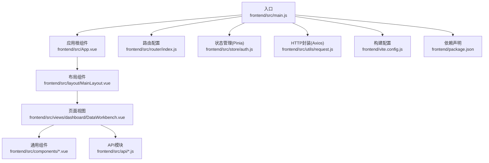
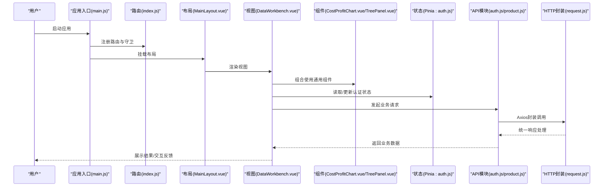
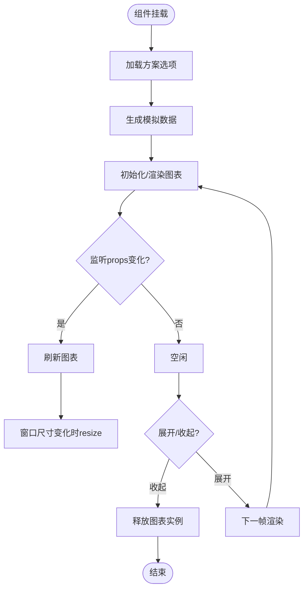
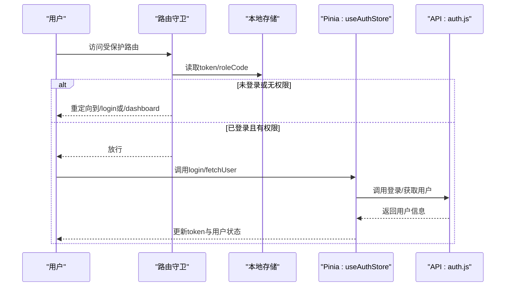
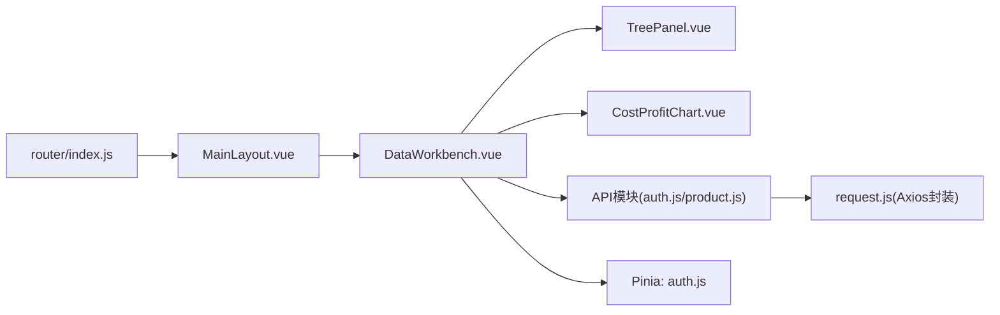

# 前端Vue.js代码规范

<cite>
**本文引用的文件**
- [main.js](file://frontend/src/main.js)
- [App.vue](file://frontend/src/App.vue)
- [vite.config.js](file://frontend/vite.config.js)
- [package.json](file://frontend/package.json)
- [index.js](file://frontend/src/router/index.js)
- [auth.js](file://frontend/src/store/auth.js)
- [request.js](file://frontend/src/utils/request.js)
- [CostProfitChart.vue](file://frontend/src/components/CostProfitChart.vue)
- [MainLayout.vue](file://frontend/src/layout/MainLayout.vue)
- [DataWorkbench.vue](file://frontend/src/views/dashboard/DataWorkbench.vue)
- [auth.js](file://frontend/src/api/auth.js)
- [product.js](file://frontend/src/api/product.js)
- [TreePanel.vue](file://frontend/src/components/TreePanel.vue)
- [liquid-glass-theme.css](file://frontend/src/styles/liquid-glass-theme.css)
- [platformModules.js](file://frontend/src/constants/platformModules.js)
</cite>

## 目录
1. [引言](#引言)
2. [项目结构](#项目结构)
3. [核心组件](#核心组件)
4. [架构总览](#架构总览)
5. [详细组件分析](#详细组件分析)
6. [依赖关系分析](#依赖关系分析)
7. [性能考虑](#性能考虑)
8. [故障排查指南](#故障排查指南)
9. [结论](#结论)
10. [附录](#附录)

## 引言
本规范面向产品清单管理系统前端Vue.js代码，围绕Vue 3 Composition API、组件设计、状态管理、API调用、路由与样式管理、构建配置等方面制定统一的编码标准与最佳实践，确保代码一致性、可维护性与可扩展性。

## 项目结构
前端采用Vite+Vue 3+Element Plus+Pinia技术栈，目录组织遵循“按功能域分层”的方式：views、components、layout、store、router、api、utils、styles、constants等模块职责清晰，便于团队协作与长期演进。

**图表来源**
- [main.js:1-20](file://frontend/src/main.js#L1-L20)
- [App.vue:1-22](file://frontend/src/App.vue#L1-L22)
- [index.js:1-129](file://frontend/src/router/index.js#L1-L129)
- [auth.js:1-46](file://frontend/src/store/auth.js#L1-L46)
- [request.js:1-65](file://frontend/src/utils/request.js#L1-L65)
- [MainLayout.vue:1-423](file://frontend/src/layout/MainLayout.vue#L1-L423)
- [DataWorkbench.vue:1-800](file://frontend/src/views/dashboard/DataWorkbench.vue#L1-L800)
- [vite.config.js:1-20](file://frontend/vite.config.js#L1-L20)
- [package.json:1-28](file://frontend/package.json#L1-L28)

**章节来源**
- [main.js:1-20](file://frontend/src/main.js#L1-L20)
- [package.json:1-28](file://frontend/package.json#L1-L28)

## 核心组件
- 应用入口与全局注册
  - 在入口文件中完成应用实例创建、插件安装（Element Plus、路由、Pinia）、图标全局注册与挂载。
  - 参考路径：[main.js:1-20](file://frontend/src/main.js#L1-L20)
- 根组件与全局样式
  - 根组件负责路由视图渲染与全局样式引入；全局样式覆盖Element Plus主题变量，统一视觉风格。
  - 参考路径：[App.vue:1-22](file://frontend/src/App.vue#L1-L22)、[liquid-glass-theme.css:1-236](file://frontend/src/styles/liquid-glass-theme.css#L1-L236)
- 路由与鉴权守卫
  - 定义多级菜单路由与懒加载视图；在前置守卫中校验token与角色权限，保障受保护页面的安全访问。
  - 参考路径：[index.js:1-129](file://frontend/src/router/index.js#L1-L129)
- 状态管理（Pinia）
  - 使用Composition Store封装认证状态与行为，集中管理token、用户信息与登录/登出流程。
  - 参考路径：[auth.js:1-46](file://frontend/src/store/auth.js#L1-L46)
- HTTP请求封装（Axios）
  - 统一基地址、超时、请求头注入、响应拦截与错误处理，支持Blob/text等特殊响应类型。
  - 参考路径：[request.js:1-65](file://frontend/src/utils/request.js#L1-L65)

**章节来源**
- [main.js:1-20](file://frontend/src/main.js#L1-L20)
- [App.vue:1-22](file://frontend/src/App.vue#L1-L22)
- [index.js:1-129](file://frontend/src/router/index.js#L1-L129)
- [auth.js:1-46](file://frontend/src/store/auth.js#L1-L46)
- [request.js:1-65](file://frontend/src/utils/request.js#L1-L65)

## 架构总览
下图展示从入口到页面、组件、API与状态管理的整体交互流程。

**图表来源**
- [main.js:1-20](file://frontend/src/main.js#L1-L20)
- [index.js:1-129](file://frontend/src/router/index.js#L1-L129)
- [MainLayout.vue:1-423](file://frontend/src/layout/MainLayout.vue#L1-L423)
- [DataWorkbench.vue:1-800](file://frontend/src/views/dashboard/DataWorkbench.vue#L1-L800)
- [auth.js:1-46](file://frontend/src/store/auth.js#L1-L46)
- [auth.js:1-22](file://frontend/src/api/auth.js#L1-L22)
- [product.js:1-65](file://frontend/src/api/product.js#L1-L65)
- [request.js:1-65](file://frontend/src/utils/request.js#L1-L65)

## 详细组件分析

### Vue 3 Composition API 使用规范
- setup函数使用
  - 所有组件均采用<script setup>语法，使用组合式API进行响应式声明与生命周期绑定。
  - 示例参考：[DataWorkbench.vue:315-380](file://frontend/src/views/dashboard/DataWorkbench.vue#L315-L380)、[TreePanel.vue:38-82](file://frontend/src/components/TreePanel.vue#L38-L82)
- 响应式数据管理
  - 使用ref/reactive管理本地状态；使用computed派生计算属性；watch监听响应式变化并触发副作用。
  - 示例参考：[MainLayout.vue:158-194](file://frontend/src/layout/MainLayout.vue#L158-L194)、[DataWorkbench.vue:332-382](file://frontend/src/views/dashboard/DataWorkbench.vue#L332-L382)
- 生命周期钩子
  - onMounted/onBeforeUnmount等钩子用于初始化与资源清理；避免在模板中直接执行副作用。
  - 示例参考：[CostProfitChart.vue:242-254](file://frontend/src/components/CostProfitChart.vue#L242-L254)、[DataWorkbench.vue:456-459](file://frontend/src/views/dashboard/DataWorkbench.vue#L456-L459)
- 事件与emit
  - 子组件通过defineEmits向父组件传递事件，父组件通过v-model或事件回调接收并处理。
  - 示例参考：[TreePanel.vue:46-46](file://frontend/src/components/TreePanel.vue#L46-L46)、[DataWorkbench.vue:64-144](file://frontend/src/views/dashboard/DataWorkbench.vue#L64-L144)

**章节来源**
- [DataWorkbench.vue:315-380](file://frontend/src/views/dashboard/DataWorkbench.vue#L315-L380)
- [TreePanel.vue:38-82](file://frontend/src/components/TreePanel.vue#L38-L82)
- [MainLayout.vue:158-194](file://frontend/src/layout/MainLayout.vue#L158-L194)
- [CostProfitChart.vue:242-254](file://frontend/src/components/CostProfitChart.vue#L242-L254)

### 组件设计原则与命名规范
- 单文件组件结构
  - 严格遵循<template>/<script setup>/<style scoped>三段式结构；组件职责单一，逻辑内聚。
  - 示例参考：[CostProfitChart.vue:1-344](file://frontend/src/components/CostProfitChart.vue#L1-L344)、[TreePanel.vue:1-200](file://frontend/src/components/TreePanel.vue#L1-L200)
- 组件命名
  - 遵循PascalCase命名，如CostProfitChart.vue、MainLayout.vue、TreePanel.vue；避免使用缩写。
- Props与事件
  - Props显式声明类型与默认值；事件命名采用kebab-case，如@open-preview、@navigate-to-list。
  - 示例参考：[CostProfitChart.vue:37-40](file://frontend/src/components/CostProfitChart.vue#L37-L40)、[DataWorkbench.vue:64-144](file://frontend/src/views/dashboard/DataWorkbench.vue#L64-L144)

**章节来源**
- [CostProfitChart.vue:1-344](file://frontend/src/components/CostProfitChart.vue#L1-L344)
- [TreePanel.vue:1-200](file://frontend/src/components/TreePanel.vue#L1-L200)
- [DataWorkbench.vue:64-144](file://frontend/src/views/dashboard/DataWorkbench.vue#L64-L144)

### 状态管理规范（Pinia）
- Store设计
  - 使用defineStore定义模块化store；将状态、getter与action分离；避免在store中直接操作DOM。
  - 示例参考：[auth.js:5-44](file://frontend/src/store/auth.js#L5-L44)
- 状态命名约定
  - 状态使用名词短语，如token、user；action使用动词短语，如login、logout、fetchUser；getter使用描述性短语，如isAdmin。
- action与getter编写规范
  - 异步action返回Promise；在action内部处理错误并更新状态；getter只做纯计算。
  - 示例参考：[auth.js:9-28](file://frontend/src/store/auth.js#L9-L28)

**章节来源**
- [auth.js:1-46](file://frontend/src/store/auth.js#L1-L46)

### API 接口调用规范
- Axios封装
  - 统一设置baseURL、timeout、params序列化策略；请求头自动注入Authorization；对Blob/text响应类型特殊处理。
  - 示例参考：[request.js:5-22](file://frontend/src/utils/request.js#L5-L22)
- 请求拦截器
  - 自动从localStorage读取token并注入Authorization头；保持无状态请求的一致性。
  - 示例参考：[request.js:24-30](file://frontend/src/utils/request.js#L24-L30)
- 响应拦截器
  - 对非200状态码统一弹窗提示并跳转登录；对401/403统一登出并跳转登录；对Promise.reject进行包装以便上层捕获。
  - 示例参考：[request.js:32-62](file://frontend/src/utils/request.js#L32-L62)
- API模块组织
  - 按业务域拆分API文件，如auth.js、product.js；每个方法明确HTTP动词与参数。
  - 示例参考：[auth.js:1-22](file://frontend/src/api/auth.js#L1-L22)、[product.js:1-65](file://frontend/src/api/product.js#L1-L65)

**章节来源**
- [request.js:1-65](file://frontend/src/utils/request.js#L1-L65)
- [auth.js:1-22](file://frontend/src/api/auth.js#L1-L22)
- [product.js:1-65](file://frontend/src/api/product.js#L1-L65)

### 路由配置规范
- 路由定义
  - 使用createRouter与createWebHistory；嵌套路由配合MainLayout；懒加载组件提升首屏性能。
  - 示例参考：[index.js:3-104](file://frontend/src/router/index.js#L3-L104)
- 导航守卫
  - beforeEach中校验token与角色meta字段；未登录重定向至/login；无权限跳转/dashboard。
  - 示例参考：[index.js:111-126](file://frontend/src/router/index.js#L111-L126)

**章节来源**
- [index.js:1-129](file://frontend/src/router/index.js#L1-L129)

### 样式管理规范
- 主题覆盖
  - 通过CSS变量覆盖Element Plus主题，统一主色、边框、阴影与字体；避免在组件内重复覆盖。
  - 示例参考：[liquid-glass-theme.css:1-47](file://frontend/src/styles/liquid-glass-theme.css#L1-L47)
- 组件样式
  - 使用scoped样式隔离组件样式；使用CSS变量与Element Plus类名保持一致风格。
  - 示例参考：[MainLayout.vue:274-422](file://frontend/src/layout/MainLayout.vue#L274-L422)、[TreePanel.vue:145-200](file://frontend/src/components/TreePanel.vue#L145-L200)

**章节来源**
- [liquid-glass-theme.css:1-236](file://frontend/src/styles/liquid-glass-theme.css#L1-L236)
- [MainLayout.vue:274-422](file://frontend/src/layout/MainLayout.vue#L274-L422)
- [TreePanel.vue:145-200](file://frontend/src/components/TreePanel.vue#L145-L200)

### 构建配置要求
- Vite配置
  - 插件：@vitejs/plugin-vue；目标环境：es2020；开发服务器：端口5173；代理/api至后端8080。
  - 示例参考：[vite.config.js:1-20](file://frontend/vite.config.js#L1-L20)
- 依赖管理
  - 生产依赖：vue、vue-router、pinia、element-plus、axios、echarts、vue-echarts等；开发依赖：vite、@vitejs/plugin-vue。
  - 示例参考：[package.json:1-28](file://frontend/package.json#L1-L28)

**章节来源**
- [vite.config.js:1-20](file://frontend/vite.config.js#L1-L20)
- [package.json:1-28](file://frontend/package.json#L1-L28)

### 数据流与交互流程（以图表组件为例）

**图表来源**
- [CostProfitChart.vue:242-254](file://frontend/src/components/CostProfitChart.vue#L242-L254)
- [CostProfitChart.vue:37-40](file://frontend/src/components/CostProfitChart.vue#L37-L40)
- [CostProfitChart.vue:68-89](file://frontend/src/components/CostProfitChart.vue#L68-L89)
- [CostProfitChart.vue:91-189](file://frontend/src/components/CostProfitChart.vue#L91-L189)

**章节来源**
- [CostProfitChart.vue:1-344](file://frontend/src/components/CostProfitChart.vue#L1-L344)

### 登录与权限控制流程

**图表来源**
- [index.js:111-126](file://frontend/src/router/index.js#L111-L126)
- [auth.js:9-28](file://frontend/src/store/auth.js#L9-L28)
- [auth.js:1-22](file://frontend/src/api/auth.js#L1-L22)

**章节来源**
- [index.js:111-126](file://frontend/src/router/index.js#L111-L126)
- [auth.js:1-46](file://frontend/src/store/auth.js#L1-L46)
- [auth.js:1-22](file://frontend/src/api/auth.js#L1-L22)

## 依赖关系分析
- 组件间依赖
  - DataWorkbench作为页面容器，组合TreePanel、StatsTab、DataListTab、PanoramaTab等子组件；通过props与事件通信。
  - 示例参考：[DataWorkbench.vue:60-145](file://frontend/src/views/dashboard/DataWorkbench.vue#L60-L145)
- API与工具依赖
  - 页面与组件通过API模块发起请求；API模块依赖Axios封装；store依赖API模块。
  - 示例参考：[DataWorkbench.vue:315-330](file://frontend/src/views/dashboard/DataWorkbench.vue#L315-L330)、[auth.js:1-22](file://frontend/src/api/auth.js#L1-L22)、[request.js:1-65](file://frontend/src/utils/request.js#L1-L65)
- 路由与布局
  - 路由配置与MainLayout耦合，MainLayout提供菜单、头部与侧边栏，DataWorkbench作为内容区。
  - 示例参考：[index.js:1-104](file://frontend/src/router/index.js#L1-L104)、[MainLayout.vue:1-156](file://frontend/src/layout/MainLayout.vue#L1-L156)

**图表来源**
- [DataWorkbench.vue:1-800](file://frontend/src/views/dashboard/DataWorkbench.vue#L1-L800)
- [TreePanel.vue:1-200](file://frontend/src/components/TreePanel.vue#L1-L200)
- [CostProfitChart.vue:1-344](file://frontend/src/components/CostProfitChart.vue#L1-L344)
- [auth.js:1-22](file://frontend/src/api/auth.js#L1-L22)
- [product.js:1-65](file://frontend/src/api/product.js#L1-L65)
- [request.js:1-65](file://frontend/src/utils/request.js#L1-L65)
- [auth.js:1-46](file://frontend/src/store/auth.js#L1-L46)
- [MainLayout.vue:1-423](file://frontend/src/layout/MainLayout.vue#L1-L423)
- [index.js:1-129](file://frontend/src/router/index.js#L1-L129)

**章节来源**
- [DataWorkbench.vue:1-800](file://frontend/src/views/dashboard/DataWorkbench.vue#L1-L800)
- [TreePanel.vue:1-200](file://frontend/src/components/TreePanel.vue#L1-L200)
- [CostProfitChart.vue:1-344](file://frontend/src/components/CostProfitChart.vue#L1-L344)
- [auth.js:1-22](file://frontend/src/api/auth.js#L1-L22)
- [product.js:1-65](file://frontend/src/api/product.js#L1-L65)
- [request.js:1-65](file://frontend/src/utils/request.js#L1-L65)
- [auth.js:1-46](file://frontend/src/store/auth.js#L1-L46)
- [MainLayout.vue:1-423](file://frontend/src/layout/MainLayout.vue#L1-L423)
- [index.js:1-129](file://frontend/src/router/index.js#L1-L129)

## 性能考虑
- 组件懒加载与按需渲染
  - 路由与组件均采用动态导入与v-show控制渲染，减少初始包体与首屏压力。
  - 参考路径：[index.js:7-103](file://frontend/src/router/index.js#L7-L103)、[CostProfitChart.vue:27-27](file://frontend/src/components/CostProfitChart.vue#L27-L27)
- 图表性能优化
  - 懒渲染与resize适配；收起时释放实例；使用nextTick确保DOM更新后再渲染。
  - 参考路径：[CostProfitChart.vue:191-204](file://frontend/src/components/CostProfitChart.vue#L191-L204)、[CostProfitChart.vue:229-231](file://frontend/src/components/CostProfitChart.vue#L229-L231)
- 响应式监听与防抖
  - 大量watch场景建议结合computed与局部刷新，避免全量重算。
  - 参考路径：[DataWorkbench.vue:487-500](file://frontend/src/views/dashboard/DataWorkbench.vue#L487-L500)

[本节为通用指导，无需具体文件分析]

## 故障排查指南
- 登录态异常
  - 现象：401/403频繁弹窗或无法进入受保护页面。
  - 排查：检查localStorage中的token/roleCode是否正确；确认路由守卫逻辑与Axios拦截器Authorization头注入。
  - 参考路径：[index.js:111-126](file://frontend/src/router/index.js#L111-L126)、[request.js:24-30](file://frontend/src/utils/request.js#L24-L30)
- 请求失败与错误提示
  - 现象：接口报错或无提示。
  - 排查：查看响应拦截器对非200状态码的处理与消息提示；确认后端返回结构与message字段。
  - 参考路径：[request.js:32-62](file://frontend/src/utils/request.js#L32-L62)
- 图表不显示或空白
  - 现象：展开后图表不渲染。
  - 排查：确认chartRef存在且容器尺寸大于0；检查nextTick与resize处理；收起时确保dispose释放。
  - 参考路径：[CostProfitChart.vue:91-98](file://frontend/src/components/CostProfitChart.vue#L91-L98)、[CostProfitChart.vue:229-231](file://frontend/src/components/CostProfitChart.vue#L229-L231)

**章节来源**
- [index.js:111-126](file://frontend/src/router/index.js#L111-L126)
- [request.js:24-62](file://frontend/src/utils/request.js#L24-L62)
- [CostProfitChart.vue:91-98](file://frontend/src/components/CostProfitChart.vue#L91-L98)

## 结论
本规范基于现有代码实践总结，明确了Vue 3 Composition API使用、组件设计、状态管理、API封装、路由与样式管理、构建配置等方面的最佳实践。建议团队在新增功能时严格遵循上述规范，确保代码一致性与可维护性。

[本节为总结性内容，无需具体文件分析]

## 附录
- 平台模块常量
  - 用于菜单与权限映射的数据结构，建议在布局与路由中复用，避免硬编码。
  - 参考路径：[platformModules.js:1-29](file://frontend/src/constants/platformModules.js#L1-L29)

**章节来源**
- [platformModules.js:1-29](file://frontend/src/constants/platformModules.js#L1-L29)