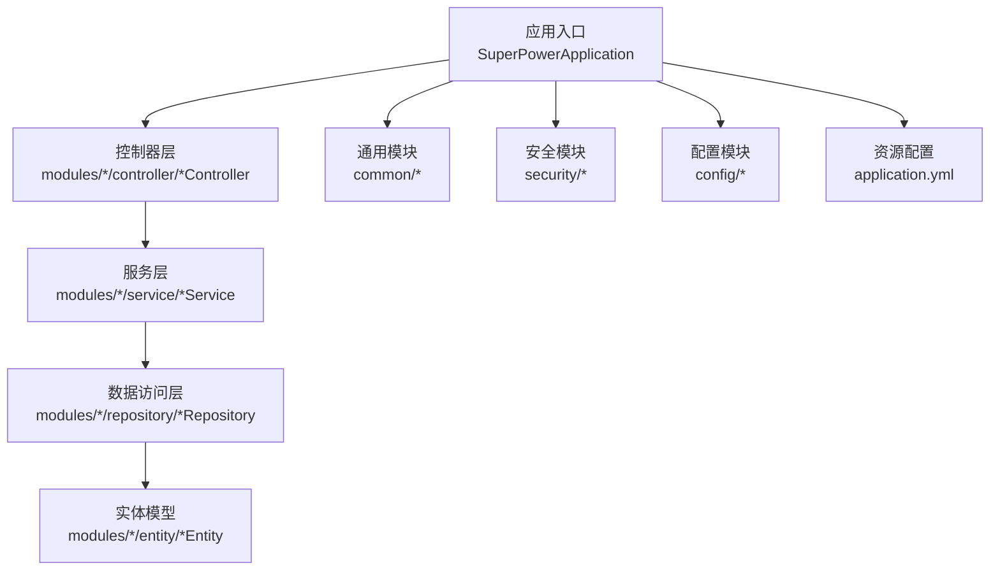
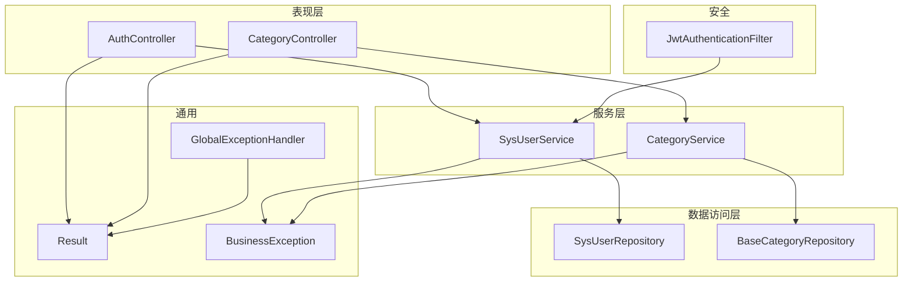
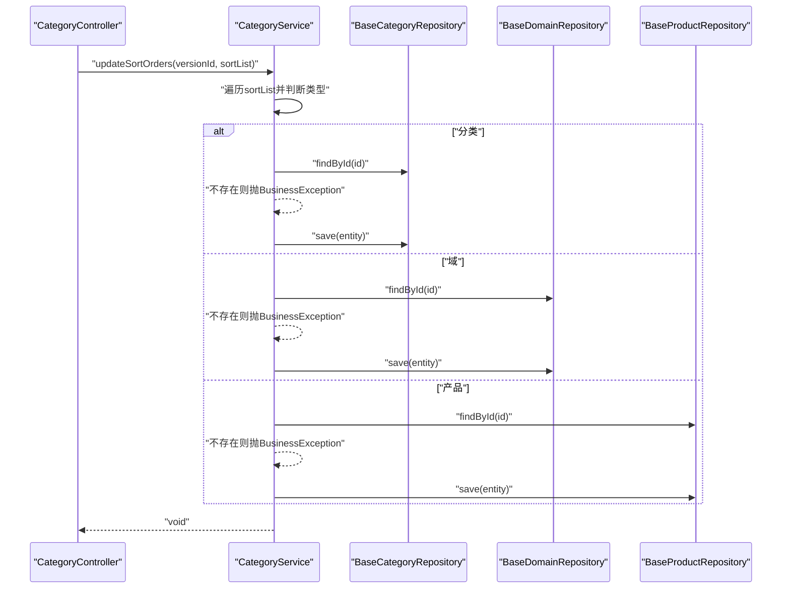
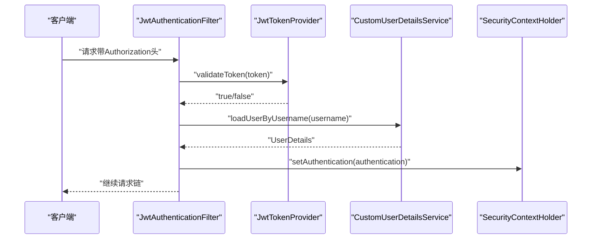
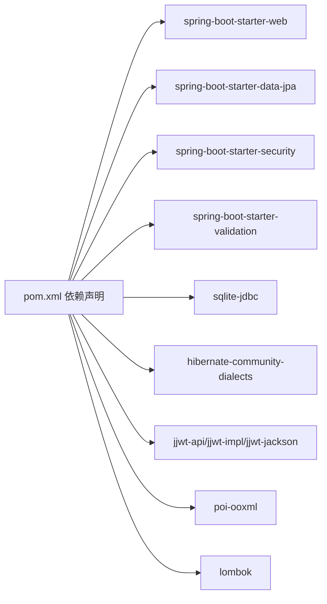

# 后端Java代码规范

<cite>
**本文引用的文件**
- [SuperPowerApplication.java](file://src/main/java/com/superpower/SuperPowerApplication.java)
- [Result.java](file://src/main/java/com/superpower/common/Result.java)
- [BusinessException.java](file://src/main/java/com/superpower/common/BusinessException.java)
- [GlobalExceptionHandler.java](file://src/main/java/com/superpower/common/GlobalExceptionHandler.java)
- [ResultCode.java](file://src/main/java/com/superpower/common/ResultCode.java)
- [CategoryController.java](file://src/main/java/com/superpower/modules/category/controller/CategoryController.java)
- [CategoryService.java](file://src/main/java/com/superpower/modules/category/service/CategoryService.java)
- [BaseCategory.java](file://src/main/java/com/superpower/modules/category/entity/BaseCategory.java)
- [BaseCategoryRepository.java](file://src/main/java/com/superpower/modules/category/repository/BaseCategoryRepository.java)
- [AuthController.java](file://src/main/java/com/superpower/modules/system/controller/AuthController.java)
- [SysUserService.java](file://src/main/java/com/superpower/modules/system/service/SysUserService.java)
- [JwtAuthenticationFilter.java](file://src/main/java/com/superpower/security/JwtAuthenticationFilter.java)
- [WebMvcConfig.java](file://src/main/java/com/superpower/config/WebMvcConfig.java)
- [application.yml](file://src/main/resources/application.yml)
- [pom.xml](file://src/main/java/com/superpower/SuperPowerApplication.java)
- [DataEntryServiceTest.java](file://src/test/java/com/superpower/modules/data/service/DataEntryServiceTest.java)
- [DataEntryDTO.java](file://src/main/java/com/superpower/modules/data/dto/DataEntryDTO.java)
</cite>

## 目录
1. 引言
2. 项目结构
3. 核心组件
4. 架构总览
5. 详细组件分析
6. 依赖分析
7. 性能考虑
8. 故障排查指南
9. 结论
10. 附录

## 引言
本规范面向产品清单管理系统的后端Java代码，覆盖Java语言基础规范、Spring Boot项目特定规范、分层架构与依赖注入最佳实践、REST控制器设计、服务层业务逻辑实现、数据访问层操作规范、注释与异常处理模式、以及代码审查与质量保障要点。目标是统一团队开发风格，提升可读性、可维护性与可测试性。

## 项目结构
项目采用基于功能域的多模块分层组织：common（通用工具与异常）、config（配置）、modules（业务域：category、system、data、document、image、option、requirement、version、customtab、approval等）、security（安全相关）、resources（配置与初始化脚本）。核心启动类位于根包下，各模块按controller/service/repository/entity/dto结构组织。

图表来源
- [SuperPowerApplication.java:17-42](file://src/main/java/com/superpower/SuperPowerApplication.java#L17-L42)
- [CategoryController.java:13-21](file://src/main/java/com/superpower/modules/category/controller/CategoryController.java#L13-L21)
- [CategoryService.java:18-34](file://src/main/java/com/superpower/modules/category/service/CategoryService.java#L18-L34)
- [BaseCategoryRepository.java:12-20](file://src/main/java/com/superpower/modules/category/repository/BaseCategoryRepository.java#L12-L20)
- [BaseCategory.java:7-29](file://src/main/java/com/superpower/modules/category/entity/BaseCategory.java#L7-L29)
- [GlobalExceptionHandler.java:14-48](file://src/main/java/com/superpower/common/GlobalExceptionHandler.java#L14-L48)
- [JwtAuthenticationFilter.java:17-30](file://src/main/java/com/superpower/security/JwtAuthenticationFilter.java#L17-L30)
- [WebMvcConfig.java:8-22](file://src/main/java/com/superpower/config/WebMvcConfig.java#L8-L22)
- [application.yml:1-40](file://src/main/resources/application.yml#L1-L40)

章节来源
- [SuperPowerApplication.java:17-42](file://src/main/java/com/superpower/SuperPowerApplication.java#L17-L42)
- [application.yml:1-40](file://src/main/resources/application.yml#L1-L40)

## 核心组件
- 统一响应包装器：Result<T> 提供成功/失败/未授权/禁止等静态工厂方法，确保所有接口返回一致的数据契约。
- 业务异常：BusinessException 支持自定义状态码与消息，便于前端统一处理。
- 全局异常处理器：GlobalExceptionHandler 将业务异常、验证异常、鉴权异常映射为标准响应。
- 结果码枚举：ResultCode 定义全局状态码与消息，避免魔法数。
- 应用启动与初始化：SuperPowerApplication 负责时区设置、命令行初始化数据与依赖注入装配。

章节来源
- [Result.java:17-40](file://src/main/java/com/superpower/common/Result.java#L17-L40)
- [BusinessException.java:9-23](file://src/main/java/com/superpower/common/BusinessException.java#L9-L23)
- [GlobalExceptionHandler.java:17-47](file://src/main/java/com/superpower/common/GlobalExceptionHandler.java#L17-L47)
- [ResultCode.java:8-19](file://src/main/java/com/superpower/common/ResultCode.java#L8-L19)
- [SuperPowerApplication.java:35-80](file://src/main/java/com/superpower/SuperPowerApplication.java#L35-L80)

## 架构总览
系统遵循经典的三层架构：表现层（Controller）、领域服务层（Service）、数据访问层（Repository）。通过Spring Security与JWT实现认证与授权；通过统一异常处理与响应封装，保证接口一致性与可观测性。

图表来源
- [AuthController.java:22-42](file://src/main/java/com/superpower/modules/system/controller/AuthController.java#L22-L42)
- [CategoryController.java:13-21](file://src/main/java/com/superpower/modules/category/controller/CategoryController.java#L13-L21)
- [SysUserService.java:15-31](file://src/main/java/com/superpower/modules/system/service/SysUserService.java#L15-L31)
- [CategoryService.java:18-34](file://src/main/java/com/superpower/modules/category/service/CategoryService.java#L18-L34)
- [BaseCategoryRepository.java:12-20](file://src/main/java/com/superpower/modules/category/repository/BaseCategoryRepository.java#L12-L20)
- [JwtAuthenticationFilter.java:17-30](file://src/main/java/com/superpower/security/JwtAuthenticationFilter.java#L17-L30)
- [Result.java:17-40](file://src/main/java/com/superpower/common/Result.java#L17-L40)
- [BusinessException.java:9-23](file://src/main/java/com/superpower/common/BusinessException.java#L9-L23)
- [GlobalExceptionHandler.java:17-47](file://src/main/java/com/superpower/common/GlobalExceptionHandler.java#L17-L47)

## 详细组件分析

### Java语言基础规范
- 命名约定
  - 类名：帕斯卡命名，如 Result、BusinessException、CategoryController。
  - 方法名：驼峰命名，如 success、updateSortOrders、findByUsername。
  - 变量名：驼峰命名，如 versionId、sortOrder、jwtTokenProvider。
  - 常量：全大写+下划线，如 SECRET_KEY（若存在）。
- 代码格式化
  - 使用Lombok注解减少样板代码，保持简洁与可读性。
  - 避免过长单行，合理换行与缩进。
- 注释标准
  - 公共API与复杂逻辑添加Javadoc或简要注释，说明入参、出参与异常。
  - 内联注释解释关键分支与边界条件。
- 异常处理模式
  - 业务异常使用 BusinessException，携带明确状态码与消息。
  - 全局异常处理器统一捕获并返回标准响应。

章节来源
- [Result.java:5-15](file://src/main/java/com/superpower/common/Result.java#L5-L15)
- [BusinessException.java:5-23](file://src/main/java/com/superpower/common/BusinessException.java#L5-L23)
- [GlobalExceptionHandler.java:14-48](file://src/main/java/com/superpower/common/GlobalExceptionHandler.java#L14-L48)

### Spring Boot项目特定规范
- 包结构组织原则
  - 根包 com.superpower 下按模块划分，如 modules/category、modules/system 等。
  - common、config、security 独立于业务模块之上，提供横切能力。
- 分层架构
  - Controller：接收请求、参数校验、调用Service、返回Result。
  - Service：编排业务流程、事务控制、异常转换。
  - Repository：数据访问、查询方法命名清晰。
  - Entity：JPA实体，字段与表映射明确。
- 依赖注入使用规范
  - 优先使用构造器注入，保证不可变与可测试性。
  - 在Controller与Service中注入Repository与外部服务。
- 配置类编写标准
  - WebMvcConfig：注册静态资源映射与路径前缀。
  - application.yml：集中管理服务器、数据库、JPA、日志、JWT与应用参数。

章节来源
- [WebMvcConfig.java:8-22](file://src/main/java/com/superpower/config/WebMvcConfig.java#L8-L22)
- [application.yml:1-40](file://src/main/resources/application.yml#L1-L40)
- [CategoryController.java:19-21](file://src/main/java/com/superpower/modules/category/controller/CategoryController.java#L19-L21)
- [SysUserService.java:23-31](file://src/main/java/com/superpower/modules/system/service/SysUserService.java#L23-L31)

### REST控制器设计
- 设计原则
  - 统一前缀：/api 或 /api/{module}。
  - 方法语义化：GET/POST/PUT/DELETE 对应查询/创建/更新/删除。
  - 参数传递：路径参数使用 @PathVariable，查询参数 @RequestParam，请求体 @RequestBody。
  - 返回值：统一使用 Result<T>，成功无数据时返回 Result.success()。
- 示例参考
  - 查询树形结构：CategoryController.getTree
  - 批量排序更新：CategoryController.updateSort
  - 创建/更新/删除分类与域：CategoryController.createCategory/updateCategory/deleteCategory 等
  - 登录/注册/改密/改昵称：AuthController.login/register/changePassword/changeNickname

章节来源
- [CategoryController.java:23-64](file://src/main/java/com/superpower/modules/category/controller/CategoryController.java#L23-L64)
- [AuthController.java:44-96](file://src/main/java/com/superpower/modules/system/controller/AuthController.java#L44-L96)

### 服务层业务逻辑实现
- 事务边界
  - 使用 @Transactional 标注涉及多表写入或一致性要求的方法。
- 业务编排
  - 通过Repository组合查询与保存，必要时联动其他模块数据（如同步DataEntry）。
- 异常转换
  - 对不存在的实体抛出 BusinessException，由全局异常处理器统一返回。

图表来源
- [CategoryController.java:28-32](file://src/main/java/com/superpower/modules/category/controller/CategoryController.java#L28-L32)
- [CategoryService.java:80-103](file://src/main/java/com/superpower/modules/category/service/CategoryService.java#L80-L103)
- [BaseCategoryRepository.java:12-20](file://src/main/java/com/superpower/modules/category/repository/BaseCategoryRepository.java#L12-L20)

章节来源
- [CategoryService.java:80-103](file://src/main/java/com/superpower/modules/category/service/CategoryService.java#L80-L103)

### 数据访问层操作规范
- 查询方法命名
  - findByXxx、countByXxx、existsByXxx，遵循Spring Data JPA约定。
- 原生/JPQL查询
  - 使用 @Query 与 @Param 明确参数绑定，避免硬编码SQL。
- 删除策略
  - 提供按版本批量删除方法，避免遗漏。

章节来源
- [BaseCategoryRepository.java:13-19](file://src/main/java/com/superpower/modules/category/repository/BaseCategoryRepository.java#L13-L19)
- [BaseCategory.java:10-29](file://src/main/java/com/superpower/modules/category/entity/BaseCategory.java#L10-L29)

### 安全与认证
- JWT过滤链
  - JwtAuthenticationFilter 从Header或查询参数提取token，解析用户信息并写入SecurityContext。
- 控制器鉴权
  - 使用 @PreAuthorize/@PostAuthorize 或基于方法的安全注解（如需），当前示例通过拦截器完成认证。
- 用户服务
  - SysUserService 提供用户查询、创建、改密、改昵称等能力，并与在线追踪集成。

图表来源
- [JwtAuthenticationFilter.java:32-48](file://src/main/java/com/superpower/security/JwtAuthenticationFilter.java#L32-L48)
- [AuthController.java:44-60](file://src/main/java/com/superpower/modules/system/controller/AuthController.java#L44-L60)

章节来源
- [JwtAuthenticationFilter.java:17-62](file://src/main/java/com/superpower/security/JwtAuthenticationFilter.java#L17-L62)
- [SysUserService.java:33-98](file://src/main/java/com/superpower/modules/system/service/SysUserService.java#L33-L98)

### DTO与实体模型
- DTO职责
  - DataEntryDTO 作为跨层传输对象，承载大量列字段，用于查询、导入、导出等场景。
- 实体模型
  - BaseCategory 等实体包含主键、版本号、排序、时间戳等通用字段，遵循JPA注解规范。

章节来源
- [DataEntryDTO.java:6-64](file://src/main/java/com/superpower/modules/data/dto/DataEntryDTO.java#L6-L64)
- [BaseCategory.java:7-29](file://src/main/java/com/superpower/modules/category/entity/BaseCategory.java#L7-L29)

### 测试与质量保障
- 单元测试
  - 使用 Mockito 模拟Repository与Version状态，断言业务规则（如发版版本禁止修改）。
- 测试要点
  - 验证异常路径（BusinessException）是否被正确抛出与捕获。
  - 验证仓库方法是否被正确调用（参数透传、保存/删除行为）。

章节来源
- [DataEntryServiceTest.java:61-95](file://src/test/java/com/superpower/modules/data/service/DataEntryServiceTest.java#L61-L95)
- [DataEntryServiceTest.java:118-126](file://src/test/java/com/superpower/modules/data/service/DataEntryServiceTest.java#L118-L126)

## 依赖分析
- 外部依赖
  - Spring Boot Starter Web、Data JPA、Security、Validation、SQLite JDBC、Hibernate方言、JWT（jjwt）、Apache POI、Lombok。
- 构建与注解处理
  - Maven插件配置启用Lombok注解处理器，排除lombok在运行时依赖。

图表来源
- [pom.xml:21-84](file://src/main/java/com/superpower/SuperPowerApplication.java#L21-L84)

章节来源
- [pom.xml:16-116](file://src/main/java/com/superpower/SuperPowerApplication.java#L16-L116)

## 性能考虑
- 连接池与超时
  - Hikari连接池最大连接数、连接超时、泄漏检测阈值需结合并发与数据库性能调优。
- SQL优化
  - Repository方法命名与索引匹配，避免N+1查询；批量操作使用批处理或原生SQL。
- 缓存与异步
  - 对热点查询引入缓存；对耗时任务使用异步执行（AsyncConfig）。
- 日志与监控
  - 合理的日志级别与采样，避免生产环境过多DEBUG日志。

## 故障排查指南
- 统一响应与异常
  - 通过 GlobalExceptionHandler 将业务异常映射为标准Result，便于前端统一处理。
- 常见问题定位
  - 参数校验失败：MethodArgumentNotValidException → 返回VALIDATE_FAILED。
  - 权限不足：AccessDeniedException → 返回FORBIDDEN。
  - 认证失败：AuthenticationException → 返回UNAUTHORIZED。
  - 业务异常：BusinessException → 返回FAILED并携带自定义状态码与消息。
- 排查步骤
  - 查看日志级别与输出位置。
  - 校验请求头Authorization与JWT签名、过期时间。
  - 检查数据库DDL与索引，确认查询性能。

章节来源
- [GlobalExceptionHandler.java:17-47](file://src/main/java/com/superpower/common/GlobalExceptionHandler.java#L17-L47)
- [application.yml:6-34](file://src/main/resources/application.yml#L6-L34)

## 结论
本规范以统一响应、异常处理、分层架构与依赖注入为核心，结合Spring Boot特性与项目实际，形成可落地的编码标准。建议在团队内推广并纳入CI检查，持续提升代码质量与交付效率。

## 附录
- 代码审查要点
  - 是否使用构造器注入与不可变对象。
  - 是否统一使用Result<T>与ResultCode。
  - 是否对业务异常进行显式抛出与测试覆盖。
  - 是否遵循DTO/Entity分离与清晰的Repository方法命名。
  - 是否对敏感配置（JWT密钥、数据库连接）进行安全管控。
- 最佳实践清单
  - 优先使用Spring Data JPA方法命名而非复杂JPQL。
  - 对外接口参数尽量使用DTO，避免直接暴露实体。
  - 事务边界清晰，避免长事务与锁竞争。
  - 静态资源路径与存储目录分离，便于运维与迁移。