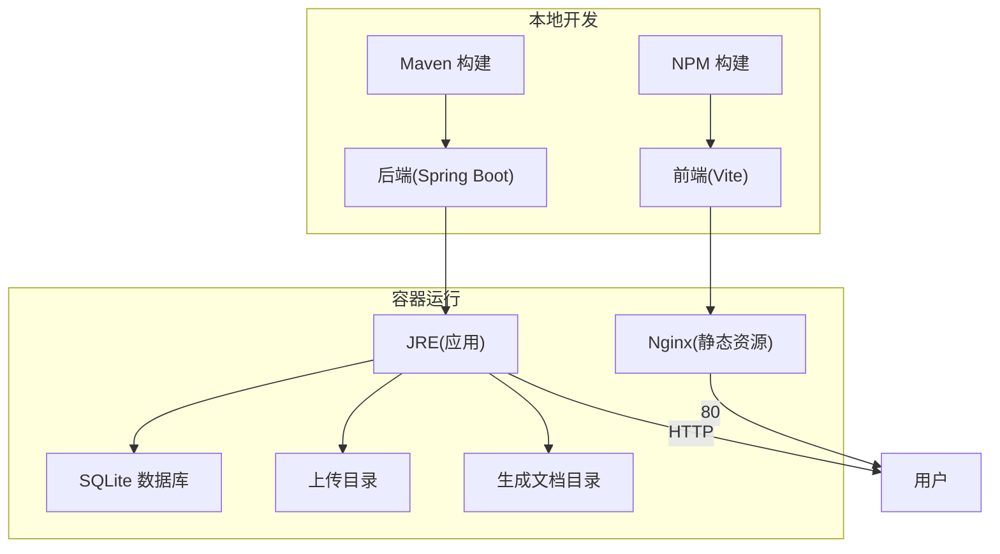
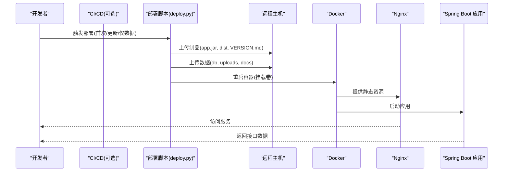
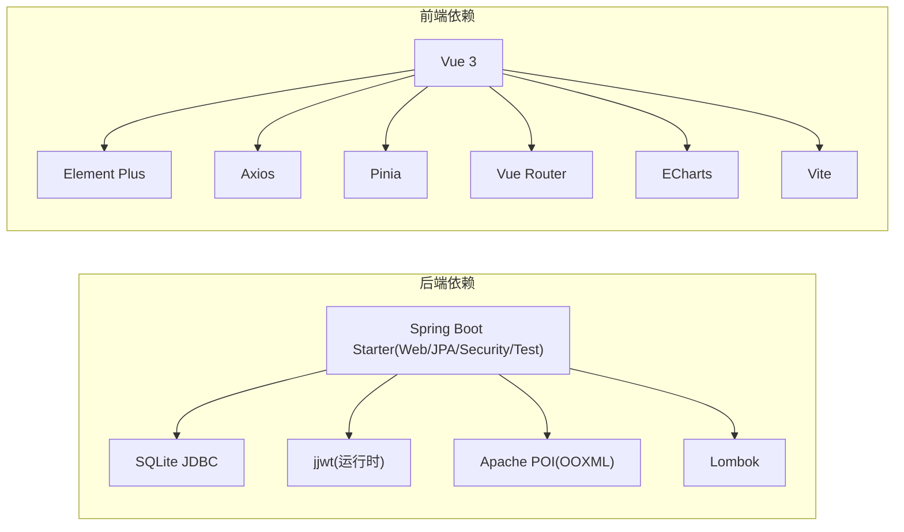

# 开发流程与质量保证

<cite>
**本文引用的文件**
- [.gitignore](file://.gitignore)
- [pom.xml](file://pom.xml)
- [frontend/package.json](file://frontend/package.json)
- [Dockerfile](file://Dockerfile)
- [docker/entrypoint.sh](file://docker/entrypoint.sh)
- [deploy.py](file://deploy.py)
- [src/test/java/com/superpower/modules/customtab/service/CustomTabServiceTest.java](file://src/test/java/com/superpower/modules/customtab/service/CustomTabServiceTest.java)
- [src/test/java/com/superpower/modules/data/service/DataEntryServiceTest.java](file://src/test/java/com/superpower/modules/data/service/DataEntryServiceTest.java)
- [src/test/java/com/superpower/modules/document/service/DocumentServiceTest.java](file://src/test/java/com/superpower/modules/document/service/DocumentServiceTest.java)
</cite>

## 目录
1. [引言](#引言)
2. [项目结构](#项目结构)
3. [核心组件](#核心组件)
4. [架构总览](#架构总览)
5. [详细组件分析](#详细组件分析)
6. [依赖分析](#依赖分析)
7. [性能考虑](#性能考虑)
8. [故障排查指南](#故障排查指南)
9. [结论](#结论)
10. [附录](#附录)

## 引言
本文件面向产品清单管理系统，制定从开发到上线的完整流程与质量保证规范，覆盖Git工作流、代码审查、测试策略、持续集成、性能与安全、文档与度量等维度，帮助团队提升交付效率与质量。

## 项目结构
该仓库采用前后端分离架构：
- 后端基于Spring Boot（Java 17），使用Maven管理依赖与构建。
- 前端基于Vue 3 + Vite，使用Element Plus与Axios等生态。
- 运行时通过Docker容器化，Nginx反向代理静态资源，JRE运行Spring Boot应用。
- 部署采用Python脚本，支持首次初始化与日常更新，数据与制品通过卷挂载注入。

图表来源
- [Dockerfile:1-38](file://Dockerfile#L1-L38)
- [docker/entrypoint.sh:1-22](file://docker/entrypoint.sh#L1-L22)
- [frontend/package.json:1-28](file://frontend/package.json#L1-L28)
- [pom.xml:1-116](file://pom.xml#L1-L116)

章节来源
- [Dockerfile:1-38](file://Dockerfile#L1-L38)
- [docker/entrypoint.sh:1-22](file://docker/entrypoint.sh#L1-L22)
- [frontend/package.json:1-28](file://frontend/package.json#L1-L28)
- [pom.xml:1-116](file://pom.xml#L1-L116)

## 核心组件
- 后端模块与职责边界清晰，按领域划分（如category、data、document、requirement、system、version等），便于测试与演进。
- 前端采用组件化与路由分层，API调用集中在独立模块，利于维护与扩展。
- 测试覆盖了关键业务场景，包括业务异常、参数校验、文档生成等。

章节来源
- [src/test/java/com/superpower/modules/customtab/service/CustomTabServiceTest.java:1-79](file://src/test/java/com/superpower/modules/customtab/service/CustomTabServiceTest.java#L1-L79)
- [src/test/java/com/superpower/modules/data/service/DataEntryServiceTest.java:1-135](file://src/test/java/com/superpower/modules/data/service/DataEntryServiceTest.java#L1-L135)
- [src/test/java/com/superpower/modules/document/service/DocumentServiceTest.java:1-74](file://src/test/java/com/superpower/modules/document/service/DocumentServiceTest.java#L1-L74)

## 架构总览
系统采用“容器即运行时”的部署模型：镜像仅包含运行时环境，业务代码与数据通过卷挂载注入，实现零停机热更新与快速回滚。

图表来源
- [deploy.py:1-594](file://deploy.py#L1-L594)
- [Dockerfile:1-38](file://Dockerfile#L1-L38)
- [docker/entrypoint.sh:1-22](file://docker/entrypoint.sh#L1-L22)

## 详细组件分析

### Git工作流程与分支管理
- 分支策略
  - main/master：受保护分支，仅允许通过合并请求合并。
  - develop：集成分支，每日同步main，承载集成测试与预发布验证。
  - feature/<issue>-描述：功能开发分支，命名与问题跟踪系统关联。
  - hotfix/<issue>-描述：紧急修复分支，从main切出，修复后回并至main与develop。
  - release/<版本>：预发布分支，冻结变更，进行回归测试与最终校验。
- 提交消息规范
  - 类型: 功能/修复/文档/重构/样式/性能/安全/构建/其他
  - 范围: 模块/包/文件路径
  - 描述: 简洁明确，不超过50字符；正文说明动机与影响；引用Issue编号
  - 示例: feat(category): 新增产品分类树查询接口 #123
- 合并请求流程
  - 必须关联Issue，填写摘要与变更说明
  - 代码审查至少1人通过，无阻塞问题
  - 通过自动化检查（构建、测试、安全扫描）
  - 合并前执行rebase或squash，保持历史整洁
  - 合并后清理分支

章节来源
- [.gitignore:1-44](file://.gitignore#L1-L44)

### 代码审查规范
- PR模板
  - 摘要：简述变更内容与目标
  - 问题链接：关联Issue
  - 变更点：逐条列出改动范围
  - 测试策略：单元/集成/手工验证
  - 影响面：兼容性、性能、安全
  - 风险与回退：风险评估与回退预案
- 审查清单
  - 代码风格与一致性
  - 边界条件与异常处理
  - 性能与资源占用
  - 安全与权限控制
  - 文档与注释
  - 测试覆盖与可维护性
- 反馈处理流程
  - 修改后重新触发CI
  - 逐条回复审查意见，必要时发起讨论
  - 二审通过后方可合并

### 测试策略规范
- 单元测试
  - 覆盖率目标：核心模块达到70%以上
  - 场景覆盖：正常路径、边界值、异常路径、业务规则校验
  - Mock策略：对外部依赖（数据库、HTTP）使用Mock
  - 断言策略：行为断言优先，状态断言为辅
- 集成测试
  - 接口契约测试：对关键API进行端到端验证
  - 数据一致性：版本发布、排序更新、批量操作
  - 资源访问：上传/下载、文档生成、静态资源
- 测试覆盖率目标
  - 行为覆盖率：核心业务逻辑≥70%
  - 分支覆盖率：关键路径≥80%
  - 重点模块：数据、文档、版本、分类、用户与权限

章节来源
- [src/test/java/com/superpower/modules/customtab/service/CustomTabServiceTest.java:1-79](file://src/test/java/com/superpower/modules/customtab/service/CustomTabServiceTest.java#L1-L79)
- [src/test/java/com/superpower/modules/data/service/DataEntryServiceTest.java:1-135](file://src/test/java/com/superpower/modules/data/service/DataEntryServiceTest.java#L1-L135)
- [src/test/java/com/superpower/modules/document/service/DocumentServiceTest.java:1-74](file://src/test/java/com/superpower/modules/document/service/DocumentServiceTest.java#L1-L74)

### 持续集成规范
- 自动化测试流程
  - 触发条件：push到feature/*、hotfix/*、PR到develop或main
  - 步骤：安装依赖、编译、静态检查、单元测试、覆盖率统计
  - 失败策略：立即停止后续步骤，保留日志
- 代码质量检查
  - Java：依赖检查、重复代码、复杂度阈值
  - 前端：ESLint、格式化、类型检查
  - 安全扫描：依赖漏洞扫描（OWASP、Snyk等）
- 部署流水线配置
  - 本地构建：后端Maven打包、前端Vite构建
  - 远程部署：Python脚本上传制品与数据，重启容器
  - 回滚：保留上一个版本制品，一键回滚

章节来源
- [pom.xml:1-116](file://pom.xml#L1-L116)
- [frontend/package.json:1-28](file://frontend/package.json#L1-L28)
- [deploy.py:1-594](file://deploy.py#L1-L594)

### 性能测试规范
- 接口性能
  - 基准：单接口P95延迟≤200ms，吞吐≥100 RPS
  - 压力：并发用户数逐步提升，观察CPU、内存、连接池
- 前端性能
  - 首屏时间≤2s，交互流畅，避免大体积组件按需加载
- 数据库性能
  - 关键查询添加索引，避免N+1，合理分页
- 资源与缓存
  - 静态资源开启压缩与缓存，CDN加速（可选）

### 安全扫描要求
- 依赖安全
  - 定期扫描第三方依赖漏洞，修复高危与严重级别
- 代码安全
  - 敏感信息脱敏，避免硬编码
  - 参数校验与输入净化，防止注入与XSS
- 运行时安全
  - 最小权限原则，禁用不必要的系统调用
  - HTTPS与安全头配置（可选）

### 文档更新要求
- 变更文档
  - API变更：同步更新接口文档与示例
  - 配置变更：更新部署与运维文档
- 设计文档
  - 重大架构调整需更新设计文档与评审记录
- 用户文档
  - 新功能上线同步更新用户手册与FAQ

## 依赖分析
后端与前端的关键依赖与构建配置如下：

图表来源
- [pom.xml:21-84](file://pom.xml#L21-L84)
- [frontend/package.json:11-26](file://frontend/package.json#L11-L26)

章节来源
- [pom.xml:1-116](file://pom.xml#L1-L116)
- [frontend/package.json:1-28](file://frontend/package.json#L1-L28)

## 性能考虑
- 构建优化
  - 后端：并行编译、跳过测试打包用于部署（需在CI中区分）
  - 前端：生产构建开启压缩与Tree-shaking
- 运行时优化
  - JVM参数调优（堆大小、GC策略）
  - Nginx静态资源缓存与Gzip压缩
- 数据库优化
  - 合理索引、SQL优化、连接池配置
- 监控与告警
  - 接口耗时、错误率、资源使用率监控

## 故障排查指南
- 部署失败
  - 检查制品是否存在与可执行权限
  - 确认远程目录与卷挂载路径正确
  - 查看容器健康检查与日志
- 服务不可用
  - 核查Nginx配置与静态资源路径
  - 检查应用端口占用与JVM进程
- 数据异常
  - 校验数据库文件完整性与备份
  - 检查上传目录与生成文档目录权限

章节来源
- [deploy.py:1-594](file://deploy.py#L1-L594)
- [docker/entrypoint.sh:1-22](file://docker/entrypoint.sh#L1-L22)
- [Dockerfile:1-38](file://Dockerfile#L1-L38)

## 结论
通过规范化的Git工作流、严格的代码审查、完善的测试策略与持续集成、性能与安全基线，以及清晰的文档与度量体系，团队可以稳定高效地交付高质量的产品清单管理系统。

## 附录
- 工具配置示例
  - Maven编译与打包：参见后端构建插件配置
  - 前端构建：参见Vite与依赖配置
  - 容器运行：参见Dockerfile与入口脚本
  - 部署脚本：参见部署流程与参数
- 质量度量指标
  - 代码覆盖率：核心逻辑≥70%，关键路径≥80%
  - 构建成功率：≥95%
  - 部署成功率：≥98%
  - 接口P95延迟：≤200ms
  - 依赖漏洞：高危与严重级别清零

章节来源
- [pom.xml:86-114](file://pom.xml#L86-L114)
- [frontend/package.json:6-10](file://frontend/package.json#L6-L10)
- [Dockerfile:1-38](file://Dockerfile#L1-L38)
- [docker/entrypoint.sh:1-22](file://docker/entrypoint.sh#L1-L22)
- [deploy.py:1-594](file://deploy.py#L1-L594)