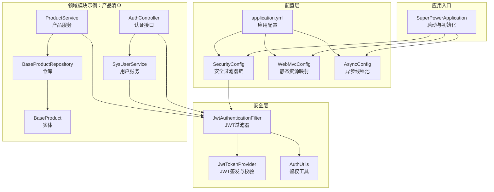
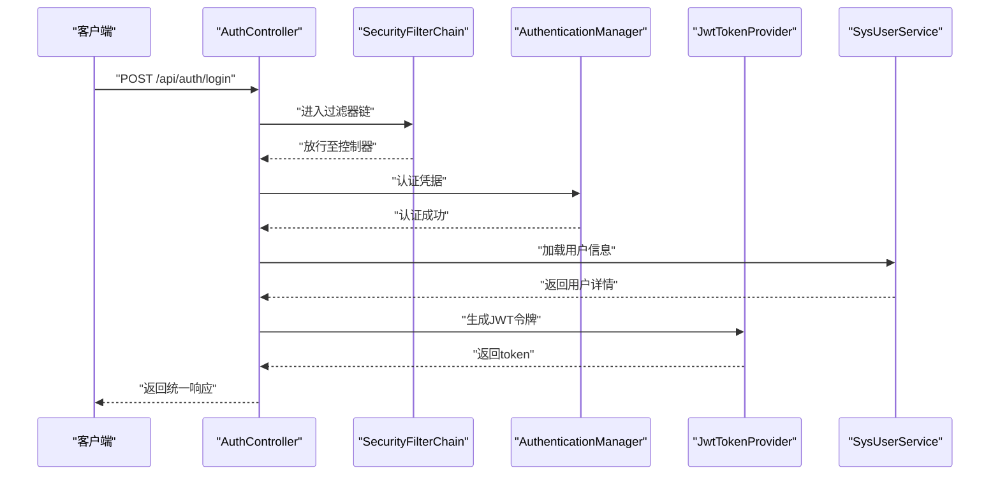
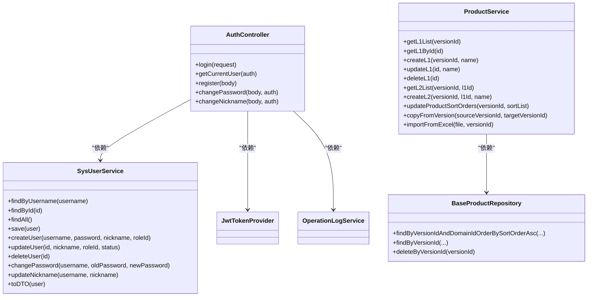
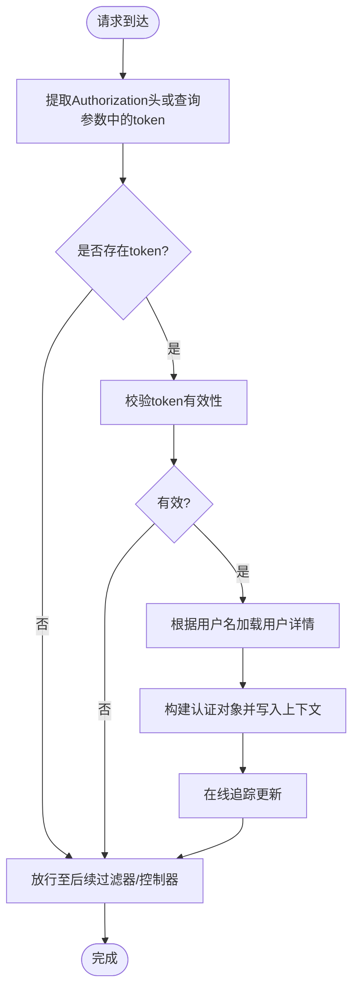
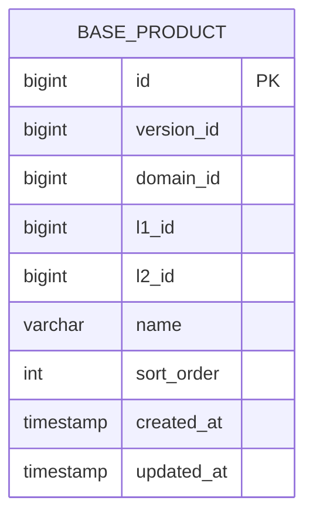
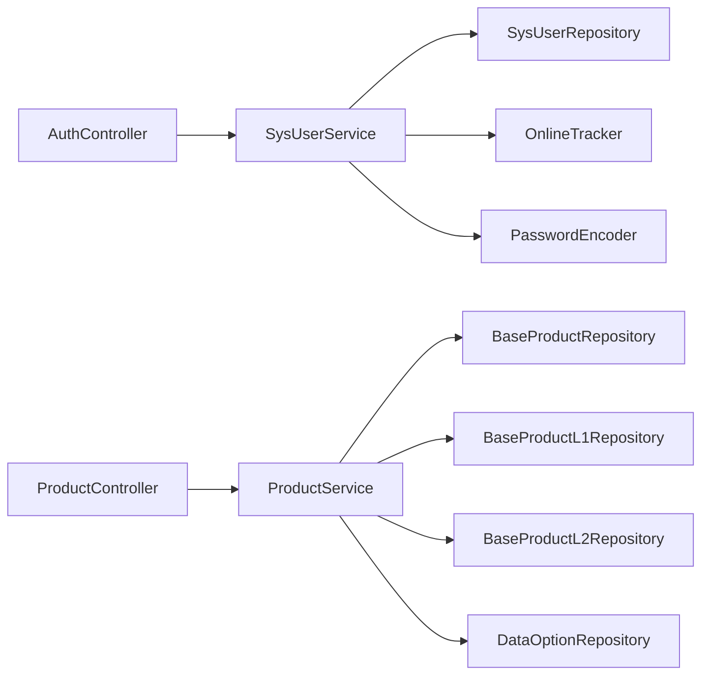

# 架构设计规范

<cite>
**本文引用的文件**
- [SuperPowerApplication.java](file://src/main/java/com/superpower/SuperPowerApplication.java)
- [application.yml](file://src/main/resources/application.yml)
- [SecurityConfig.java](file://src/main/java/com/superpower/config/SecurityConfig.java)
- [WebMvcConfig.java](file://src/main/java/com/superpower/config/WebMvcConfig.java)
- [AsyncConfig.java](file://src/main/java/com/superpower/config/AsyncConfig.java)
- [JwtAuthenticationFilter.java](file://src/main/java/com/superpower/security/JwtAuthenticationFilter.java)
- [JwtTokenProvider.java](file://src/main/java/com/superpower/security/JwtTokenProvider.java)
- [AuthUtils.java](file://src/main/java/com/superpower/common/AuthUtils.java)
- [ProductService.java](file://src/main/java/com/superpower/modules/category/service/ProductService.java)
- [SysUserService.java](file://src/main/java/com/superpower/modules/system/service/SysUserService.java)
- [AuthController.java](file://src/main/java/com/superpower/modules/system/controller/AuthController.java)
- [BaseProduct.java](file://src/main/java/com/superpower/modules/category/entity/BaseProduct.java)
- [BaseProductRepository.java](file://src/main/java/com/superpower/modules/category/repository/BaseProductRepository.java)
- [Result.java](file://src/main/java/com/superpower/common/Result.java)
- [BusinessException.java](file://src/main/java/com/superpower/common/BusinessException.java)
</cite>

## 目录
1. [引言](#引言)
2. [项目结构](#项目结构)
3. [核心组件](#核心组件)
4. [架构总览](#架构总览)
5. [详细组件分析](#详细组件分析)
6. [依赖分析](#依赖分析)
7. [性能考虑](#性能考虑)
8. [故障排查指南](#故障排查指南)
9. [结论](#结论)
10. [附录](#附录)

## 引言
本规范面向产品清单管理系统，旨在建立统一、可演进的分层架构与模块化设计标准，明确Controller层、Service层、Repository层的职责边界与交互规范；规范Spring Boot应用配置、安全架构、数据库与缓存策略、异步处理策略；并提供架构决策记录与演进策略，确保团队在开发过程中保持一致性和可维护性。

## 项目结构
系统采用基于功能域的模块化组织方式，按领域拆分模块（如category、system、requirement等），每个模块内遵循“controller-service-entity-repository”分层结构，配合通用的common、config、security包支撑横切关注点。

图表来源
- [SuperPowerApplication.java:1-82](file://src/main/java/com/superpower/SuperPowerApplication.java#L1-L82)
- [SecurityConfig.java:1-57](file://src/main/java/com/superpower/config/SecurityConfig.java#L1-L57)
- [WebMvcConfig.java:1-23](file://src/main/java/com/superpower/config/WebMvcConfig.java#L1-L23)
- [AsyncConfig.java:1-23](file://src/main/java/com/superpower/config/AsyncConfig.java#L1-L23)
- [application.yml:1-40](file://src/main/resources/application.yml#L1-L40)
- [JwtAuthenticationFilter.java:1-62](file://src/main/java/com/superpower/security/JwtAuthenticationFilter.java#L1-L62)
- [JwtTokenProvider.java:1-66](file://src/main/java/com/superpower/security/JwtTokenProvider.java#L1-L66)
- [AuthUtils.java:1-29](file://src/main/java/com/superpower/common/AuthUtils.java#L1-L29)
- [AuthController.java:1-98](file://src/main/java/com/superpower/modules/system/controller/AuthController.java#L1-L98)
- [SysUserService.java:1-114](file://src/main/java/com/superpower/modules/system/service/SysUserService.java#L1-L114)
- [ProductService.java:1-356](file://src/main/java/com/superpower/modules/category/service/ProductService.java#L1-L356)
- [BaseProduct.java:1-39](file://src/main/java/com/superpower/modules/category/entity/BaseProduct.java#L1-L39)
- [BaseProductRepository.java:1-22](file://src/main/java/com/superpower/modules/category/repository/BaseProductRepository.java#L1-L22)

章节来源
- [SuperPowerApplication.java:1-82](file://src/main/java/com/superpower/SuperPowerApplication.java#L1-L82)
- [application.yml:1-40](file://src/main/resources/application.yml#L1-L40)

## 核心组件
- 应用入口与初始化：负责应用启动、时区设置、基础数据初始化与依赖注入。
- 配置层：集中管理安全过滤器链、静态资源映射、异步任务执行器。
- 安全层：提供JWT签发与校验、请求拦截与鉴权、在线状态跟踪。
- 领域服务：以产品清单为例，封装业务逻辑、事务控制、导入导出、排序与复制等。
- 数据访问层：基于JPA Repository抽象数据库访问，提供查询与批量删除能力。
- 响应与异常：统一响应体与业务异常封装，便于前端与监控系统消费。

章节来源
- [SuperPowerApplication.java:1-82](file://src/main/java/com/superpower/SuperPowerApplication.java#L1-L82)
- [Result.java:1-41](file://src/main/java/com/superpower/common/Result.java#L1-L41)
- [BusinessException.java:1-24](file://src/main/java/com/superpower/common/BusinessException.java#L1-L24)

## 架构总览
系统采用经典的三层架构与领域驱动设计结合：
- 表现层（Controller）：接收HTTP请求，参数校验，调用服务层，返回统一响应。
- 领域服务层（Service）：编排业务流程，处理事务，协调多个仓库或跨模块调用。
- 数据访问层（Repository/JPA）：封装持久化细节，提供类型安全的查询方法。
- 配置与安全：通过Spring配置类与安全过滤器链实现非侵入式扩展。

图表来源
- [AuthController.java:1-98](file://src/main/java/com/superpower/modules/system/controller/AuthController.java#L1-L98)
- [SecurityConfig.java:1-57](file://src/main/java/com/superpower/config/SecurityConfig.java#L1-L57)
- [JwtTokenProvider.java:1-66](file://src/main/java/com/superpower/security/JwtTokenProvider.java#L1-L66)
- [SysUserService.java:1-114](file://src/main/java/com/superpower/modules/system/service/SysUserService.java#L1-L114)

## 详细组件分析

### 分层架构设计原则
- Controller层
  - 职责：接收请求、参数校验、调用服务、组装统一响应。
  - 规范：仅做薄层编排，不直接操作数据库；使用Result封装返回值；对敏感接口进行权限控制。
- Service层
  - 职责：承载业务规则、事务边界、跨仓库协调、幂等与一致性保障。
  - 规范：长事务与复杂流程需显式声明；避免在Service中直接处理HTTP细节；对外暴露清晰的领域方法。
- Repository层
  - 职责：封装数据访问，提供类型安全的查询与更新。
  - 规范：尽量使用Spring Data JPA方法命名约定；复杂SQL使用原生查询并限定返回类型；避免在Repository中引入业务逻辑。

图表来源
- [AuthController.java:1-98](file://src/main/java/com/superpower/modules/system/controller/AuthController.java#L1-L98)
- [SysUserService.java:1-114](file://src/main/java/com/superpower/modules/system/service/SysUserService.java#L1-L114)
- [ProductService.java:1-356](file://src/main/java/com/superpower/modules/category/service/ProductService.java#L1-L356)
- [BaseProductRepository.java:1-22](file://src/main/java/com/superpower/modules/category/repository/BaseProductRepository.java#L1-L22)

章节来源
- [AuthController.java:1-98](file://src/main/java/com/superpower/modules/system/controller/AuthController.java#L1-L98)
- [SysUserService.java:1-114](file://src/main/java/com/superpower/modules/system/service/SysUserService.java#L1-L114)
- [ProductService.java:1-356](file://src/main/java/com/superpower/modules/category/service/ProductService.java#L1-L356)
- [BaseProductRepository.java:1-22](file://src/main/java/com/superpower/modules/category/repository/BaseProductRepository.java#L1-L22)

### 模块化设计规范
- 包结构组织
  - 顶层包：com.superpower
  - 子包：common（通用工具与异常）、config（配置类）、modules（按领域划分）、security（安全组件）
- 模块边界
  - 每个模块内部遵循controller-service-entity-repository分层，模块间通过服务接口或DTO交互，避免直接耦合。
- 模块间依赖管理
  - 使用Service作为模块间契约；Repository不跨模块暴露；公共常量与枚举放入common包。

章节来源
- [ProductService.java:1-356](file://src/main/java/com/superpower/modules/category/service/ProductService.java#L1-L356)
- [SysUserService.java:1-114](file://src/main/java/com/superpower/modules/system/service/SysUserService.java#L1-L114)

### Spring Boot应用配置规范
- application.yml结构
  - server：端口、连接超时
  - logging：日志级别
  - spring.servlet：文件上传大小限制
  - spring.jackson：时区设置
  - spring.datasource：SQLite JDBC、Hikari连接池参数
  - spring.jpa：方言、DDL策略、SQL开关、OpenInView
  - app：JWT密钥与过期时间、文档存储路径
- 环境变量管理
  - 建议将敏感配置（如数据库密码、JWT密钥）通过环境变量注入，避免硬编码。
- 配置类编写标准
  - 安全配置：禁用CSRF、无状态会话、细粒度URL授权、添加JWT过滤器
  - MVC配置：静态资源映射到本地目录，支持图片与需求文件访问
  - 异步配置：线程池大小与队列容量按业务峰值评估

章节来源
- [application.yml:1-40](file://src/main/resources/application.yml#L1-L40)
- [SecurityConfig.java:1-57](file://src/main/java/com/superpower/config/SecurityConfig.java#L1-L57)
- [WebMvcConfig.java:1-23](file://src/main/java/com/superpower/config/WebMvcConfig.java#L1-L23)
- [AsyncConfig.java:1-23](file://src/main/java/com/superpower/config/AsyncConfig.java#L1-L23)

### 安全架构规范
- JWT认证配置
  - 密钥与过期时间从配置读取；令牌包含用户标识、用户ID、角色码
  - 过滤器从Header或查询参数提取令牌，校验后写入SecurityContext
- 权限控制设计
  - 放行公开接口（登录、版本、静态资源）
  - 管理员专属接口（用户、角色）
  - 其他接口要求认证
- 安全过滤器链配置
  - 禁用CSRF，无状态会话
  - 在用户名密码过滤器之前插入JWT过滤器

图表来源
- [JwtAuthenticationFilter.java:1-62](file://src/main/java/com/superpower/security/JwtAuthenticationFilter.java#L1-L62)
- [JwtTokenProvider.java:1-66](file://src/main/java/com/superpower/security/JwtTokenProvider.java#L1-L66)
- [SecurityConfig.java:1-57](file://src/main/java/com/superpower/config/SecurityConfig.java#L1-L57)

章节来源
- [JwtTokenProvider.java:1-66](file://src/main/java/com/superpower/security/JwtTokenProvider.java#L1-L66)
- [JwtAuthenticationFilter.java:1-62](file://src/main/java/com/superpower/security/JwtAuthenticationFilter.java#L1-L62)
- [SecurityConfig.java:1-57](file://src/main/java/com/superpower/config/SecurityConfig.java#L1-L57)

### 数据库设计规范
- 实体设计
  - 字段命名采用小写下划线风格，主键自增
  - 时间字段统一使用LocalDateTime，默认值在创建/更新时赋值
- 关系设计
  - 产品层级采用l1/l2/domain/version多级关联，保证版本隔离
- 查询规范
  - 使用JPA方法命名约定表达常用查询
  - 复杂查询使用原生SQL并限定返回类型

图表来源
- [BaseProduct.java:1-39](file://src/main/java/com/superpower/modules/category/entity/BaseProduct.java#L1-L39)

章节来源
- [BaseProduct.java:1-39](file://src/main/java/com/superpower/modules/category/entity/BaseProduct.java#L1-L39)
- [BaseProductRepository.java:1-22](file://src/main/java/com/superpower/modules/category/repository/BaseProductRepository.java#L1-L22)

### 缓存策略规范
- 适用场景
  - 用户会话状态、热点配置、只读字典（如系统类型）
- 实施建议
  - 对频繁读取的配置项进行内存缓存，降低数据库压力
  - 对于版本切换频繁的数据，采用失效策略或按版本隔离

[本节为通用指导，无需特定文件引用]

### 异步处理规范
- 适用场景
  - 导入/导出、报表生成、大文件处理、通知发送
- 实施建议
  - 使用@EnableAsync与自定义线程池，避免阻塞Web容器
  - 对耗时任务提供进度上报与错误重试机制

章节来源
- [AsyncConfig.java:1-23](file://src/main/java/com/superpower/config/AsyncConfig.java#L1-L23)

## 依赖分析
- 组件耦合
  - Controller依赖Service与安全组件；Service依赖Repository与领域模型；Repository依赖JPA基础设施
- 外部依赖
  - Spring Security、Spring Data JPA、SQLite、Jackson、Apache POI（Excel导入）
- 循环依赖
  - 当前结构未见循环依赖；若未来模块增多，应通过接口与DTO解耦

图表来源
- [AuthController.java:1-98](file://src/main/java/com/superpower/modules/system/controller/AuthController.java#L1-L98)
- [SysUserService.java:1-114](file://src/main/java/com/superpower/modules/system/service/SysUserService.java#L1-L114)
- [ProductService.java:1-356](file://src/main/java/com/superpower/modules/category/service/ProductService.java#L1-L356)
- [BaseProductRepository.java:1-22](file://src/main/java/com/superpower/modules/category/repository/BaseProductRepository.java#L1-L22)

## 性能考虑
- 数据库
  - 合理索引：对version_id、domain_id、l1_id、l2_id等高频查询字段建立索引
  - 连接池：根据并发峰值调整最大连接数与超时阈值
- 应用
  - 无状态设计：JWT无状态，减少会话开销
  - 批量操作：导入/复制等批量流程使用批处理与事务分片
- IO
  - 文件上传限制与本地存储路径配置，避免磁盘IO瓶颈

[本节提供通用指导，无需特定文件引用]

## 故障排查指南
- 统一响应与异常
  - 使用Result封装成功/失败响应；业务异常通过BusinessException抛出，便于前端识别
- 常见问题定位
  - 认证失败：检查JWT密钥、过期时间、过滤器是否生效
  - 权限不足：核对SecurityConfig中的URL放行与角色匹配
  - 数据访问异常：确认JPA方言、DDL策略与实体字段映射

章节来源
- [Result.java:1-41](file://src/main/java/com/superpower/common/Result.java#L1-L41)
- [BusinessException.java:1-24](file://src/main/java/com/superpower/common/BusinessException.java#L1-L24)
- [SecurityConfig.java:1-57](file://src/main/java/com/superpower/config/SecurityConfig.java#L1-L57)

## 结论
本规范建立了以分层与模块化为核心的架构基线，明确了各层职责与交互边界，提供了安全、配置、数据、缓存与异步处理的实施指引。建议团队在迭代中持续遵循此规范，并通过架构决策记录与演进策略保持系统一致性与可维护性。

## 附录
- 架构决策记录（ADR）
  - JWT密钥与过期时间从配置读取，便于环境差异化管理
  - 使用SQLite作为开发/测试数据库，生产环境建议迁移到关系型数据库
  - 采用无状态会话与JWT，简化分布式部署与水平扩展
- 演进策略
  - 渐进式模块化：先完善现有模块的分层与测试，再扩展新模块
  - 配置即代码：敏感配置通过环境变量注入，避免硬编码
  - 可观测性：增加统一日志、指标与链路追踪，提升问题定位效率

[本节为通用指导，无需特定文件引用]