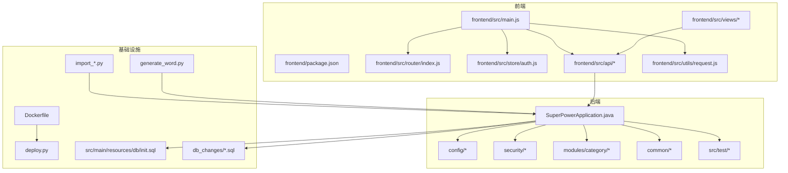
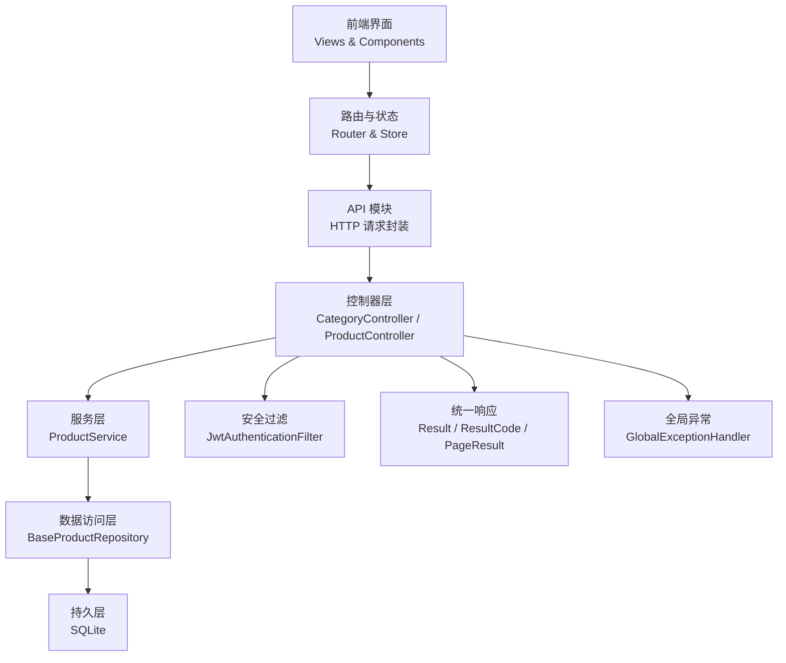
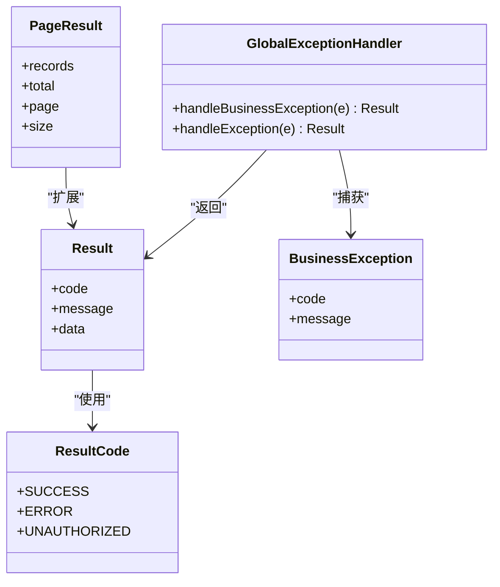
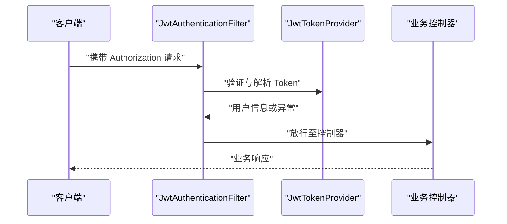
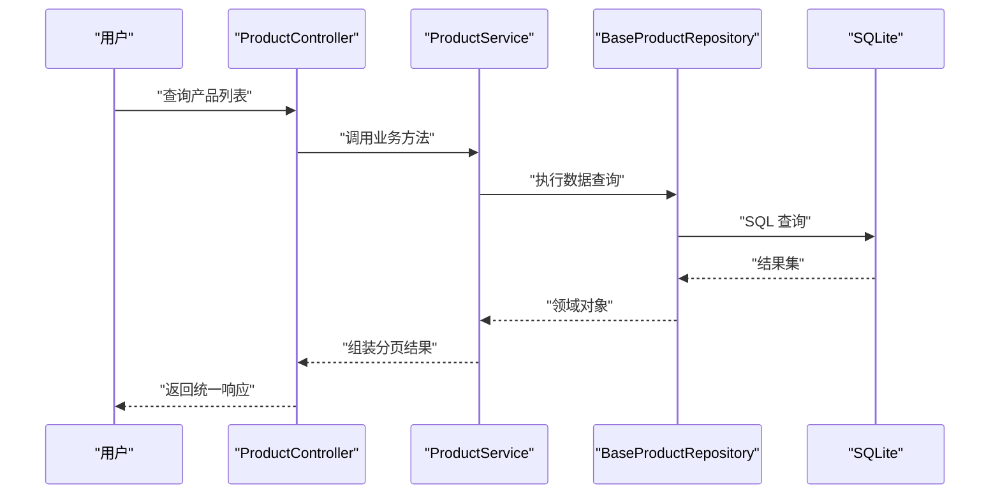
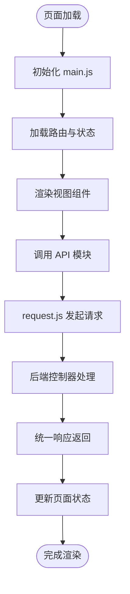
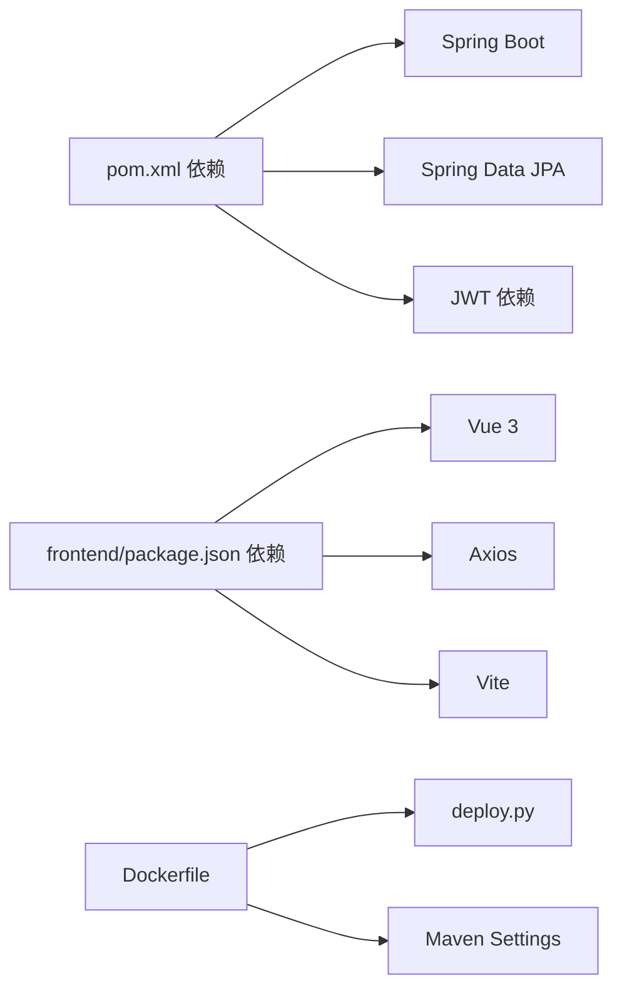

# 开发指南

<cite>
**本文引用的文件**
- [pom.xml](file://pom.xml)
- [Dockerfile](file://Dockerfile)
- [deploy.py](file://deploy.py)
- [src/main/resources/application.yml](file://src/main/resources/application.yml)
- [src/main/java/com/superpower/SuperPowerApplication.java](file://src/main/java/com/superpower/SuperPowerApplication.java)
- [src/main/java/com/superpower/common/Result.java](file://src/main/java/com/superpower/common/Result.java)
- [src/main/java/com/superpower/common/ResultCode.java](file://src/main/java/com/superpower/common/ResultCode.java)
- [src/main/java/com/superpower/common/PageResult.java](file://src/main/java/com/superpower/common/PageResult.java)
- [src/main/java/com/superpower/common/BusinessException.java](file://src/main/java/com/superpower/common/BusinessException.java)
- [src/main/java/com/superpower/common/GlobalExceptionHandler.java](file://src/main/java/com/superpower/common/GlobalExceptionHandler.java)
- [src/main/java/com/superpower/config/WebMvcConfig.java](file://src/main/java/com/superpower/config/WebMvcConfig.java)
- [src/main/java/com/superpower/config/SecurityConfig.java](file://src/main/java/com/superpower/config/SecurityConfig.java)
- [src/main/java/com/superpower/config/SqliteConfig.java](file://src/main/java/com/superpower/config/SqliteConfig.java)
- [src/main/java/com/superpower/security/JwtAuthenticationFilter.java](file://src/main/java/com/superpower/security/JwtAuthenticationFilter.java)
- [src/main/java/com/superpower/security/JwtTokenProvider.java](file://src/main/java/com/superpower/security/JwtTokenProvider.java)
- [src/main/java/com/superpower/modules/category/controller/CategoryController.java](file://src/main/java/com/superpower/modules/category/controller/CategoryController.java)
- [src/main/java/com/superpower/modules/category/controller/ProductController.java](file://src/main/java/com/superpower/modules/category/controller/ProductController.java)
- [src/main/java/com/superpower/modules/category/entity/BaseProduct.java](file://src/main/java/com/superpower/modules/category/entity/BaseProduct.java)
- [src/main/java/com/superpower/modules/category/entity/BaseProductL1.java](file://src/main/java/com/superpower/modules/category/entity/BaseProductL1.java)
- [src/main/java/com/superpower/modules/category/entity/BaseProductL2.java](file://src/main/java/com/superpower/modules/category/entity/BaseProductL2.java)
- [src/main/java/com/superpower/modules/category/repository/BaseProductRepository.java](file://src/main/java/com/superpower/modules/category/repository/BaseProductRepository.java)
- [src/main/java/com/superpower/modules/category/service/ProductService.java](file://src/main/java/com/superpower/modules/category/service/ProductService.java)
- [frontend/package.json](file://frontend/package.json)
- [frontend/vite.config.js](file://frontend/vite.config.js)
- [frontend/src/main.js](file://frontend/src/main.js)
- [frontend/src/App.vue](file://frontend/src/App.vue)
- [frontend/src/router/index.js](file://frontend/src/router/index.js)
- [frontend/src/store/auth.js](file://frontend/src/store/auth.js)
- [frontend/src/utils/request.js](file://frontend/src/utils/request.js)
- [frontend/src/views/system/ProductCategoryManage.vue](file://frontend/src/views/system/ProductCategoryManage.vue)
- [frontend/src/views/system/BaseDataManage.vue](file://frontend/src/views/system/BaseDataManage.vue)
- [frontend/src/components/TreePanel.vue](file://frontend/src/components/TreePanel.vue)
- [frontend/src/api/product.js](file://frontend/src/api/product.js)
- [frontend/src/api/category.js](file://frontend/src/api/category.js)
- [src/test/java/com/superpower/modules/customtab/service/CustomTabServiceTest.java](file://src/test/java/com/superpower/modules/customtab/service/CustomTabServiceTest.java)
- [src/test/java/com/superpower/modules/data/service/DataEntryServiceTest.java](file://src/test/java/com/superpower/modules/data/service/DataEntryServiceTest.java)
- [src/test/java/com/superpower/modules/document/service/DocumentServiceTest.java](file://src/test/java/com/superpower/modules/document/service/DocumentServiceTest.java)
- [db_changes/20260602_add_base_product_table.sql](file://db_changes/20260602_add_base_product_table.sql)
- [db_changes/20260602_add_product_category_tables.sql](file://db_changes/20260602_add_product_category_tables.sql)
- [src/main/resources/db/init.sql](file://src/main/resources/db/init.sql)
- [import_hierarchy.py](file://import_hierarchy.py)
- [import_excel.py](file://import_excel.py)
- [import_l3.py](file://import_l3.py)
- [import_shuzhidi.py](file://import_shuzhidi.py)
- [generate_word.py](file://generate_word.py)
- [docker/maven-settings.xml](file://docker/maven-settings.xml)
- [docker/maven-settings-sandbox.xml](file://docker/maven-settings-sandbox.xml)
- [docker/entrypoint.sh](file://docker/entrypoint.sh)
</cite>

## 目录
1. [简介](#简介)
2. [项目结构](#项目结构)
3. [核心组件](#核心组件)
4. [架构总览](#架构总览)
5. [详细组件分析](#详细组件分析)
6. [依赖分析](#依赖分析)
7. [性能考虑](#性能考虑)
8. [故障排查指南](#故障排查指南)
9. [结论](#结论)
10. [附录](#附录)

## 简介
本开发指南面向产品清单管理系统的后端与前端团队，提供统一的开发规范、最佳实践与协作流程，覆盖代码风格、命名约定、注释标准、新功能开发流程、单元测试、代码评审与质量保障、开发工具配置、调试技巧与性能优化建议。目标是帮助团队建立高效、可维护、可扩展的开发协作机制。

## 项目结构
系统采用前后端分离架构：后端基于 Spring Boot（Java），提供 REST 接口；前端基于 Vue 3 + Vite，通过 API 模块与后端交互；数据库迁移脚本位于 db_changes 目录，支持 SQLite 初始化与版本化演进；Docker 化部署脚本与 Maven 配置位于根目录与 docker 子目录。

图表来源
- [frontend/src/main.js:1-50](file://frontend/src/main.js#L1-L50)
- [src/main/java/com/superpower/SuperPowerApplication.java:1-50](file://src/main/java/com/superpower/SuperPowerApplication.java#L1-L50)
- [Dockerfile:1-50](file://Dockerfile#L1-L50)
- [deploy.py:1-50](file://deploy.py#L1-L50)
- [src/main/resources/db/init.sql:1-50](file://src/main/resources/db/init.sql#L1-L50)

章节来源
- [pom.xml:1-120](file://pom.xml#L1-L120)
- [frontend/package.json:1-100](file://frontend/package.json#L1-L100)
- [src/main/java/com/superpower/SuperPowerApplication.java:1-120](file://src/main/java/com/superpower/SuperPowerApplication.java#L1-L120)

## 核心组件
- 后端应用入口与配置
  - 应用启动类负责加载 Spring 上下文与自动配置。
  - WebMvcConfig 提供跨域、静态资源等通用配置。
  - SecurityConfig 与 JwtAuthenticationFilter 构建基于 JWT 的认证过滤链。
  - SqliteConfig 用于本地开发环境的数据库配置。
- 统一响应与异常处理
  - Result/ResultCode/PageResult 定义统一返回格式与状态码。
  - BusinessException 封装业务异常，GlobalExceptionHandler 全局捕获并转换为标准响应。
- 分类与产品模块
  - CategoryController/ProductController 提供分类与产品相关接口。
  - BaseProduct/Category 实体定义数据模型，Repository 负责数据访问，Service 承载业务逻辑。
- 前端工程
  - main.js 作为入口，router 与 store 管理路由与状态，utils/request.js 统一封装请求。
  - views 与 components 组成页面与组件层，api 模块对接后端服务。

章节来源
- [src/main/java/com/superpower/SuperPowerApplication.java:1-120](file://src/main/java/com/superpower/SuperPowerApplication.java#L1-L120)
- [src/main/java/com/superpower/config/WebMvcConfig.java:1-120](file://src/main/java/com/superpower/config/WebMvcConfig.java#L1-L120)
- [src/main/java/com/superpower/config/SecurityConfig.java:1-120](file://src/main/java/com/superpower/config/SecurityConfig.java#L1-L120)
- [src/main/java/com/superpower/config/SqliteConfig.java:1-120](file://src/main/java/com/superpower/config/SqliteConfig.java#L1-L120)
- [src/main/java/com/superpower/common/Result.java:1-120](file://src/main/java/com/superpower/common/Result.java#L1-L120)
- [src/main/java/com/superpower/common/ResultCode.java:1-120](file://src/main/java/com/superpower/common/ResultCode.java#L1-L120)
- [src/main/java/com/superpower/common/PageResult.java:1-120](file://src/main/java/com/superpower/common/PageResult.java#L1-L120)
- [src/main/java/com/superpower/common/BusinessException.java:1-120](file://src/main/java/com/superpower/common/BusinessException.java#L1-L120)
- [src/main/java/com/superpower/common/GlobalExceptionHandler.java:1-120](file://src/main/java/com/superpower/common/GlobalExceptionHandler.java#L1-L120)
- [src/main/java/com/superpower/modules/category/controller/CategoryController.java:1-120](file://src/main/java/com/superpower/modules/category/controller/CategoryController.java#L1-L120)
- [src/main/java/com/superpower/modules/category/controller/ProductController.java:1-120](file://src/main/java/com/superpower/modules/category/controller/ProductController.java#L1-L120)
- [src/main/java/com/superpower/modules/category/entity/BaseProduct.java:1-120](file://src/main/java/com/superpower/modules/category/entity/BaseProduct.java#L1-L120)
- [src/main/java/com/superpower/modules/category/entity/BaseProductL1.java:1-120](file://src/main/java/com/superpower/modules/category/entity/BaseProductL1.java#L1-L120)
- [src/main/java/com/superpower/modules/category/entity/BaseProductL2.java:1-120](file://src/main/java/com/superpower/modules/category/entity/BaseProductL2.java#L1-L120)
- [src/main/java/com/superpower/modules/category/repository/BaseProductRepository.java:1-120](file://src/main/java/com/superpower/modules/category/repository/BaseProductRepository.java#L1-L120)
- [src/main/java/com/superpower/modules/category/service/ProductService.java:1-120](file://src/main/java/com/superpower/modules/category/service/ProductService.java#L1-L120)
- [frontend/src/main.js:1-120](file://frontend/src/main.js#L1-L120)
- [frontend/src/router/index.js:1-120](file://frontend/src/router/index.js#L1-L120)
- [frontend/src/store/auth.js:1-120](file://frontend/src/store/auth.js#L1-L120)
- [frontend/src/utils/request.js:1-120](file://frontend/src/utils/request.js#L1-L120)

## 架构总览
系统采用分层架构：表现层（Vue 前端）、控制层（Spring MVC 控制器）、服务层（Service）、数据访问层（Repository）与持久层（SQLite）。安全通过 JWT 过滤器拦截校验，统一响应与异常处理贯穿全链路。

图表来源
- [frontend/src/views/system/ProductCategoryManage.vue:1-120](file://frontend/src/views/system/ProductCategoryManage.vue#L1-L120)
- [frontend/src/api/product.js:1-120](file://frontend/src/api/product.js#L1-L120)
- [src/main/java/com/superpower/modules/category/controller/ProductController.java:1-120](file://src/main/java/com/superpower/modules/category/controller/ProductController.java#L1-L120)
- [src/main/java/com/superpower/modules/category/service/ProductService.java:1-120](file://src/main/java/com/superpower/modules/category/service/ProductService.java#L1-L120)
- [src/main/java/com/superpower/modules/category/repository/BaseProductRepository.java:1-120](file://src/main/java/com/superpower/modules/category/repository/BaseProductRepository.java#L1-L120)
- [src/main/java/com/superpower/common/Result.java:1-120](file://src/main/java/com/superpower/common/Result.java#L1-L120)
- [src/main/java/com/superpower/common/GlobalExceptionHandler.java:1-120](file://src/main/java/com/superpower/common/GlobalExceptionHandler.java#L1-L120)
- [src/main/java/com/superpower/security/JwtAuthenticationFilter.java:1-120](file://src/main/java/com/superpower/security/JwtAuthenticationFilter.java#L1-L120)

## 详细组件分析

### 统一响应与异常处理
- 设计要点
  - Result/ResultCode/PageResult 提供一致的返回结构与状态码语义。
  - BusinessException 用于抛出业务错误，GlobalExceptionHandler 统一捕获并映射为标准响应。
- 性能与可靠性
  - 统一响应减少前端解析成本，异常集中处理降低分支复杂度。
- 最佳实践
  - 所有控制器方法返回 Result 或 PageResult。
  - 业务异常必须抛出 BusinessException，避免直接返回错误码。

图表来源
- [src/main/java/com/superpower/common/Result.java:1-120](file://src/main/java/com/superpower/common/Result.java#L1-L120)
- [src/main/java/com/superpower/common/ResultCode.java:1-120](file://src/main/java/com/superpower/common/ResultCode.java#L1-L120)
- [src/main/java/com/superpower/common/PageResult.java:1-120](file://src/main/java/com/superpower/common/PageResult.java#L1-L120)
- [src/main/java/com/superpower/common/BusinessException.java:1-120](file://src/main/java/com/superpower/common/BusinessException.java#L1-L120)
- [src/main/java/com/superpower/common/GlobalExceptionHandler.java:1-120](file://src/main/java/com/superpower/common/GlobalExceptionHandler.java#L1-L120)

章节来源
- [src/main/java/com/superpower/common/Result.java:1-120](file://src/main/java/com/superpower/common/Result.java#L1-L120)
- [src/main/java/com/superpower/common/ResultCode.java:1-120](file://src/main/java/com/superpower/common/ResultCode.java#L1-L120)
- [src/main/java/com/superpower/common/PageResult.java:1-120](file://src/main/java/com/superpower/common/PageResult.java#L1-L120)
- [src/main/java/com/superpower/common/BusinessException.java:1-120](file://src/main/java/com/superpower/common/BusinessException.java#L1-L120)
- [src/main/java/com/superpower/common/GlobalExceptionHandler.java:1-120](file://src/main/java/com/superpower/common/GlobalExceptionHandler.java#L1-L120)

### 安全与认证
- 设计要点
  - JwtAuthenticationFilter 在请求进入控制器前进行 JWT 校验。
  - JwtTokenProvider 负责令牌生成与解析。
- 流程图

图表来源
- [src/main/java/com/superpower/security/JwtAuthenticationFilter.java:1-120](file://src/main/java/com/superpower/security/JwtAuthenticationFilter.java#L1-L120)
- [src/main/java/com/superpower/security/JwtTokenProvider.java:1-120](file://src/main/java/com/superpower/security/JwtTokenProvider.java#L1-L120)

章节来源
- [src/main/java/com/superpower/security/JwtAuthenticationFilter.java:1-120](file://src/main/java/com/superpower/security/JwtAuthenticationFilter.java#L1-L120)
- [src/main/java/com/superpower/security/JwtTokenProvider.java:1-120](file://src/main/java/com/superpower/security/JwtTokenProvider.java#L1-L120)

### 产品与分类模块
- 数据模型
  - BaseProduct/Category 及 L1/L2 层级实体定义产品与分类的数据结构。
- 服务与控制器
  - ProductService 承载业务规则，ProductController 提供 REST 接口。
- 处理流程

图表来源
- [src/main/java/com/superpower/modules/category/controller/ProductController.java:1-120](file://src/main/java/com/superpower/modules/category/controller/ProductController.java#L1-L120)
- [src/main/java/com/superpower/modules/category/service/ProductService.java:1-120](file://src/main/java/com/superpower/modules/category/service/ProductService.java#L1-L120)
- [src/main/java/com/superpower/modules/category/repository/BaseProductRepository.java:1-120](file://src/main/java/com/superpower/modules/category/repository/BaseProductRepository.java#L1-L120)
- [src/main/java/com/superpower/common/PageResult.java:1-120](file://src/main/java/com/superpower/common/PageResult.java#L1-L120)

章节来源
- [src/main/java/com/superpower/modules/category/entity/BaseProduct.java:1-120](file://src/main/java/com/superpower/modules/category/entity/BaseProduct.java#L1-L120)
- [src/main/java/com/superpower/modules/category/entity/BaseProductL1.java:1-120](file://src/main/java/com/superpower/modules/category/entity/BaseProductL1.java#L1-L120)
- [src/main/java/com/superpower/modules/category/entity/BaseProductL2.java:1-120](file://src/main/java/com/superpower/modules/category/entity/BaseProductL2.java#L1-L120)
- [src/main/java/com/superpower/modules/category/controller/ProductController.java:1-120](file://src/main/java/com/superpower/modules/category/controller/ProductController.java#L1-L120)
- [src/main/java/com/superpower/modules/category/service/ProductService.java:1-120](file://src/main/java/com/superpower/modules/category/service/ProductService.java#L1-L120)
- [src/main/java/com/superpower/modules/category/repository/BaseProductRepository.java:1-120](file://src/main/java/com/superpower/modules/category/repository/BaseProductRepository.java#L1-L120)

### 前端工程与 API 集成
- 入口与路由
  - main.js 初始化应用，router 管理页面导航，store 管理登录态与全局状态。
- API 封装
  - utils/request.js 统一发起 HTTP 请求，api/* 模块按功能划分接口。
- 页面组件
  - views 与 components 组合形成页面，TreePanel 等组件复用性强。

图表来源
- [frontend/src/main.js:1-120](file://frontend/src/main.js#L1-L120)
- [frontend/src/router/index.js:1-120](file://frontend/src/router/index.js#L1-L120)
- [frontend/src/store/auth.js:1-120](file://frontend/src/store/auth.js#L1-L120)
- [frontend/src/utils/request.js:1-120](file://frontend/src/utils/request.js#L1-L120)
- [frontend/src/api/product.js:1-120](file://frontend/src/api/product.js#L1-L120)
- [frontend/src/views/system/ProductCategoryManage.vue:1-120](file://frontend/src/views/system/ProductCategoryManage.vue#L1-L120)

章节来源
- [frontend/src/main.js:1-120](file://frontend/src/main.js#L1-L120)
- [frontend/src/router/index.js:1-120](file://frontend/src/router/index.js#L1-L120)
- [frontend/src/store/auth.js:1-120](file://frontend/src/store/auth.js#L1-L120)
- [frontend/src/utils/request.js:1-120](file://frontend/src/utils/request.js#L1-L120)
- [frontend/src/api/product.js:1-120](file://frontend/src/api/product.js#L1-L120)
- [frontend/src/views/system/ProductCategoryManage.vue:1-120](file://frontend/src/views/system/ProductCategoryManage.vue#L1-L120)

## 依赖分析
- 后端依赖
  - Spring Boot Starter Web、Validation、JPA、SQLite JDBC、JWT 等。
- 前端依赖
  - Vue 3、Vue Router、Pinia、Axios、Vite 等。
- 部署与构建
  - Dockerfile 与 deploy.py 支持容器化部署；Maven Settings 适配不同环境。

图表来源
- [pom.xml:1-120](file://pom.xml#L1-L120)
- [frontend/package.json:1-120](file://frontend/package.json#L1-L120)
- [Dockerfile:1-120](file://Dockerfile#L1-L120)
- [deploy.py:1-120](file://deploy.py#L1-L120)
- [docker/maven-settings.xml:1-120](file://docker/maven-settings.xml#L1-L120)
- [docker/maven-settings-sandbox.xml:1-120](file://docker/maven-settings-sandbox.xml#L1-L120)

章节来源
- [pom.xml:1-120](file://pom.xml#L1-L120)
- [frontend/package.json:1-120](file://frontend/package.json#L1-L120)
- [Dockerfile:1-120](file://Dockerfile#L1-L120)
- [deploy.py:1-120](file://deploy.py#L1-L120)

## 性能考虑
- 响应与序列化
  - 使用统一响应减少冗余字段，避免过度序列化。
- 数据访问
  - 合理使用分页 PageResult，避免一次性加载大列表。
  - Repository 查询尽量使用索引列，避免 N+1 查询。
- 前端渲染
  - 组件拆分与懒加载，减少首屏压力。
  - API 请求合并与缓存策略，降低网络开销。
- 安全与鉴权
  - JWT 过滤器前置校验，避免无谓业务处理。
- 数据库
  - SQLite 适合开发与小规模场景，生产建议评估高可用方案。

## 故障排查指南
- 统一异常处理
  - 通过 GlobalExceptionHandler 将异常转为标准响应，便于前端统一提示。
- 日志与追踪
  - 在控制器与服务层添加必要的日志点，定位问题范围。
- 前端请求
  - request.js 中统一拦截错误，记录状态码与消息，辅助定位后端问题。
- 数据一致性
  - 关键操作使用事务，失败回滚；对并发敏感的操作加锁或幂等设计。

章节来源
- [src/main/java/com/superpower/common/GlobalExceptionHandler.java:1-120](file://src/main/java/com/superpower/common/GlobalExceptionHandler.java#L1-L120)
- [frontend/src/utils/request.js:1-120](file://frontend/src/utils/request.js#L1-L120)

## 结论
本指南提供了产品清单管理系统从架构到实现、从开发到运维的全流程规范。建议团队在日常开发中严格遵循统一响应、安全过滤、分层设计与测试驱动原则，持续优化性能与稳定性，确保高质量交付。

## 附录

### 新功能开发流程
- 需求分析
  - 明确功能边界、输入输出、权限与数据模型。
- 接口设计
  - 在后端定义 DTO 与 Entity，设计 REST 接口契约。
- 实现步骤
  - 控制器 -> 服务 -> 数据访问层 -> 数据库脚本。
- 前端集成
  - 新增 API 模块与页面组件，接入路由与状态管理。
- 单元测试
  - 编写 Service/Repository/Controller 测试，覆盖正常与异常路径。
- 代码评审
  - 关注安全性、健壮性、可维护性与性能。
- 部署验证
  - Docker 化部署，核对数据库迁移与初始化脚本。

### 单元测试编写方法
- 后端
  - 使用 JUnit 与 Mockito，Mock Repository 返回值，断言 Service 行为。
  - 示例参考现有测试文件结构与断言方式。
- 前端
  - 使用 Vitest/Jest，模拟 API 返回，断言组件渲染与交互。

章节来源
- [src/test/java/com/superpower/modules/customtab/service/CustomTabServiceTest.java:1-120](file://src/test/java/com/superpower/modules/customtab/service/CustomTabServiceTest.java#L1-L120)
- [src/test/java/com/superpower/modules/data/service/DataEntryServiceTest.java:1-120](file://src/test/java/com/superpower/modules/data/service/DataEntryServiceTest.java#L1-L120)
- [src/test/java/com/superpower/modules/document/service/DocumentServiceTest.java:1-120](file://src/test/java/com/superpower/modules/document/service/DocumentServiceTest.java#L1-L120)

### 代码风格与命名约定
- Java
  - 类名使用帕斯卡命名，方法与变量使用驼峰，常量全大写。
  - 包名全部小写，按模块分包（如 modules.category）。
- 前端
  - 组件文件以 PascalCase 命名，API 文件以小写加下划线命名。
  - 路由与状态命名清晰，避免缩写。
- 注释
  - 公共接口与复杂逻辑添加注释，说明入参与返回含义及异常情况。

### 开发工具配置与调试
- 后端
  - 使用 IDE 导入 Maven 工程，配置断点调试；本地 application.yml 调整日志级别与数据库连接。
- 前端
  - Vite 提供热重载与快速调试，浏览器开发者工具检查网络与状态。
- 容器化
  - Dockerfile 与 entrypoint.sh 配置环境变量与启动参数，deploy.py 自动化部署。

章节来源
- [src/main/resources/application.yml:1-120](file://src/main/resources/application.yml#L1-L120)
- [frontend/vite.config.js:1-120](file://frontend/vite.config.js#L1-L120)
- [docker/entrypoint.sh:1-120](file://docker/entrypoint.sh#L1-L120)
- [deploy.py:1-120](file://deploy.py#L1-L120)

### 数据导入与文档生成
- 数据导入
  - import_hierarchy.py、import_excel.py、import_l3.py、import_shuzhidi.py 提供不同维度的数据导入能力。
- 文档生成
  - generate_word.py 基于模板生成 Word 文档，配合编号与样式配置。

章节来源
- [import_hierarchy.py:1-120](file://import_hierarchy.py#L1-L120)
- [import_excel.py:1-120](file://import_excel.py#L1-L120)
- [import_l3.py:1-120](file://import_l3.py#L1-L120)
- [import_shuzhidi.py:1-120](file://import_shuzhidi.py#L1-L120)
- [generate_word.py:1-120](file://generate_word.py#L1-L120)