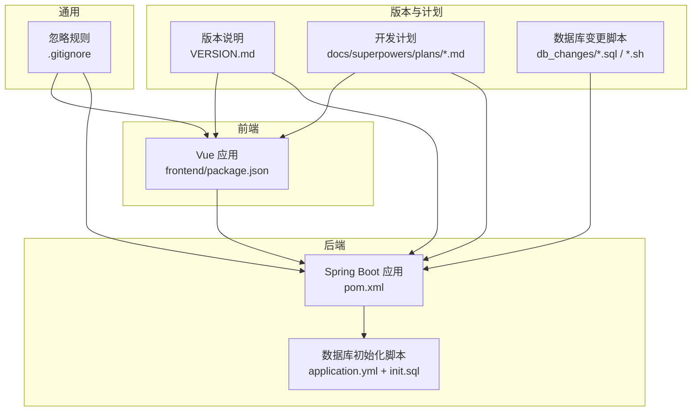
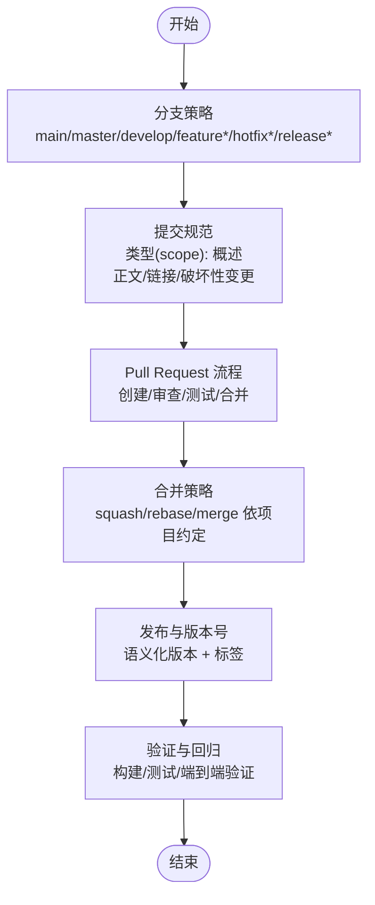
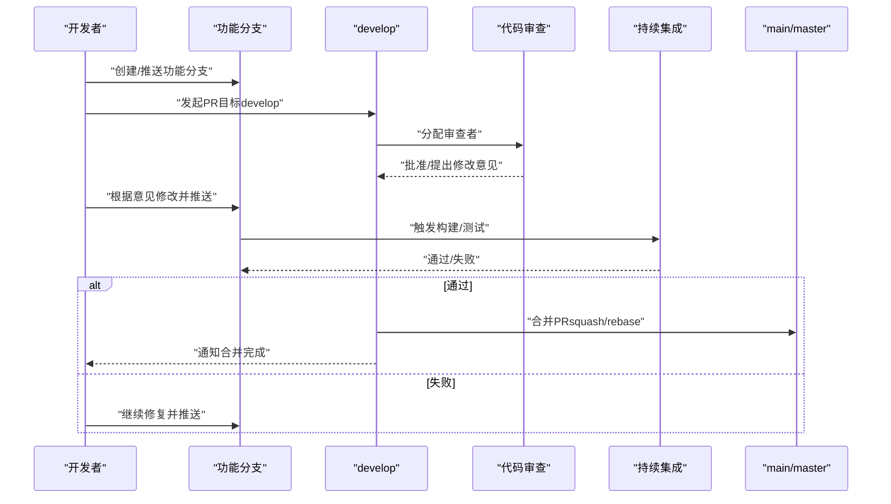
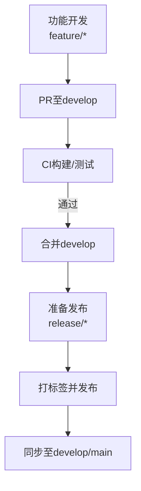
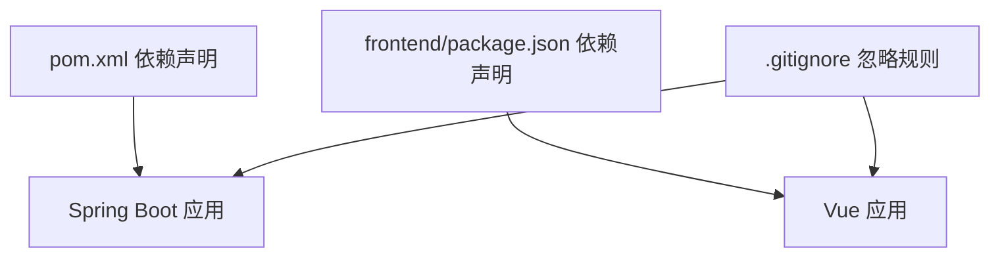

# Git工作流程规范

<cite>
**本文引用的文件**
- [.gitignore](file://.gitignore)
- [VERSION.md](file://VERSION.md)
- [AGENTS.md](file://AGENTS.md)
- [pom.xml](file://pom.xml)
- [frontend/package.json](file://frontend/package.json)
- [db_changes/V1.0.10_cleanup_5_6_2_images.sh](file://db_changes/V1.0.10_cleanup_5_6_2_images.sh)
- [docs/superpowers/plans/2026-05-26-custom-list-tab-plan.md](file://docs/superpowers/plans/2026-05-26-custom-list-tab-plan.md)
</cite>

## 目录
1. [引言](#引言)
2. [项目结构](#项目结构)
3. [核心组件](#核心组件)
4. [架构总览](#架构总览)
5. [详细组件分析](#详细组件分析)
6. [依赖分析](#依赖分析)
7. [性能考虑](#性能考虑)
8. [故障排查指南](#故障排查指南)
9. [结论](#结论)
10. [附录](#附录)

## 引言
本规范面向产品清单管理系统团队，旨在统一Git分支管理、提交消息、Pull Request（PR）流程与冲突解决机制，确保版本控制规范化、可追溯、可协作。规范结合仓库中现有的版本说明、计划文档与脚本文件，形成可落地的工作流。

## 项目结构
本项目采用前后端分离架构，包含后端Spring Boot服务、前端Vue应用、数据库初始化脚本与版本变更记录文档。版本号与变更说明集中在VERSION.md，开发计划集中在docs/superpowers/plans目录，数据库变更脚本位于db_changes目录，构建与依赖信息在pom.xml与frontend/package.json中。



图表来源
- [pom.xml:1-116](file://pom.xml#L1-L116)
- [frontend/package.json:1-28](file://frontend/package.json#L1-L28)
- [VERSION.md:1-277](file://VERSION.md#L1-L277)
- [.gitignore:1-44](file://.gitignore#L1-L44)

章节来源
- [pom.xml:1-116](file://pom.xml#L1-L116)
- [frontend/package.json:1-28](file://frontend/package.json#L1-L28)
- [VERSION.md:1-277](file://VERSION.md#L1-L277)
- [.gitignore:1-44](file://.gitignore#L1-L44)

## 核心组件
- 版本说明与变更记录：VERSION.md用于记录研发版本号与功能变更，要求按菜单层级组织，便于PR与发布核对。
- 开发计划与实施步骤：docs/superpowers/plans目录存放详细计划文件，要求在实施前完成计划与审批，实施过程中按步骤提交。
- 数据库变更脚本：db_changes目录存放与版本号对应的SQL/Shell脚本，命名以Vx.y.z开头，确保与VERSION.md版本号一致。
- 构建与依赖：后端使用Maven（pom.xml），前端使用Vite（frontend/package.json），统一构建产物忽略规则见.gitignore。

章节来源
- [VERSION.md:1-277](file://VERSION.md#L1-L277)
- [AGENTS.md:1-20](file://AGENTS.md#L1-L20)
- [pom.xml:1-116](file://pom.xml#L1-L116)
- [frontend/package.json:1-28](file://frontend/package.json#L1-L28)
- [.gitignore:1-44](file://.gitignore#L1-L44)

## 架构总览
本节给出Git工作流的高层视图，涵盖分支策略、提交规范、PR流程与发布要点。



## 详细组件分析

### 分支管理策略
- 主分支（main/master）：用于发布稳定版本，每次发布打标签并合并develop/release分支。
- 开发分支（develop）：集成日常开发成果，定期与main同步。
- 功能分支（feature/*）：用于新功能开发，命名以feature/前缀，完成后合并至develop。
- 修复分支（hotfix/*）：用于紧急修复，命名以hotfix/前缀，修复后同时合并至main与develop。
- 发布分支（release/*）：用于准备发布的预热，命名以release/前缀，完成后合并至main与develop。

```mermaid
graph LR
M["main/master"] <- --> D["develop"]
D --> F1["feature/*"]
D --> F2["feature/*"]
M --> H["hotfix/*"]
D --> R["release/*"]
R --> M
R --> D
```

图表来源
- [AGENTS.md:11-14](file://AGENTS.md#L11-L14)

章节来源
- [AGENTS.md:11-14](file://AGENTS.md#L11-L14)

### 提交消息规范
- 格式：type(scope): subject
  - type：feat、fix、docs、style、refactor、perf、test、build、ci、chore、revert
  - scope：模块或文件夹，如customtab、frontend、backend、data、image
  - subject：简短描述，首字母小写，结尾不加句号
- 正文：必要时补充动机与影响范围，引用Issue或PR链接
- 破坏性变更：在正文中以BREAKING CHANGE: 开头
- 示例（路径参考）：
  - [docs/superpowers/plans/2026-05-26-custom-list-tab-plan.md:139](file://docs/superpowers/plans/2026-05-26-custom-list-tab-plan.md#L139)
  - [docs/superpowers/plans/2026-05-26-custom-list-tab-plan.md:200](file://docs/superpowers/plans/2026-05-26-custom-list-tab-plan.md#L200)
  - [docs/superpowers/plans/2026-05-26-custom-list-tab-plan.md:287](file://docs/superpowers/plans/2026-05-26-custom-list-tab-plan.md#L287)
  - [docs/superpowers/plans/2026-05-26-custom-list-tab-plan.md:364](file://docs/superpowers/plans/2026-05-26-custom-list-tab-plan.md#L364)
  - [docs/superpowers/plans/2026-05-26-custom-list-tab-plan.md:406](file://docs/superpowers/plans/2026-05-26-custom-list-tab-plan.md#L406)
  - [docs/superpowers/plans/2026-05-26-custom-list-tab-plan.md:431](file://docs/superpowers/plans/2026-05-26-custom-list-tab-plan.md#L431)
  - [docs/superpowers/plans/2026-05-26-custom-list-tab-plan.md:465](file://docs/superpowers/plans/2026-05-26-custom-list-tab-plan.md#L465)
  - [docs/superpowers/plans/2026-05-26-custom-list-tab-plan.md:484](file://docs/superpowers/plans/2026-05-26-custom-list-tab-plan.md#L484)
  - [docs/superpowers/plans/2026-05-26-custom-list-tab-plan.md:530](file://docs/superpowers/plans/2026-05-26-custom-list-tab-plan.md#L530)
  - [docs/superpowers/plans/2026-05-26-custom-list-tab-plan.md:605](file://docs/superpowers/plans/2026-05-26-custom-list-tab-plan.md#L605)
  - [docs/superpowers/plans/2026-05-26-custom-list-tab-plan.md:823](file://docs/superpowers/plans/2026-05-26-custom-list-tab-plan.md#L823)
  - [docs/superpowers/plans/2026-05-26-custom-list-tab-plan.md:926](file://docs/superpowers/plans/2026-05-26-custom-list-tab-plan.md#L926)

章节来源
- [docs/superpowers/plans/2026-05-26-custom-list-tab-plan.md:135-140](file://docs/superpowers/plans/2026-05-26-custom-list-tab-plan.md#L135-L140)
- [docs/superpowers/plans/2026-05-26-custom-list-tab-plan.md:196-200](file://docs/superpowers/plans/2026-05-26-custom-list-tab-plan.md#L196-L200)
- [docs/superpowers/plans/2026-05-26-custom-list-tab-plan.md:283-287](file://docs/superpowers/plans/2026-05-26-custom-list-tab-plan.md#L283-L287)
- [docs/superpowers/plans/2026-05-26-custom-list-tab-plan.md:360-364](file://docs/superpowers/plans/2026-05-26-custom-list-tab-plan.md#L360-L364)
- [docs/superpowers/plans/2026-05-26-custom-list-tab-plan.md:402-406](file://docs/superpowers/plans/2026-05-26-custom-list-tab-plan.md#L402-L406)
- [docs/superpowers/plans/2026-05-26-custom-list-tab-plan.md:427-431](file://docs/superpowers/plans/2026-05-26-custom-list-tab-plan.md#L427-L431)
- [docs/superpowers/plans/2026-05-26-custom-list-tab-plan.md:461-465](file://docs/superpowers/plans/2026-05-26-custom-list-tab-plan.md#L461-L465)
- [docs/superpowers/plans/2026-05-26-custom-list-tab-plan.md:480-484](file://docs/superpowers/plans/2026-05-26-custom-list-tab-plan.md#L480-L484)
- [docs/superpowers/plans/2026-05-26-custom-list-tab-plan.md:526-530](file://docs/superpowers/plans/2026-05-26-custom-list-tab-plan.md#L526-L530)
- [docs/superpowers/plans/2026-05-26-custom-list-tab-plan.md:601-605](file://docs/superpowers/plans/2026-05-26-custom-list-tab-plan.md#L601-L605)
- [docs/superpowers/plans/2026-05-26-custom-list-tab-plan.md:819-823](file://docs/superpowers/plans/2026-05-26-custom-list-tab-plan.md#L819-L823)
- [docs/superpowers/plans/2026-05-26-custom-list-tab-plan.md:922-926](file://docs/superpowers/plans/2026-05-26-custom-list-tab-plan.md#L922-L926)

### Pull Request（PR）流程
- 创建PR：从feature/hotfix分支创建PR至develop（或main视发布节奏），填写变更摘要、影响范围与测试要点。
- 代码审查：至少一名同事审查，关注功能正确性、边界条件、性能与可维护性。
- 测试验证：本地构建与测试通过，CI（如可用）通过；针对数据库变更，提供脚本与执行说明。
- 合并策略：建议使用squash合并以保持提交历史整洁；复杂变更可rebase保持线性历史。
- 关闭与追踪：PR描述中引用相关Issue/计划文件，变更说明同步更新VERSION.md。



图表来源
- [AGENTS.md:16-19](file://AGENTS.md#L16-L19)

章节来源
- [AGENTS.md:16-19](file://AGENTS.md#L16-L19)

### 冲突解决机制与最佳实践
- 预防优先：频繁从develop同步，减少长周期分支；小步提交，及时PR。
- 冲突发生：优先rebase解决，保持线性历史；若多人修改同一文件，采用“逐块对比+协商”方式合并。
- 回归验证：冲突解决后，执行本地构建与关键用例验证，确保无回归。
- 记录与沟通：在PR中说明冲突来源与解决思路，便于后续审计。

章节来源
- [AGENTS.md:16-19](file://AGENTS.md#L16-L19)

### 语义化版本控制与发布
- 版本号：采用语义化版本（MAJOR.MINOR.PATCH），在VERSION.md中维护当前研发版本块。
- 变更说明：按菜单层级组织（产品清单、需求管理、系统管理等），每条变更归类到对应子项。
- 发布流程：在release分支完成后，合并至main并打标签；同时合并至develop保持同步。
- 数据库变更：db_changes目录脚本命名以Vx.y.z开头，确保与VERSION.md版本号一致。



图表来源
- [VERSION.md:1-277](file://VERSION.md#L1-L277)
- [AGENTS.md:11-14](file://AGENTS.md#L11-L14)

章节来源
- [VERSION.md:1-277](file://VERSION.md#L1-L277)
- [AGENTS.md:11-14](file://AGENTS.md#L11-L14)

### 数据库变更脚本与版本一致性
- 命名规范：db_changes目录下脚本以Vx.y.z开头，与VERSION.md中的研发版本号保持一致。
- 执行顺序：脚本文件中通常包含执行顺序说明，需严格遵循。
- 与PR关联：数据库变更应在PR中说明变更目的、影响范围与回滚策略。

章节来源
- [AGENTS.md:11-14](file://AGENTS.md#L11-L14)
- [db_changes/V1.0.10_cleanup_5_6_2_images.sh:1-176](file://db_changes/V1.0.10_cleanup_5_6_2_images.sh#L1-L176)

## 依赖分析
- 后端依赖：Spring Boot、JPA、SQLite JDBC、JWT、POI等，构建与编译在pom.xml中定义。
- 前端依赖：Vue 3、Element Plus、Pinia、Vue Router、Vite等，构建脚本在frontend/package.json中定义。
- 忽略规则：.gitignore屏蔽构建产物、日志、IDE文件与上传目录，避免污染仓库。



图表来源
- [pom.xml:21-84](file://pom.xml#L21-L84)
- [frontend/package.json:11-26](file://frontend/package.json#L11-L26)
- [.gitignore:1-44](file://.gitignore#L1-L44)

章节来源
- [pom.xml:21-84](file://pom.xml#L21-L84)
- [frontend/package.json:11-26](file://frontend/package.json#L11-L26)
- [.gitignore:1-44](file://.gitignore#L1-L44)

## 性能考虑
- 提交粒度：小步提交，避免单次提交过大，便于审查与回滚。
- 构建缓存：合理利用构建缓存与增量编译，减少CI时间。
- 历史整洁：使用squash/rebase保持线性历史，降低未来合并成本。

## 故障排查指南
- 构建失败：检查pom.xml与frontend/package.json依赖版本，确保本地环境与CI一致。
- 数据库不一致：核对db_changes脚本执行顺序与VERSION.md版本号，必要时回滚并重新执行。
- 忽略规则问题：确认.gitignore未误忽略关键源码或配置文件。

章节来源
- [pom.xml:16-18](file://pom.xml#L16-L18)
- [frontend/package.json:1-28](file://frontend/package.json#L1-L28)
- [.gitignore:1-44](file://.gitignore#L1-L44)

## 结论
通过统一的分支策略、提交规范、PR流程与冲突解决机制，团队可以高效协作并确保版本质量。请严格遵循本规范，并在实施过程中持续优化工作流。

## 附录
- 实际操作示例（路径参考）
  - 功能开发与提交：参见计划文档中的多处提交示例路径
    - [docs/superpowers/plans/2026-05-26-custom-list-tab-plan.md:135-140](file://docs/superpowers/plans/2026-05-26-custom-list-tab-plan.md#L135-L140)
    - [docs/superpowers/plans/2026-05-26-custom-list-tab-plan.md:196-200](file://docs/superpowers/plans/2026-05-26-custom-list-tab-plan.md#L196-L200)
    - [docs/superpowers/plans/2026-05-26-custom-list-tab-plan.md:283-287](file://docs/superpowers/plans/2026-05-26-custom-list-tab-plan.md#L283-L287)
    - [docs/superpowers/plans/2026-05-26-custom-list-tab-plan.md:360-364](file://docs/superpowers/plans/2026-05-26-custom-list-tab-plan.md#L360-L364)
    - [docs/superpowers/plans/2026-05-26-custom-list-tab-plan.md:402-406](file://docs/superpowers/plans/2026-05-26-custom-list-tab-plan.md#L402-L406)
    - [docs/superpowers/plans/2026-05-26-custom-list-tab-plan.md:427-431](file://docs/superpowers/plans/2026-05-26-custom-list-tab-plan.md#L427-L431)
    - [docs/superpowers/plans/2026-05-26-custom-list-tab-plan.md:461-465](file://docs/superpowers/plans/2026-05-26-custom-list-tab-plan.md#L461-L465)
    - [docs/superpowers/plans/2026-05-26-custom-list-tab-plan.md:480-484](file://docs/superpowers/plans/2026-05-26-custom-list-tab-plan.md#L480-L484)
    - [docs/superpowers/plans/2026-05-26-custom-list-tab-plan.md:526-530](file://docs/superpowers/plans/2026-05-26-custom-list-tab-plan.md#L526-L530)
    - [docs/superpowers/plans/2026-05-26-custom-list-tab-plan.md:601-605](file://docs/superpowers/plans/2026-05-26-custom-list-tab-plan.md#L601-L605)
    - [docs/superpowers/plans/2026-05-26-custom-list-tab-plan.md:819-823](file://docs/superpowers/plans/2026-05-26-custom-list-tab-plan.md#L819-L823)
    - [docs/superpowers/plans/2026-05-26-custom-list-tab-plan.md:922-926](file://docs/superpowers/plans/2026-05-26-custom-list-tab-plan.md#L922-L926)
  - 数据库脚本执行：参见V1.0.10脚本说明
    - [db_changes/V1.0.10_cleanup_5_6_2_images.sh:1-176](file://db_changes/V1.0.10_cleanup_5_6_2_images.sh#L1-L176)