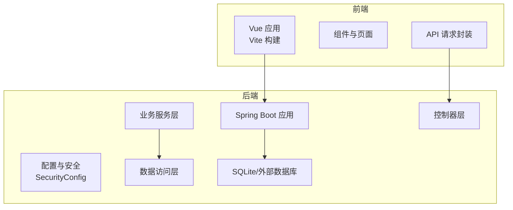
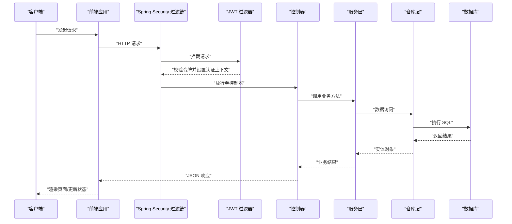
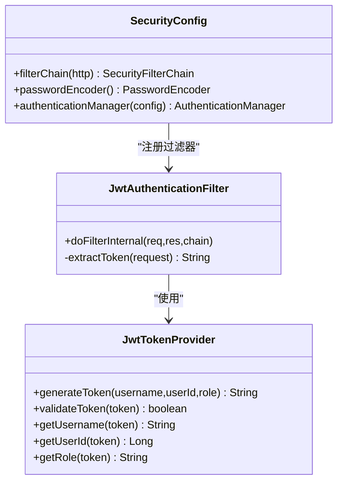
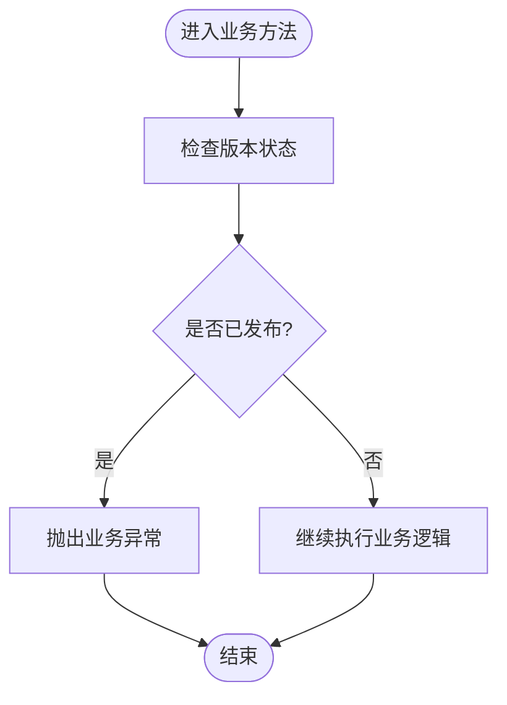
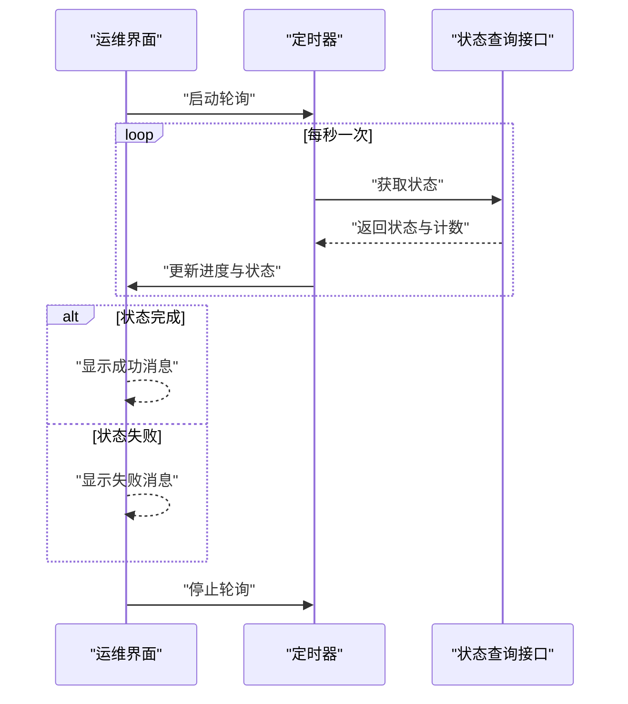
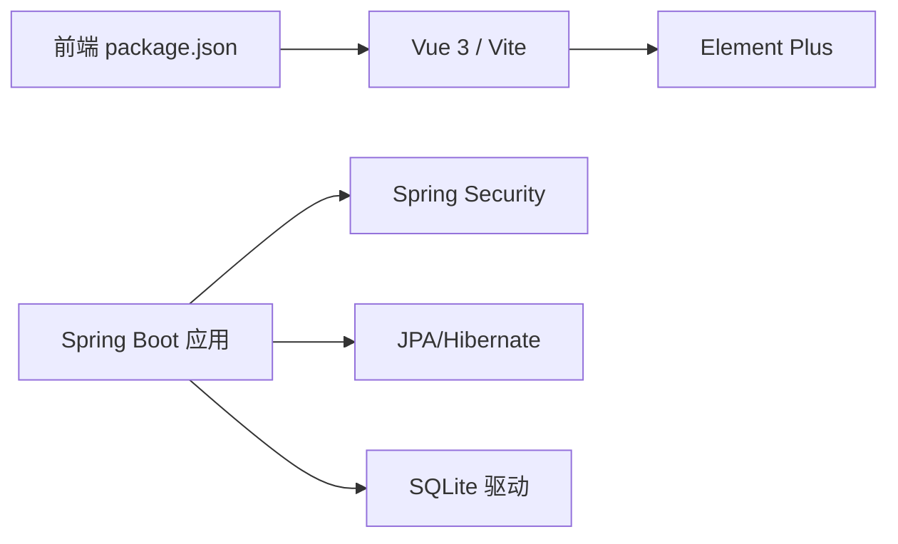

# 代码审查制度

<cite>
**本文引用的文件**
- [SecurityConfig.java](file://src/main/java/com/superpower/config/SecurityConfig.java)
- [JwtTokenProvider.java](file://docs/superpowers/plans/2026-05-25-tianyi-data-tool-phase1.md)
- [JwtAuthenticationFilter.java](file://docs/superpowers/plans/2026-05-25-tianyi-data-tool-phase1.md)
- [application.yml](file://src/main/resources/application.yml)
- [BusinessException.java](file://src/main/java/com/superpower/common/BusinessException.java)
- [DataEntryServiceTest.java](file://src/test/java/com/superpower/modules/data/service/DataEntryServiceTest.java)
- [V1.0.9_fix_l3_images_move.sh](file://db_changes/V1.0.9_fix_l3_images_move.sh)
- [Dockerfile](file://Dockerfile)
- [package.json](file://frontend/package.json)
- [vite.config.js](file://frontend/vite.config.js)
- [SpecialOps.vue](file://frontend/src/views/system/SpecialOps.vue)
</cite>

## 目录
1. [引言](#引言)
2. [项目结构](#项目结构)
3. [核心组件](#核心组件)
4. [架构总览](#架构总览)
5. [详细组件分析](#详细组件分析)
6. [依赖关系分析](#依赖关系分析)
7. [性能考量](#性能考量)
8. [故障排查指南](#故障排查指南)
9. [结论](#结论)
10. [附录](#附录)

## 引言
本文件旨在为产品清单管理系统建立一套完整的代码审查制度与标准，覆盖代码质量、安全性、性能与可维护性四大维度；明确从代码提交到审查完成的完整流程；规定审查人员职责与审查深度；给出静态分析工具（如 SonarQube、Checkmarx）的使用规范；制定审查反馈与问题跟踪机制；并总结最佳实践与常见问题解决方案，以持续提升代码质量与团队技术能力。

## 项目结构
系统采用前后端分离架构：
- 后端基于 Spring Boot，采用分层架构（controller/service/repository/entity/dto），统一异常处理与全局响应包装。
- 前端基于 Vue 3 + Vite，采用组件化与模块化组织。
- 安全体系通过 Spring Security + JWT 实现无状态认证与授权。
- 数据持久化使用 SQLite（开发环境），生产环境建议替换为关系型数据库。
- 提供 Docker 构建入口，便于容器化部署。

图表来源
- [SecurityConfig.java:27-45](file://src/main/java/com/superpower/config/SecurityConfig.java#L27-L45)
- [application.yml:1-39](file://src/main/resources/application.yml#L1-L39)

章节来源
- [SecurityConfig.java:1-56](file://src/main/java/com/superpower/config/SecurityConfig.java#L1-L56)
- [application.yml:1-39](file://src/main/resources/application.yml#L1-L39)

## 核心组件
- 安全配置与认证过滤链：定义 CSRF 关闭、会话策略、请求放行规则与 JWT 过滤器插入点。
- JWT 工具与过滤器：令牌生成、解析与校验，以及在请求中提取与注入认证上下文。
- 全局异常与结果封装：统一业务异常与返回码，保证接口一致性。
- 测试用例：对关键业务边界（如版本发布状态下的操作限制）进行断言验证。
- 前端特殊运维界面：包含轮询状态、进度计算与消息提示，体现异步状态管理与用户反馈。

章节来源
- [SecurityConfig.java:27-45](file://src/main/java/com/superpower/config/SecurityConfig.java#L27-L45)
- [JwtTokenProvider.java:585-650](file://docs/superpowers/plans/2026-05-25-tianyi-data-tool-phase1.md#L585-L650)
- [JwtAuthenticationFilter.java:697-750](file://docs/superpowers/plans/2026-05-25-tianyi-data-tool-phase1.md#L697-L750)
- [BusinessException.java:1-23](file://src/main/java/com/superpower/common/BusinessException.java#L1-L23)
- [DataEntryServiceTest.java:78-108](file://src/test/java/com/superpower/modules/data/service/DataEntryServiceTest.java#L78-L108)
- [SpecialOps.vue:389-434](file://frontend/src/views/system/SpecialOps.vue#L389-L434)

## 架构总览
下图展示了从前端到后端的关键交互路径，以及安全过滤链在请求生命周期中的位置。

图表来源
- [SecurityConfig.java:27-45](file://src/main/java/com/superpower/config/SecurityConfig.java#L27-L45)
- [JwtAuthenticationFilter.java:697-750](file://docs/superpowers/plans/2026-05-25-tianyi-data-tool-phase1.md#L697-L750)

## 详细组件分析

### 组件一：安全配置与认证过滤链
- 设计要点
  - 禁用 CSRF，启用无状态会话策略。
  - 对特定公开路径放行，其余路径需认证。
  - 在用户名密码过滤器之前插入自定义 JWT 过滤器，实现令牌驱动的认证。
  - 提供密码编码器与认证管理器 Bean。
- 审查关注点
  - 路由放行列表是否最小化且有据可依。
  - 会话策略与无状态设计是否匹配业务需求。
  - 密码编码强度与认证管理器配置是否合理。
- 性能与可维护性
  - 无状态认证降低服务器状态存储开销。
  - 过滤器链顺序影响性能与行为，需保持稳定。

图表来源
- [SecurityConfig.java:27-55](file://src/main/java/com/superpower/config/SecurityConfig.java#L27-L55)
- [JwtAuthenticationFilter.java:697-750](file://docs/superpowers/plans/2026-05-25-tianyi-data-tool-phase1.md#L697-L750)
- [JwtTokenProvider.java:585-650](file://docs/superpowers/plans/2026-05-25-tianyi-data-tool-phase1.md#L585-L650)

章节来源
- [SecurityConfig.java:27-55](file://src/main/java/com/superpower/config/SecurityConfig.java#L27-L55)

### 组件二：业务异常与测试用例
- 设计要点
  - 自定义业务异常类，统一错误码与消息。
  - 单元测试覆盖关键边界条件（如版本发布后的操作限制）。
- 审查关注点
  - 异常语义是否清晰，错误码是否一致。
  - 测试用例是否覆盖典型与异常分支。
- 可维护性
  - 明确的异常模型有助于前端与接口文档的一致性。

图表来源
- [BusinessException.java:1-23](file://src/main/java/com/superpower/common/BusinessException.java#L1-L23)
- [DataEntryServiceTest.java:78-108](file://src/test/java/com/superpower/modules/data/service/DataEntryServiceTest.java#L78-L108)

章节来源
- [BusinessException.java:1-23](file://src/main/java/com/superpower/common/BusinessException.java#L1-L23)
- [DataEntryServiceTest.java:78-108](file://src/test/java/com/superpower/modules/data/service/DataEntryServiceTest.java#L78-L108)

### 组件三：前端特殊运维界面（轮询与进度）
- 设计要点
  - 使用定时器轮询后台状态，根据状态显示成功或失败消息。
  - 计算百分比进度，实时更新同步状态。
- 审查关注点
  - 轮询频率与停止条件是否合理，避免资源浪费。
  - 错误处理与空值保护是否完善。
- 可维护性
  - 将轮询逻辑抽象为可复用的 Hook 或工具函数，提升可测试性与可读性。

图表来源
- [SpecialOps.vue:389-434](file://frontend/src/views/system/SpecialOps.vue#L389-L434)

章节来源
- [SpecialOps.vue:389-434](file://frontend/src/views/system/SpecialOps.vue#L389-L434)

## 依赖关系分析
- 后端依赖
  - Spring Security 与 Spring MVC：提供安全过滤链与 Web 层。
  - JPA/Hibernate：数据映射与查询。
  - SQLite 驱动：本地开发数据库。
- 前端依赖
  - Vue 3 生态与 Vite：构建与开发体验。
  - Element Plus：UI 组件库。
- 审查关注点
  - 版本升级策略与依赖锁定。
  - 第三方包的安全与稳定性评估。

图表来源
- [package.json](file://frontend/package.json)
- [vite.config.js](file://frontend/vite.config.js)
- [application.yml:18-24](file://src/main/resources/application.yml#L18-L24)

章节来源
- [package.json](file://frontend/package.json)
- [vite.config.js](file://frontend/vite.config.js)
- [application.yml:18-24](file://src/main/resources/application.yml#L18-L24)

## 性能考量
- 安全与认证
  - 无状态 JWT 减少服务器会话存储；令牌校验在内存中完成，延迟低。
  - 建议控制令牌有效期与刷新策略，避免频繁重建认证上下文。
- 数据访问
  - SQLite 连接池较小，生产环境需切换高性能数据库并优化连接参数。
  - 合理使用懒加载与分页，避免一次性加载大结果集。
- 前端交互
  - 轮询频率应适中，结合增量更新与事件推送（如 WebSocket）降低轮询压力。
  - 图片与文档上传需限制大小并提供进度反馈。

## 故障排查指南
- 认证相关
  - 若出现未认证或权限不足，检查放行路径与角色权限配置。
  - 校验 JWT 密钥与过期时间配置是否正确。
- 数据库与迁移
  - 开发环境使用 SQLite，注意并发与事务隔离级别差异。
  - 迁移脚本与目录结构变更需谨慎，避免重复或缺失。
- 前端状态
  - 轮询不生效或状态不更新，检查定时器清理与接口返回格式。
  - 进度百分比异常，核对总数与已处理计数字段。

章节来源
- [SecurityConfig.java:27-45](file://src/main/java/com/superpower/config/SecurityConfig.java#L27-L45)
- [application.yml:18-24](file://src/main/resources/application.yml#L18-L24)
- [V1.0.9_fix_l3_images_move.sh:280-3338](file://db_changes/V1.0.9_fix_l3_images_move.sh#L280-L3338)
- [SpecialOps.vue:389-434](file://frontend/src/views/system/SpecialOps.vue#L389-L434)

## 结论
通过建立覆盖质量、安全、性能与可维护性的审查标准，配合明确的流程与工具规范，能够有效提升代码质量与交付效率。建议持续引入静态分析工具，固化测试覆盖率门槛，并定期回顾与优化审查流程。

## 附录

### 代码审查检查清单（示例）
- 代码质量
  - 是否遵循统一的命名与缩进规范？
  - 是否存在重复代码与过长函数/类？
  - 是否提供必要的注释与文档字符串？
- 安全性
  - 是否存在硬编码密钥或敏感信息？
  - 是否正确处理输入校验与输出转义？
  - 是否使用强密码编码器与安全的令牌配置？
- 性能
  - 是否避免 N+1 查询与不必要的全表扫描？
  - 是否合理使用缓存与连接池？
  - 是否存在阻塞式 I/O 或高延迟操作？
- 可维护性
  - 是否具备完善的单元测试与集成测试？
  - 是否提供清晰的日志与错误追踪？
  - 是否具备回滚与降级策略？

### 审查流程（建议）
- 提交前
  - 本地自检（格式化、静态分析、单元测试）。
  - 生成变更摘要与测试报告。
- 提交流程
  - 创建 Pull Request，填写审查清单与风险说明。
  - 指定至少一名审查人，避免自我审查。
- 审查阶段
  - 审查人逐项对照检查清单，提出问题与建议。
  - 必要时要求补充测试或重构。
- 合并与验证
  - 修复问题后重新审查，合并前进行回归测试。
  - 发布后观察监控指标与用户反馈。

### 审查人员职责与深度
- 初审（开发者）
  - 自查与修复明显问题，确保基本质量。
- 复审（资深工程师）
  - 关注架构一致性、性能与安全性，推动最佳实践落地。
- 抽查（技术负责人）
  - 对关键模块与跨模块改动进行抽查，把控整体质量。

### 审查工具使用规范
- SonarQube
  - 集成 CI，设定阈值（覆盖率、重复率、技术债）。
  - 对阻断缺陷必须修复方可合并。
- Checkmarx/KICS
  - 扫描安全漏洞与配置风险，生成报告并跟踪修复。
- 前端 ESLint/Prettier
  - 统一代码风格与潜在问题检测，纳入 CI。

### 审查反馈与问题跟踪
- 使用 Issue/缺陷跟踪系统记录问题，分配责任人与截止日期。
- 审查意见需可追溯，保留讨论记录。
- 对重复问题建立根因分析与改进措施。

### 最佳实践与常见问题
- 最佳实践
  - 小步快跑，频繁提交与评审。
  - 优先解决高风险问题，再关注细节。
  - 推广可测试性设计与契约式编程。
- 常见问题
  - 忽视安全配置导致权限绕过。
  - 缺乏测试导致回归问题频发。
  - 过度依赖轮询造成资源浪费。
  - 令牌密钥泄露或过期策略不当。