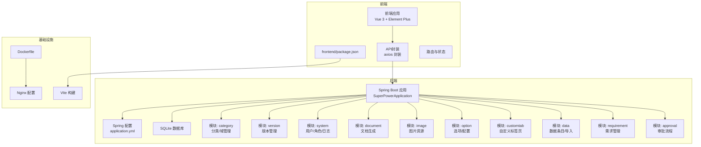
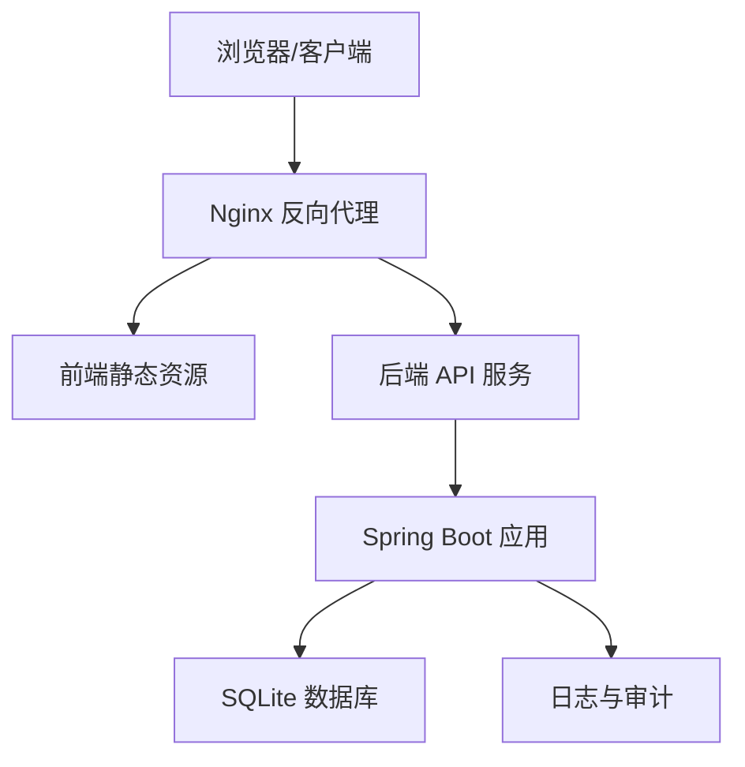
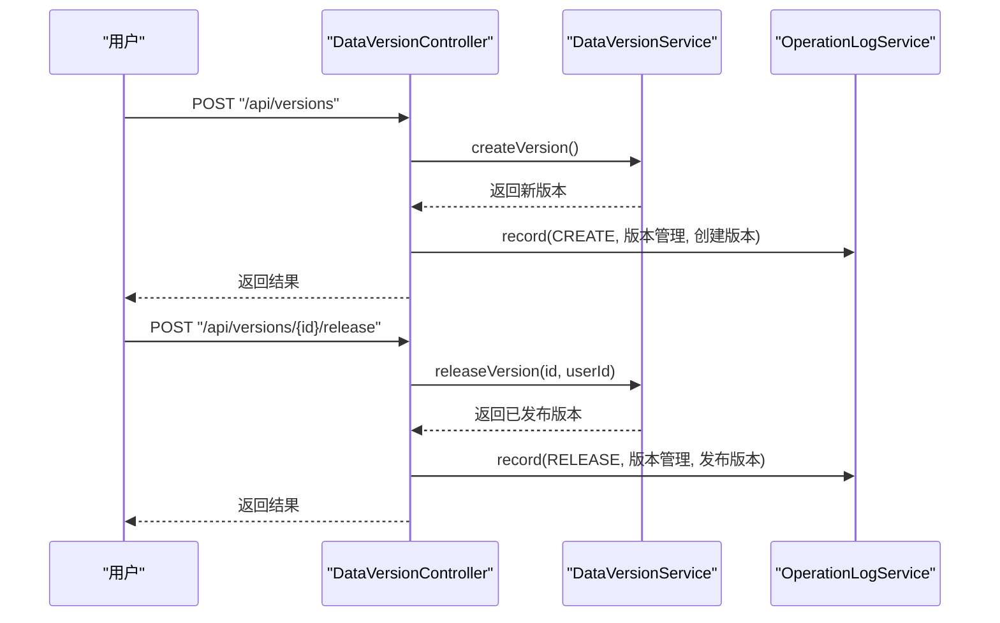
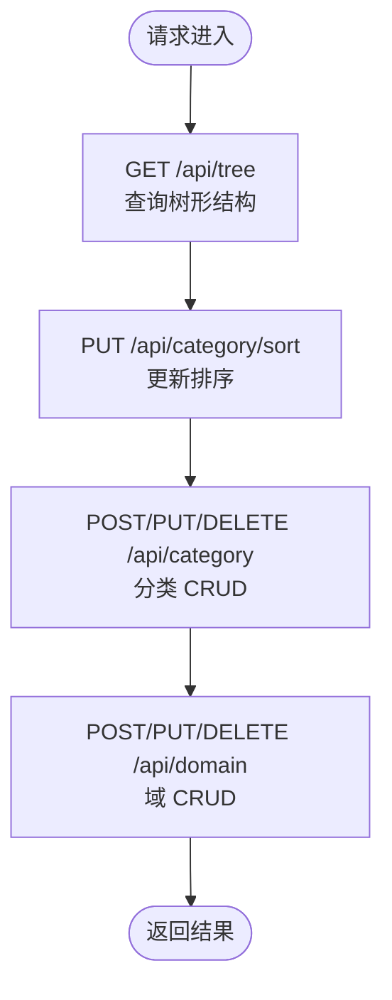
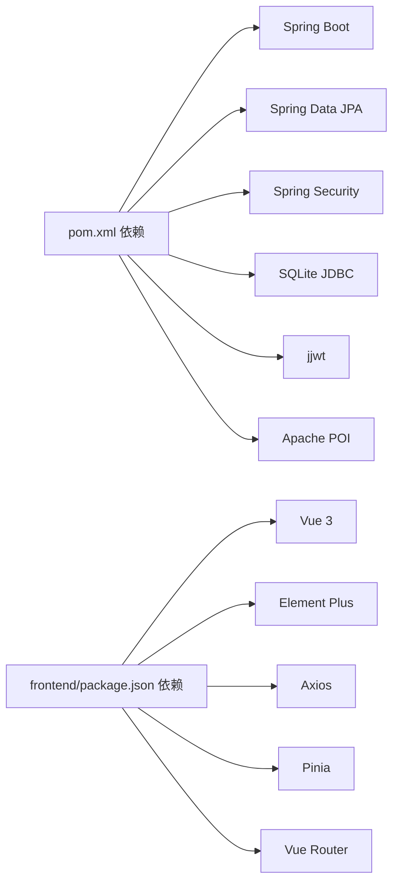

# 开发流程与协作

<cite>
**本文引用的文件**
- [AGENTS.md](file://AGENTS.md)
- [VERSION.md](file://VERSION.md)
- [pom.xml](file://pom.xml)
- [Dockerfile](file://Dockerfile)
- [application.yml](file://src/main/resources/application.yml)
- [SuperPowerApplication.java](file://src/main/java/com/superpower/SuperPowerApplication.java)
- [CategoryController.java](file://src/main/java/com/superpower/modules/category/controller/CategoryController.java)
- [DataVersionController.java](file://src/main/java/com/superpower/modules/version/controller/DataVersionController.java)
- [frontend/package.json](file://frontend/package.json)
- [docs/superpowers/plans/2026-06-22-intelligent-tag-implementation.md](file://docs/superpowers/plans/2026-06-22-intelligent-tag-implementation.md)
- [docs/superpowers/specs/2026-05-27-liquid-glass-redesign.md](file://docs/superpowers/specs/2026-05-27-liquid-glass-redesign.md)
</cite>

## 目录
1. [引言](#引言)
2. [项目结构](#项目结构)
3. [核心组件](#核心组件)
4. [架构总览](#架构总览)
5. [详细组件分析](#详细组件分析)
6. [依赖分析](#依赖分析)
7. [性能考虑](#性能考虑)
8. [故障排查指南](#故障排查指南)
9. [结论](#结论)
10. [附录](#附录)

## 引言
本文件面向产品清单管理系统团队，旨在建立一套完整、可落地的开发流程与协作规范。内容涵盖从需求分析、技术设计、代码实现、测试验证到部署上线的全流程，以及Git工作流、代码评审、任务管理与进度跟踪、文档与知识分享机制，帮助团队形成高效、规范的协作体系。

## 项目结构
项目采用前后端分离架构，后端基于Spring Boot + JPA + SQLite，前端基于Vue 3 + Element Plus，容器化通过Nginx + Java运行时镜像实现。整体目录组织体现“模块化”和“职责分离”：
- 后端模块：按业务域划分（category、version、system、requirement、document、image、option、customtab、data、approval），每个模块包含controller/entity/repository/service层，遵循分层架构。
- 前端模块：按页面与通用组件拆分，包含路由、状态管理、API封装、通用组件与视图。
- 配置与资源：Spring Boot配置、数据库初始化脚本、Docker镜像与入口脚本、静态资源模板等。
- 文档与计划：docs/superpowers/plans用于任务实施计划，docs/superpowers/specs用于设计规格，VERSION.md记录研发版本与变更说明，AGENTS.md定义开发与验证规则。

图表来源
- [Dockerfile:1-38](file://Dockerfile#L1-L38)
- [application.yml:1-40](file://src/main/resources/application.yml#L1-L40)
- [SuperPowerApplication.java:1-82](file://src/main/java/com/superpower/SuperPowerApplication.java#L1-L82)
- [frontend/package.json:1-28](file://frontend/package.json#L1-L28)

章节来源
- [pom.xml:1-116](file://pom.xml#L1-L116)
- [Dockerfile:1-38](file://Dockerfile#L1-L38)
- [application.yml:1-40](file://src/main/resources/application.yml#L1-L40)
- [SuperPowerApplication.java:1-82](file://src/main/java/com/superpower/SuperPowerApplication.java#L1-L82)
- [frontend/package.json:1-28](file://frontend/package.json#L1-L28)

## 核心组件
- 应用入口与初始化：后端应用在启动时设置时区、初始化默认角色与用户、创建首个数据版本，保证系统可用性与演示环境。
- 配置中心：Spring配置集中于application.yml，包含端口、数据库连接、日志级别、JWT密钥、文档存储路径等。
- 控制器层：按模块暴露REST接口，如分类/域管理、版本管理、系统管理等，统一返回Result包装。
- 容器化：Dockerfile定义运行时镜像，挂载jar、dist、db、uploads等目录，结合Nginx提供静态资源与反向代理。

章节来源
- [SuperPowerApplication.java:35-80](file://src/main/java/com/superpower/SuperPowerApplication.java#L35-L80)
- [application.yml:11-40](file://src/main/resources/application.yml#L11-L40)
- [CategoryController.java:23-64](file://src/main/java/com/superpower/modules/category/controller/CategoryController.java#L23-L64)
- [DataVersionController.java:36-104](file://src/main/java/com/superpower/modules/version/controller/DataVersionController.java#L36-L104)
- [Dockerfile:1-38](file://Dockerfile#L1-L38)

## 架构总览
系统采用前后端分离，后端提供REST API，前端通过axios封装调用；数据库采用SQLite，配合Hikari连接池；容器化部署通过Nginx提供静态资源与反向代理，Java进程提供API服务。

图表来源
- [Dockerfile:15-37](file://Dockerfile#L15-L37)
- [application.yml:18-30](file://src/main/resources/application.yml#L18-L30)

## 详细组件分析

### 版本管理模块（DataVersionController）
- 职责：提供版本列表、创建、发布、回滚、删除等接口，并记录操作日志。
- 关键流程：创建版本后记录日志；发布/回滚时绑定当前用户信息；删除版本触发清理流程并记录日志。
- 与系统模块协作：调用SysUserService与OperationLogService完成用户与审计记录。

图表来源
- [DataVersionController.java:66-96](file://src/main/java/com/superpower/modules/version/controller/DataVersionController.java#L66-L96)

章节来源
- [DataVersionController.java:36-104](file://src/main/java/com/superpower/modules/version/controller/DataVersionController.java#L36-L104)

### 分类/域管理模块（CategoryController）
- 职责：提供树形结构查询、排序更新、分类/域的增删改接口。
- 数据契约：TreeNodeDTO用于树形数据传输，排序更新接收Map列表。

图表来源
- [CategoryController.java:23-64](file://src/main/java/com/superpower/modules/category/controller/CategoryController.java#L23-L64)

章节来源
- [CategoryController.java:23-64](file://src/main/java/com/superpower/modules/category/controller/CategoryController.java#L23-L64)

### 开发与验证规则（AGENTS.md）
- 代码修改后必须进行前端构建、后端编译、服务重启与接口验证，确保无编译错误与接口异常。
- 版本号与变更说明管理：研发版本号与清单版本号区分；VERSION.md按菜单层级组织变更说明；数据库结构变更需配套db_changes脚本。
- 计划先行：所有功能开发前需在docs/superpowers/plans编写实施计划并通过审批。

章节来源
- [AGENTS.md:1-20](file://AGENTS.md#L1-L20)
- [VERSION.md:1-20](file://VERSION.md#L1-L20)

### 设计与计划文档
- 规格设计：docs/superpowers/specs用于输出设计规格，如界面重设计、工作流设计等。
- 实施计划：docs/superpowers/plans用于输出详细实施步骤、涉及文件、关键变更说明等，经审批后执行。

章节来源
- [docs/superpowers/specs/2026-05-27-liquid-glass-redesign.md](file://docs/superpowers/specs/2026-05-27-liquid-glass-redesign.md)
- [docs/superpowers/plans/2026-06-22-intelligent-tag-implementation.md](file://docs/superpowers/plans/2026-06-22-intelligent-tag-implementation.md)

## 依赖分析
- 技术栈依赖：后端使用Spring Boot 3.2、JPA、SQLite、JWT；前端使用Vue 3、Element Plus、Pinia、Vue Router；构建工具Vite。
- 运行时依赖：Dockerfile声明运行时镜像与挂载点，Nginx提供静态资源与反向代理；application.yml配置数据库连接、连接池与日志级别。
- 模块耦合：控制器依赖服务层，服务层依赖仓库层与领域实体；系统模块（用户、角色、日志）被各模块复用。

图表来源
- [pom.xml:21-84](file://pom.xml#L21-L84)
- [frontend/package.json:11-26](file://frontend/package.json#L11-L26)

章节来源
- [pom.xml:21-84](file://pom.xml#L21-L84)
- [frontend/package.json:11-26](file://frontend/package.json#L11-L26)

## 性能考虑
- 数据库连接与锁：application.yml中设置SQLite busy_timeout与Hikari连接池参数，减少写锁竞争；JPA启用open-in-view=false降低会话生命周期。
- 日志与审计：开启DEBUG级别日志便于问题定位，同时注意生产环境的日志级别与落盘策略。
- 前后端构建：前端使用Vite，后端使用Maven，建议在CI中缓存依赖与构建产物，缩短流水线时间。

章节来源
- [application.yml:18-34](file://src/main/resources/application.yml#L18-L34)
- [pom.xml:86-114](file://pom.xml#L86-L114)
- [Dockerfile:32-37](file://Dockerfile#L32-L37)

## 故障排查指南
- 启动与端口：重启服务后使用curl检查8080端口与关键接口（如版本列表、登录）响应，避免遗留500错误。
- 数据库一致性：图片重命名事务一致性通过afterCommit机制保障，异常时检查日志级别与上下文信息。
- 文档生成：生成线程池并发、进度更新频率与重试策略已在配置中优化，若仍卡住，检查生成记录状态与日志。
- 容器健康：Docker HEALTHCHECK用于探测服务健康，关注容器日志与Nginx访问日志。

章节来源
- [AGENTS.md:9-11](file://AGENTS.md#L9-L11)
- [application.yml:3-10](file://src/main/resources/application.yml#L3-L10)
- [Dockerfile:35-37](file://Dockerfile#L35-L37)

## 结论
本规范以现有代码与文档为基础，明确了从需求到上线的全流程、Git工作流、代码评审、任务管理与文档规范，辅以性能与故障排查建议，帮助团队建立高效、规范的协作体系。建议在团队内定期回顾与迭代，持续完善流程与工具链。

## 附录

### 开发流程规范（建议）
- 需求分析：由产品经理与技术负责人共同梳理需求，输出需求卡片与验收标准。
- 技术设计：输出设计规格文档（specs），明确接口、数据模型、流程图与边界条件。
- 实施计划：在plans目录输出详细实施计划，包含文件清单、步骤与时序、关键变更点与风险预案。
- 代码实现：遵循模块化与分层架构，控制器仅做参数校验与结果封装，业务逻辑下沉至服务层。
- 测试验证：单元测试覆盖核心逻辑，集成测试覆盖关键流程；本地验证通过后提交MR。
- 评审与合并：发起MR，至少一名同行评审通过后合并；合并前确保分支无冲突、测试通过、文档更新。
- 部署上线：通过CI/CD流水线构建镜像与制品，灰度发布并监控健康检查与关键指标。

### Git工作流规范（建议）
- 分支策略：master/main作为受保护主线；feature/*用于功能开发；hotfix/*用于紧急修复；release/*用于发布准备。
- 提交规范：类型: 模块/文件路径: 一句话摘要；正文说明动机与方案；引用相关Issue或PR。
- 合并流程：PR需通过CI与评审；合并后清理分支；打Tag并更新CHANGELOG。

### 代码评审制度（建议）
- 评审范围：所有MR必须至少一次评审；复杂改动建议多人参与。
- 评审标准：可读性、健壮性、性能、安全性、可测试性、文档与注释。
- 评审流程：提交PR后分配评审人；评审意见需闭环；通过后方可合并。

### 任务管理与进度跟踪（建议）
- 使用看板（如Jira/Tapd）管理需求、任务与缺陷；每日站会同步进展与阻塞。
- Scrum实践：Sprint规划、每日站会、Sprint评审与回顾；燃尽图跟踪剩余工作。
- 敏捷实践：用户故事、验收标准、迭代节奏与交付节奏稳定化。

### 文档编写与知识分享（建议）
- 文档分类：需求文档、设计规格、实施计划、操作手册、FAQ。
- 知识沉淀：定期组织技术分享、评审总结、问题复盘；建立知识库索引。
- 版本与变更：VERSION.md按菜单层级维护变更说明；数据库结构变更配套脚本与说明。