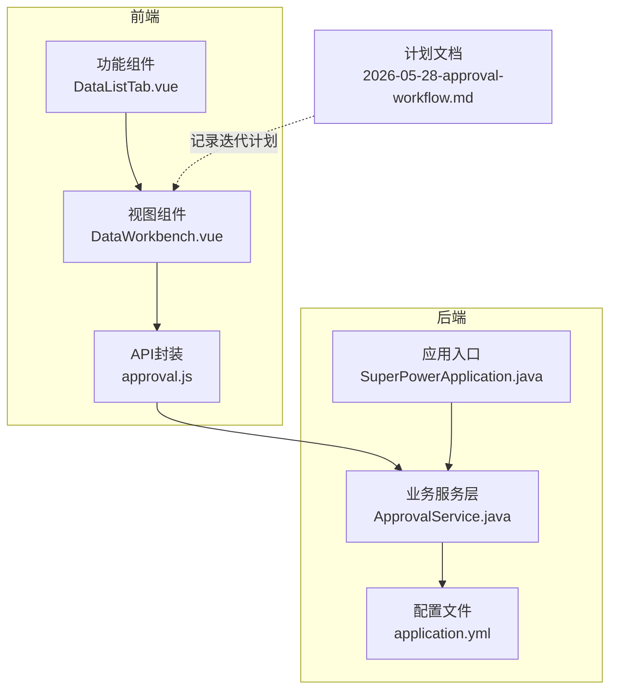
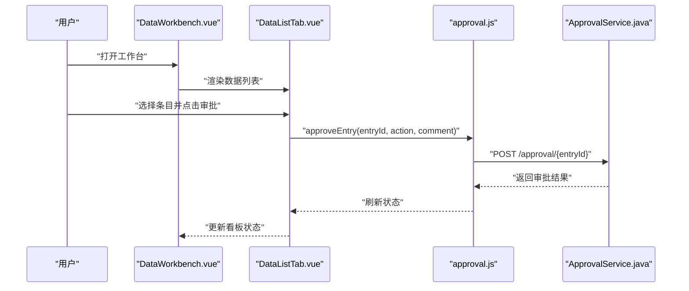
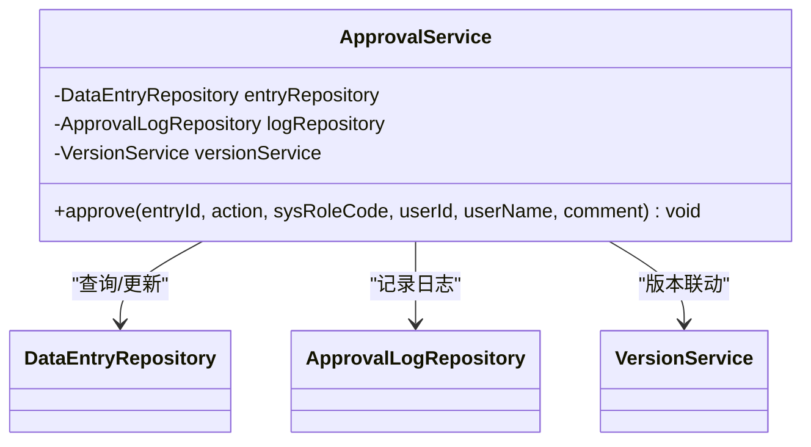
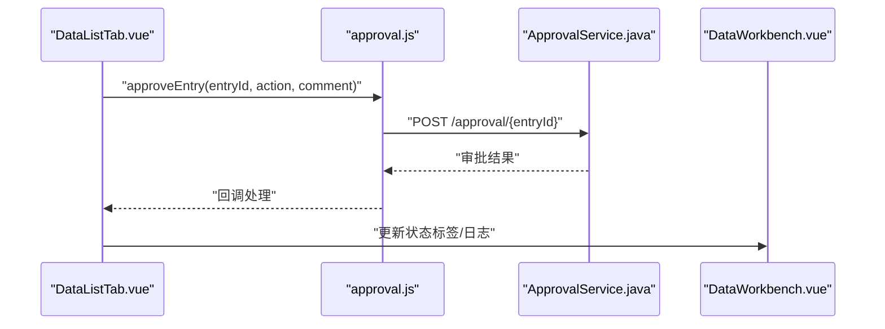
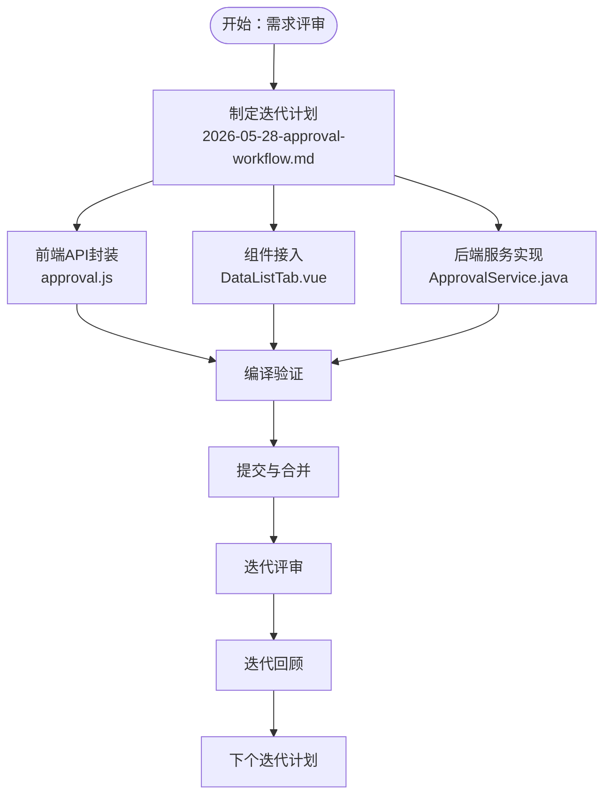
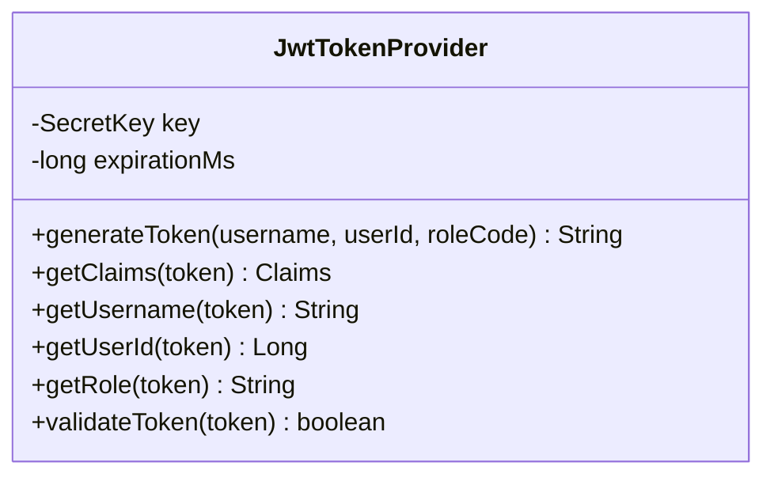
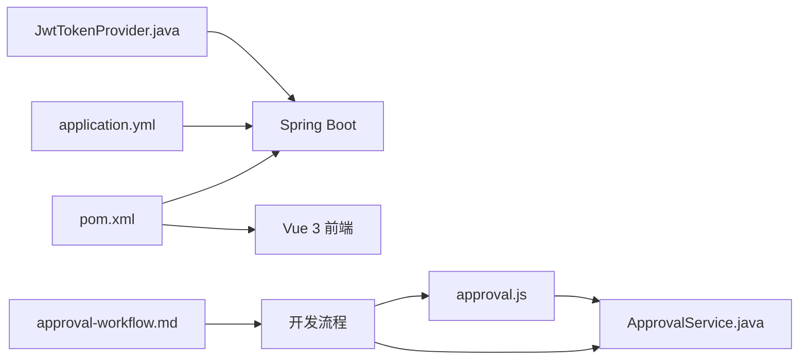

# 敏捷开发实践

<cite>
**本文引用的文件**
- [SuperPowerApplication.java](file://src/main/java/com/superpower/SuperPowerApplication.java)
- [ApprovalService.java](file://src/main/java/com/superpower/modules/approval/service/ApprovalService.java)
- [DataListTab.vue](file://frontend/src/components/DataListTab.vue)
- [DataWorkbench.vue](file://frontend/src/views/dashboard/DataWorkbench.vue)
- [approval.js](file://frontend/src/api/approval.js)
- [2026-05-28-approval-workflow.md](file://docs/superpowers/plans/2026-05-28-approval-workflow.md)
- [2026-05-25-tianyi-data-tool-phase1.md](file://docs/superpowers/plans/2026-05-25-tianyi-data-tool-phase1.md)
- [application.yml](file://src/main/resources/application.yml)
- [V1.0.9_fix_l3_images_move.sh](file://db_changes/V1.0.9_fix_l3_images_move.sh)
- [pom.xml](file://pom.xml)
</cite>

## 目录
1. [引言](#引言)
2. [项目结构](#项目结构)
3. [核心组件](#核心组件)
4. [架构总览](#架构总览)
5. [详细组件分析](#详细组件分析)
6. [依赖关系分析](#依赖关系分析)
7. [性能考虑](#性能考虑)
8. [故障排除指南](#故障排除指南)
9. [结论](#结论)
10. [附录](#附录)

## 引言
本文件面向产品清单管理系统（Product List Management System）的敏捷开发实践，围绕Scrum框架的五大仪式（产品待办列表、迭代计划、每日站会、迭代评审、迭代回顾）、用户故事与验收标准、迭代周期与容量规划、任务看板与进度跟踪、以及Jira/Trello等工具的配置与使用进行系统化梳理。同时结合仓库中的实际代码与文档，给出可落地的流程与最佳实践，帮助团队提升协作效率与交付质量。

## 项目结构
该系统采用前后端分离架构：后端为Spring Boot应用，前端为Vue 3 + Element Plus应用，配合统一的审批流与数据工作台。项目中包含多份“计划”文档，体现了敏捷规划与迭代推进的痕迹；同时存在数据库迁移脚本与配置文件，支撑系统演进与部署。

**图表来源**
- [SuperPowerApplication.java](file://src/main/java/com/superpower/SuperPowerApplication.java)
- [ApprovalService.java](file://src/main/java/com/superpower/modules/approval/service/ApprovalService.java)
- [DataWorkbench.vue](file://frontend/src/views/dashboard/DataWorkbench.vue)
- [DataListTab.vue](file://frontend/src/components/DataListTab.vue)
- [approval.js](file://frontend/src/api/approval.js)
- [application.yml](file://src/main/resources/application.yml)
- [2026-05-28-approval-workflow.md](file://docs/superpowers/plans/2026-05-28-approval-workflow.md)

**章节来源**
- [SuperPowerApplication.java](file://src/main/java/com/superpower/SuperPowerApplication.java)
- [application.yml](file://src/main/resources/application.yml)
- [2026-05-28-approval-workflow.md](file://docs/superpowers/plans/2026-05-28-approval-workflow.md)

## 核心组件
- 审批服务（ApprovalService）：负责审批动作的状态流转与权限校验，体现“提交/通过/驳回/撤销”的状态机与角色映射。
- 前端审批API（approval.js）：封装后端审批接口，供组件调用。
- 数据工作台（DataWorkbench.vue）：聚合审批状态标签、预览与日志查看，承载看板与进度展示。
- 数据列表组件（DataListTab.vue）：承载批量操作、上下文菜单、版本选择等，是迭代交付的主要载体。
- 计划文档（approval-workflow.md）：记录审批流程的迭代计划、任务拆分与实现步骤，体现Scrum的透明性与持续改进。

**章节来源**
- [ApprovalService.java:38-68](file://src/main/java/com/superpower/modules/approval/service/ApprovalService.java#L38-L68)
- [approval.js](file://frontend/src/api/approval.js)
- [DataWorkbench.vue:544-563](file://frontend/src/views/dashboard/DataWorkbench.vue#L544-L563)
- [DataListTab.vue:633-680](file://frontend/src/components/DataListTab.vue#L633-L680)
- [2026-05-28-approval-workflow.md:287-345](file://docs/superpowers/plans/2026-05-28-approval-workflow.md#L287-L345)

## 架构总览
系统采用前后端分离的微服务风格（单体后端），通过REST API交互。前端通过API封装调用后端服务，后端服务通过配置文件管理运行参数与安全策略。审批流程贯穿前后端，形成闭环的看板与进度跟踪。

**图表来源**
- [DataWorkbench.vue:544-563](file://frontend/src/views/dashboard/DataWorkbench.vue#L544-L563)
- [DataListTab.vue:633-680](file://frontend/src/components/DataListTab.vue#L633-L680)
- [approval.js](file://frontend/src/api/approval.js)
- [ApprovalService.java:62-68](file://src/main/java/com/superpower/modules/approval/service/ApprovalService.java#L62-L68)

## 详细组件分析

### 组件A：审批服务（ApprovalService）
- 角色与动作映射：定义了不同角色对审批动作的权限集合，确保操作合规。
- 状态机：提交、审核、通过、驳回、撤销对应不同的状态常量，保证流程一致性。
- 事务控制：审批过程使用事务，保障数据一致性。

**图表来源**
- [ApprovalService.java:54-60](file://src/main/java/com/superpower/modules/approval/service/ApprovalService.java#L54-L60)

**章节来源**
- [ApprovalService.java:38-68](file://src/main/java/com/superpower/modules/approval/service/ApprovalService.java#L38-L68)

### 组件B：前端审批API与工作台
- API封装：提供审批与日志查询接口，简化组件调用。
- 工作台集成：状态标签、预览弹窗、日志查看，构成看板的核心元素。
- 角色传递：从认证状态获取当前用户角色，动态控制按钮与权限。

**图表来源**
- [approval.js](file://frontend/src/api/approval.js)
- [DataListTab.vue:633-680](file://frontend/src/components/DataListTab.vue#L633-L680)
- [DataWorkbench.vue:544-563](file://frontend/src/views/dashboard/DataWorkbench.vue#L544-L563)
- [ApprovalService.java:62-68](file://src/main/java/com/superpower/modules/approval/service/ApprovalService.java#L62-L68)

**章节来源**
- [approval.js](file://frontend/src/api/approval.js)
- [DataWorkbench.vue:544-563](file://frontend/src/views/dashboard/DataWorkbench.vue#L544-L563)
- [DataListTab.vue:633-680](file://frontend/src/components/DataListTab.vue#L633-L680)

### 组件C：迭代计划与任务分解（以审批流程为例）
- 迭代目标：实现审批流程的前后端联调与权限控制。
- 任务拆分：前端API封装、组件接入、后端服务实现、编译验证与提交。
- 可视化跟踪：计划文档作为任务看板，记录每个任务的完成状态与文件变更。

**图表来源**
- [2026-05-28-approval-workflow.md:287-345](file://docs/superpowers/plans/2026-05-28-approval-workflow.md#L287-L345)
- [approval.js](file://frontend/src/api/approval.js)
- [DataListTab.vue:633-680](file://frontend/src/components/DataListTab.vue#L633-L680)
- [ApprovalService.java:38-68](file://src/main/java/com/superpower/modules/approval/service/ApprovalService.java#L38-L68)

**章节来源**
- [2026-05-28-approval-workflow.md:287-345](file://docs/superpowers/plans/2026-05-28-approval-workflow.md#L287-L345)

### 组件D：配置与安全（JWT）
- JWT配置：密钥生成、令牌签发与校验、角色与用户信息解析。
- 安全边界：在应用启动与请求拦截中应用，确保审批等敏感操作的安全性。

**图表来源**
- [2026-05-25-tianyi-data-tool-phase1.md:585-651](file://docs/superpowers/plans/2026-05-25-tianyi-data-tool-phase1.md#L585-L651)

**章节来源**
- [2026-05-25-tianyi-data-tool-phase1.md:585-651](file://docs/superpowers/plans/2026-05-25-tianyi-data-tool-phase1.md#L585-L651)

## 依赖关系分析
- 后端依赖：Spring Boot、数据库访问层、安全模块（JWT）。
- 前端依赖：Vue生态、Element Plus、请求封装（axios封装）。
- 配置依赖：application.yml提供运行参数，影响审批服务与安全策略。
- 文档依赖：计划文档驱动迭代节奏，形成“计划—执行—检查—改进”的闭环。

**图表来源**
- [pom.xml](file://pom.xml)
- [application.yml](file://src/main/resources/application.yml)
- [2026-05-25-tianyi-data-tool-phase1.md:585-651](file://docs/superpowers/plans/2026-05-25-tianyi-data-tool-phase1.md#L585-L651)
- [2026-05-28-approval-workflow.md:287-345](file://docs/superpowers/plans/2026-05-28-approval-workflow.md#L287-L345)
- [approval.js](file://frontend/src/api/approval.js)
- [ApprovalService.java:54-60](file://src/main/java/com/superpower/modules/approval/service/ApprovalService.java#L54-L60)

**章节来源**
- [pom.xml](file://pom.xml)
- [application.yml](file://src/main/resources/application.yml)
- [2026-05-25-tianyi-data-tool-phase1.md:585-651](file://docs/superpowers/plans/2026-05-25-tianyi-data-tool-phase1.md#L585-L651)
- [2026-05-28-approval-workflow.md:287-345](file://docs/superpowers/plans/2026-05-28-approval-workflow.md#L287-L345)

## 性能考虑
- 审批状态机与权限校验：通过集中式服务实现，避免重复逻辑，降低耦合。
- 前端看板刷新：按需刷新状态标签与日志，减少不必要的重渲染。
- 配置化参数：通过配置文件管理JWT过期时间与密钥，便于在不同环境优化性能与安全平衡。
- 数据迁移脚本：数据库迁移脚本采用幂等与跳过策略，减少重复操作带来的开销。

**章节来源**
- [V1.0.9_fix_l3_images_move.sh](file://db_changes/V1.0.9_fix_l3_images_move.sh)

## 故障排除指南
- 审批失败或无权限：检查角色映射与动作权限，确认用户角色是否正确传递至前端与后端。
- 审批状态未更新：确认前端API调用成功与后端事务提交，查看审批日志。
- JWT校验失败：核对密钥与过期时间配置，确保前后端一致。
- 编译错误：根据计划文档中的编译步骤逐一排查，确保依赖与构建配置正确。

**章节来源**
- [ApprovalService.java:62-68](file://src/main/java/com/superpower/modules/approval/service/ApprovalService.java#L62-L68)
- [DataWorkbench.vue:544-563](file://frontend/src/views/dashboard/DataWorkbench.vue#L544-L563)
- [2026-05-25-tianyi-data-tool-phase1.md:585-651](file://docs/superpowers/plans/2026-05-25-tianyi-data-tool-phase1.md#L585-L651)
- [2026-05-28-approval-workflow.md:287-345](file://docs/superpowers/plans/2026-05-28-approval-workflow.md#L287-L345)

## 结论
本项目通过“计划文档+前后端组件+服务层”的协同，实现了审批流程的敏捷交付。建议在后续迭代中：
- 将计划文档与Jira/Trello关联，形成统一的任务看板；
- 明确用户故事与验收标准，细化到可测试的场景；
- 设定固定迭代周期与容量规划方法，持续评估速度；
- 强化每日站会与回顾会议，固化流程改进机制。

## 附录

### Scrum框架与实践要点
- 产品待办列表：以计划文档与需求卡片形式沉淀，明确优先级与验收标准。
- 迭代计划：依据计划文档拆解任务，分配给开发成员，明确里程碑。
- 每日站会：聚焦阻塞问题与次日计划，保持信息同步。
- 迭代评审：演示可工作的审批流程与看板效果，收集反馈。
- 迭代回顾：总结流程与工具使用，提出改进措施。

### 用户故事编写规范与验收标准
- 规范模板：以“作为[角色]，我想要[目标]，以便[价值]”的形式描述。
- 验收标准：可测试、可验证的行为描述，如“审批按钮可见且可点击”、“审批后状态变为通过”。

### 迭代周期与容量规划
- 周期设定：建议2周为一个迭代，便于快速反馈与调整。
- 容量规划：基于历史速度估算每轮可完成的故事点数，预留缓冲应对风险。

### 任务看板与进度跟踪
- 看板要素：待办、进行中、审查、完成；状态标签与日志可视化。
- 工具集成：Jira/Trello中创建迭代计划、任务卡片与史诗，链接到计划文档与代码提交。

### 敏捷工具使用指南（Jira/Trello）
- Jira：创建项目与版本，建立史诗与故事，设置状态与字段，连接分支与提交。
- Trello：使用看板卡片承载任务，标注标签与截止日期，利用评论记录讨论与决策。