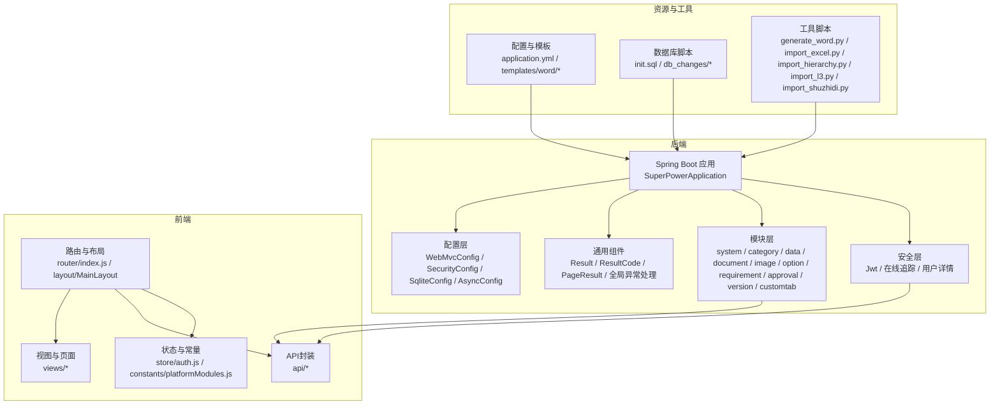
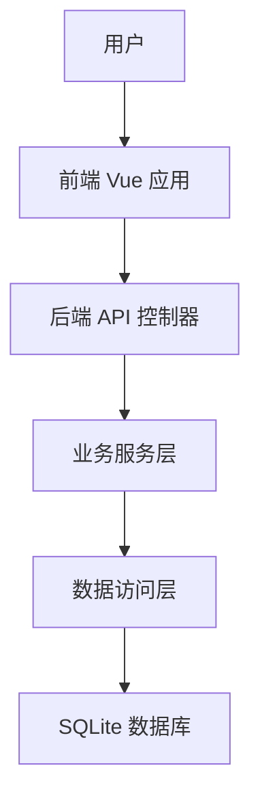
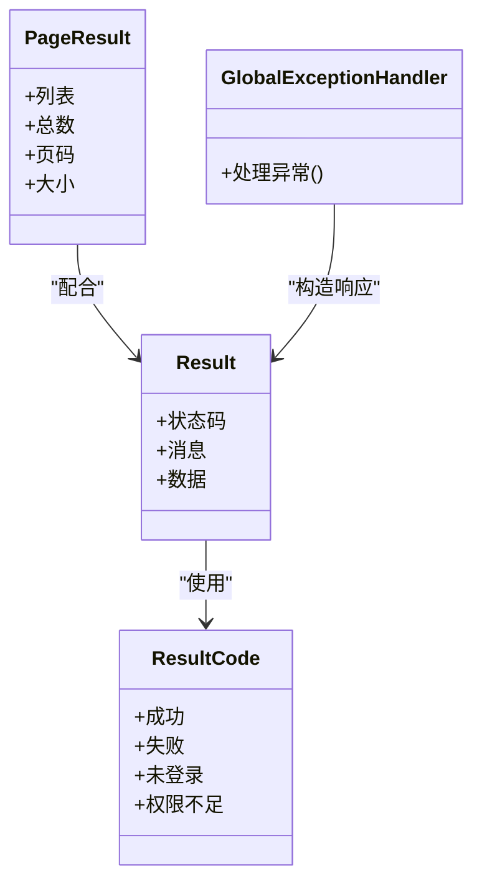
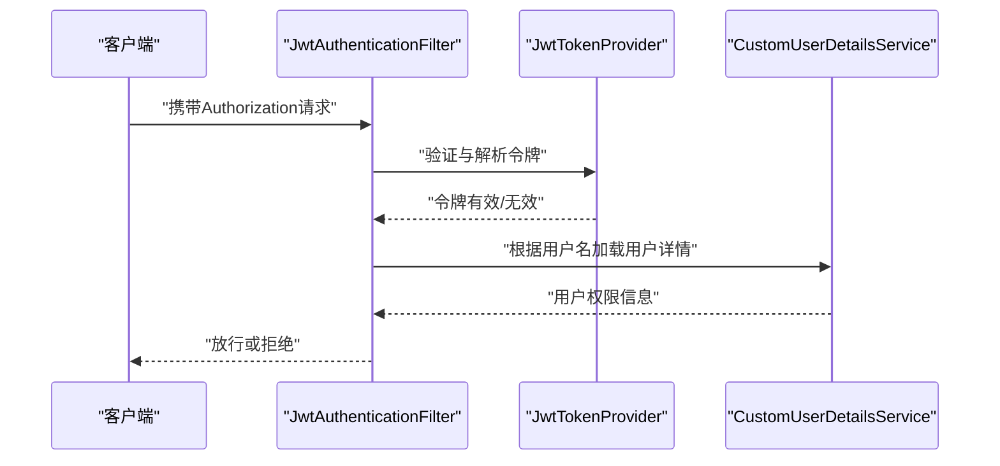
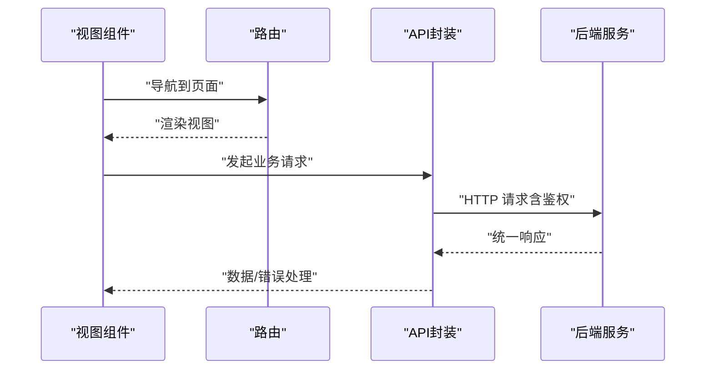
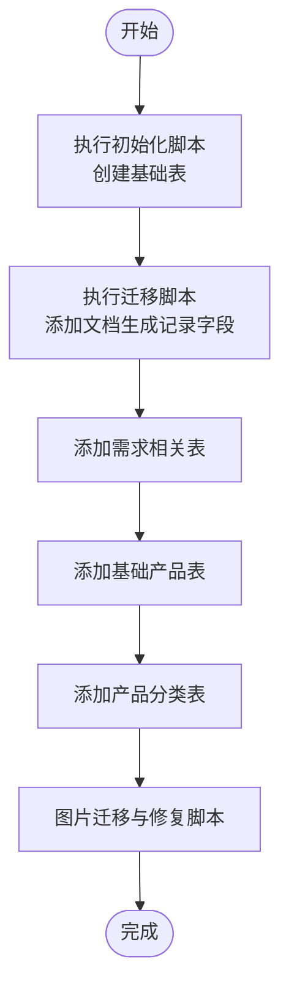
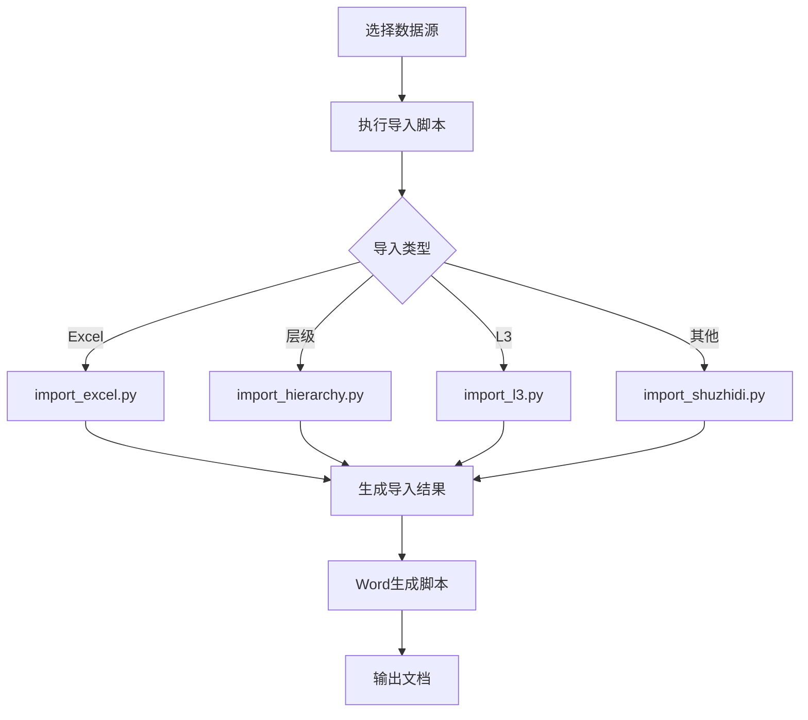
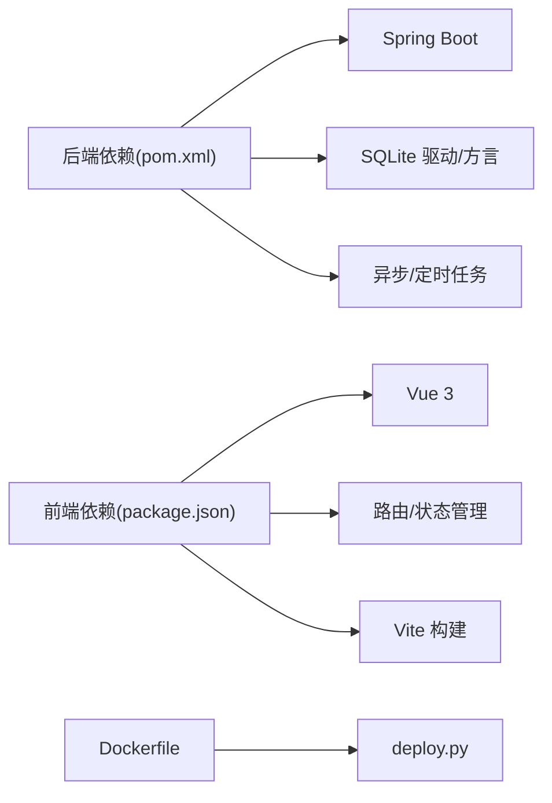

# 文档编写与知识管理

<cite>
**本文引用的文件**
- [SuperPowerApplication.java](file://src/main/java/com/superpower/SuperPowerApplication.java)
- [application.yml](file://src/main/resources/application.yml)
- [init.sql](file://src/main/resources/db/init.sql)
- [AuthUtils.java](file://src/main/java/com/superpower/common/AuthUtils.java)
- [GlobalExceptionHandler.java](file://src/main/java/com/superpower/common/GlobalExceptionHandler.java)
- [PageResult.java](file://src/main/java/com/superpower/common/PageResult.java)
- [Result.java](file://src/main/java/com/superpower/common/Result.java)
- [ResultCode.java](file://src/main/java/com/superpower/common/ResultCode.java)
- [SecurityConfig.java](file://src/main/java/com/superpower/config/SecurityConfig.java)
- [WebMvcConfig.java](file://src/main/java/com/superpower/config/WebMvcConfig.java)
- [SqliteConfig.java](file://src/main/java/com/superpower/config/SqliteConfig.java)
- [SqliteDialect.java](file://src/main/java/com/superpower/config/SqliteDialect.java)
- [AsyncConfig.java](file://src/main/java/com/superpower/config/AsyncConfig.java)
- [JwtAuthenticationFilter.java](file://src/main/java/com/superpower/security/JwtAuthenticationFilter.java)
- [JwtTokenProvider.java](file://src/main/java/com/superpower/security/JwtTokenProvider.java)
- [CustomUserDetailsService.java](file://src/main/java/com/superpower/security/CustomUserDetailsService.java)
- [OnlineTracker.java](file://src/main/java/com/superpower/security/OnlineTracker.java)
- [AuthController.java](file://src/main/java/com/superpower/modules/system/controller/AuthController.java)
- [SysUserController.java](file://src/main/java/com/superpower/modules/system/controller/SysUserController.java)
- [SysRoleController.java](file://src/main/java/com/superpower/modules/system/controller/SysRoleController.java)
- [OperationLogController.java](file://src/main/java/com/superpower/modules/system/controller/OperationLogController.java)
- [MaintenanceController.java](file://src/main/java/com/superpower/modules/system/controller/MaintenanceController.java)
- [CategoryController.java](file://src/main/java/com/superpower/modules/category/controller/CategoryController.java)
- [ProductController.java](file://src/main/java/com/superpower/modules/category/controller/ProductController.java)
- [DataEntryController.java](file://src/main/java/com/superpower/modules/data/controller/DataEntryController.java)
- [DocumentController.java](file://src/main/java/com/superpower/modules/document/controller/DocumentController.java)
- [ImageResourceController.java](file://src/main/java/com/superpower/modules/image/controller/ImageResourceController.java)
- [DataOptionController.java](file://src/main/java/com/superpower/modules/option/controller/DataOptionController.java)
- [RequirementController.java](file://src/main/java/com/superpower/modules/requirement/controller/RequirementController.java)
- [ApprovalController.java](file://src/main/java/com/superpower/modules/approval/controller/ApprovalController.java)
- [AppVersionController.java](file://src/main/java/com/superpower/modules/version/controller/AppVersionController.java)
- [DataVersionController.java](file://src/main/java/com/superpower/modules/version/controller/DataVersionController.java)
- [BaseCategory.java](file://src/main/java/com/superpower/modules/category/entity/BaseCategory.java)
- [BaseDomain.java](file://src/main/java/com/superpower/modules/category/entity/BaseDomain.java)
- [BaseProduct.java](file://src/main/java/com/superpower/modules/category/entity/BaseProduct.java)
- [BaseProductL1.java](file://src/main/java/com/superpower/modules/category/entity/BaseProductL1.java)
- [BaseProductL2.java](file://src/main/java/com/superpower/modules/category/entity/BaseProductL2.java)
- [ReqItem.java](file://src/main/java/com/superpower/modules/requirement/entity/ReqItem.java)
- [ReqLog.java](file://src/main/java/com/superpower/modules/requirement/entity/ReqLog.java)
- [DocGenRecord.java](file://src/main/java/com/superpower/modules/document/entity/DocGenRecord.java)
- [ImageResource.java](file://src/main/java/com/superpower/modules/image/entity/ImageResource.java)
- [DataEntry.java](file://src/main/java/com/superpower/modules/data/entity/DataEntry.java)
- [DataOption.java](file://src/main/java/com/superpower/modules/option/entity/DataOption.java)
- [SysUser.java](file://src/main/java/com/superpower/modules/system/entity/SysUser.java)
- [SysRole.java](file://src/main/java/com/superpower/modules/system/entity/SysRole.java)
- [SysMenu.java](file://src/main/java/com/superpower/modules/system/entity/SysMenu.java)
- [OperationLog.java](file://src/main/java/com/superpower/modules/system/entity/OperationLog.java)
- [DataVersion.java](file://src/main/java/com/superpower/modules/version/entity/DataVersion.java)
- [CustomTab.java](file://src/main/java/com/superpower/modules/customtab/entity/CustomTab.java)
- [CustomTabEntry.java](file://src/main/java/com/superpower/modules/customtab/entity/CustomTabEntry.java)
- [CustomTabEntryId.java](file://src/main/java/com/superpower/modules/customtab/entity/CustomTabEntryId.java)
- [ApprovalLog.java](file://src/main/java/com/superpower/modules/approval/entity/ApprovalLog.java)
- [request.js](file://frontend/src/utils/request.js)
- [login.js](file://frontend/src/api/auth.js)
- [category.js](file://frontend/src/api/category.js)
- [product.js](file://frontend/src/api/product.js)
- [data.js](file://frontend/src/api/data.js)
- [document.js](file://frontend/src/api/document.js)
- [image.js](file://frontend/src/api/image.js)
- [requirement.js](file://frontend/src/api/requirement.js)
- [version.js](file://frontend/src/api/version.js)
- [customTab.js](file://frontend/src/api/customTab.js)
- [operationLog.js](file://frontend/src/api/operationLog.js)
- [maintenance.js](file://frontend/src/api/maintenance.js)
- [option.js](file://frontend/src/api/option.js)
- [approval.js](file://frontend/src/api/approval.js)
- [user.js](file://frontend/src/api/user.js)
- [role.js](file://frontend/src/api/role.js)
- [MainLayout.vue](file://frontend/src/layout/MainLayout.vue)
- [DataWorkbench.vue](file://frontend/src/views/dashboard/DataWorkbench.vue)
- [LoginView.vue](file://frontend/src/views/login/LoginView.vue)
- [ProductCategoryManage.vue](file://frontend/src/views/system/ProductCategoryManage.vue)
- [BaseDataManage.vue](file://frontend/src/views/system/BaseDataManage.vue)
- [ImageGallery.vue](file://frontend/src/views/system/ImageGallery.vue)
- [OptionManage.vue](file://frontend/src/views/system/OptionManage.vue)
- [RoleManage.vue](file://frontend/src/views/system/RoleManage.vue)
- [UserManage.vue](file://frontend/src/views/system/UserManage.vue)
- [VersionManage.vue](file://frontend/src/views/system/VersionManage.vue)
- [RequirementManage.vue](file://frontend/src/views/requirement/RequirementManage.vue)
- [RequirementImages.vue](file://frontend/src/views/requirement/RequirementImages.vue)
- [index.js](file://frontend/src/router/index.js)
- [auth.js](file://frontend/src/store/auth.js)
- [platformModules.js](file://frontend/src/constants/platformModules.js)
- [package.json](file://frontend/package.json)
- [pom.xml](file://pom.xml)
- [Dockerfile](file://Dockerfile)
- [deploy.py](file://deploy.py)
- [generate_word.py](file://generate_word.py)
- [import_excel.py](file://import_excel.py)
- [import_hierarchy.py](file://import_hierarchy.py)
- [import_l3.py](file://import_l3.py)
- [import_shuzhidi.py](file://import_shuzhidi.py)
- [20260531_add_doc_gen_record_doc_name.sql](file://db_changes/20260531_add_doc_gen_record_doc_name.sql)
- [20260531_add_requirement_tables.sql](file://db_changes/20260531_add_requirement_tables.sql)
- [20260602_add_base_product_table.sql](file://db_changes/20260602_add_base_product_table.sql)
- [20260602_add_product_category_tables.sql](file://db_changes/20260602_add_product_category_tables.sql)
- [V1.0.10_fix_truncated_pngs.sh](file://db_changes/V1.0.10_fix_truncated_pngs.sh)
- [V1.0.10_fix_l3_images_move.sh](file://db_changes/V1.0.10_fix_l3_images_move.sh)
- [2026-05-26-custom-list-tab-design.md](file://docs/superpowers/specs/2026-05-26-custom-list-tab-design.md)
- [2026-05-28-approval-workflow-design.md](file://docs/superpowers/specs/2026-05-28-approval-workflow-design.md)
- [2026-06-22-intelligent-tag-design.md](file://docs/superpowers/specs/2026-06-22-intelligent-tag-design.md)
- [2026-05-25-tianyi-data-tool-phase1.md](file://docs/superpowers/plans/2026-05-25-tianyi-data-tool-phase1.md)
- [2026-05-26-custom-list-tab-plan.md](file://docs/superpowers/plans/2026-05-26-custom-list-tab-plan.md)
- [2026-05-28-approval-workflow.md](file://docs/superpowers/plans/2026-05-28-approval-workflow.md)
- [2026-06-09-batch-version-division-plan.md](file://docs/superpowers/plans/2026-06-09-batch-version-division-plan.md)
- [2026-06-11-fix-image-rename-reference-sync.md](file://docs/superpowers/plans/2026-06-11-fix-image-rename-reference-sync.md)
- [2026-06-11-custom-tab-doc-gen-stuck-fix.md](file://docs/superpowers/plans/2026-06-11-custom-tab-doc-gen-stuck-fix.md)
- [2026-06-11-drag-drop-context-menu-bugfixes.md](file://docs/superpowers/plans/2026-06-11-drag-drop-context-menu-bugfixes.md)
- [2026-06-22-intelligent-tag-implementation.md](file://docs/superpowers/plans/2026-06-22-intelligent-tag-implementation.md)
</cite>

## 目录
1. [简介](#简介)
2. [项目结构](#项目结构)
3. [核心组件](#核心组件)
4. [架构总览](#架构总览)
5. [详细组件分析](#详细组件分析)
6. [依赖分析](#依赖分析)
7. [性能考虑](#性能考虑)
8. [故障排查指南](#故障排查指南)
9. [结论](#结论)
10. [附录](#附录)

## 简介
本文件旨在为产品清单管理系统建立一套完整的“文档编写与知识管理”标准与体系，覆盖架构文档、API文档、用户手册与开发指南的模板与格式要求；明确版本控制与同步机制；制定知识分享与传承流程（技术分享会、文档评审、经验总结）；建立质量评估与维护责任分工；完善检索与索引系统；提供工具使用指南；并营造积极的知识管理文化。

该系统采用前后端分离架构：后端基于Spring Boot，提供REST API与业务服务；前端基于Vue 3 + Vite；数据库包含SQLite初始化脚本与多版本迁移脚本；同时提供Word文档生成、Excel导入、层级数据导入等工具脚本。

## 项目结构
项目由以下主要部分组成：
- 后端源码：位于 src/main/java/com/superpower，按模块划分（system、category、data、document、image、option、requirement、approval、version、customtab），并包含通用组件（common）、配置（config）、安全（security）。
- 前端源码：位于 frontend/src，包含API封装、组件、视图、路由、状态管理、常量与样式。
- 资源与配置：application.yml、数据库初始化脚本、模板文件。
- 数据库变更：db_changes目录下的SQL与Shell脚本，记录版本演进与修复。
- 文档与计划：docs/superpowers目录下的specs（设计文档）与plans（实施计划）。
- 工具脚本：Python脚本用于Word生成、Excel导入、层级数据导入等。

图表来源
- [SuperPowerApplication.java](file://src/main/java/com/superpower/SuperPowerApplication.java)
- [WebMvcConfig.java](file://src/main/java/com/superpower/config/WebMvcConfig.java)
- [SecurityConfig.java](file://src/main/java/com/superpower/config/SecurityConfig.java)
- [SqliteConfig.java](file://src/main/java/com/superpower/config/SqliteConfig.java)
- [AsyncConfig.java](file://src/main/java/com/superpower/config/AsyncConfig.java)
- [Result.java](file://src/main/java/com/superpower/common/Result.java)
- [ResultCode.java](file://src/main/java/com/superpower/common/ResultCode.java)
- [PageResult.java](file://src/main/java/com/superpower/common/PageResult.java)
- [GlobalExceptionHandler.java](file://src/main/java/com/superpower/common/GlobalExceptionHandler.java)
- [index.js](file://frontend/src/router/index.js)
- [MainLayout.vue](file://frontend/src/layout/MainLayout.vue)
- [auth.js](file://frontend/src/store/auth.js)
- [platformModules.js](file://frontend/src/constants/platformModules.js)
- [application.yml](file://src/main/resources/application.yml)
- [init.sql](file://src/main/resources/db/init.sql)
- [generate_word.py](file://generate_word.py)
- [import_excel.py](file://import_excel.py)
- [import_hierarchy.py](file://import_hierarchy.py)
- [import_l3.py](file://import_l3.py)
- [import_shuzhidi.py](file://import_shuzhidi.py)

章节来源
- [pom.xml](file://pom.xml)
- [Dockerfile](file://Dockerfile)
- [package.json](file://frontend/package.json)

## 核心组件
- 应用入口与配置
  - 应用启动类负责装配模块与加载配置。
  - Web与安全配置定义跨域、静态资源、拦截器、认证授权策略。
  - 数据库配置支持SQLite方言与异步任务。
- 通用组件
  - 统一响应包装、状态码、分页结果与全局异常处理，保证API一致性与可维护性。
- 安全模块
  - JWT认证过滤器、令牌提供器、用户详情服务与在线追踪，保障接口安全与审计。
- 模块化服务
  - system：用户、角色、菜单、操作日志、维护与版本管理。
  - category：分类与产品实体及控制器。
  - data：数据条目、导入导出与重编号。
  - document：文档生成与记录。
  - image：图片资源与迁移。
  - option：数据选项。
  - requirement：需求项与日志。
  - approval：审批日志。
  - version：应用与数据版本。
  - customtab：自定义标签。
- 前端集成
  - API封装统一调用后端接口，视图组件承载业务页面，路由与状态管理支撑交互。
- 工具链
  - Python脚本实现Word生成、Excel导入、层级数据与L3数据导入等离线处理能力。

章节来源
- [SuperPowerApplication.java](file://src/main/java/com/superpower/SuperPowerApplication.java)
- [WebMvcConfig.java](file://src/main/java/com/superpower/config/WebMvcConfig.java)
- [SecurityConfig.java](file://src/main/java/com/superpower/config/SecurityConfig.java)
- [SqliteConfig.java](file://src/main/java/com/superpower/config/SqliteConfig.java)
- [AsyncConfig.java](file://src/main/java/com/superpower/config/AsyncConfig.java)
- [Result.java](file://src/main/java/com/superpower/common/Result.java)
- [ResultCode.java](file://src/main/java/com/superpower/common/ResultCode.java)
- [PageResult.java](file://src/main/java/com/superpower/common/PageResult.java)
- [GlobalExceptionHandler.java](file://src/main/java/com/superpower/common/GlobalExceptionHandler.java)
- [JwtAuthenticationFilter.java](file://src/main/java/com/superpower/security/JwtAuthenticationFilter.java)
- [JwtTokenProvider.java](file://src/main/java/com/superpower/security/JwtTokenProvider.java)
- [CustomUserDetailsService.java](file://src/main/java/com/superpower/security/CustomUserDetailsService.java)
- [OnlineTracker.java](file://src/main/java/com/superpower/security/OnlineTracker.java)
- [request.js](file://frontend/src/utils/request.js)
- [index.js](file://frontend/src/router/index.js)
- [MainLayout.vue](file://frontend/src/layout/MainLayout.vue)

## 架构总览
系统采用分层架构：表现层（前端Vue）、接入层（后端Spring MVC）、服务层（业务逻辑）、持久层（SQLite）。安全通过JWT与拦截器实现，统一响应与异常处理贯穿各层。

图表来源
- [SuperPowerApplication.java](file://src/main/java/com/superpower/SuperPowerApplication.java)
- [request.js](file://frontend/src/utils/request.js)
- [index.js](file://frontend/src/router/index.js)

## 详细组件分析

### 统一响应与异常处理
- 统一响应包装与状态码标准化，便于前端解析与错误提示。
- 全局异常处理器集中处理业务异常与未知异常，返回一致的错误结构。

图表来源
- [Result.java](file://src/main/java/com/superpower/common/Result.java)
- [ResultCode.java](file://src/main/java/com/superpower/common/ResultCode.java)
- [PageResult.java](file://src/main/java/com/superpower/common/PageResult.java)
- [GlobalExceptionHandler.java](file://src/main/java/com/superpower/common/GlobalExceptionHandler.java)

章节来源
- [Result.java](file://src/main/java/com/superpower/common/Result.java)
- [ResultCode.java](file://src/main/java/com/superpower/common/ResultCode.java)
- [PageResult.java](file://src/main/java/com/superpower/common/PageResult.java)
- [GlobalExceptionHandler.java](file://src/main/java/com/superpower/common/GlobalExceptionHandler.java)

### 安全与认证
- 基于JWT的无状态认证：过滤器校验令牌，用户详情服务加载权限，令牌提供器签发与验证。
- 在线追踪记录用户在线状态与操作轨迹，便于审计与风控。

图表来源
- [JwtAuthenticationFilter.java](file://src/main/java/com/superpower/security/JwtAuthenticationFilter.java)
- [JwtTokenProvider.java](file://src/main/java/com/superpower/security/JwtTokenProvider.java)
- [CustomUserDetailsService.java](file://src/main/java/com/superpower/security/CustomUserDetailsService.java)

章节来源
- [JwtAuthenticationFilter.java](file://src/main/java/com/superpower/security/JwtAuthenticationFilter.java)
- [JwtTokenProvider.java](file://src/main/java/com/superpower/security/JwtTokenProvider.java)
- [CustomUserDetailsService.java](file://src/main/java/com/superpower/security/CustomUserDetailsService.java)
- [OnlineTracker.java](file://src/main/java/com/superpower/security/OnlineTracker.java)

### 模块化控制器与实体
- 控制器按功能域划分，统一返回结构，职责清晰。
- 实体模型覆盖系统核心对象：用户、角色、菜单、操作日志、产品分类与产品、需求项与日志、文档生成记录、图片资源、数据条目、数据选项、版本、自定义标签与条目、审批日志。

```mermaid
classDiagram
class SysUserController
class SysRoleController
class CategoryController
class ProductController
class DataEntryController
class DocumentController
class ImageResourceController
class DataOptionController
class RequirementController
class ApprovalController
class AppVersionController
class DataVersionController
class SysUser
class SysRole
class SysMenu
class OperationLog
class BaseCategory
class BaseProduct
class BaseProductL1
class BaseProductL2
class BaseDomain
class ReqItem
class ReqLog
class DocGenRecord
class ImageResource
class DataEntry
class DataOption
class DataVersion
class CustomTab
class CustomTabEntry
class CustomTabEntryId
class ApprovalLog
SysUserController --> SysUser : "CRUD"
SysRoleController --> SysRole : "CRUD"
CategoryController --> BaseCategory : "CRUD"
ProductController --> BaseProduct : "CRUD"
DataEntryController --> DataEntry : "CRUD"
DocumentController --> DocGenRecord : "CRUD"
ImageResourceController --> ImageResource : "CRUD"
DataOptionController --> DataOption : "CRUD"
RequirementController --> ReqItem : "CRUD"
RequirementController --> ReqLog : "CRUD"
AppVersionController --> DataVersion : "版本管理"
DataVersionController --> DataVersion : "版本管理"
ApprovalController --> ApprovalLog : "审批日志"
CustomTabController --> CustomTab : "自定义标签"
CustomTabController --> CustomTabEntry : "条目"
```

图表来源
- [SysUserController.java](file://src/main/java/com/superpower/modules/system/controller/SysUserController.java)
- [SysRoleController.java](file://src/main/java/com/superpower/modules/system/controller/SysRoleController.java)
- [CategoryController.java](file://src/main/java/com/superpower/modules/category/controller/CategoryController.java)
- [ProductController.java](file://src/main/java/com/superpower/modules/category/controller/ProductController.java)
- [DataEntryController.java](file://src/main/java/com/superpower/modules/data/controller/DataEntryController.java)
- [DocumentController.java](file://src/main/java/com/superpower/modules/document/controller/DocumentController.java)
- [ImageResourceController.java](file://src/main/java/com/superpower/modules/image/controller/ImageResourceController.java)
- [DataOptionController.java](file://src/main/java/com/superpower/modules/option/controller/DataOptionController.java)
- [RequirementController.java](file://src/main/java/com/superpower/modules/requirement/controller/RequirementController.java)
- [ApprovalController.java](file://src/main/java/com/superpower/modules/approval/controller/ApprovalController.java)
- [AppVersionController.java](file://src/main/java/com/superpower/modules/version/controller/AppVersionController.java)
- [DataVersionController.java](file://src/main/java/com/superpower/modules/version/controller/DataVersionController.java)
- [SysUser.java](file://src/main/java/com/superpower/modules/system/entity/SysUser.java)
- [SysRole.java](file://src/main/java/com/superpower/modules/system/entity/SysRole.java)
- [SysMenu.java](file://src/main/java/com/superpower/modules/system/entity/SysMenu.java)
- [OperationLog.java](file://src/main/java/com/superpower/modules/system/entity/OperationLog.java)
- [BaseCategory.java](file://src/main/java/com/superpower/modules/category/entity/BaseCategory.java)
- [BaseProduct.java](file://src/main/java/com/superpower/modules/category/entity/BaseProduct.java)
- [BaseProductL1.java](file://src/main/java/com/superpower/modules/category/entity/BaseProductL1.java)
- [BaseProductL2.java](file://src/main/java/com/superpower/modules/category/entity/BaseProductL2.java)
- [BaseDomain.java](file://src/main/java/com/superpower/modules/category/entity/BaseDomain.java)
- [ReqItem.java](file://src/main/java/com/superpower/modules/requirement/entity/ReqItem.java)
- [ReqLog.java](file://src/main/java/com/superpower/modules/requirement/entity/ReqLog.java)
- [DocGenRecord.java](file://src/main/java/com/superpower/modules/document/entity/DocGenRecord.java)
- [ImageResource.java](file://src/main/java/com/superpower/modules/image/entity/ImageResource.java)
- [DataEntry.java](file://src/main/java/com/superpower/modules/data/entity/DataEntry.java)
- [DataOption.java](file://src/main/java/com/superpower/modules/option/entity/DataOption.java)
- [DataVersion.java](file://src/main/java/com/superpower/modules/version/entity/DataVersion.java)
- [CustomTab.java](file://src/main/java/com/superpower/modules/customtab/entity/CustomTab.java)
- [CustomTabEntry.java](file://src/main/java/com/superpower/modules/customtab/entity/CustomTabEntry.java)
- [CustomTabEntryId.java](file://src/main/java/com/superpower/modules/customtab/entity/CustomTabEntryId.java)
- [ApprovalLog.java](file://src/main/java/com/superpower/modules/approval/entity/ApprovalLog.java)

章节来源
- [SysUserController.java](file://src/main/java/com/superpower/modules/system/controller/SysUserController.java)
- [SysRoleController.java](file://src/main/java/com/superpower/modules/system/controller/SysRoleController.java)
- [CategoryController.java](file://src/main/java/com/superpower/modules/category/controller/CategoryController.java)
- [ProductController.java](file://src/main/java/com/superpower/modules/category/controller/ProductController.java)
- [DataEntryController.java](file://src/main/java/com/superpower/modules/data/controller/DataEntryController.java)
- [DocumentController.java](file://src/main/java/com/superpower/modules/document/controller/DocumentController.java)
- [ImageResourceController.java](file://src/main/java/com/superpower/modules/image/controller/ImageResourceController.java)
- [DataOptionController.java](file://src/main/java/com/superpower/modules/option/controller/DataOptionController.java)
- [RequirementController.java](file://src/main/java/com/superpower/modules/requirement/controller/RequirementController.java)
- [ApprovalController.java](file://src/main/java/com/superpower/modules/approval/controller/ApprovalController.java)
- [AppVersionController.java](file://src/main/java/com/superpower/modules/version/controller/AppVersionController.java)
- [DataVersionController.java](file://src/main/java/com/superpower/modules/version/controller/DataVersionController.java)

### 前端集成与API封装
- API封装统一处理请求、鉴权头注入与错误处理。
- 路由与布局支撑页面导航与主框架。
- 视图组件覆盖仪表盘、登录、系统管理、需求管理等业务场景。

图表来源
- [request.js](file://frontend/src/utils/request.js)
- [index.js](file://frontend/src/router/index.js)
- [MainLayout.vue](file://frontend/src/layout/MainLayout.vue)
- [DataWorkbench.vue](file://frontend/src/views/dashboard/DataWorkbench.vue)
- [LoginView.vue](file://frontend/src/views/login/LoginView.vue)
- [ProductCategoryManage.vue](file://frontend/src/views/system/ProductCategoryManage.vue)
- [RequirementManage.vue](file://frontend/src/views/requirement/RequirementManage.vue)

章节来源
- [request.js](file://frontend/src/utils/request.js)
- [index.js](file://frontend/src/router/index.js)
- [MainLayout.vue](file://frontend/src/layout/MainLayout.vue)
- [DataWorkbench.vue](file://frontend/src/views/dashboard/DataWorkbench.vue)
- [LoginView.vue](file://frontend/src/views/login/LoginView.vue)
- [ProductCategoryManage.vue](file://frontend/src/views/system/ProductCategoryManage.vue)
- [RequirementManage.vue](file://frontend/src/views/requirement/RequirementManage.vue)

### 数据库与版本迁移
- 初始化脚本定义基础表结构与种子数据。
- 迁移脚本记录版本演进与修复，涵盖文档生成记录、需求表、基础产品表、产品分类表、图片迁移与修复等。

图表来源
- [init.sql](file://src/main/resources/db/init.sql)
- [20260531_add_doc_gen_record_doc_name.sql](file://db_changes/20260531_add_doc_gen_record_doc_name.sql)
- [20260531_add_requirement_tables.sql](file://db_changes/20260531_add_requirement_tables.sql)
- [20260602_add_base_product_table.sql](file://db_changes/20260602_add_base_product_table.sql)
- [20260602_add_product_category_tables.sql](file://db_changes/20260602_add_product_category_tables.sql)
- [V1.0.10_fix_truncated_pngs.sh](file://db_changes/V1.0.10_fix_truncated_pngs.sh)
- [V1.0.10_fix_l3_images_move.sh](file://db_changes/V1.0.10_fix_l3_images_move.sh)

章节来源
- [init.sql](file://src/main/resources/db/init.sql)
- [20260531_add_doc_gen_record_doc_name.sql](file://db_changes/20260531_add_doc_gen_record_doc_name.sql)
- [20260531_add_requirement_tables.sql](file://db_changes/20260531_add_requirement_tables.sql)
- [20260602_add_base_product_table.sql](file://db_changes/20260602_add_base_product_table.sql)
- [20260602_add_product_category_tables.sql](file://db_changes/20260602_add_product_category_tables.sql)
- [V1.0.10_fix_truncated_pngs.sh](file://db_changes/V1.0.10_fix_truncated_pngs.sh)
- [V1.0.10_fix_l3_images_move.sh](file://db_changes/V1.0.10_fix_l3_images_move.sh)

### 工具脚本与离线处理
- Word文档生成：根据模板与数据生成Word文档。
- Excel导入：批量导入数据，支持导入结果反馈。
- 层级数据与L3数据导入：处理树形结构与层级关系。
- 其他导入脚本：针对特定数据源的导入处理。

图表来源
- [generate_word.py](file://generate_word.py)
- [import_excel.py](file://import_excel.py)
- [import_hierarchy.py](file://import_hierarchy.py)
- [import_l3.py](file://import_l3.py)
- [import_shuzhidi.py](file://import_shuzhidi.py)

章节来源
- [generate_word.py](file://generate_word.py)
- [import_excel.py](file://import_excel.py)
- [import_hierarchy.py](file://import_hierarchy.py)
- [import_l3.py](file://import_l3.py)
- [import_shuzhidi.py](file://import_shuzhidi.py)

## 依赖分析
- 后端依赖
  - Spring Boot生态：Web、Security、Data JPA、Validation等。
  - SQLite驱动与方言适配。
  - 异步任务与定时任务支持。
- 前端依赖
  - Vue 3、路由与状态管理、构建工具Vite。
- 部署与运维
  - Dockerfile与部署脚本，支持容器化部署。

图表来源
- [pom.xml](file://pom.xml)
- [package.json](file://frontend/package.json)
- [Dockerfile](file://Dockerfile)
- [deploy.py](file://deploy.py)

章节来源
- [pom.xml](file://pom.xml)
- [package.json](file://frontend/package.json)
- [Dockerfile](file://Dockerfile)
- [deploy.py](file://deploy.py)

## 性能考虑
- 接口层：统一响应与异常处理减少重复逻辑，提升稳定性。
- 安全层：JWT无状态认证降低会话存储开销，结合在线追踪进行风控。
- 数据层：SQLite适合中小规模数据，建议对高频查询字段建立索引；批量导入与离线处理避免阻塞主线程。
- 前端：按需加载与组件拆分，减少首屏压力；API封装统一错误处理，提升用户体验。

## 故障排查指南
- 认证失败
  - 检查令牌是否过期或格式错误；确认用户是否存在且启用。
- 接口异常
  - 查看全局异常处理器返回的错误码与消息；核对请求参数与权限。
- 数据不一致
  - 检查数据库迁移脚本是否完整执行；核对导入脚本的执行结果。
- 前端请求失败
  - 检查API封装中的鉴权头注入与错误处理逻辑；确认后端CORS与安全配置。

章节来源
- [JwtAuthenticationFilter.java](file://src/main/java/com/superpower/security/JwtAuthenticationFilter.java)
- [JwtTokenProvider.java](file://src/main/java/com/superpower/security/JwtTokenProvider.java)
- [GlobalExceptionHandler.java](file://src/main/java/com/superpower/common/GlobalExceptionHandler.java)
- [request.js](file://frontend/src/utils/request.js)

## 结论
通过建立统一的文档编写与知识管理体系，可以显著提升团队协作效率与系统可维护性。建议以本文件为基准，结合实际业务迭代持续完善文档模板、流程与工具，形成闭环的知识管理机制。

## 附录

### 文档编写规范与模板

- 架构文档
  - 目标：描述系统整体架构、模块划分、数据流与外部依赖。
  - 内容要点：总体架构图、模块职责、接口契约、部署拓扑、安全策略、性能指标。
  - 参考映射：系统架构与模块关系见“架构总览”与“详细组件分析”。

- API文档
  - 目标：提供接口清单、请求/响应格式、鉴权方式与错误码。
  - 内容要点：接口路径、方法、参数、示例、状态码、鉴权头、分页参数。
  - 参考映射：控制器与实体对应关系见“详细组件分析”。

- 用户手册
  - 目标：指导最终用户使用系统功能。
  - 内容要点：安装部署、登录、功能操作步骤、截图说明、常见问题。
  - 参考映射：前端视图组件与路由见“详细组件分析”。

- 开发指南
  - 目标：帮助开发者快速上手与贡献代码。
  - 内容要点：环境搭建、依赖说明、运行方式、调试技巧、提交规范、测试要求。
  - 参考映射：后端与前端依赖、Dockerfile与部署脚本见“依赖分析”。

- 设计文档与计划
  - 目标：沉淀设计思想与实施计划。
  - 内容要点：设计背景、目标、方案、风险与应对、里程碑与责任人。
  - 参考映射：docs/superpowers目录下的specs与plans。

### 版本控制与同步机制
- 代码与文档同仓库管理，遵循“先写代码、后补文档”的原则。
- 提交信息中明确关联功能点与文档更新内容，便于追溯。
- 使用分支策略：feature分支用于新功能与文档同步开发，master/main用于发布与归档。

### 知识分享与传承机制
- 技术分享会：定期组织架构、模块与工具链分享。
- 文档评审：引入同行评审，确保文档准确性与可读性。
- 经验总结：在版本发布后沉淀最佳实践与教训。

### 质量评估与维护责任
- 质量评估：覆盖率、可读性、一致性、时效性、完整性。
- 维护责任：按模块划分责任人，文档与代码同步更新，问题闭环管理。

### 检索与索引系统
- 建议采用标签化与关键词索引，结合全文搜索工具提升查找效率。
- 对重要文档建立导航索引与交叉引用，便于快速定位。

### 工具使用指南
- Markdown编辑器：推荐Typora、Obsidian或VS Code插件。
- 绘图工具：PlantUML用于绘制类图、时序图与流程图。
- 文档版本管理：Git + Markdown + CI/CD自动化生成与发布。

### 知识管理文化建设
- 鼓励贡献：对高质量文档与分享给予认可与激励。
- 团队协作：建立文档共享与审阅机制，营造开放、透明的知识氛围。