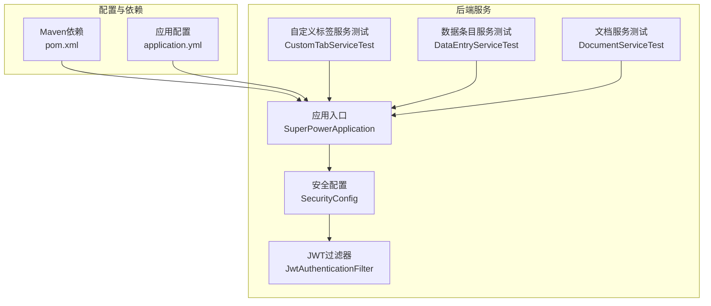
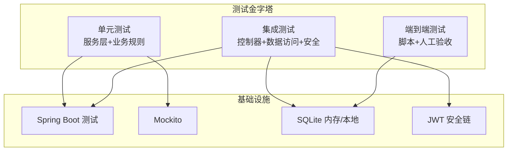
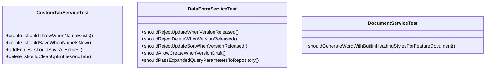
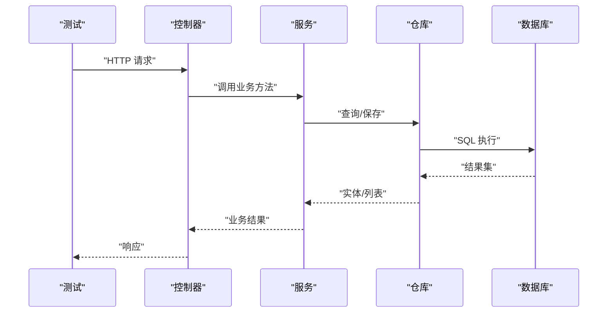
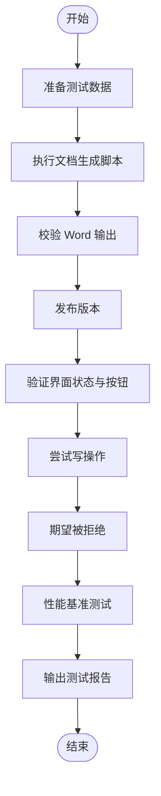
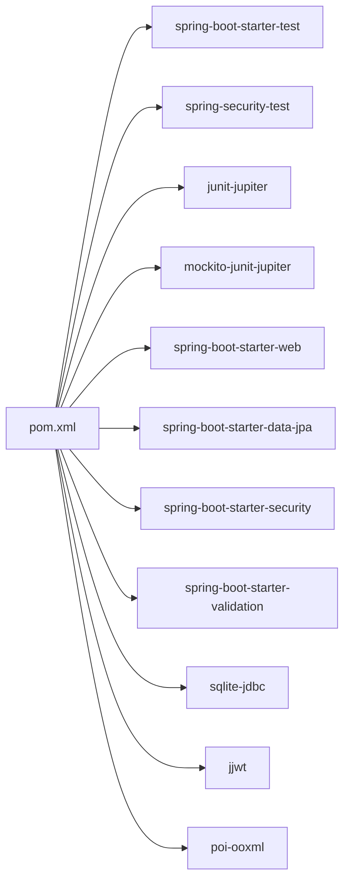

# 测试策略与质量保证

<cite>
**本文引用的文件**
- [pom.xml](file://pom.xml)
- [application.yml](file://src/main/resources/application.yml)
- [SuperPowerApplication.java](file://src/main/java/com/superpower/SuperPowerApplication.java)
- [SecurityConfig.java](file://src/main/java/com/superpower/config/SecurityConfig.java)
- [JwtAuthenticationFilter.java](file://src/main/java/com/superpower/security/JwtAuthenticationFilter.java)
- [CustomTabServiceTest.java](file://src/test/java/com/superpower/modules/customtab/service/CustomTabServiceTest.java)
- [DataEntryServiceTest.java](file://src/test/java/com/superpower/modules/data/service/DataEntryServiceTest.java)
- [DocumentServiceTest.java](file://src/test/java/com/superpower/modules/document/service/DocumentServiceTest.java)
- [2026-05-26-five-issues-plan.md](file://docs/superpowers/plans/2026-05-26-five-issues-plan.md)
</cite>

## 目录
1. [引言](#引言)
2. [项目结构](#项目结构)
3. [核心组件](#核心组件)
4. [架构总览](#架构总览)
5. [详细组件分析](#详细组件分析)
6. [依赖分析](#依赖分析)
7. [性能考虑](#性能考虑)
8. [故障排查指南](#故障排查指南)
9. [结论](#结论)
10. [附录](#附录)

## 引言
本文件为产品清单管理系统制定全面的测试策略与质量保证体系，目标是通过测试金字塔（单元测试、集成测试、端到端测试）实现高质量交付；明确 JUnit/Mockito 使用规范与最佳实践；建立自动化测试流程（用例设计、测试数据准备、执行与报告）；设定代码覆盖率与质量门禁；覆盖性能、安全与兼容性测试；并提供缺陷跟踪与修复流程、测试环境与测试数据治理方案。

## 项目结构
系统采用 Spring Boot 后端（Java），SQLite 作为本地开发数据库，JPA/Hibernate 访问数据层，JWT 实现无状态鉴权。测试位于 src/test 下，采用 JUnit 5 + Mockito 进行单元测试，Spring Boot Starter Test 提供基础支撑。

**图表来源**
- [SuperPowerApplication.java:1-82](file://src/main/java/com/superpower/SuperPowerApplication.java#L1-L82)
- [SecurityConfig.java:23-56](file://src/main/java/com/superpower/config/SecurityConfig.java#L23-L56)
- [JwtAuthenticationFilter.java:698-750](file://src/main/java/com/superpower/security/JwtAuthenticationFilter.java#L698-L750)
- [pom.xml:1-116](file://pom.xml#L1-L116)
- [application.yml:1-40](file://src/main/resources/application.yml#L1-L40)
- [CustomTabServiceTest.java:1-79](file://src/test/java/com/superpower/modules/customtab/service/CustomTabServiceTest.java#L1-L79)
- [DataEntryServiceTest.java:1-135](file://src/test/java/com/superpower/modules/data/service/DataEntryServiceTest.java#L1-L135)
- [DocumentServiceTest.java:1-74](file://src/test/java/com/superpower/modules/document/service/DocumentServiceTest.java#L1-L74)

**章节来源**
- [pom.xml:1-116](file://pom.xml#L1-L116)
- [application.yml:1-40](file://src/main/resources/application.yml#L1-L40)
- [SuperPowerApplication.java:1-82](file://src/main/java/com/superpower/SuperPowerApplication.java#L1-L82)

## 核心组件
- 测试框架与工具
  - JUnit 5：断言、参数化、扩展机制
  - Mockito：桩件、行为验证、注入测试对象
  - Spring Boot Starter Test + Spring Security Test：容器启动、WebMVC 测试、安全上下文测试
- 关键模块测试
  - 自定义标签服务测试：验证重复命名拦截、保存逻辑、关联条目批量写入、删除清理
  - 数据条目服务测试：版本状态控制（已发布禁止修改）、创建校验、查询参数透传
  - 文档服务测试：Word 文档生成与内置标题样式校验
- 安全与鉴权
  - 基于 JWT 的无状态认证过滤链，受控接口放行与角色保护
- 配置与初始化
  - SQLite 数据源、JPA 方言、日志级别、JWT 秘钥与文档存储路径等

**章节来源**
- [CustomTabServiceTest.java:1-79](file://src/test/java/com/superpower/modules/customtab/service/CustomTabServiceTest.java#L1-L79)
- [DataEntryServiceTest.java:1-135](file://src/test/java/com/superpower/modules/data/service/DataEntryServiceTest.java#L1-L135)
- [DocumentServiceTest.java:1-74](file://src/test/java/com/superpower/modules/document/service/DocumentServiceTest.java#L1-L74)
- [SecurityConfig.java:23-56](file://src/main/java/com/superpower/config/SecurityConfig.java#L23-L56)
- [JwtAuthenticationFilter.java:698-750](file://src/main/java/com/superpower/security/JwtAuthenticationFilter.java#L698-L750)
- [application.yml:1-40](file://src/main/resources/application.yml#L1-L40)

## 架构总览
下图展示测试金字塔在本项目中的落地：单元测试覆盖服务层与业务规则；集成测试通过嵌入式容器与 SQLite 验证控制器与数据访问；端到端测试通过脚本与人工验收验证完整业务闭环。

[此图为概念性示意，无需图表来源]

## 详细组件分析

### 单元测试策略与最佳实践
- 测试组织
  - 按模块分包：modules/<module>/service
  - 使用 @ExtendWith(MockitoExtension.class) 注册 Mockito
  - 使用 @Mock/@InjectMocks 管理桩件与被测对象
- 断言与验证
  - 使用 JUnit 断言验证结果
  - 使用 Mockito verify(times/never) 验证调用次数与未调用场景
  - 使用 ArgumentCaptor 捕获参数进行细粒度断言
- 用例设计原则
  - 正向场景：输入有效、期望返回值或持久化结果
  - 负向场景：异常输入、边界条件、业务规则拦截
  - 边界场景：空值、空集合、最大最小值
- 示例参考
  - 自定义标签：重复命名拦截、保存赋值、批量新增条目、删除清理
  - 数据条目：版本已发布时拒绝修改/删除/排序更新、草稿版本允许创建
  - 文档生成：Word 输出包含内置样式与标题引用

**图表来源**
- [CustomTabServiceTest.java:1-79](file://src/test/java/com/superpower/modules/customtab/service/CustomTabServiceTest.java#L1-L79)
- [DataEntryServiceTest.java:1-135](file://src/test/java/com/superpower/modules/data/service/DataEntryServiceTest.java#L1-L135)
- [DocumentServiceTest.java:1-74](file://src/test/java/com/superpower/modules/document/service/DocumentServiceTest.java#L1-L74)

**章节来源**
- [CustomTabServiceTest.java:1-79](file://src/test/java/com/superpower/modules/customtab/service/CustomTabServiceTest.java#L1-L79)
- [DataEntryServiceTest.java:1-135](file://src/test/java/com/superpower/modules/data/service/DataEntryServiceTest.java#L1-L135)
- [DocumentServiceTest.java:1-74](file://src/test/java/com/superpower/modules/document/service/DocumentServiceTest.java#L1-L74)

### 集成测试策略
- 测试范围
  - 控制器层：验证请求路由、参数绑定、响应状态与内容
  - 数据访问层：验证 JPA 查询、分页、排序、条件过滤
  - 安全层：验证 JWT 过滤器、角色权限、匿名与登录场景
- 执行方式
  - 使用 @WebMvcTest 或 @SpringBootTest 启动容器
  - 使用 @MockBean 替换真实仓库，聚焦控制器与安全
  - 使用 TestRestTemplate 或 MockMvc 进行 HTTP 请求
- 数据与环境
  - 使用 SQLite 内存库或本地文件库，DDL 自动更新
  - 初始化管理员与版本数据，确保测试可重复

[此图为概念性示意，无需图表来源]

**章节来源**
- [SecurityConfig.java:23-56](file://src/main/java/com/superpower/config/SecurityConfig.java#L23-L56)
- [JwtAuthenticationFilter.java:698-750](file://src/main/java/com/superpower/security/JwtAuthenticationFilter.java#L698-L750)
- [application.yml:1-40](file://src/main/resources/application.yml#L1-L40)

### 端到端测试策略
- Word 文档生成：准备完整数据，执行生成脚本，校验标题样式、编号、目录、图片插入
- 版本管理：创建/发布版本，验证界面状态与按钮可用性
- 数据修改：编辑中版本支持增删改查与过滤；已发布版本仅允许查询与生成
- 性能检查：统计不同规模数据下的生成与查询耗时，设定阈值

**图表来源**
- [2026-05-26-five-issues-plan.md:1363-1432](file://docs/superpowers/plans/2026-05-26-five-issues-plan.md#L1363-L1432)

**章节来源**
- [2026-05-26-five-issues-plan.md:1363-1432](file://docs/superpowers/plans/2026-05-26-five-issues-plan.md#L1363-L1432)

## 依赖分析
- 测试依赖
  - spring-boot-starter-test：测试容器、断言、参数化、测试属性
  - spring-security-test：安全上下文测试、模拟用户与角色
  - junit-jupiter-api/junit-jupiter-engine：JUnit 5 API 与引擎
  - mockito-core/mockito-junit-jupiter：桩件与扩展
- 运行时依赖
  - spring-boot-starter-web、data-jpa、security、validation
  - sqlite-jdbc、jjwt、poi-ooxml、lombok

**图表来源**
- [pom.xml:21-83](file://pom.xml#L21-L83)

**章节来源**
- [pom.xml:1-116](file://pom.xml#L1-L116)

## 性能考虑
- 单元测试
  - 优先使用内存数据库与桩件，避免真实 IO
  - 控制测试数量与循环，缩短反馈周期
- 集成测试
  - 合理设置连接池大小与超时，避免并发阻塞
  - 对批量操作进行分批处理与事务拆分
- 端到端测试
  - 限定数据规模，逐步扩大至性能基线
  - 记录生成时间与查询延迟，形成趋势对比
- 参考指标
  - 单条件过滤：≤100ms
  - 多条件过滤：≤200ms
  - 无过滤：≤50ms
  - Word 生成 1000 条：记录耗时并评估优化空间

**章节来源**
- [2026-05-26-five-issues-plan.md:1411-1429](file://docs/superpowers/plans/2026-05-26-five-issues-plan.md#L1411-L1429)

## 故障排查指南
- 单元测试失败
  - 检查桩件返回值是否符合预期分支
  - 使用 verify 确认关键方法是否被调用或未被调用
  - 排查 @BeforeEach 初始化的数据状态
- 集成测试失败
  - 核对控制器路径与请求头（Authorization）
  - 确认安全链配置与角色权限
  - 检查数据库连接与方言配置
- 端到端失败
  - 校验输入数据完整性与字段映射
  - 查看生成文档的样式与模板文件是否存在
  - 对比性能测试结果，定位瓶颈

**章节来源**
- [SecurityConfig.java:23-56](file://src/main/java/com/superpower/config/SecurityConfig.java#L23-L56)
- [JwtAuthenticationFilter.java:698-750](file://src/main/java/com/superpower/security/JwtAuthenticationFilter.java#L698-L750)
- [application.yml:1-40](file://src/main/resources/application.yml#L1-L40)

## 结论
本项目已具备完善的单元测试基础与安全配置骨架。建议在现有基础上补充：
- 补齐控制器层与数据访问层的集成测试
- 建立持续集成流水线，统一执行单元/集成测试与覆盖率统计
- 设定覆盖率门槛与质量门禁，推动测试驱动开发
- 将端到端测试纳入 CI，结合性能与安全扫描

## 附录

### 测试金字塔实施建议
- 单元测试（70%）
  - 覆盖服务层核心业务规则与边界条件
  - 使用 Mockito 驱动，关注行为验证
- 集成测试（20%）
  - 覆盖控制器、安全链、数据访问层
  - 使用嵌入式容器与 SQLite
- 端到端测试（10%）
  - 覆盖关键业务路径与用户验收场景
  - 结合脚本与人工验收

### JUnit 与 Mockito 使用规范
- 命名约定
  - 方法名采用“场景_条件_期望”的语义化命名
- 断言与验证
  - 明确断言点，避免“大而全”的断言
  - 使用 verify 进行调用契约验证
- 数据准备
  - 在 @BeforeEach 中构造最小可运行数据集
  - 使用 DTO/实体构建器减少样板代码

### 自动化测试流程
- 用例设计
  - 基于需求与风险矩阵设计用例矩阵
  - 覆盖正向、负向与边界
- 测试数据准备
  - 使用初始化脚本或 @PostConstruct 注入基础数据
  - 对敏感数据进行脱敏或占位
- 执行与报告
  - 在 CI 中执行测试并生成报告
  - 失败用例自动归档日志与快照

### 代码覆盖率与质量门禁
- 覆盖率目标（建议）
  - 行覆盖率：≥80%
  - 分支覆盖率：≥70%
- 质量门禁
  - 未达门槛的 PR 暂停合并
  - 低覆盖率新增代码需附加解释与补测计划

### 性能测试、安全测试与兼容性测试
- 性能测试
  - 基于端到端测试场景，记录响应时间与吞吐
  - 对热点接口进行压力与稳定性测试
- 安全测试
  - 渗透测试：SQL 注入、XSS、CSRF、越权
  - 密钥与敏感配置审计
- 兼容性测试
  - 不同浏览器与移动端适配
  - 不同操作系统与数据库版本验证

### 缺陷跟踪与修复流程
- 提交前自检
  - 本地执行全部单元/集成测试
  - 代码静态检查与格式化
- 提交流程
  - 触发 CI，收集测试报告与覆盖率
  - 评审中重点关注失败用例与回归风险
- 修复与回归
  - 修复后补充用例，避免同类问题复发
  - 回归测试通过后关闭缺陷

### 测试环境与测试数据治理
- 测试环境
  - 开发：本地 SQLite + 本地缓存
  - 集成：嵌入式容器 + SQLite 文件库
  - 验收：独立数据库实例（CI/CD）
- 测试数据
  - 建立数据字典与样例集
  - 使用快照与回滚机制保障一致性
  - 对外数据接口使用桩服务或模拟网关