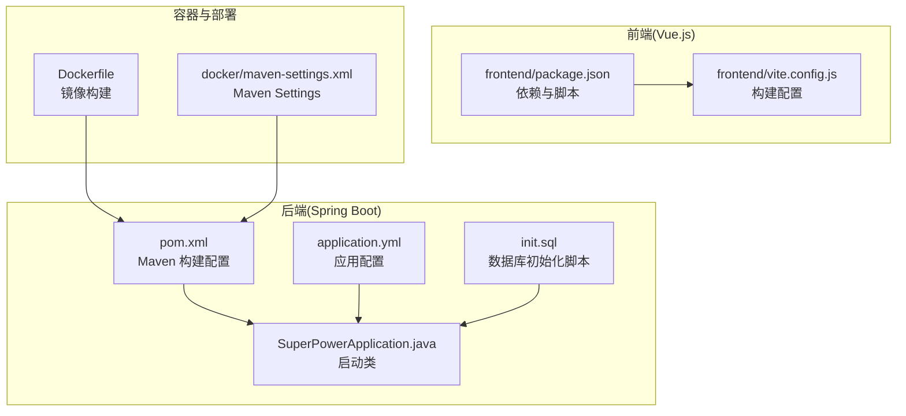
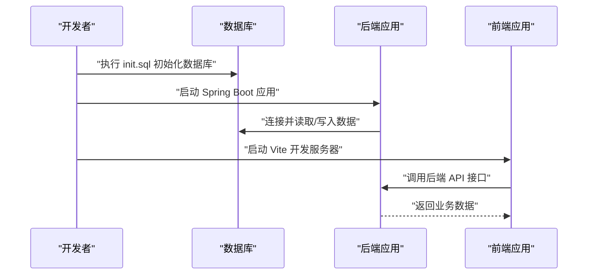
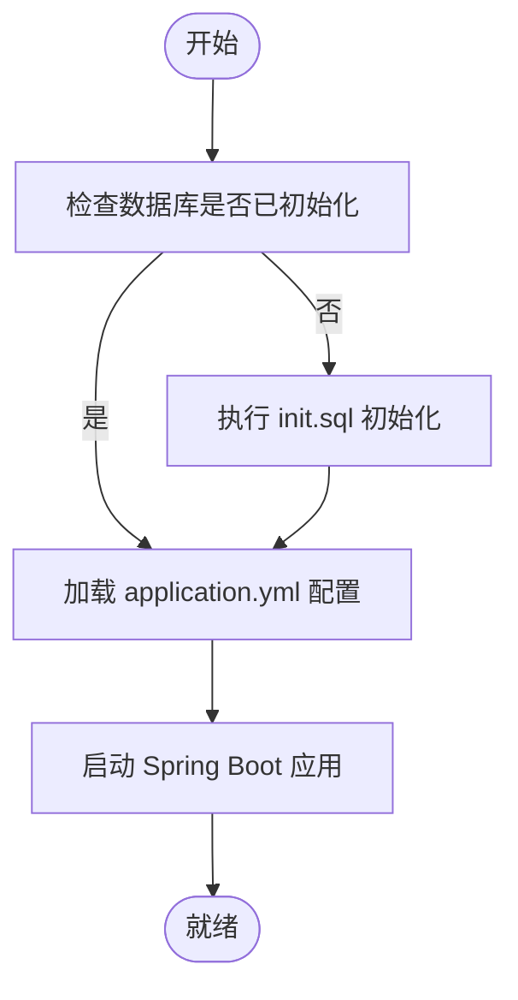
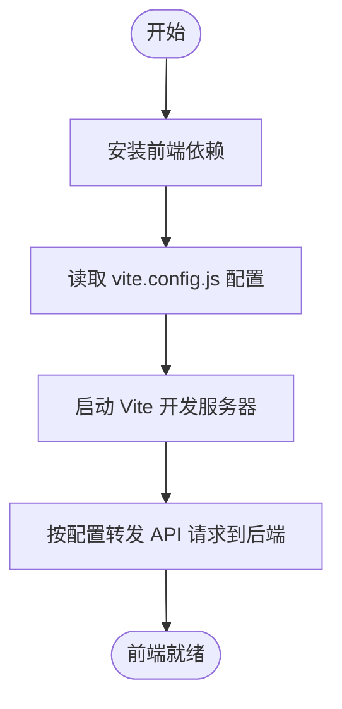
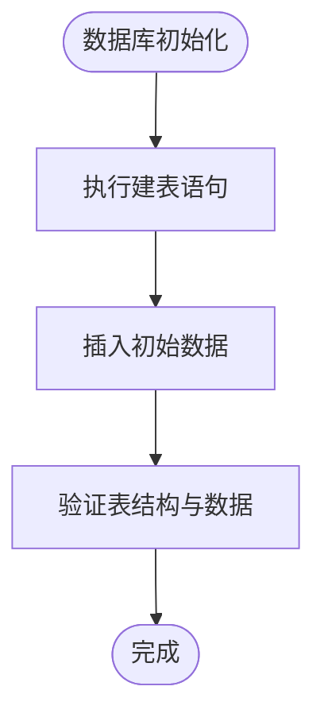
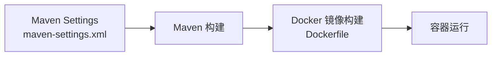
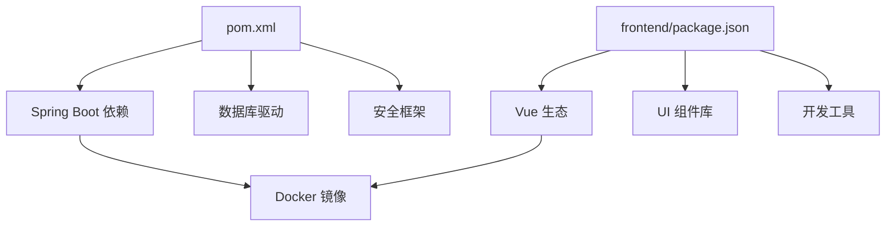

# 开发环境搭建

<cite>
**本文引用的文件**
- [pom.xml](file://pom.xml)
- [application.yml](file://src/main/resources/application.yml)
- [init.sql](file://src/main/resources/db/init.sql)
- [package.json](file://frontend/package.json)
- [vite.config.js](file://frontend/vite.config.js)
- [SuperPowerApplication.java](file://src/main/java/com/superpower/SuperPowerApplication.java)
- [maven-settings.xml](file://docker/maven-settings.xml)
- [Dockerfile](file://Dockerfile)
</cite>

## 目录
1. [简介](#简介)
2. [项目结构](#项目结构)
3. [核心组件](#核心组件)
4. [架构总览](#架构总览)
5. [详细组件分析](#详细组件分析)
6. [依赖分析](#依赖分析)
7. [性能考虑](#性能考虑)
8. [故障排除指南](#故障排除指南)
9. [结论](#结论)
10. [附录](#附录)

## 简介
本指南面向需要在本地快速搭建“产品清单管理系统”开发环境的工程师，覆盖硬件与软件最低要求、JDK 与 Node.js 版本建议、数据库准备、后端 Spring Boot 与前端 Vue.js 的完整配置流程、数据库初始化、环境变量与 IDE 设置，以及常见问题排查与调试技巧。目标是帮助开发者在最短时间内完成可运行的本地开发环境。

## 项目结构
该仓库采用前后端分离架构：后端基于 Spring Boot（Java），前端基于 Vue.js（Vite）。根目录包含 Maven 构建配置、Spring Boot 资源与 SQL 初始化脚本、前端源码与构建配置，以及 Docker 相关文件。

图表来源
- [pom.xml](file://pom.xml)
- [application.yml](file://src/main/resources/application.yml)
- [init.sql](file://src/main/resources/db/init.sql)
- [SuperPowerApplication.java](file://src/main/java/com/superpower/SuperPowerApplication.java)
- [package.json](file://frontend/package.json)
- [vite.config.js](file://frontend/vite.config.js)
- [Dockerfile](file://Dockerfile)
- [maven-settings.xml](file://docker/maven-settings.xml)

章节来源
- [pom.xml](file://pom.xml)
- [application.yml](file://src/main/resources/application.yml)
- [init.sql](file://src/main/resources/db/init.sql)
- [package.json](file://frontend/package.json)
- [vite.config.js](file://frontend/vite.config.js)
- [SuperPowerApplication.java](file://src/main/java/com/superpower/SuperPowerApplication.java)
- [Dockerfile](file://Dockerfile)
- [maven-settings.xml](file://docker/maven-settings.xml)

## 核心组件
- 后端服务：Spring Boot 应用，负责业务接口、数据访问与安全控制。
- 前端应用：Vue.js + Vite，提供用户界面与交互逻辑。
- 数据库：通过初始化脚本创建基础表结构与初始数据。
- 构建与打包：Maven（后端）、Vite（前端）。
- 容器化：Dockerfile 支持镜像构建；Maven Settings 提供仓库配置。

章节来源
- [pom.xml](file://pom.xml)
- [application.yml](file://src/main/resources/application.yml)
- [init.sql](file://src/main/resources/db/init.sql)
- [package.json](file://frontend/package.json)
- [vite.config.js](file://frontend/vite.config.js)
- [SuperPowerApplication.java](file://src/main/java/com/superpower/SuperPowerApplication.java)
- [Dockerfile](file://Dockerfile)
- [maven-settings.xml](file://docker/maven-settings.xml)

## 架构总览
下图展示本地开发时后端与前端的典型交互路径，以及数据库初始化与启动顺序。

图表来源
- [init.sql](file://src/main/resources/db/init.sql)
- [application.yml](file://src/main/resources/application.yml)
- [SuperPowerApplication.java](file://src/main/java/com/superpower/SuperPowerApplication.java)
- [package.json](file://frontend/package.json)
- [vite.config.js](file://frontend/vite.config.js)

## 详细组件分析

### 后端：Spring Boot 配置与启动
- 构建工具与依赖管理：使用 Maven（pom.xml），包含必要的插件与依赖声明。
- 应用配置：application.yml 中定义了数据库连接、Web 配置、安全策略等关键参数。
- 启动类：SuperPowerApplication.java 作为应用入口，加载配置并启动嵌入式服务器。
- 数据库初始化：init.sql 提供基础表结构与初始数据，需在首次启动前执行。

图表来源
- [init.sql](file://src/main/resources/db/init.sql)
- [application.yml](file://src/main/resources/application.yml)
- [SuperPowerApplication.java](file://src/main/java/com/superpower/SuperPowerApplication.java)

章节来源
- [pom.xml](file://pom.xml)
- [application.yml](file://src/main/resources/application.yml)
- [init.sql](file://src/main/resources/db/init.sql)
- [SuperPowerApplication.java](file://src/main/java/com/superpower/SuperPowerApplication.java)

### 前端：Vue.js 与 Vite 配置
- 依赖与脚本：frontend/package.json 声明了项目依赖与常用脚本命令。
- 构建配置：vite.config.js 定义了开发服务器端口、代理规则、插件与构建输出等。
- 运行方式：通过 npm/yarn/pnpm 安装依赖后，启动开发服务器进行本地调试。

图表来源
- [package.json](file://frontend/package.json)
- [vite.config.js](file://frontend/vite.config.js)

章节来源
- [package.json](file://frontend/package.json)
- [vite.config.js](file://frontend/vite.config.js)

### 数据库初始化与环境变量
- 初始化脚本：init.sql 包含建表与初始数据，用于本地开发数据库准备。
- 环境变量：application.yml 中包含数据库连接信息（如驱动、URL、用户名、密码等），请根据本地环境调整。
- 建议：首次启动前先执行 init.sql，再启动后端应用以确保表结构存在。

图表来源
- [init.sql](file://src/main/resources/db/init.sql)
- [application.yml](file://src/main/resources/application.yml)

章节来源
- [init.sql](file://src/main/resources/db/init.sql)
- [application.yml](file://src/main/resources/application.yml)

### 容器化与 Maven 设置
- Dockerfile：用于构建应用镜像，便于在容器中运行或集成 CI/CD。
- maven-settings.xml：提供 Maven 仓库与认证配置，可用于离线或私有仓库场景。

图表来源
- [maven-settings.xml](file://docker/maven-settings.xml)
- [Dockerfile](file://Dockerfile)

章节来源
- [maven-settings.xml](file://docker/maven-settings.xml)
- [Dockerfile](file://Dockerfile)

## 依赖分析
- 后端依赖：由 pom.xml 统一管理，包含 Spring Boot Starter、数据库驱动、安全框架等。
- 前端依赖：由 frontend/package.json 管理，包含 Vue 生态、UI 组件库、开发工具等。
- 构建链路：前端通过 Vite 构建，后端通过 Maven 打包，最终可由 Dockerfile 统一打包为镜像。

图表来源
- [pom.xml](file://pom.xml)
- [package.json](file://frontend/package.json)
- [Dockerfile](file://Dockerfile)

章节来源
- [pom.xml](file://pom.xml)
- [package.json](file://frontend/package.json)
- [Dockerfile](file://Dockerfile)

## 性能考虑
- 数据库连接池与查询优化：合理配置连接数与超时时间，避免慢查询。
- 前端资源体积：通过代码分割与懒加载减少首屏加载时间。
- 开发服务器热更新：Vite 的模块热替换提升开发效率。
- 缓存策略：后端可结合内存缓存与 Redis（如需）提升响应速度。

## 故障排除指南
- 启动失败（端口占用）
  - 检查后端与前端默认端口是否被占用，必要时修改配置文件中的端口。
  - 参考路径：[application.yml](file://src/main/resources/application.yml)、[vite.config.js](file://frontend/vite.config.js)
- 数据库无法连接
  - 确认 init.sql 已成功执行，且 application.yml 中的数据库连接信息正确。
  - 参考路径：[init.sql](file://src/main/resources/db/init.sql)、[application.yml](file://src/main/resources/application.yml)
- 前端请求跨域错误
  - 在 vite.config.js 中配置代理，将 API 请求转发至后端地址。
  - 参考路径：[vite.config.js](file://frontend/vite.config.js)
- 依赖安装失败
  - 清理 node_modules 并重新安装；若使用私有仓库，参考 maven-settings.xml 进行配置。
  - 参考路径：[package.json](file://frontend/package.json)、[maven-settings.xml](file://docker/maven-settings.xml)
- IDE 启动参数不生效
  - 确认 IDE 中的 VM Options 与程序参数与 application.yml 一致，尤其是数据库连接与日志级别。

章节来源
- [application.yml](file://src/main/resources/application.yml)
- [init.sql](file://src/main/resources/db/init.sql)
- [vite.config.js](file://frontend/vite.config.js)
- [package.json](file://frontend/package.json)
- [maven-settings.xml](file://docker/maven-settings.xml)

## 结论
通过本指南，您可以在本地快速完成产品清单管理系统的开发环境搭建：准备合适的 JDK 与 Node.js 版本，初始化数据库，配置后端 Spring Boot 与前端 Vue.js，设置环境变量与 IDE 参数，并掌握常见问题的排查方法。建议在首次启动前先执行数据库初始化脚本，随后分别启动后端与前端服务，即可进入日常开发工作流。

## 附录
- 快速检查清单
  - JDK 与 Maven：满足后端构建需求
  - Node.js 与包管理器：满足前端构建需求
  - 数据库：已执行 init.sql 并可正常连接
  - 环境变量：application.yml 中数据库与安全相关参数正确
  - IDE：VM Options 与程序参数已配置
  - 前端代理：vite.config.js 已配置 API 代理
- 参考文件
  - [pom.xml](file://pom.xml)
  - [application.yml](file://src/main/resources/application.yml)
  - [init.sql](file://src/main/resources/db/init.sql)
  - [package.json](file://frontend/package.json)
  - [vite.config.js](file://frontend/vite.config.js)
  - [SuperPowerApplication.java](file://src/main/java/com/superpower/SuperPowerApplication.java)
  - [Dockerfile](file://Dockerfile)
  - [maven-settings.xml](file://docker/maven-settings.xml)