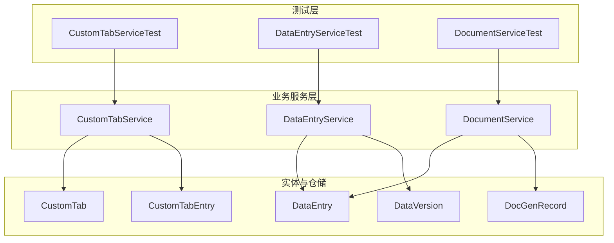
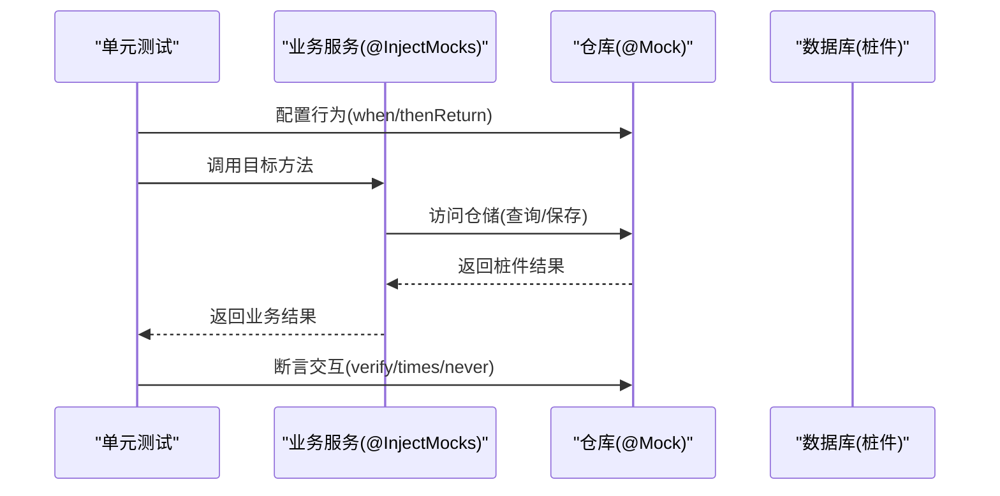
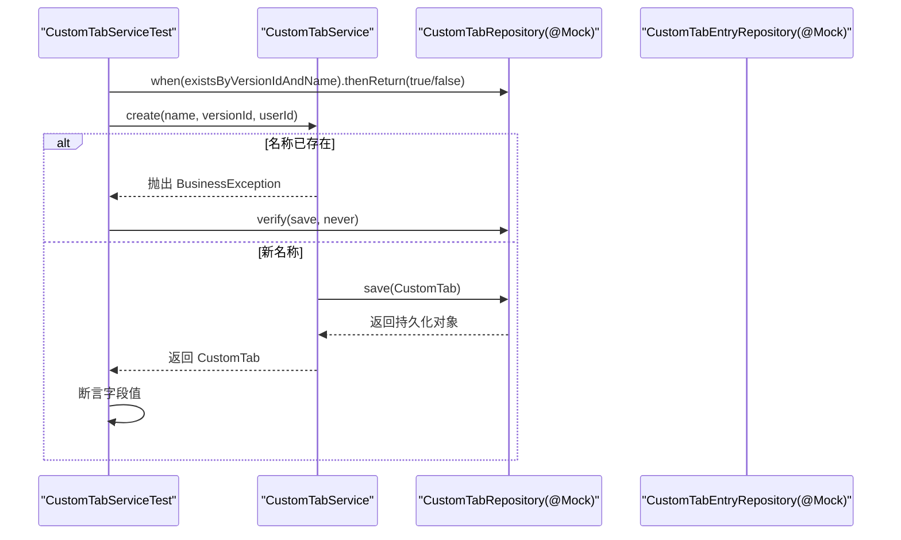
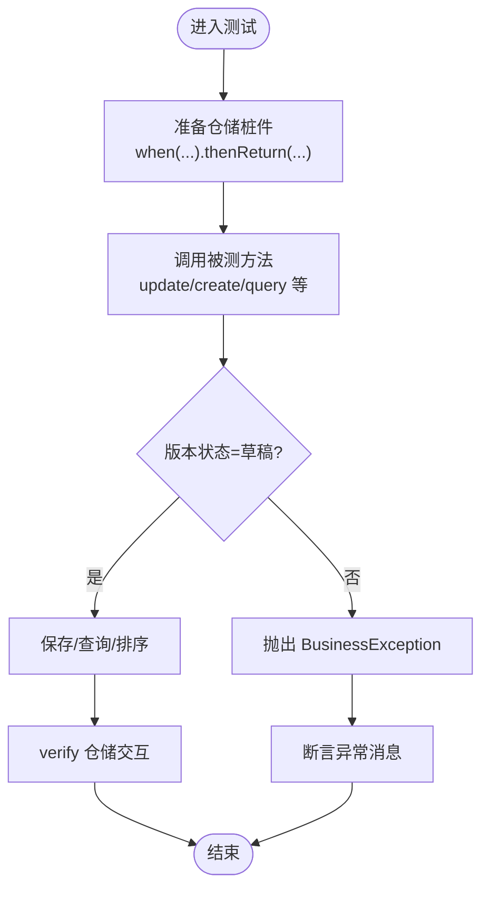
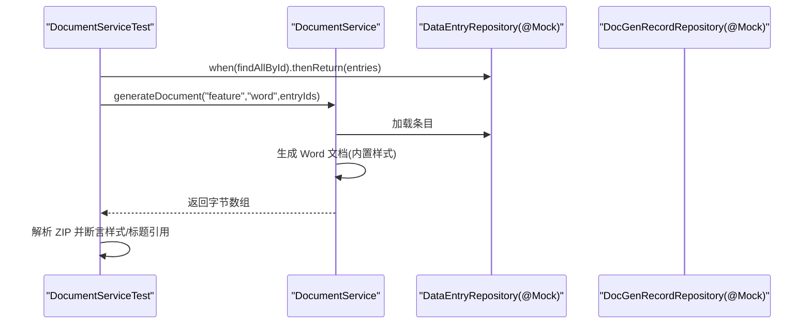
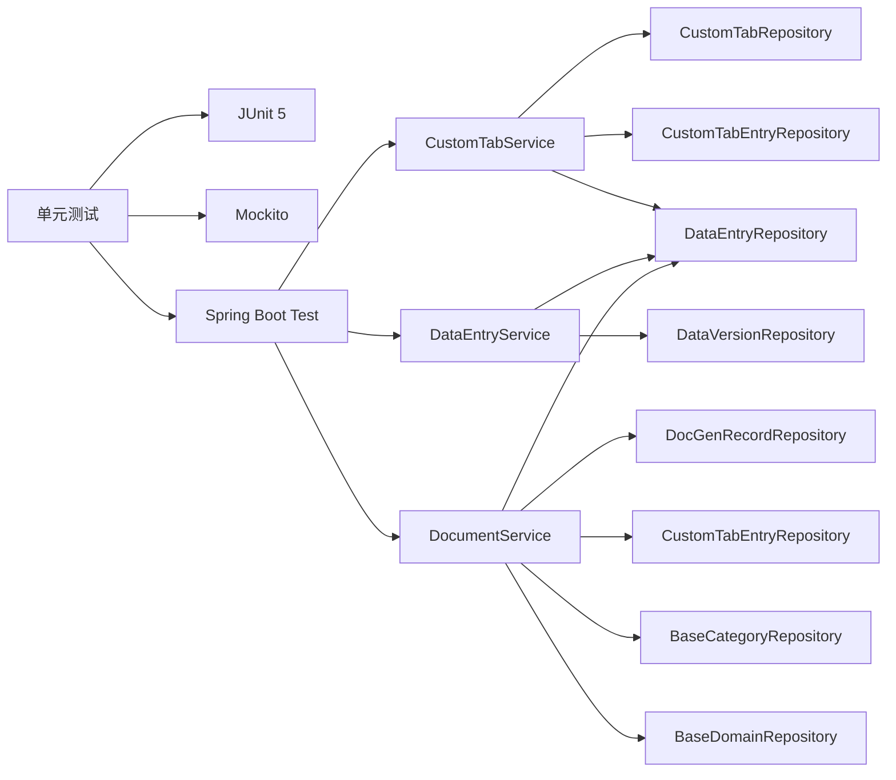

# 单元测试

<cite>
**本文引用的文件**
- [CustomTabServiceTest.java](file://src/test/java/com/superpower/modules/customtab/service/CustomTabServiceTest.java)
- [DataEntryServiceTest.java](file://src/test/java/com/superpower/modules/data/service/DataEntryServiceTest.java)
- [DocumentServiceTest.java](file://src/test/java/com/superpower/modules/document/service/DocumentServiceTest.java)
- [pom.xml](file://pom.xml)
- [BusinessException.java](file://src/main/java/com/superpower/common/BusinessException.java)
- [CustomTabService.java](file://src/main/java/com/superpower/modules/customtab/service/CustomTabService.java)
- [DataEntryService.java](file://src/main/java/com/superpower/modules/data/service/DataEntryService.java)
- [DocumentService.java](file://src/main/java/com/superpower/modules/document/service/DocumentService.java)
- [DataEntry.java](file://src/main/java/com/superpower/modules/data/entity/DataEntry.java)
- [CustomTab.java](file://src/main/java/com/superpower/modules/customtab/entity/CustomTab.java)
- [CustomTabEntry.java](file://src/main/java/com/superpower/modules/customtab/entity/CustomTabEntry.java)
- [DocGenRecord.java](file://src/main/java/com/superpower/modules/document/entity/DocGenRecord.java)
- [DataVersion.java](file://src/main/java/com/superpower/modules/version/entity/DataVersion.java)
</cite>

## 目录
1. [简介](#简介)
2. [项目结构](#项目结构)
3. [核心组件](#核心组件)
4. [架构总览](#架构总览)
5. [详细组件分析](#详细组件分析)
6. [依赖分析](#依赖分析)
7. [性能考虑](#性能考虑)
8. [故障排查指南](#故障排查指南)
9. [结论](#结论)
10. [附录](#附录)

## 简介
本指南面向产品清单管理系统，提供基于 JUnit 5 与 Mockito 的单元测试实施方法，涵盖测试类组织结构、命名规范、Mockito 注解使用、测试用例设计最佳实践（正向、边界、异常）、测试数据准备与清理策略、断言方法、覆盖率要求与提升策略，并结合系统中“数据管理”“自定义标签”“文档生成”三大核心业务模块给出具体测试示例路径与流程图。

## 项目结构
- 测试位于 src/test/java 下，按模块分包组织，便于定位与维护。
- 使用 Spring Boot Starter Test 提供测试基础能力，集成 Mockito 扩展。
- 业务服务通过 @Service 注解声明，事务性操作通过 @Transactional 标注，便于在测试中进行行为验证。

图表来源
- [CustomTabServiceTest.java:1-79](file://src/test/java/com/superpower/modules/customtab/service/CustomTabServiceTest.java#L1-L79)
- [DataEntryServiceTest.java:1-135](file://src/test/java/com/superpower/modules/data/service/DataEntryServiceTest.java#L1-L135)
- [DocumentServiceTest.java:1-74](file://src/test/java/com/superpower/modules/document/service/DocumentServiceTest.java#L1-L74)
- [CustomTabService.java:1-111](file://src/main/java/com/superpower/modules/customtab/service/CustomTabService.java#L1-L111)
- [DataEntryService.java:1-2833](file://src/main/java/com/superpower/modules/data/service/DataEntryService.java#L1-L2833)
- [DocumentService.java:1-1610](file://src/main/java/com/superpower/modules/document/service/DocumentService.java#L1-L1610)

章节来源
- [pom.xml:74-83](file://pom.xml#L74-L83)

## 核心组件
- 自定义清单（CustomTabService）：支持创建、重命名、删除、添加条目等，涉及版本校验与去重逻辑。
- 数据清单（DataEntryService）：支持树构建、查询、排序、批量更新、去重、智能标签过滤等，严格限制已发版版本的修改。
- 文档生成（DocumentService）：支持 Word/Excel 生成、图片处理、进度记录、取消与重试机制。

章节来源
- [CustomTabService.java:1-111](file://src/main/java/com/superpower/modules/customtab/service/CustomTabService.java#L1-L111)
- [DataEntryService.java:1-2833](file://src/main/java/com/superpower/modules/data/service/DataEntryService.java#L1-L2833)
- [DocumentService.java:1-1610](file://src/main/java/com/superpower/modules/document/service/DocumentService.java#L1-L1610)

## 架构总览
测试采用“测试类 + @Mock/@InjectMocks + 仓库桩件”的模式，隔离外部依赖，确保测试稳定与可重复。

图表来源
- [CustomTabServiceTest.java:32-77](file://src/test/java/com/superpower/modules/customtab/service/CustomTabServiceTest.java#L32-L77)
- [DataEntryServiceTest.java:61-126](file://src/test/java/com/superpower/modules/data/service/DataEntryServiceTest.java#L61-L126)
- [DocumentServiceTest.java:35-58](file://src/test/java/com/superpower/modules/document/service/DocumentServiceTest.java#L35-L58)

## 详细组件分析

### 自定义清单（CustomTabService）测试指南
- 测试类组织与命名
  - 包名：com.superpower.modules.customtab.service
  - 类名：CustomTabServiceTest（以被测类名 + Test 命名）
- 关键测试点
  - 名称唯一性校验：创建同名清单应抛出业务异常
  - 新建清单：保存成功并返回带主键的对象
  - 添加条目：按传入条目ID集合批量保存
  - 删除清单：清理关联条目并删除清单
- Mockito 使用要点
  - @Mock 注入仓库依赖
  - @InjectMocks 注入被测服务
  - when(...).thenReturn(...) 配置桩件
  - verify(...) 断言交互次数与参数
- 示例路径
  - [create_shouldThrowWhenNameExists:32-41](file://src/test/java/com/superpower/modules/customtab/service/CustomTabServiceTest.java#L32-L41)
  - [create_shouldSaveWhenNameIsNew:43-57](file://src/test/java/com/superpower/modules/customtab/service/CustomTabServiceTest.java#L43-L57)
  - [addEntries_shouldSaveAllEntries:59-69](file://src/test/java/com/superpower/modules/customtab/service/CustomTabServiceTest.java#L59-L69)
  - [delete_shouldCleanUpEntriesAndTab:71-77](file://src/test/java/com/superpower/modules/customtab/service/CustomTabServiceTest.java#L71-L77)

图表来源
- [CustomTabServiceTest.java:32-57](file://src/test/java/com/superpower/modules/customtab/service/CustomTabServiceTest.java#L32-L57)
- [CustomTabService.java:59-69](file://src/main/java/com/superpower/modules/customtab/service/CustomTabService.java#L59-L69)

章节来源
- [CustomTabServiceTest.java:1-79](file://src/test/java/com/superpower/modules/customtab/service/CustomTabServiceTest.java#L1-L79)
- [CustomTabService.java:1-111](file://src/main/java/com/superpower/modules/customtab/service/CustomTabService.java#L1-L111)

### 数据清单（DataEntryService）测试指南
- 测试类组织与命名
  - 包名：com.superpower.modules.data.service
  - 类名：DataEntryServiceTest
- 关键测试点
  - 已发版版本禁止修改：更新、删除、排序均应拒绝
  - 草稿版本允许创建：校验 DTO 字段映射与默认排序
  - 查询与过滤：支持多维过滤参数透传至仓储
  - 智能标签过滤：仅保留智能化条目及其祖先节点
- Mockito 使用要点
  - @BeforeEach 准备测试数据
  - ArgumentCaptor 捕获参数用于断言
  - when(...).thenReturn(...) 配置仓储返回
  - verify(..., times/nver) 断言调用次数
- 示例路径
  - [shouldRejectUpdateWhenVersionReleased:61-71](file://src/test/java/com/superpower/modules/data/service/DataEntryServiceTest.java#L61-L71)
  - [shouldRejectDeleteWhenVersionReleased:73-83](file://src/test/java/com/superpower/modules/data/service/DataEntryServiceTest.java#L73-L83)
  - [shouldRejectUpdateSortWhenVersionReleased:85-95](file://src/test/java/com/superpower/modules/data/service/DataEntryServiceTest.java#L85-L95)
  - [shouldAllowCreateWhenVersionDraft:97-115](file://src/test/java/com/superpower/modules/data/service/DataEntryServiceTest.java#L97-L115)
  - [shouldPassExpandedQueryParametersToRepository:117-126](file://src/test/java/com/superpower/modules/data/service/DataEntryServiceTest.java#L117-L126)

图表来源
- [DataEntryServiceTest.java:61-126](file://src/test/java/com/superpower/modules/data/service/DataEntryServiceTest.java#L61-L126)
- [BusinessException.java:1-23](file://src/main/java/com/superpower/common/BusinessException.java#L1-L23)

章节来源
- [DataEntryServiceTest.java:1-135](file://src/test/java/com/superpower/modules/data/service/DataEntryServiceTest.java#L1-L135)
- [DataEntryService.java:650-656](file://src/main/java/com/superpower/modules/data/service/DataEntryService.java#L650-L656)

### 文档生成（DocumentService）测试指南
- 测试类组织与命名
  - 包名：com.superpower.modules.document.service
  - 类名：DocumentServiceTest
- 关键测试点
  - 生成 Word 文档：校验内置标题样式存在，确保 Word/WPS 可识别
  - 生成内容：断言样式文件与正文引用了内置样式
- Mockito 使用要点
  - @Mock 注入仓储依赖
  - @InjectMocks 注入被测服务
  - when(...).thenReturn(...) 配置返回
  - 断言生成字节流可解析为 ZIP 并包含期望条目
- 示例路径
  - [shouldGenerateWordWithBuiltinHeadingStylesForFeatureDocument:35-58](file://src/test/java/com/superpower/modules/document/service/DocumentServiceTest.java#L35-L58)

图表来源
- [DocumentServiceTest.java:35-58](file://src/test/java/com/superpower/modules/document/service/DocumentServiceTest.java#L35-L58)
- [DocumentService.java:236-244](file://src/main/java/com/superpower/modules/document/service/DocumentService.java#L236-L244)

章节来源
- [DocumentServiceTest.java:1-74](file://src/test/java/com/superpower/modules/document/service/DocumentServiceTest.java#L1-L74)
- [DocumentService.java:1-1610](file://src/main/java/com/superpower/modules/document/service/DocumentService.java#L1-L1610)

## 依赖分析
- 测试框架与工具
  - JUnit 5：测试生命周期与断言
  - Mockito：模拟对象与交互验证
  - Spring Boot Starter Test：集成测试环境
- 业务依赖关系
  - CustomTabService 依赖 CustomTabRepository、CustomTabEntryRepository、DataEntryRepository
  - DataEntryService 依赖 DataEntryRepository、DataVersionRepository、多个领域仓储
  - DocumentService 依赖 DataEntryRepository、DocGenRecordRepository、CustomTabEntryRepository、BaseCategoryRepository、BaseDomainRepository

图表来源
- [pom.xml:74-83](file://pom.xml#L74-L83)
- [CustomTabService.java:19-29](file://src/main/java/com/superpower/modules/customtab/service/CustomTabService.java#L19-L29)
- [DataEntryService.java:47-74](file://src/main/java/com/superpower/modules/data/service/DataEntryService.java#L47-L74)
- [DocumentService.java:68-89](file://src/main/java/com/superpower/modules/document/service/DocumentService.java#L68-L89)

章节来源
- [pom.xml:1-116](file://pom.xml#L1-L116)

## 性能考虑
- 测试执行速度
  - 使用 @Mock 替代真实数据库访问，避免 IO 开销
  - 合理使用 verify(times/nver) 减少不必要的断言
- 内存与并发
  - 避免在测试中创建大量对象；必要时在 @BeforeEach 中复用
  - 对于长耗时操作（如图片下载），建议在集成测试中覆盖，单元测试中通过桩件模拟
- 事务与隔离
  - 使用 @Transactional 在服务层进行回滚，保证测试间相互隔离

## 故障排查指南
- 常见问题
  - Mock 未生效：确认 @ExtendWith(MockitoExtension.class) 已添加
  - 断言失败：检查 when(...).thenReturn(...) 的参数匹配是否严格（类型、顺序）
  - 异常断言：使用 assertThrows(BusinessException.class, ...) 并断言消息
- 排查步骤
  - 逐步缩小范围：先断言仓储调用次数，再断言返回值
  - 使用 ArgumentCaptor 获取实际参数，辅助断言
  - 对于复杂流程，拆分为多个小测试，每个关注单一职责

章节来源
- [BusinessException.java:1-23](file://src/main/java/com/superpower/common/BusinessException.java#L1-L23)
- [DataEntryServiceTest.java:61-95](file://src/test/java/com/superpower/modules/data/service/DataEntryServiceTest.java#L61-L95)

## 结论
通过规范的测试类组织、严谨的 Mockito 使用、完善的断言策略与覆盖关键业务分支，可以有效保障数据管理、自定义标签与文档生成三大核心模块的质量与稳定性。建议持续引入边界与异常测试，配合覆盖率工具，逐步提升整体测试质量。

## 附录

### JUnit 与 Mockito 使用规范
- 测试类命名
  - 被测类名 + Test（如 DataEntryServiceTest）
- 生命周期注解
  - @BeforeEach：准备测试数据
  - @Test：定义测试用例
- Mockito 注解
  - @Mock：模拟依赖
  - @InjectMocks：注入被测对象
  - @ExtendWith(MockitoExtension.class)：启用扩展
- 断言
  - assertEquals、assertNotNull、assertThrows、assertTrue、assertFalse
  - verify(..., times/nver/never) 验证交互

章节来源
- [CustomTabServiceTest.java:20-21](file://src/test/java/com/superpower/modules/customtab/service/CustomTabServiceTest.java#L20-L21)
- [DataEntryServiceTest.java:29-30](file://src/test/java/com/superpower/modules/data/service/DataEntryServiceTest.java#L29-L30)
- [DocumentServiceTest.java:23-24](file://src/test/java/com/superpower/modules/document/service/DocumentServiceTest.java#L23-L24)

### 测试用例设计最佳实践
- 正向测试
  - 验证正常流程返回正确结果与仓储调用
- 边界测试
  - 空输入、空集合、null 值、最大最小值
- 异常测试
  - 已发版版本修改、重复名称、非法参数等
- 示例路径
  - [create_shouldThrowWhenNameExists:32-41](file://src/test/java/com/superpower/modules/customtab/service/CustomTabServiceTest.java#L32-L41)
  - [shouldRejectUpdateWhenVersionReleased:61-71](file://src/test/java/com/superpower/modules/data/service/DataEntryServiceTest.java#L61-L71)
  - [shouldGenerateWordWithBuiltinHeadingStylesForFeatureDocument:35-58](file://src/test/java/com/superpower/modules/document/service/DocumentServiceTest.java#L35-L58)

章节来源
- [CustomTabServiceTest.java:32-77](file://src/test/java/com/superpower/modules/customtab/service/CustomTabServiceTest.java#L32-L77)
- [DataEntryServiceTest.java:61-126](file://src/test/java/com/superpower/modules/data/service/DataEntryServiceTest.java#L61-L126)
- [DocumentServiceTest.java:35-58](file://src/test/java/com/superpower/modules/document/service/DocumentServiceTest.java#L35-L58)

### 测试数据准备与清理策略
- 准备
  - @BeforeEach 构造实体对象（如 DataEntry、DataVersion）
  - when(...).thenReturn(...) 配置仓储桩件
- 清理
  - 无需清理，Mock 对象在每次测试后自动隔离
  - 如需持久化副作用，可在测试结束后重置或重建数据库

章节来源
- [DataEntryServiceTest.java:44-59](file://src/test/java/com/superpower/modules/data/service/DataEntryServiceTest.java#L44-L59)

### 测试覆盖率要求与提升策略
- 覆盖率指标
  - 行覆盖率：建议 ≥ 80%
  - 分支覆盖率：建议 ≥ 70%
- 提升策略
  - 优先补齐异常路径与边界条件
  - 对复杂方法进行拆分，降低圈复杂度
  - 引入参数化测试（@ParameterizedTest）覆盖多输入组合
  - 对关键业务（如文档生成）增加集成测试补充