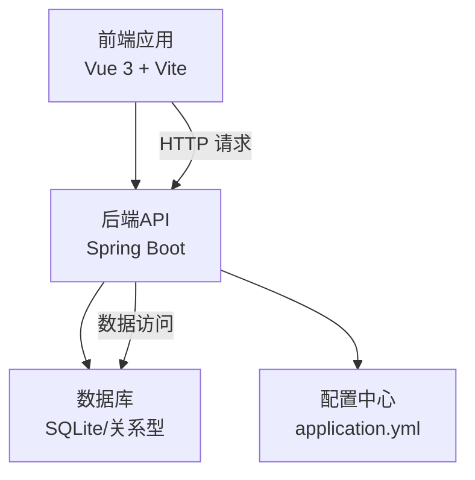
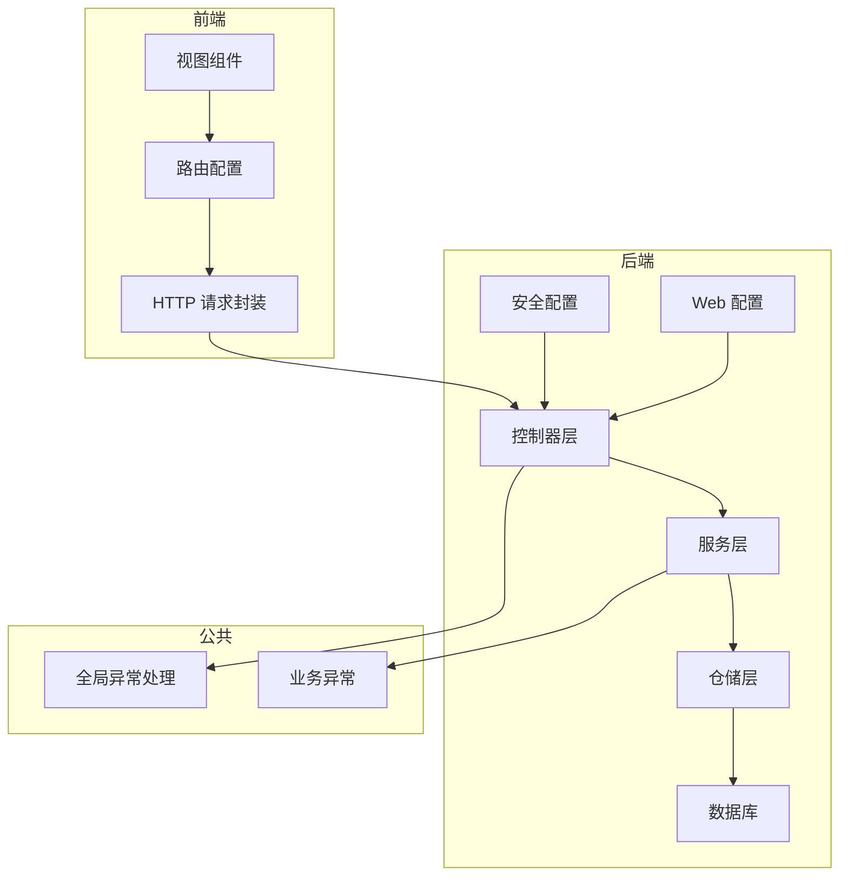
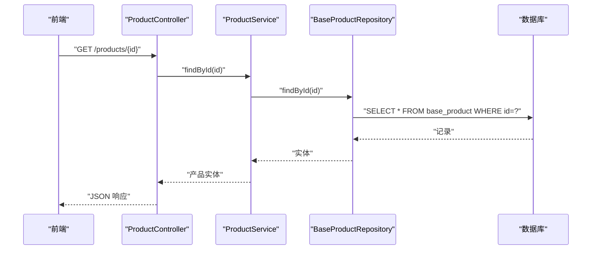
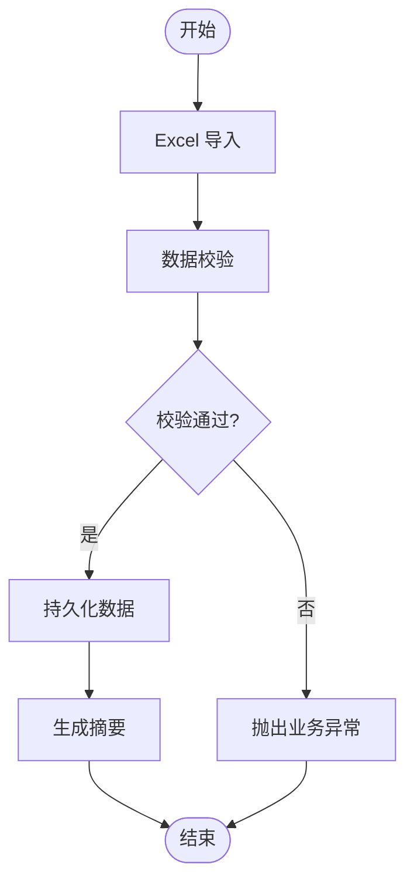
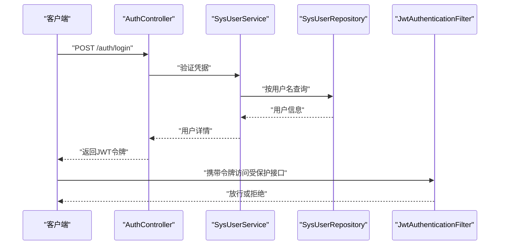
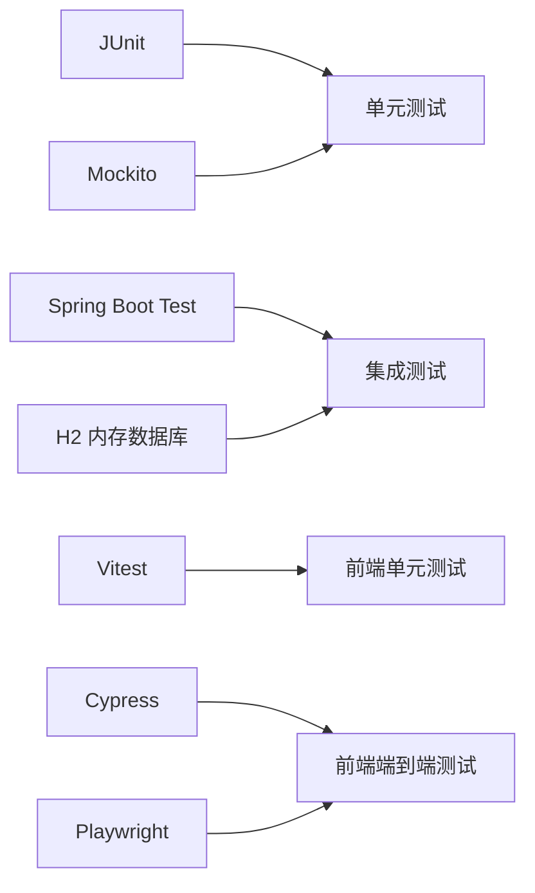

# 测试策略与质量保证

<cite>
**本文档引用的文件**
- [SuperPowerApplication.java](file://src/main/java/com/superpower/SuperPowerApplication.java)
- [BusinessException.java](file://src/main/java/com/superpower/common/BusinessException.java)
- [GlobalExceptionHandler.java](file://src/main/java/com/superpower/common/GlobalExceptionHandler.java)
- [SecurityConfig.java](file://src/main/java/com/superpower/config/SecurityConfig.java)
- [WebMvcConfig.java](file://src/main/java/com/superpower/config/WebMvcConfig.java)
- [CategoryController.java](file://src/main/java/com/superpower/modules/category/controller/CategoryController.java)
- [ProductController.java](file://src/main/java/com/superpower/modules/category/controller/ProductController.java)
- [CategoryService.java](file://src/main/java/com/superpower/modules/category/service/CategoryService.java)
- [ProductService.java](file://src/main/java/com/superpower/modules/category/service/ProductService.java)
- [BaseProductRepository.java](file://src/main/java/com/superpower/modules/category/repository/BaseProductRepository.java)
- [BaseCategoryRepository.java](file://src/main/java/com/superpower/modules/category/repository/BaseCategoryRepository.java)
- [DataEntryServiceTest.java](file://src/test/java/com/superpower/modules/data/service/DataEntryServiceTest.java)
- [CustomTabServiceTest.java](file://src/test/java/com/superpower/modules/customtab/service/CustomTabServiceTest.java)
- [DocumentServiceTest.java](file://src/test/java/com/superpower/modules/document/service/DocumentServiceTest.java)
- [pom.xml](file://pom.xml)
- [package.json](file://frontend/package.json)
- [index.js](file://frontend/src/router/index.js)
- [request.js](file://frontend/src/utils/request.js)
- [AuthController.java](file://src/main/java/com/superpower/modules/system/controller/AuthController.java)
- [SysUserService.java](file://src/main/java/com/superpower/modules/system/service/SysUserService.java)
- [SysUserRepository.java](file://src/main/java/com/superpower/modules/system/repository/SysUserRepository.java)
- [JwtAuthenticationFilter.java](file://src/main/java/com/superpower/security/JwtAuthenticationFilter.java)
- [application.yml](file://src/main/resources/application.yml)
</cite>

## 目录
1. [引言](#引言)
2. [项目结构](#项目结构)
3. [核心组件](#核心组件)
4. [架构总览](#架构总览)
5. [详细组件分析](#详细组件分析)
6. [依赖分析](#依赖分析)
7. [性能考虑](#性能考虑)
8. [故障排除指南](#故障排除指南)
9. [结论](#结论)
10. [附录](#附录)

## 引言
本文件为产品清单管理系统制定全面的测试策略与质量保证方案，覆盖单元测试、集成测试、端到端测试、性能测试、安全测试、兼容性测试、缺陷管理与回归测试机制，并明确测试覆盖率与质量门禁标准，确保系统在功能正确性、性能稳定性、安全性与可维护性方面的质量目标。

## 项目结构
系统采用前后端分离架构：后端基于 Spring Boot（Java），前端基于 Vue 3 + Vite。测试覆盖后端服务层与控制器层，以及前端请求封装与路由配置。数据库初始化脚本位于资源目录，应用配置集中于 YAML 文件。

**图表来源**
- [SuperPowerApplication.java](file://src/main/java/com/superpower/SuperPowerApplication.java)
- [application.yml](file://src/main/resources/application.yml)

**章节来源**
- [SuperPowerApplication.java](file://src/main/java/com/superpower/SuperPowerApplication.java)
- [application.yml](file://src/main/resources/application.yml)

## 核心组件
- 后端模块：分类与产品模块（Category/Product）、数据条目模块（DataEntry）、文档生成模块（Document）、自定义标签模块（CustomTab）、系统用户与权限模块（System/Auth）等。
- 前端模块：路由配置、HTTP 请求封装、视图组件与业务页面。
- 公共组件：全局异常处理、业务异常定义、安全配置与认证过滤器。

**章节来源**
- [CategoryController.java](file://src/main/java/com/superpower/modules/category/controller/CategoryController.java)
- [ProductController.java](file://src/main/java/com/superpower/modules/category/controller/ProductController.java)
- [CategoryService.java](file://src/main/java/com/superpower/modules/category/service/CategoryService.java)
- [ProductService.java](file://src/main/java/com/superpower/modules/category/service/ProductService.java)
- [GlobalExceptionHandler.java](file://src/main/java/com/superpower/common/GlobalExceptionHandler.java)
- [BusinessException.java](file://src/main/java/com/superpower/common/BusinessException.java)
- [SecurityConfig.java](file://src/main/java/com/superpower/config/SecurityConfig.java)
- [JwtAuthenticationFilter.java](file://src/main/java/com/superpower/security/JwtAuthenticationFilter.java)
- [index.js](file://frontend/src/router/index.js)
- [request.js](file://frontend/src/utils/request.js)

## 架构总览
后端采用分层架构：Controller -> Service -> Repository -> 数据库；前端通过统一请求封装与路由进行交互；全局异常处理保障接口健壮性；安全配置与 JWT 过滤器实现认证授权。

**图表来源**
- [WebMvcConfig.java](file://src/main/java/com/superpower/config/WebMvcConfig.java)
- [SecurityConfig.java](file://src/main/java/com/superpower/config/SecurityConfig.java)
- [GlobalExceptionHandler.java](file://src/main/java/com/superpower/common/GlobalExceptionHandler.java)
- [BusinessException.java](file://src/main/java/com/superpower/common/BusinessException.java)
- [index.js](file://frontend/src/router/index.js)
- [request.js](file://frontend/src/utils/request.js)

## 详细组件分析

### 分类与产品模块测试策略
- 单元测试：针对 CategoryService 与 ProductService 的核心业务逻辑（如查询、创建、更新、删除）编写测试用例，使用 Mock 对仓储层进行隔离，验证输入参数校验、业务规则与返回结果。
- 集成测试：通过嵌入式数据库或测试专用数据库，验证控制器与服务层的协作，覆盖典型场景（如分页查询、树形结构构建、层级关系维护）。
- 端到端测试：从前端发起真实请求，验证从路由到数据库的完整链路，关注错误路径与边界条件。

**图表来源**
- [ProductController.java](file://src/main/java/com/superpower/modules/category/controller/ProductController.java)
- [ProductService.java](file://src/main/java/com/superpower/modules/category/service/ProductService.java)
- [BaseProductRepository.java](file://src/main/java/com/superpower/modules/category/repository/BaseProductRepository.java)

**章节来源**
- [CategoryController.java](file://src/main/java/com/superpower/modules/category/controller/CategoryController.java)
- [ProductController.java](file://src/main/java/com/superpower/modules/category/controller/ProductController.java)
- [CategoryService.java](file://src/main/java/com/superpower/modules/category/service/CategoryService.java)
- [ProductService.java](file://src/main/java/com/superpower/modules/category/service/ProductService.java)
- [BaseCategoryRepository.java](file://src/main/java/com/superpower/modules/category/repository/BaseCategoryRepository.java)
- [BaseProductRepository.java](file://src/main/java/com/superpower/modules/category/repository/BaseProductRepository.java)

### 文档生成与数据条目模块测试策略
- 单元测试：对 DocumentService 与 DataEntryService 的核心方法（如导入、导出、重编号、摘要统计）进行测试，使用 Mock 模拟外部依赖（如文件系统、第三方服务）。
- 断言策略：验证返回 DTO 结构、异常抛出时机、日志输出与事务行为。
- 集成测试：结合数据库初始化脚本，验证复杂流程（如 Excel 导入后的数据一致性、版本号递增、重编号任务执行）。

**图表来源**
- [DataEntryServiceTest.java](file://src/test/java/com/superpower/modules/data/service/DataEntryServiceTest.java)
- [DocumentServiceTest.java](file://src/test/java/com/superpower/modules/document/service/DocumentServiceTest.java)

**章节来源**
- [DataEntryServiceTest.java](file://src/test/java/com/superpower/modules/data/service/DataEntryServiceTest.java)
- [DocumentServiceTest.java](file://src/test/java/com/superpower/modules/document/service/DocumentServiceTest.java)

### 自定义标签模块测试策略
- 单元测试：验证 CustomTabService 的增删改查与关联关系维护，使用 Mock 替换仓储层，确保边界条件与并发场景下的正确性。
- 回归测试：新增用例覆盖历史缺陷修复点，防止回归。

**章节来源**
- [CustomTabServiceTest.java](file://src/test/java/com/superpower/modules/customtab/service/CustomTabServiceTest.java)

### 安全与认证测试策略
- 认证流程：通过 AuthController 登录接口，验证 JWT 令牌生成与刷新、权限拦截与未登录访问的响应。
- 授权测试：使用不同角色用户访问受保护接口，验证权限控制与资源隔离。
- 安全配置：检查 SecurityConfig 中的过滤器链、CORS、CSRF（如启用）与会话策略。

**图表来源**
- [AuthController.java](file://src/main/java/com/superpower/modules/system/controller/AuthController.java)
- [SysUserService.java](file://src/main/java/com/superpower/modules/system/service/SysUserService.java)
- [SysUserRepository.java](file://src/main/java/com/superpower/modules/system/repository/SysUserRepository.java)
- [JwtAuthenticationFilter.java](file://src/main/java/com/superpower/security/JwtAuthenticationFilter.java)
- [SecurityConfig.java](file://src/main/java/com/superpower/config/SecurityConfig.java)

**章节来源**
- [AuthController.java](file://src/main/java/com/superpower/modules/system/controller/AuthController.java)
- [SysUserService.java](file://src/main/java/com/superpower/modules/system/service/SysUserService.java)
- [SysUserRepository.java](file://src/main/java/com/superpower/modules/system/repository/SysUserRepository.java)
- [JwtAuthenticationFilter.java](file://src/main/java/com/superpower/security/JwtAuthenticationFilter.java)
- [SecurityConfig.java](file://src/main/java/com/superpower/config/SecurityConfig.java)

## 依赖分析
- 后端测试依赖：JUnit、Mockito、Spring Boot Test、H2（用于测试数据库）。
- 前端测试依赖：Vitest（单元测试）、Cypress（E2E）、Playwright（可选）。
- 构建与打包：Maven（后端）、npm（前端）。

**图表来源**
- [pom.xml](file://pom.xml)
- [package.json](file://frontend/package.json)

**章节来源**
- [pom.xml](file://pom.xml)
- [package.json](file://frontend/package.json)

## 性能考虑
- 单元测试：避免真实 IO，使用 Mock 与内存存储，确保测试快速稳定。
- 集成测试：限制并发与数据量，使用事务回滚减少重复初始化成本。
- 端到端测试：使用独立测试环境，避免与生产流量冲突；对慢接口增加超时与重试策略。
- 性能基准：为关键接口（如分页查询、批量导入）建立性能基线，监控回归。

## 故障排除指南
- 全局异常处理：统一捕获业务异常与运行时异常，返回标准化错误码与消息，便于前端提示与日志追踪。
- 日志与追踪：为关键流程添加日志点，结合请求 ID 进行跨服务追踪。
- 常见问题定位：数据库连接失败、JWT 解析异常、文件上传失败、Excel 导入格式不匹配等。

**章节来源**
- [GlobalExceptionHandler.java](file://src/main/java/com/superpower/common/GlobalExceptionHandler.java)
- [BusinessException.java](file://src/main/java/com/superpower/common/BusinessException.java)

## 结论
通过分层测试策略与自动化流水线，结合覆盖率与质量门禁，能够有效提升产品清单管理系统的质量与稳定性。建议优先完善单元测试与集成测试，逐步扩展端到端测试覆盖面，并持续优化性能与安全测试。

## 附录

### 测试覆盖率与质量门禁
- 单元测试覆盖率：服务层与控制器层不低于 80%，关键业务分支不低于 90%。
- 集成测试覆盖率：核心业务流程与异常路径全覆盖。
- 质量门禁：
  - 代码审查通过且无阻断项。
  - 单元测试全部通过，覆盖率达标。
  - 集成测试通过，无严重缺陷。
  - 性能测试通过，无显著回归。
  - 安全扫描通过，无高危漏洞。
  - 兼容性测试通过，无重大兼容问题。

### 自动化测试配置与执行流程
- 后端：Maven 配置 Surefire/Failsafe 插件，绑定 test/verify 生命周期；使用 H2 初始化测试数据库；支持并行执行与报告聚合。
- 前端：Vitest 配置文件中设置覆盖率收集与报告；Cypress/Playwright 配置测试环境变量与截图/视频录制。
- CI/CD：在流水线中依次执行安装依赖、编译、单元测试、集成测试、覆盖率报告、安全扫描与部署。

**章节来源**
- [pom.xml](file://pom.xml)
- [package.json](file://frontend/package.json)