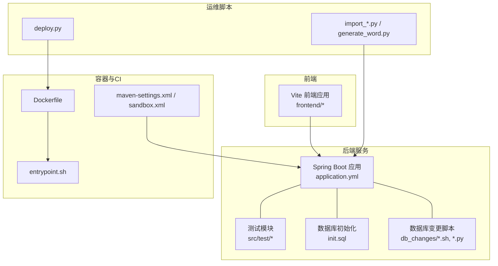
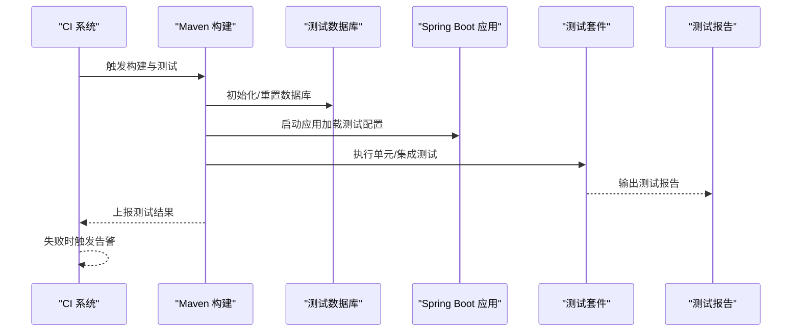
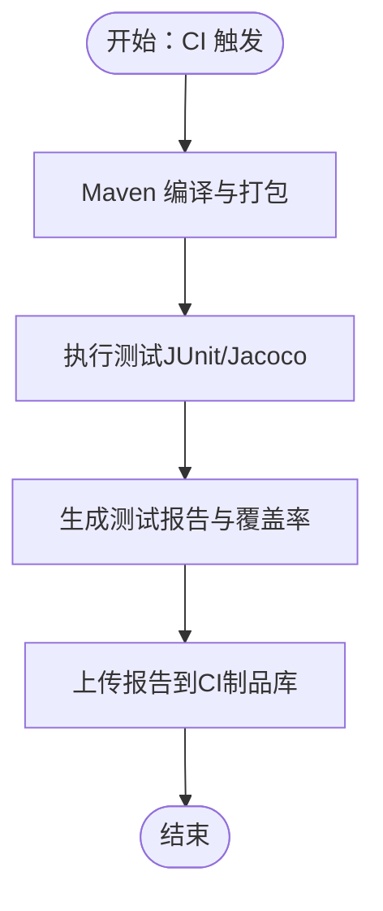
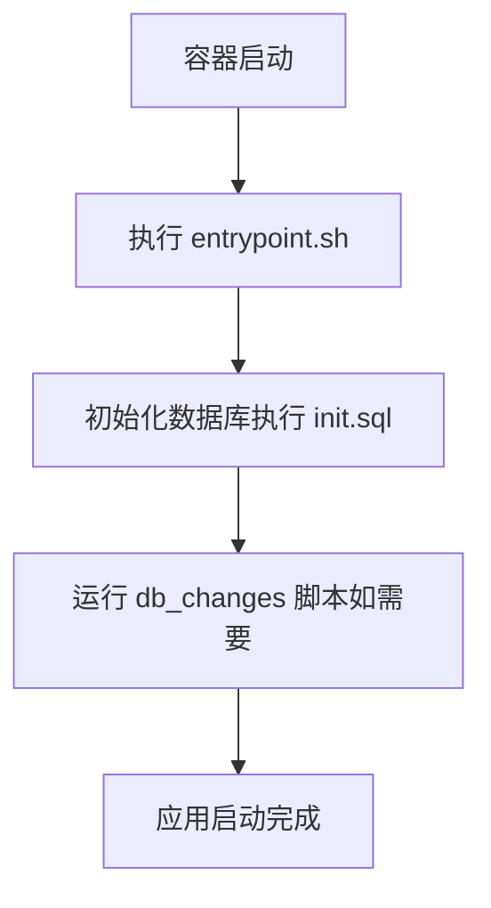
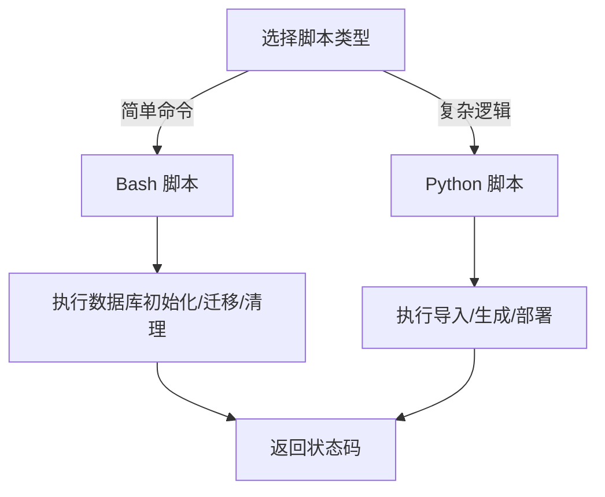
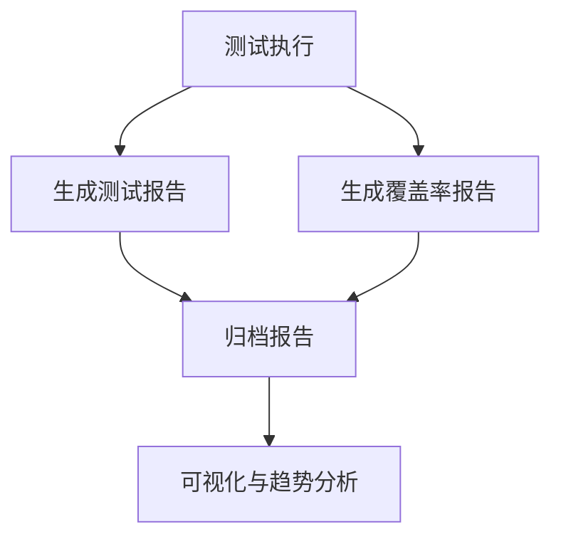
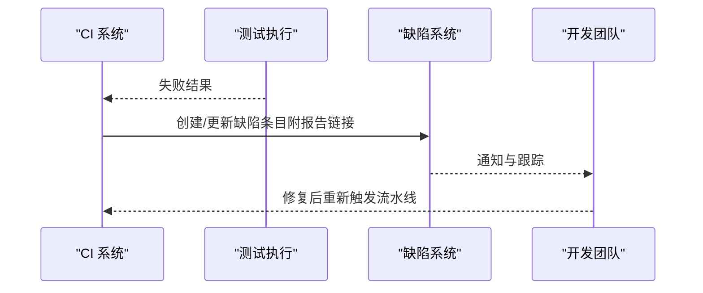
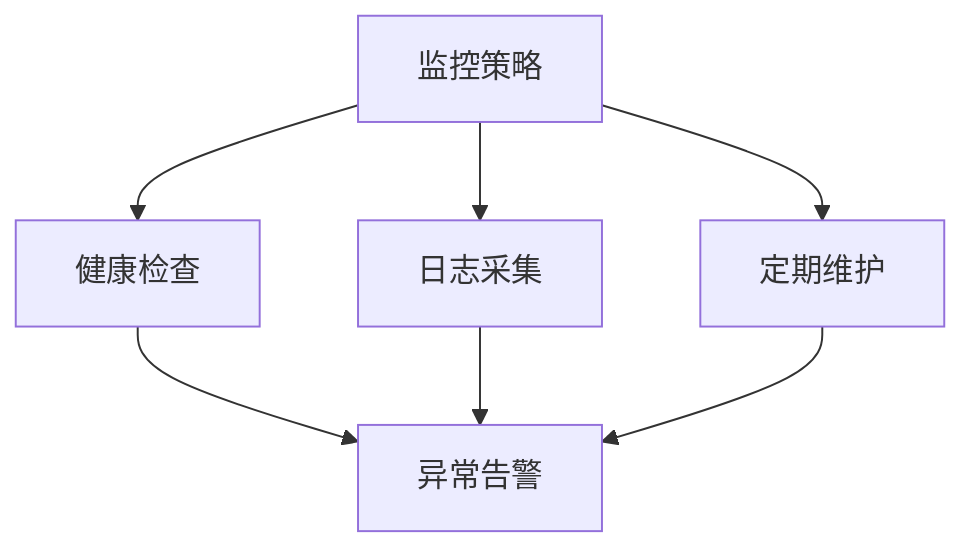
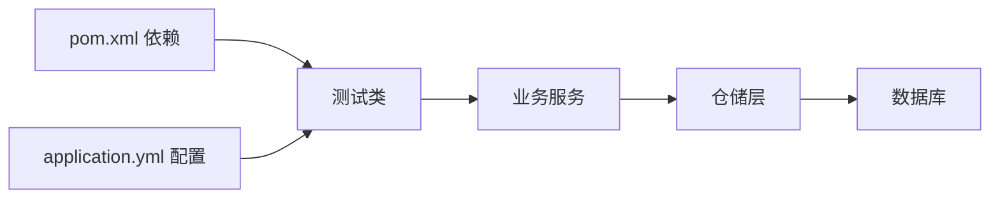

# 测试自动化

<cite>
**本文引用的文件**
- [pom.xml](file://pom.xml)
- [docker/maven-settings.xml](file://docker/maven-settings.xml)
- [docker/maven-settings-sandbox.xml](file://docker/maven-settings-sandbox.xml)
- [src/test/java/com/superpower/modules/customtab/service/CustomTabServiceTest.java](file://src/test/java/com/superpower/modules/customtab/service/CustomTabServiceTest.java)
- [src/test/java/com/superpower/modules/data/service/DataEntryServiceTest.java](file://src/test/java/com/superpower/modules/data/service/DataEntryServiceTest.java)
- [src/test/java/com/superpower/modules/document/service/DocumentServiceTest.java](file://src/test/java/com/superpower/modules/document/service/DocumentServiceTest.java)
- [src/main/resources/application.yml](file://src/main/resources/application.yml)
- [src/main/resources/db/init.sql](file://src/main/resources/db/init.sql)
- [db_changes/V1.0.10_cleanup_5_6_2_images.sh](file://db_changes/V1.0.10_cleanup_5_6_2_images.sh)
- [db_changes/V1.0.7_migrate_image_files.sh](file://db_changes/V1.0.7_migrate_image_files.sh)
- [db_changes/V1.0.9_fix_l3_images_move.sh](file://db_changes/V1.0.9_fix_l3_images_move.sh)
- [db_changes/V1.0.9_fix_l3_image_directory.py](file://db_changes/V1.0.9_fix_l3_image_directory.py)
- [deploy.py](file://deploy.py)
- [import_excel.py](file://import_excel.py)
- [import_hierarchy.py](file://import_hierarchy.py)
- [import_l3.py](file://import_l3.py)
- [import_shuzhidi.py](file://import_shuzhidi.py)
- [generate_word.py](file://generate_word.py)
- [docker/entrypoint.sh](file://docker/entrypoint.sh)
- [Dockerfile](file://Dockerfile)
</cite>

## 目录
1. [引言](#引言)
2. [项目结构](#项目结构)
3. [核心组件](#核心组件)
4. [架构总览](#架构总览)
5. [详细组件分析](#详细组件分析)
6. [依赖分析](#依赖分析)
7. [性能考虑](#性能考虑)
8. [故障排查指南](#故障排查指南)
9. [结论](#结论)
10. [附录](#附录)

## 引言
本文件面向产品清单管理系统，系统性构建测试自动化流程，覆盖以下目标：
- 在持续集成环境中自动执行测试，明确Maven测试插件配置与测试报告生成路径
- 自动化搭建测试环境，包括数据库初始化与测试数据准备
- 提供测试脚本编写指南（Bash与Python），说明其在测试流程中的应用
- 建立测试结果收集与分析方法（测试覆盖率与性能指标）
- 设计测试失败告警与问题追踪流程
- 制定测试环境监控与维护策略

## 项目结构
该项目采用前后端分离架构，后端为Spring Boot应用，测试位于src/test目录下；数据库初始化SQL位于resources/db；数据库变更脚本位于db_changes；容器化部署与入口脚本位于docker；若干Python脚本用于导入与生成文档。

**图表来源**
- [pom.xml](file://pom.xml)
- [src/main/resources/application.yml](file://src/main/resources/application.yml)
- [src/main/resources/db/init.sql](file://src/main/resources/db/init.sql)
- [docker/entrypoint.sh](file://docker/entrypoint.sh)
- [Dockerfile](file://Dockerfile)
- [deploy.py](file://deploy.py)
- [import_excel.py](file://import_excel.py)
- [generate_word.py](file://generate_word.py)

**章节来源**
- [pom.xml](file://pom.xml)
- [src/main/resources/application.yml](file://src/main/resources/application.yml)
- [src/main/resources/db/init.sql](file://src/main/resources/db/init.sql)
- [docker/entrypoint.sh](file://docker/entrypoint.sh)
- [Dockerfile](file://Dockerfile)
- [deploy.py](file://deploy.py)
- [import_excel.py](file://import_excel.py)
- [generate_word.py](file://generate_word.py)

## 核心组件
- Maven测试与报告：通过pom.xml中定义的测试插件与报告生成策略，确保在CI中可自动执行并输出测试报告
- Spring Boot测试：位于src/test的单元/集成测试，覆盖核心业务模块（如customtab、data、document等）
- 数据库初始化与变更：init.sql用于初始化表结构，db_changes下的脚本用于数据迁移与修复
- 容器化与入口：Dockerfile与entrypoint.sh负责镜像构建与容器启动时的初始化
- 运维与导入脚本：deploy.py用于部署，import_*用于批量导入，generate_word.py用于文档生成

**章节来源**
- [pom.xml](file://pom.xml)
- [src/test/java/com/superpower/modules/customtab/service/CustomTabServiceTest.java](file://src/test/java/com/superpower/modules/customtab/service/CustomTabServiceTest.java)
- [src/test/java/com/superpower/modules/data/service/DataEntryServiceTest.java](file://src/test/java/com/superpower/modules/data/service/DataEntryServiceTest.java)
- [src/test/java/com/superpower/modules/document/service/DocumentServiceTest.java](file://src/test/java/com/superpower/modules/document/service/DocumentServiceTest.java)
- [src/main/resources/db/init.sql](file://src/main/resources/db/init.sql)
- [docker/entrypoint.sh](file://docker/entrypoint.sh)
- [Dockerfile](file://Dockerfile)
- [deploy.py](file://deploy.py)
- [import_excel.py](file://import_excel.py)
- [generate_word.py](file://generate_word.py)

## 架构总览
测试自动化在CI中的典型流程如下：
- 拉取代码 → 构建镜像/安装依赖 → 启动测试环境（数据库）→ 执行测试 → 生成报告 → 发送告警（失败时）

**图表来源**
- [pom.xml](file://pom.xml)
- [docker/entrypoint.sh](file://docker/entrypoint.sh)
- [src/main/resources/application.yml](file://src/main/resources/application.yml)

## 详细组件分析

### Maven测试插件与报告生成
- 插件职责：编译、打包、执行测试、生成报告
- 报告位置：通常位于target/surefire-reports或target/jacoco-reports（若启用覆盖率）
- CI集成：在流水线中调用mvn test或mvn verify，结合发布报告与覆盖率上传

**图表来源**
- [pom.xml](file://pom.xml)

**章节来源**
- [pom.xml](file://pom.xml)

### 测试环境自动化搭建（数据库初始化与测试数据准备）
- 初始化SQL：init.sql用于创建基础表结构
- 变更脚本：db_changes中的.sh/.py脚本用于数据迁移与修复
- 入口脚本：entrypoint.sh在容器启动时执行初始化命令
- 配置文件：application.yml中定义测试环境的数据库连接参数

**图表来源**
- [docker/entrypoint.sh](file://docker/entrypoint.sh)
- [src/main/resources/db/init.sql](file://src/main/resources/db/init.sql)
- [db_changes/V1.0.10_cleanup_5_6_2_images.sh](file://db_changes/V1.0.10_cleanup_5_6_2_images.sh)
- [db_changes/V1.0.7_migrate_image_files.sh](file://db_changes/V1.0.7_migrate_image_files.sh)
- [db_changes/V1.0.9_fix_l3_images_move.sh](file://db_changes/V1.0.9_fix_l3_images_move.sh)
- [db_changes/V1.0.9_fix_l3_image_directory.py](file://db_changes/V1.0.9_fix_l3_image_directory.py)

**章节来源**
- [docker/entrypoint.sh](file://docker/entrypoint.sh)
- [src/main/resources/db/init.sql](file://src/main/resources/db/init.sql)
- [db_changes/V1.0.10_cleanup_5_6_2_images.sh](file://db_changes/V1.0.10_cleanup_5_6_2_images.sh)
- [db_changes/V1.0.7_migrate_image_files.sh](file://db_changes/V1.0.7_migrate_image_files.sh)
- [db_changes/V1.0.9_fix_l3_images_move.sh](file://db_changes/V1.0.9_fix_l3_images_move.sh)
- [db_changes/V1.0.9_fix_l3_image_directory.py](file://db_changes/V1.0.9_fix_l3_image_directory.py)

### 测试脚本编写指南（Bash与Python）
- Bash脚本：适合执行数据库初始化、清理、迁移等操作
  - 示例脚本：V1.0.10_cleanup_5_6_2_images.sh、V1.0.7_migrate_image_files.sh、V1.0.9_fix_l3_images_move.sh
- Python脚本：适合复杂的数据处理、导入与生成任务
  - 导入脚本：import_excel.py、import_hierarchy.py、import_l3.py、import_shuzhidi.py
  - 文档生成：generate_word.py
  - 部署脚本：deploy.py

**图表来源**
- [db_changes/V1.0.10_cleanup_5_6_2_images.sh](file://db_changes/V1.0.10_cleanup_5_6_2_images.sh)
- [db_changes/V1.0.7_migrate_image_files.sh](file://db_changes/V1.0.7_migrate_image_files.sh)
- [db_changes/V1.0.9_fix_l3_images_move.sh](file://db_changes/V1.0.9_fix_l3_images_move.sh)
- [db_changes/V1.0.9_fix_l3_image_directory.py](file://db_changes/V1.0.9_fix_l3_image_directory.py)
- [import_excel.py](file://import_excel.py)
- [import_hierarchy.py](file://import_hierarchy.py)
- [import_l3.py](file://import_l3.py)
- [import_shuzhidi.py](file://import_shuzhidi.py)
- [generate_word.py](file://generate_word.py)
- [deploy.py](file://deploy.py)

**章节来源**
- [db_changes/V1.0.10_cleanup_5_6_2_images.sh](file://db_changes/V1.0.10_cleanup_5_6_2_images.sh)
- [db_changes/V1.0.7_migrate_image_files.sh](file://db_changes/V1.0.7_migrate_image_files.sh)
- [db_changes/V1.0.9_fix_l3_images_move.sh](file://db_changes/V1.0.9_fix_l3_images_move.sh)
- [db_changes/V1.0.9_fix_l3_image_directory.py](file://db_changes/V1.0.9_fix_l3_image_directory.py)
- [import_excel.py](file://import_excel.py)
- [import_hierarchy.py](file://import_hierarchy.py)
- [import_l3.py](file://import_l3.py)
- [import_shuzhidi.py](file://import_shuzhidi.py)
- [generate_word.py](file://generate_word.py)
- [deploy.py](file://deploy.py)

### 测试结果收集与分析（覆盖率与性能指标）
- 覆盖率：通过Maven Jacoco插件生成覆盖率报告，建议在CI中上传至覆盖率平台
- 性能指标：可在测试中记录耗时、内存占用等，结合日志与指标系统进行统计
- 报告格式：Surefire报告与Jacoco报告需在CI中归档与展示

**图表来源**
- [pom.xml](file://pom.xml)

**章节来源**
- [pom.xml](file://pom.xml)

### 测试失败告警与问题追踪流程
- 告警触发：当测试失败或覆盖率不达标时，CI系统发送通知（邮件/IM）
- 问题追踪：将失败信息与报告链接写入缺陷系统，形成闭环
- 回归验证：修复后重新触发流水线，确认问题已解决

**图表来源**
- [pom.xml](file://pom.xml)

**章节来源**
- [pom.xml](file://pom.xml)

### 测试环境监控与维护策略
- 健康检查：容器启动后对应用与数据库进行健康检查
- 日志采集：集中化日志便于定位测试失败原因
- 定期维护：清理过期测试数据与报告，定期更新数据库脚本

**图表来源**
- [docker/entrypoint.sh](file://docker/entrypoint.sh)
- [src/main/resources/application.yml](file://src/main/resources/application.yml)

**章节来源**
- [docker/entrypoint.sh](file://docker/entrypoint.sh)
- [src/main/resources/application.yml](file://src/main/resources/application.yml)

## 依赖分析
- Maven依赖：pom.xml定义了测试框架、数据库驱动、JPA/Hibernate等依赖
- Spring配置：application.yml定义了数据源、JPA、日志等配置
- 测试耦合：测试类依赖于业务服务与仓储层，需关注隔离与Mock策略

**图表来源**
- [pom.xml](file://pom.xml)
- [src/main/resources/application.yml](file://src/main/resources/application.yml)

**章节来源**
- [pom.xml](file://pom.xml)
- [src/main/resources/application.yml](file://src/main/resources/application.yml)

## 性能考虑
- 测试并发：合理拆分测试套件，避免共享资源竞争
- 数据隔离：每个测试使用独立的测试数据库实例或事务回滚
- 报告生成：仅在必要时生成覆盖率报告，减少CI时间

## 故障排查指南
- 测试失败定位：查看测试报告与日志，确认是业务错误还是环境问题
- 数据库问题：检查init.sql与db_changes脚本是否正确执行
- 容器启动：确认entrypoint.sh执行顺序与权限设置

**章节来源**
- [src/main/resources/db/init.sql](file://src/main/resources/db/init.sql)
- [db_changes/V1.0.10_cleanup_5_6_2_images.sh](file://db_changes/V1.0.10_cleanup_5_6_2_images.sh)
- [docker/entrypoint.sh](file://docker/entrypoint.sh)

## 结论
通过明确Maven测试插件配置、自动化测试环境搭建、规范化的测试脚本与报告流程，以及完善的告警与监控策略，可以显著提升产品清单管理系统的质量与交付效率。建议在CI中固化上述流程，并持续优化测试覆盖率与性能指标。

## 附录
- Maven设置：maven-settings.xml与maven-settings-sandbox.xml用于不同环境的仓库与代理配置
- 容器化：Dockerfile与entrypoint.sh确保测试环境的一致性与可重复性
- 运维脚本：deploy.py、import_*、generate_word.py支撑测试数据与文档的自动化准备

**章节来源**
- [docker/maven-settings.xml](file://docker/maven-settings.xml)
- [docker/maven-settings-sandbox.xml](file://docker/maven-settings-sandbox.xml)
- [Dockerfile](file://Dockerfile)
- [docker/entrypoint.sh](file://docker/entrypoint.sh)
- [deploy.py](file://deploy.py)
- [import_excel.py](file://import_excel.py)
- [import_hierarchy.py](file://import_hierarchy.py)
- [import_l3.py](file://import_l3.py)
- [import_shuzhidi.py](file://import_shuzhidi.py)
- [generate_word.py](file://generate_word.py)