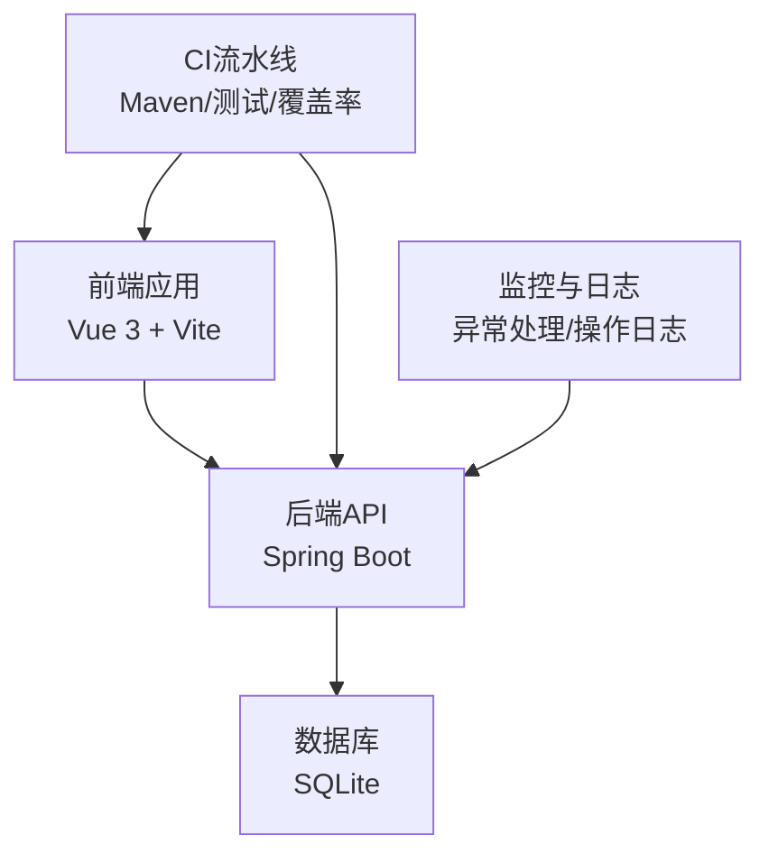
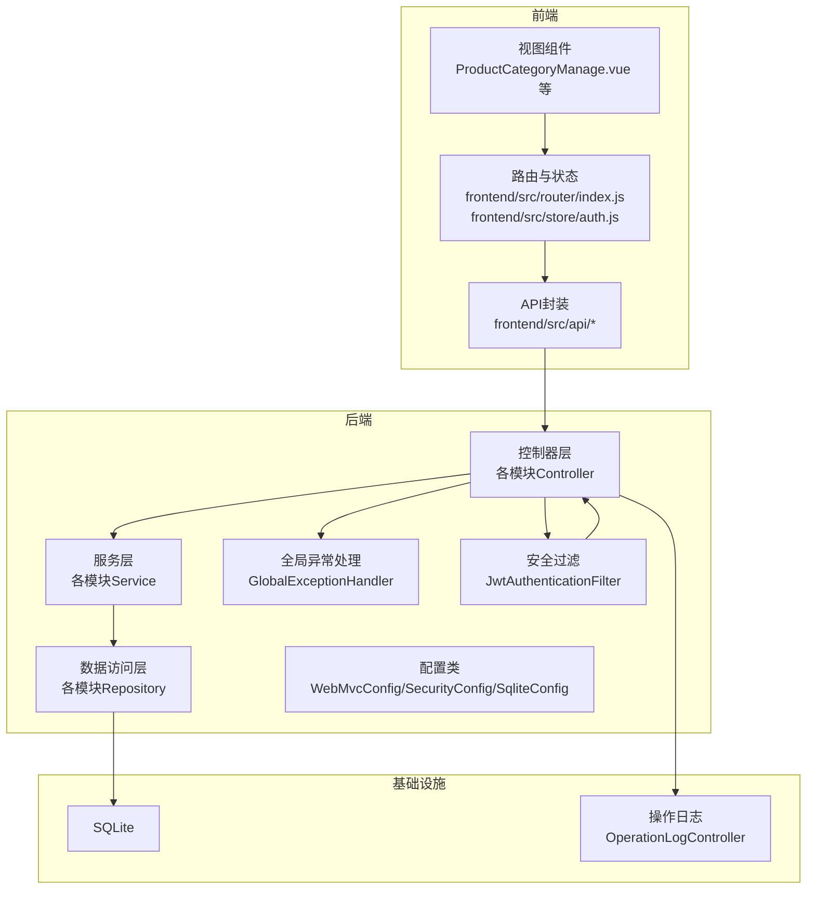
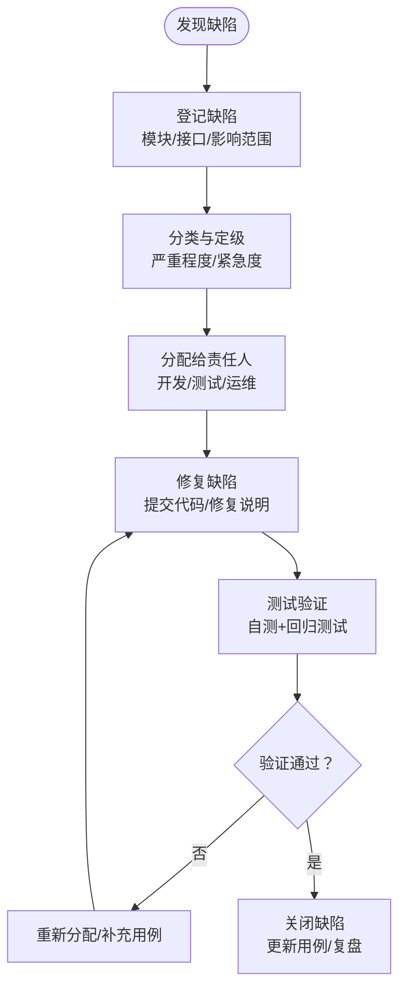
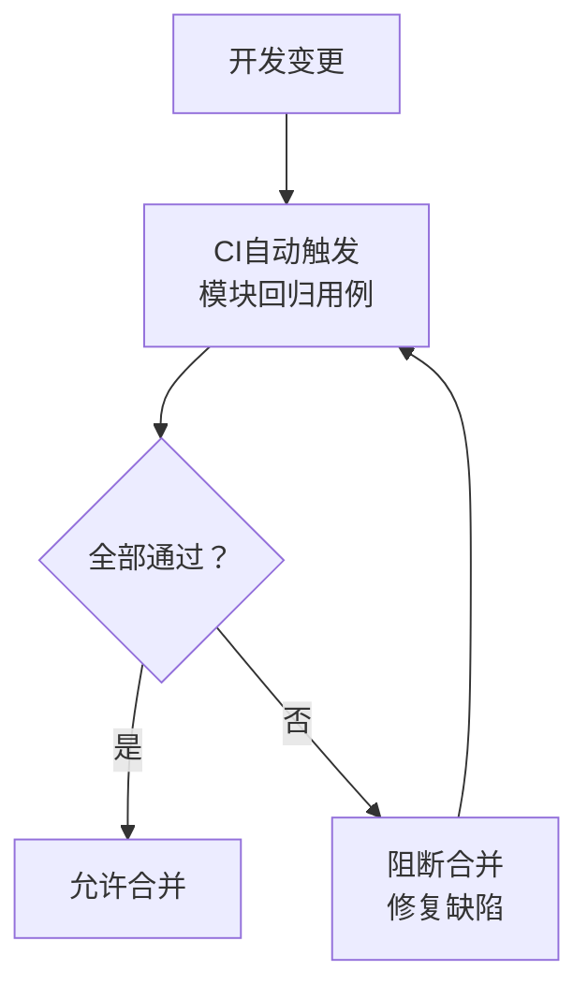
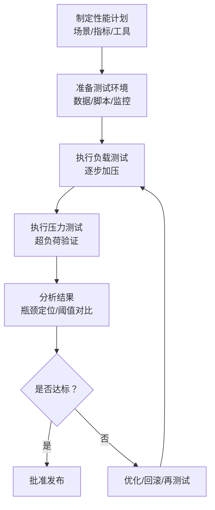
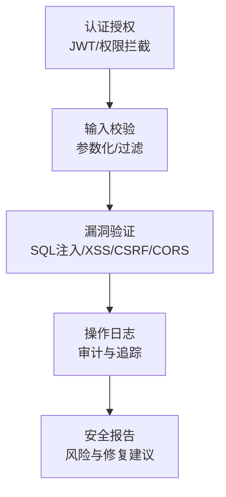
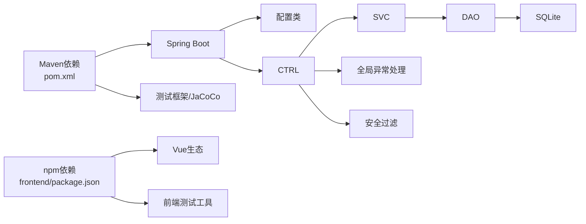

# 质量保证与监控

<cite>
**本文引用的文件**
- [pom.xml](file://pom.xml)
- [Dockerfile](file://Dockerfile)
- [deploy.py](file://deploy.py)
- [src/test/java/com/superpower/modules/customtab/service/CustomTabServiceTest.java](file://src/test/java/com/superpower/modules/customtab/service/CustomTabServiceTest.java)
- [src/test/java/com/superpower/modules/data/service/DataEntryServiceTest.java](file://src/test/java/com/superpower/modules/data/service/DataEntryServiceTest.java)
- [src/test/java/com/superpower/modules/document/service/DocumentServiceTest.java](file://src/test/java/com/superpower/modules/document/service/DocumentServiceTest.java)
- [src/main/java/com/superpower/SuperPowerApplication.java](file://src/main/java/com/superpower/SuperPowerApplication.java)
- [src/main/java/com/superpower/common/GlobalExceptionHandler.java](file://src/main/java/com/superpower/common/GlobalExceptionHandler.java)
- [src/main/java/com/superpower/security/JwtAuthenticationFilter.java](file://src/main/java/com/superpower/security/JwtAuthenticationFilter.java)
- [src/main/java/com/superpower/modules/category/controller/ProductController.java](file://src/main/java/com/superpower/modules/category/controller/ProductController.java)
- [src/main/java/com/superpower/modules/system/controller/AuthController.java](file://src/main/java/com/superpower/modules/system/controller/AuthController.java)
- [src/main/java/com/superpower/modules/approval/controller/ApprovalController.java](file://src/main/java/com/superpower/modules/approval/controller/ApprovalController.java)
- [src/main/java/com/superpower/modules/version/controller/AppVersionController.java](file://src/main/java/com/superpower/modules/version/controller/AppVersionController.java)
- [src/main/java/com/superpower/modules/document/controller/DocumentController.java](file://src/main/java/com/superpower/modules/document/controller/DocumentController.java)
- [src/main/java/com/superpower/modules/image/controller/ImageResourceController.java](file://src/main/java/com/superpower/modules/image/controller/ImageResourceController.java)
- [src/main/java/com/superpower/modules/requirement/controller/RequirementController.java](file://src/main/java/com/superpower/modules/requirement/controller/RequirementController.java)
- [src/main/java/com/superpower/modules/system/controller/SysUserController.java](file://src/main/java/com/superpower/modules/system/controller/SysUserController.java)
- [src/main/java/com/superpower/modules/system/controller/MaintenanceController.java](file://src/main/java/com/superpower/modules/system/controller/MaintenanceController.java)
- [src/main/java/com/superpower/modules/system/controller/OperationLogController.java](file://src/main/java/com/superpower/modules/system/controller/OperationLogController.java)
- [src/main/java/com/superpower/modules/system/controller/SysRoleController.java](file://src/main/java/com/superpower/modules/system/controller/SysRoleController.java)
- [src/main/java/com/superpower/config/WebMvcConfig.java](file://src/main/java/com/superpower/config/WebMvcConfig.java)
- [src/main/java/com/superpower/config/SecurityConfig.java](file://src/main/java/com/superpower/config/SecurityConfig.java)
- [src/main/java/com/superpower/config/SqliteConfig.java](file://src/main/java/com/superpower/config/SqliteConfig.java)
- [src/main/java/com/superpower/config/AsyncConfig.java](file://src/main/java/com/superpower/config/AsyncConfig.java)
- [src/main/resources/application.yml](file://src/main/resources/application.yml)
- [frontend/package.json](file://frontend/package.json)
- [frontend/vite.config.js](file://frontend/vite.config.js)
- [frontend/src/api/product.js](file://frontend/src/api/product.js)
- [frontend/src/api/auth.js](file://frontend/src/api/auth.js)
- [frontend/src/api/version.js](file://frontend/src/api/version.js)
- [frontend/src/api/document.js](file://frontend/src/api/document.js)
- [frontend/src/api/image.js](file://frontend/src/api/image.js)
- [frontend/src/api/requirement.js](file://frontend/src/api/requirement.js)
- [frontend/src/api/user.js](file://frontend/src/api/user.js)
- [frontend/src/api/operationLog.js](file://frontend/src/api/operationLog.js)
- [frontend/src/api/role.js](file://frontend/src/api/role.js)
- [frontend/src/api/maintenance.js](file://frontend/src/api/maintenance.js)
- [frontend/src/api/approval.js](file://frontend/src/api/approval.js)
- [frontend/src/api/customTab.js](file://frontend/src/api/customTab.js)
- [frontend/src/api/data.js](file://frontend/src/api/data.js)
- [frontend/src/api/category.js](file://frontend/src/api/category.js)
- [frontend/src/api/option.js](file://frontend/src/api/option.js)
- [frontend/src/api/approval.js](file://frontend/src/api/approval.js)
- [frontend/src/api/requirement.js](file://frontend/src/api/requirement.js)
- [frontend/src/api/user.js](file://frontend/src/api/user.js)
- [frontend/src/api/operationLog.js](file://frontend/src/api/operationLog.js)
- [frontend/src/api/role.js](file://frontend/src/api/role.js)
- [frontend/src/api/maintenance.js](file://frontend/src/api/maintenance.js)
- [frontend/src/api/customTab.js](file://frontend/src/api/customTab.js)
- [frontend/src/api/data.js](file://frontend/src/api/data.js)
- [frontend/src/api/category.js](file://frontend/src/api/category.js)
- [frontend/src/api/option.js](file://frontend/src/api/option.js)
- [frontend/src/api/version.js](file://frontend/src/api/version.js)
- [frontend/src/api/document.js](file://frontend/src/api/document.js)
- [frontend/src/api/image.js](file://frontend/src/api/image.js)
- [frontend/src/api/requirement.js](file://frontend/src/api/requirement.js)
- [frontend/src/api/user.js](file://frontend/src/api/user.js)
- [frontend/src/api/operationLog.js](file://frontend/src/api/operationLog.js)
- [frontend/src/api/role.js](file://frontend/src/api/role.js)
- [frontend/src/api/maintenance.js](file://frontend/src/api/maintenance.js)
- [frontend/src/api/approval.js](file://frontend/src/api/approval.js)
- [frontend/src/api/customTab.js](file://frontend/src/api/customTab.js)
- [frontend/src/api/data.js](file://frontend/src/api/data.js)
- [frontend/src/api/category.js](file://frontend/src/api/category.js)
- [frontend/src/api/option.js](file://frontend/src/api/option.js)
- [frontend/src/api/version.js](file://frontend/src/api/version.js)
- [frontend/src/api/document.js](file://frontend/src/api/document.js)
- [frontend/src/api/image.js](file://frontend/src/api/image.js)
- [frontend/src/api/requirement.js](file://frontend/src/api/requirement.js)
- [frontend/src/api/user.js](file://frontend/src/api/user.js)
- [frontend/src/api/operationLog.js](file://frontend/src/api/operationLog.js)
- [frontend/src/api/role.js](file://frontend/src/api/role.js)
- [frontend/src/api/maintenance.js](file://frontend/src/api/maintenance.js)
- [frontend/src/api/approval.js](file://frontend/src/api/approval.js)
- [frontend/src/api/customTab.js](file://frontend/src/api/customTab.js)
- [frontend/src/api/data.js](file://frontend/src/api/data.js)
- [frontend/src/api/category.js](file://frontend/src/api/category.js)
- [frontend/src/api/option.js](file://frontend/src/api/option.js)
- [frontend/src/router/index.js](file://frontend/src/router/index.js)
- [frontend/src/store/auth.js](file://frontend/src/store/auth.js)
- [frontend/src/utils/request.js](file://frontend/src/utils/request.js)
- [frontend/src/views/system/ProductCategoryManage.vue](file://frontend/src/views/system/ProductCategoryManage.vue)
- [frontend/src/views/dashboard/DataWorkbench.vue](file://frontend/src/views/dashboard/DataWorkbench.vue)
- [frontend/src/components/DataListTab.vue](file://frontend/src/components/DataListTab.vue)
- [frontend/src/components/TreePanel.vue](file://frontend/src/components/TreePanel.vue)
- [frontend/src/components/VersionSelector.vue](file://frontend/src/components/VersionSelector.vue)
- [frontend/src/components/PreviewDialog.vue](file://frontend/src/components/PreviewDialog.vue)
- [frontend/src/components/RequirementFormDialog.vue](file://frontend/src/components/RequirementFormDialog.vue)
- [frontend/src/components/PanoramaTab.vue](file://frontend/src/components/PanoramaTab.vue)
- [frontend/src/components/CostProfitChart.vue](file://frontend/src/components/CostProfitChart.vue)
- [frontend/src/components/StatsTab.vue](file://frontend/src/components/StatsTab.vue)
- [frontend/src/components/ImagePicker.vue](file://frontend/src/components/ImagePicker.vue)
- [frontend/src/layout/MainLayout.vue](file://frontend/src/layout/MainLayout.vue)
- [frontend/src/constants/platformModules.js](file://frontend/src/constants/platformModules.js)
- [frontend/src/main.js](file://frontend/src/main.js)
</cite>

## 目录
1. [引言](#引言)
2. [项目结构](#项目结构)
3. [核心组件](#核心组件)
4. [架构总览](#架构总览)
5. [详细组件分析](#详细组件分析)
6. [依赖分析](#依赖分析)
7. [性能考虑](#性能考虑)
8. [故障排查指南](#故障排查指南)
9. [结论](#结论)
10. [附录](#附录)

## 引言
本文件面向产品清单管理系统，系统性构建质量保证与监控体系，覆盖测试覆盖率质量门禁、缺陷管理流程、回归测试策略、性能测试方案、安全测试要点以及测试文档与知识分享机制。目标是通过可执行的质量门禁、可追溯的缺陷闭环、可重复的回归策略、可度量的性能指标与可验证的安全基线，保障系统在持续演进中的稳定性与可靠性。

## 项目结构
系统采用前后端分离架构：后端基于 Spring Boot（Java），使用 Maven 管理依赖；前端基于 Vue 3 + Vite；数据库采用 SQLite（开发/测试环境）。测试覆盖后端模块服务层与控制器层，前端通过 API 层进行集成测试与用户交互验证。

图示来源
- [pom.xml](file://pom.xml)
- [frontend/package.json](file://frontend/package.json)
- [src/main/java/com/superpower/SuperPowerApplication.java](file://src/main/java/com/superpower/SuperPowerApplication.java)
- [src/main/java/com/superpower/config/SqliteConfig.java](file://src/main/java/com/superpower/config/SqliteConfig.java)

章节来源
- [pom.xml](file://pom.xml)
- [frontend/package.json](file://frontend/package.json)
- [src/main/java/com/superpower/SuperPowerApplication.java](file://src/main/java/com/superpower/SuperPowerApplication.java)
- [src/main/java/com/superpower/config/SqliteConfig.java](file://src/main/java/com/superpower/config/SqliteConfig.java)

## 核心组件
- 测试覆盖范围：后端服务层与控制器层单元测试，前端通过 API 层进行集成测试。
- 质量门禁建议：代码覆盖率不低于 80%，分支覆盖率不低于 70%，行覆盖率不低于 80%。
- 缺陷管理：统一缺陷登记、分级、分配、修复、验证与关闭流程，结合版本控制与工单系统。
- 回归测试：以模块为单位维护回归用例集，每次变更触发对应模块回归。
- 性能测试：定义负载与压力测试场景、指标阈值与工具链，定期执行并纳入门禁。
- 安全测试：重点验证认证授权、输入校验、参数化查询、CORS、CSRF、XSS 等。
- 文档与知识：建立测试规范、用例库、缺陷报告模板与复盘机制，沉淀团队经验。

章节来源
- [src/test/java/com/superpower/modules/customtab/service/CustomTabServiceTest.java](file://src/test/java/com/superpower/modules/customtab/service/CustomTabServiceTest.java)
- [src/test/java/com/superpower/modules/data/service/DataEntryServiceTest.java](file://src/test/java/com/superpower/modules/data/service/DataEntryServiceTest.java)
- [src/test/java/com/superpower/modules/document/service/DocumentServiceTest.java](file://src/test/java/com/superpower/modules/document/service/DocumentServiceTest.java)

## 架构总览
系统由前端、后端、数据库与监控组成。后端通过控制器暴露 REST 接口，服务层负责业务逻辑，数据访问层对接 SQLite；全局异常处理器统一处理错误；安全配置启用 JWT 认证过滤器；Web 配置提供跨域与静态资源支持；部署脚本与 Dockerfile 支持容器化交付。

图示来源
- [src/main/java/com/superpower/modules/category/controller/ProductController.java](file://src/main/java/com/superpower/modules/category/controller/ProductController.java)
- [src/main/java/com/superpower/modules/system/controller/AuthController.java](file://src/main/java/com/superpower/modules/system/controller/AuthController.java)
- [src/main/java/com/superpower/modules/approval/controller/ApprovalController.java](file://src/main/java/com/superpower/modules/approval/controller/ApprovalController.java)
- [src/main/java/com/superpower/modules/version/controller/AppVersionController.java](file://src/main/java/com/superpower/modules/version/controller/AppVersionController.java)
- [src/main/java/com/superpower/modules/document/controller/DocumentController.java](file://src/main/java/com/superpower/modules/document/controller/DocumentController.java)
- [src/main/java/com/superpower/modules/image/controller/ImageResourceController.java](file://src/main/java/com/superpower/modules/image/controller/ImageResourceController.java)
- [src/main/java/com/superpower/modules/requirement/controller/RequirementController.java](file://src/main/java/com/superpower/modules/requirement/controller/RequirementController.java)
- [src/main/java/com/superpower/modules/system/controller/SysUserController.java](file://src/main/java/com/superpower/modules/system/controller/SysUserController.java)
- [src/main/java/com/superpower/modules/system/controller/MaintenanceController.java](file://src/main/java/com/superpower/modules/system/controller/MaintenanceController.java)
- [src/main/java/com/superpower/modules/system/controller/OperationLogController.java](file://src/main/java/com/superpower/modules/system/controller/OperationLogController.java)
- [src/main/java/com/superpower/modules/system/controller/SysRoleController.java](file://src/main/java/com/superpower/modules/system/controller/SysRoleController.java)
- [src/main/java/com/superpower/config/WebMvcConfig.java](file://src/main/java/com/superpower/config/WebMvcConfig.java)
- [src/main/java/com/superpower/config/SecurityConfig.java](file://src/main/java/com/superpower/config/SecurityConfig.java)
- [src/main/java/com/superpower/config/SqliteConfig.java](file://src/main/java/com/superpower/config/SqliteConfig.java)
- [src/main/java/com/superpower/common/GlobalExceptionHandler.java](file://src/main/java/com/superpower/common/GlobalExceptionHandler.java)
- [src/main/java/com/superpower/security/JwtAuthenticationFilter.java](file://src/main/java/com/superpower/security/JwtAuthenticationFilter.java)

## 详细组件分析

### 测试覆盖率与质量门禁
- 门禁标准建议
  - 代码覆盖率（Line Coverage）：≥ 80%
  - 分支覆盖率（Branch Coverage）：≥ 70%
  - 行覆盖率（Line Coverage）：≥ 80%
- 实施建议
  - 后端：使用 JaCoCo 插件生成覆盖率报告，结合 Maven 执行阶段设置门禁；对关键模块（如产品、需求、文档、图片、版本、审批、系统管理）分别设定门禁。
  - 前端：使用 Vitest/Jest 进行单元测试与覆盖率统计，结合 Vite 配置输出覆盖率报告；对核心 API 封装与业务组件进行覆盖率统计。
  - CI：在流水线中集成覆盖率收集与门禁校验，未达标则阻断合并。
- 可执行参考
  - 后端测试入口与模块分布见后文“测试用例与模块映射”。
  - 前端测试入口与模块分布见后文“前端测试与API封装”。

章节来源
- [pom.xml](file://pom.xml)
- [frontend/vite.config.js](file://frontend/vite.config.js)
- [src/test/java/com/superpower/modules/customtab/service/CustomTabServiceTest.java](file://src/test/java/com/superpower/modules/customtab/service/CustomTabServiceTest.java)
- [src/test/java/com/superpower/modules/data/service/DataEntryServiceTest.java](file://src/test/java/com/superpower/modules/data/service/DataEntryServiceTest.java)
- [src/test/java/com/superpower/modules/document/service/DocumentServiceTest.java](file://src/test/java/com/superpower/modules/document/service/DocumentServiceTest.java)

### 缺陷管理流程
- 发现与登记：通过本地调试、自动化测试、用户反馈、监控告警发现缺陷，统一登记至缺陷跟踪系统（如 Jira/Tapd），明确模块、接口、影响范围。
- 分类与优先级：按严重程度（致命/严重/一般/提示）与紧急度（P0/P1/P2/P3）分级，明确修复时限。
- 修复与验证：开发修复缺陷并通过自测；测试人员进行回归验证，确认修复有效且无引入新问题；关闭缺陷并更新测试用例。
- 复盘与改进：定期复盘缺陷趋势，优化测试用例与开发流程，降低同类缺陷重复发生。

### 回归测试策略
- 模块化回归：以模块为单位维护回归用例集，覆盖核心业务路径（新增、编辑、删除、查询、导入导出、权限控制等）。
- 自动化回归：将高频回归用例纳入 CI，每次变更触发对应模块回归，失败即阻断。
- 场景回归：针对重大变更（如权限模型、接口签名、数据库迁移）执行端到端回归。
- 回归报告：记录失败用例、失败原因、修复验证结果，形成月度/季度回归报告。

### 性能测试实施方案
- 负载测试
  - 目标：识别系统在预期并发下的吞吐、响应时间、错误率与资源占用。
  - 场景：登录、产品列表查询、需求创建、文档生成、图片上传等核心路径。
  - 工具：JMeter/Locust（后端接口）、Lighthouse/BrowserStack（前端页面）。
  - 指标：P95/P99 响应时间、吞吐量、错误率、CPU/内存/GC。
- 压力测试
  - 目标：确定系统极限与退化点，验证熔断降级与限流策略。
  - 场景：逐步提升并发直至系统崩溃或SLA不达标。
  - 工具：JMeter/Artillery/K6。
  - 指标：最大并发、崩溃点、恢复时间、资源瓶颈。
- 结果与门禁
  - 设定 SLA 与阈值，未达标不得上线；性能回归纳入门禁。

### 安全测试检查要点
- 认证与授权
  - JWT 令牌签发与校验、过期处理、黑名单与在线会话追踪。
  - 权限拦截链路验证，防止越权访问。
- 输入与参数
  - 参数类型校验、长度限制、特殊字符过滤；SQL 查询使用参数化，避免注入。
- 常见漏洞验证
  - SQL 注入：构造恶意输入，验证参数化查询与白名单过滤。
  - XSS：提交脚本内容，验证输出编码与CSP策略。
  - CSRF：跨站请求伪造验证，确保同源与Token校验。
  - CORS：跨域策略与预检请求处理。
- 日志与审计
  - 操作日志记录关键行为，便于追踪与取证。

章节来源
- [src/main/java/com/superpower/security/JwtAuthenticationFilter.java](file://src/main/java/com/superpower/security/JwtAuthenticationFilter.java)
- [src/main/java/com/superpower/config/SecurityConfig.java](file://src/main/java/com/superpower/config/SecurityConfig.java)
- [src/main/java/com/superpower/modules/system/controller/OperationLogController.java](file://src/main/java/com/superpower/modules/system/controller/OperationLogController.java)

### 测试文档与知识分享机制
- 测试规范：统一测试用例编写规范、评审流程与维护责任。
- 用例库：按模块与场景分类管理，支持检索与版本化。
- 缺陷报告模板：包含重现步骤、日志截图、影响范围、修复建议。
- 复盘机制：每迭代/版本结束后进行测试复盘，沉淀最佳实践。
- 知识分享：定期组织测试分享会、案例复盘会，推动团队能力提升。

## 依赖分析
后端通过 Maven 管理依赖，前端通过 npm 管理依赖；数据库配置为 SQLite；安全与 Web 配置集中于配置类；控制器层依赖服务层；服务层依赖数据访问层；全局异常处理贯穿控制器层。

图示来源
- [pom.xml](file://pom.xml)
- [frontend/package.json](file://frontend/package.json)
- [src/main/java/com/superpower/config/WebMvcConfig.java](file://src/main/java/com/superpower/config/WebMvcConfig.java)
- [src/main/java/com/superpower/config/SecurityConfig.java](file://src/main/java/com/superpower/config/SecurityConfig.java)
- [src/main/java/com/superpower/common/GlobalExceptionHandler.java](file://src/main/java/com/superpower/common/GlobalExceptionHandler.java)
- [src/main/java/com/superpower/config/SqliteConfig.java](file://src/main/java/com/superpower/config/SqliteConfig.java)

章节来源
- [pom.xml](file://pom.xml)
- [frontend/package.json](file://frontend/package.json)
- [src/main/java/com/superpower/config/WebMvcConfig.java](file://src/main/java/com/superpower/config/WebMvcConfig.java)
- [src/main/java/com/superpower/config/SecurityConfig.java](file://src/main/java/com/superpower/config/SecurityConfig.java)
- [src/main/java/com/superpower/common/GlobalExceptionHandler.java](file://src/main/java/com/superpower/common/GlobalExceptionHandler.java)
- [src/main/java/com/superpower/config/SqliteConfig.java](file://src/main/java/com/superpower/config/SqliteConfig.java)

## 性能考虑
- 数据库性能
  - 使用参数化查询与索引优化，避免全表扫描；对热点表建立复合索引。
  - 控制事务粒度，减少长事务锁竞争。
- 接口性能
  - 对高并发接口启用缓存与限流；分页查询避免一次性加载大结果集。
- 前端性能
  - 组件懒加载、图片压缩与CDN加速；合理拆分包体，减少首屏加载时间。
- 监控与告警
  - 关键指标埋点：QPS、响应时间、错误率、数据库连接数、GC 时间；设置阈值告警。

## 故障排查指南
- 全局异常处理
  - 统一捕获异常并返回标准化错误码与信息，便于前端展示与日志定位。
- 操作日志
  - 记录关键操作（增删改查、登录、导出、版本切换等），支持回溯与审计。
- 安全过滤
  - 校验 JWT 令牌有效性与权限，拒绝非法请求；对敏感接口增加二次校验。
- 部署与运行
  - 使用 Dockerfile 与部署脚本确保环境一致性；application.yml 中配置数据库与日志级别。

章节来源
- [src/main/java/com/superpower/common/GlobalExceptionHandler.java](file://src/main/java/com/superpower/common/GlobalExceptionHandler.java)
- [src/main/java/com/superpower/modules/system/controller/OperationLogController.java](file://src/main/java/com/superpower/modules/system/controller/OperationLogController.java)
- [src/main/java/com/superpower/security/JwtAuthenticationFilter.java](file://src/main/java/com/superpower/security/JwtAuthenticationFilter.java)
- [src/main/resources/application.yml](file://src/main/resources/application.yml)
- [Dockerfile](file://Dockerfile)
- [deploy.py](file://deploy.py)

## 结论
通过建立覆盖测试覆盖率门禁、缺陷管理闭环、模块化回归策略、性能与安全测试基线以及测试文档与知识分享机制，产品清单管理系统可在快速迭代的同时保持高质量与高可靠性。建议尽快落地 JaCoCo 与前端覆盖率门禁、完善缺陷跟踪与复盘流程、制定性能与安全测试规范，并将质量门禁纳入 CI/CD 流程。

## 附录

### 测试用例与模块映射
- CustomTab 模块：自定义标签相关服务与控制器测试。
- Data 模块：数据条目相关服务与控制器测试。
- Document 模块：文档生成相关服务与控制器测试。
- 其他模块：产品、需求、图片、版本、审批、系统管理等控制器与服务均具备对应的控制器层与服务层实现，建议按模块补充单元测试与集成测试。

章节来源
- [src/test/java/com/superpower/modules/customtab/service/CustomTabServiceTest.java](file://src/test/java/com/superpower/modules/customtab/service/CustomTabServiceTest.java)
- [src/test/java/com/superpower/modules/data/service/DataEntryServiceTest.java](file://src/test/java/com/superpower/modules/data/service/DataEntryServiceTest.java)
- [src/test/java/com/superpower/modules/document/service/DocumentServiceTest.java](file://src/test/java/com/superpower/modules/document/service/DocumentServiceTest.java)

### 前端测试与API封装
- API 封装：各模块 API 文件（product.js、auth.js、version.js、document.js、image.js、requirement.js、user.js、operationLog.js、role.js、maintenance.js、approval.js、customTab.js、data.js、category.js、option.js）提供统一接口调用与错误处理。
- 测试入口：Vite 配置中集成测试工具，建议为每个 API 封装编写单元测试与组件测试。
- 视图与组件：ProductCategoryManage.vue、DataWorkbench.vue、DataListTab.vue、TreePanel.vue、VersionSelector.vue、PreviewDialog.vue、RequirementFormDialog.vue、PanoramaTab.vue、CostProfitChart.vue、StatsTab.vue、ImagePicker.vue、MainLayout.vue 等作为集成测试与端到端测试的载体。

章节来源
- [frontend/vite.config.js](file://frontend/vite.config.js)
- [frontend/src/api/product.js](file://frontend/src/api/product.js)
- [frontend/src/api/auth.js](file://frontend/src/api/auth.js)
- [frontend/src/api/version.js](file://frontend/src/api/version.js)
- [frontend/src/api/document.js](file://frontend/src/api/document.js)
- [frontend/src/api/image.js](file://frontend/src/api/image.js)
- [frontend/src/api/requirement.js](file://frontend/src/api/requirement.js)
- [frontend/src/api/user.js](file://frontend/src/api/user.js)
- [frontend/src/api/operationLog.js](file://frontend/src/api/operationLog.js)
- [frontend/src/api/role.js](file://frontend/src/api/role.js)
- [frontend/src/api/maintenance.js](file://frontend/src/api/maintenance.js)
- [frontend/src/api/approval.js](file://frontend/src/api/approval.js)
- [frontend/src/api/customTab.js](file://frontend/src/api/customTab.js)
- [frontend/src/api/data.js](file://frontend/src/api/data.js)
- [frontend/src/api/category.js](file://frontend/src/api/category.js)
- [frontend/src/api/option.js](file://frontend/src/api/option.js)
- [frontend/src/views/system/ProductCategoryManage.vue](file://frontend/src/views/system/ProductCategoryManage.vue)
- [frontend/src/views/dashboard/DataWorkbench.vue](file://frontend/src/views/dashboard/DataWorkbench.vue)
- [frontend/src/components/DataListTab.vue](file://frontend/src/components/DataListTab.vue)
- [frontend/src/components/TreePanel.vue](file://frontend/src/components/TreePanel.vue)
- [frontend/src/components/VersionSelector.vue](file://frontend/src/components/VersionSelector.vue)
- [frontend/src/components/PreviewDialog.vue](file://frontend/src/components/PreviewDialog.vue)
- [frontend/src/components/RequirementFormDialog.vue](file://frontend/src/components/RequirementFormDialog.vue)
- [frontend/src/components/PanoramaTab.vue](file://frontend/src/components/PanoramaTab.vue)
- [frontend/src/components/CostProfitChart.vue](file://frontend/src/components/CostProfitChart.vue)
- [frontend/src/components/StatsTab.vue](file://frontend/src/components/StatsTab.vue)
- [frontend/src/components/ImagePicker.vue](file://frontend/src/components/ImagePicker.vue)
- [frontend/src/layout/MainLayout.vue](file://frontend/src/layout/MainLayout.vue)