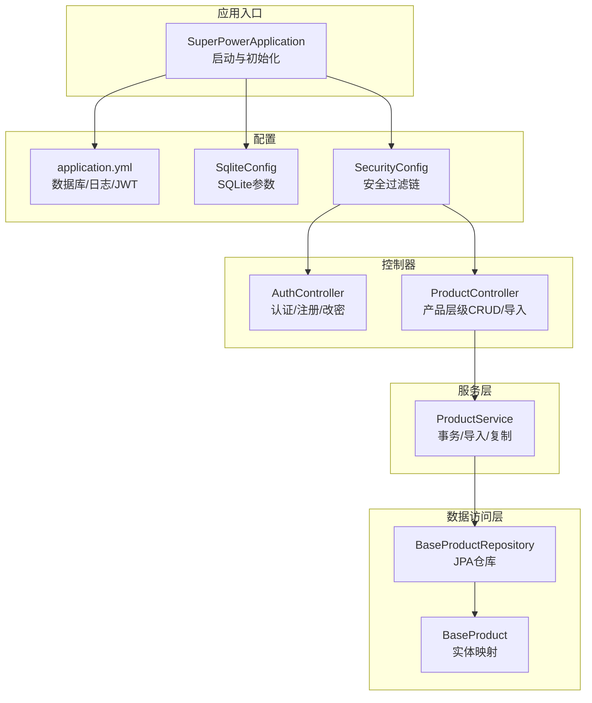
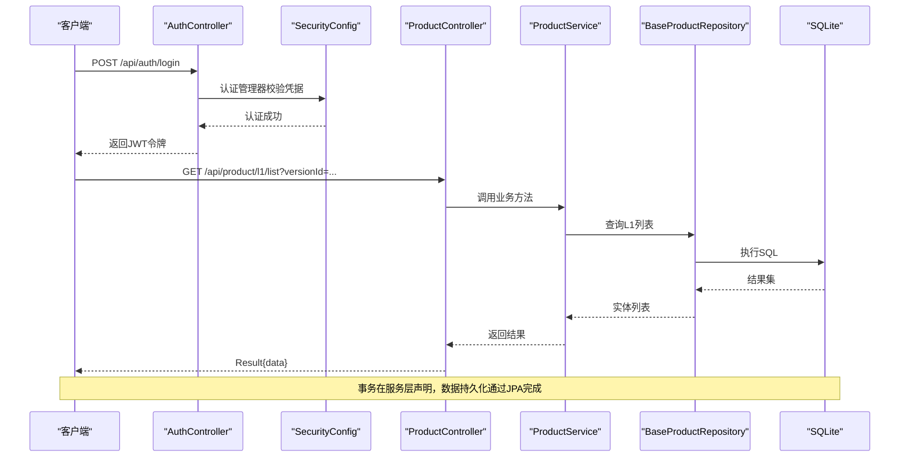
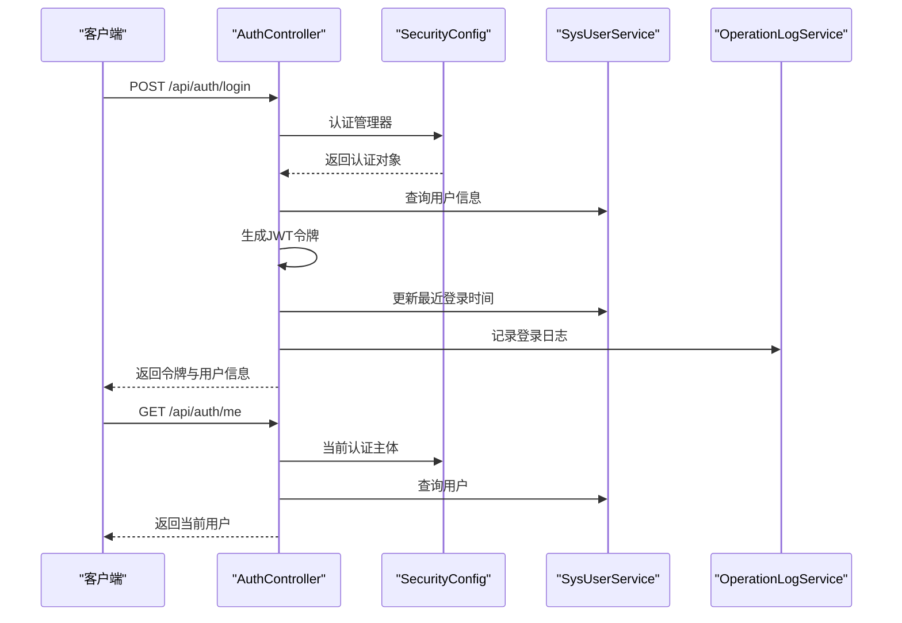
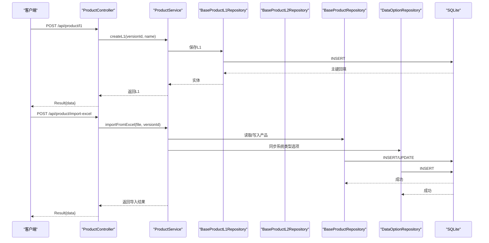
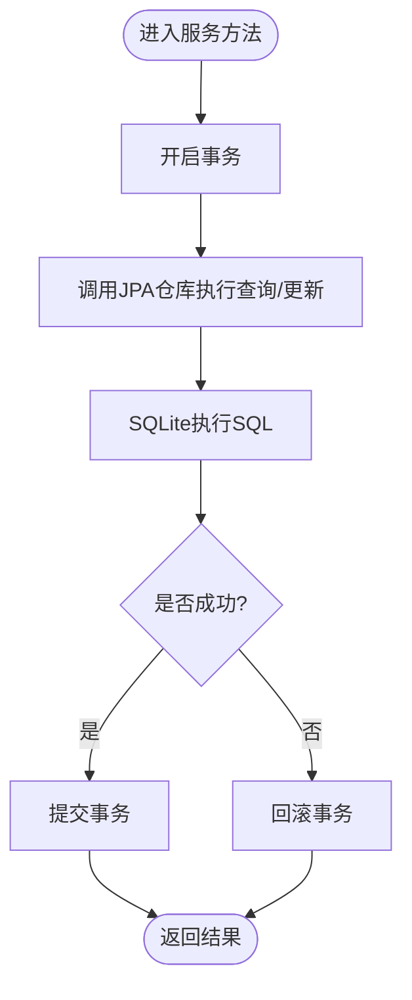
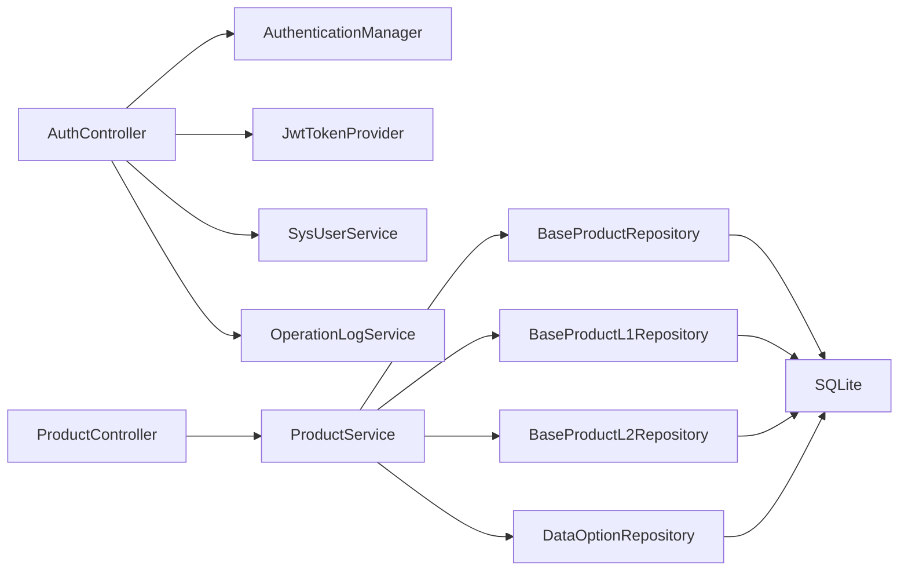

# 集成测试

<cite>
**本文引用的文件**
- [SuperPowerApplication.java](file://src/main/java/com/superpower/SuperPowerApplication.java)
- [application.yml](file://src/main/resources/application.yml)
- [SqliteConfig.java](file://src/main/java/com/superpower/config/SqliteConfig.java)
- [SecurityConfig.java](file://src/main/java/com/superpower/config/SecurityConfig.java)
- [AuthController.java](file://src/main/java/com/superpower/modules/system/controller/AuthController.java)
- [ProductController.java](file://src/main/java/com/superpower/modules/category/controller/ProductController.java)
- [ProductService.java](file://src/main/java/com/superpower/modules/category/service/ProductService.java)
- [BaseProductRepository.java](file://src/main/java/com/superpower/modules/category/repository/BaseProductRepository.java)
- [BaseProduct.java](file://src/main/java/com/superpower/modules/category/entity/BaseProduct.java)
- [CustomTabServiceTest.java](file://src/test/java/com/superpower/modules/customtab/service/CustomTabServiceTest.java)
- [DataEntryServiceTest.java](file://src/test/java/com/superpower/modules/data/service/DataEntryServiceTest.java)
- [DocumentServiceTest.java](file://src/test/java/com/superpower/modules/document/service/DocumentServiceTest.java)
</cite>

## 目录
1. [引言](#引言)
2. [项目结构](#项目结构)
3. [核心组件](#核心组件)
4. [架构总览](#架构总览)
5. [详细组件分析](#详细组件分析)
6. [依赖分析](#依赖分析)
7. [性能考虑](#性能考虑)
8. [故障排查指南](#故障排查指南)
9. [结论](#结论)
10. [附录](#附录)

## 引言
本文件面向产品清单管理系统，构建一套完整的集成测试体系，重点覆盖以下方面：
- 多模块间交互与数据流转的端到端测试
- 服务层与数据访问层的集成测试
- Spring Boot Test 框架的使用与测试配置
- RESTful API 的端到端测试与响应验证
- 数据库集成测试策略（测试数据准备与事务回滚）
- 外部依赖模拟与测试环境搭建
- 测试环境配置与测试数据管理策略

## 项目结构
系统采用 Spring Boot 单体架构，后端以模块化包结构组织，核心模块包括系统管理、产品分类、数据条目、文档生成等。测试位于独立的 test 目录，当前已有部分服务层单元测试，建议在此基础上扩展为集成测试。

图表来源
- [SuperPowerApplication.java:17-42](file://src/main/java/com/superpower/SuperPowerApplication.java#L17-L42)
- [application.yml:11-40](file://src/main/resources/application.yml#L11-L40)
- [SqliteConfig.java:11-39](file://src/main/java/com/superpower/config/SqliteConfig.java#L11-L39)
- [SecurityConfig.java:17-56](file://src/main/java/com/superpower/config/SecurityConfig.java#L17-L56)
- [AuthController.java:22-98](file://src/main/java/com/superpower/modules/system/controller/AuthController.java#L22-L98)
- [ProductController.java:14-88](file://src/main/java/com/superpower/modules/category/controller/ProductController.java#L14-L88)
- [ProductService.java:22-356](file://src/main/java/com/superpower/modules/category/service/ProductService.java#L22-L356)
- [BaseProductRepository.java:12-22](file://src/main/java/com/superpower/modules/category/repository/BaseProductRepository.java#L12-L22)
- [BaseProduct.java:7-39](file://src/main/java/com/superpower/modules/category/entity/BaseProduct.java#L7-L39)

章节来源
- [SuperPowerApplication.java:17-42](file://src/main/java/com/superpower/SuperPowerApplication.java#L17-L42)
- [application.yml:11-40](file://src/main/resources/application.yml#L11-L40)

## 核心组件
- 应用入口与初始化：负责时区设置、角色/用户/版本初始化，确保测试环境具备基础数据。
- 配置层：数据库连接（SQLite）、JPA/Hibernate、日志级别、JWT 密钥与过期时间。
- 安全层：基于 JWT 的无状态认证，开放特定路径，其余接口需鉴权。
- 控制器层：认证控制器与产品控制器，提供 REST API 端点。
- 服务层：产品服务封装业务逻辑、事务控制与 Excel 导入。
- 数据访问层：JPA 仓库与实体映射，支持按版本与层级查询及批量清理。

章节来源
- [SuperPowerApplication.java:35-80](file://src/main/java/com/superpower/SuperPowerApplication.java#L35-L80)
- [application.yml:18-39](file://src/main/resources/application.yml#L18-L39)
- [SecurityConfig.java:27-55](file://src/main/java/com/superpower/config/SecurityConfig.java#L27-L55)
- [AuthController.java:44-96](file://src/main/java/com/superpower/modules/system/controller/AuthController.java#L44-L96)
- [ProductController.java:24-86](file://src/main/java/com/superpower/modules/category/controller/ProductController.java#L24-L86)
- [ProductService.java:50-348](file://src/main/java/com/superpower/modules/category/service/ProductService.java#L50-L348)
- [BaseProductRepository.java:12-21](file://src/main/java/com/superpower/modules/category/repository/BaseProductRepository.java#L12-L21)
- [BaseProduct.java:10-38](file://src/main/java/com/superpower/modules/category/entity/BaseProduct.java#L10-L38)

## 架构总览
下图展示从客户端到数据库的典型调用链路，涵盖认证、授权、控制器、服务与数据访问层。

图表来源
- [AuthController.java:44-60](file://src/main/java/com/superpower/modules/system/controller/AuthController.java#L44-L60)
- [SecurityConfig.java:27-44](file://src/main/java/com/superpower/config/SecurityConfig.java#L27-L44)
- [ProductController.java:25-28](file://src/main/java/com/superpower/modules/category/controller/ProductController.java#L25-L28)
- [ProductService.java:40-48](file://src/main/java/com/superpower/modules/category/service/ProductService.java#L40-L48)
- [BaseProductRepository.java:13-14](file://src/main/java/com/superpower/modules/category/repository/BaseProductRepository.java#L13-L14)

## 详细组件分析

### 组件A：认证与授权集成测试
目标：验证登录、获取当前用户、注册、改密流程，确保安全过滤链正确拦截未授权请求。

图表来源
- [AuthController.java:44-66](file://src/main/java/com/superpower/modules/system/controller/AuthController.java#L44-L66)
- [SecurityConfig.java:27-44](file://src/main/java/com/superpower/config/SecurityConfig.java#L27-L44)

章节来源
- [AuthController.java:44-96](file://src/main/java/com/superpower/modules/system/controller/AuthController.java#L44-L96)
- [SecurityConfig.java:27-55](file://src/main/java/com/superpower/config/SecurityConfig.java#L27-L55)

### 组件B：产品分类与数据导入集成测试
目标：验证产品层级 CRUD、排序更新、Excel 导入与系统类型选项同步。

图表来源
- [ProductController.java:30-33](file://src/main/java/com/superpower/modules/category/controller/ProductController.java#L30-L33)
- [ProductController.java:81-86](file://src/main/java/com/superpower/modules/category/controller/ProductController.java#L81-L86)
- [ProductService.java:50-58](file://src/main/java/com/superpower/modules/category/service/ProductService.java#L50-L58)
- [ProductService.java:235-348](file://src/main/java/com/superpower/modules/category/service/ProductService.java#L235-L348)
- [BaseProductRepository.java:13-15](file://src/main/java/com/superpower/modules/category/repository/BaseProductRepository.java#L13-L15)

章节来源
- [ProductController.java:24-86](file://src/main/java/com/superpower/modules/category/controller/ProductController.java#L24-L86)
- [ProductService.java:50-348](file://src/main/java/com/superpower/modules/category/service/ProductService.java#L50-L348)
- [BaseProductRepository.java:12-21](file://src/main/java/com/superpower/modules/category/repository/BaseProductRepository.java#L12-L21)

### 组件C：服务层与数据访问层集成测试（流程）
目标：验证服务层事务边界、数据一致性与仓库查询行为。

图表来源
- [ProductService.java:50-174](file://src/main/java/com/superpower/modules/category/service/ProductService.java#L50-L174)
- [BaseProductRepository.java:13-21](file://src/main/java/com/superpower/modules/category/repository/BaseProductRepository.java#L13-L21)

章节来源
- [ProductService.java:50-174](file://src/main/java/com/superpower/modules/category/service/ProductService.java#L50-L174)
- [BaseProductRepository.java:12-21](file://src/main/java/com/superpower/modules/category/repository/BaseProductRepository.java#L12-L21)

### 组件D：现有测试文件概览与扩展建议
- CustomTabServiceTest：验证自定义清单创建、条目添加、删除清理逻辑。建议扩展为集成测试，注入真实仓库并配合事务回滚。
- DataEntryServiceTest：验证版本发布状态下的更新/删除/排序限制与草稿状态允许创建等。建议补充对仓库查询参数透传的集成验证。
- DocumentServiceTest：验证文档生成产物包含内置标题样式。建议扩展为端到端测试，结合控制器与服务层。

章节来源
- [CustomTabServiceTest.java:32-77](file://src/test/java/com/superpower/modules/customtab/service/CustomTabServiceTest.java#L32-L77)
- [DataEntryServiceTest.java:61-126](file://src/test/java/com/superpower/modules/data/service/DataEntryServiceTest.java#L61-L126)
- [DocumentServiceTest.java:35-58](file://src/test/java/com/superpower/modules/document/service/DocumentServiceTest.java#L35-L58)

## 依赖分析
- 组件耦合：控制器依赖服务；服务依赖仓库；仓库依赖 JPA/Hibernate 与 SQLite。
- 外部依赖：JWT 令牌生成、Apache POI（Excel 导入）、SQLite JDBC。
- 安全依赖：Spring Security 无状态会话策略，JWT 过滤器链。

图表来源
- [AuthController.java:26-42](file://src/main/java/com/superpower/modules/system/controller/AuthController.java#L26-L42)
- [ProductController.java:18-22](file://src/main/java/com/superpower/modules/category/controller/ProductController.java#L18-L22)
- [ProductService.java:25-38](file://src/main/java/com/superpower/modules/category/service/ProductService.java#L25-L38)
- [BaseProductRepository.java:12-21](file://src/main/java/com/superpower/modules/category/repository/BaseProductRepository.java#L12-L21)

章节来源
- [AuthController.java:22-98](file://src/main/java/com/superpower/modules/system/controller/AuthController.java#L22-L98)
- [ProductController.java:14-88](file://src/main/java/com/superpower/modules/category/controller/ProductController.java#L14-L88)
- [ProductService.java:22-356](file://src/main/java/com/superpower/modules/category/service/ProductService.java#L22-L356)
- [BaseProductRepository.java:12-22](file://src/main/java/com/superpower/modules/category/repository/BaseProductRepository.java#L12-L22)

## 性能考虑
- 数据库连接池：Hikari 最大连接数与超时配置需结合并发测试场景调整。
- 事务范围：服务层方法使用事务，避免长事务占用连接；批量导入建议分批处理。
- 日志级别：测试阶段可提高调试日志，便于定位问题；生产关闭冗余日志。
- SQLite 参数：WAL 模式与 busy_timeout 已配置，保障并发写入稳定性。

章节来源
- [application.yml:21-24](file://src/main/resources/application.yml#L21-L24)
- [application.yml:25-34](file://src/main/resources/application.yml#L25-L34)
- [SqliteConfig.java:21-38](file://src/main/java/com/superpower/config/SqliteConfig.java#L21-L38)

## 故障排查指南
- 认证失败：检查 SecurityConfig 中放行路径与角色权限；确认 JWT 密钥与过期时间配置一致。
- 数据库连接异常：核对 application.yml 中 SQLite JDBC 驱动与 URL；确认 busy_timeout 设置。
- 事务未生效：确认服务方法标注事务注解；避免同类内部调用导致代理失效。
- Excel 导入错误：检查导入模板格式与字段顺序；关注空行与重复项处理。

章节来源
- [SecurityConfig.java:27-44](file://src/main/java/com/superpower/config/SecurityConfig.java#L27-L44)
- [application.yml:18-20](file://src/main/resources/application.yml#L18-L20)
- [ProductService.java:235-348](file://src/main/java/com/superpower/modules/category/service/ProductService.java#L235-L348)

## 结论
通过在现有服务层单元测试基础上引入 Spring Boot Test 的集成测试，结合控制器端到端验证、服务层事务与仓库交互验证、以及数据库与外部依赖的模拟/替换策略，可以有效保证多模块协作的稳定性与一致性。建议优先覆盖认证流程、产品分类主流程与 Excel 导入流程，并配套完善的测试数据准备与回滚机制。

## 附录

### A. Spring Boot Test 框架与测试配置
- 使用场景：加载完整上下文，进行端到端集成测试。
- 建议配置：
  - 测试数据库：使用内存或独立测试库，避免污染生产数据。
  - 事务回滚：在测试方法上使用事务并在结束后回滚。
  - 外部依赖模拟：对外部系统（如文件存储）使用 Mock 或临时目录。
  - 安全配置：测试时可放宽放行规则或提供测试令牌。

章节来源
- [application.yml:11-40](file://src/main/resources/application.yml#L11-L40)
- [SecurityConfig.java:27-44](file://src/main/java/com/superpower/config/SecurityConfig.java#L27-L44)

### B. API 集成测试方法与示例路径
- 登录与鉴权：参考控制器路径与参数，构造请求并断言响应结构与状态码。
- 产品层级操作：覆盖 L1/L2/L3 的增删改查与排序更新。
- Excel 导入：上传文件并断言导入结果与数据库变更。

章节来源
- [AuthController.java:44-96](file://src/main/java/com/superpower/modules/system/controller/AuthController.java#L44-L96)
- [ProductController.java:24-86](file://src/main/java/com/superpower/modules/category/controller/ProductController.java#L24-L86)

### C. 数据库集成测试策略
- 测试数据准备：在应用启动时初始化基础角色、用户与版本；测试中按需插入最小必要数据。
- 事务回滚：使用测试框架提供的事务回滚能力，确保测试隔离性。
- 清理策略：测试完成后清理新增数据，避免影响后续测试。

章节来源
- [SuperPowerApplication.java:44-80](file://src/main/java/com/superpower/SuperPowerApplication.java#L44-L80)
- [BaseProductRepository.java:18-20](file://src/main/java/com/superpower/modules/category/repository/BaseProductRepository.java#L18-L20)

### D. 外部依赖模拟与测试环境搭建
- 文件存储：使用临时目录或内存存储替代真实文件系统。
- 第三方服务：使用 WireMock 或 Testcontainers 替代真实外部服务。
- 环境变量：通过 application.yml 或测试专用配置文件覆盖默认值。

章节来源
- [application.yml:35-39](file://src/main/resources/application.yml#L35-L39)