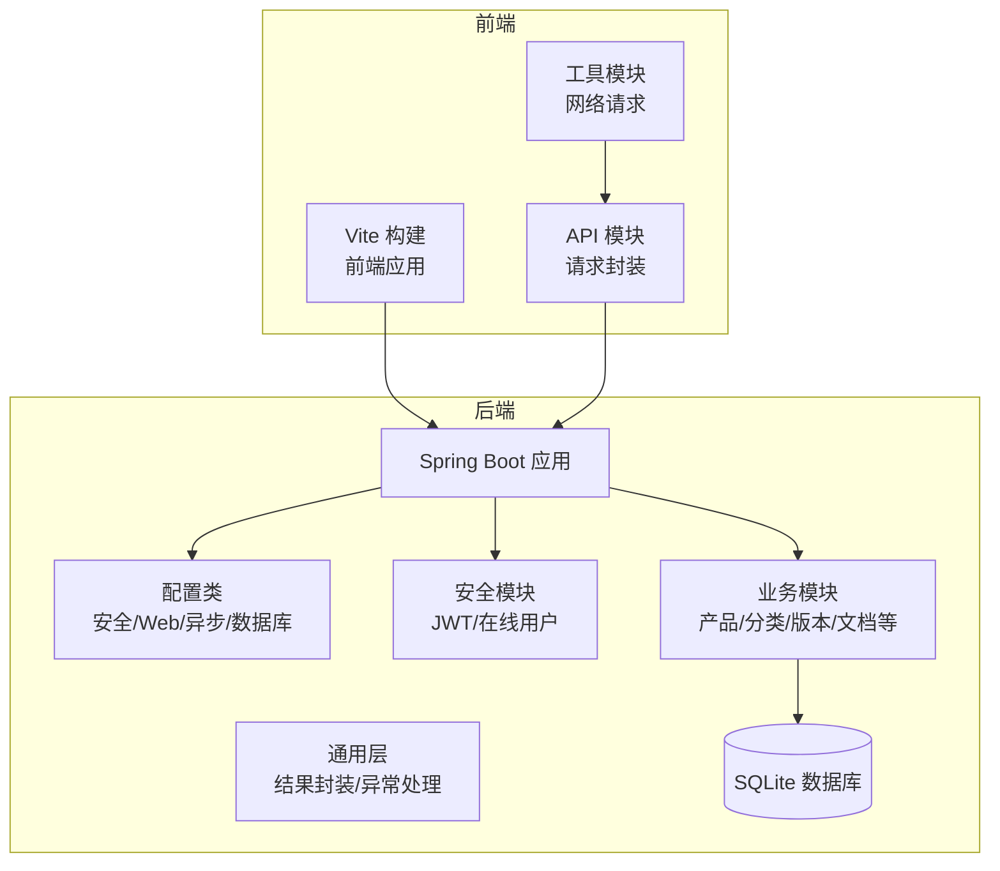
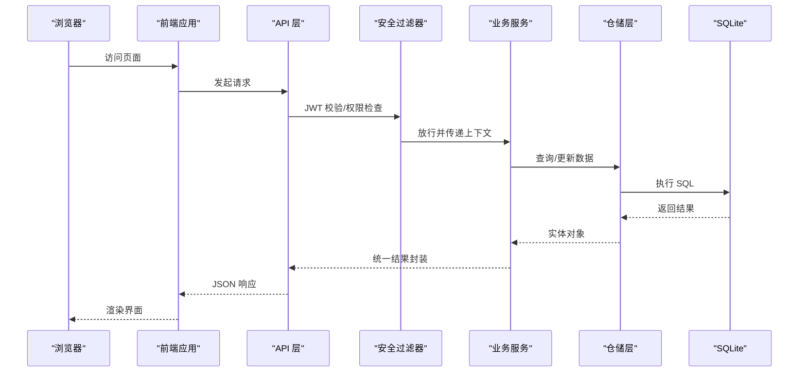
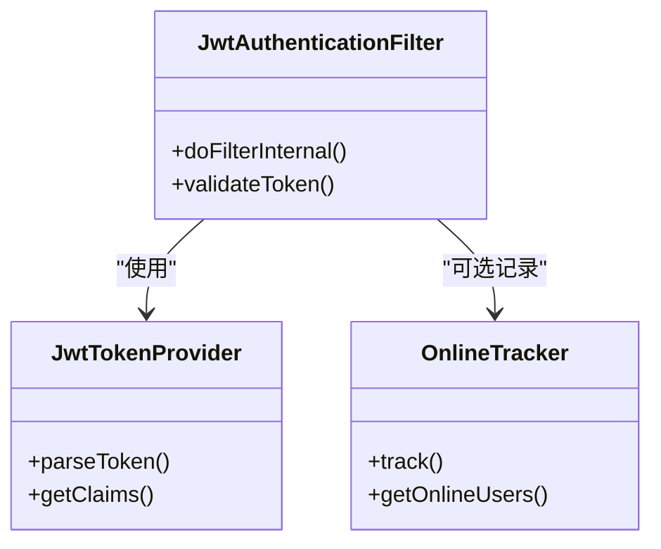
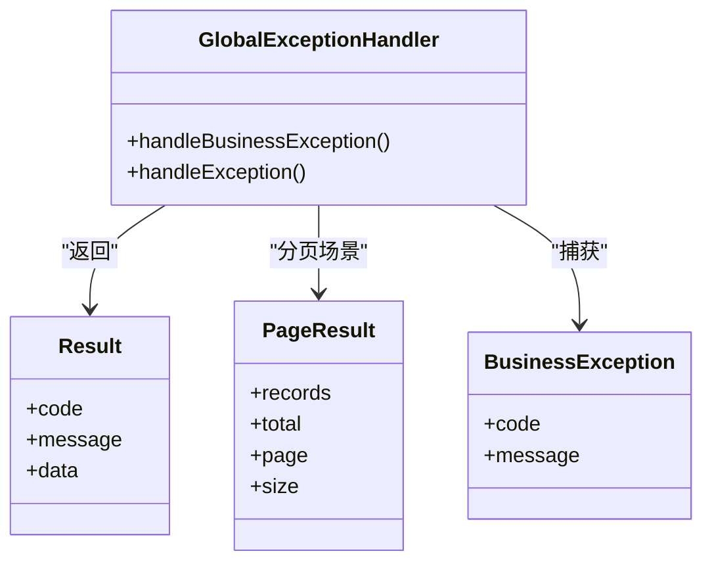
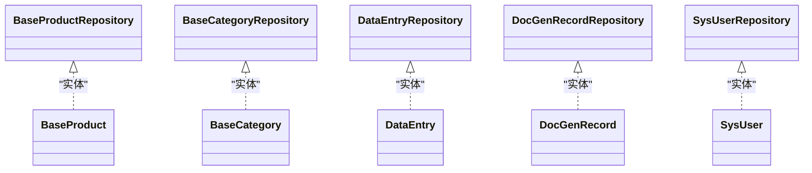
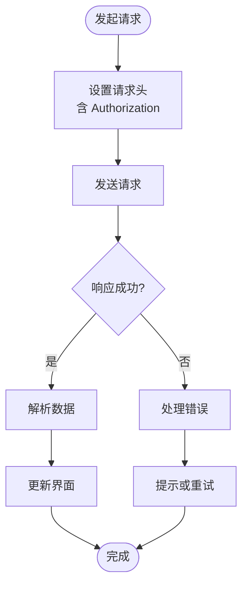
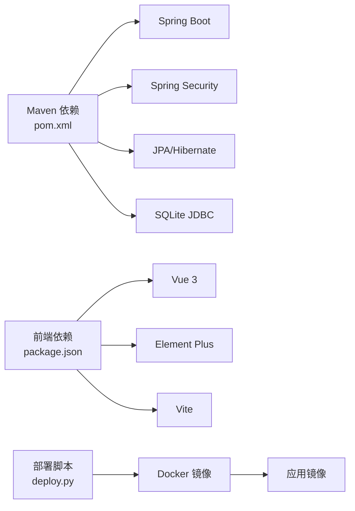
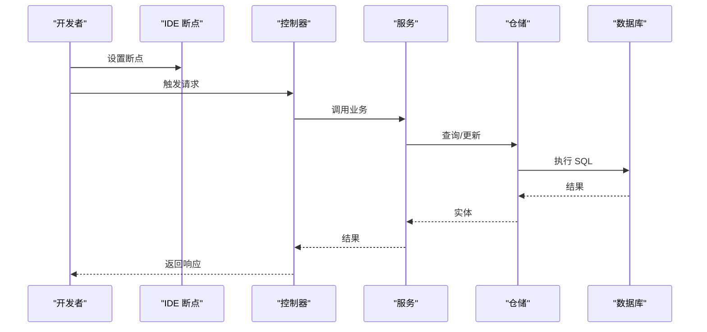

# 调试技巧与性能优化

<cite>
**本文引用的文件**
- [application.yml](file://src/main/resources/application.yml)
- [pom.xml](file://pom.xml)
- [Dockerfile](file://Dockerfile)
- [deploy.py](file://deploy.py)
- [vite.config.js](file://frontend/vite.config.js)
- [package.json](file://frontend/package.json)
- [GlobalExceptionHandler.java](file://src/main/java/com/superpower/common/GlobalExceptionHandler.java)
- [BusinessException.java](file://src/main/java/com/superpower/common/BusinessException.java)
- [Result.java](file://src/main/java/com/superpower/common/Result.java)
- [ResultCode.java](file://src/main/java/com/superpower/common/ResultCode.java)
- [PageResult.java](file://src/main/java/com/superpower/common/PageResult.java)
- [SecurityConfig.java](file://src/main/java/com/superpower/config/SecurityConfig.java)
- [WebMvcConfig.java](file://src/main/java/com/superpower/config/WebMvcConfig.java)
- [SqliteConfig.java](file://src/main/java/com/superpower/config/SqliteConfig.java)
- [AsyncConfig.java](file://src/main/java/com/superpower/config/AsyncConfig.java)
- [JwtAuthenticationFilter.java](file://src/main/java/com/superpower/security/JwtAuthenticationFilter.java)
- [JwtTokenProvider.java](file://src/main/java/com/superpower/security/JwtTokenProvider.java)
- [OnlineTracker.java](file://src/main/java/com/superpower/security/OnlineTracker.java)
- [BaseProductRepository.java](file://src/main/java/com/superpower/modules/category/repository/BaseProductRepository.java)
- [BaseCategoryRepository.java](file://src/main/java/com/superpower/modules/category/repository/BaseCategoryRepository.java)
- [DataEntryRepository.java](file://src/main/java/com/superpower/modules/data/repository/DataEntryRepository.java)
- [DocGenRecordRepository.java](file://src/main/java/com/superpower/modules/document/repository/DocGenRecordRepository.java)
- [SysUserRepository.java](file://src/main/java/com/superpower/modules/system/repository/SysUserRepository.java)
- [request.js](file://frontend/src/utils/request.js)
- [product.js](file://frontend/src/api/product.js)
- [category.js](file://frontend/src/api/category.js)
- [version.js](file://frontend/src/api/version.js)
- [image.js](file://frontend/src/api/image.js)
- [requirement.js](file://frontend/src/api/requirement.js)
- [maintenance.js](file://frontend/src/api/maintenance.js)
- [operationLog.js](file://frontend/src/api/operationLog.js)
- [auth.js](file://frontend/src/api/auth.js)
- [CustomTabService.java](file://src/main/java/com/superpower/modules/customtab/service/CustomTabService.java)
- [DataEntryService.java](file://src/main/java/com/superpower/modules/data/service/DataEntryService.java)
- [DocumentService.java](file://src/main/java/com/superpower/modules/document/service/DocumentService.java)
- [ImageResourceService.java](file://src/main/java/com/superpower/modules/image/service/ImageResourceService.java)
- [RequirementService.java](file://src/main/java/com/superpower/modules/requirement/service/RequirementService.java)
- [SysUserService.java](file://src/main/java/com/superpower/modules/system/service/SysUserService.java)
- [DataVersionService.java](file://src/main/java/com/superpower/modules/version/service/DataVersionService.java)
- [ApprovalService.java](file://src/main/java/com/superpower/modules/approval/service/ApprovalService.java)
- [CategoryService.java](file://src/main/java/com/superpower/modules/category/service/CategoryService.java)
- [ProductService.java](file://src/main/java/com/superpower/modules/category/service/ProductService.java)
- [MaintenanceService.java](file://src/main/java/com/superpower/modules/system/service/MaintenanceService.java)
- [OperationLogService.java](file://src/main/java/com/superpower/modules/system/service/OperationLogService.java)
- [SysRoleService.java](file://src/main/java/com/superpower/modules/system/service/SysRoleService.java)
- [DataInitializer.java](file://src/main/java/com/superpower/modules/category/service/DataInitializer.java)
- [SuperPowerApplication.java](file://src/main/java/com/superpower/SuperPowerApplication.java)
</cite>

## 目录
1. [简介](#简介)
2. [项目结构](#项目结构)
3. [核心组件](#核心组件)
4. [架构总览](#架构总览)
5. [详细组件分析](#详细组件分析)
6. [依赖分析](#依赖分析)
7. [性能考虑](#性能考虑)
8. [故障排查指南](#故障排查指南)
9. [结论](#结论)
10. [附录](#附录)

## 简介
本指南面向产品清单管理系统的开发者与运维人员，聚焦于开发与生产环境的调试方法、日志分析与错误追踪，以及性能瓶颈识别与优化策略（数据库查询、缓存、前端性能）。文档同时提供内存使用监控与垃圾回收调优建议，并总结常见性能问题的诊断与解决方案，帮助快速定位与解决问题。

## 项目结构
系统采用前后端分离架构：后端基于 Spring Boot（Java），前端基于 Vue 3 + Vite。数据库配置支持 SQLite，部署通过 Docker 完成，提供一键部署脚本。



**图表来源**
- [SuperPowerApplication.java](file://src/main/java/com/superpower/SuperPowerApplication.java)
- [WebMvcConfig.java](file://src/main/java/com/superpower/config/WebMvcConfig.java)
- [SecurityConfig.java](file://src/main/java/com/superpower/config/SecurityConfig.java)
- [SqliteConfig.java](file://src/main/java/com/superpower/config/SqliteConfig.java)
- [vite.config.js](file://frontend/vite.config.js)

**章节来源**
- [SuperPowerApplication.java](file://src/main/java/com/superpower/SuperPowerApplication.java)
- [pom.xml](file://pom.xml)
- [Dockerfile](file://Dockerfile)
- [application.yml](file://src/main/resources/application.yml)
- [vite.config.js](file://frontend/vite.config.js)

## 核心组件
- 后端通用层：统一响应包装、分页结果、全局异常处理，便于调试与日志追踪。
- 安全与认证：基于 JWT 的过滤器链与在线用户跟踪，保障接口安全与审计。
- 配置体系：Web MVC、异步任务、数据库（SQLite）配置，影响性能与并发行为。
- 业务服务：产品、分类、版本、文档、需求、系统管理等模块的服务层，承载主要业务逻辑。
- 前端 API 与工具：统一的请求封装与各功能模块 API，便于前端调试与性能分析。

**章节来源**
- [Result.java](file://src/main/java/com/superpower/common/Result.java)
- [PageResult.java](file://src/main/java/com/superpower/common/PageResult.java)
- [GlobalExceptionHandler.java](file://src/main/java/com/superpower/common/GlobalExceptionHandler.java)
- [BusinessException.java](file://src/main/java/com/superpower/common/BusinessException.java)
- [JwtAuthenticationFilter.java](file://src/main/java/com/superpower/security/JwtAuthenticationFilter.java)
- [OnlineTracker.java](file://src/main/java/com/superpower/security/OnlineTracker.java)
- [WebMvcConfig.java](file://src/main/java/com/superpower/config/WebMvcConfig.java)
- [AsyncConfig.java](file://src/main/java/com/superpower/config/AsyncConfig.java)
- [SqliteConfig.java](file://src/main/java/com/superpower/config/SqliteConfig.java)

## 架构总览
后端通过 Spring MVC 接收请求，经安全过滤器链与业务服务处理后访问数据库；前端通过 Vite 开发服务器运行，构建产物部署到 Nginx 或容器中。



**图表来源**
- [JwtAuthenticationFilter.java](file://src/main/java/com/superpower/security/JwtAuthenticationFilter.java)
- [WebMvcConfig.java](file://src/main/java/com/superpower/config/WebMvcConfig.java)
- [BaseProductRepository.java](file://src/main/java/com/superpower/modules/category/repository/BaseProductRepository.java)
- [SqliteConfig.java](file://src/main/java/com/superpower/config/SqliteConfig.java)

## 详细组件分析

### 安全与认证组件
- JWT 过滤器负责解析与验证令牌，失败时返回统一错误格式，便于前端识别与跳转登录。
- 在线用户跟踪用于统计在线状态与操作日志，有助于审计与异常定位。



**图表来源**
- [JwtAuthenticationFilter.java](file://src/main/java/com/superpower/security/JwtAuthenticationFilter.java)
- [JwtTokenProvider.java](file://src/main/java/com/superpower/security/JwtTokenProvider.java)
- [OnlineTracker.java](file://src/main/java/com/superpower/security/OnlineTracker.java)

**章节来源**
- [JwtAuthenticationFilter.java](file://src/main/java/com/superpower/security/JwtAuthenticationFilter.java)
- [JwtTokenProvider.java](file://src/main/java/com/superpower/security/JwtTokenProvider.java)
- [OnlineTracker.java](file://src/main/java/com/superpower/security/OnlineTracker.java)

### 通用响应与异常处理
- 统一结果封装与分页结果，确保前后端交互一致性。
- 全局异常处理器捕获业务异常与未捕获异常，返回标准化错误码与消息，利于日志聚合与问题定位。



**图表来源**
- [Result.java](file://src/main/java/com/superpower/common/Result.java)
- [PageResult.java](file://src/main/java/com/superpower/common/PageResult.java)
- [BusinessException.java](file://src/main/java/com/superpower/common/BusinessException.java)
- [GlobalExceptionHandler.java](file://src/main/java/com/superpower/common/GlobalExceptionHandler.java)

**章节来源**
- [Result.java](file://src/main/java/com/superpower/common/Result.java)
- [PageResult.java](file://src/main/java/com/superpower/common/PageResult.java)
- [BusinessException.java](file://src/main/java/com/superpower/common/BusinessException.java)
- [GlobalExceptionHandler.java](file://src/main/java/com/superpower/common/GlobalExceptionHandler.java)

### 数据访问层（仓储）
- 产品、分类、数据条目、文档生成记录、系统用户等仓储接口，承载查询与更新逻辑。
- 建议在高频查询上添加索引与复合索引，避免 N+1 查询，结合分页与投影减少数据传输。



**图表来源**
- [BaseProductRepository.java](file://src/main/java/com/superpower/modules/category/repository/BaseProductRepository.java)
- [BaseCategoryRepository.java](file://src/main/java/com/superpower/modules/category/repository/BaseCategoryRepository.java)
- [DataEntryRepository.java](file://src/main/java/com/superpower/modules/data/repository/DataEntryRepository.java)
- [DocGenRecordRepository.java](file://src/main/java/com/superpower/modules/document/repository/DocGenRecordRepository.java)
- [SysUserRepository.java](file://src/main/java/com/superpower/modules/system/repository/SysUserRepository.java)

**章节来源**
- [BaseProductRepository.java](file://src/main/java/com/superpower/modules/category/repository/BaseProductRepository.java)
- [BaseCategoryRepository.java](file://src/main/java/com/superpower/modules/category/repository/BaseCategoryRepository.java)
- [DataEntryRepository.java](file://src/main/java/com/superpower/modules/data/repository/DataEntryRepository.java)
- [DocGenRecordRepository.java](file://src/main/java/com/superpower/modules/document/repository/DocGenRecordRepository.java)
- [SysUserRepository.java](file://src/main/java/com/superpower/modules/system/repository/SysUserRepository.java)

### 业务服务层
- 产品、分类、版本、文档、需求、系统管理、维护、审批等服务，实现核心业务流程。
- 建议对热点数据引入缓存，对批量操作使用批处理与事务控制，避免长事务锁表。

```mermaid
classDiagram
class ProductService
class CategoryService
class DataVersionService
class DocumentService
class RequirementService
class SysUserService
class MaintenanceService
class ApprovalService
class DataEntryService
class ImageResourceService
class SysRoleService
class OperationLogService
class DataInitializer
ProductService --> BaseProductRepository : "依赖"
CategoryService --> BaseCategoryRepository : "依赖"
DataVersionService --> DataVersion : "实体"
DocumentService --> DocGenRecordRepository : "依赖"
RequirementService --> ReqItemRepository : "依赖"
SysUserService --> SysUserRepository : "依赖"
MaintenanceService --> ... : "维护操作"
ApprovalService --> ApprovalLogRepository : "依赖"
DataEntryService --> DataEntryRepository : "依赖"
ImageResourceService --> ImageResourceRepository : "依赖"
SysRoleService --> SysRoleRepository : "依赖"
OperationLogService --> OperationLogRepository : "依赖"
DataInitializer --> ... : "初始化数据"
```

**图表来源**
- [ProductService.java](file://src/main/java/com/superpower/modules/category/service/ProductService.java)
- [CategoryService.java](file://src/main/java/com/superpower/modules/category/service/CategoryService.java)
- [DataVersionService.java](file://src/main/java/com/superpower/modules/version/service/DataVersionService.java)
- [DocumentService.java](file://src/main/java/com/superpower/modules/document/service/DocumentService.java)
- [RequirementService.java](file://src/main/java/com/superpower/modules/requirement/service/RequirementService.java)
- [SysUserService.java](file://src/main/java/com/superpower/modules/system/service/SysUserService.java)
- [MaintenanceService.java](file://src/main/java/com/superpower/modules/system/service/MaintenanceService.java)
- [ApprovalService.java](file://src/main/java/com/superpower/modules/approval/service/ApprovalService.java)
- [DataEntryService.java](file://src/main/java/com/superpower/modules/data/service/DataEntryService.java)
- [ImageResourceService.java](file://src/main/java/com/superpower/modules/image/service/ImageResourceService.java)
- [SysRoleService.java](file://src/main/java/com/superpower/modules/system/service/SysRoleService.java)
- [OperationLogService.java](file://src/main/java/com/superpower/modules/system/service/OperationLogService.java)
- [DataInitializer.java](file://src/main/java/com/superpower/modules/category/service/DataInitializer.java)

**章节来源**
- [ProductService.java](file://src/main/java/com/superpower/modules/category/service/ProductService.java)
- [CategoryService.java](file://src/main/java/com/superpower/modules/category/service/CategoryService.java)
- [DataVersionService.java](file://src/main/java/com/superpower/modules/version/service/DataVersionService.java)
- [DocumentService.java](file://src/main/java/com/superpower/modules/document/service/DocumentService.java)
- [RequirementService.java](file://src/main/java/com/superpower/modules/requirement/service/RequirementService.java)
- [SysUserService.java](file://src/main/java/com/superpower/modules/system/service/SysUserService.java)
- [MaintenanceService.java](file://src/main/java/com/superpower/modules/system/service/MaintenanceService.java)
- [ApprovalService.java](file://src/main/java/com/superpower/modules/approval/service/ApprovalService.java)
- [DataEntryService.java](file://src/main/java/com/superpower/modules/data/service/DataEntryService.java)
- [ImageResourceService.java](file://src/main/java/com/superpower/modules/image/service/ImageResourceService.java)
- [SysRoleService.java](file://src/main/java/com/superpower/modules/system/service/SysRoleService.java)
- [OperationLogService.java](file://src/main/java/com/superpower/modules/system/service/OperationLogService.java)
- [DataInitializer.java](file://src/main/java/com/superpower/modules/category/service/DataInitializer.java)

### 前端 API 与请求封装
- 统一的请求封装与各功能模块 API，便于调试与性能分析。
- 建议在开发模式下开启网络面板，观察请求耗时、重试与缓存命中情况。



**图表来源**
- [request.js](file://frontend/src/utils/request.js)
- [product.js](file://frontend/src/api/product.js)
- [category.js](file://frontend/src/api/category.js)
- [version.js](file://frontend/src/api/version.js)
- [image.js](file://frontend/src/api/image.js)
- [requirement.js](file://frontend/src/api/requirement.js)
- [maintenance.js](file://frontend/src/api/maintenance.js)
- [operationLog.js](file://frontend/src/api/operationLog.js)
- [auth.js](file://frontend/src/api/auth.js)

**章节来源**
- [request.js](file://frontend/src/utils/request.js)
- [product.js](file://frontend/src/api/product.js)
- [category.js](file://frontend/src/api/category.js)
- [version.js](file://frontend/src/api/version.js)
- [image.js](file://frontend/src/api/image.js)
- [requirement.js](file://frontend/src/api/requirement.js)
- [maintenance.js](file://frontend/src/api/maintenance.js)
- [operationLog.js](file://frontend/src/api/operationLog.js)
- [auth.js](file://frontend/src/api/auth.js)

## 依赖分析
- 后端依赖：Spring Boot、Spring Security、JPA/Hibernate、SQLite JDBC、异步任务等。
- 前端依赖：Vue 3、Element Plus、Axios、Vite 等。
- 部署依赖：Docker、Python 部署脚本。



**图表来源**
- [pom.xml](file://pom.xml)
- [package.json](file://frontend/package.json)
- [Dockerfile](file://Dockerfile)
- [deploy.py](file://deploy.py)

**章节来源**
- [pom.xml](file://pom.xml)
- [package.json](file://frontend/package.json)
- [Dockerfile](file://Dockerfile)
- [deploy.py](file://deploy.py)

## 性能考虑

### 数据库查询优化
- 索引策略：为高频查询字段（如产品名称、分类标识、版本号、用户标识）建立索引；复合索引覆盖常用过滤条件。
- 分页与投影：使用分页查询与 DTO 投影，避免 SELECT *，减少网络与序列化开销。
- N+1 查询：避免在循环中逐条加载关联数据，使用 JOIN 或批量加载。
- 事务与锁：批量更新使用批处理与合理事务边界，避免长事务导致锁等待。

### 缓存策略
- 读多写少的数据：引入本地缓存（如 Caffeine）与分布式缓存（Redis），设置合理的过期时间与淘汰策略。
- 缓存穿透：对空值也做短时缓存；布隆过滤器拦截不存在的键。
- 缓存雪崩：随机过期时间；热点数据双写互斥。

### 前端性能优化
- 构建优化：启用代码分割、懒加载、Tree Shaking；生产环境压缩与资源内联策略。
- 请求优化：合并请求、去重请求、缓存响应；合理设置超时与重试。
- 渲染优化：虚拟滚动、防抖节流、组件拆分与按需渲染。

### 内存使用监控与 GC 调优
- JVM 参数：设置堆大小、新生代比例、GC 策略（G1/Parallel），开启 GC 日志。
- 监控指标：堆使用率、GC 次数与耗时、晋升失败、Full GC 频率。
- 分析手段：Heap Dump、GC 日志分析、JFR 采样，定位大对象与泄漏点。

### 常见性能问题与解决方案
- 接口超时：检查慢查询、连接池饱和、线程阻塞；优化 SQL 与增加索引。
- 页面卡顿：排查主线程阻塞、过多重绘、未释放的定时器与事件监听。
- 内存飙升：确认是否存在缓存未清理、大数组/对象未释放、频繁创建临时对象。
- 并发冲突：检查锁粒度与事务范围，避免热点更新串行化。

## 故障排查指南

### 开发环境调试
- IDE 调试配置：设置断点于控制器、服务与仓储层，观察参数、SQL 与异常栈。
- 日志分析：调整日志级别至 DEBUG/TRACE，关注 SQL、请求链路与业务关键节点。
- 错误追踪：利用全局异常处理器输出统一错误码与消息，结合浏览器网络面板定位接口错误。



**图表来源**
- [WebMvcConfig.java](file://src/main/java/com/superpower/config/WebMvcConfig.java)
- [GlobalExceptionHandler.java](file://src/main/java/com/superpower/common/GlobalExceptionHandler.java)
- [BaseProductRepository.java](file://src/main/java/com/superpower/modules/category/repository/BaseProductRepository.java)

**章节来源**
- [WebMvcConfig.java](file://src/main/java/com/superpower/config/WebMvcConfig.java)
- [GlobalExceptionHandler.java](file://src/main/java/com/superpower/common/GlobalExceptionHandler.java)

### 生产环境问题排查
- 日志采集：集中式日志（如 ELK/Fluentd）收集应用与容器日志，设置告警阈值。
- 链路追踪：引入 OpenTelemetry 或 Zipkin，定位慢调用与异常根因。
- 健康检查：暴露健康端点，监控数据库连通性、磁盘空间、CPU/内存使用。
- 快速回滚：容器化部署支持灰度与回滚，配合蓝绿发布降低风险。

### 关键配置与部署
- 应用配置：数据库连接、日志级别、跨域、异步线程池大小等。
- 部署脚本：自动化构建、镜像推送与编排，便于复现与回归测试。

**章节来源**
- [application.yml](file://src/main/resources/application.yml)
- [deploy.py](file://deploy.py)
- [Dockerfile](file://Dockerfile)

## 结论
通过规范的调试流程、完善的日志与异常处理、合理的数据库与缓存策略、以及前端性能优化手段，可以有效提升系统稳定性与用户体验。建议在开发阶段即建立完善的监控与告警机制，持续优化热点路径与资源占用，确保系统在高负载下仍保持稳定高效。

## 附录

### 常用调试命令与工具
- 后端：启动应用、查看日志、JMX/GC 日志、数据库连接测试。
- 前端：Vite 开发服务器、网络面板、性能面板、Vue DevTools。
- 部署：Docker 构建镜像、容器运行、日志查看、回滚策略。

### 关键文件定位
- 后端入口与配置：[SuperPowerApplication.java](file://src/main/java/com/superpower/SuperPowerApplication.java)、[application.yml](file://src/main/resources/application.yml)
- 前端构建与依赖：[vite.config.js](file://frontend/vite.config.js)、[package.json](file://frontend/package.json)
- 部署与打包：[Dockerfile](file://Dockerfile)、[deploy.py](file://deploy.py)