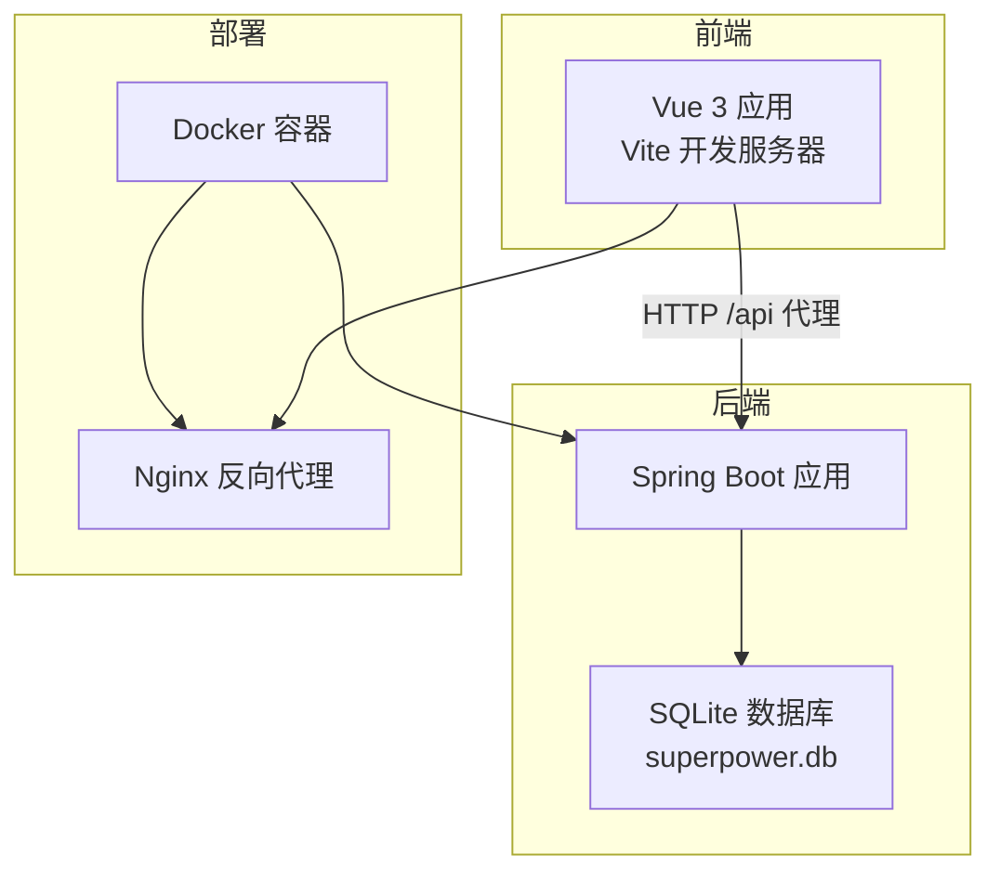
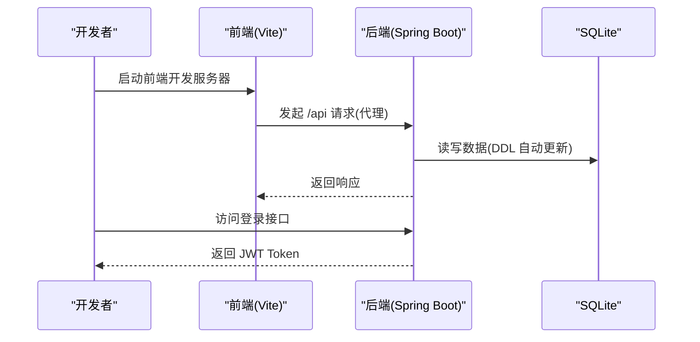
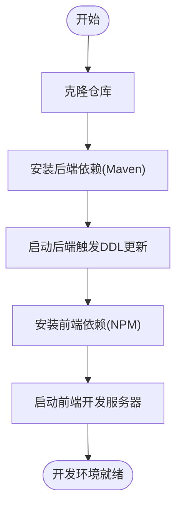
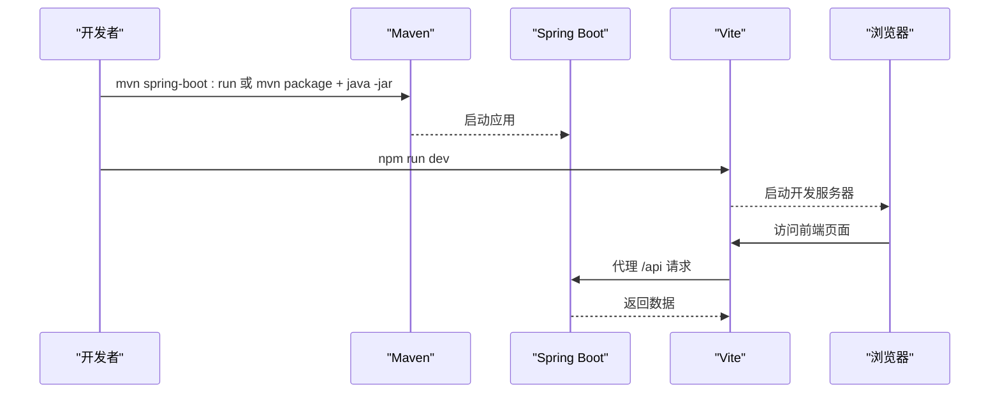
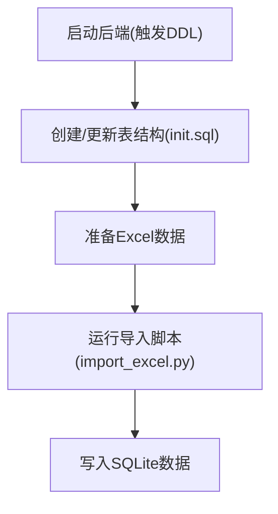
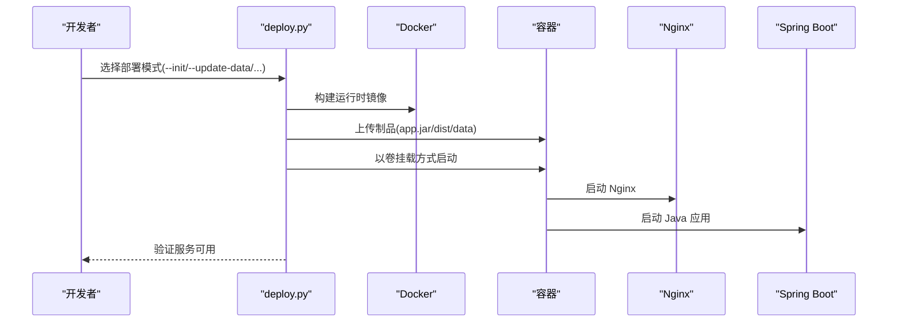
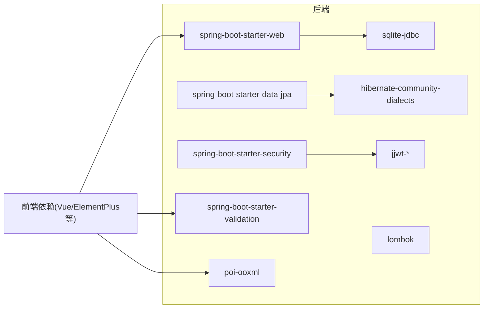

# 快速开始

<cite>
**本文引用的文件**
- [pom.xml](file://pom.xml)
- [application.yml](file://src/main/resources/application.yml)
- [SuperPowerApplication.java](file://src/main/java/com/superpower/SuperPowerApplication.java)
- [init.sql](file://src/main/resources/db/init.sql)
- [Dockerfile](file://Dockerfile)
- [entrypoint.sh](file://docker/entrypoint.sh)
- [deploy.py](file://deploy.py)
- [package.json](file://frontend/package.json)
- [vite.config.js](file://frontend/vite.config.js)
- [import_excel.py](file://import_excel.py)
- [generate_word.py](file://generate_word.py)
- [VERSION.md](file://VERSION.md)
</cite>

## 目录
1. [简介](#简介)
2. [项目结构](#项目结构)
3. [核心组件](#核心组件)
4. [架构总览](#架构总览)
5. [详细组件分析](#详细组件分析)
6. [依赖关系分析](#依赖关系分析)
7. [性能考虑](#性能考虑)
8. [故障排除指南](#故障排除指南)
9. [结论](#结论)
10. [附录](#附录)

## 简介
本指南面向新开发者，帮助你在最短时间内成功运行产品清单管理系统。你将学会：
- 安装并配置 Java 8+、Node.js、Maven 和 Git
- 克隆项目、安装依赖、初始化数据库并启动后端与前端
- 使用 Docker 容器化部署与本地开发环境配置
- 常见问题排查与最佳实践

## 项目结构
项目采用前后端分离架构：
- 后端：Spring Boot（Java 17，使用 SQLite 作为默认数据库）
- 前端：Vue 3 + Vite
- 部署：Docker + Nginx，后端与前端资源通过卷挂载注入

**图表来源**
- [Dockerfile:1-38](file://Dockerfile#L1-L38)
- [entrypoint.sh:1-22](file://docker/entrypoint.sh#L1-L22)
- [application.yml:1-40](file://src/main/resources/application.yml#L1-L40)
- [vite.config.js:1-20](file://frontend/vite.config.js#L1-L20)

**章节来源**
- [Dockerfile:1-38](file://Dockerfile#L1-L38)
- [entrypoint.sh:1-22](file://docker/entrypoint.sh#L1-L22)
- [application.yml:1-40](file://src/main/resources/application.yml#L1-L40)
- [vite.config.js:1-20](file://frontend/vite.config.js#L1-L20)

## 核心组件
- 后端框架与数据库
  - Spring Boot 3.2.0，使用 SQLite 作为默认数据库，JPA/Hibernate 管理实体
  - JWT 安全配置，Jackson 时区设置为 Asia/Shanghai
- 前端框架与开发工具
  - Vue 3 + Element Plus + Vue Router + Pinia，Vite 作为构建与开发服务器
  - 本地开发代理将 /api 前缀转发到后端 8080 端口
- 部署与运行
  - Dockerfile 提供运行时镜像（JRE + Nginx），entrypoint 同时启动 Java 应用与 Nginx
  - deploy.py 支持本地编译与远程容器挂载部署

**章节来源**
- [pom.xml:1-116](file://pom.xml#L1-L116)
- [application.yml:1-40](file://src/main/resources/application.yml#L1-L40)
- [package.json:1-28](file://frontend/package.json#L1-L28)
- [vite.config.js:1-20](file://frontend/vite.config.js#L1-L20)
- [Dockerfile:1-38](file://Dockerfile#L1-L38)
- [entrypoint.sh:1-22](file://docker/entrypoint.sh#L1-L22)
- [deploy.py:1-594](file://deploy.py#L1-L594)

## 架构总览
系统启动流程概览：
- 后端启动时初始化数据库与默认管理员账号
- 前端通过 Vite 开发服务器运行，代理 /api 到后端
- 生产环境通过 Docker 运行，Nginx 提供静态资源与反向代理，Java 应用提供 API

**图表来源**
- [application.yml:1-40](file://src/main/resources/application.yml#L1-L40)
- [vite.config.js:1-20](file://frontend/vite.config.js#L1-L20)
- [SuperPowerApplication.java:1-82](file://src/main/java/com/superpower/SuperPowerApplication.java#L1-L82)

## 详细组件分析

### 环境准备与安装
- Java 8+ → 项目使用 Java 17（Spring Boot 3.2.0），建议安装 JDK 17 或更高版本
- Node.js → 前端依赖与构建工具
- Maven → 后端打包与依赖管理
- Git → 代码版本控制

建议安装方式（以 macOS 为例）：
- Java 17：使用 SDKMAN! 或直接安装 OpenJDK 17
- Node.js：使用 nvm 安装推荐版本
- Maven：使用 Homebrew 安装
- Git：使用 Homebrew 安装

**章节来源**
- [pom.xml:16-19](file://pom.xml#L16-L19)
- [package.json:1-28](file://frontend/package.json#L1-L28)

### 克隆与初始化
- 克隆仓库到本地
- 安装后端依赖：使用 Maven 安装依赖
- 初始化数据库：Spring JPA 的 ddl-auto=update 会在启动时自动创建/更新表结构

**图表来源**
- [application.yml:25-28](file://src/main/resources/application.yml#L25-L28)
- [pom.xml:21-84](file://pom.xml#L21-L84)
- [package.json:1-28](file://frontend/package.json#L1-L28)

**章节来源**
- [application.yml:1-40](file://src/main/resources/application.yml#L1-L40)
- [pom.xml:1-116](file://pom.xml#L1-L116)
- [package.json:1-28](file://frontend/package.json#L1-L28)

### 启动后端与前端
- 启动后端
  - 使用 Maven 打包并运行 Spring Boot 应用
  - 默认端口 8080，日志级别已配置
- 启动前端
  - 在 frontend 目录执行 NPM 脚本启动 Vite 开发服务器
  - 本地代理将 /api 转发到后端 8080 端口

**图表来源**
- [pom.xml:86-114](file://pom.xml#L86-L114)
- [application.yml:1-10](file://src/main/resources/application.yml#L1-L10)
- [vite.config.js:9-18](file://frontend/vite.config.js#L9-L18)

**章节来源**
- [pom.xml:86-114](file://pom.xml#L86-L114)
- [application.yml:1-10](file://src/main/resources/application.yml#L1-L10)
- [vite.config.js:1-20](file://frontend/vite.config.js#L1-L20)

### 数据库初始化与数据导入
- 数据库
  - 默认使用 SQLite，数据源 URL 指向本地文件
  - DDL 自动更新，首次启动会创建所需表
- 数据导入
  - 提供 Excel 导入脚本，将指定 Excel 的数据导入到 SQLite
  - 可根据需要调整脚本中的 Excel 路径与版本 ID

**图表来源**
- [application.yml:18-28](file://src/main/resources/application.yml#L18-L28)
- [init.sql:1-126](file://src/main/resources/db/init.sql#L1-L126)
- [import_excel.py:1-256](file://import_excel.py#L1-L256)

**章节来源**
- [application.yml:18-28](file://src/main/resources/application.yml#L18-L28)
- [init.sql:1-126](file://src/main/resources/db/init.sql#L1-L126)
- [import_excel.py:1-256](file://import_excel.py#L1-L256)

### Docker 容器化部署
- 运行时镜像
  - 基于 Eclipse Temurin 17 JRE，内置 Nginx
  - 通过卷挂载注入 jar、dist、数据库、上传与生成文档目录
- 启动脚本
  - entrypoint 同时启动 Java 应用与 Nginx，健康检查通过 curl 校验
- 部署脚本
  - deploy.py 支持首次部署、日常更新、仅更新数据等多种模式
  - 可交互菜单选择部署动作，支持跳过本地编译与指定制品路径

**图表来源**
- [Dockerfile:1-38](file://Dockerfile#L1-L38)
- [entrypoint.sh:1-22](file://docker/entrypoint.sh#L1-L22)
- [deploy.py:228-346](file://deploy.py#L228-L346)

**章节来源**
- [Dockerfile:1-38](file://Dockerfile#L1-L38)
- [entrypoint.sh:1-22](file://docker/entrypoint.sh#L1-L22)
- [deploy.py:1-594](file://deploy.py#L1-L594)

### 本地开发环境配置
- 前端代理
  - Vite 将 /api 代理到后端 8080 端口，便于前后端联调
- 后端配置
  - application.yml 设置了日志级别、文件上传大小、时区、数据库连接与 JPA 属性
- 默认账号
  - 启动时自动创建管理员与普通用户账号，密码为 123456

**章节来源**
- [vite.config.js:9-18](file://frontend/vite.config.js#L9-L18)
- [application.yml:1-40](file://src/main/resources/application.yml#L1-L40)
- [SuperPowerApplication.java:44-80](file://src/main/java/com/superpower/SuperPowerApplication.java#L44-L80)

## 依赖关系分析
- 后端依赖
  - Spring Web、Data JPA、Security、Validation
  - SQLite JDBC、Hibernate 社区方言、JWT、Apache POI、Lombok、测试依赖
- 前端依赖
  - Vue 3、Element Plus、Vue Router、Pinia、Axios、ECharts、Vite 插件

**图表来源**
- [pom.xml:21-84](file://pom.xml#L21-L84)
- [package.json:11-26](file://frontend/package.json#L11-L26)

**章节来源**
- [pom.xml:21-84](file://pom.xml#L21-L84)
- [package.json:11-26](file://frontend/package.json#L11-L26)

## 性能考虑
- 数据库连接池与超时
  - HikariCP 最大连接数、连接超时、泄漏检测阈值已配置
- 日志与时区
  - 日志级别与 Jackson 时区设置为 Asia/Shanghai，减少时区相关问题
- 前端代理超时
  - Vite 代理超时与后端 Tomcat 连接超时均设置为较长时限，适配大文件上传与复杂请求

**章节来源**
- [application.yml:21-34](file://src/main/resources/application.yml#L21-L34)
- [vite.config.js:12-16](file://frontend/vite.config.js#L12-L16)

## 故障排除指南
- 启动后端报数据库连接错误
  - 检查 application.yml 中的数据库 URL 与驱动类名是否正确
  - 确认 SQLite JDBC 版本与依赖一致
- 前端无法访问 /api
  - 确认 Vite 代理配置指向后端 8080 端口
  - 检查后端是否正常启动且端口未被占用
- Docker 容器启动失败
  - 确认镜像构建成功且制品已上传
  - 检查卷挂载路径与远程目录权限
- 首次部署后页面空白
  - 确认 dist 目录已上传且 Nginx 配置正确
  - 查看容器健康检查与日志输出
- 数据导入异常
  - 检查 Excel 路径与列映射是否与脚本一致
  - 确认数据库版本与导入脚本兼容

**章节来源**
- [application.yml:18-28](file://src/main/resources/application.yml#L18-L28)
- [vite.config.js:9-18](file://frontend/vite.config.js#L9-L18)
- [Dockerfile:25-31](file://Dockerfile#L25-L31)
- [deploy.py:312-346](file://deploy.py#L312-L346)
- [import_excel.py:88-256](file://import_excel.py#L88-L256)

## 结论
通过本指南，你可以完成从环境准备到本地开发与生产部署的全流程。建议优先使用本地开发模式熟悉功能，再过渡到 Docker 容器化部署。遇到问题时，结合日志与本指南的故障排除步骤，通常可以快速定位并解决问题。

## 附录
- 版本与变更说明
  - VERSION.md 记录了当前研发版本与功能变更，可用于了解系统演进与注意事项

**章节来源**
- [VERSION.md:1-277](file://VERSION.md#L1-L277)