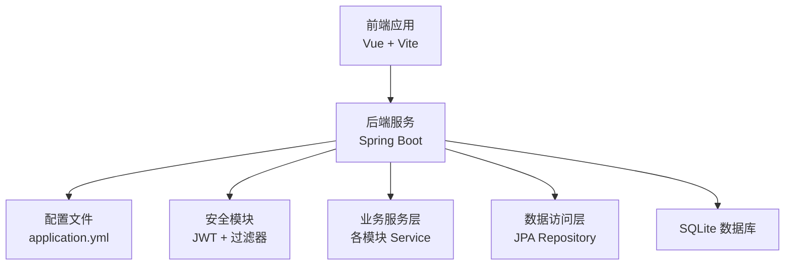
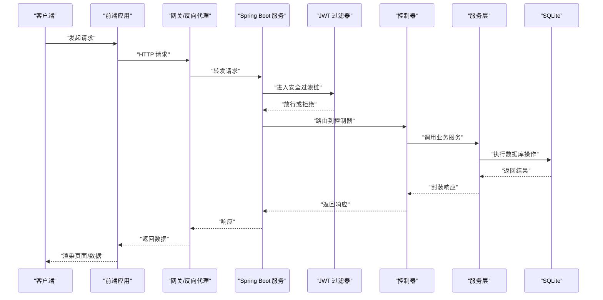
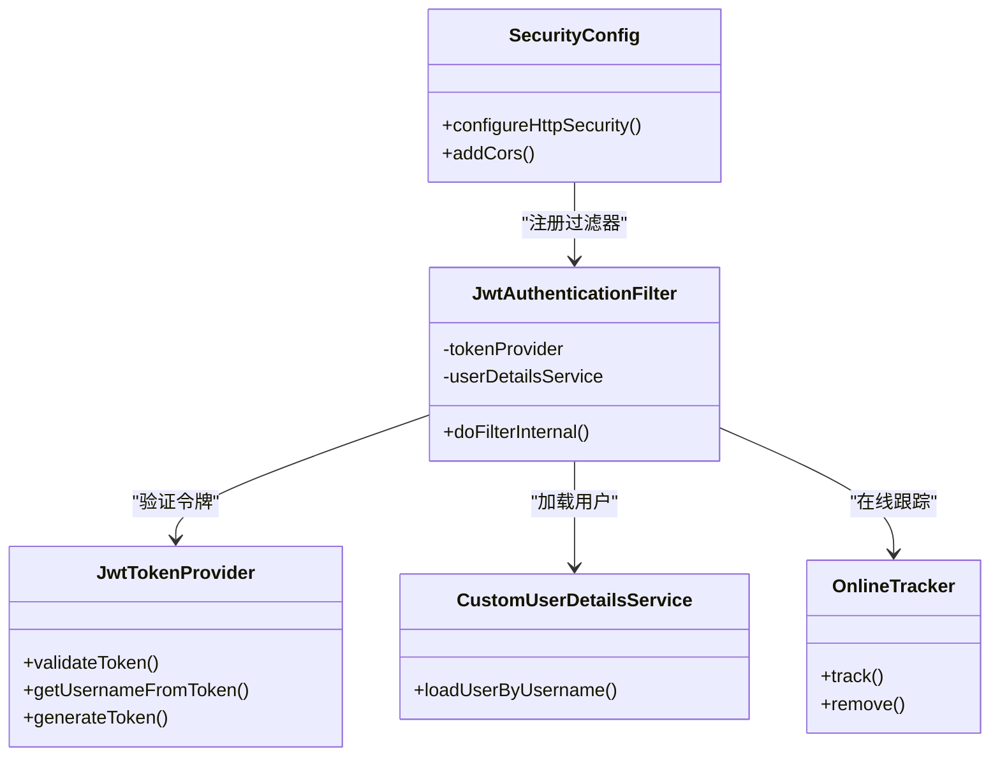
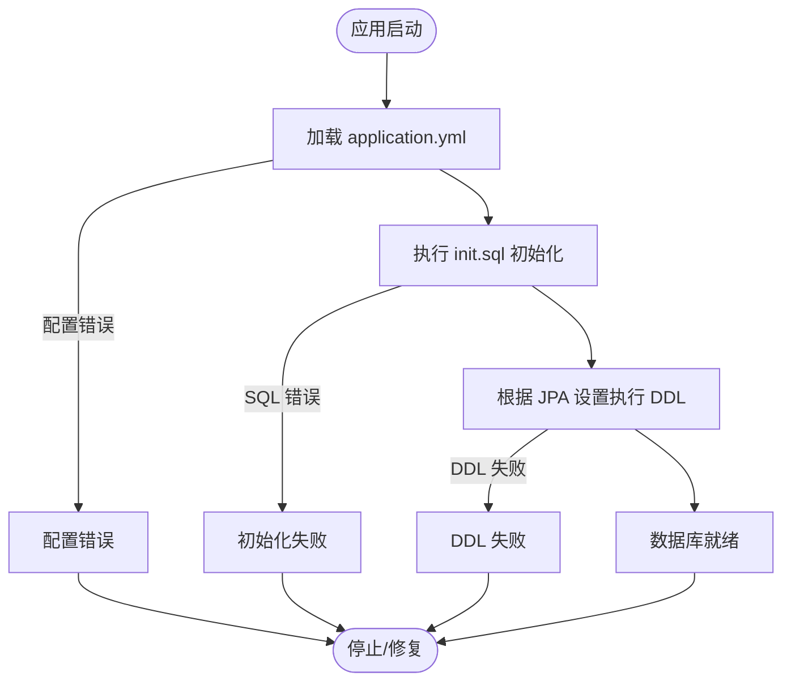
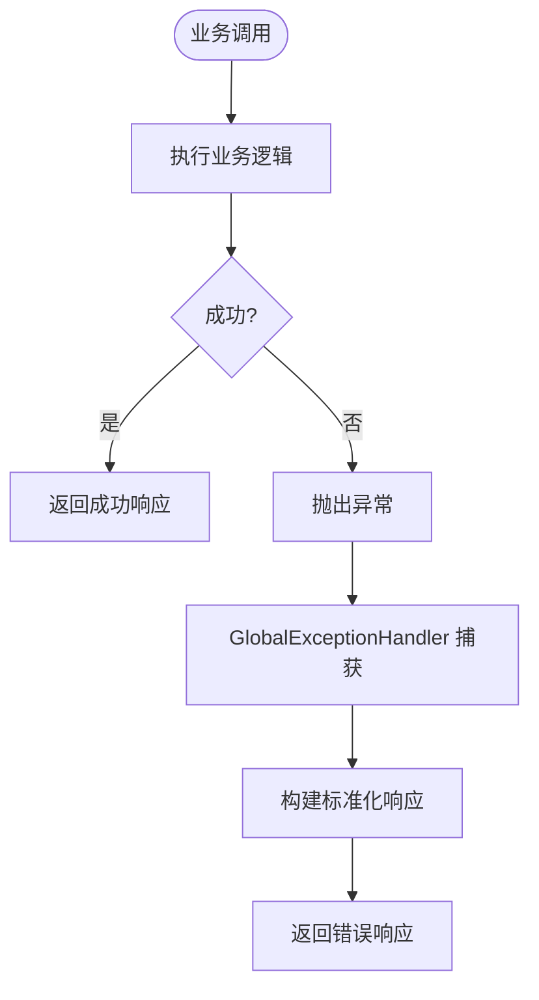
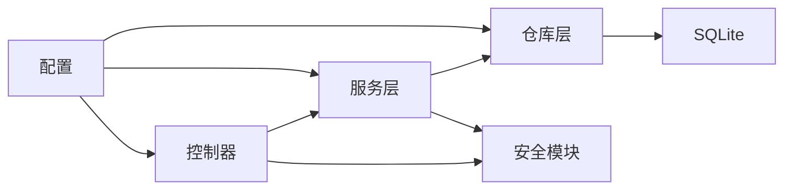

# 故障排除

<cite>
**本文引用的文件**
- [application.yml](file://src/main/resources/application.yml)
- [init.sql](file://src/main/resources/db/init.sql)
- [GlobalExceptionHandler.java](file://src/main/java/com/superpower/common/GlobalExceptionHandler.java)
- [BusinessException.java](file://src/main/java/com/superpower/common/BusinessException.java)
- [ResultCode.java](file://src/main/java/com/superpower/common/ResultCode.java)
- [SecurityConfig.java](file://src/main/java/com/superpower/config/SecurityConfig.java)
- [JwtAuthenticationFilter.java](file://src/main/java/com/superpower/security/JwtAuthenticationFilter.java)
- [JwtTokenProvider.java](file://src/main/java/com/superpower/security/JwtTokenProvider.java)
- [CustomUserDetailsService.java](file://src/main/java/com/superpower/security/CustomUserDetailsService.java)
- [OnlineTracker.java](file://src/main/java/com/superpower/security/OnlineTracker.java)
- [SqliteConfig.java](file://src/main/java/com/superpower/config/SqliteConfig.java)
- [SqliteDialect.java](file://src/main/java/com/superpower/config/SqliteDialect.java)
- [AsyncConfig.java](file://src/main/java/com/superpower/config/AsyncConfig.java)
- [WebMvcConfig.java](file://src/main/java/com/superpower/config/WebMvcConfig.java)
- [AuthController.java](file://src/main/java/com/superpower/modules/system/controller/AuthController.java)
- [SysUserController.java](file://src/main/java/com/superpower/modules/system/controller/SysUserController.java)
- [SysRoleController.java](file://src/main/java/com/superpower/modules/system/controller/SysRoleController.java)
- [OperationLogController.java](file://src/main/java/com/superpower/modules/system/controller/OperationLogController.java)
- [MaintenanceController.java](file://src/main/java/com/superpower/modules/system/controller/MaintenanceController.java)
- [CategoryController.java](file://src/main/java/com/superpower/modules/category/controller/CategoryController.java)
- [ProductController.java](file://src/main/java/com/superpower/modules/category/controller/ProductController.java)
- [DataEntryController.java](file://src/main/java/com/superpower/modules/data/controller/DataEntryController.java)
- [DocumentController.java](file://src/main/java/com/superpower/modules/document/controller/DocumentController.java)
- [ImageResourceController.java](file://src/main/java/com/superpower/modules/image/controller/ImageResourceController.java)
- [RequirementController.java](file://src/main/java/com/superpower/modules/requirement/controller/RequirementController.java)
- [AppVersionController.java](file://src/main/java/com/superpower/modules/version/controller/AppVersionController.java)
- [DataVersionController.java](file://src/main/java/com/superpower/modules/version/controller/DataVersionController.java)
- [SysUserService.java](file://src/main/java/com/superpower/modules/system/service/SysUserService.java)
- [SysRoleService.java](file://src/main/java/com/superpower/modules/system/service/SysRoleService.java)
- [OperationLogService.java](file://src/main/java/com/superpower/modules/system/service/OperationLogService.java)
- [MaintenanceService.java](file://src/main/java/com/superpower/modules/system/service/MaintenanceService.java)
- [CategoryService.java](file://src/main/java/com/superpower/modules/category/service/CategoryService.java)
- [ProductService.java](file://src/main/java/com/superpower/modules/category/service/ProductService.java)
- [DataEntryService.java](file://src/main/java/com/superpower/modules/data/service/DataEntryService.java)
- [DocumentService.java](file://src/main/java/com/superpower/modules/document/service/DocumentService.java)
- [ImageResourceService.java](file://src/main/java/com/superpower/modules/image/service/ImageResourceService.java)
- [RequirementService.java](file://src/main/java/com/superpower/modules/requirement/service/RequirementService.java)
- [DataVersionService.java](file://src/main/java/com/superpower/modules/version/service/DataVersionService.java)
- [VersionService.java](file://src/main/java/com/superpower/modules/version/service/VersionService.java)
- [SysUser.java](file://src/main/java/com/superpower/modules/system/entity/SysUser.java)
- [SysRole.java](file://src/main/java/com/superpower/modules/system/entity/SysRole.java)
- [OperationLog.java](file://src/main/java/com/superpower/modules/system/entity/OperationLog.java)
- [BaseProduct.java](file://src/main/java/com/superpower/modules/category/entity/BaseProduct.java)
- [BaseCategory.java](file://src/main/java/com/superpower/modules/category/entity/BaseCategory.java)
- [DataEntry.java](file://src/main/java/com/superpower/modules/data/entity/DataEntry.java)
- [DocGenRecord.java](file://src/main/java/com/superpower/modules/document/entity/DocGenRecord.java)
- [ImageResource.java](file://src/main/java/com/superpower/modules/image/entity/ImageResource.java)
- [ReqItem.java](file://src/main/java/com/superpower/modules/requirement/entity/ReqItem.java)
- [DataVersion.java](file://src/main/java/com/superpower/modules/version/entity/DataVersion.java)
- [SysUserRepository.java](file://src/main/java/com/superpower/modules/system/repository/SysUserRepository.java)
- [SysRoleRepository.java](file://src/main/java/com/superpower/modules/system/repository/SysRoleRepository.java)
- [OperationLogRepository.java](file://src/main/java/com/superpower/modules/system/repository/OperationLogRepository.java)
- [BaseProductRepository.java](file://src/main/java/com/superpower/modules/category/repository/BaseProductRepository.java)
- [BaseCategoryRepository.java](file://src/main/java/com/superpower/modules/category/repository/BaseCategoryRepository.java)
- [DataEntryRepository.java](file://src/main/java/com/superpower/modules/data/repository/DataEntryRepository.java)
- [DocGenRecordRepository.java](file://src/main/java/com/superpower/modules/document/repository/DocGenRecordRepository.java)
- [ImageResourceRepository.java](file://src/main/java/com/superpower/modules/image/repository/ImageResourceRepository.java)
- [ReqItemRepository.java](file://src/main/java/com/superpower/modules/requirement/repository/ReqItemRepository.java)
- [DataVersionRepository.java](file://src/main/java/com/superpower/modules/version/repository/DataVersionRepository.java)
- [entrypoint.sh](file://docker/entrypoint.sh)
- [Dockerfile](file://Dockerfile)
- [deploy.py](file://deploy.py)
</cite>

## 目录
1. [简介](#简介)
2. [项目结构](#项目结构)
3. [核心组件](#核心组件)
4. [架构总览](#架构总览)
5. [详细组件分析](#详细组件分析)
6. [依赖分析](#依赖分析)
7. [性能考虑](#性能考虑)
8. [故障排除指南](#故障排除指南)
9. [结论](#结论)
10. [附录](#附录)

## 简介
本故障排除文档面向产品清单管理系统的运维与开发人员，聚焦于系统启动失败、数据库连接问题、权限认证故障与性能问题等常见场景，提供系统化诊断方法、日志分析技巧、错误码含义说明与监控指标建议，并给出预防性维护与应急处理预案，帮助快速定位与解决生产问题。

## 项目结构
系统采用前后端分离架构：前端基于 Vue 生态，后端基于 Spring Boot（Java），数据持久层通过 JPA/Hibernate 访问 SQLite 数据库。配置集中在 application.yml 中，异常统一由全局异常处理器处理，安全模块通过 JWT 实现认证与授权过滤。

图表来源
- [application.yml](file://src/main/resources/application.yml)
- [SecurityConfig.java](file://src/main/java/com/superpower/config/SecurityConfig.java)
- [SysUserRepository.java](file://src/main/java/com/superpower/modules/system/repository/SysUserRepository.java)

章节来源
- [application.yml](file://src/main/resources/application.yml)
- [SqliteConfig.java](file://src/main/java/com/superpower/config/SqliteConfig.java)
- [WebMvcConfig.java](file://src/main/java/com/superpower/config/WebMvcConfig.java)

## 核心组件
- 配置与环境
  - 应用配置集中于 application.yml，包含数据库连接、服务器端口、静态资源路径、跨域策略等。
  - SQLite 配置与方言定义位于 SqliteConfig 与 SqliteDialect。
- 安全与认证
  - SecurityConfig 提供安全过滤链配置；JwtAuthenticationFilter 负责拦截请求并校验 JWT；JwtTokenProvider 提供令牌生成与解析能力；CustomUserDetailsService 加载用户详情；OnlineTracker 维护在线状态。
- 异常处理
  - GlobalExceptionHandler 统一捕获控制器与服务层异常，返回标准化响应；ResultCode 定义错误码枚举；BusinessException 用于抛出业务异常。
- 控制器与服务
  - 各模块控制器（如 AuthController、SysUserController、CategoryController、ProductController、DataEntryController、DocumentController、ImageResourceController、RequirementController、AppVersionController、DataVersionController）负责接口编排；对应 Service 执行业务逻辑；Repository 负责数据访问。
- 前端集成
  - 前端通过 API 模块调用后端接口，如 auth.js、product.js、category.js、data.js、document.js、image.js、maintenance.js、operationLog.js、option.js、requirement.js、role.js、user.js、version.js。

章节来源
- [application.yml](file://src/main/resources/application.yml)
- [SecurityConfig.java](file://src/main/java/com/superpower/config/SecurityConfig.java)
- [JwtAuthenticationFilter.java](file://src/main/java/com/superpower/security/JwtAuthenticationFilter.java)
- [JwtTokenProvider.java](file://src/main/java/com/superpower/security/JwtTokenProvider.java)
- [CustomUserDetailsService.java](file://src/main/java/com/superpower/security/CustomUserDetailsService.java)
- [GlobalExceptionHandler.java](file://src/main/java/com/superpower/common/GlobalExceptionHandler.java)
- [ResultCode.java](file://src/main/java/com/superpower/common/ResultCode.java)
- [BusinessException.java](file://src/main/java/com/superpower/common/BusinessException.java)

## 架构总览
下图展示从客户端到后端服务、安全过滤、业务处理与数据访问的整体流程。

图表来源
- [SecurityConfig.java](file://src/main/java/com/superpower/config/SecurityConfig.java)
- [JwtAuthenticationFilter.java](file://src/main/java/com/superpower/security/JwtAuthenticationFilter.java)
- [AuthController.java](file://src/main/java/com/superpower/modules/system/controller/AuthController.java)
- [SysUserService.java](file://src/main/java/com/superpower/modules/system/service/SysUserService.java)
- [SysUserRepository.java](file://src/main/java/com/superpower/modules/system/repository/SysUserRepository.java)

## 详细组件分析

### 安全与认证组件
- 组件职责
  - SecurityConfig：配置安全过滤链、允许的路径、跨域策略。
  - JwtAuthenticationFilter：从请求头提取 JWT 并验证有效性，注入认证信息。
  - JwtTokenProvider：生成与解析 JWT，校验签名与过期时间。
  - CustomUserDetailsService：加载用户详情（含角色与权限）。
  - OnlineTracker：维护在线用户状态与会话跟踪。
- 典型问题
  - 登录成功但后续接口 401/403：检查 JWT 是否正确传递、签名是否有效、过期时间是否合理。
  - 用户信息无法加载：检查用户是否存在、角色权限是否正确配置。
- 诊断步骤
  - 核对 SecurityConfig 的放行路径与拦截范围。
  - 在 JwtAuthenticationFilter 处设置断点，确认 Token 解析与用户详情加载。
  - 使用 Postman 或 curl 验证 Authorization 头是否携带 Bearer Token。

图表来源
- [SecurityConfig.java](file://src/main/java/com/superpower/config/SecurityConfig.java)
- [JwtAuthenticationFilter.java](file://src/main/java/com/superpower/security/JwtAuthenticationFilter.java)
- [JwtTokenProvider.java](file://src/main/java/com/superpower/security/JwtTokenProvider.java)
- [CustomUserDetailsService.java](file://src/main/java/com/superpower/security/CustomUserDetailsService.java)
- [OnlineTracker.java](file://src/main/java/com/superpower/security/OnlineTracker.java)

章节来源
- [SecurityConfig.java](file://src/main/java/com/superpower/config/SecurityConfig.java)
- [JwtAuthenticationFilter.java](file://src/main/java/com/superpower/security/JwtAuthenticationFilter.java)
- [JwtTokenProvider.java](file://src/main/java/com/superpower/security/JwtTokenProvider.java)
- [CustomUserDetailsService.java](file://src/main/java/com/superpower/security/CustomUserDetailsService.java)
- [OnlineTracker.java](file://src/main/java/com/superpower/security/OnlineTracker.java)

### 数据库与初始化
- 组件职责
  - application.yml：定义数据源（SQLite）、JPA 属性、DDL 行为、连接池参数等。
  - init.sql：初始化基础数据（如管理员账户、菜单、角色等）。
  - SqliteConfig/SqliteDialect：配置 SQLite 方言与方言特性。
- 典型问题
  - 启动时报错找不到表或列：检查 init.sql 是否执行、DDL 行为是否允许自动建表。
  - 连接超时或并发写入冲突：检查连接池大小、事务隔离级别、并发写入策略。
- 诊断步骤
  - 查看应用启动日志中是否执行了 init.sql。
  - 使用 sqlite3 命令行检查表结构与数据是否正确。
  - 调整 application.yml 中的数据库连接与 JPA 参数进行压测验证。

图表来源
- [application.yml](file://src/main/resources/application.yml)
- [init.sql](file://src/main/resources/db/init.sql)
- [SqliteConfig.java](file://src/main/java/com/superpower/config/SqliteConfig.java)
- [SqliteDialect.java](file://src/main/java/com/superpower/config/SqliteDialect.java)

章节来源
- [application.yml](file://src/main/resources/application.yml)
- [init.sql](file://src/main/resources/db/init.sql)
- [SqliteConfig.java](file://src/main/java/com/superpower/config/SqliteConfig.java)
- [SqliteDialect.java](file://src/main/java/com/superpower/config/SqliteDialect.java)

### 异常处理与错误码
- 组件职责
  - GlobalExceptionHandler：统一捕获异常，返回标准化响应体。
  - ResultCode：定义错误码枚举（如通用错误、参数错误、鉴权失败、业务异常等）。
  - BusinessException：业务异常基类，便于在服务层抛出可预期错误。
- 典型问题
  - 接口返回 JSON 但字段不一致：检查 GlobalExceptionHandler 是否覆盖所有异常类型。
  - 业务错误码不明确：核对 ResultCode 与 BusinessException 抛出的错误码是否匹配。
- 诊断步骤
  - 在控制器或服务层抛出异常时，确认是否被 GlobalExceptionHandler 捕获。
  - 对照 ResultCode 枚举，确认错误码语义与前端提示一致。

图表来源
- [GlobalExceptionHandler.java](file://src/main/java/com/superpower/common/GlobalExceptionHandler.java)
- [ResultCode.java](file://src/main/java/com/superpower/common/ResultCode.java)
- [BusinessException.java](file://src/main/java/com/superpower/common/BusinessException.java)

章节来源
- [GlobalExceptionHandler.java](file://src/main/java/com/superpower/common/GlobalExceptionHandler.java)
- [ResultCode.java](file://src/main/java/com/superpower/common/ResultCode.java)
- [BusinessException.java](file://src/main/java/com/superpower/common/BusinessException.java)

### 控制器与服务层
- 组件职责
  - 控制器：接收请求、参数校验、调用服务、组装响应。
  - 服务层：实现业务规则、事务控制、调用仓库。
  - 仓库层：JPA Repository 封装数据库访问。
- 典型问题
  - 控制器无响应或 404：检查路由映射、包扫描、注解配置。
  - 服务层事务失效：检查事务注解、异常吞掉、嵌套调用。
  - 查询慢或内存溢出：检查分页、索引、批量操作。
- 诊断步骤
  - 使用 Swagger 或 Postman 验证接口可用性与参数。
  - 在服务层添加日志，定位耗时环节。
  - 使用数据库 EXPLAIN 分析慢查询。

章节来源
- [AuthController.java](file://src/main/java/com/superpower/modules/system/controller/AuthController.java)
- [SysUserService.java](file://src/main/java/com/superpower/modules/system/service/SysUserService.java)
- [SysUserRepository.java](file://src/main/java/com/superpower/modules/system/repository/SysUserRepository.java)

## 依赖分析
- 组件耦合
  - 控制器依赖服务层；服务层依赖仓库层；仓库层依赖 JPA/Hibernate 与 SQLite。
  - 安全模块贯穿控制器与服务层，形成横切关注点。
- 外部依赖
  - 数据库：SQLite（本地/容器内）。
  - 前端：Vue 生态（Vite 构建）。
  - 部署：Dockerfile 与 entrypoint.sh。
- 潜在风险
  - 配置分散在多处（application.yml、各模块配置类），需统一管理。
  - SQLite 不适合高并发写入，需评估迁移方案。

图表来源
- [application.yml](file://src/main/resources/application.yml)
- [SecurityConfig.java](file://src/main/java/com/superpower/config/SecurityConfig.java)
- [SysUserRepository.java](file://src/main/java/com/superpower/modules/system/repository/SysUserRepository.java)

章节来源
- [application.yml](file://src/main/resources/application.yml)
- [SecurityConfig.java](file://src/main/java/com/superpower/config/SecurityConfig.java)
- [SqliteConfig.java](file://src/main/java/com/superpower/config/SqliteConfig.java)

## 性能考虑
- 数据库层面
  - 合理设置连接池大小与超时时间，避免连接泄漏。
  - 为高频查询字段建立索引，避免全表扫描。
  - 使用分页查询与批量操作，减少单次请求数据量。
- 应用层面
  - 控制器与服务层避免 N+1 查询，使用 JOIN 或批量加载。
  - 对热点数据引入缓存（如 Redis），降低数据库压力。
  - 异步任务处理耗时操作（如导出、报表生成）。
- 监控指标建议
  - QPS、P95/P99 延迟、错误率、数据库连接数、线程池队列长度、GC 时间占比。
- 预防性维护
  - 定期清理日志与临时文件，释放磁盘空间。
  - 对数据库执行定期备份与一致性检查。
  - 对热点接口进行容量规划与压测。

## 故障排除指南

### 启动失败
- 现象
  - 应用启动报错，无法进入监听状态。
- 可能原因
  - 配置文件缺失或格式错误（application.yml）。
  - 数据库初始化脚本执行失败（init.sql）。
  - 端口被占用或权限不足。
  - 依赖未正确打包（Docker/部署脚本）。
- 诊断步骤
  - 检查 application.yml 的语法与关键键值（数据库、端口、静态资源）。
  - 查看启动日志中 init.sql 是否执行成功。
  - 使用 netstat/lsof 检查端口占用。
  - 使用 docker logs 查看容器启动日志。
- 快速修复
  - 修正 application.yml 后重启服务。
  - 手动执行 init.sql 或修复脚本后重启。
  - 更换端口或以 root 权限运行（不推荐）。
  - 重新构建镜像并部署。

章节来源
- [application.yml](file://src/main/resources/application.yml)
- [init.sql](file://src/main/resources/db/init.sql)
- [entrypoint.sh](file://docker/entrypoint.sh)
- [Dockerfile](file://Dockerfile)
- [deploy.py](file://deploy.py)

### 数据库连接问题
- 现象
  - 启动阶段卡住或报数据库连接异常；运行中出现连接超时。
- 可能原因
  - 数据库文件损坏或权限不足。
  - 连接池配置不当（最大连接数、超时时间）。
  - 并发写入导致锁冲突。
- 诊断步骤
  - 使用 sqlite3 命令行打开数据库文件，确认可读写。
  - 检查 application.yml 中数据库驱动与连接串。
  - 查看连接池参数与线程池状态。
- 快速修复
  - 修复数据库文件权限或替换为健康副本。
  - 调整连接池大小与超时阈值。
  - 优化写入策略，减少并发写入峰值。

章节来源
- [application.yml](file://src/main/resources/application.yml)
- [SqliteConfig.java](file://src/main/java/com/superpower/config/SqliteConfig.java)
- [SqliteDialect.java](file://src/main/java/com/superpower/config/SqliteDialect.java)

### 权限认证故障
- 现象
  - 登录成功但访问受保护接口返回 401/403；用户角色无效。
- 可能原因
  - JWT 未正确传递或已过期。
  - 用户不存在或角色未分配。
  - 安全过滤链配置错误，拦截路径不当。
- 诊断步骤
  - 确认请求头中携带 Authorization: Bearer <token>。
  - 校验 token 是否过期、签名是否有效。
  - 检查用户角色与权限是否正确配置。
  - 核对 SecurityConfig 的放行与拦截路径。
- 快速修复
  - 重新登录获取新 token。
  - 修复用户角色与权限配置。
  - 修正安全过滤链配置。

章节来源
- [JwtAuthenticationFilter.java](file://src/main/java/com/superpower/security/JwtAuthenticationFilter.java)
- [JwtTokenProvider.java](file://src/main/java/com/superpower/security/JwtTokenProvider.java)
- [CustomUserDetailsService.java](file://src/main/java/com/superpower/security/CustomUserDetailsService.java)
- [SecurityConfig.java](file://src/main/java/com/superpower/config/SecurityConfig.java)

### 性能问题
- 现象
  - 接口响应缓慢；数据库查询慢；CPU/内存占用高。
- 可能原因
  - 缺少索引或查询复杂度过高。
  - 未使用分页或一次性加载过多数据。
  - 事务范围过大或嵌套调用导致锁竞争。
- 诊断步骤
  - 使用数据库 EXPLAIN 分析慢查询。
  - 在服务层添加耗时日志，定位瓶颈。
  - 监控线程池队列长度与 GC 时间占比。
- 快速修复
  - 为高频查询字段加索引。
  - 引入分页与批量处理。
  - 优化事务边界，减少锁持有时间。

章节来源
- [DataEntryService.java](file://src/main/java/com/superpower/modules/data/service/DataEntryService.java)
- [ProductService.java](file://src/main/java/com/superpower/modules/category/service/ProductService.java)
- [AsyncConfig.java](file://src/main/java/com/superpower/config/AsyncConfig.java)

### 日志分析方法
- 关键日志位置
  - 后端服务日志：查看启动日志、业务日志、异常栈。
  - 前端浏览器控制台：查看网络请求错误与响应。
  - Docker 容器日志：docker logs <container>。
- 分析要点
  - 时间戳对齐：将前端请求时间与后端日志时间对齐。
  - 错误码定位：结合 ResultCode 与异常类型快速定位。
  - 调用链追踪：从前端到后端再到数据库的完整链路。
- 工具建议
  - 使用 ELK 或 Loki/Grafana 进行日志聚合与可视化。
  - 对高频错误设置告警阈值。

章节来源
- [GlobalExceptionHandler.java](file://src/main/java/com/superpower/common/GlobalExceptionHandler.java)
- [entrypoint.sh](file://docker/entrypoint.sh)

### 错误码含义
- 通用错误
  - 参数错误、业务异常、系统内部错误等，具体枚举见 ResultCode。
- 认证与授权
  - 未登录、Token 无效、权限不足等，通常由安全过滤器或业务层抛出。
- 数据访问
  - 数据库连接异常、SQL 执行失败、主键冲突等。
- 建议
  - 前后端约定统一的错误码与提示文本，避免歧义。

章节来源
- [ResultCode.java](file://src/main/java/com/superpower/common/ResultCode.java)
- [BusinessException.java](file://src/main/java/com/superpower/common/BusinessException.java)

### 系统监控指标
- 应用层
  - QPS、响应时间分布、错误率、线程池队列长度、堆内存使用。
- 数据库层
  - 连接数、慢查询数量、锁等待时间、磁盘 IO。
- 前端层
  - 页面加载时间、接口成功率、错误分布。
- 建议
  - 结合 Prometheus + Grafana 或云监控平台进行统一观测。

### 预防性维护与应急处理
- 预防性维护
  - 定期备份数据库与配置文件。
  - 对热点接口进行容量评估与压测。
  - 清理日志与临时文件，保持磁盘空间充足。
- 应急处理预案
  - 启动失败：回滚最近一次变更，检查配置与依赖。
  - 数据库异常：切换只读模式，恢复备份，排查锁与连接。
  - 认证异常：重置关键用户密码，检查密钥与时间同步。
  - 性能异常：降级非关键功能，启用缓存，扩容实例。

## 结论
通过统一的配置管理、完善的安全过滤链、标准化的异常处理与可观测的日志体系，产品清单管理系统能够在多数故障场景下快速定位并恢复。建议持续优化数据库索引与查询、加强缓存与异步化改造，并建立完善的监控与告警机制，确保系统长期稳定运行。

## 附录
- 常用命令
  - 启动服务：java -jar app.jar 或 docker run。
  - 查看日志：docker logs <container>。
  - 进入容器：docker exec -it <container> /bin/bash。
  - 数据库检查：sqlite3 database.db；.tables；.schema。
- 参考文件
  - application.yml：应用配置中心。
  - init.sql：数据库初始化脚本。
  - Dockerfile/entrypoint.sh/deploy.py：容器化与部署脚本。